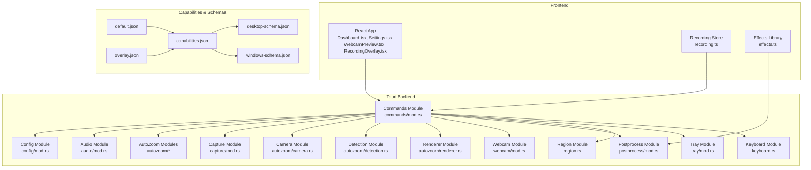
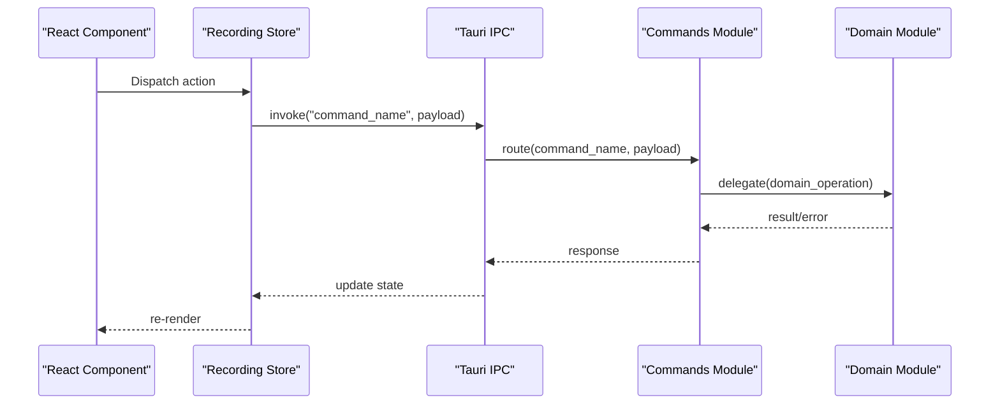
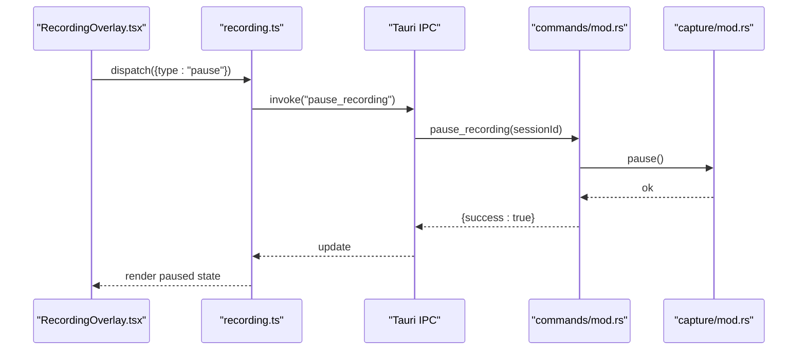
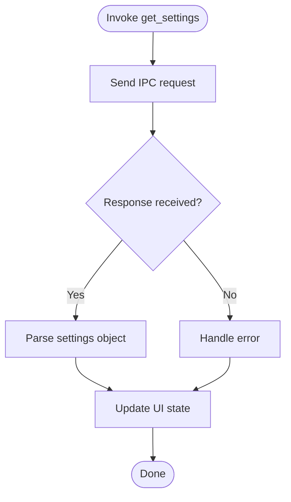
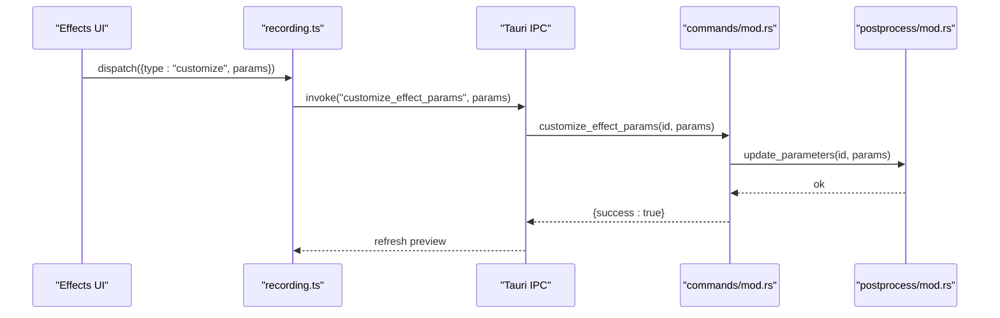
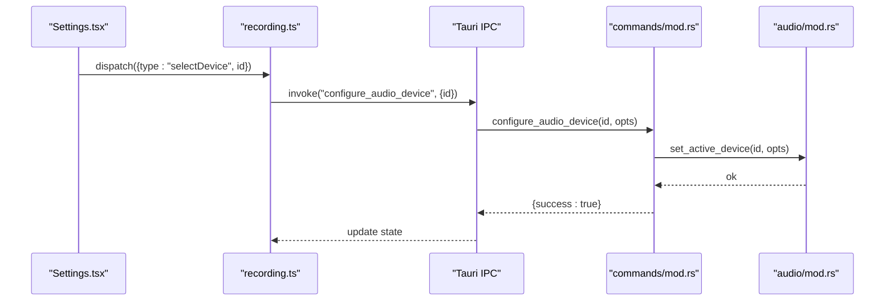
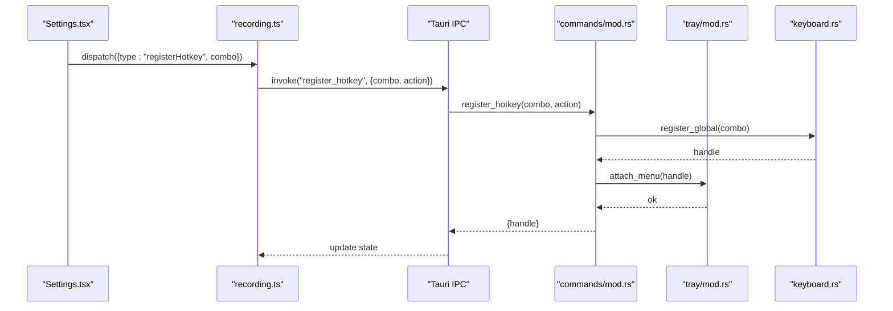
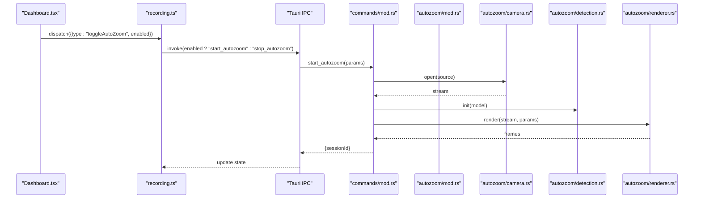
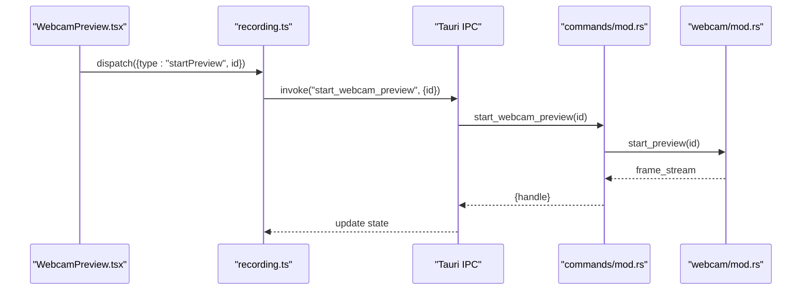
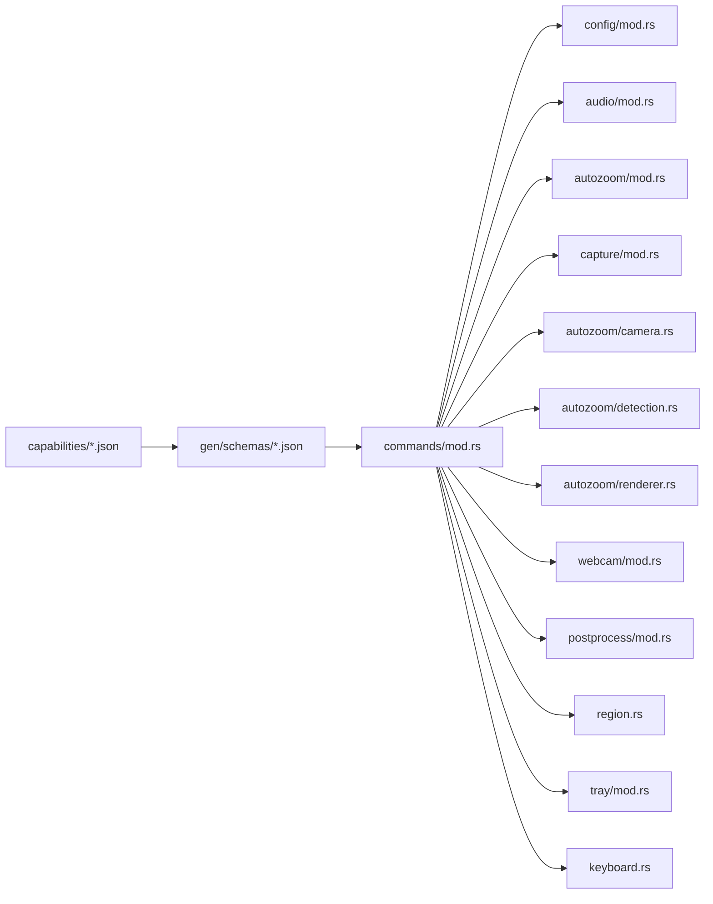

# API Reference

<cite>
**Referenced Files in This Document**
- [tauri.conf.json](file://src-tauri/tauri.conf.json)
- [Cargo.toml](file://src-tauri/Cargo.toml)
- [lib.rs](file://src-tauri/src/lib.rs)
- [main.rs](file://src-tauri/src/main.rs)
- [commands/mod.rs](file://src-tauri/src/commands/mod.rs)
- [config/mod.rs](file://src-tauri/src/config/mod.rs)
- [tray/mod.rs](file://src-tauri/src/tray/mod.rs)
- [keyboard.rs](file://src-tauri/src/keyboard.rs)
- [audio/mod.rs](file://src-tauri/src/audio/mod.rs)
- [autozoom/mod.rs](file://src-tauri/src/autozoom/mod.rs)
- [autozoom/camera.rs](file://src-tauri/src/autozoom/camera.rs)
- [autozoom/detection.rs](file://src-tauri/src/autozoom/detection.rs)
- [autozoom/renderer.rs](file://src-tauri/src/autozoom/renderer.rs)
- [capture/mod.rs](file://src-tauri/src/capture/mod.rs)
- [webcam/mod.rs](file://src-tauri/src/webcam/mod.rs)
- [postprocess/mod.rs](file://src-tauri/src/postprocess/mod.rs)
- [region.rs](file://src-tauri/src/region.rs)
- [capabilities/default.json](file://src-tauri/capabilities/default.json)
- [capabilities/overlay.json](file://src-tauri/capabilities/overlay.json)
- [gen/schemas/capabilities.json](file://src-tauri/gen/schemas/capabilities.json)
- [gen/schemas/desktop-schema.json](file://src-tauri/gen/schemas/desktop-schema.json)
- [gen/schemas/windows-schema.json](file://src-tauri/gen/schemas/windows-schema.json)
- [stores/recording.ts](file://src/stores/recording.ts)
- [components/Dashboard.tsx](file://src/components/Dashboard.tsx)
- [components/Settings.tsx](file://src/components/Settings.tsx)
- [components/WebcamPreview.tsx](file://src/components/WebcamPreview.tsx)
- [components/RecordingOverlay.tsx](file://src/components/RecordingOverlay.tsx)
- [lib/effects.ts](file://src/lib/effects.ts)
</cite>

## Table of Contents
1. [Introduction](#introduction)
2. [Project Structure](#project-structure)
3. [Core Components](#core-components)
4. [Architecture Overview](#architecture-overview)
5. [Detailed Component Analysis](#detailed-component-analysis)
6. [Dependency Analysis](#dependency-analysis)
7. [Performance Considerations](#performance-considerations)
8. [Troubleshooting Guide](#troubleshooting-guide)
9. [Conclusion](#conclusion)
10. [Appendices](#appendices)

## Introduction
This document provides a comprehensive API reference for EasySpecy’s Tauri command system and internal APIs. It covers public Tauri commands for recording control, configuration management, visual effects, audio processing, and system integration. It also documents IPC communication patterns, capability declarations, security considerations, and frontend TypeScript interfaces that wrap backend commands. The goal is to enable developers to integrate with EasySpecy’s backend safely and effectively from the React/TypeScript frontend.

## Project Structure
EasySpecy is a Tauri application with a Rust backend and a TypeScript/React frontend. The backend exposes commands via Tauri’s IPC layer, while the frontend invokes these commands through generated bindings. Capabilities define which commands are permitted in different contexts (e.g., default app vs. overlay window). Schemas describe the allowed capabilities and platform-specific permissions.

**Diagram sources**
- [lib.rs](file://src-tauri/src/lib.rs)
- [main.rs](file://src-tauri/src/main.rs)
- [commands/mod.rs](file://src-tauri/src/commands/mod.rs)
- [config/mod.rs](file://src-tauri/src/config/mod.rs)
- [audio/mod.rs](file://src-tauri/src/audio/mod.rs)
- [autozoom/mod.rs](file://src-tauri/src/autozoom/mod.rs)
- [autozoom/camera.rs](file://src-tauri/src/autozoom/camera.rs)
- [autozoom/detection.rs](file://src-tauri/src/autozoom/detection.rs)
- [autozoom/renderer.rs](file://src-tauri/src/autozoom/renderer.rs)
- [capture/mod.rs](file://src-tauri/src/capture/mod.rs)
- [webcam/mod.rs](file://src-tauri/src/webcam/mod.rs)
- [postprocess/mod.rs](file://src-tauri/src/postprocess/mod.rs)
- [region.rs](file://src-tauri/src/region.rs)
- [tray/mod.rs](file://src-tauri/src/tray/mod.rs)
- [keyboard.rs](file://src-tauri/src/keyboard.rs)
- [capabilities/default.json](file://src-tauri/capabilities/default.json)
- [capabilities/overlay.json](file://src-tauri/capabilities/overlay.json)
- [gen/schemas/capabilities.json](file://src-tauri/gen/schemas/capabilities.json)
- [gen/schemas/desktop-schema.json](file://src-tauri/gen/schemas/desktop-schema.json)
- [gen/schemas/windows-schema.json](file://src-tauri/gen/schemas/windows-schema.json)

**Section sources**
- [lib.rs](file://src-tauri/src/lib.rs)
- [main.rs](file://src-tauri/src/main.rs)
- [tauri.conf.json](file://src-tauri/tauri.conf.json)
- [Cargo.toml](file://src-tauri/Cargo.toml)

## Core Components
- Commands module: Declares and implements all public Tauri commands invoked by the frontend.
- Config module: Manages persistent settings and provides get/set operations exposed via commands.
- Audio module: Provides audio device configuration and level monitoring commands.
- AutoZoom modules: Camera capture, detection pipeline, and rendering for automatic zoom features.
- Capture module: Core screen/camera capture orchestration.
- Webcam module: Webcam-specific capture and preview.
- Postprocess module: Applies visual effects and manages effect parameters.
- Region module: Defines selection regions and geometry.
- Tray module: System tray integration and lifecycle management.
- Keyboard module: Hotkey registration and event handling.
- Capabilities and schemas: Define which commands are allowed per context and platform.

**Section sources**
- [commands/mod.rs](file://src-tauri/src/commands/mod.rs)
- [config/mod.rs](file://src-tauri/src/config/mod.rs)
- [audio/mod.rs](file://src-tauri/src/audio/mod.rs)
- [autozoom/mod.rs](file://src-tauri/src/autozoom/mod.rs)
- [capture/mod.rs](file://src-tauri/src/capture/mod.rs)
- [webcam/mod.rs](file://src-tauri/src/webcam/mod.rs)
- [postprocess/mod.rs](file://src-tauri/src/postprocess/mod.rs)
- [region.rs](file://src-tauri/src/region.rs)
- [tray/mod.rs](file://src-tauri/src/tray/mod.rs)
- [keyboard.rs](file://src-tauri/src/keyboard.rs)
- [capabilities/default.json](file://src-tauri/capabilities/default.json)
- [capabilities/overlay.json](file://src-tauri/capabilities/overlay.json)
- [gen/schemas/capabilities.json](file://src-tauri/gen/schemas/capabilities.json)
- [gen/schemas/desktop-schema.json](file://src-tauri/gen/schemas/desktop-schema.json)
- [gen/schemas/windows-schema.json](file://src-tauri/gen/schemas/windows-schema.json)

## Architecture Overview
The frontend invokes Tauri commands through generated bindings. Commands route to domain-specific modules (config, audio, autozoom, capture, webcam, postprocess, region, tray, keyboard). Capabilities restrict which commands are callable in which contexts. Schemas validate capabilities and platform permissions.

**Diagram sources**
- [lib.rs](file://src-tauri/src/lib.rs)
- [main.rs](file://src-tauri/src/main.rs)
- [commands/mod.rs](file://src-tauri/src/commands/mod.rs)
- [stores/recording.ts](file://src/stores/recording.ts)

## Detailed Component Analysis

### Recording Control Commands
These commands manage recording lifecycle and state.

- Command: start_recording
  - Purpose: Begin recording with selected sources and parameters.
  - Parameters: See schema for required fields (e.g., source identifiers, region geometry).
  - Returns: Success indicator or recording session identifier.
  - Errors: Invalid parameters, missing sources, permission denied, resource conflicts.
  - Usage example: Trigger from a dashboard button; update UI state upon completion.
  - IPC pattern: Frontend dispatches action; store invokes command; backend starts capture pipeline.
  - Security: Requires appropriate capabilities for capture and overlay contexts.

- Command: stop_recording
  - Purpose: Stop current recording and finalize output.
  - Parameters: Session identifier (if applicable).
  - Returns: Finalization status and output metadata.
  - Errors: No active recording, I/O errors during write.
  - Usage example: Call from stop button; show completion toast.
  - IPC pattern: Same as start_recording but reverses state.

- Command: pause_recording
  - Purpose: Pause ongoing recording without finalizing.
  - Parameters: Session identifier.
  - Returns: Paused state confirmation.
  - Errors: Not paused, invalid session.
  - Usage example: Toggle pause state in UI controls.

- Command: resume_recording
  - Purpose: Resume a previously paused recording.
  - Parameters: Session identifier.
  - Returns: Resumed state confirmation.
  - Errors: Not paused, invalid session.
  - Usage example: Resume after temporary interruption.

- Command: set_recording_region
  - Purpose: Set or update the capture region for recording.
  - Parameters: Region geometry definition.
  - Returns: Confirmation and effective region.
  - Errors: Invalid geometry, out-of-bounds.
  - Usage example: From region selector component.

**Diagram sources**
- [components/RecordingOverlay.tsx](file://src/components/RecordingOverlay.tsx)
- [stores/recording.ts](file://src/stores/recording.ts)
- [commands/mod.rs](file://src-tauri/src/commands/mod.rs)
- [capture/mod.rs](file://src-tauri/src/capture/mod.rs)

**Section sources**
- [commands/mod.rs](file://src-tauri/src/commands/mod.rs)
- [capture/mod.rs](file://src-tauri/src/capture/mod.rs)
- [region.rs](file://src-tauri/src/region.rs)
- [components/RecordingOverlay.tsx](file://src/components/RecordingOverlay.tsx)
- [stores/recording.ts](file://src/stores/recording.ts)

### Configuration Management Commands
Manage persistent settings and preferences.

- Command: get_settings
  - Purpose: Retrieve current application settings.
  - Parameters: None.
  - Returns: Settings object (schema-defined fields).
  - Errors: Internal failure, corrupted storage.
  - Usage example: Load initial settings in Settings panel.

- Command: set_settings
  - Purpose: Update application settings.
  - Parameters: Partial settings object.
  - Returns: Success confirmation.
  - Errors: Validation failure, unsupported keys.
  - Usage example: Save user preferences from Settings form.

- Command: reset_settings
  - Purpose: Reset settings to defaults.
  - Parameters: None.
  - Returns: Success confirmation.
  - Errors: Write failure.
  - Usage example: Provide “Reset” button in Settings.

**Diagram sources**
- [commands/mod.rs](file://src-tauri/src/commands/mod.rs)
- [config/mod.rs](file://src-tauri/src/config/mod.rs)

**Section sources**
- [commands/mod.rs](file://src-tauri/src/commands/mod.rs)
- [config/mod.rs](file://src-tauri/src/config/mod.rs)
- [components/Settings.tsx](file://src/components/Settings.tsx)

### Visual Effects Control Commands
Apply and customize visual effects.

- Command: apply_effects
  - Purpose: Apply a named effect chain to captured frames.
  - Parameters: Effect chain definition (order, parameters).
  - Returns: Applied effect identifiers.
  - Errors: Unknown effect, invalid parameters.
  - Usage example: From effects library UI.

- Command: customize_effect_params
  - Purpose: Adjust parameters for a specific effect.
  - Parameters: Effect identifier and parameter map.
  - Returns: Updated parameter set.
  - Errors: Effect not applied, invalid parameter keys/values.
  - Usage example: Slider or input updates.

- Command: list_available_effects
  - Purpose: Enumerate supported effects.
  - Parameters: None.
  - Returns: Array of effect descriptors.
  - Errors: Internal enumeration failure.
  - Usage example: Populate dropdown menus.

**Diagram sources**
- [lib/effects.ts](file://src/lib/effects.ts)
- [stores/recording.ts](file://src/stores/recording.ts)
- [commands/mod.rs](file://src-tauri/src/commands/mod.rs)
- [postprocess/mod.rs](file://src-tauri/src/postprocess/mod.rs)

**Section sources**
- [commands/mod.rs](file://src-tauri/src/commands/mod.rs)
- [postprocess/mod.rs](file://src-tauri/src/postprocess/mod.rs)
- [lib/effects.ts](file://src/lib/effects.ts)

### Audio Processing Commands
Configure audio devices and monitor levels.

- Command: list_audio_devices
  - Purpose: Enumerate input/output devices.
  - Parameters: Device kind filter (input/output/all).
  - Returns: Array of device descriptors.
  - Errors: Platform enumeration failure.
  - Usage example: Populate device selection dropdowns.

- Command: configure_audio_device
  - Purpose: Select and configure active audio device.
  - Parameters: Device identifier and optional settings.
  - Returns: Confirmation and active configuration.
  - Errors: Device unavailable, invalid settings.
  - Usage example: Save selection from Settings.

- Command: monitor_audio_level
  - Purpose: Stream real-time audio level metering.
  - Parameters: Device identifier and sampling interval.
  - Returns: Continuous stream of level samples.
  - Errors: Device busy, permission denied.
  - Usage example: Render waveform or bar meters.

**Diagram sources**
- [components/Settings.tsx](file://src/components/Settings.tsx)
- [stores/recording.ts](file://src/stores/recording.ts)
- [commands/mod.rs](file://src-tauri/src/commands/mod.rs)
- [audio/mod.rs](file://src-tauri/src/audio/mod.rs)

**Section sources**
- [commands/mod.rs](file://src-tauri/src/commands/mod.rs)
- [audio/mod.rs](file://src-tauri/src/audio/mod.rs)
- [components/Settings.tsx](file://src/components/Settings.tsx)

### System Integration Commands
Hotkey registration and tray management.

- Command: register_hotkey
  - Purpose: Register a global hotkey for triggering actions.
  - Parameters: Hotkey combination and action identifier.
  - Returns: Registration result and hotkey handle.
  - Errors: Combination invalid, already registered, OS-level failure.
  - Usage example: From Settings hotkey input.

- Command: unregister_hotkey
  - Purpose: Unregister a previously registered hotkey.
  - Parameters: Hotkey handle.
  - Returns: Unregistration result.
  - Errors: Handle invalid, not found.
  - Usage example: On settings change or shutdown.

- Command: create_tray
  - Purpose: Initialize system tray with menu items.
  - Parameters: Tray icon, tooltip, menu entries.
  - Returns: Tray handle.
  - Errors: OS tray unavailable, icon invalid.
  - Usage example: On app startup.

- Command: destroy_tray
  - Purpose: Remove tray and associated handlers.
  - Parameters: Tray handle.
  - Returns: Destruction result.
  - Errors: Handle invalid.
  - Usage example: On app exit.

**Diagram sources**
- [components/Settings.tsx](file://src/components/Settings.tsx)
- [stores/recording.ts](file://src/stores/recording.ts)
- [commands/mod.rs](file://src-tauri/src/commands/mod.rs)
- [tray/mod.rs](file://src-tauri/src/tray/mod.rs)
- [keyboard.rs](file://src-tauri/src/keyboard.rs)

**Section sources**
- [commands/mod.rs](file://src-tauri/src/commands/mod.rs)
- [tray/mod.rs](file://src-tauri/src/tray/mod.rs)
- [keyboard.rs](file://src-tauri/src/keyboard.rs)
- [components/Settings.tsx](file://src/components/Settings.tsx)

### AutoZoom Commands
Automatic zoom pipeline for camera feeds.

- Command: start_autozoom
  - Purpose: Start automatic zoom based on detection.
  - Parameters: Camera source, detection model, rendering options.
  - Returns: Session identifier.
  - Errors: Camera busy, model load failure, detection disabled.
  - Usage example: From AutoZoom toggle.

- Command: stop_autozoom
  - Purpose: Stop automatic zoom.
  - Parameters: Session identifier.
  - Returns: Stop confirmation.
  - Errors: Invalid session.
  - Usage example: From AutoZoom toggle.

- Command: set_autozoom_params
  - Purpose: Tune detection and rendering parameters.
  - Parameters: Parameter map (thresholds, smoothing, etc.).
  - Returns: Updated parameters.
  - Errors: Invalid parameter keys.
  - Usage example: From AutoZoom settings panel.

**Diagram sources**
- [components/Dashboard.tsx](file://src/components/Dashboard.tsx)
- [stores/recording.ts](file://src/stores/recording.ts)
- [commands/mod.rs](file://src-tauri/src/commands/mod.rs)
- [autozoom/mod.rs](file://src-tauri/src/autozoom/mod.rs)
- [autozoom/camera.rs](file://src-tauri/src/autozoom/camera.rs)
- [autozoom/detection.rs](file://src-tauri/src/autozoom/detection.rs)
- [autozoom/renderer.rs](file://src-tauri/src/autozoom/renderer.rs)

**Section sources**
- [commands/mod.rs](file://src-tauri/src/commands/mod.rs)
- [autozoom/mod.rs](file://src-tauri/src/autozoom/mod.rs)
- [autozoom/camera.rs](file://src-tauri/src/autozoom/camera.rs)
- [autozoom/detection.rs](file://src-tauri/src/autozoom/detection.rs)
- [autozoom/renderer.rs](file://src-tauri/src/autozoom/renderer.rs)
- [components/Dashboard.tsx](file://src/components/Dashboard.tsx)

### WebCam Preview Commands
Manage webcam capture and preview.

- Command: start_webcam_preview
  - Purpose: Start preview from selected webcam.
  - Parameters: Camera identifier and resolution.
  - Returns: Preview handle.
  - Errors: Camera busy, permission denied.
  - Usage example: From WebcamPreview component.

- Command: stop_webcam_preview
  - Purpose: Stop preview.
  - Parameters: Preview handle.
  - Returns: Stop confirmation.
  - Errors: Handle invalid.
  - Usage example: On unmount or switch.

- Command: list_webcams
  - Purpose: Enumerate available webcams.
  - Parameters: None.
  - Returns: Array of camera descriptors.
  - Errors: Enumeration failure.
  - Usage example: Populate camera selection.

**Diagram sources**
- [components/WebcamPreview.tsx](file://src/components/WebcamPreview.tsx)
- [stores/recording.ts](file://src/stores/recording.ts)
- [commands/mod.rs](file://src-tauri/src/commands/mod.rs)
- [webcam/mod.rs](file://src-tauri/src/webcam/mod.rs)

**Section sources**
- [commands/mod.rs](file://src-tauri/src/commands/mod.rs)
- [webcam/mod.rs](file://src-tauri/src/webcam/mod.rs)
- [components/WebcamPreview.tsx](file://src/components/WebcamPreview.tsx)

### IPC Communication Patterns and Frontend Interfaces
- Frontend store pattern: The recording store coordinates command invocations and state updates. It dispatches actions that trigger IPC calls and handles responses to update UI.
- Error propagation: Commands return structured results; the store maps errors to user-visible messages and logs.
- Capability-aware invocation: Commands are gated by capabilities; attempting to call a restricted command yields a capability error.
- Type safety: Generated schemas and capability definitions enforce parameter and return value shapes.

Example usage references:
- Start recording from a dashboard component.
- Configure audio device from settings.
- Toggle AutoZoom from the dashboard.
- Manage webcam preview from the webcam component.
- Customize effects from the effects library.

**Section sources**
- [stores/recording.ts](file://src/stores/recording.ts)
- [components/Dashboard.tsx](file://src/components/Dashboard.tsx)
- [components/Settings.tsx](file://src/components/Settings.tsx)
- [components/WebcamPreview.tsx](file://src/components/WebcamPreview.tsx)
- [components/RecordingOverlay.tsx](file://src/components/RecordingOverlay.tsx)
- [lib/effects.ts](file://src/lib/effects.ts)

## Dependency Analysis
The commands module acts as the central router for all IPC invocations. It depends on domain modules for implementation and relies on capabilities and schemas for permission enforcement.

**Diagram sources**
- [commands/mod.rs](file://src-tauri/src/commands/mod.rs)
- [config/mod.rs](file://src-tauri/src/config/mod.rs)
- [audio/mod.rs](file://src-tauri/src/audio/mod.rs)
- [autozoom/mod.rs](file://src-tauri/src/autozoom/mod.rs)
- [autozoom/camera.rs](file://src-tauri/src/autozoom/camera.rs)
- [autozoom/detection.rs](file://src-tauri/src/autozoom/detection.rs)
- [autozoom/renderer.rs](file://src-tauri/src/autozoom/renderer.rs)
- [capture/mod.rs](file://src-tauri/src/capture/mod.rs)
- [webcam/mod.rs](file://src-tauri/src/webcam/mod.rs)
- [postprocess/mod.rs](file://src-tauri/src/postprocess/mod.rs)
- [region.rs](file://src-tauri/src/region.rs)
- [tray/mod.rs](file://src-tauri/src/tray/mod.rs)
- [keyboard.rs](file://src-tauri/src/keyboard.rs)
- [capabilities/default.json](file://src-tauri/capabilities/default.json)
- [capabilities/overlay.json](file://src-tauri/capabilities/overlay.json)
- [gen/schemas/capabilities.json](file://src-tauri/gen/schemas/capabilities.json)
- [gen/schemas/desktop-schema.json](file://src-tauri/gen/schemas/desktop-schema.json)
- [gen/schemas/windows-schema.json](file://src-tauri/gen/schemas/windows-schema.json)

**Section sources**
- [commands/mod.rs](file://src-tauri/src/commands/mod.rs)
- [capabilities/default.json](file://src-tauri/capabilities/default.json)
- [capabilities/overlay.json](file://src-tauri/capabilities/overlay.json)
- [gen/schemas/capabilities.json](file://src-tauri/gen/schemas/capabilities.json)
- [gen/schemas/desktop-schema.json](file://src-tauri/gen/schemas/desktop-schema.json)
- [gen/schemas/windows-schema.json](file://src-tauri/gen/schemas/windows-schema.json)

## Performance Considerations
- Prefer batching parameter updates for effects and AutoZoom to reduce IPC overhead.
- Use streaming commands (e.g., audio level monitoring) judiciously; throttle UI updates to avoid blocking the main thread.
- Cache frequently accessed settings to minimize repeated IPC calls.
- Ensure capture and rendering pipelines are started/stopped efficiently to prevent resource contention.

## Troubleshooting Guide
Common issues and resolutions:
- Capability errors: Verify that the target window/context has the required capability declared in capabilities JSON and that schemas allow the command.
- Invalid parameters: Validate inputs against the schema before invoking commands; handle validation errors gracefully.
- Resource conflicts: Ensure exclusive access to cameras and audio devices; release resources on errors or component unmount.
- Hotkey registration failures: Confirm OS-level permissions and avoid conflicting combinations.
- Tray creation failures: Retry initialization if the OS tray is temporarily unavailable.

**Section sources**
- [capabilities/default.json](file://src-tauri/capabilities/default.json)
- [capabilities/overlay.json](file://src-tauri/capabilities/overlay.json)
- [gen/schemas/capabilities.json](file://src-tauri/gen/schemas/capabilities.json)
- [gen/schemas/desktop-schema.json](file://src-tauri/gen/schemas/desktop-schema.json)
- [gen/schemas/windows-schema.json](file://src-tauri/gen/schemas/windows-schema.json)

## Conclusion
EasySpecy’s Tauri command system provides a robust, capability-gated interface for recording control, configuration management, visual effects, audio processing, and system integration. By adhering to IPC patterns, validating inputs, and respecting capabilities and schemas, frontend components can reliably interact with the backend to deliver a seamless user experience.

## Appendices
- Capability declarations: default.json and overlay.json define which commands are permitted in each context.
- Schema validation: capabilities.json, desktop-schema.json, and windows-schema.json describe allowed permissions and platform constraints.
- Frontend examples: Refer to component usage patterns in Dashboard.tsx, Settings.tsx, WebcamPreview.tsx, RecordingOverlay.tsx, and the recording store for practical invocation patterns.

**Section sources**
- [capabilities/default.json](file://src-tauri/capabilities/default.json)
- [capabilities/overlay.json](file://src-tauri/capabilities/overlay.json)
- [gen/schemas/capabilities.json](file://src-tauri/gen/schemas/capabilities.json)
- [gen/schemas/desktop-schema.json](file://src-tauri/gen/schemas/desktop-schema.json)
- [gen/schemas/windows-schema.json](file://src-tauri/gen/schemas/windows-schema.json)
- [components/Dashboard.tsx](file://src/components/Dashboard.tsx)
- [components/Settings.tsx](file://src/components/Settings.tsx)
- [components/WebcamPreview.tsx](file://src/components/WebcamPreview.tsx)
- [components/RecordingOverlay.tsx](file://src/components/RecordingOverlay.tsx)
- [stores/recording.ts](file://src/stores/recording.ts)