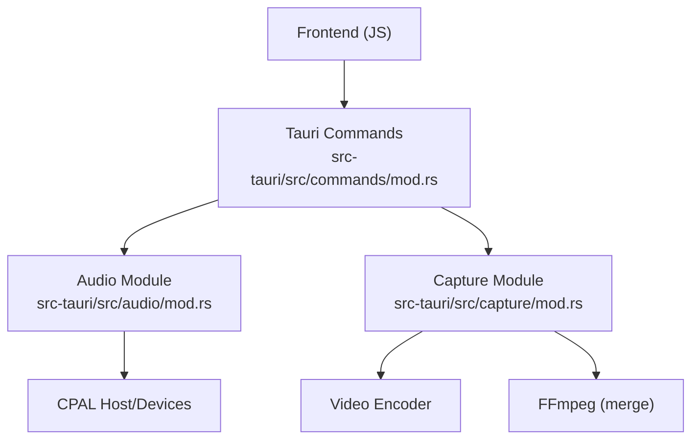
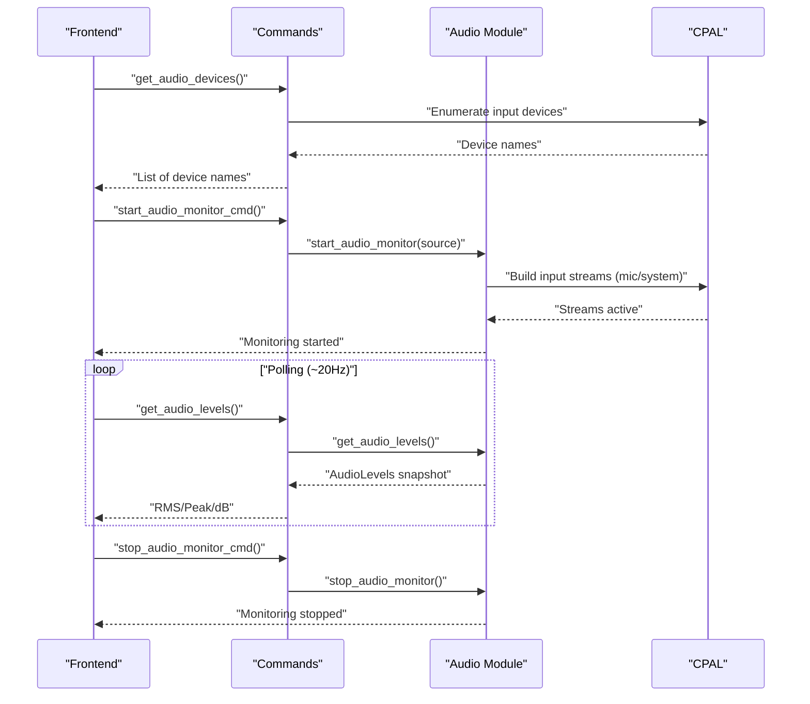
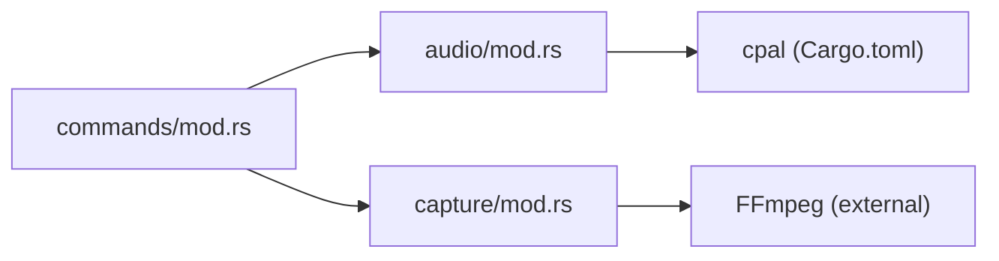

# Audio Processing Commands

<cite>
**Referenced Files in This Document**
- [mod.rs](file://src-tauri/src/audio/mod.rs)
- [mod.rs](file://src-tauri/src/commands/mod.rs)
- [mod.rs](file://src-tauri/src/capture/mod.rs)
- [Cargo.toml](file://src-tauri/Cargo.toml)
</cite>

## Table of Contents
1. [Introduction](#introduction)
2. [Project Structure](#project-structure)
3. [Core Components](#core-components)
4. [Architecture Overview](#architecture-overview)
5. [Detailed Component Analysis](#detailed-component-analysis)
6. [Dependency Analysis](#dependency-analysis)
7. [Performance Considerations](#performance-considerations)
8. [Troubleshooting Guide](#troubleshooting-guide)
9. [Conclusion](#conclusion)

## Introduction
This document provides detailed API documentation for EasySpecy’s audio processing commands focused on audio device enumeration and real-time audio level monitoring. It explains how to enumerate available audio input devices, start and stop pre-recording audio level monitoring, and retrieve real-time audio levels for mic and system audio. It also documents the audio source configuration (Mic, System, Both mixing), sample rate settings, and the CPAL integration for cross-platform audio capture. Finally, it covers the audio level monitoring architecture, real-time RMS/peak/dB computation, and error handling strategies for device access, permissions, and audio processing failures.

## Project Structure
The audio processing functionality is implemented in the Tauri backend under src-tauri. The relevant modules are:
- Audio capture and monitoring logic: src-tauri/src/audio/mod.rs
- Tauri IPC commands exposing the APIs: src-tauri/src/commands/mod.rs
- Screen capture and synchronization with audio: src-tauri/src/capture/mod.rs
- Dependencies and platform integrations: src-tauri/Cargo.toml

**Diagram sources**
- [mod.rs:135-589](file://src-tauri/src/commands/mod.rs#L135-L589)
- [mod.rs:1-980](file://src-tauri/src/audio/mod.rs#L1-L980)
- [mod.rs:1-1064](file://src-tauri/src/capture/mod.rs#L1-L1064)
- [Cargo.toml:26-61](file://src-tauri/Cargo.toml#L26-L61)

**Section sources**
- [mod.rs:1-723](file://src-tauri/src/commands/mod.rs#L1-L723)
- [mod.rs:1-980](file://src-tauri/src/audio/mod.rs#L1-L980)
- [mod.rs:1-1064](file://src-tauri/src/capture/mod.rs#L1-L1064)
- [Cargo.toml:26-61](file://src-tauri/Cargo.toml#L26-L61)

## Core Components
- AudioLevels: Real-time audio metrics (RMS, peak, dB) for mic and system streams.
- AudioMonitor: Lightweight cpal streams that compute levels without buffering.
- AudioCapture: Full audio capture with synchronized recording, resampling, channel conversion, and mixing.
- Tauri commands:
  - get_audio_devices: Enumerates available input devices.
  - start_audio_monitor_cmd: Starts pre-recording audio level monitoring.
  - stop_audio_monitor_cmd: Stops monitoring and resets levels.
  - get_audio_levels: Returns current audio levels snapshot.

**Section sources**
- [mod.rs:24-187](file://src-tauri/src/audio/mod.rs#L24-L187)
- [mod.rs:135-589](file://src-tauri/src/commands/mod.rs#L135-L589)

## Architecture Overview
The audio monitoring architecture separates pre-recording level checks from actual recording:
- Pre-recording monitoring: start_audio_monitor_cmd reads the current AppConfig audio source and launches cpal input streams for mic/system. These streams compute RMS, peak, and dB and update a shared AudioLevels structure.
- Real-time retrieval: get_audio_levels returns a clone of the current AudioLevels snapshot.
- Recording synchronization: During recording, capture::start_recording initializes audio streams early and arms them on the first video frame, ensuring video and audio start precisely in sync.

**Diagram sources**
- [mod.rs:135-589](file://src-tauri/src/commands/mod.rs#L135-L589)
- [mod.rs:84-187](file://src-tauri/src/audio/mod.rs#L84-L187)
- [mod.rs:160-404](file://src-tauri/src/capture/mod.rs#L160-L404)

## Detailed Component Analysis

### get_audio_devices
Purpose: Enumerate available audio input devices for selection in the UI.

Behavior:
- Uses cpal default_host to access the platform audio backend.
- Iterates over input_devices and collects device names.
- Returns a vector of device names or an error string.

Usage:
- Called from the frontend to populate device selection controls.

Error handling:
- Handles errors from cpal input_devices enumeration and device.name() calls.

**Section sources**
- [mod.rs:135-147](file://src-tauri/src/commands/mod.rs#L135-L147)
- [Cargo.toml:37-37](file://src-tauri/Cargo.toml#L37-L37)

### start_audio_monitor_cmd
Purpose: Start pre-recording audio level monitoring for mic/system or both.

Behavior:
- Reads AppConfig to determine audio source (Mic/System/Both).
- Delegates to audio::start_audio_monitor with the selected source.
- Launches cpal input streams for the chosen source(s).
- Streams compute RMS, peak, and dB and update global AudioLevels.

Integration:
- Called before recording to allow users to verify audio levels.

**Section sources**
- [mod.rs:563-576](file://src-tauri/src/commands/mod.rs#L563-L576)
- [mod.rs:84-165](file://src-tauri/src/audio/mod.rs#L84-L165)

### stop_audio_monitor_cmd
Purpose: Stop audio level monitoring and reset levels.

Behavior:
- Drops mic/sys cpal streams held by AudioMonitor.
- Resets AudioLevels to default values.

**Section sources**
- [mod.rs:578-582](file://src-tauri/src/commands/mod.rs#L578-L582)
- [mod.rs:167-180](file://src-tauri/src/audio/mod.rs#L167-L180)

### get_audio_levels
Purpose: Retrieve current audio levels (RMS, peak, dB) for mic and system.

Behavior:
- Returns a clone of the current AudioLevels snapshot from a shared mutex.
- Designed to be polled at ~20Hz from the frontend.

**Section sources**
- [mod.rs:584-589](file://src-tauri/src/commands/mod.rs#L584-L589)
- [mod.rs:182-187](file://src-tauri/src/audio/mod.rs#L182-L187)

### Audio Source Configuration and Sample Rate Settings
- Audio source selection: Mic, System, or Both. The command layer maps AppConfig audio_source to the internal AudioSource enum used by the audio module.
- Sample rate: The capture module accepts an audio_sample_rate setting. During recording, AudioCapture initializes streams with platform-supported formats and rates, then resamples and converts channels as needed.

Note: The audio monitoring streams use the platform default input/output configurations for the selected source(s).

**Section sources**
- [mod.rs:51-59](file://src-tauri/src/commands/mod.rs#L51-L59)
- [mod.rs:563-576](file://src-tauri/src/commands/mod.rs#L563-L576)
- [mod.rs:40-57](file://src-tauri/src/capture/mod.rs#L40-L57)
- [mod.rs:251-371](file://src-tauri/src/audio/mod.rs#L251-L371)

### CPAL Integration and Cross-Platform Audio Capture
- Host and Devices: The audio module uses cpal::default_host and device enumeration for input/output.
- Formats: Supports F32 and I16 sample formats. Monitoring streams adapt to the detected format.
- WASAPI Loopback: System audio monitoring uses WASAPI loopback capture via default_output_device for Windows.
- Stream Lifetime: Streams are stored in AudioMonitor and AudioCapture to ensure proper dropping and avoid device handle leaks.

**Section sources**
- [mod.rs:84-187](file://src-tauri/src/audio/mod.rs#L84-L187)
- [mod.rs:251-371](file://src-tauri/src/audio/mod.rs#L251-L371)
- [Cargo.toml:37-37](file://src-tauri/Cargo.toml#L37-L37)

### Real-Time Audio Level Calculation (RMS, Peak, dB)
- RMS and Peak: Computed from interleaved samples in the monitoring callback.
- dBFS: Converted from RMS using a full-scale formula, with a floor for silence.
- Levels Structure: Provides mic_rms, mic_peak, mic_db, sys_rms, sys_peak, sys_db.

**Section sources**
- [mod.rs:50-67](file://src-tauri/src/audio/mod.rs#L50-L67)
- [mod.rs:24-41](file://src-tauri/src/audio/mod.rs#L24-L41)

### Synchronization with Screen Capture
- Early Initialization: During start_recording, audio streams are initialized first and kept alive but not armed.
- Arming on First Frame: On the first video frame, audio is armed to start recording samples in sync with video.
- Pause/Resume: Pause/resume updates timing to maintain accurate expected sample counts.

**Section sources**
- [mod.rs:160-404](file://src-tauri/src/capture/mod.rs#L160-L404)
- [mod.rs:373-553](file://src-tauri/src/audio/mod.rs#L373-L553)

## Dependency Analysis
- Commands depend on the audio module for monitoring and levels.
- Audio module depends on cpal for device access and stream creation.
- Capture module integrates audio streams with video capture and FFmpeg merging.

**Diagram sources**
- [mod.rs:1-723](file://src-tauri/src/commands/mod.rs#L1-L723)
- [mod.rs:1-980](file://src-tauri/src/audio/mod.rs#L1-L980)
- [mod.rs:1-1064](file://src-tauri/src/capture/mod.rs#L1-L1064)
- [Cargo.toml:26-61](file://src-tauri/Cargo.toml#L26-L61)

**Section sources**
- [mod.rs:1-723](file://src-tauri/src/commands/mod.rs#L1-L723)
- [mod.rs:1-980](file://src-tauri/src/audio/mod.rs#L1-L980)
- [mod.rs:1-1064](file://src-tauri/src/capture/mod.rs#L1-L1064)
- [Cargo.toml:26-61](file://src-tauri/Cargo.toml#L26-L61)

## Performance Considerations
- Monitoring overhead: Monitoring streams run continuously and compute metrics on every callback. Keep polling frequency reasonable (e.g., ~20Hz) to minimize CPU usage.
- Format handling: Converting I16 to f32 in monitoring adds minimal overhead; ensure consistent format handling across streams.
- Resampling and mixing: During recording, resampling and mixing occur once at stop. Avoid heavy processing during monitoring to preserve responsiveness.

## Troubleshooting Guide
Common issues and resolutions:
- No devices found:
  - Verify cpal default_host availability and device enumeration permissions.
  - Ensure the application has microphone/system audio permissions.
- Monitoring fails to start:
  - Check for errors in cpal device default_input_config/default_output_config.
  - Confirm the selected audio source matches available devices.
- Audio levels not updating:
  - Ensure start_audio_monitor_cmd is invoked and the monitoring streams are active.
  - Verify get_audio_levels is polled regularly from the frontend.
- Permission errors:
  - On Windows, WASAPI loopback requires appropriate privileges. Relaunch with elevated permissions if needed.
- Device contention:
  - Avoid opening the same microphone/system device in multiple applications simultaneously.
- Silent recordings:
  - Validate that audio is armed on the first video frame and that pause/resume timing is handled correctly.

**Section sources**
- [mod.rs:135-147](file://src-tauri/src/commands/mod.rs#L135-L147)
- [mod.rs:84-187](file://src-tauri/src/audio/mod.rs#L84-L187)
- [mod.rs:160-404](file://src-tauri/src/capture/mod.rs#L160-L404)

## Conclusion
EasySpecy’s audio processing commands provide a robust, cross-platform solution for enumerating audio devices, pre-recording audio level monitoring, and retrieving real-time audio metrics. The CPAL integration enables reliable device access, while the separation of monitoring and recording ensures accurate synchronization. By following the documented APIs and troubleshooting steps, developers can integrate audio monitoring seamlessly into the recording workflow.