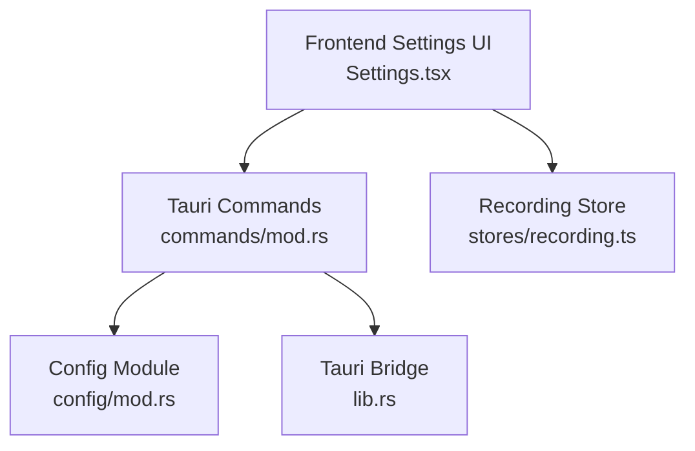
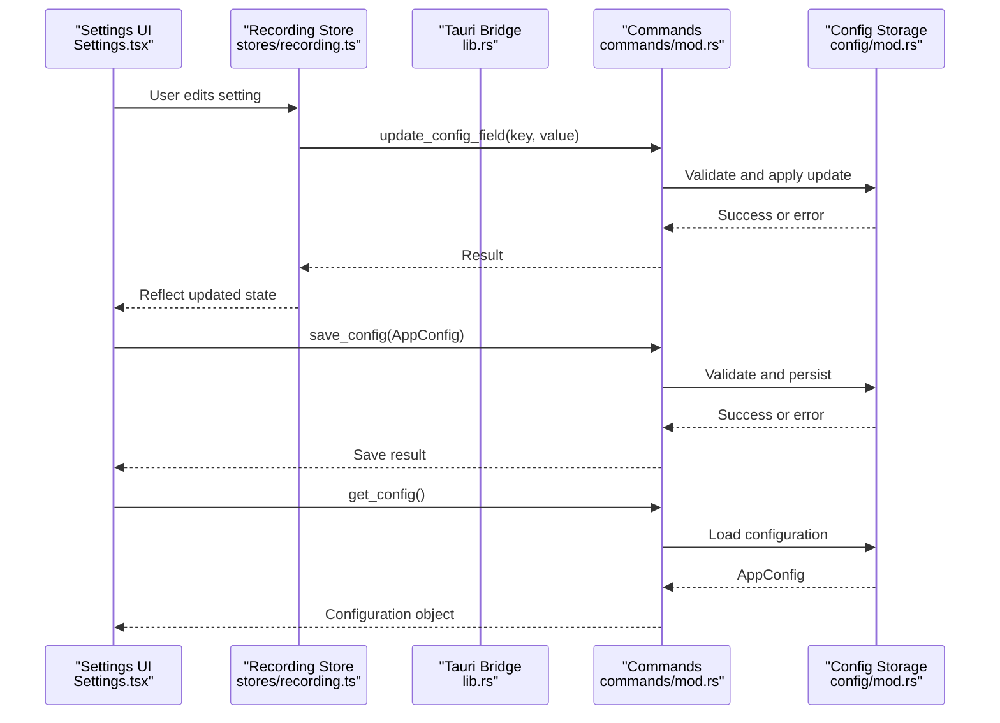
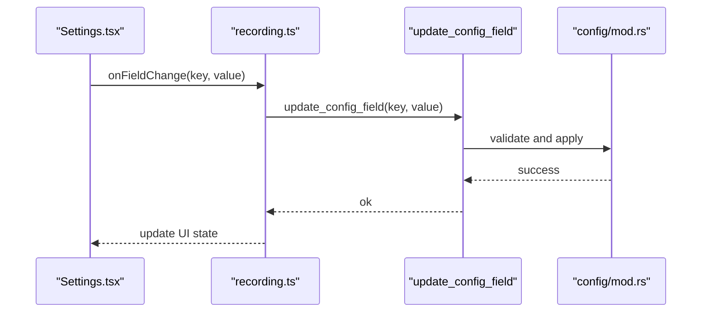
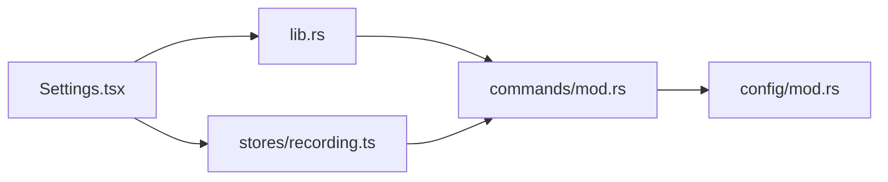

# Configuration Commands

<cite>
**Referenced Files in This Document**
- [src-tauri/src/commands/mod.rs](file://src-tauri/src/commands/mod.rs)
- [src-tauri/src/lib.rs](file://src-tauri/src/lib.rs)
- [src-tauri/src/config/mod.rs](file://src-tauri/src/config/mod.rs)
- [src/components/Settings.tsx](file://src/components/Settings.tsx)
- [src/stores/recording.ts](file://src/stores/recording.ts)
</cite>

## Table of Contents
1. [Introduction](#introduction)
2. [Project Structure](#project-structure)
3. [Core Components](#core-components)
4. [Architecture Overview](#architecture-overview)
5. [Detailed Component Analysis](#detailed-component-analysis)
6. [Dependency Analysis](#dependency-analysis)
7. [Performance Considerations](#performance-considerations)
8. [Troubleshooting Guide](#troubleshooting-guide)
9. [Conclusion](#conclusion)

## Introduction
This document provides detailed API documentation for EasySpecy's configuration management commands. It covers three primary backend commands exposed via Tauri: get_config for retrieving application settings, save_config for persisting configuration changes, and update_config_field for selective field updates. The document also explains the configuration schema, including resolution settings, FPS control, audio configuration (Microphone/System/Both sources), video encoder options (H264/H265/AV1/NVENC variants), video quality presets, and visual effects settings. It details parameter validation, default value handling, and the dynamic configuration update mechanism. Finally, it documents the relationship between the frontend settings UI and backend configuration persistence.

## Project Structure
The configuration system spans the Tauri backend and the React frontend:
- Backend (Rust/Tauri): exposes configuration commands and manages persistent storage.
- Frontend (TypeScript/React): renders settings UI, validates inputs, and invokes backend commands.

**Diagram sources**
- [src-tauri/src/commands/mod.rs](file://src-tauri/src/commands/mod.rs)
- [src-tauri/src/config/mod.rs](file://src-tauri/src/config/mod.rs)
- [src-tauri/src/lib.rs](file://src-tauri/src/lib.rs)
- [src/components/Settings.tsx](file://src/components/Settings.tsx)
- [src/stores/recording.ts](file://src/stores/recording.ts)

**Section sources**
- [src-tauri/src/commands/mod.rs](file://src-tauri/src/commands/mod.rs)
- [src-tauri/src/lib.rs](file://src-tauri/src/lib.rs)
- [src/components/Settings.tsx](file://src/components/Settings.tsx)
- [src/stores/recording.ts](file://src/stores/recording.ts)

## Core Components
This section documents the three configuration commands and their roles in the system.

- get_config
  - Purpose: Retrieve the current application configuration as a structured object.
  - Returns: AppConfig (configuration object).
  - Typical usage: Initialize the settings UI with persisted values.
  - Validation: Returns the stored configuration; validation occurs during save/update operations.

- save_config
  - Purpose: Persist a complete AppConfig object to disk.
  - Parameters: AppConfig (full configuration).
  - Validation: Validates all fields according to schema rules before saving.
  - Defaults: Applies defaults for missing or invalid fields during validation.
  - Persistence: Writes configuration to the platform-specific configuration file.

- update_config_field
  - Purpose: Apply a single-field update to the configuration.
  - Parameters: key (string path to target field), value (JSON value).
  - Validation: Validates the provided key and value against schema rules.
  - Defaults: Applies defaults if the new value is invalid or missing.
  - Persistence: Saves the updated configuration atomically.

**Section sources**
- [src-tauri/src/commands/mod.rs](file://src-tauri/src/commands/mod.rs)

## Architecture Overview
The configuration architecture integrates frontend UI, Tauri command exposure, and backend persistence.

**Diagram sources**
- [src-tauri/src/lib.rs](file://src-tauri/src/lib.rs)
- [src-tauri/src/commands/mod.rs](file://src-tauri/src/commands/mod.rs)
- [src-tauri/src/config/mod.rs](file://src-tauri/src/config/mod.rs)
- [src/components/Settings.tsx](file://src/components/Settings.tsx)
- [src/stores/recording.ts](file://src/stores/recording.ts)

## Detailed Component Analysis

### Configuration Schema
The configuration object (AppConfig) includes the following top-level categories and fields. Each field has associated validation rules and default values.

- Video Capture
  - resolution: width x height (validated numeric range)
  - fps: frames per second (validated positive integer)
  - encoder: "H264", "H265", "AV1", "NVENC_H264", "NVENC_H265", "NVENC_AV1"
  - preset: "ultrafast", "superfast", "veryfast", "faster", "fast", "medium", "slow", "slower", "veryslow"
  - quality: "CRF" or "CQ" modes with numeric values
  - bitrate: optional bitrate in kbps (validated numeric range)

- Audio Capture
  - mic_enabled: boolean
  - system_audio_enabled: boolean
  - audio_source: "mic", "system", "both"

- Visual Effects
  - overlay_enabled: boolean
  - cursor_trail: boolean
  - highlight_hotkeys: boolean
  - color_theme: "light", "dark", "auto"

- Region Selection
  - selected_region: { x, y, width, height } (validated coordinates)

- Recording Overlay
  - overlay_text: string
  - overlay_position: "top-left", "top-right", "bottom-left", "bottom-right"

- Application State
  - last_used_profile: string
  - auto_zoom_enabled: boolean

Validation and defaults:
- Numeric fields enforce minimum/maximum bounds.
- Encoder and preset choices are constrained to supported values.
- Boolean fields default to false unless otherwise specified.
- Missing or invalid fields are replaced with defaults during save_config and update_config_field.

**Section sources**
- [src-tauri/src/config/mod.rs](file://src-tauri/src/config/mod.rs)

### Command: get_config
- Purpose: Return the current AppConfig object.
- Behavior:
  - Loads configuration from persistent storage.
  - Applies defaults for any missing fields.
  - Returns a validated AppConfig object ready for UI binding.
- Error handling: Propagates storage errors as string messages.

Usage pattern:
- On app initialization, call get_config to populate the settings UI.
- On profile change, call get_config to refresh the form state.

**Section sources**
- [src-tauri/src/commands/mod.rs](file://src-tauri/src/commands/mod.rs)

### Command: save_config
- Purpose: Persist a complete AppConfig object.
- Parameters:
  - config: AppConfig (validated and normalized)
- Behavior:
  - Validates all fields against schema rules.
  - Applies defaults for missing or invalid values.
  - Writes configuration to disk atomically.
- Error handling: Returns an error string on validation failure or write failure.

Validation steps:
- Encoder/preset compatibility checks.
- Numeric bounds verification.
- Enumerated value validation.
- Region coordinate normalization.

**Section sources**
- [src-tauri/src/commands/mod.rs](file://src-tauri/src/commands/mod.rs)

### Command: update_config_field
- Purpose: Apply a single-field update to the configuration.
- Parameters:
  - key: JSON path string identifying the target field (e.g., "video.resolution.width")
  - value: JSON value for the field
- Behavior:
  - Parses and validates the key path.
  - Validates the new value against the field's schema.
  - Applies defaults if the value is invalid.
  - Persists the updated configuration.
- Error handling: Returns an error string if the key is invalid, the value fails validation, or persistence fails.

Dynamic update mechanism:
- Supports nested updates via dot notation.
- Triggers immediate revalidation and persistence.
- Ensures atomic writes to prevent corruption.

**Section sources**
- [src-tauri/src/commands/mod.rs](file://src-tauri/src/commands/mod.rs)

### Frontend Integration: Settings UI and Dynamic Updates
- Settings.tsx
  - Renders form controls bound to configuration values.
  - Performs client-side validation for immediate feedback.
  - Calls update_config_field for real-time updates.
  - Uses save_config to commit bulk changes.
- stores/recording.ts
  - Manages reactive state for recording-related settings.
  - Subscribes to configuration changes to keep UI synchronized.
  - Coordinates with Tauri commands to apply updates.

**Diagram sources**
- [src/components/Settings.tsx](file://src/components/Settings.tsx)
- [src/stores/recording.ts](file://src/stores/recording.ts)
- [src-tauri/src/commands/mod.rs](file://src-tauri/src/commands/mod.rs)
- [src-tauri/src/config/mod.rs](file://src-tauri/src/config/mod.rs)

**Section sources**
- [src/components/Settings.tsx](file://src/components/Settings.tsx)
- [src/stores/recording.ts](file://src/stores/recording.ts)
- [src-tauri/src/commands/mod.rs](file://src-tauri/src/commands/mod.rs)
- [src-tauri/src/config/mod.rs](file://src-tauri/src/config/mod.rs)

## Dependency Analysis
The configuration system exhibits clear separation of concerns:
- Frontend UI depends on Tauri commands for persistence.
- Tauri commands depend on the config module for validation and storage.
- The recording store mediates between UI and backend.

**Diagram sources**
- [src-tauri/src/lib.rs](file://src-tauri/src/lib.rs)
- [src-tauri/src/commands/mod.rs](file://src-tauri/src/commands/mod.rs)
- [src-tauri/src/config/mod.rs](file://src-tauri/src/config/mod.rs)
- [src/components/Settings.tsx](file://src/components/Settings.tsx)
- [src/stores/recording.ts](file://src/stores/recording.ts)

**Section sources**
- [src-tauri/src/lib.rs](file://src-tauri/src/lib.rs)
- [src-tauri/src/commands/mod.rs](file://src-tauri/src/commands/mod.rs)
- [src-tauri/src/config/mod.rs](file://src-tauri/src/config/mod.rs)
- [src/components/Settings.tsx](file://src/components/Settings.tsx)
- [src/stores/recording.ts](file://src/stores/recording.ts)

## Performance Considerations
- Prefer update_config_field for frequent small changes to avoid full serialization overhead.
- Batch UI updates in the frontend to minimize repeated backend calls.
- Use save_config for bulk changes to reduce write frequency.
- Validate inputs on the frontend to reduce server round trips and error propagation.

## Troubleshooting Guide
Common issues and resolutions:
- Invalid encoder/preset combination: Ensure the preset is compatible with the chosen encoder.
- Out-of-range numeric values: Adjust resolution/fps/bitrate within supported bounds.
- Invalid JSON path in update_config_field: Verify the key path exists in the schema.
- Persistence failures: Check file permissions and available disk space.
- UI not reflecting changes: Confirm the recording store subscribes to configuration updates.

**Section sources**
- [src-tauri/src/commands/mod.rs](file://src-tauri/src/commands/mod.rs)
- [src-tauri/src/config/mod.rs](file://src-tauri/src/config/mod.rs)
- [src/stores/recording.ts](file://src/stores/recording.ts)

## Conclusion
EasySpecy's configuration system provides robust APIs for retrieving, updating, and persisting application settings. The get_config, save_config, and update_config_field commands enable flexible configuration management with strong validation and defaults. The frontend settings UI integrates seamlessly with backend persistence, ensuring a responsive and reliable user experience. By following the documented schema and validation rules, developers can extend or modify the configuration safely while maintaining system stability.