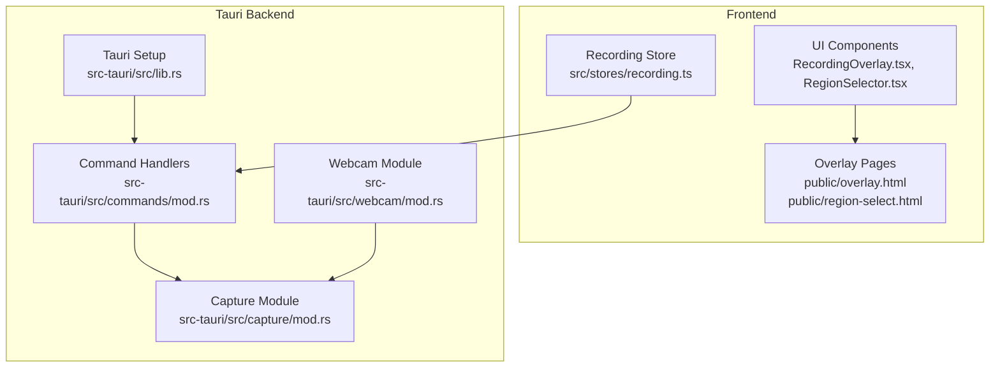
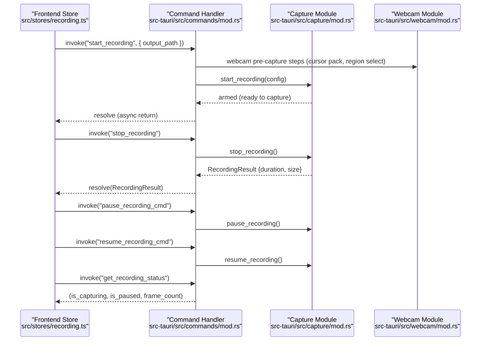
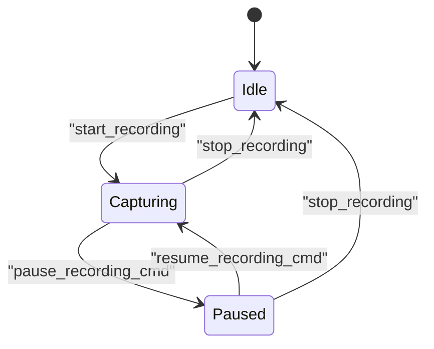
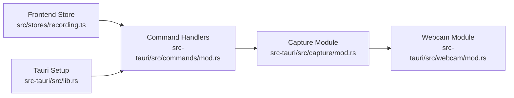

# Recording Commands

<cite>
**Referenced Files in This Document**
- [commands/mod.rs](file://src-tauri/src/commands/mod.rs)
- [capture/mod.rs](file://src-tauri/src/capture/mod.rs)
- [stores/recording.ts](file://src/stores/recording.ts)
- [webcam/mod.rs](file://src-tauri/src/webcam/mod.rs)
- [lib.rs](file://src-tauri/src/lib.rs)
- [public/overlay.html](file://public/overlay.html)
- [public/region-select.html](file://public/region-select.html)
- [public/webcam.html](file://public/webcam.html)
</cite>

## Table of Contents
1. [Introduction](#introduction)
2. [Project Structure](#project-structure)
3. [Core Components](#core-components)
4. [Architecture Overview](#architecture-overview)
5. [Detailed Component Analysis](#detailed-component-analysis)
6. [Dependency Analysis](#dependency-analysis)
7. [Performance Considerations](#performance-considerations)
8. [Troubleshooting Guide](#troubleshooting-guide)
9. [Conclusion](#conclusion)

## Introduction
This document provides comprehensive API documentation for EasySpecy’s recording control commands. It covers the complete recording lifecycle, including asynchronous start_recording, stop_recording with encoding progress tracking, pause_recording_cmd, resume_recording_cmd, and get_recording_status. It also explains the recording state machine, capture initialization process, and the relationship between frontend UI state and the backend recording pipeline. Parameter specifications, return value formats, error handling strategies, timing considerations, recording configuration integration, cursor pack application before capture, and overlay window management during recording sessions are documented.

## Project Structure
The recording functionality spans the Tauri backend and the React frontend:
- Backend (Rust):
  - Command handlers exposed to the frontend via Tauri
  - Capture module orchestrating monitor/audio capture and encoding
  - Webcam module coordinating pre-capture steps
- Frontend (TypeScript/React):
  - Recording store managing UI state and invoking commands
  - Overlay and region selection HTML pages for capture area and UI overlays

**Diagram sources**
- [commands/mod.rs](file://src-tauri/src/commands/mod.rs)
- [capture/mod.rs](file://src-tauri/src/capture/mod.rs)
- [stores/recording.ts](file://src/stores/recording.ts)
- [webcam/mod.rs](file://src-tauri/src/webcam/mod.rs)
- [lib.rs](file://src-tauri/src/lib.rs)
- [public/overlay.html](file://public/overlay.html)
- [public/region-select.html](file://public/region-select.html)

**Section sources**
- [commands/mod.rs](file://src-tauri/src/commands/mod.rs)
- [capture/mod.rs](file://src-tauri/src/capture/mod.rs)
- [stores/recording.ts](file://src/stores/recording.ts)
- [webcam/mod.rs](file://src-tauri/src/webcam/mod.rs)
- [lib.rs](file://src-tauri/src/lib.rs)
- [public/overlay.html](file://public/overlay.html)
- [public/region-select.html](file://public/region-select.html)

## Core Components
- Command handlers:
  - start_recording: asynchronous command to initialize capture and return immediately after arming
  - stop_recording: ends capture and returns recording result with duration and file size
  - pause_recording_cmd: pauses capture
  - resume_recording_cmd: resumes capture
  - get_recording_status: returns current state tuple
- Capture module:
  - Initializes monitors and audio streams
  - Manages capture lifecycle and encoding
  - Provides status and result reporting
- Frontend store:
  - Invokes commands via Tauri invoke
  - Updates UI state (idle, capturing, paused)
  - Handles notifications and error feedback

**Section sources**
- [commands/mod.rs](file://src-tauri/src/commands/mod.rs)
- [capture/mod.rs](file://src-tauri/src/capture/mod.rs)
- [stores/recording.ts](file://src/stores/recording.ts)

## Architecture Overview
The recording lifecycle is orchestrated by the frontend store invoking Tauri commands. The backend command handlers delegate to the capture module, which coordinates monitor and audio capture. The webcam module performs pre-capture steps prior to capture initiation.

**Diagram sources**
- [commands/mod.rs](file://src-tauri/src/commands/mod.rs)
- [capture/mod.rs](file://src-tauri/src/capture/mod.rs)
- [stores/recording.ts](file://src/stores/recording.ts)
- [webcam/mod.rs](file://src-tauri/src/webcam/mod.rs)

## Detailed Component Analysis

### start_recording
- Purpose: Initialize recording pipeline asynchronously and return immediately after arming.
- Parameters:
  - output_path: Optional string specifying the target file path for the recording.
- Behavior:
  - Pre-capture: Invokes webcam module steps before capture starts.
  - Capture initialization: Delegates to capture module with a constructed RecordingConfig.
  - Async return: Returns to frontend once capture is armed, without waiting for completion.
- Return:
  - Result type indicating success or error.
- Timing considerations:
  - Immediate return allows UI to update state while capture runs.
- Error handling:
  - Errors are propagated to the frontend via Tauri invoke and surfaced as toast notifications.

**Section sources**
- [commands/mod.rs:243-333](file://src-tauri/src/commands/mod.rs#L243-L333)
- [capture/mod.rs:162-170](file://src-tauri/src/capture/mod.rs#L162-L170)
- [webcam/mod.rs:39](file://src-tauri/src/webcam/mod.rs#L39)
- [stores/recording.ts:313-320](file://src/stores/recording.ts#L313-L320)

### stop_recording
- Purpose: Stop capture and return recording result with duration and file size.
- Parameters: None.
- Behavior:
  - Ends capture and triggers encoding finalization.
  - Returns RecordingResult containing duration (seconds) and size (bytes).
- Return:
  - RecordingResult with fields for duration and size.
- Progress tracking:
  - Encoding progress is handled internally; the frontend receives the final result upon completion.
- Error handling:
  - Errors are propagated to the frontend via Tauri invoke and surfaced as toast notifications.

**Section sources**
- [commands/mod.rs:350-374](file://src-tauri/src/commands/mod.rs#L350-L374)
- [capture/mod.rs:503-510](file://src-tauri/src/capture/mod.rs#L503-L510)
- [stores/recording.ts:321-337](file://src/stores/recording.ts#L321-L337)

### pause_recording_cmd
- Purpose: Pause the active recording session.
- Parameters: None.
- Behavior:
  - Calls capture module to pause ongoing capture.
- Return:
  - Void on success; errors propagate to frontend.
- Frontend integration:
  - Updates UI state to paused and displays a toast notification.

**Section sources**
- [commands/mod.rs:397-401](file://src-tauri/src/commands/mod.rs#L397-L401)
- [capture/mod.rs:1004-1006](file://src-tauri/src/capture/mod.rs#L1004-L1006)
- [stores/recording.ts:339-342](file://src/stores/recording.ts#L339-L342)

### resume_recording_cmd
- Purpose: Resume a previously paused recording session.
- Parameters: None.
- Behavior:
  - Calls capture module to resume capture.
- Return:
  - Void on success; errors propagate to frontend.
- Frontend integration:
  - Updates UI state to resumed and displays a toast notification.

**Section sources**
- [commands/mod.rs:402-406](file://src-tauri/src/commands/mod.rs#L402-L406)
- [capture/mod.rs:1012-1014](file://src-tauri/src/capture/mod.rs#L1012-L1014)
- [stores/recording.ts:344-347](file://src/stores/recording.ts#L344-L347)

### get_recording_status
- Purpose: Query current recording state.
- Parameters: None.
- Return:
  - Tuple of (is_capturing: bool, is_paused: bool, frame_count: u32).
- Frontend integration:
  - Used to synchronize UI state with backend capture state.

**Section sources**
- [commands/mod.rs:407-410](file://src-tauri/src/commands/mod.rs#L407-L410)
- [capture/mod.rs:1004-1014](file://src-tauri/src/capture/mod.rs#L1004-L1014)

### Recording State Machine
The recording state machine transitions between idle, capturing, and paused states. The frontend store manages UI state and invokes commands to change state. The backend capture module reflects the current state and frame count.

**Diagram sources**
- [stores/recording.ts](file://src/stores/recording.ts)
- [commands/mod.rs](file://src-tauri/src/commands/mod.rs)
- [capture/mod.rs](file://src-tauri/src/capture/mod.rs)

### Capture Initialization Process
- Pre-capture steps:
  - Cursor pack application and region selection are performed before capture begins.
- Capture initialization:
  - Monitor and audio streams are initialized on the calling thread.
  - Capture is armed and ready to record frames.
- Overlay management:
  - Overlay HTML pages are used for region selection and UI overlays during capture.

**Section sources**
- [webcam/mod.rs:39](file://src-tauri/src/webcam/mod.rs#L39)
- [capture/mod.rs:5](file://src-tauri/src/capture/mod.rs#L5)
- [public/overlay.html](file://public/overlay.html)
- [public/region-select.html](file://public/region-select.html)

### Frontend-Backend Relationship
- The frontend store invokes commands via Tauri invoke.
- The backend command handlers delegate to the capture module.
- Status queries keep the UI synchronized with the backend state.
- Notifications inform the user of success or failure.

**Section sources**
- [stores/recording.ts:313-347](file://src/stores/recording.ts#L313-L347)
- [commands/mod.rs:243-410](file://src-tauri/src/commands/mod.rs#L243-L410)
- [lib.rs:95-99](file://src-tauri/src/lib.rs#L95-L99)

## Dependency Analysis
The recording command handlers depend on the capture module, which in turn depends on webcam pre-capture steps. The frontend store depends on the command handlers for state transitions.

**Diagram sources**
- [stores/recording.ts](file://src/stores/recording.ts)
- [commands/mod.rs](file://src-tauri/src/commands/mod.rs)
- [capture/mod.rs](file://src-tauri/src/capture/mod.rs)
- [webcam/mod.rs](file://src-tauri/src/webcam/mod.rs)
- [lib.rs](file://src-tauri/src/lib.rs)

**Section sources**
- [stores/recording.ts](file://src/stores/recording.ts)
- [commands/mod.rs](file://src-tauri/src/commands/mod.rs)
- [capture/mod.rs](file://src-tauri/src/capture/mod.rs)
- [webcam/mod.rs](file://src-tauri/src/webcam/mod.rs)
- [lib.rs](file://src-tauri/src/lib.rs)

## Performance Considerations
- Asynchronous start_recording enables immediate UI responsiveness while capture arms.
- stop_recording returns a final result; avoid polling for progress in the frontend.
- Frame rate and encoding settings influence CPU/GPU usage; tune capture configuration accordingly.
- Overlay rendering overhead should be considered when using overlay pages during capture.

## Troubleshooting Guide
- Start recording fails:
  - Verify output path permissions and availability.
  - Check for errors returned by the command handler and inspect toast notifications.
- Stop recording fails:
  - Inspect error messages and reset UI state to idle if needed.
- Pause/Resume issues:
  - Ensure a recording session is active before pausing/resuming.
  - Confirm status queries reflect the expected state.
- Encoding progress:
  - The backend handles encoding; the frontend receives the final result upon completion.

**Section sources**
- [stores/recording.ts:313-347](file://src/stores/recording.ts#L313-L347)
- [commands/mod.rs:243-410](file://src-tauri/src/commands/mod.rs#L243-L410)

## Conclusion
EasySpecy’s recording commands provide a robust, asynchronous pipeline for capturing screen and audio with precise state control. The frontend integrates seamlessly with backend command handlers, enabling responsive UI updates and reliable recording lifecycle management. Proper configuration, overlay handling, and error propagation ensure a smooth user experience.