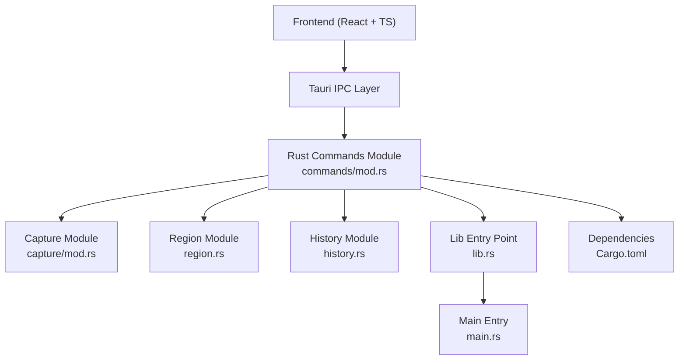
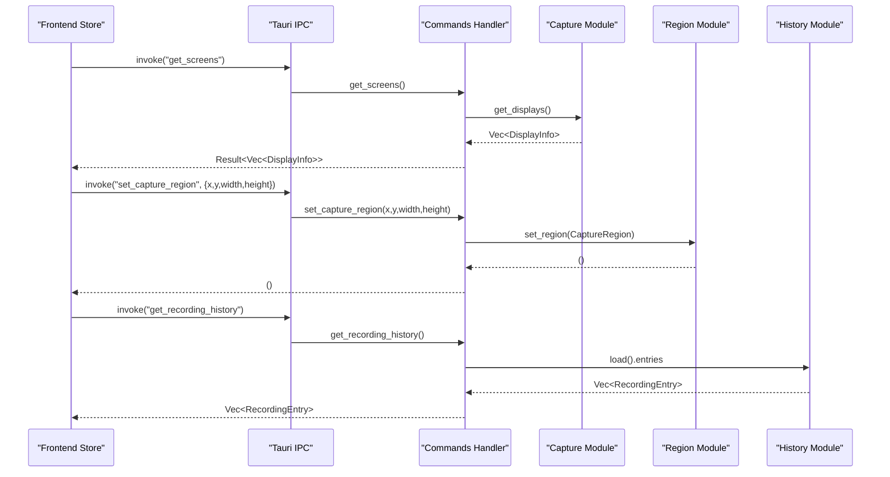
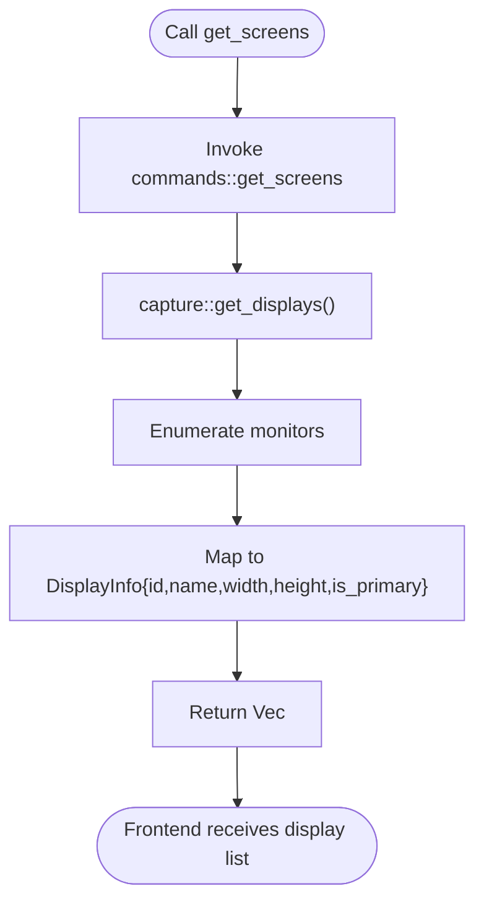
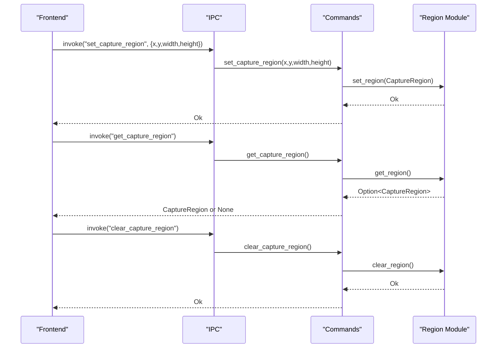
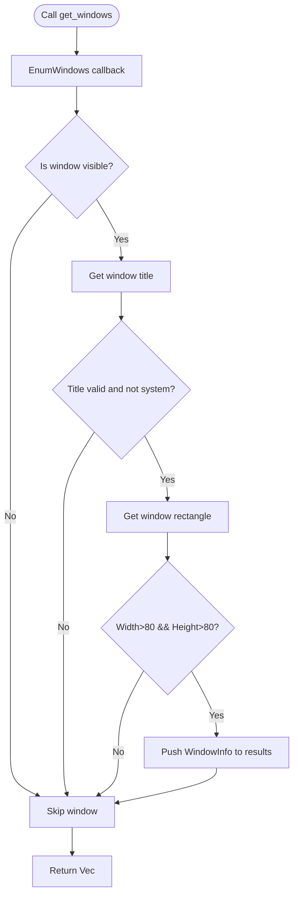
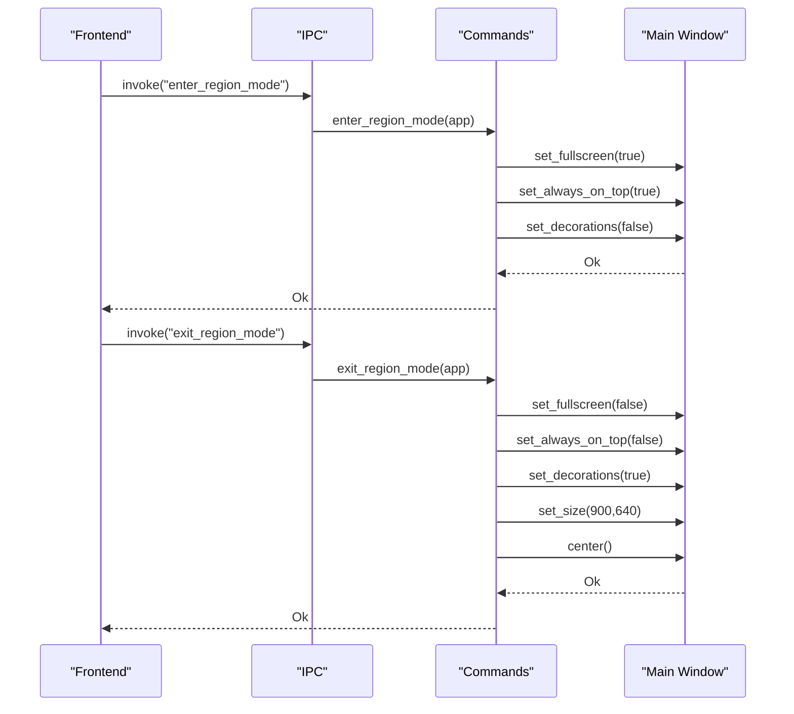
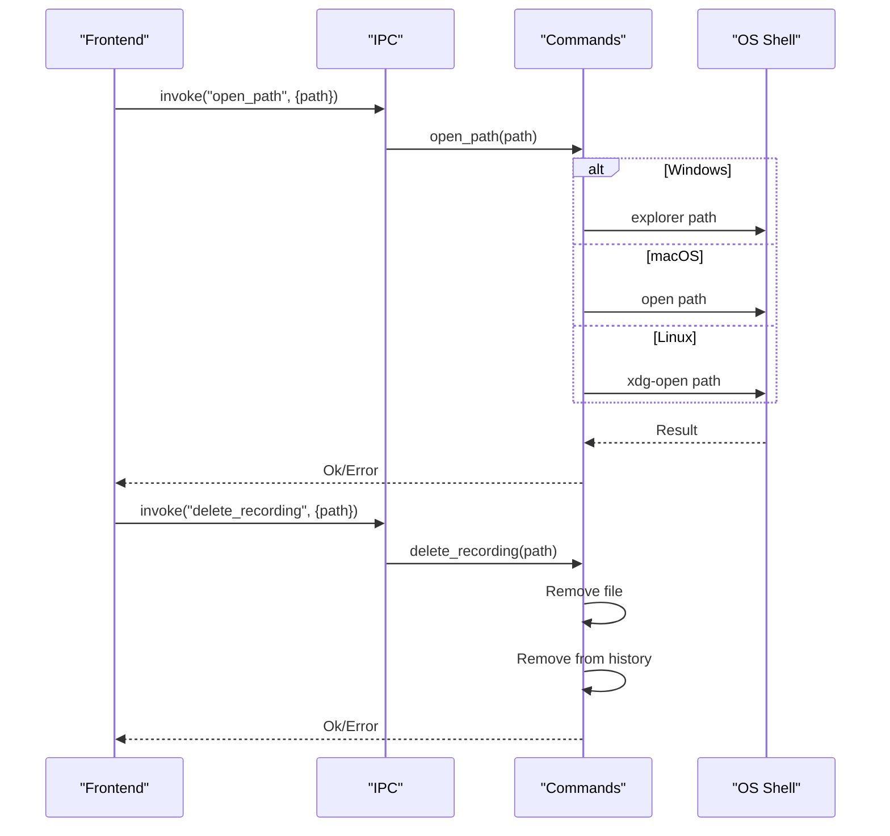
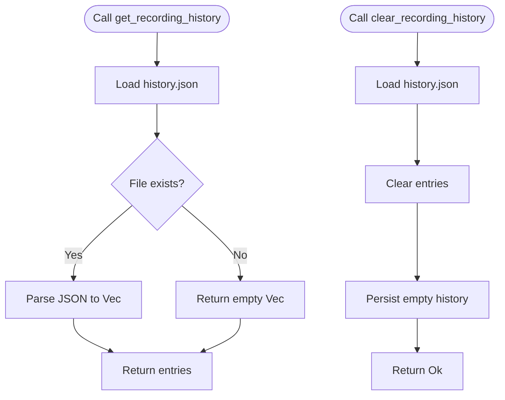
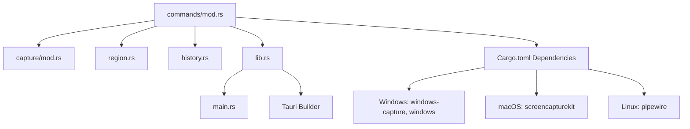

# System Integration Commands

<cite>
**Referenced Files in This Document**
- [commands/mod.rs](file://src-tauri/src/commands/mod.rs)
- [lib.rs](file://src-tauri/src/lib.rs)
- [capture/mod.rs](file://src-tauri/src/capture/mod.rs)
- [region.rs](file://src-tauri/src/region.rs)
- [history.rs](file://src-tauri/src/history.rs)
- [Cargo.toml](file://src-tauri/Cargo.toml)
- [main.rs](file://src-tauri/src/main.rs)
- [RegionSelector.tsx](file://src/components/RegionSelector.tsx)
- [recording.ts](file://src/stores/recording.ts)
</cite>

## Table of Contents
1. [Introduction](#introduction)
2. [Project Structure](#project-structure)
3. [Core Components](#core-components)
4. [Architecture Overview](#architecture-overview)
5. [Detailed Component Analysis](#detailed-component-analysis)
6. [Dependency Analysis](#dependency-analysis)
7. [Performance Considerations](#performance-considerations)
8. [Troubleshooting Guide](#troubleshooting-guide)
9. [Conclusion](#conclusion)

## Introduction
This document provides comprehensive API documentation for EasySpecy's system integration commands. It covers screen enumeration, display information retrieval, multi-monitor support, region selection commands, window enumeration, region selection mode workflow, file system integration, platform-specific implementations, and recording history management. The goal is to help developers and integrators understand how to interact with EasySpecy's native backend from the frontend through Tauri IPC commands.

## Project Structure
EasySpecy uses Tauri 2 with a Rust backend and TypeScript/React frontend. The system integration commands are exposed via the Tauri command handler and implemented in the Rust backend modules. The frontend invokes these commands using Tauri's invoke mechanism.

**Diagram sources**
- [lib.rs:88-127](file://src-tauri/src/lib.rs#L88-L127)
- [commands/mod.rs:1-723](file://src-tauri/src/commands/mod.rs#L1-L723)
- [capture/mod.rs:1-1064](file://src-tauri/src/capture/mod.rs#L1-L1064)
- [region.rs:1-226](file://src-tauri/src/region.rs#L1-L226)
- [history.rs:1-64](file://src-tauri/src/history.rs#L1-L64)
- [Cargo.toml:1-61](file://src-tauri/Cargo.toml#L1-L61)
- [main.rs:1-7](file://src-tauri/src/main.rs#L1-L7)

**Section sources**
- [lib.rs:88-127](file://src-tauri/src/lib.rs#L88-L127)
- [Cargo.toml:26-61](file://src-tauri/Cargo.toml#L26-L61)

## Core Components
This section outlines the primary system integration command families and their responsibilities:

- Screen and display enumeration: get_screens
- Region selection: set_capture_region, get_capture_region, clear_capture_region
- Window enumeration: get_windows
- Region selection mode: enter_region_mode, exit_region_mode
- File system integration: open_path, delete_recording
- Recording history: get_recording_history, clear_recording_history

These commands are registered in the Tauri builder and invoked from the frontend store and components.

**Section sources**
- [commands/mod.rs:149-152](file://src-tauri/src/commands/mod.rs#L149-L152)
- [commands/mod.rs:436-449](file://src-tauri/src/commands/mod.rs#L436-L449)
- [commands/mod.rs:451-454](file://src-tauri/src/commands/mod.rs#L451-L454)
- [commands/mod.rs:456-478](file://src-tauri/src/commands/mod.rs#L456-L478)
- [commands/mod.rs:480-504](file://src-tauri/src/commands/mod.rs#L480-L504)
- [commands/mod.rs:424-434](file://src-tauri/src/commands/mod.rs#L424-L434)

## Architecture Overview
The system integration commands form a bridge between the frontend and the native capture, region, and history subsystems. The frontend invokes commands via Tauri's invoke API, which routes to the Rust command handlers. These handlers coordinate with backend modules to perform operations such as enumerating displays, managing capture regions, manipulating windows, and interacting with the file system.

**Diagram sources**
- [lib.rs:88-127](file://src-tauri/src/lib.rs#L88-L127)
- [commands/mod.rs:149-152](file://src-tauri/src/commands/mod.rs#L149-L152)
- [commands/mod.rs:436-449](file://src-tauri/src/commands/mod.rs#L436-L449)
- [commands/mod.rs:424-434](file://src-tauri/src/commands/mod.rs#L424-L434)
- [capture/mod.rs:1033-1054](file://src-tauri/src/capture/mod.rs#L1033-L1054)
- [region.rs:14-24](file://src-tauri/src/region.rs#L14-L24)
- [history.rs:31-41](file://src-tauri/src/history.rs#L31-L41)

## Detailed Component Analysis

### Screen Enumeration and Multi-Monitor Support
- Command: get_screens
- Purpose: Retrieve information about connected displays including ID, name, width, height, and primary status.
- Implementation: Delegates to the capture module's get_displays function, which enumerates monitors via the underlying graphics capture API and maps them to DisplayInfo structures.
- Frontend usage: Called by the frontend store to populate display options and select target monitors for recording.

**Diagram sources**
- [commands/mod.rs:149-152](file://src-tauri/src/commands/mod.rs#L149-L152)
- [capture/mod.rs:1033-1054](file://src-tauri/src/capture/mod.rs#L1033-L1054)

**Section sources**
- [commands/mod.rs:149-152](file://src-tauri/src/commands/mod.rs#L149-L152)
- [capture/mod.rs:1033-1054](file://src-tauri/src/capture/mod.rs#L1033-L1054)

### Region Selection Commands
- set_capture_region(x: i32, y: i32, width: i32, height: i32)
  - Sets the active capture region in the region module.
- get_capture_region() -> Option<CaptureRegion>
  - Retrieves the currently selected region.
- clear_capture_region()
  - Clears the active region selection.

These commands operate on a shared, thread-safe region state managed by the region module.

**Diagram sources**
- [commands/mod.rs:436-449](file://src-tauri/src/commands/mod.rs#L436-L449)
- [region.rs:14-24](file://src-tauri/src/region.rs#L14-L24)

**Section sources**
- [commands/mod.rs:436-449](file://src-tauri/src/commands/mod.rs#L436-L449)
- [region.rs:4-24](file://src-tauri/src/region.rs#L4-L24)

### Window Enumeration (Windows)
- Command: get_windows() -> Vec<WindowInfo>
- Purpose: Enumerates visible windows on Windows systems for selection in region mode.
- Implementation: Uses Windows API EnumWindows to iterate top-level windows, filters out invisible or system windows, and captures their titles and bounding rectangles. Returns a vector of WindowInfo structures containing title, position, size, and HWND.

**Diagram sources**
- [commands/mod.rs:451-454](file://src-tauri/src/commands/mod.rs#L451-L454)
- [region.rs:36-89](file://src-tauri/src/region.rs#L36-L89)

**Section sources**
- [commands/mod.rs:451-454](file://src-tauri/src/commands/mod.rs#L451-L454)
- [region.rs:36-89](file://src-tauri/src/region.rs#L36-L89)

### Region Selection Mode Workflow
- enter_region_mode(app: AppHandle)
  - Makes the main window fullscreen, always-on-top, and removes decorations to facilitate region selection.
- exit_region_mode(app: AppHandle)
  - Restores the main window to normal state, size, and position.

These commands manipulate the main webview window's properties to provide an immersive selection experience.

**Diagram sources**
- [commands/mod.rs:456-478](file://src-tauri/src/commands/mod.rs#L456-L478)

**Section sources**
- [commands/mod.rs:456-478](file://src-tauri/src/commands/mod.rs#L456-L478)
- [RegionSelector.tsx:15-34](file://src/components/RegionSelector.tsx#L15-L34)

### File System Integration Commands
- open_path(path: String)
  - Opens a file or directory using the platform's default handler:
    - Windows: explorer.exe
    - macOS: open
    - Linux: xdg-open
- delete_recording(path: String)
  - Deletes the specified recording file and removes it from the recording history.

**Diagram sources**
- [commands/mod.rs:480-518](file://src-tauri/src/commands/mod.rs#L480-L518)

**Section sources**
- [commands/mod.rs:480-518](file://src-tauri/src/commands/mod.rs#L480-L518)
- [recording.ts:361-365](file://src/stores/recording.ts#L361-L365)

### Recording History Management
- get_recording_history() -> Vec<RecordingEntry>
  - Loads and returns the persisted recording history.
- clear_recording_history() -> Result<(), String>
  - Clears the history and persists the empty state.

The history module manages a JSON file under the user's configuration directory, storing entries with metadata such as output path, duration, file size, and creation timestamp.

**Diagram sources**
- [commands/mod.rs:424-434](file://src-tauri/src/commands/mod.rs#L424-L434)
- [history.rs:23-62](file://src-tauri/src/history.rs#L23-L62)

**Section sources**
- [commands/mod.rs:424-434](file://src-tauri/src/commands/mod.rs#L424-L434)
- [history.rs:18-62](file://src-tauri/src/history.rs#L18-L62)

## Dependency Analysis
The system integration commands depend on several backend modules and platform-specific crates. The Tauri builder registers commands and wires them to the application lifecycle.

**Diagram sources**
- [lib.rs:88-127](file://src-tauri/src/lib.rs#L88-L127)
- [Cargo.toml:52-61](file://src-tauri/Cargo.toml#L52-L61)

**Section sources**
- [lib.rs:88-127](file://src-tauri/src/lib.rs#L88-L127)
- [Cargo.toml:52-61](file://src-tauri/Cargo.toml#L52-L61)

## Performance Considerations
- Region selection mode minimizes UI overhead by setting the main window to fullscreen, always-on-top, and decoration-less, reducing interference during selection.
- File system operations (open_path, delete_recording) are lightweight and executed synchronously in the command layer; ensure paths are validated on the frontend to avoid unnecessary errors.
- Recording history persistence writes JSON to disk; keep history sizes reasonable to avoid large I/O operations.

## Troubleshooting Guide
- Region selection mode does not exit:
  - Ensure exit_region_mode is called and the main window handle exists.
  - Verify that window property changes (fullscreen, always-on-top, decorations) succeed.
- Window enumeration returns empty on non-Windows platforms:
  - get_windows is implemented only for Windows; expect an empty list elsewhere.
- open_path fails:
  - Confirm the path exists and the platform-specific opener command is available.
- delete_recording fails:
  - Check file existence and permissions; verify the recording is removed from history.

**Section sources**
- [commands/mod.rs:456-478](file://src-tauri/src/commands/mod.rs#L456-L478)
- [commands/mod.rs:480-518](file://src-tauri/src/commands/mod.rs#L480-L518)
- [region.rs:91-94](file://src-tauri/src/region.rs#L91-L94)

## Conclusion
EasySpecy's system integration commands provide a cohesive interface for screen enumeration, region selection, window management, file system operations, and recording history handling. The commands are registered with Tauri and implemented in Rust modules, enabling seamless coordination between the frontend and native capabilities. Developers can leverage these commands to build robust integrations and workflows tailored to multi-monitor environments and precise region capture scenarios.