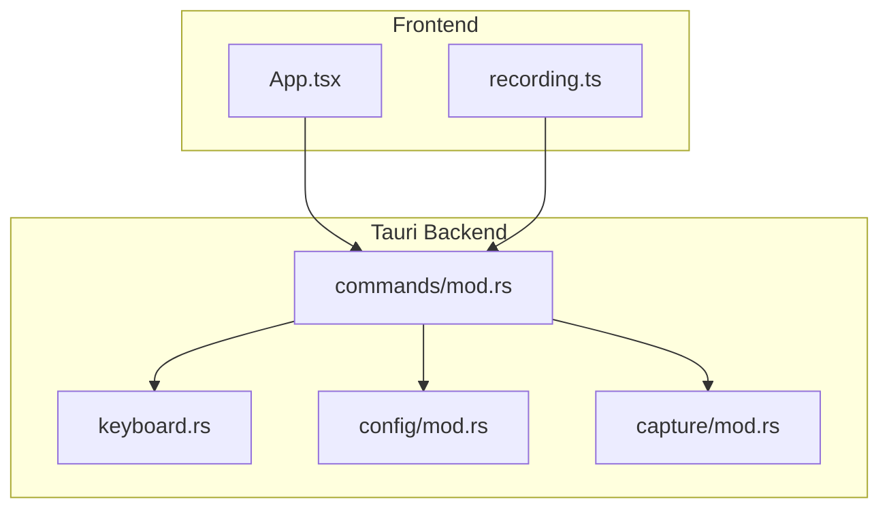
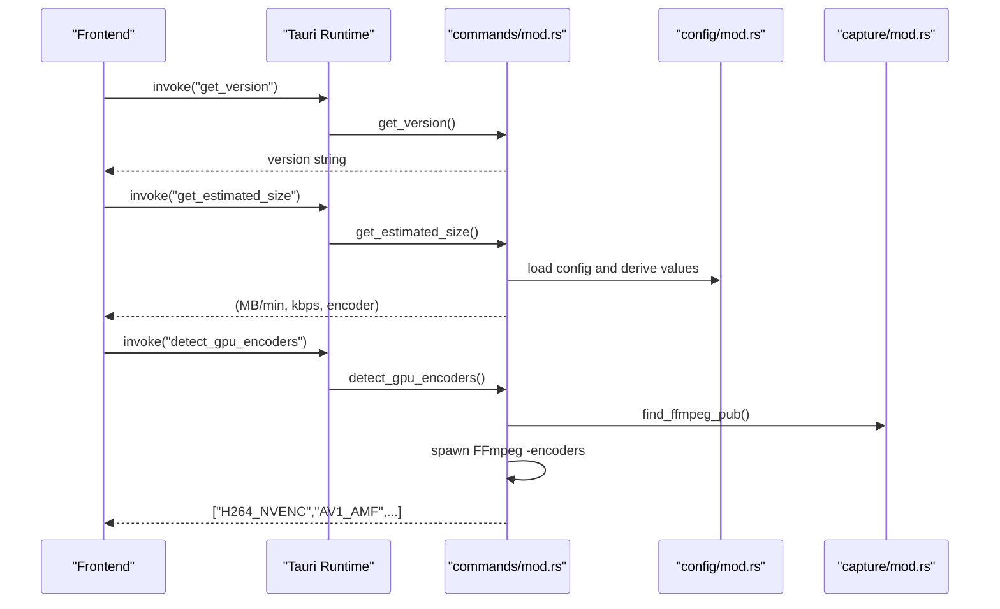
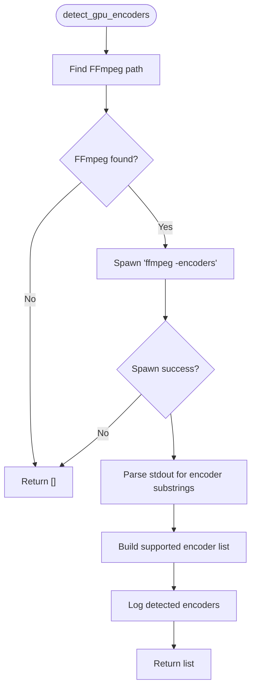
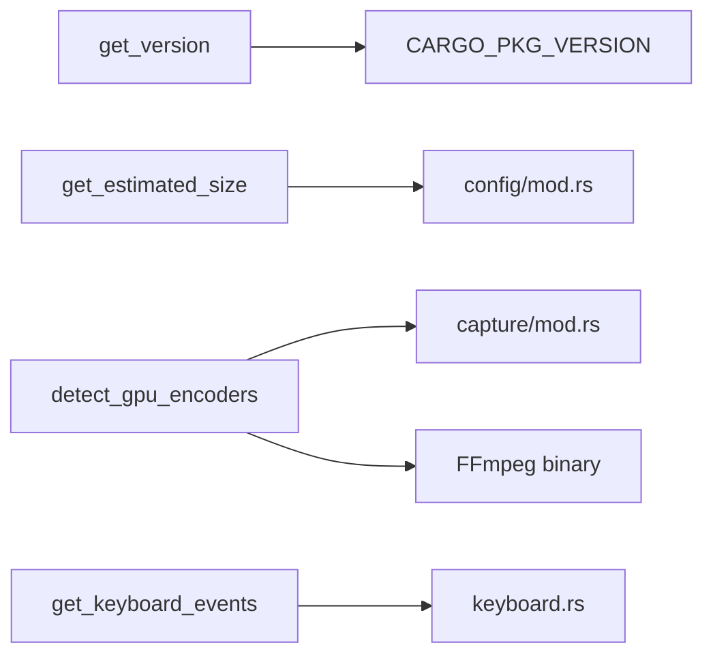

# Utility Commands

<cite>
**Referenced Files in This Document**
- [mod.rs](file://src-tauri/src/commands/mod.rs)
- [keyboard.rs](file://src-tauri/src/keyboard.rs)
- [mod.rs](file://src-tauri/src/capture/mod.rs)
- [mod.rs](file://src-tauri/src/config/mod.rs)
- [recording.ts](file://src/stores/recording.ts)
- [App.tsx](file://src/App.tsx)
</cite>

## Table of Contents
1. [Introduction](#introduction)
2. [Project Structure](#project-structure)
3. [Core Components](#core-components)
4. [Architecture Overview](#architecture-overview)
5. [Detailed Component Analysis](#detailed-component-analysis)
6. [Dependency Analysis](#dependency-analysis)
7. [Performance Considerations](#performance-considerations)
8. [Troubleshooting Guide](#troubleshooting-guide)
9. [Conclusion](#conclusion)

## Introduction
This document describes the EasySpecy utility commands that provide application metadata, performance estimation, hardware acceleration detection, and keyboard event management. It focuses on:
- get_version: retrieves the application version
- get_estimated_size: estimates recording size and bitrate based on current configuration
- detect_gpu_encoders: probes FFmpeg for available hardware encoders (NVENC, AMF, QSV variants)
- get_keyboard_events: captures keyboard events for overlay and recording features

It also documents the underlying algorithms, error handling, and fallback mechanisms for unsupported platforms or missing dependencies.

## Project Structure
The utility commands are implemented in the Tauri backend under src-tauri/src/commands/mod.rs and integrate with other subsystems:
- Keyboard event capture in src-tauri/src/keyboard.rs
- FFmpeg-based recording pipeline in src-tauri/src/capture/mod.rs
- Configuration-driven performance estimation in src-tauri/src/config/mod.rs
- Frontend invocation via Tauri’s invoke mechanism in src/stores/recording.ts and src/App.tsx

**Diagram sources**
- [mod.rs](file://src-tauri/src/commands/mod.rs)
- [keyboard.rs](file://src-tauri/src/keyboard.rs)
- [mod.rs](file://src-tauri/src/config/mod.rs)
- [mod.rs](file://src-tauri/src/capture/mod.rs)
- [recording.ts](file://src/stores/recording.ts)
- [App.tsx](file://src/App.tsx)

**Section sources**
- [mod.rs](file://src-tauri/src/commands/mod.rs)
- [keyboard.rs](file://src-tauri/src/keyboard.rs)
- [mod.rs](file://src-tauri/src/config/mod.rs)
- [mod.rs](file://src-tauri/src/capture/mod.rs)
- [recording.ts](file://src/stores/recording.ts)
- [App.tsx](file://src/App.tsx)

## Core Components
- Application version retrieval: get_version returns the compiled application version string.
- Performance estimation: get_estimated_size returns MB per minute, effective bitrate, and selected encoder string derived from configuration.
- Hardware encoder detection: detect_gpu_encoders executes FFmpeg -encoders and parses output to report supported encoders (NVENC, AMF, QSV, SVT-AV1).
- Keyboard event capture: get_keyboard_events returns a vector of captured keyboard events for overlay and logging.

**Section sources**
- [mod.rs](file://src-tauri/src/commands/mod.rs)
- [keyboard.rs](file://src-tauri/src/keyboard.rs)
- [mod.rs](file://src-tauri/src/config/mod.rs)
- [mod.rs](file://src-tauri/src/capture/mod.rs)

## Architecture Overview
The utility commands are exposed to the frontend via Tauri’s command system. The frontend invokes commands to fetch metadata, estimate performance, probe encoders, and capture keyboard events. The backend coordinates with configuration and capture modules to compute or retrieve the requested information.

**Diagram sources**
- [mod.rs](file://src-tauri/src/commands/mod.rs)
- [mod.rs](file://src-tauri/src/config/mod.rs)
- [mod.rs](file://src-tauri/src/capture/mod.rs)

## Detailed Component Analysis

### get_version
Purpose: Return the application version string.
Behavior:
- Reads the compile-time environment variable CARGO_PKG_VERSION and returns it as a string.
- No platform-specific logic; always succeeds when compiled.

Usage:
- Called during app initialization to display version in UI.

**Section sources**
- [mod.rs](file://src-tauri/src/commands/mod.rs)
- [App.tsx](file://src/App.tsx)

### get_estimated_size
Purpose: Provide performance estimation metadata for recording.
Behavior:
- Loads application configuration.
- Computes MB per minute, effective bitrate in kbps, and the selected encoder string.
- Returns a tuple containing these three values.

Configuration dependencies:
- Encoder selection influences quality/size trade-offs.
- Quality presets map to specific CRF/QP values that affect bitrate.

**Section sources**
- [mod.rs](file://src-tauri/src/commands/mod.rs)
- [mod.rs](file://src-tauri/src/config/mod.rs)
- [recording.ts](file://src/stores/recording.ts)

### detect_gpu_encoders
Purpose: Probe FFmpeg for available hardware encoders and return a list of supported ones.
Algorithm:
- Locate FFmpeg executable using capture::find_ffmpeg_pub().
- If not found, return an empty list (no-op fallback).
- Spawn FFmpeg with the -encoders argument and capture stdout.
- Parse the output for presence of specific encoder identifiers:
  - NVENC: h264_nvenc, hevc_nvenc, av1_nvenc
  - AMF: h264_amf, hevc_amf, av1_amf
  - QSV: h264_qsv, hevc_qsv, av1_qsv
  - SVT-AV1: libsvtav1 (CPU encoder variant)
- Log detected encoders and return the list.

Error handling and fallback:
- If FFmpeg is not found, return an empty list.
- If spawning FFmpeg fails, return an empty list.
- Output parsing uses substring checks; absence of a substring implies non-support.

Platform considerations:
- On Windows, a creation flag is set to hide the console window during FFmpeg invocation.

**Diagram sources**
- [mod.rs](file://src-tauri/src/commands/mod.rs)

**Section sources**
- [mod.rs](file://src-tauri/src/commands/mod.rs)

### get_keyboard_events
Purpose: Capture and return keyboard events for overlay and logging.
Behavior:
- Delegates to crate::keyboard::get_keyboard_events() to collect events.
- Returns a vector of keyboard events suitable for rendering overlays or analytics.

Frontend integration:
- Invoked by the recording store to obtain events for display or processing.

**Section sources**
- [mod.rs](file://src-tauri/src/commands/mod.rs)
- [keyboard.rs](file://src-tauri/src/keyboard.rs)
- [recording.ts](file://src/stores/recording.ts)

## Dependency Analysis
- get_estimated_size depends on configuration values for encoder selection and quality presets.
- detect_gpu_encoders depends on capture::find_ffmpeg_pub() and spawns FFmpeg to enumerate encoders.
- get_keyboard_events depends on the keyboard capture module.

**Diagram sources**
- [mod.rs](file://src-tauri/src/commands/mod.rs)
- [mod.rs](file://src-tauri/src/config/mod.rs)
- [mod.rs](file://src-tauri/src/capture/mod.rs)
- [keyboard.rs](file://src-tauri/src/keyboard.rs)

**Section sources**
- [mod.rs](file://src-tauri/src/commands/mod.rs)
- [mod.rs](file://src-tauri/src/config/mod.rs)
- [mod.rs](file://src-tauri/src/capture/mod.rs)
- [keyboard.rs](file://src-tauri/src/keyboard.rs)

## Performance Considerations
- detect_gpu_encoders spawns FFmpeg and parses its output. This is a one-time operation triggered by user actions or configuration changes, minimizing runtime overhead.
- get_estimated_size reads configuration and computes derived values without external processes, ensuring low latency.
- get_keyboard_events returns pre-collected events; ensure the capture loop is efficient to avoid backlog.

## Troubleshooting Guide
Common issues and resolutions:
- FFmpeg not found:
  - Symptom: detect_gpu_encoders returns an empty list.
  - Cause: FFmpeg binary not installed or not discoverable.
  - Resolution: Install FFmpeg and ensure it is on PATH or configure the application to locate it.
- FFmpeg spawn failure:
  - Symptom: detect_gpu_encoders returns an empty list after FFmpeg discovery.
  - Cause: Permission or process creation errors.
  - Resolution: Run with appropriate privileges; verify antivirus or OS restrictions.
- Unsupported platform:
  - Symptom: Certain encoders unavailable.
  - Cause: Platform lacks corresponding hardware drivers or FFmpeg build.
  - Resolution: Install compatible drivers and FFmpeg builds; select CPU encoders if necessary.
- Missing dependencies:
  - Symptom: get_estimated_size returns defaults or incorrect values.
  - Cause: Configuration not loaded or invalid.
  - Resolution: Verify configuration loading and encoder selection.

**Section sources**
- [mod.rs](file://src-tauri/src/commands/mod.rs)

## Conclusion
The utility commands provide essential metadata and capability detection for EasySpecy:
- get_version supplies the application version for UI and diagnostics.
- get_estimated_size offers quick performance insights based on configuration.
- detect_gpu_encoders enables dynamic hardware encoder selection by probing FFmpeg.
- get_keyboard_events supports overlay and logging workflows.

The implementation emphasizes robustness with explicit fallbacks and minimal external dependencies, ensuring reliable operation across diverse environments.