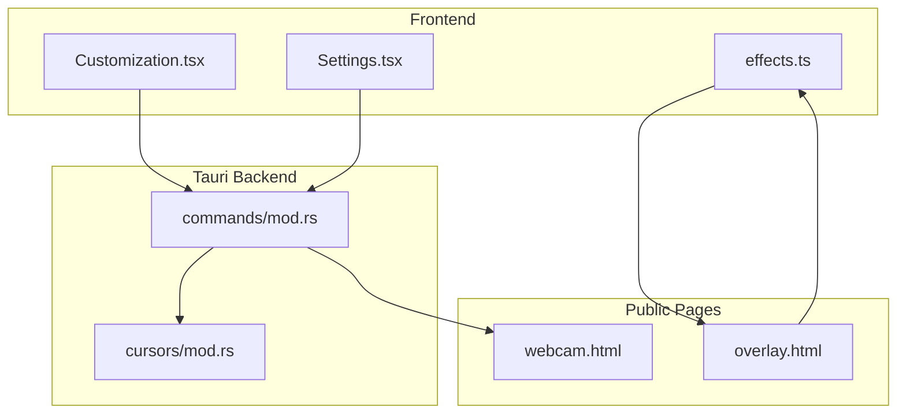
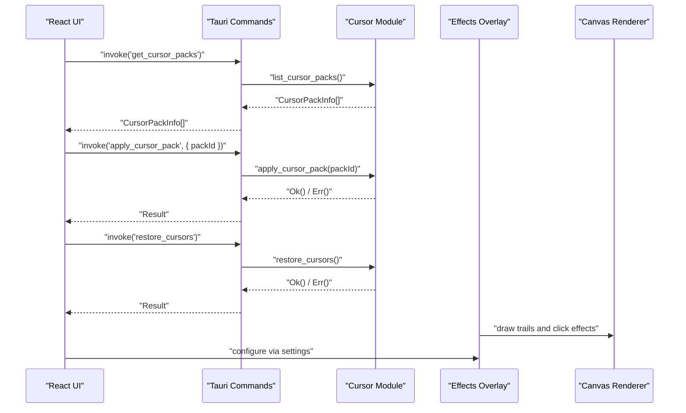
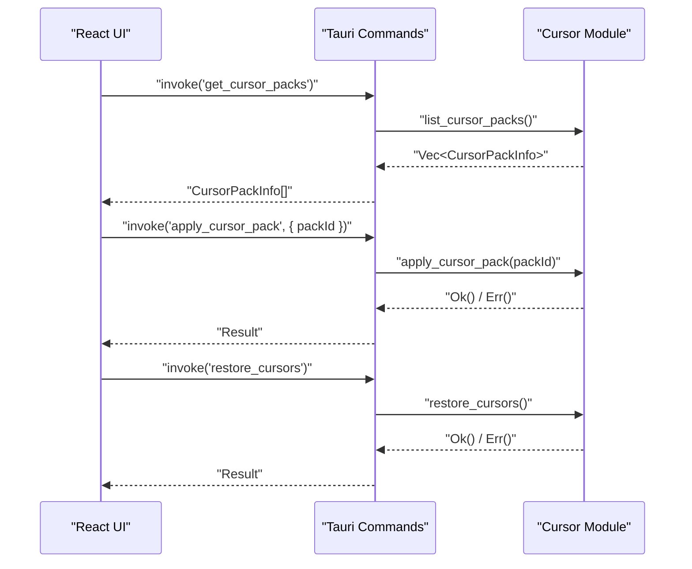
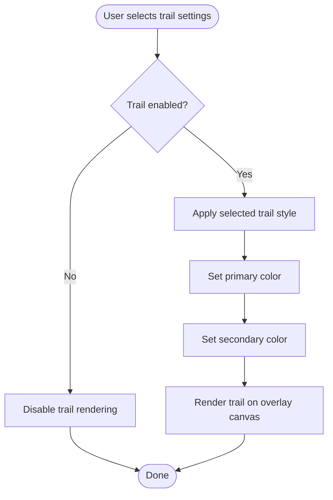
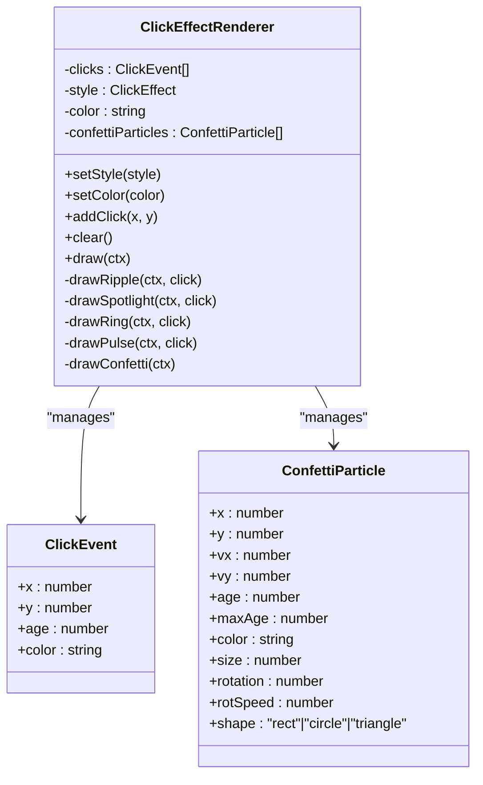
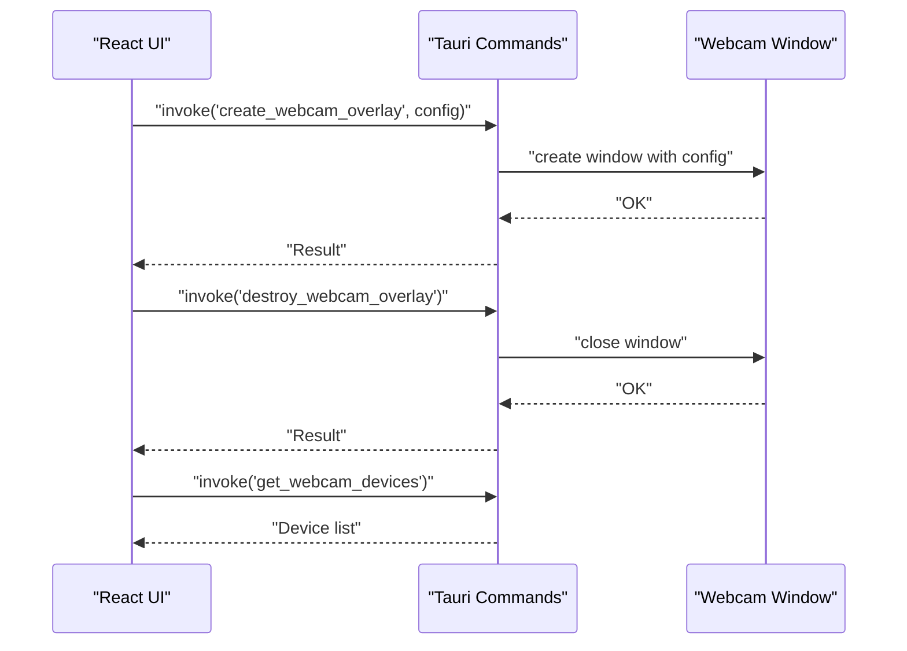
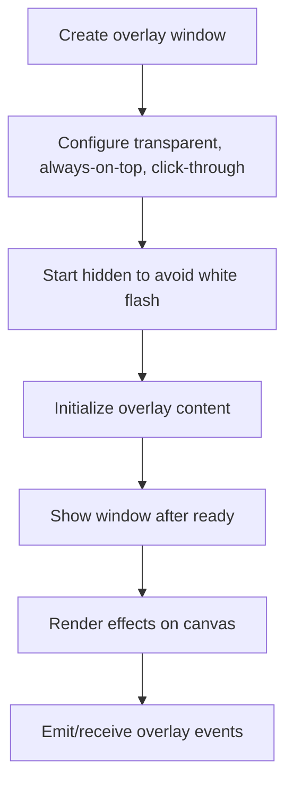
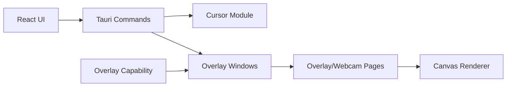

# Visual Effects Commands

<cite>
**Referenced Files in This Document**
- [Customization.tsx](file://src/components/Customization.tsx)
- [Settings.tsx](file://src/components/Settings.tsx)
- [mod.rs](file://src-tauri/src/cursors/mod.rs)
- [mod.rs](file://src-tauri/src/commands/mod.rs)
- [effects.ts](file://src/lib/effects.ts)
- [overlay.html](file://public/overlay.html)
- [webcam.html](file://public/webcam.html)
- [index.html](file://research/tauri-transparent-overlay_03_JUN_2026/index.html)
- [findings.json](file://research/tauri-transparent-overlay_03_JUN_2026/data/findings.json)
- [overlay.json](file://src-tauri/capabilities/overlay.json)
- [capabilities.json](file://src-tauri/gen/schemas/capabilities.json)
</cite>

## Table of Contents
1. [Introduction](#introduction)
2. [Project Structure](#project-structure)
3. [Core Components](#core-components)
4. [Architecture Overview](#architecture-overview)
5. [Detailed Component Analysis](#detailed-component-analysis)
6. [Dependency Analysis](#dependency-analysis)
7. [Performance Considerations](#performance-considerations)
8. [Troubleshooting Guide](#troubleshooting-guide)
9. [Conclusion](#conclusion)

## Introduction
This document provides comprehensive API documentation for EasySpecy's visual effects control commands. It covers:
- Cursor pack management: listing packs, applying packs, and restoring cursors
- Cursor trail system: style selection, primary color customization, and secondary color configuration
- Click effect system: ripple, spotlight, ring, pulse, and confetti effects
- Webcam overlay commands: creating and destroying overlays with positioning and sizing parameters
- Effects overlay window creation and management: transparency, always-on-top behavior, and capability permissions
- Integration between Rust backend effects processing and frontend overlay rendering

## Project Structure
The visual effects system spans three layers:
- Frontend React components manage user configuration and UI interactions
- Tauri backend exposes commands for system-level operations (cursor management, webcam overlay)
- Public HTML pages render overlay canvases and webcam streams

**Diagram sources**
- [Customization.tsx:206-266](file://src/components/Customization.tsx#L206-L266)
- [Settings.tsx:106-119](file://src/components/Settings.tsx#L106-L119)
- [mod.rs:636-714](file://src-tauri/src/commands/mod.rs#L636-L714)
- [mod.rs:64-98](file://src-tauri/src/cursors/mod.rs#L64-L98)
- [effects.ts:427-529](file://src/lib/effects.ts#L427-L529)
- [overlay.html:279-316](file://public/overlay.html#L279-L316)
- [webcam.html:1-77](file://public/webcam.html#L1-L77)

**Section sources**
- [Customization.tsx:206-266](file://src/components/Customization.tsx#L206-L266)
- [Settings.tsx:106-119](file://src/components/Settings.tsx#L106-L119)
- [mod.rs:636-714](file://src-tauri/src/commands/mod.rs#L636-L714)
- [mod.rs:64-98](file://src-tauri/src/cursors/mod.rs#L64-L98)
- [effects.ts:427-529](file://src/lib/effects.ts#L427-L529)
- [overlay.html:279-316](file://public/overlay.html#L279-L316)
- [webcam.html:1-77](file://public/webcam.html#L1-L77)

## Core Components
- Cursor pack management: list packs, apply a selected pack, and restore system cursors
- Trail effect: select style, set primary color, and configure secondary color
- Click effects: choose among ripple, spotlight, ring, pulse, and confetti
- Webcam overlay: create/destroy overlay windows with position, size, shape, border, opacity, and media filters
- Effects overlay: transparent, always-on-top window with capability permissions and event emission

**Section sources**
- [mod.rs:35-57](file://src-tauri/src/cursors/mod.rs#L35-L57)
- [mod.rs:64-98](file://src-tauri/src/cursors/mod.rs#L64-L98)
- [Customization.tsx:216-229](file://src/components/Customization.tsx#L216-L229)
- [Settings.tsx:507-552](file://src/components/Settings.tsx#L507-L552)
- [effects.ts:427-529](file://src/lib/effects.ts#L427-L529)
- [mod.rs:636-714](file://src-tauri/src/commands/mod.rs#L636-L714)
- [overlay.json:1-1](file://src-tauri/capabilities/overlay.json#L1-L1)

## Architecture Overview
The visual effects pipeline integrates frontend configuration with Rust backend commands and HTML overlay rendering.

**Diagram sources**
- [mod.rs:35-57](file://src-tauri/src/cursors/mod.rs#L35-L57)
- [mod.rs:64-98](file://src-tauri/src/cursors/mod.rs#L64-L98)
- [Customization.tsx:216-229](file://src/components/Customization.tsx#L216-L229)
- [effects.ts:427-529](file://src/lib/effects.ts#L427-L529)
- [overlay.html:279-316](file://public/overlay.html#L279-L316)

## Detailed Component Analysis

### Cursor Pack Management
- Purpose: Manage system cursors during recording and restore defaults afterward
- Supported packs: default, macOS, Posy, Specy Classic, EasySpecy, plus user-installed custom packs
- Operations:
  - List available cursor packs
  - Apply a selected pack (Windows-specific)
  - Restore system cursors

**Diagram sources**
- [mod.rs:35-57](file://src-tauri/src/cursors/mod.rs#L35-L57)
- [mod.rs:64-98](file://src-tauri/src/cursors/mod.rs#L64-L98)
- [Customization.tsx:216-229](file://src/components/Customization.tsx#L216-L229)
- [Settings.tsx:106-119](file://src/components/Settings.tsx#L106-L119)

**Section sources**
- [mod.rs:35-57](file://src-tauri/src/cursors/mod.rs#L35-L57)
- [mod.rs:64-98](file://src-tauri/src/cursors/mod.rs#L64-L98)
- [Customization.tsx:216-229](file://src/components/Customization.tsx#L216-L229)
- [Settings.tsx:106-119](file://src/components/Settings.tsx#L106-L119)

### Cursor Trail System
- Configuration:
  - Enable/disable trail effect
  - Select trail style (from frontend settings)
  - Set primary color (affects trail and click effect color)
  - Set secondary color (right-click glow gradient)
- Rendering:
  - Trail effect rendered on overlay canvas
  - Click effect color synchronized with trail primary color

**Diagram sources**
- [Settings.tsx:507-552](file://src/components/Settings.tsx#L507-L552)
- [Customization.tsx:343-370](file://src/components/Customization.tsx#L343-L370)
- [effects.ts:383-414](file://src/lib/effects.ts#L383-L414)
- [overlay.html:279-316](file://public/overlay.html#L279-L316)

**Section sources**
- [Settings.tsx:507-552](file://src/components/Settings.tsx#L507-L552)
- [Customization.tsx:343-370](file://src/components/Customization.tsx#L343-L370)
- [effects.ts:383-414](file://src/lib/effects.ts#L383-L414)
- [overlay.html:279-316](file://public/overlay.html#L279-L316)

### Click Effect System
- Available effects: ripple, spotlight, ring, pulse, confetti
- Behavior:
  - Ripple: concentric expanding rings with fade
  - Spotlight: radial gradient with diminishing intensity
  - Ring: single expanding ring
  - Pulse: central pulse with expanding halo
  - Confetti: particle explosion with multiple colors and shapes
- Configuration:
  - Select effect type
  - Set effect color (affects ripple, spotlight, ring, pulse)
  - Confetti uses internal palette derived from effect color

**Diagram sources**
- [effects.ts:427-529](file://src/lib/effects.ts#L427-L529)

**Section sources**
- [effects.ts:427-529](file://src/lib/effects.ts#L427-L529)
- [overlay.html:288-316](file://public/overlay.html#L288-L316)

### Webcam Overlay Commands
- Creation:
  - Command: create webcam overlay window
  - Parameters: position (x, y), size, shape, border, opacity, device, filters (brightness, contrast, sharpen)
  - Behavior: transparent, always-on-top, click-through, off-taskbar
- Destruction:
  - Command: destroy webcam overlay window
- Device enumeration:
  - Command: list available webcam devices

**Diagram sources**
- [mod.rs:636-714](file://src-tauri/src/commands/mod.rs#L636-L714)
- [webcam.html:1-77](file://public/webcam.html#L1-L77)

**Section sources**
- [mod.rs:636-714](file://src-tauri/src/commands/mod.rs#L636-L714)
- [webcam.html:1-77](file://public/webcam.html#L1-L77)

### Effects Overlay Window Management
- Window configuration:
  - Transparent, no decorations, always on top, click-through
  - Hidden at startup to avoid white flash, shown after initialization
  - Off-taskbar and non-resizable
- Capability permissions:
  - Dedicated overlay capability allows core events and listening
- Frontend rendering:
  - Fullscreen canvas with pointer-events disabled to pass clicks through
  - Background transparent to show underlying content

**Diagram sources**
- [index.html:208-252](file://research/tauri-transparent-overlay_03_JUN_2026/index.html#L208-L252)
- [findings.json:21-37](file://research/tauri-transparent-overlay_03_JUN_2026/data/findings.json#L21-L37)
- [overlay.json:1-1](file://src-tauri/capabilities/overlay.json#L1-L1)
- [capabilities.json:1-1](file://src-tauri/gen/schemas/capabilities.json#L1-L1)
- [overlay.html:244-251](file://public/overlay.html#L244-L251)

**Section sources**
- [index.html:208-252](file://research/tauri-transparent-overlay_03_JUN_2026/index.html#L208-L252)
- [findings.json:21-37](file://research/tauri-transparent-overlay_03_JUN_2026/data/findings.json#L21-L37)
- [overlay.json:1-1](file://src-tauri/capabilities/overlay.json#L1-L1)
- [capabilities.json:1-1](file://src-tauri/gen/schemas/capabilities.json#L1-L1)
- [overlay.html:244-251](file://public/overlay.html#L244-L251)

## Dependency Analysis
- Frontend-to-backend:
  - React components invoke Tauri commands for cursor and webcam operations
  - Settings and customization components synchronize with configuration storage
- Backend-to-frontend:
  - Overlay HTML pages render effects and webcam streams
  - Tauri commands create and manage overlay windows with specific attributes
- Capabilities:
  - Overlay capability grants event emission/listening permissions for effects overlay

**Diagram sources**
- [Customization.tsx:216-229](file://src/components/Customization.tsx#L216-L229)
- [Settings.tsx:106-119](file://src/components/Settings.tsx#L106-L119)
- [mod.rs:636-714](file://src-tauri/src/commands/mod.rs#L636-L714)
- [mod.rs:64-98](file://src-tauri/src/cursors/mod.rs#L64-L98)
- [overlay.json:1-1](file://src-tauri/capabilities/overlay.json#L1-L1)

**Section sources**
- [Customization.tsx:216-229](file://src/components/Customization.tsx#L216-L229)
- [Settings.tsx:106-119](file://src/components/Settings.tsx#L106-L119)
- [mod.rs:636-714](file://src-tauri/src/commands/mod.rs#L636-L714)
- [mod.rs:64-98](file://src-tauri/src/cursors/mod.rs#L64-L98)
- [overlay.json:1-1](file://src-tauri/capabilities/overlay.json#L1-L1)

## Performance Considerations
- Overlay rendering:
  - Canvas drawing operations should be optimized; minimize redraws and use efficient drawing routines
  - Trail smoothing and click effect animations should balance visual quality with CPU/GPU usage
- Webcam overlay:
  - Stream constraints and filters (brightness, contrast) impact performance; adjust based on device capabilities
  - Keep overlay window hidden until stream is ready to avoid unnecessary GPU work
- Cursor swaps:
  - Apply and restore operations are Windows-specific and should be invoked sparingly to reduce overhead

## Troubleshooting Guide
- Cursor pack not applying:
  - Verify pack ID exists and is supported; check platform compatibility (Windows)
  - Ensure restore is called after recording to avoid persistent cursor changes
- Trail effect not visible:
  - Confirm trail is enabled in settings and overlay window is active
  - Check color values and opacity settings
- Click effects missing:
  - Verify effect type is selected and color is set appropriately
  - For confetti, ensure effect renderer is initialized and drawing loop runs
- Webcam overlay not appearing:
  - Confirm overlay window is created with correct parameters and shown after stream initialization
  - Check device permissions and constraints
- Overlay transparency issues:
  - Ensure window is configured as transparent and click-through, and page background is fully transparent

**Section sources**
- [mod.rs:64-98](file://src-tauri/src/cursors/mod.rs#L64-L98)
- [effects.ts:427-529](file://src/lib/effects.ts#L427-L529)
- [mod.rs:636-714](file://src-tauri/src/commands/mod.rs#L636-L714)
- [overlay.html:244-251](file://public/overlay.html#L244-L251)

## Conclusion
EasySpecy's visual effects system combines configurable frontend controls with robust Rust-backed commands and HTML-based overlays. The cursor pack management, trail and click effects, and webcam overlay features provide a cohesive post-processing enhancement. Proper configuration of overlay windows, capability permissions, and rendering ensures a seamless, transparent, and performant user experience.