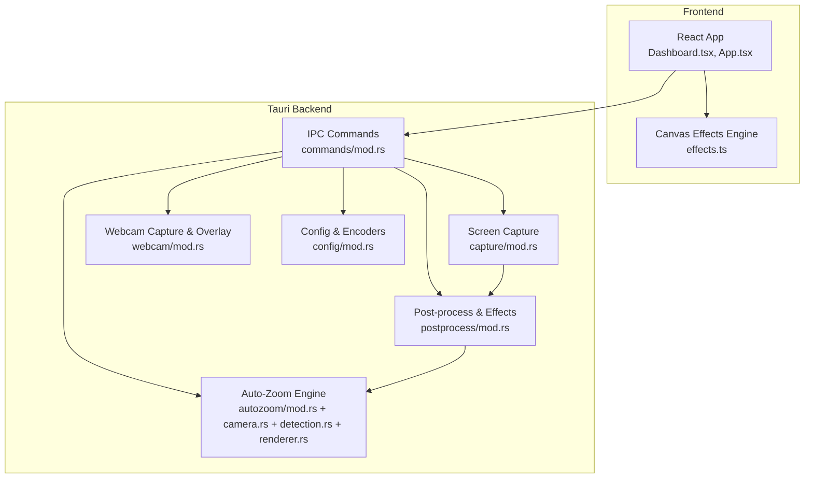
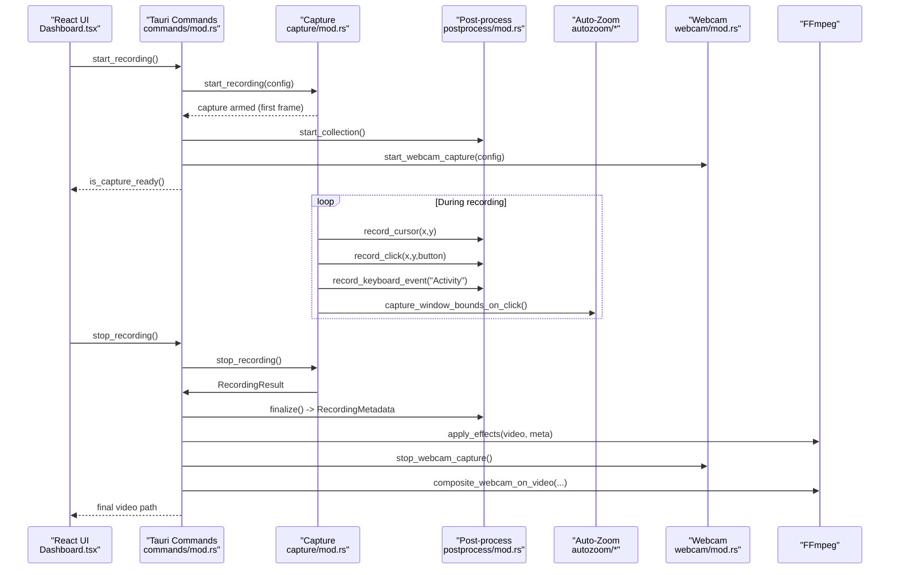
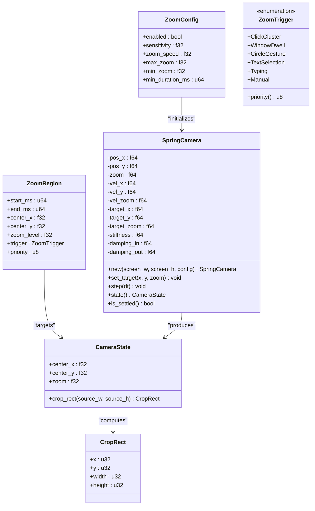
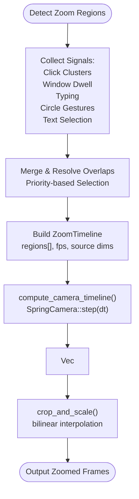
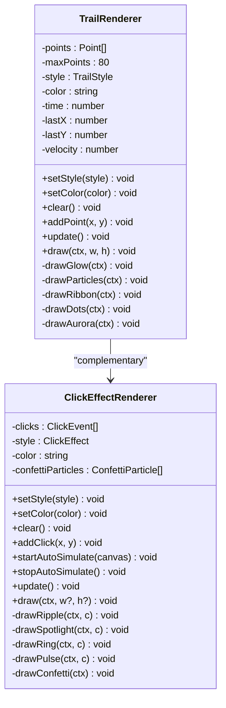
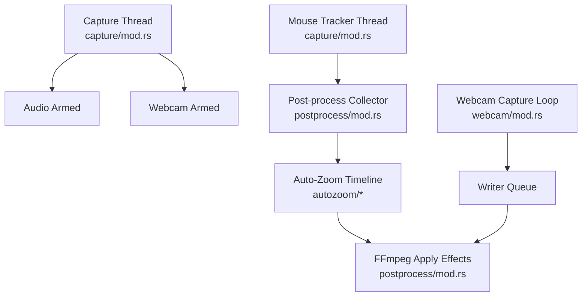
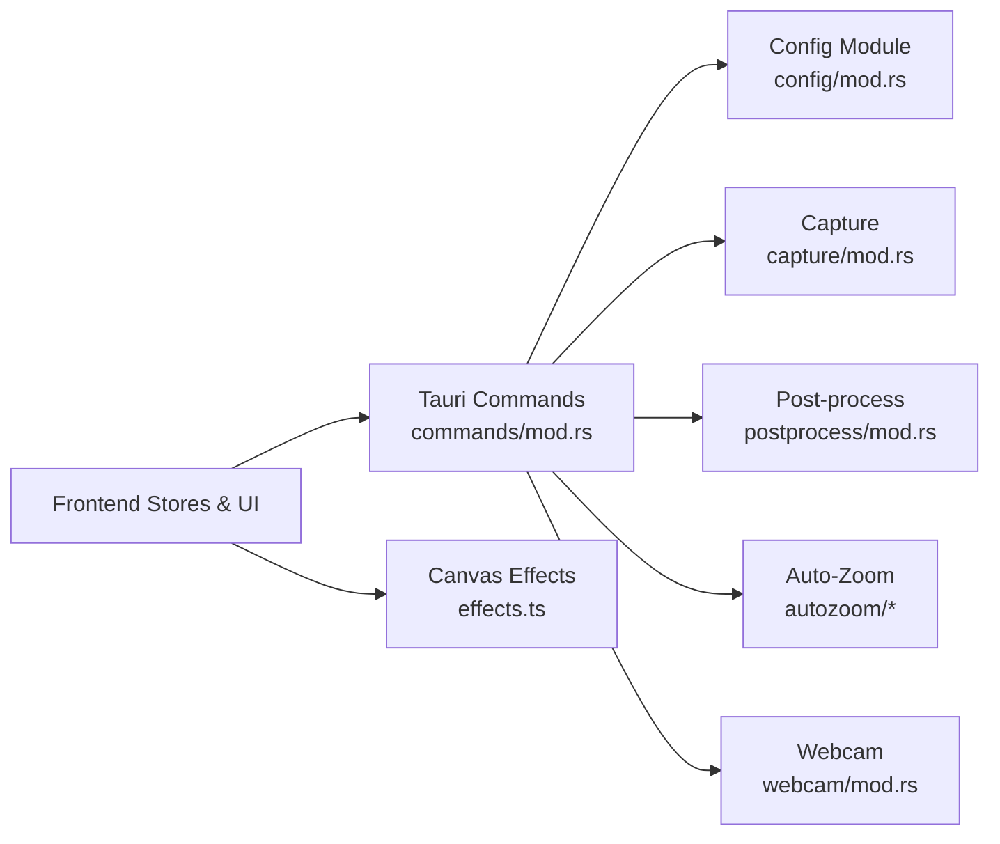
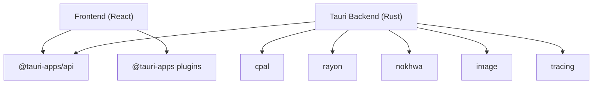

# Advanced Topics

<cite>
**Referenced Files in This Document**
- [mod.rs](file://src-tauri/src/autozoom/mod.rs)
- [camera.rs](file://src-tauri/src/autozoom/camera.rs)
- [detection.rs](file://src-tauri/src/autozoom/detection.rs)
- [renderer.rs](file://src-tauri/src/autozoom/renderer.rs)
- [mod.rs](file://src-tauri/src/postprocess/mod.rs)
- [mod.rs](file://src-tauri/src/webcam/mod.rs)
- [mod.rs](file://src-tauri/src/commands/mod.rs)
- [mod.rs](file://src-tauri/src/config/mod.rs)
- [mod.rs](file://src-tauri/src/capture/mod.rs)
- [effects.ts](file://src/lib/effects.ts)
- [Dashboard.tsx](file://src/components/Dashboard.tsx)
- [App.tsx](file://src/App.tsx)
- [Cargo.toml](file://src-tauri/Cargo.toml)
- [package.json](file://package.json)
</cite>

## Table of Contents
1. [Introduction](#introduction)
2. [Project Structure](#project-structure)
3. [Core Components](#core-components)
4. [Architecture Overview](#architecture-overview)
5. [Detailed Component Analysis](#detailed-component-analysis)
6. [Dependency Analysis](#dependency-analysis)
7. [Performance Considerations](#performance-considerations)
8. [Troubleshooting Guide](#troubleshooting-guide)
9. [Conclusion](#conclusion)
10. [Appendices](#appendices)

## Introduction
This document provides advanced technical documentation for EasySpecy’s sophisticated recording pipeline, focusing on the auto-zoom algorithm, camera detection and tracking systems, canvas-based visual effects, multi-threading architecture, and extensibility points. It also covers performance profiling, memory management strategies, platform-specific optimizations, advanced configuration scenarios, and integration patterns with external tools such as FFmpeg and Nokhwa.

## Project Structure
EasySpecy is a Tauri v2 application with a hybrid architecture:
- Frontend: React + Vite, with a custom canvas effects engine for runtime overlays and previews.
- Backend: Rust-based Tauri commands and modules for capture, post-processing, webcam, configuration, and synchronization.
- Rendering pipeline: Real-time capture with optional live overlays and post-processing with FFmpeg.

**Diagram sources**
- [Dashboard.tsx:218-586](file://src/components/Dashboard.tsx#L218-L586)
- [App.tsx:1-208](file://src/App.tsx#L1-L208)
- [mod.rs:1-715](file://src-tauri/src/commands/mod.rs#L1-L715)
- [mod.rs:1-800](file://src-tauri/src/capture/mod.rs#L1-L800)
- [mod.rs:1-800](file://src-tauri/src/postprocess/mod.rs#L1-L800)
- [mod.rs:1-101](file://src-tauri/src/autozoom/mod.rs#L1-L101)
- [camera.rs:1-203](file://src-tauri/src/autozoom/camera.rs#L1-L203)
- [detection.rs:1-497](file://src-tauri/src/autozoom/detection.rs#L1-L497)
- [renderer.rs:1-117](file://src-tauri/src/autozoom/renderer.rs#L1-L117)
- [mod.rs:1-620](file://src-tauri/src/webcam/mod.rs#L1-L620)
- [mod.rs:1-432](file://src-tauri/src/config/mod.rs#L1-L432)

**Section sources**
- [Dashboard.tsx:218-586](file://src/components/Dashboard.tsx#L218-L586)
- [App.tsx:1-208](file://src/App.tsx#L1-L208)
- [Cargo.toml:1-61](file://src-tauri/Cargo.toml#L1-L61)
- [package.json:1-36](file://package.json#L1-L36)

## Core Components
- Auto-Zoom Engine: Generates intelligent zoom timelines from cursor, click, window, and keyboard events; simulates smooth camera motion with spring physics; renders crop+scale frames for zoom.
- Post-processing & Effects: Collects cursor trails and click metadata during recording; applies cursor trails and click effects via FFmpeg overlays; supports keyboard overlay bubbles and confetti.
- Webcam Capture & Overlay: Captures camera frames with producer-consumer threading; generates shape masks; composites webcam onto video with accurate FPS matching.
- Canvas Effects Engine: Runtime trail and click effects for preview and overlay windows; supports multiple styles and dynamic particle simulations.
- Synchronization & Encoding: Ensures video/audio sync within 1 ms; real-time progress reporting; configurable encoders and quality presets.

**Section sources**
- [mod.rs:1-101](file://src-tauri/src/autozoom/mod.rs#L1-L101)
- [camera.rs:1-203](file://src-tauri/src/autozoom/camera.rs#L1-L203)
- [detection.rs:1-497](file://src-tauri/src/autozoom/detection.rs#L1-L497)
- [renderer.rs:1-117](file://src-tauri/src/autozoom/renderer.rs#L1-L117)
- [mod.rs:1-800](file://src-tauri/src/postprocess/mod.rs#L1-L800)
- [mod.rs:1-620](file://src-tauri/src/webcam/mod.rs#L1-L620)
- [effects.ts:1-702](file://src/lib/effects.ts#L1-L702)

## Architecture Overview
The recording lifecycle integrates capture, metadata collection, auto-zoom computation, and FFmpeg post-processing.

**Diagram sources**
- [mod.rs:241-395](file://src-tauri/src/commands/mod.rs#L241-L395)
- [mod.rs:160-714](file://src-tauri/src/capture/mod.rs#L160-L714)
- [mod.rs:76-190](file://src-tauri/src/postprocess/mod.rs#L76-L190)
- [mod.rs:11-44](file://src-tauri/src/autozoom/detection.rs#L11-L44)
- [mod.rs:119-156](file://src-tauri/src/webcam/mod.rs#L119-L156)

## Detailed Component Analysis

### Auto-Zoom Engine
The auto-zoom system detects triggers from user interactions and produces a smooth camera animation timeline.

**Diagram sources**
- [mod.rs:16-101](file://src-tauri/src/autozoom/mod.rs#L16-L101)
- [camera.rs:8-159](file://src-tauri/src/autozoom/camera.rs#L8-L159)

**Diagram sources**
- [detection.rs:11-44](file://src-tauri/src/autozoom/detection.rs#L11-L44)
- [detection.rs:461-496](file://src-tauri/src/autozoom/detection.rs#L461-L496)
- [camera.rs:161-202](file://src-tauri/src/autozoom/camera.rs#L161-L202)
- [renderer.rs:10-70](file://src-tauri/src/autozoom/renderer.rs#L10-L70)

**Section sources**
- [mod.rs:1-101](file://src-tauri/src/autozoom/mod.rs#L1-L101)
- [camera.rs:1-203](file://src-tauri/src/autozoom/camera.rs#L1-L203)
- [detection.rs:1-497](file://src-tauri/src/autozoom/detection.rs#L1-L497)
- [renderer.rs:1-117](file://src-tauri/src/autozoom/renderer.rs#L1-L117)

### Camera Detection and Tracking Systems
- Metadata collection: Records cursor positions, clicks, window bounds, and keyboard events with precise timestamps aligned to the first video frame.
- Trigger detection: Implements multiple heuristics (click clusters, window dwell, typing, circle gestures, text selection) with sensitivity and priority controls.
- Camera simulation: Spring-damped harmonic oscillator with asymmetric damping for responsive zoom-in/out.
- Rendering: Bilinear interpolation crop-and-scale for smooth zoom transitions.

**Section sources**
- [mod.rs:76-190](file://src-tauri/src/postprocess/mod.rs#L76-L190)
- [detection.rs:23-44](file://src-tauri/src/autozoom/detection.rs#L23-L44)
- [camera.rs:73-159](file://src-tauri/src/autozoom/camera.rs#L73-L159)
- [renderer.rs:10-70](file://src-tauri/src/autozoom/renderer.rs#L10-L70)

### Canvas-Based Animation Systems
The frontend effects engine provides interactive trail and click effects for preview and overlay windows.

**Diagram sources**
- [effects.ts:84-414](file://src/lib/effects.ts#L84-L414)
- [effects.ts:427-677](file://src/lib/effects.ts#L427-L677)

**Section sources**
- [effects.ts:1-702](file://src/lib/effects.ts#L1-L702)

### Multi-Threading Architecture
- Capture thread: Driven by Windows Graphics Capture API; writes frames to an encoder; arms audio and webcam on first frame arrival.
- Mouse tracking thread: Polls cursor and buttons at ~120 Hz; emits events to overlay and records metadata.
- Webcam capture loop: Immediate camera open; producer-consumer with a writer thread; drops frames if writer is overloaded.
- Post-processing: Parallel pre-computation of trail segments and click effects; batched rendering with Rayon; FFmpeg progress parsing.

**Diagram sources**
- [mod.rs:270-401](file://src-tauri/src/capture/mod.rs#L270-L401)
- [mod.rs:407-580](file://src-tauri/src/webcam/mod.rs#L407-L580)
- [mod.rs:320-556](file://src-tauri/src/postprocess/mod.rs#L320-L556)

**Section sources**
- [mod.rs:1-800](file://src-tauri/src/capture/mod.rs#L1-L800)
- [mod.rs:1-620](file://src-tauri/src/webcam/mod.rs#L1-L620)
- [mod.rs:1-800](file://src-tauri/src/postprocess/mod.rs#L1-L800)

### Plugin Architecture and Extensibility
- Tauri commands: Centralized IPC surface for configuration updates, device queries, and lifecycle control.
- Config module: TOML-backed settings with encoder presets, quality, and feature toggles.
- Effects engine: Modular trail and click effect classes; easy to extend with new styles.
- Auto-zoom: Pluggable trigger detectors; priority-based conflict resolution allows adding new triggers.

**Diagram sources**
- [mod.rs:1-715](file://src-tauri/src/commands/mod.rs#L1-L715)
- [mod.rs:1-432](file://src-tauri/src/config/mod.rs#L1-L432)
- [effects.ts:1-702](file://src/lib/effects.ts#L1-L702)

**Section sources**
- [mod.rs:1-715](file://src-tauri/src/commands/mod.rs#L1-L715)
- [mod.rs:1-432](file://src-tauri/src/config/mod.rs#L1-L432)
- [effects.ts:1-702](file://src/lib/effects.ts#L1-L702)

### Platform-Specific Optimizations
- Windows: Uses Windows Capture API for low-latency screen capture; integrates with Windows GDI and shell APIs; GPU encoders detected via FFmpeg probing.
- macOS: Uses Screencapturekit for native capture.
- Linux: Uses PipeWire for capture and audio.
- Nokhwa: Cross-platform webcam capture with native backends; shape masks for PiP compositing.

**Section sources**
- [Cargo.toml:52-61](file://src-tauri/Cargo.toml#L52-L61)
- [mod.rs:1-800](file://src-tauri/src/capture/mod.rs#L1-L800)
- [mod.rs:1-620](file://src-tauri/src/webcam/mod.rs#L1-L620)

### Advanced Configuration Scenarios
- Encoder selection and tuning: Choose from H264, H265, AV1, VP9, and GPU-accelerated variants; presets map to CRF or QP and extra encoder params.
- Quality estimation: MB-per-minute estimates based on encoder efficiency and resolution/fps scaling.
- Auto-zoom sensitivity and speed: Tune trigger thresholds and camera responsiveness.
- Webcam post-processing: Brightness, contrast, sharpen; shape masks for circular, rounded, or squircle overlays.

**Section sources**
- [mod.rs:244-432](file://src-tauri/src/config/mod.rs#L244-L432)
- [mod.rs:160-224](file://src-tauri/src/commands/mod.rs#L160-L224)

### Scripting and Integration
- FFmpeg integration: Real-time progress parsing via -progress pipe:1; crop, overlay, and merge stages; GPU encoder detection.
- Device enumeration: Audio devices, webcam devices, and displays exposed via Tauri commands.
- External tools: Nokhwa for webcam; Windows Capture API for screen; PipeWire/macOS frameworks for other platforms.

**Section sources**
- [mod.rs:424-500](file://src-tauri/src/capture/mod.rs#L424-L500)
- [mod.rs:127-144](file://src-tauri/src/commands/mod.rs#L127-L144)
- [mod.rs:694-708](file://src-tauri/src/commands/mod.rs#L694-L708)

## Dependency Analysis
- Frontend dependencies: React, TailwindCSS, Motion, Zustand for state, and Tauri plugins for global shortcuts and opener.
- Backend dependencies: Tauri v2, cpal for audio, rayon for parallelism, nokhwa for webcam, image for masks, tracing for logging.

**Diagram sources**
- [package.json:12-35](file://package.json#L12-L35)
- [Cargo.toml:26-61](file://src-tauri/Cargo.toml#L26-L61)

**Section sources**
- [package.json:1-36](file://package.json#L1-L36)
- [Cargo.toml:1-61](file://src-tauri/Cargo.toml#L1-L61)

## Performance Considerations
- Parallel rendering: Rayon-based batch rendering of frames; pre-computes trail segments and click effects; minimizes per-frame work.
- Memory management: Pre-sized buffers for camera states and frame batches; avoids allocations in hot loops; cleans up temp directories.
- Encoding progress: Real-time progress mapped to UI stages; reduces perceived latency.
- GPU acceleration: Automatic detection of NVENC/AMF/QSV encoders; fallback to CPU encoders when unavailable.
- Frame pacing: Minimum update intervals and polling cadence tuned for smoothness and throughput.

[No sources needed since this section provides general guidance]

## Troubleshooting Guide
- Webcam errors: Surface via Tauri events; frontend shows user-friendly notifications; backend logs detailed reasons.
- Sync verification: Post-encode checks ensure video/audio alignment; logs errors if drift exceeds thresholds.
- FFmpeg failures: Graceful fallbacks (simple overlay without mask) and detailed stderr parsing for diagnostics.
- Device contention: Releases browser webcam streams when native capture is needed.

**Section sources**
- [mod.rs:114-117](file://src-tauri/src/webcam/mod.rs#L114-L117)
- [mod.rs:644-664](file://src-tauri/src/capture/mod.rs#L644-L664)
- [mod.rs:51-58](file://src-tauri/src/commands/mod.rs#L51-L58)

## Conclusion
EasySpecy combines a robust Rust backend with a reactive frontend to deliver a high-performance, extensible screen recording solution. The auto-zoom engine, canvas effects, and multi-threaded capture pipeline provide professional-grade features, while the modular design and Tauri IPC surface support advanced customization and integration scenarios.

[No sources needed since this section summarizes without analyzing specific files]

## Appendices

### Visual Effects Rendering Pipeline
- Pre-smooth cursor path using Catmull-Rom splines.
- Per-frame pre-computation of trail segments and click effects.
- Batched rendering with Rayon; bilinear crop+scale for zoom.
- Optional keyboard overlay bubbles and confetti.

**Section sources**
- [mod.rs:558-604](file://src-tauri/src/postprocess/mod.rs#L558-L604)
- [mod.rs:320-556](file://src-tauri/src/postprocess/mod.rs#L320-L556)
- [renderer.rs:10-70](file://src-tauri/src/autozoom/renderer.rs#L10-L70)

### Custom Effect Development Guidelines
- Extend TrailRenderer or ClickEffectRenderer with new styles and particle systems.
- Maintain performance by limiting per-frame allocations and using precomputed arrays.
- Integrate with the overlay window via Tauri events for live previews.

**Section sources**
- [effects.ts:84-414](file://src/lib/effects.ts#L84-L414)
- [effects.ts:427-677](file://src/lib/effects.ts#L427-L677)

### Plugin Architecture for Extending Functionality
- Add new Tauri commands under commands/mod.rs for new features.
- Register new IPC handlers and expose device enumerations or configuration toggles.
- Integrate with capture/mod.rs for new capture modes or metadata collectors.

**Section sources**
- [mod.rs:1-715](file://src-tauri/src/commands/mod.rs#L1-L715)
- [mod.rs:1-800](file://src-tauri/src/capture/mod.rs#L1-L800)

### Performance Profiling Techniques
- Use tracing spans around heavy operations (FFmpeg stages, webcam compositing).
- Monitor encoding progress and stage transitions for bottlenecks.
- Profile CPU usage with Rayon’s parallel tasks and GPU utilization for encoders.

**Section sources**
- [mod.rs:424-500](file://src-tauri/src/capture/mod.rs#L424-L500)
- [mod.rs:234-328](file://src-tauri/src/webcam/mod.rs#L234-L328)

### Memory Management Strategies
- Pre-size vectors for camera states and frame batches.
- Use atomic counters and minimal shared state between threads.
- Clean temporary directories and avoid retaining large buffers after use.

**Section sources**
- [camera.rs:175-202](file://src-tauri/src/autozoom/camera.rs#L175-L202)
- [mod.rs:320-556](file://src-tauri/src/postprocess/mod.rs#L320-L556)

### Advanced Configuration Scenarios
- Select GPU encoders dynamically; adjust quality presets and bitrates.
- Tune auto-zoom sensitivity and camera speed for different workflows.
- Configure webcam brightness/contrast/sharpen and overlay positioning.

**Section sources**
- [mod.rs:160-224](file://src-tauri/src/commands/mod.rs#L160-L224)
- [mod.rs:244-432](file://src-tauri/src/config/mod.rs#L244-L432)

### Integration with External Tools
- FFmpeg: Crop, overlay, merge, and encode with progress reporting.
- Nokhwa: Cross-platform webcam capture with shape masks.
- Platform SDKs: Windows Capture API, macOS Screencapturekit, PipeWire.

**Section sources**
- [mod.rs:763-800](file://src-tauri/src/capture/mod.rs#L763-L800)
- [mod.rs:407-580](file://src-tauri/src/webcam/mod.rs#L407-L580)
- [Cargo.toml:52-61](file://src-tauri/Cargo.toml#L52-L61)