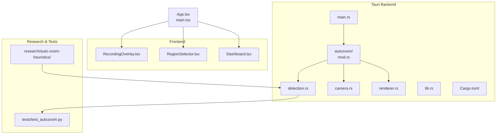
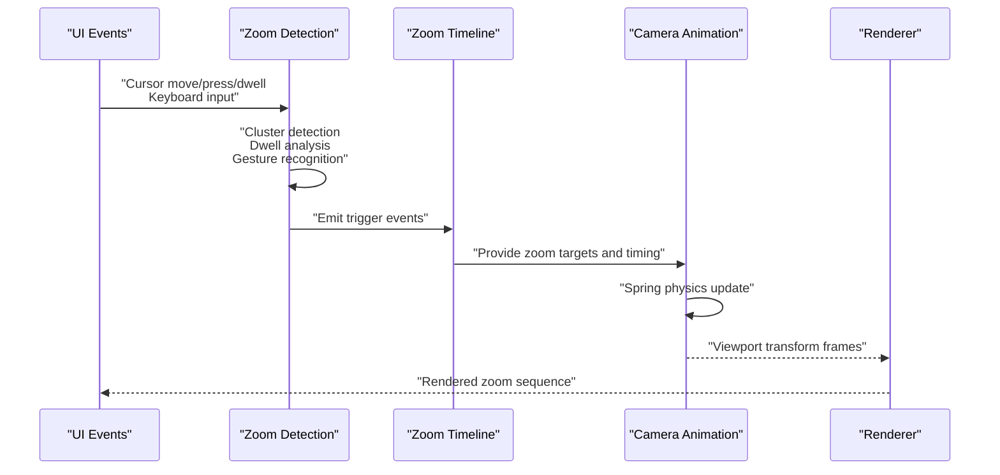
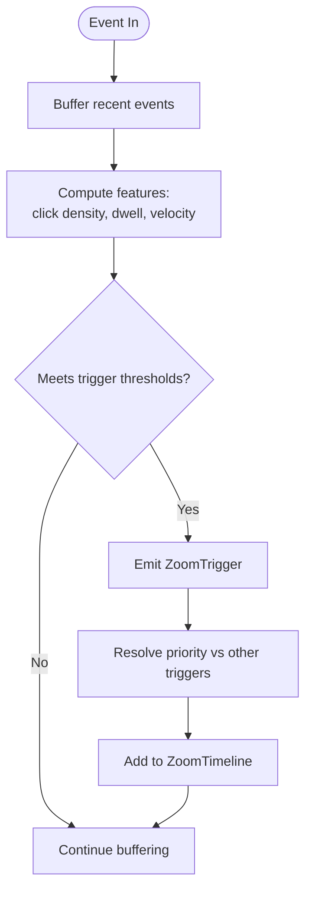
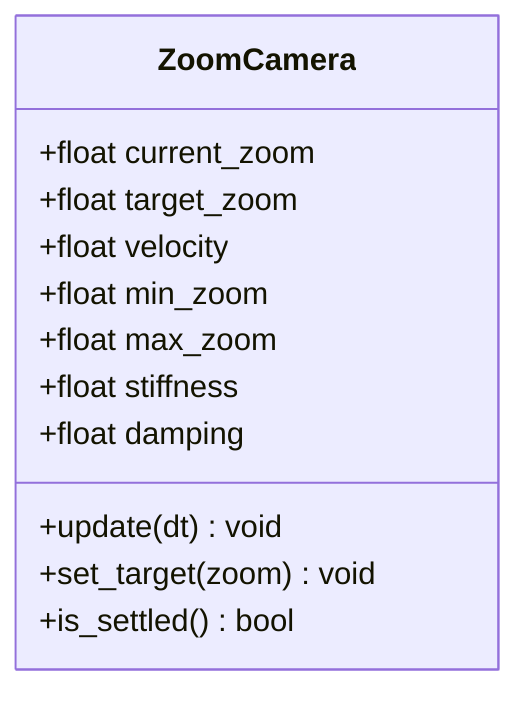
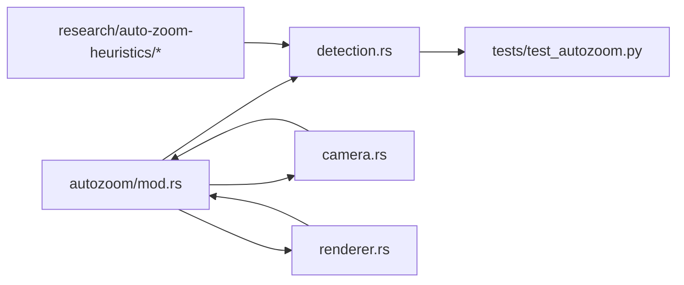

# Auto-Zoom Engine

<cite>
**Referenced Files in This Document**
- [README.md](file://README.md)
- [IMPLEMENTATION_ANALYSIS.md](file://IMPLEMENTATION_ANALYSIS.md)
- [src-tauri/src/autozoom/mod.rs](file://src-tauri/src/autozoom/mod.rs)
- [src-tauri/src/autozoom/detection.rs](file://src-tauri/src/autozoom/detection.rs)
- [src-tauri/src/autozoom/camera.rs](file://src-tauri/src/autozoom/camera.rs)
- [src-tauri/src/autozoom/renderer.rs](file://src-tauri/src/autozoom/renderer.rs)
- [src-tauri/src/main.rs](file://src-tauri/src/main.rs)
- [src-tauri/src/lib.rs](file://src-tauri/src/lib.rs)
- [src-tauri/Cargo.toml](file://src-tauri/Cargo.toml)
- [tests/test_autozoom.py](file://tests/test_autozoom.py)
- [research/auto-zoom-heuristics/index.html](file://research/auto-zoom-heuristics/index.html)
- [research/auto-zoom-heuristics/deep-dive.html](file://research/auto-zoom-heuristics/deep-dive.html)
- [research/auto-zoom-heuristics/sources.html](file://research/auto-zoom-heuristics/sources.html)
</cite>

## Table of Contents
1. [Introduction](#introduction)
2. [Project Structure](#project-structure)
3. [Core Components](#core-components)
4. [Architecture Overview](#architecture-overview)
5. [Detailed Component Analysis](#detailed-component-analysis)
6. [Dependency Analysis](#dependency-analysis)
7. [Performance Considerations](#performance-considerations)
8. [Troubleshooting Guide](#troubleshooting-guide)
9. [Conclusion](#conclusion)
10. [Appendices](#appendices)

## Introduction
This document describes EasySpecy's Auto-Zoom Engine, a post-processing zoom system that generates cinematic zoom sequences by analyzing user interactions. It focuses on cursor tracking, click clustering, dwell-time analysis, gesture recognition, and keyboard activity monitoring. The engine produces a ZoomTimeline that drives a spring-physics camera animation, smoothly transitioning between zoom levels determined by heuristics and configuration parameters. The documentation also covers trigger priority, integration with the recording pipeline, and implementation guidance for extending or customizing the zoom algorithm.

## Project Structure
The Auto-Zoom Engine resides in the Tauri backend under the autozoom module. The frontend integrates overlays and UI controls, while research documents and tests support algorithm validation and heuristic exploration.

**Diagram sources**
- [src-tauri/src/autozoom/mod.rs](file://src-tauri/src/autozoom/mod.rs)
- [src-tauri/src/autozoom/detection.rs](file://src-tauri/src/autozoom/detection.rs)
- [src-tauri/src/autozoom/camera.rs](file://src-tauri/src/autozoom/camera.rs)
- [src-tauri/src/autozoom/renderer.rs](file://src-tauri/src/autozoom/renderer.rs)
- [src-tauri/src/main.rs](file://src-tauri/src/main.rs)
- [src-tauri/src/lib.rs](file://src-tauri/src/lib.rs)
- [src-tauri/Cargo.toml](file://src-tauri/Cargo.toml)
- [tests/test_autozoom.py](file://tests/test_autozoom.py)
- [research/auto-zoom-heuristics/index.html](file://research/auto-zoom-heuristics/index.html)

**Section sources**
- [README.md](file://README.md)
- [src-tauri/src/autozoom/mod.rs](file://src-tauri/src/autozoom/mod.rs)
- [src-tauri/src/main.rs](file://src-tauri/src/main.rs)

## Core Components
- Zoom Detection: Processes cursor events, detects clusters and dwell patterns, and identifies triggers for zoom actions.
- Zoom Camera: Manages camera state and applies spring-physics animations to achieve smooth transitions.
- Zoom Renderer: Generates timeline entries and renders zoom sequences for playback.
- Trigger Priority: Defines precedence among different input modalities (cursor, keyboard, gestures).
- Configuration: Sensitivity thresholds, zoom speed, min/max zoom levels, and other tunables.
- Integration: Hooks into the recording pipeline to synchronize zoom with captured media.

**Section sources**
- [src-tauri/src/autozoom/detection.rs](file://src-tauri/src/autozoom/detection.rs)
- [src-tauri/src/autozoom/camera.rs](file://src-tauri/src/autozoom/camera.rs)
- [src-tauri/src/autozoom/renderer.rs](file://src-tauri/src/autozoom/renderer.rs)
- [tests/test_autozoom.py](file://tests/test_autozoom.py)

## Architecture Overview
The Auto-Zoom Engine operates as a pipeline: input events are collected and analyzed to detect triggers, which produce a ZoomTimeline. The camera subsystem consumes the timeline to animate the viewport, and the renderer exports the sequence for playback.

**Diagram sources**
- [src-tauri/src/autozoom/detection.rs](file://src-tauri/src/autozoom/detection.rs)
- [src-tauri/src/autozoom/camera.rs](file://src-tauri/src/autozoom/camera.rs)
- [src-tauri/src/autozoom/renderer.rs](file://src-tauri/src/autozoom/renderer.rs)

## Detailed Component Analysis

### Zoom Detection Module
Responsibilities:
- Track cursor positions and compute velocity/acceleration.
- Cluster clicks within spatial and temporal proximity.
- Analyze dwell time at regions of interest.
- Recognize simple gestures (e.g., quick moves, directional swipes).
- Monitor keyboard shortcuts that initiate zoom.
- Enforce trigger priority to resolve conflicts between simultaneous inputs.

Key data structures and concepts:
- ZoomRegion: Defines spatial bounds and metadata for areas that can trigger zoom.
- ZoomTrigger: Enumerates trigger types (e.g., dwell, click-cluster, gesture, keyboard).
- ZoomTimeline: Ordered sequence of zoom events with timestamps and target zoom levels.

Processing logic:
- Event ingestion: Accumulate recent cursor samples and keyboard inputs.
- Feature extraction: Compute spatial density for clicks, dwell duration, and motion vectors.
- Trigger emission: Apply heuristics to decide whether to emit a ZoomTrigger event.
- Priority resolution: Resolve overlapping triggers according to predefined precedence.

**Diagram sources**
- [src-tauri/src/autozoom/detection.rs](file://src-tauri/src/autozoom/detection.rs)

**Section sources**
- [src-tauri/src/autozoom/detection.rs](file://src-tauri/src/autozoom/detection.rs)

### Zoom Camera Module
Responsibilities:
- Maintain camera state (position, zoom level, velocity).
- Apply spring-physics model to interpolate between zoom targets.
- Clamp zoom levels within configured min/max bounds.
- Produce smooth transitions with configurable damping and stiffness.

Mathematical model:
- Spring force F = -kx - cv, where x is displacement, v is velocity, k is stiffness, c is damping.
- Integrate forces to update velocity and position over time steps.
- Apply exponential smoothing for perceptual uniformity.

**Diagram sources**
- [src-tauri/src/autozoom/camera.rs](file://src-tauri/src/autozoom/camera.rs)

**Section sources**
- [src-tauri/src/autozoom/camera.rs](file://src-tauri/src/autozoom/camera.rs)

### Zoom Renderer Module
Responsibilities:
- Convert ZoomTimeline into renderable frames.
- Export zoom sequences compatible with the recording pipeline.
- Support playback synchronization and metadata embedding.

Integration points:
- Receives ZoomTimeline from detection.
- Produces frame batches consumed by the recording pipeline.
- Emits progress/status updates for UI feedback.

**Section sources**
- [src-tauri/src/autozoom/renderer.rs](file://src-tauri/src/autozoom/renderer.rs)

### Trigger Priority System
Priority hierarchy ensures deterministic zoom behavior when multiple triggers occur concurrently. Typical order:
1. Keyboard shortcuts (highest priority)
2. Dwell-triggered zooms
3. Click-cluster zooms
4. Gesture-triggered zooms (lowest priority)

Resolution strategy:
- Compare timestamps and types to select the highest-priority trigger.
- Suppress lower-priority triggers during active zoom sessions.

**Section sources**
- [src-tauri/src/autozoom/detection.rs](file://src-tauri/src/autozoom/detection.rs)

### Configuration Parameters
Tunable parameters controlling sensitivity and behavior:
- Sensitivity thresholds: click density minimum, dwell duration, velocity magnitude.
- Zoom speed: spring stiffness and damping coefficients.
- Zoom bounds: minimum and maximum zoom levels.
- Window durations: temporal windows for clustering and dwell detection.
- Priority weights: optional overrides for trigger precedence.

These parameters are exposed via configuration APIs and validated before being applied to the detection and camera systems.

**Section sources**
- [src-tauri/src/autozoom/detection.rs](file://src-tauri/src/autozoom/detection.rs)
- [src-tauri/src/autozoom/camera.rs](file://src-tauri/src/autozoom/camera.rs)

### Integration with Recording Pipeline
The ZoomTimeline is integrated into the recording pipeline to synchronize zoom with video frames:
- Timeline exported as metadata alongside recorded streams.
- Renderer batches frames per timeline segment.
- Playback UI consumes timeline to re-apply zoom during post-processing.

Validation:
- Automated tests verify timeline correctness and frame alignment.

**Section sources**
- [src-tauri/src/autozoom/renderer.rs](file://src-tauri/src/autozoom/renderer.rs)
- [tests/test_autozoom.py](file://tests/test_autozoom.py)

## Dependency Analysis
The autozoom module depends on shared Tauri infrastructure and integrates with frontend components and research assets.

**Diagram sources**
- [src-tauri/src/autozoom/mod.rs](file://src-tauri/src/autozoom/mod.rs)
- [src-tauri/src/autozoom/detection.rs](file://src-tauri/src/autozoom/detection.rs)
- [src-tauri/src/autozoom/camera.rs](file://src-tauri/src/autozoom/camera.rs)
- [src-tauri/src/autozoom/renderer.rs](file://src-tauri/src/autozoom/renderer.rs)
- [tests/test_autozoom.py](file://tests/test_autozoom.py)
- [research/auto-zoom-heuristics/index.html](file://research/auto-zoom-heuristics/index.html)

**Section sources**
- [src-tauri/src/autozoom/mod.rs](file://src-tauri/src/autozoom/mod.rs)
- [src-tauri/Cargo.toml](file://src-tauri/Cargo.toml)

## Performance Considerations
- Event buffering: Limit buffer sizes and use sliding windows to cap memory and latency.
- Feature computation: Optimize click density and dwell calculations using spatial indexing or sampling.
- Physics simulation: Use fixed time steps and adaptive damping to maintain stability.
- Rendering: Batch timeline segments and precompute intermediate frames to reduce CPU load.
- Testing: Validate performance with synthetic datasets and real-world usage patterns.

## Troubleshooting Guide
Common issues and resolutions:
- No triggers detected:
  - Verify sensitivity thresholds and window durations.
  - Confirm event sources are active and not blocked by overlays.
- Jittery or unstable zoom:
  - Increase damping or reduce stiffness.
  - Check for conflicting triggers and adjust priority.
- Out-of-bounds zoom:
  - Adjust min/max zoom levels.
  - Ensure bounds are respected in camera updates.
- Timeline desynchronization:
  - Align timestamps and frame rates.
  - Re-export timeline metadata with recording pipeline.

Validation and testing:
- Use automated tests to assert timeline correctness and frame alignment.
- Review research findings for heuristic refinements.

**Section sources**
- [tests/test_autozoom.py](file://tests/test_autozoom.py)
- [research/auto-zoom-heuristics/deep-dive.html](file://research/auto-zoom-heuristics/deep-dive.html)

## Conclusion
The Auto-Zoom Engine combines robust event analysis, priority-driven trigger selection, and smooth spring-physics animation to deliver cinematic zoom sequences. Its modular design enables incremental improvements to detection heuristics, camera dynamics, and rendering fidelity, while maintaining seamless integration with the recording pipeline.

## Appendices

### Research and Heuristics
- Index page for auto-zoom heuristics and findings.
- Deep-dive analysis of detection algorithms and parameter tuning.
- Sources and references supporting the design choices.

**Section sources**
- [research/auto-zoom-heuristics/index.html](file://research/auto-zoom-heuristics/index.html)
- [research/auto-zoom-heuristics/deep-dive.html](file://research/auto-zoom-heuristics/deep-dive.html)
- [research/auto-zoom-heuristics/sources.html](file://research/auto-zoom-heuristics/sources.html)