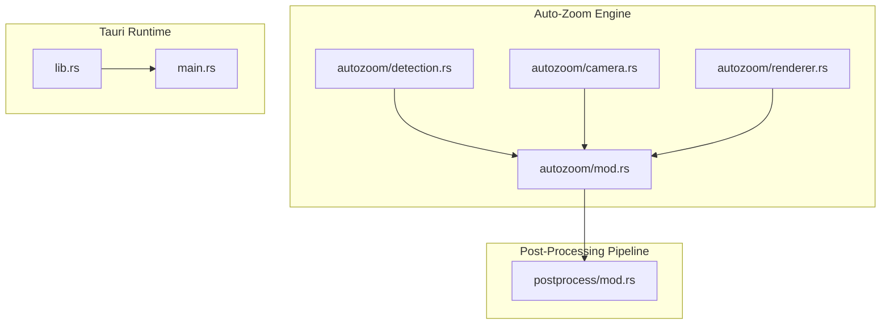
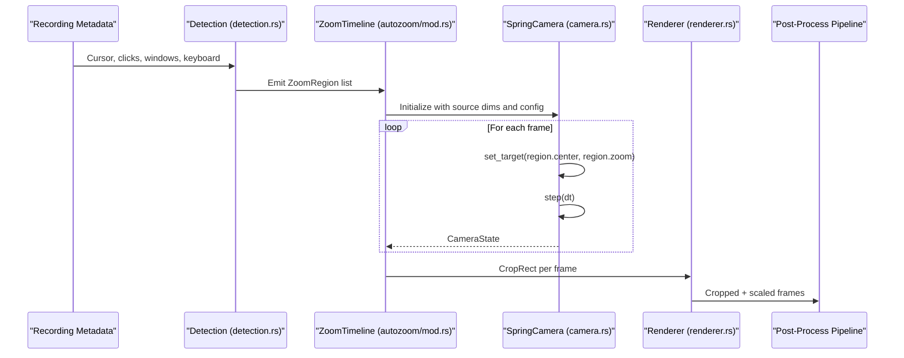
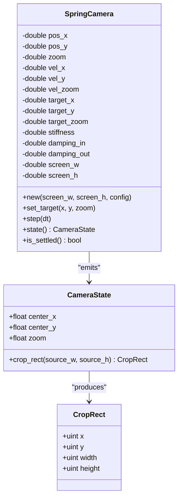
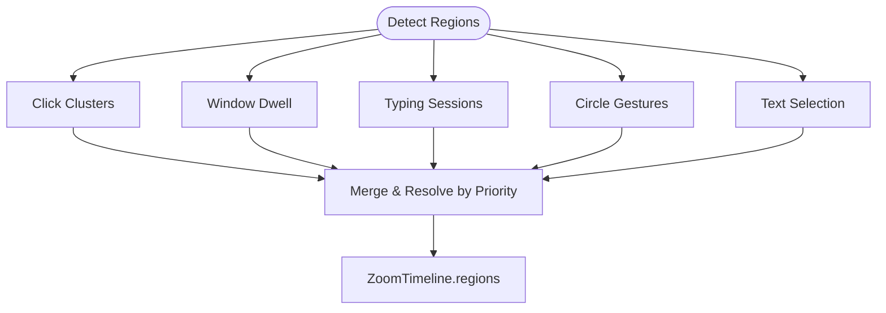
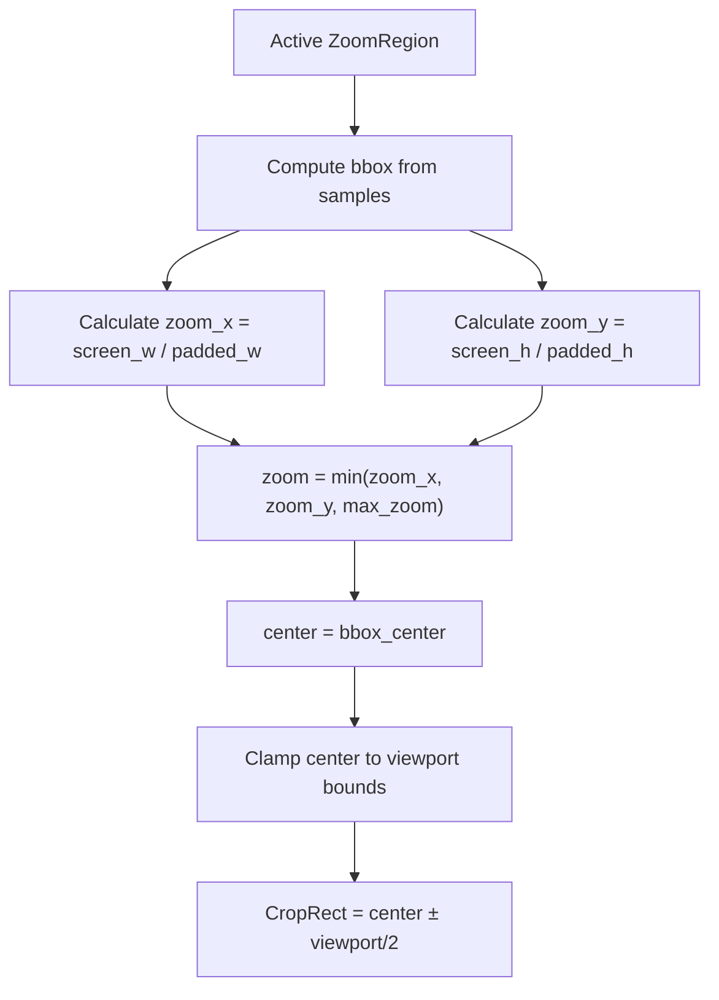
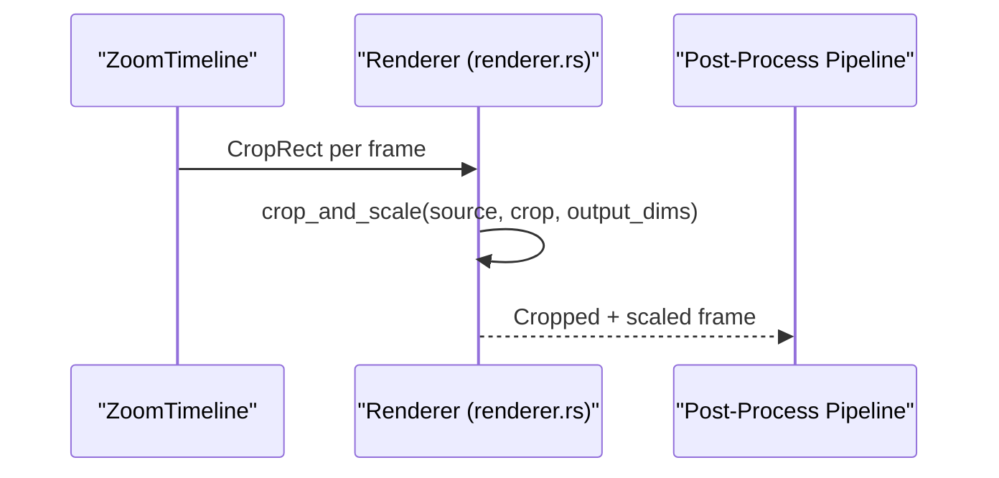
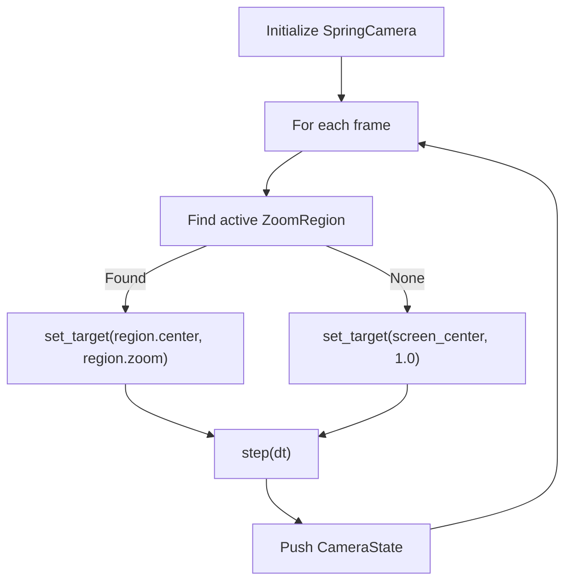
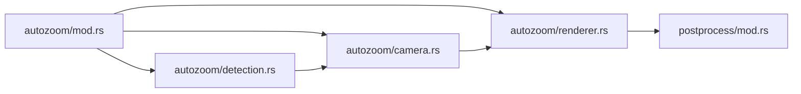

# Camera Physics System

<cite>
**Referenced Files in This Document**
- [mod.rs](file://src-tauri/src/autozoom/mod.rs)
- [camera.rs](file://src-tauri/src/autozoom/camera.rs)
- [detection.rs](file://src-tauri/src/autozoom/detection.rs)
- [renderer.rs](file://src-tauri/src/autozoom/renderer.rs)
- [mod.rs](file://src-tauri/src/postprocess/mod.rs)
- [lib.rs](file://src-tauri/src/lib.rs)
- [main.rs](file://src-tauri/src/main.rs)
</cite>

## Table of Contents
1. [Introduction](#introduction)
2. [Project Structure](#project-structure)
3. [Core Components](#core-components)
4. [Architecture Overview](#architecture-overview)
5. [Detailed Component Analysis](#detailed-component-analysis)
6. [Dependency Analysis](#dependency-analysis)
7. [Performance Considerations](#performance-considerations)
8. [Troubleshooting Guide](#troubleshooting-guide)
9. [Conclusion](#conclusion)

## Introduction
This document explains the Auto-Zoom Engine’s camera physics simulation system responsible for smooth, cinematic zoom transitions between detected zoom regions. It covers the spring-damper camera model, viewport centering, zoom level mapping from raw sensor data to visual scale, and frame-to-frame continuity. It also documents the integration with the rendering pipeline, performance optimizations, and memory management strategies for camera state buffers.

## Project Structure
The Auto-Zoom Engine resides under the Tauri backend (`src-tauri`) and is composed of:
- autozoom: trigger detection, camera physics, and rendering helpers
- postprocess: metadata collection and rendering pipeline integration
- lib.rs/main.rs: Tauri bootstrap and command registration

**Diagram sources**
- [mod.rs:1-101](file://src-tauri/src/autozoom/mod.rs#L1-L101)
- [camera.rs:1-203](file://src-tauri/src/autozoom/camera.rs#L1-L203)
- [detection.rs:1-497](file://src-tauri/src/autozoom/detection.rs#L1-L497)
- [renderer.rs:1-117](file://src-tauri/src/autozoom/renderer.rs#L1-L117)
- [mod.rs:1-800](file://src-tauri/src/postprocess/mod.rs#L1-L800)
- [lib.rs:38-136](file://src-tauri/src/lib.rs#L38-L136)
- [main.rs:4-7](file://src-tauri/src/main.rs#L4-L7)

**Section sources**
- [mod.rs:1-101](file://src-tauri/src/autozoom/mod.rs#L1-L101)
- [camera.rs:1-203](file://src-tauri/src/autozoom/camera.rs#L1-L203)
- [detection.rs:1-497](file://src-tauri/src/autozoom/detection.rs#L1-L497)
- [renderer.rs:1-117](file://src-tauri/src/autozoom/renderer.rs#L1-L117)
- [mod.rs:1-800](file://src-tauri/src/postprocess/mod.rs#L1-L800)
- [lib.rs:38-136](file://src-tauri/src/lib.rs#L38-L136)
- [main.rs:4-7](file://src-tauri/src/main.rs#L4-L7)

## Core Components
- ZoomRegion: Defines a time window and target viewport for zoom transitions.
- ZoomConfig: Tunable parameters controlling sensitivity, zoom speed, and limits.
- ZoomTimeline: Aggregates regions and source/video metadata.
- SpringCamera: Implements spring-damper dynamics for camera position and zoom.
- CameraState: Encapsulates current camera center and zoom level.
- CropRect: Source crop rectangle derived from CameraState.
- Renderer helpers: Crop-and-scale and coordinate transforms for the rendering pipeline.

Key behaviors:
- Asymmetric damping: faster zoom-in, gentler zoom-out.
- Frame-to-frame continuity via pre-computed camera timeline.
- Viewport centering and zoom level mapping from detected regions to visual scale.

**Section sources**
- [mod.rs:16-101](file://src-tauri/src/autozoom/mod.rs#L16-L101)
- [camera.rs:8-159](file://src-tauri/src/autozoom/camera.rs#L8-L159)
- [renderer.rs:8-117](file://src-tauri/src/autozoom/renderer.rs#L8-L117)

## Architecture Overview
The Auto-Zoom Engine operates in two stages:
1. Trigger Detection: Builds a timeline of ZoomRegion events from cursor, click, window, and keyboard metadata.
2. Camera Simulation: Pre-computes a CameraState timeline using a spring-damper system, then crops and scales frames accordingly.

**Diagram sources**
- [detection.rs:12-44](file://src-tauri/src/autozoom/detection.rs#L12-L44)
- [mod.rs:94-101](file://src-tauri/src/autozoom/mod.rs#L94-L101)
- [camera.rs:73-159](file://src-tauri/src/autozoom/camera.rs#L73-L159)
- [renderer.rs:10-70](file://src-tauri/src/autozoom/renderer.rs#L10-L70)

## Detailed Component Analysis

### Spring-Physics Camera Animation
The SpringCamera implements a damped harmonic oscillator for smooth transitions:
- State: position (center_x, center_y), zoom, velocities, and targets.
- Forces: stiffness pulls toward targets; damping resists velocity.
- Asymmetry: separate damping constants for zoom-in vs zoom-out.
- Clamping: zoom within configured bounds; position clamped to viewport bounds.

**Diagram sources**
- [camera.rs:8-159](file://src-tauri/src/autozoom/camera.rs#L8-L159)

Mathematical formulation:
- Spring force: F = stiffness × displacement − damping × velocity
- Velocity update: v ← v + F × dt
- Position update: p ← p + v × dt
- Zoom clamping: clamp zoom to [1.0, max_zoom]
- Position clamping: center constrained inside viewport bounds

Timing:
- dt = 1/fps seconds per frame
- ms_per_frame = 1000/fps

Settling:
- is_settled checks residual velocities below thresholds.

**Section sources**
- [camera.rs:46-159](file://src-tauri/src/autozoom/camera.rs#L46-L159)

### Zoom Region Detection and Timeline Construction
Zoom triggers are detected from metadata and merged into a conflict-free timeline:
- Click clusters: spatial and temporal clustering of clicks.
- Window dwell: sustained focus within a window with clicks.
- Typing: keyboard bursts with stationary cursor.
- Circle gestures: closed cursor loops.
- Text selection: horizontal sweeps with button held.
- Priority-based merging and minimum gaps enforce responsiveness.

**Diagram sources**
- [detection.rs:12-44](file://src-tauri/src/autozoom/detection.rs#L12-L44)
- [detection.rs:461-497](file://src-tauri/src/autozoom/detection.rs#L461-L497)

**Section sources**
- [detection.rs:12-497](file://src-tauri/src/autozoom/detection.rs#L12-L497)
- [mod.rs:94-101](file://src-tauri/src/autozoom/mod.rs#L94-L101)

### Camera Positioning, Viewport Centering, and Zoom Mapping
- Viewport size: viewport = source / zoom
- Center clamping: ensure viewport does not exceed source bounds; adjust center to stay valid.
- Zoom mapping: derived from detected regions (e.g., bounding box of clicks or window size) to fit screen with padding and caps.

**Diagram sources**
- [detection.rs:98-110](file://src-tauri/src/autozoom/detection.rs#L98-L110)
- [detection.rs:176-181](file://src-tauri/src/autozoom/detection.rs#L176-L181)
- [camera.rs:16-35](file://src-tauri/src/autozoom/camera.rs#L16-L35)

**Section sources**
- [camera.rs:16-35](file://src-tauri/src/autozoom/camera.rs#L16-L35)
- [detection.rs:98-110](file://src-tauri/src/autozoom/detection.rs#L98-L110)
- [detection.rs:176-181](file://src-tauri/src/autozoom/detection.rs#L176-L181)

### Rendering Integration and Crop-and-Scale
- CropRect per frame drives crop and scale operations.
- Bilinear interpolation ensures smooth scaling.
- Coordinate transforms support overlay effects and cursor trail rendering.

**Diagram sources**
- [renderer.rs:10-70](file://src-tauri/src/autozoom/renderer.rs#L10-L70)
- [mod.rs:196-556](file://src-tauri/src/postprocess/mod.rs#L196-L556)

**Section sources**
- [renderer.rs:8-117](file://src-tauri/src/autozoom/renderer.rs#L8-L117)
- [mod.rs:196-556](file://src-tauri/src/postprocess/mod.rs#L196-L556)

### Pre-computed Camera Timeline Generation
- One CameraState per frame is computed by iterating frames, finding active regions, setting targets, stepping the spring, and storing state.
- Enables frame-to-frame continuity and decouples rendering from real-time computation.

**Diagram sources**
- [camera.rs:161-202](file://src-tauri/src/autozoom/camera.rs#L161-L202)

**Section sources**
- [camera.rs:161-202](file://src-tauri/src/autozoom/camera.rs#L161-L202)

## Dependency Analysis
- autozoom/mod.rs defines data structures and configuration used across modules.
- autozoom/camera.rs depends on ZoomConfig and ZoomTimeline to drive simulation.
- autozoom/detection.rs produces ZoomRegion lists consumed by the camera timeline generator.
- autozoom/renderer.rs consumes CameraState/CropRect to render frames.
- postprocess/mod.rs orchestrates the end-to-end pipeline and interacts with metadata.

**Diagram sources**
- [mod.rs:1-101](file://src-tauri/src/autozoom/mod.rs#L1-L101)
- [camera.rs:1-203](file://src-tauri/src/autozoom/camera.rs#L1-L203)
- [detection.rs:1-497](file://src-tauri/src/autozoom/detection.rs#L1-L497)
- [renderer.rs:1-117](file://src-tauri/src/autozoom/renderer.rs#L1-L117)
- [mod.rs:1-800](file://src-tauri/src/postprocess/mod.rs#L1-L800)

**Section sources**
- [mod.rs:1-101](file://src-tauri/src/autozoom/mod.rs#L1-L101)
- [camera.rs:1-203](file://src-tauri/src/autozoom/camera.rs#L1-L203)
- [detection.rs:1-497](file://src-tauri/src/autozoom/detection.rs#L1-L497)
- [renderer.rs:1-117](file://src-tauri/src/autozoom/renderer.rs#L1-L117)
- [mod.rs:1-800](file://src-tauri/src/postprocess/mod.rs#L1-L800)

## Performance Considerations
- Pre-computation: CameraState per frame eliminates per-frame physics computation during rendering.
- Memory: Vec with capacity initialized for total_frames reduces allocations.
- Parallelism: Rendering pipeline uses Rayon for parallel frame batches; camera timeline generation is sequential per frame.
- Interpolation: Bilinear scaling is O(output_pixels) per frame; tune output dimensions to balance quality and throughput.
- Settling checks: Early exit conditions reduce unnecessary updates when velocities are minimal.

Recommendations:
- Tune ZoomConfig.zoom_speed to balance responsiveness and stability.
- Cap max_zoom to avoid excessive scaling costs.
- Use appropriate output dimensions to limit per-frame work.
- Monitor memory footprint of pre-computed state vectors.

[No sources needed since this section provides general guidance]

## Troubleshooting Guide
Common issues and remedies:
- Camera overshoots or oscillates:
  - Reduce stiffness or increase damping_in.
  - Verify asymmetric damping is applied based on zoom direction.
- Camera does not reach target:
  - Check dt calculation and fps alignment.
  - Confirm is_settled thresholds are not too strict.
- Viewport clipped unexpectedly:
  - Inspect center clamping logic and zoom clamping.
  - Validate source dimensions passed to CameraState.crop_rect.
- Rendering artifacts:
  - Verify CropRect validity and bilinear interpolation bounds.
  - Ensure output dimensions match expectations.

**Section sources**
- [camera.rs:107-159](file://src-tauri/src/autozoom/camera.rs#L107-L159)
- [camera.rs:16-35](file://src-tauri/src/autozoom/camera.rs#L16-L35)
- [renderer.rs:10-70](file://src-tauri/src/autozoom/renderer.rs#L10-L70)

## Conclusion
The Auto-Zoom Engine’s camera physics system combines robust trigger detection with a spring-damper camera model to deliver smooth, responsive zoom transitions. By pre-computing camera states and integrating tightly with the rendering pipeline, it achieves cinematic quality with predictable performance. Tuning parameters such as zoom speed, damping, and zoom limits allows balancing responsiveness and stability for diverse user interactions.