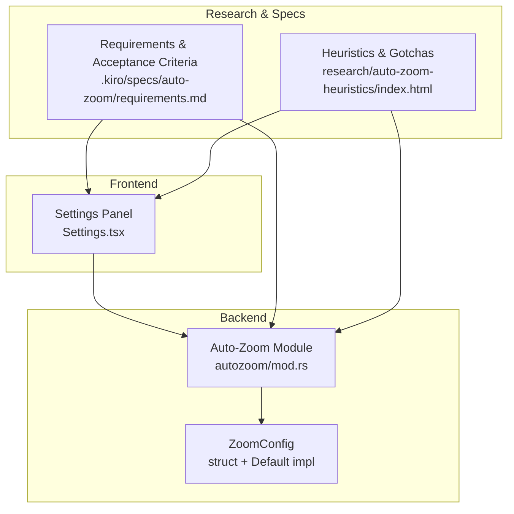
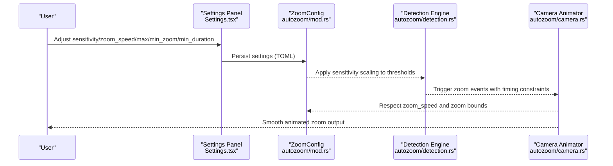
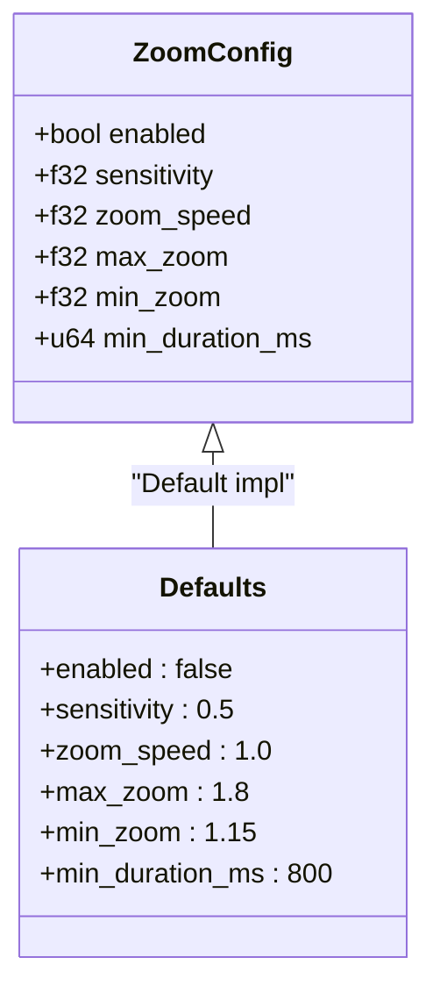
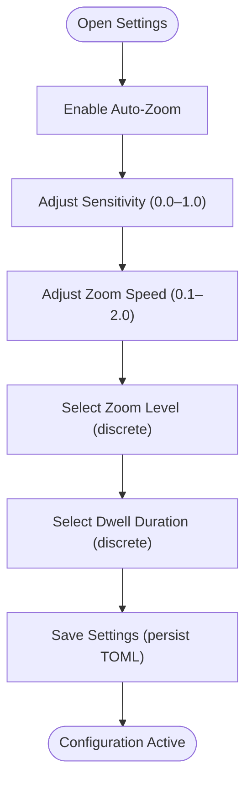
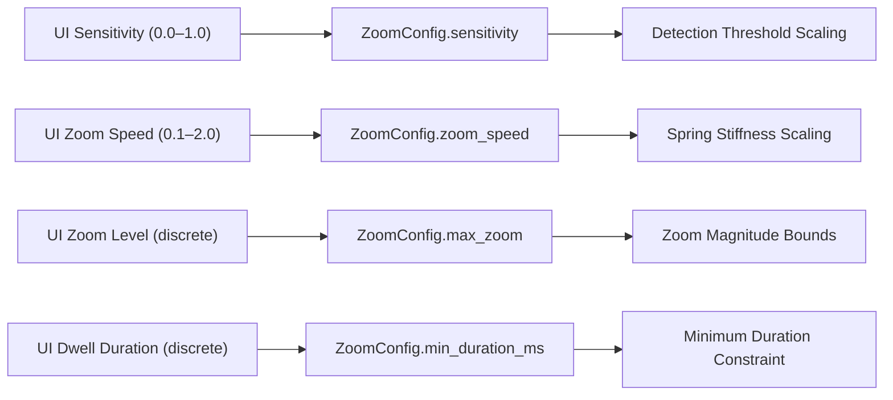

# Configuration & Tuning

<cite>
**Referenced Files in This Document**
- [mod.rs](file://src-tauri/src/autozoom/mod.rs)
- [Settings.tsx](file://src/components/Settings.tsx)
- [requirements.md](file://.kiro/specs/auto-zoom/requirements.md)
- [index.html](file://research/auto-zoom-heuristics/index.html)
</cite>

## Table of Contents
1. [Introduction](#introduction)
2. [Project Structure](#project-structure)
3. [Core Components](#core-components)
4. [Architecture Overview](#architecture-overview)
5. [Detailed Component Analysis](#detailed-component-analysis)
6. [Dependency Analysis](#dependency-analysis)
7. [Performance Considerations](#performance-considerations)
8. [Troubleshooting Guide](#troubleshooting-guide)
9. [Conclusion](#conclusion)
10. [Appendices](#appendices)

## Introduction
This document explains the Auto-Zoom Engine configuration management and parameter tuning. It focuses on the ZoomConfig structure and how its parameters influence detection sensitivity, trigger thresholds, animation characteristics, and user experience. It also provides tuning guidelines for different use cases, practical optimization examples, troubleshooting tips, and performance impact considerations.

## Project Structure
The Auto-Zoom configuration lives in the Tauri backend under the autozoom module and is surfaced to users via the frontend Settings panel. Acceptance criteria and heuristics define the intended behavior and constraints for configuration parameters.

**Diagram sources**
- [mod.rs:69-91](file://src-tauri/src/autozoom/mod.rs#L69-L91)
- [Settings.tsx:428-472](file://src/components/Settings.tsx#L428-L472)
- [requirements.md:170-181](file://.kiro/specs/auto-zoom/requirements.md#L170-L181)
- [index.html:603-622](file://research/auto-zoom-heuristics/index.html#L603-L622)

**Section sources**
- [mod.rs:69-91](file://src-tauri/src/autozoom/mod.rs#L69-L91)
- [Settings.tsx:428-472](file://src/components/Settings.tsx#L428-L472)
- [requirements.md:170-181](file://.kiro/specs/auto-zoom/requirements.md#L170-L181)
- [index.html:603-622](file://research/auto-zoom-heuristics/index.html#L603-L622)

## Core Components
This section documents the ZoomConfig structure and its parameters, including defaults and rationale.

- enabled: Boolean toggle to activate/deactivate auto-zoom. When disabled, the engine produces no zoom regions and rendering skips zoom processing.
- sensitivity: Normalized scale factor in [0.0, 1.0] that scales detection thresholds. Lower values require stronger evidence to trigger zoom; higher values make detection more sensitive.
- zoom_speed: Scale factor in [0.1, 2.0] that affects spring stiffness of the camera animator. Higher values reduce transition time, increasing responsiveness.
- max_zoom: Upper bound for zoom level. Constrains zoom to a maximum to keep effects subtle and non-intrusive.
- min_zoom: Minimum meaningful zoom threshold. Ensures zooms below this level are not triggered.
- min_duration_ms: Minimum duration for each zoom region. Prevents overly brief zooms that feel abrupt or ineffective.

Default values and rationale:
- enabled: false (disabled by default on fresh installs)
- sensitivity: 0.5 (balanced baseline)
- zoom_speed: 1.0 (standard responsiveness)
- max_zoom: 1.8 (subtle upper bound)
- min_zoom: 1.15 (minimum meaningful zoom)
- min_duration_ms: 800 ms (responsive yet deliberate)

These defaults aim to create subtle, non-intrusive zoom effects while maintaining responsiveness.

**Section sources**
- [mod.rs:69-91](file://src-tauri/src/autozoom/mod.rs#L69-L91)
- [requirements.md:170-181](file://.kiro/specs/auto-zoom/requirements.md#L170-L181)

## Architecture Overview
The configuration flows from the UI to the backend, where it influences detection thresholds, trigger logic, and animation behavior.

**Diagram sources**
- [Settings.tsx:428-472](file://src/components/Settings.tsx#L428-L472)
- [mod.rs:69-91](file://src-tauri/src/autozoom/mod.rs#L69-L91)

## Detailed Component Analysis

### ZoomConfig Structure
ZoomConfig encapsulates all user-adjustable parameters for the Auto-Zoom Engine. It is defined in the autozoom module and includes a Default implementation that sets conservative, subtle defaults.

Key characteristics:
- Sensitivity scaling: Applied to detection thresholds to adjust trigger sensitivity.
- Zoom speed scaling: Scales spring stiffness for camera animation, affecting transition speed.
- Bounds enforcement: max_zoom and min_zoom constrain zoom magnitude.
- Duration constraint: min_duration_ms ensures zooms last long enough to be effective.

**Diagram sources**
- [mod.rs:69-91](file://src-tauri/src/autozoom/mod.rs#L69-L91)

**Section sources**
- [mod.rs:69-91](file://src-tauri/src/autozoom/mod.rs#L69-L91)

### Parameter Effects and Behavior
- Detection sensitivity: sensitivity scales thresholds. Values closer to 0.0 increase thresholds (harder to trigger); values closer to 1.0 decrease thresholds (easier to trigger).
- Animation characteristics: zoom_speed reduces transition time and increases responsiveness. Larger values yield faster zoom-ins.
- Magnitude control: max_zoom caps zoom intensity; min_zoom prevents trivial zooms.
- Duration control: min_duration_ms ensures zooms are sustained long enough to be perceived effectively.

Acceptance criteria confirm:
- Sensitivity range: 0.0 to 1.0 with 0.05 increments.
- Zoom speed range: 0.1 to 2.0 with 0.1 increments.
- Clamping behavior: invalid values are clamped to nearest bound.

**Section sources**
- [requirements.md:170-181](file://.kiro/specs/auto-zoom/requirements.md#L170-L181)
- [mod.rs:69-91](file://src-tauri/src/autozoom/mod.rs#L69-L91)

### UI Exposure and Persistence
The frontend Settings panel exposes:
- Enable toggle for auto-zoom
- Zoom factor selection (discrete levels)
- Dwell hold duration selection (discrete durations)
- Pan smoothing speed slider (continuous range)

Saving settings persists configuration to the TOML config file at the standard config path.

**Diagram sources**
- [Settings.tsx:428-472](file://src/components/Settings.tsx#L428-L472)
- [requirements.md:170-181](file://.kiro/specs/auto-zoom/requirements.md#L170-L181)

**Section sources**
- [Settings.tsx:428-472](file://src/components/Settings.tsx#L428-L472)
- [requirements.md:170-181](file://.kiro/specs/auto-zoom/requirements.md#L170-L181)

## Dependency Analysis
Configuration parameters influence downstream detection and animation logic. The following diagram shows how UI selections map to backend configuration and constraints.

**Diagram sources**
- [Settings.tsx:428-472](file://src/components/Settings.tsx#L428-L472)
- [mod.rs:69-91](file://src-tauri/src/autozoom/mod.rs#L69-L91)

**Section sources**
- [Settings.tsx:428-472](file://src/components/Settings.tsx#L428-L472)
- [mod.rs:69-91](file://src-tauri/src/autozoom/mod.rs#L69-L91)

## Performance Considerations
- Zoom speed scaling: Higher zoom_speed reduces transition time but may increase CPU/GPU load during animation. Balance responsiveness with device performance.
- Sensitivity scaling: Lower sensitivity reduces false positives and detection overhead; higher sensitivity may increase processing frequency of near-threshold events.
- Magnitude bounds: Tighter max_zoom and min_zoom limits simplify rendering and reduce extreme scaling artifacts.
- Minimum duration: Longer min_duration_ms increases total processing time for zoom regions; shorter durations improve throughput but risk abrupt transitions.

[No sources needed since this section provides general guidance]

## Troubleshooting Guide
Common issues and remedies:
- Zooms feel too frequent or intrusive:
  - Reduce sensitivity to raise thresholds.
  - Increase min_zoom to avoid trivial zooms.
  - Increase min_duration_ms to sustain zooms longer.
- Zooms feel sluggish or delayed:
  - Increase zoom_speed to reduce transition time.
  - Decrease sensitivity slightly to balance responsiveness.
- No zooms triggered:
  - Increase sensitivity to lower thresholds.
  - Verify enabled toggle is active.
  - Ensure dwell duration is sufficient for your workflow.
- Overly aggressive zooms:
  - Lower max_zoom to cap magnification.
  - Increase min_zoom to filter minor movements.
- Unstable or jittery zooms:
  - Increase min_duration_ms to smooth transitions.
  - Reduce zoom_speed to avoid overshoot.

Acceptance criteria specify clamping behavior for out-of-range values, ensuring robust operation even with misconfigured inputs.

**Section sources**
- [requirements.md:170-181](file://.kiro/specs/auto-zoom/requirements.md#L170-L181)
- [index.html:603-622](file://research/auto-zoom-heuristics/index.html#L603-L622)

## Conclusion
The ZoomConfig structure provides precise control over detection sensitivity, animation responsiveness, and visual bounds. By tuning sensitivity, zoom_speed, max_zoom, min_zoom, and min_duration_ms, users can optimize Auto-Zoom for diverse scenarios—from subtle presentation mode to detailed tutorial recordings—while maintaining smooth, non-intrusive behavior.

[No sources needed since this section summarizes without analyzing specific files]

## Appendices

### Tuning Guidelines by Use Case
- Presentation mode (subtlety):
  - Keep sensitivity around default (0.5).
  - Use moderate zoom_speed (1.0–1.2).
  - Set modest max_zoom (1.5–1.8) and min_zoom (1.15–1.2).
  - Increase min_duration_ms (800–1000 ms) for deliberate pacing.
- Tutorial recording (emphasis on detail):
  - Slightly lower sensitivity (0.4–0.6) to avoid accidental triggers.
  - Increase zoom_speed (1.2–1.5) for snappy focus.
  - Raise max_zoom (1.8–2.0) and min_zoom (1.2–1.3).
  - Keep min_duration_ms moderate (600–800 ms) to emphasize key moments.
- Different screen sizes and resolutions:
  - On smaller displays, prefer tighter magnitudes (lower max_zoom) to prevent disorientation.
  - On high-DPI or larger screens, consider slightly higher sensitivity to detect meaningful motion.
- User preference adjustments:
  - Start from defaults; adjust one parameter at a time to observe effects.
  - Use discrete UI options (zoom level, dwell duration) for coarse adjustments; fine-tune continuous sliders (sensitivity, zoom_speed) for precision.

[No sources needed since this section provides general guidance]

### Practical Optimization Examples
- Example A: Subtle zoom for a webinar
  - sensitivity: 0.5
  - zoom_speed: 1.0
  - max_zoom: 1.6
  - min_zoom: 1.15
  - min_duration_ms: 800
- Example B: Dynamic tutorial with quick focus
  - sensitivity: 0.6
  - zoom_speed: 1.4
  - max_zoom: 1.9
  - min_zoom: 1.2
  - min_duration_ms: 600
- Example C: Minimal intervention for ambient recording
  - sensitivity: 0.3
  - zoom_speed: 0.8
  - max_zoom: 1.5
  - min_zoom: 1.15
  - min_duration_ms: 1000

[No sources needed since this section provides general guidance]