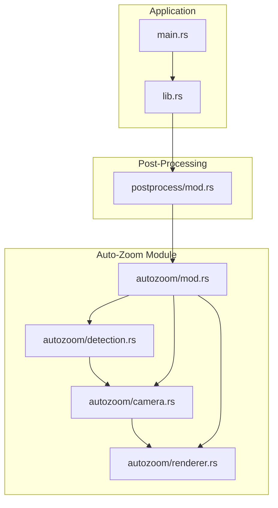
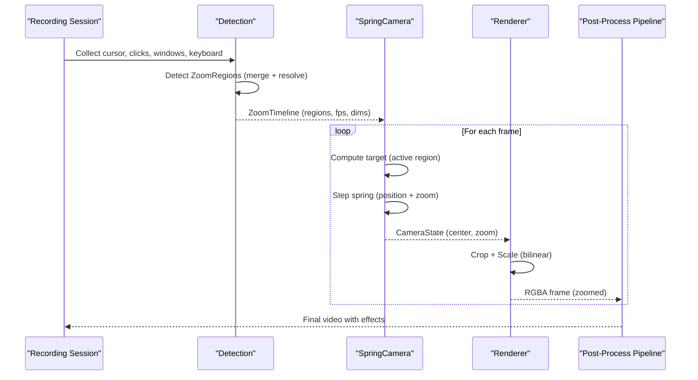
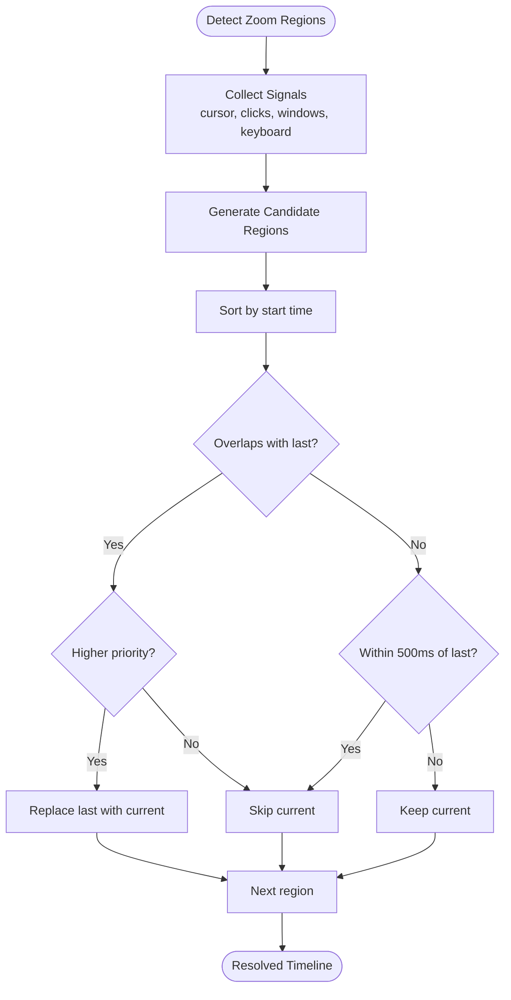
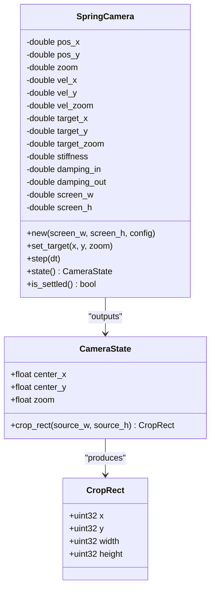
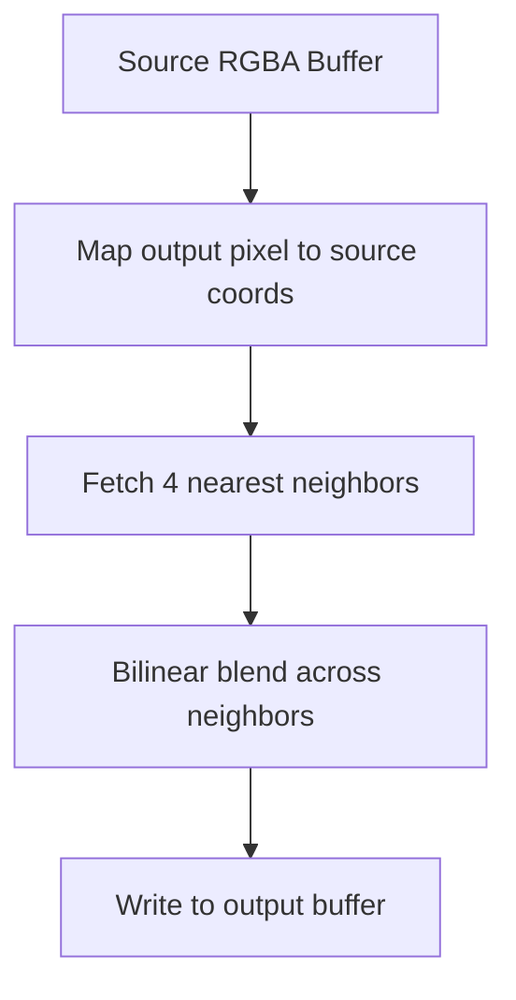
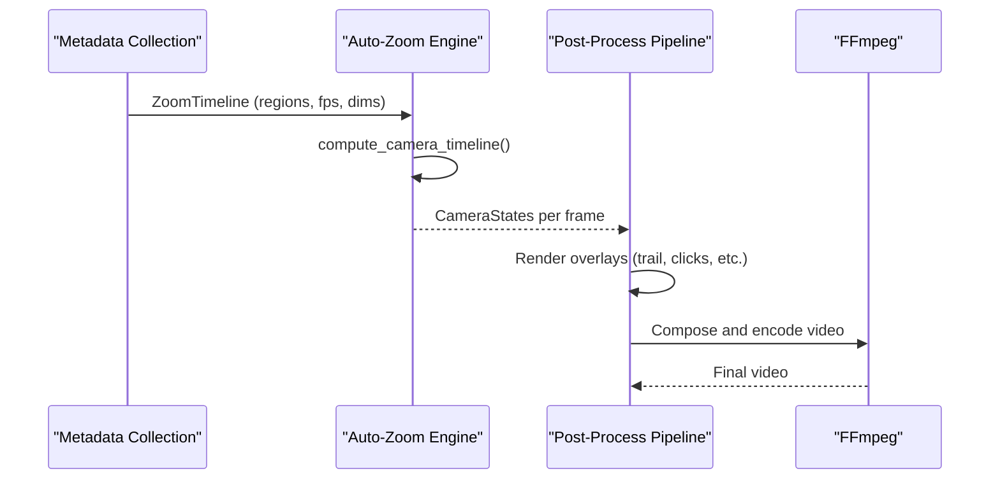
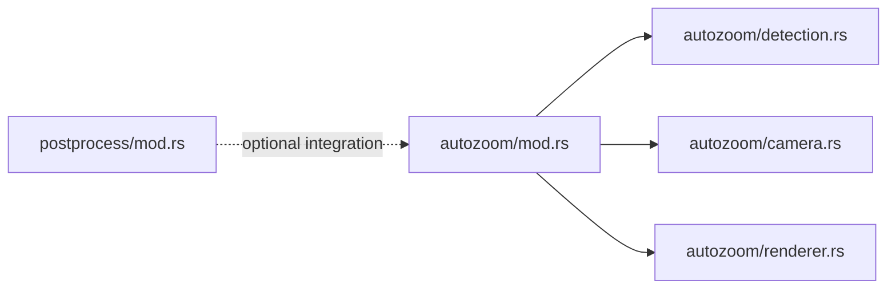

# Rendering Pipeline

<cite>
**Referenced Files in This Document**
- [mod.rs](file://src-tauri/src/autozoom/mod.rs)
- [camera.rs](file://src-tauri/src/autozoom/camera.rs)
- [detection.rs](file://src-tauri/src/autozoom/detection.rs)
- [renderer.rs](file://src-tauri/src/autozoom/renderer.rs)
- [mod.rs](file://src-tauri/src/postprocess/mod.rs)
- [lib.rs](file://src-tauri/src/lib.rs)
- [main.rs](file://src-tauri/src/main.rs)
- [test_autozoom.py](file://tests/test_autozoom.py)
</cite>

## Table of Contents
1. [Introduction](#introduction)
2. [Project Structure](#project-structure)
3. [Core Components](#core-components)
4. [Architecture Overview](#architecture-overview)
5. [Detailed Component Analysis](#detailed-component-analysis)
6. [Dependency Analysis](#dependency-analysis)
7. [Performance Considerations](#performance-considerations)
8. [Troubleshooting Guide](#troubleshooting-guide)
9. [Conclusion](#conclusion)

## Introduction
This document explains the Auto-Zoom Engine’s rendering pipeline and frame processing system. It covers how zoom regions are computed from recording metadata, how camera motion is simulated using spring physics, and how crop-and-scale operations are applied to source frames while preserving aspect ratio and visual quality. It also documents the integration with the main recording pipeline, including how zoom data flows from detection to final video output, and provides guidance on optimization, GPU acceleration opportunities, and memory-efficient buffer management.

## Project Structure
The Auto-Zoom Engine resides under the autozoom module and integrates with the postprocess pipeline. The key files are:
- Auto-Zoom core definitions and configuration
- Trigger detection heuristics
- Spring-camera animation and timeline computation
- Crop-and-scale renderer
- Post-processing pipeline that applies effects and integrates zoom

**Diagram sources**
- [mod.rs:1-101](file://src-tauri/src/autozoom/mod.rs#L1-L101)
- [detection.rs:1-497](file://src-tauri/src/autozoom/detection.rs#L1-L497)
- [camera.rs:1-203](file://src-tauri/src/autozoom/camera.rs#L1-L203)
- [renderer.rs:1-117](file://src-tauri/src/autozoom/renderer.rs#L1-L117)
- [mod.rs:1-1697](file://src-tauri/src/postprocess/mod.rs#L1-L1697)
- [lib.rs:1-208](file://src-tauri/src/lib.rs#L1-L208)
- [main.rs:1-7](file://src-tauri/src/main.rs#L1-L7)

**Section sources**
- [mod.rs:1-101](file://src-tauri/src/autozoom/mod.rs#L1-L101)
- [mod.rs:1-1697](file://src-tauri/src/postprocess/mod.rs#L1-L1697)
- [lib.rs:1-208](file://src-tauri/src/lib.rs#L1-L208)
- [main.rs:1-7](file://src-tauri/src/main.rs#L1-L7)

## Core Components
- ZoomRegion: Defines a time-span with a target viewport center and zoom level, plus trigger type and priority.
- ZoomTrigger: Enumerates triggers (e.g., ClickCluster, WindowDwell, CircleGesture, TextSelection, Typing, Manual) with explicit priority.
- ZoomConfig: User-configurable parameters controlling sensitivity, zoom speed, min/max zoom, and minimum duration.
- ZoomTimeline: Aggregates detected regions and source/video metadata (dimensions, fps).
- Detection pipeline: Computes ZoomRegion candidates from cursor trails, click events, window bounds, and keyboard events.
- Camera simulation: Spring-physics model computes smooth transitions between zoom targets.
- Renderer: Performs crop-and-scale with bilinear interpolation and coordinate transforms for overlay effects.

**Section sources**
- [mod.rs:16-101](file://src-tauri/src/autozoom/mod.rs#L16-L101)
- [detection.rs:11-44](file://src-tauri/src/autozoom/detection.rs#L11-L44)
- [camera.rs:8-35](file://src-tauri/src/autozoom/camera.rs#L8-L35)
- [renderer.rs:8-70](file://src-tauri/src/autozoom/renderer.rs#L8-L70)

## Architecture Overview
The Auto-Zoom Engine operates in three stages:
1. Metadata collection and zoom region detection
2. Camera animation and timeline generation
3. Frame-by-frame crop-and-scale rendering integrated into the post-processing pipeline

**Diagram sources**
- [detection.rs:11-44](file://src-tauri/src/autozoom/detection.rs#L11-L44)
- [camera.rs:161-202](file://src-tauri/src/autozoom/camera.rs#L161-L202)
- [renderer.rs:10-70](file://src-tauri/src/autozoom/renderer.rs#L10-L70)
- [mod.rs:192-556](file://src-tauri/src/postprocess/mod.rs#L192-L556)

## Detailed Component Analysis

### Zoom Region Detection and Merging
The detection stage aggregates multiple signals into a timeline of ZoomRegion entries. Each signal produces candidate regions with a center, zoom level, and time span. These candidates are merged and conflict-resolved by priority and minimum gaps.

Key behaviors:
- Click clusters: groups of clicks within a time window and proximity; generates a bounding box with generous padding and modest zoom capped by configuration.
- Window dwell: zoom to a focused window with padding; uses cursor entry time and short hold.
- Typing: detects sustained keyboard activity with a stationary cursor; applies a subtle zoom.
- Circle gestures: closed cursor loops with sufficient path length; calculates a bounding box and zoom.
- Text selection: horizontal sweeps with button held; applies a modest zoom.
- Merging and conflict resolution: sorts by start time, keeps higher-priority overlaps, enforces a minimum 500 ms gap between zooms.

**Diagram sources**
- [detection.rs:461-496](file://src-tauri/src/autozoom/detection.rs#L461-L496)

**Section sources**
- [detection.rs:11-44](file://src-tauri/src/autozoom/detection.rs#L11-L44)
- [detection.rs:46-130](file://src-tauri/src/autozoom/detection.rs#L46-L130)
- [detection.rs:132-220](file://src-tauri/src/autozoom/detection.rs#L132-L220)
- [detection.rs:222-314](file://src-tauri/src/autozoom/detection.rs#L222-L314)
- [detection.rs:316-412](file://src-tauri/src/autozoom/detection.rs#L316-L412)
- [detection.rs:414-459](file://src-tauri/src/autozoom/detection.rs#L414-L459)
- [detection.rs:461-496](file://src-tauri/src/autozoom/detection.rs#L461-L496)

### Spring-Physics Camera Animation
The camera simulates smooth transitions using a damped harmonic oscillator. It computes a CameraState per frame with center coordinates and zoom level, then derives a CropRect that respects source boundaries and maintains aspect ratio.

Highlights:
- Asymmetric damping: faster zoom-in, gentler zoom-out.
- Target updates based on active ZoomRegion; defaults to full-screen when idle.
- Boundary clamping ensures the viewport never exceeds source bounds.
- Timeline precomputation yields one CameraState per frame for deterministic playback.

**Diagram sources**
- [camera.rs:8-35](file://src-tauri/src/autozoom/camera.rs#L8-L35)
- [camera.rs:37-44](file://src-tauri/src/autozoom/camera.rs#L37-L44)
- [camera.rs:46-97](file://src-tauri/src/autozoom/camera.rs#L46-L97)
- [camera.rs:161-202](file://src-tauri/src/autozoom/camera.rs#L161-L202)

**Section sources**
- [camera.rs:46-97](file://src-tauri/src/autozoom/camera.rs#L46-L97)
- [camera.rs:161-202](file://src-tauri/src/autozoom/camera.rs#L161-L202)

### Crop-and-Scale Renderer
The renderer performs bilinear interpolation from the source frame to the output viewport, mapping output coordinates to source coordinates and blending four neighboring pixels. It also provides coordinate transforms for overlay effects.

Features:
- Bilinear interpolation for smooth scaling.
- Edge clamping and viewport clamping to avoid out-of-bounds reads.
- Utility functions to convert screen-space coordinates to viewport space for cursor trail and click effects.

**Diagram sources**
- [renderer.rs:10-70](file://src-tauri/src/autozoom/renderer.rs#L10-L70)

**Section sources**
- [renderer.rs:8-70](file://src-tauri/src/autozoom/renderer.rs#L8-L70)
- [renderer.rs:72-117](file://src-tauri/src/autozoom/renderer.rs#L72-L117)

### Integration with the Recording Pipeline
The Auto-Zoom Engine integrates with the post-processing pipeline by generating a ZoomTimeline and producing per-frame CameraStates. The post-process module orchestrates metadata collection, effect rendering, and FFmpeg encoding. While the current overlay application path bypasses Auto-Zoom rendering, the infrastructure exists to integrate zoom rendering into the pipeline.

Key integration points:
- ZoomTimeline drives CameraState computation for each frame.
- Renderer crop-and-scale is compatible with the existing overlay rendering pipeline.
- The post-process module handles metadata collection and FFmpeg composition.

**Diagram sources**
- [mod.rs:93-101](file://src-tauri/src/autozoom/mod.rs#L93-L101)
- [camera.rs:161-202](file://src-tauri/src/autozoom/camera.rs#L161-L202)
- [mod.rs:192-556](file://src-tauri/src/postprocess/mod.rs#L192-L556)

**Section sources**
- [mod.rs:93-101](file://src-tauri/src/autozoom/mod.rs#L93-L101)
- [camera.rs:161-202](file://src-tauri/src/autozoom/camera.rs#L161-L202)
- [mod.rs:192-556](file://src-tauri/src/postprocess/mod.rs#L192-L556)

## Dependency Analysis
The Auto-Zoom Engine depends on the post-processing module for metadata and pipeline orchestration. The post-process module does not depend on Auto-Zoom in the current implementation, allowing modular development and optional integration.

**Diagram sources**
- [mod.rs:10-12](file://src-tauri/src/autozoom/mod.rs#L10-L12)
- [mod.rs:1-10](file://src-tauri/src/postprocess/mod.rs#L1-L10)

**Section sources**
- [mod.rs:10-12](file://src-tauri/src/autozoom/mod.rs#L10-L12)
- [mod.rs:1-10](file://src-tauri/src/postprocess/mod.rs#L1-L10)

## Performance Considerations
- Frame-by-frame computation: CameraState precomputation yields O(Frames) states, enabling constant-time lookup per frame.
- Bilinear interpolation cost: O(OutputPixels) per frame; acceptable for typical resolutions and modern CPUs.
- Parallelization opportunities:
  - Pre-compute per-frame metadata (cursor segments, click windows) in parallel.
  - Batch render frames with configurable batch sizes and rayon for throughput.
- Memory efficiency:
  - Reuse buffers and avoid allocations inside tight loops.
  - Use integer math for cropping and clamp operations to reduce floating-point overhead.
- Quality preservation:
  - Bilinear interpolation maintains smoothness; consider Lanczos for sharper scaling if needed.
  - Maintain aspect ratio by deriving viewport size from zoom and clamping center to keep the viewport within bounds.
- GPU acceleration:
  - Offload crop-and-scale to GPU via compute shaders or image processing APIs.
  - Integrate with hardware encoders (e.g., NVENC/H.264) to reduce CPU load during encoding.
- Frame rate considerations:
  - Tune spring stiffness and damping to achieve snappy transitions without overshoot.
  - Cap maximum zoom to preserve visual fidelity and reduce computational cost.

[No sources needed since this section provides general guidance]

## Troubleshooting Guide
Common issues and remedies:
- Empty or missing zoom regions:
  - Verify metadata collection (cursor, clicks, windows, keyboard) is active.
  - Adjust sensitivity and thresholds in ZoomConfig to match user behavior.
- Stuttering or oscillation:
  - Increase stiffness or adjust damping constants in SpringCamera.
  - Ensure CameraState precomputation aligns with actual FPS.
- Incorrect zoom boundaries:
  - Confirm CropRect clamping logic and viewport derivation.
  - Validate that source dimensions match the recorded resolution.
- Overlay misalignment:
  - Use screen_to_viewport transforms to map cursor positions consistently.
  - Ensure region offsets (capture region) are subtracted from coordinates before rendering.

**Section sources**
- [camera.rs:16-35](file://src-tauri/src/autozoom/camera.rs#L16-L35)
- [renderer.rs:72-111](file://src-tauri/src/autozoom/renderer.rs#L72-L111)
- [mod.rs:192-556](file://src-tauri/src/postprocess/mod.rs#L192-L556)

## Conclusion
The Auto-Zoom Engine provides a robust, extensible framework for intelligent zooming during screen recordings. Its detection heuristics, spring-physics camera animation, and crop-and-scale renderer integrate cleanly with the post-processing pipeline. With targeted optimizations—parallelization, GPU offloading, and careful buffer management—the system can deliver smooth, high-quality zoom transitions at interactive frame rates while preserving visual fidelity and minimizing resource usage.