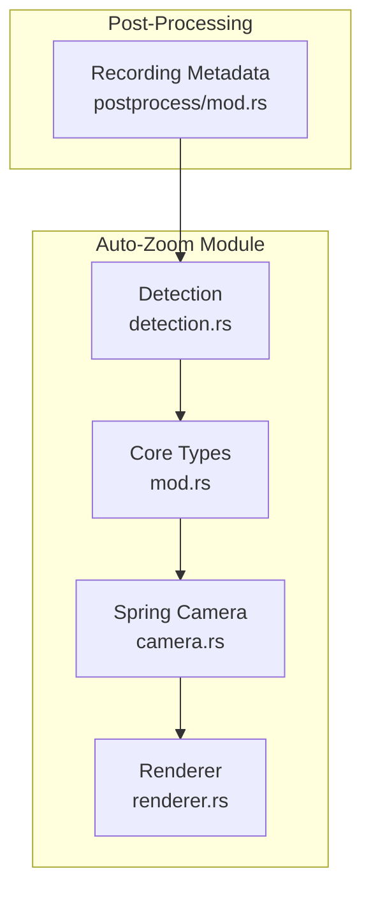
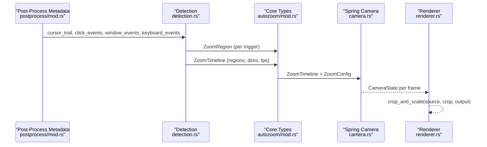
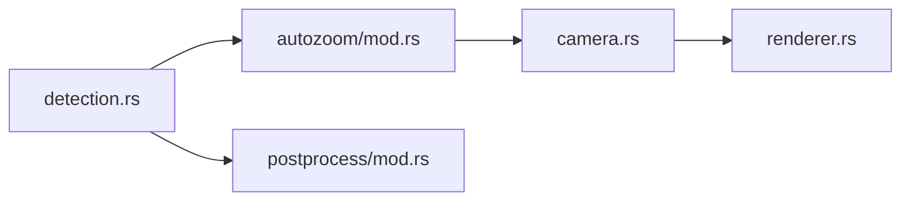

# Zoom Algorithm Core

<cite>
**Referenced Files in This Document**
- [mod.rs](file://src-tauri/src/autozoom/mod.rs)
- [detection.rs](file://src-tauri/src/autozoom/detection.rs)
- [camera.rs](file://src-tauri/src/autozoom/camera.rs)
- [renderer.rs](file://src-tauri/src/autozoom/renderer.rs)
- [mod.rs](file://src-tauri/src/postprocess/mod.rs)
- [test_autozoom.py](file://tests/test_autozoom.py)
</cite>

## Table of Contents
1. [Introduction](#introduction)
2. [Project Structure](#project-structure)
3. [Core Components](#core-components)
4. [Architecture Overview](#architecture-overview)
5. [Detailed Component Analysis](#detailed-component-analysis)
6. [Dependency Analysis](#dependency-analysis)
7. [Performance Considerations](#performance-considerations)
8. [Troubleshooting Guide](#troubleshooting-guide)
9. [Conclusion](#conclusion)

## Introduction
This document explains the Auto-Zoom Engine’s core algorithm implementation. It covers the ZoomRegion data structure with its temporal and spatial properties, the ZoomTrigger enumeration and priority system, and the detection algorithms that identify zoom triggers from cursor trails, clicks, windows, and keyboard events. It also documents the camera animation pipeline and viewport rendering used to apply zoom smoothly during playback.

## Project Structure
The Auto-Zoom Engine resides in the Rust backend under src-tauri/src/autozoom and integrates with the post-processing pipeline in src-tauri/src/postprocess. The detection logic produces a timeline of ZoomRegion entries, which are then animated by a spring-camera and rendered via crop-and-scale operations.

**Diagram sources**
- [detection.rs:11-44](file://src-tauri/src/autozoom/detection.rs#L11-L44)
- [mod.rs:16-101](file://src-tauri/src/autozoom/mod.rs#L16-L101)
- [camera.rs:46-159](file://src-tauri/src/autozoom/camera.rs#L46-L159)
- [renderer.rs:8-117](file://src-tauri/src/autozoom/renderer.rs#L8-L117)
- [mod.rs:12-71](file://src-tauri/src/postprocess/mod.rs#L12-L71)

**Section sources**
- [mod.rs:10-12](file://src-tauri/src/autozoom/mod.rs#L10-L12)
- [mod.rs:61-71](file://src-tauri/src/postprocess/mod.rs#L61-L71)

## Core Components
- ZoomRegion: A time-span with a target viewport center and zoom level, plus trigger and priority metadata.
- ZoomTrigger: Enumeration of trigger types with explicit priority ordering.
- WindowBoundsEvent and KeyboardEvent: Context structures used by detection algorithms.
- ZoomConfig: User-configurable parameters controlling sensitivity, zoom range, and animation speed.

Key properties and behaviors:
- ZoomRegion temporal: start_ms and end_ms define the zoom activation window.
- Spatial: center_x, center_y define the viewport center; zoom_level defines magnification.
- Trigger priority: Higher numeric priority resolves conflicts when regions overlap.
- Sensitivity scaling: Thresholds scale inversely with ZoomConfig.sensitivity to adapt to user preferences.

**Section sources**
- [mod.rs:16-26](file://src-tauri/src/autozoom/mod.rs#L16-L26)
- [mod.rs:29-50](file://src-tauri/src/autozoom/mod.rs#L29-L50)
- [mod.rs:52-67](file://src-tauri/src/autozoom/mod.rs#L52-L67)
- [mod.rs:70-91](file://src-tauri/src/autozoom/mod.rs#L70-L91)

## Architecture Overview
The detection pipeline aggregates multiple signals into a unified timeline of ZoomRegion entries. These regions are then animated by a spring-camera and rendered by crop-and-scale operations.

**Diagram sources**
- [detection.rs:12-44](file://src-tauri/src/autozoom/detection.rs#L12-L44)
- [mod.rs:94-101](file://src-tauri/src/autozoom/mod.rs#L94-L101)
- [camera.rs:162-202](file://src-tauri/src/autozoom/camera.rs#L162-L202)
- [renderer.rs:10-70](file://src-tauri/src/autozoom/renderer.rs#L10-L70)

## Detailed Component Analysis

### ZoomRegion and Trigger Priority
- ZoomRegion fields:
  - start_ms, end_ms: activation window boundaries.
  - center_x, center_y: viewport center in source coordinates.
  - zoom_level: magnification factor clamped to configured min/max.
  - trigger: the cause of the zoom (ClickCluster, WindowDwell, CircleGesture, TextSelection, Typing, Manual).
  - priority: numeric priority derived from trigger type.
- Priority order (highest to lowest):
  - CircleGesture (5)
  - ClickCluster (4)
  - WindowDwell (3)
  - Typing (2)
  - TextSelection (1)
  - Manual (6)
- WindowBoundsEvent and KeyboardEvent provide contextual metadata for detection.

Implementation references:
- [ZoomRegion definition:16-26](file://src-tauri/src/autozoom/mod.rs#L16-L26)
- [ZoomTrigger enum and priority:29-50](file://src-tauri/src/autozoom/mod.rs#L29-L50)
- [WindowBoundsEvent:52-61](file://src-tauri/src/autozoom/mod.rs#L52-L61)
- [KeyboardEvent:63-67](file://src-tauri/src/autozoom/mod.rs#L63-L67)

**Section sources**
- [mod.rs:16-67](file://src-tauri/src/autozoom/mod.rs#L16-L67)

### Detection Algorithms

#### ClickCluster Analysis
Purpose: Detect dense click clusters indicating focused interaction.
- Thresholds:
  - Time window scales inversely with sensitivity.
  - Distance threshold scales inversely with sensitivity.
  - Minimum clicks depends on sensitivity (more clicks require higher sensitivity).
- Output:
  - Bounding box around cluster with generous padding.
  - Zoom level computed from screen size and padded bbox.
  - Short duration with a brief post-click hold.

Implementation references:
- [detect_click_clusters:46-130](file://src-tauri/src/autozoom/detection.rs#L46-L130)

**Section sources**
- [detection.rs:46-130](file://src-tauri/src/autozoom/detection.rs#L46-L130)

#### WindowDwell Detection
Purpose: Zoom to a focused window when the user interacts within it.
- Logic:
  - Group clicks by window bounds near the click timestamps.
  - Require at least two clicks inside the same window.
  - Skip near-full-screen windows.
  - Compute zoom to fit window with padding.
  - Use cursor entry time to determine start; short hold after last click.
- Output:
  - Single region covering the window area.

Implementation references:
- [detect_window_dwell:132-220](file://src-tauri/src/autozoom/detection.rs#L132-L220)

**Section sources**
- [detection.rs:132-220](file://src-tauri/src/autozoom/detection.rs#L132-L220)

#### CircleGesture Recognition
Purpose: Detect closed cursor loops as a zoom trigger.
- Logic:
  - Sliding window over recent cursor samples (fixed time).
  - Look for a point near the window start within a small distance.
  - Require a minimum path length to avoid noise.
  - Compute bounding box with padding and derive zoom level.
- Output:
  - Region centered on the loop with a moderate hold.

Implementation references:
- [detect_circle_gestures:316-412](file://src-tauri/src/autozoom/detection.rs#L316-L412)

**Section sources**
- [detection.rs:316-412](file://src-tauri/src/autozoom/detection.rs#L316-L412)

#### TextSelection Tracking
Purpose: Detect horizontal sweeps indicative of text selection.
- Logic:
  - Slide a fixed-size window over cursor samples.
  - Require strong horizontal dominance over vertical movement and minimum distance.
  - Enforce reasonable duration bounds.
- Output:
  - Subtle zoom region centered on the sweep midpoint.

Implementation references:
- [detect_text_selection:414-459](file://src-tauri/src/autozoom/detection.rs#L414-L459)

**Section sources**
- [detection.rs:414-459](file://src-tauri/src/autozoom/detection.rs#L414-L459)

#### Typing Detection
Purpose: Detect typing sessions with stationary cursor.
- Logic:
  - Require a burst of keystrokes within a short window.
  - Ensure the cursor remains relatively stationary during the session.
  - Session ends after a gap exceeding a threshold.
- Output:
  - Subtle zoom at the cursor position at session start.

Implementation references:
- [detect_typing:222-314](file://src-tauri/src/autozoom/detection.rs#L222-L314)

**Section sources**
- [detection.rs:222-314](file://src-tauri/src/autozoom/detection.rs#L222-L314)

#### Conflict Resolution and Merging
Purpose: Merge overlapping regions and resolve priority conflicts.
- Behavior:
  - Sort by start time.
  - Overlapping regions: keep the higher-priority region.
  - Enforce minimum gap between zooms to prevent rapid toggling.
- Output: Clean, non-overlapping timeline.

Implementation references:
- [merge_and_resolve:461-496](file://src-tauri/src/autozoom/detection.rs#L461-L496)

**Section sources**
- [detection.rs:461-496](file://src-tauri/src/autozoom/detection.rs#L461-L496)

### Camera Animation and Rendering
- SpringCamera:
  - Asymmetric damping: faster zoom-in, gentler zoom-out.
  - Integrates target center and zoom level from active ZoomRegion.
  - Produces CameraState per frame for crop calculation.
- Renderer:
  - crop_and_scale: bilinear interpolation from source crop to output.
  - Coordinate transforms for screen-to-viewport mapping.

Implementation references:
- [SpringCamera:46-159](file://src-tauri/src/autozoom/camera.rs#L46-L159)
- [compute_camera_timeline:161-202](file://src-tauri/src/autozoom/camera.rs#L161-L202)
- [crop_and_scale:10-70](file://src-tauri/src/autozoom/renderer.rs#L10-L70)
- [screen_to_viewport:72-111](file://src-tauri/src/autozoom/renderer.rs#L72-L111)

**Section sources**
- [camera.rs:46-202](file://src-tauri/src/autozoom/camera.rs#L46-L202)
- [renderer.rs:8-117](file://src-tauri/src/autozoom/renderer.rs#L8-L117)

### Implementation Examples and Threshold Calculations
Below are example scenarios demonstrating how each trigger type is detected and processed, including threshold calculations and sensitivity scaling mechanisms.

- ClickCluster
  - Sensitivity scales time window and distance thresholds.
  - Minimum clicks adjusts with sensitivity.
  - Bounding box padding and zoom level derived from screen size and cluster extent.
  - Duration: short hold with a post-click buffer.
  - Reference: [detect_click_clusters:46-130](file://src-tauri/src/autozoom/detection.rs#L46-L130)

- WindowDwell
  - Requires at least two clicks inside a window.
  - Excludes near-full-screen windows.
  - Zoom computed from window size with padding.
  - Entry determined by cursor first entering window bounds.
  - Reference: [detect_window_dwell:132-220](file://src-tauri/src/autozoom/detection.rs#L132-L220)

- Typing
  - Burst of keystrokes within a short window.
  - Cursor must remain stationary during the session.
  - Session ends after a gap threshold.
  - Reference: [detect_typing:222-314](file://src-tauri/src/autozoom/detection.rs#L222-L314)

- CircleGesture
  - Sliding window with a fixed time limit.
  - Loop closure within a small distance.
  - Minimum path length requirement.
  - Reference: [detect_circle_gestures:316-412](file://src-tauri/src/autozoom/detection.rs#L316-L412)

- TextSelection
  - Horizontal sweep with strong horizontal dominance.
  - Duration bounds enforced.
  - Reference: [detect_text_selection:414-459](file://src-tauri/src/autozoom/detection.rs#L414-L459)

- Conflict Resolution
  - Sorting by start time, keeping higher-priority overlapping regions.
  - Minimum gap enforcement between regions.
  - Reference: [merge_and_resolve:461-496](file://src-tauri/src/autozoom/detection.rs#L461-L496)

**Section sources**
- [detection.rs:46-496](file://src-tauri/src/autozoom/detection.rs#L46-L496)

## Dependency Analysis
The detection module depends on:
- Core types (ZoomRegion, ZoomTrigger, WindowBoundsEvent, KeyboardEvent, ZoomConfig, ZoomTimeline).
- Post-processing metadata structures (CursorSample, ClickEvent) for analysis.

**Diagram sources**
- [detection.rs:6-9](file://src-tauri/src/autozoom/detection.rs#L6-L9)
- [mod.rs:14-14](file://src-tauri/src/autozoom/mod.rs#L14-L14)
- [mod.rs:7-11](file://src-tauri/src/postprocess/mod.rs#L7-L11)

**Section sources**
- [detection.rs:6-9](file://src-tauri/src/autozoom/detection.rs#L6-L9)
- [mod.rs:14-14](file://src-tauri/src/autozoom/mod.rs#L14-L14)
- [mod.rs:7-11](file://src-tauri/src/postprocess/mod.rs#L7-L11)

## Performance Considerations
- Sensitivity scaling: Thresholds scale inversely with sensitivity to balance responsiveness and robustness.
- Minimum durations: Enforced to prevent overly frequent zoom toggles.
- Priority-based conflict resolution: Keeps the most relevant zoom active.
- Camera animation: Asymmetric damping provides snappy zoom-in and gentle zoom-out.
- Rendering: Bilinear interpolation ensures smooth scaling quality.

[No sources needed since this section provides general guidance]

## Troubleshooting Guide
Common issues and checks:
- Unexpected zooms during fast movement:
  - Anti-zoom behavior suppresses triggers for rapid motion; verify thresholds and sensitivity.
  - Reference: [merge_and_resolve:461-496](file://src-tauri/src/autozoom/detection.rs#L461-L496)
- Incorrect zoom levels:
  - Ensure zoom levels are clamped within configured min/max bounds.
  - Reference: [ZoomConfig defaults:80-91](file://src-tauri/src/autozoom/mod.rs#L80-L91)
- Overlapping regions:
  - Confirm priority-based merging removes lower-priority overlaps.
  - Reference: [merge_and_resolve:461-496](file://src-tauri/src/autozoom/detection.rs#L461-L496)
- Testing scenarios:
  - Use synthetic test metadata to validate detection logic.
  - Reference: [test_autozoom.py:28-134](file://tests/test_autozoom.py#L28-L134)

**Section sources**
- [detection.rs:461-496](file://src-tauri/src/autozoom/detection.rs#L461-L496)
- [mod.rs:80-91](file://src-tauri/src/autozoom/mod.rs#L80-L91)
- [test_autozoom.py:28-134](file://tests/test_autozoom.py#L28-L134)

## Conclusion
The Auto-Zoom Engine combines multiple detection heuristics into a unified, priority-driven timeline of ZoomRegion entries. Through sensitivity scaling, conflict resolution, and spring-camera animation, it delivers smooth, context-aware zoom transitions that enhance focus on interactive areas while remaining responsive and non-intrusive.