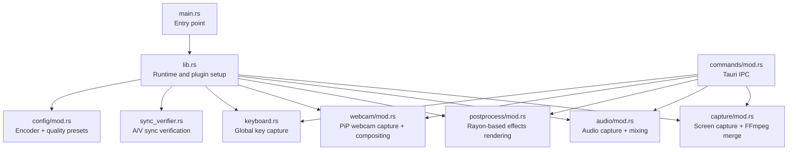
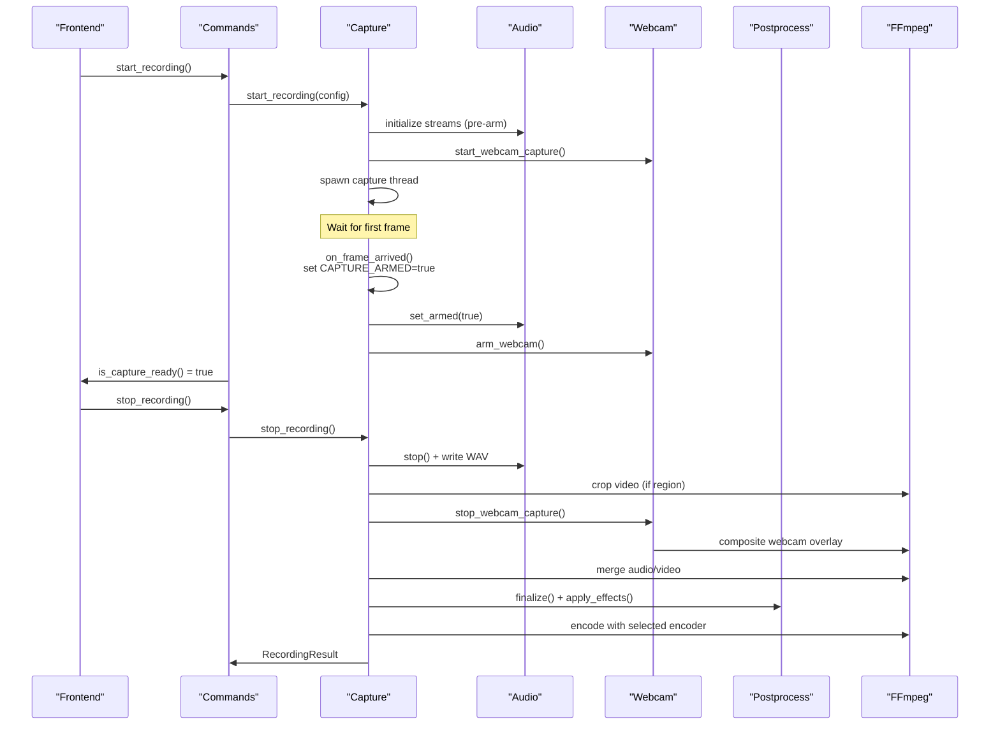
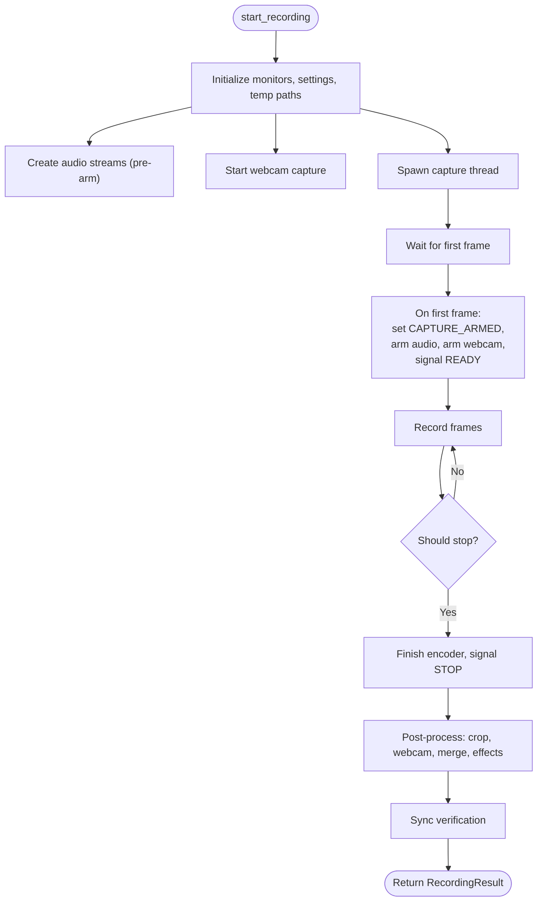
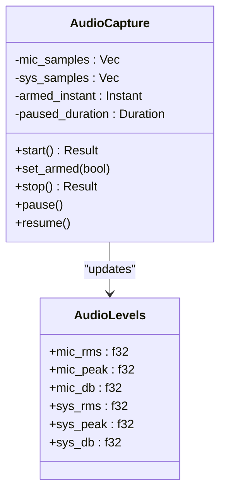
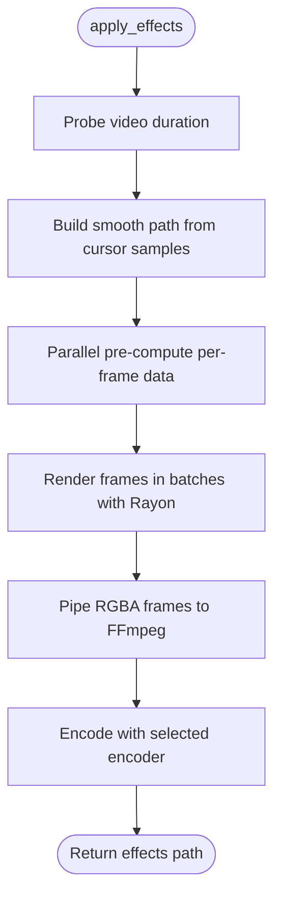
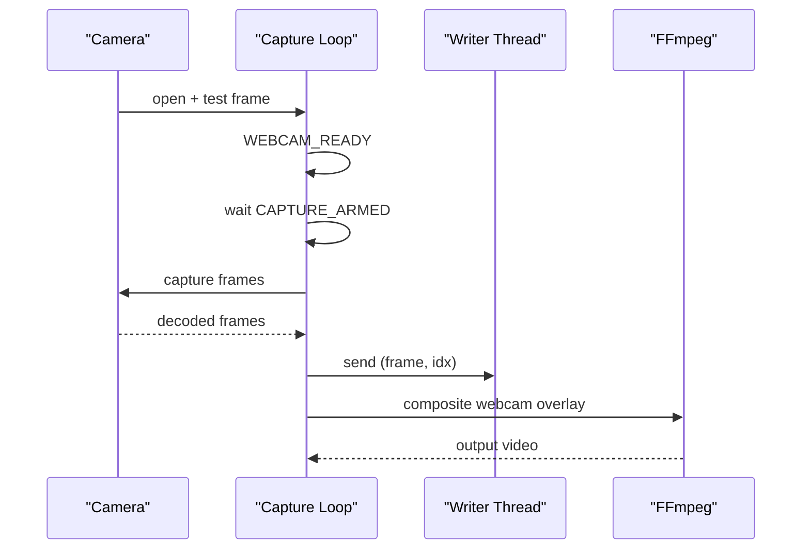
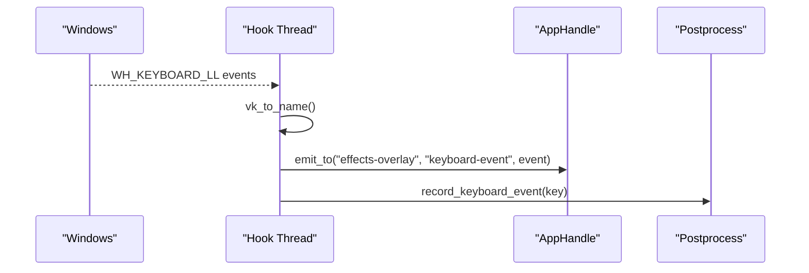
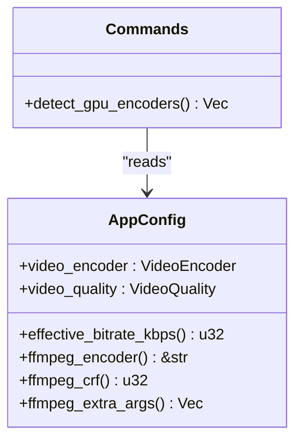
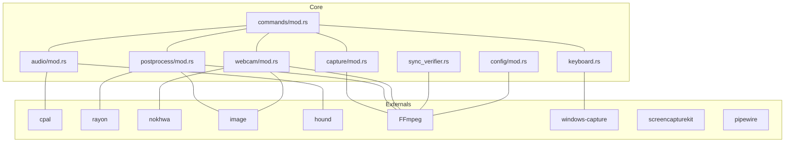

# Performance Optimization

<cite>
**Referenced Files in This Document**
- [Cargo.toml](file://src-tauri/Cargo.toml)
- [lib.rs](file://src-tauri/src/lib.rs)
- [main.rs](file://src-tauri/src/main.rs)
- [mod.rs](file://src-tauri/src/capture/mod.rs)
- [mod.rs](file://src-tauri/src/audio/mod.rs)
- [mod.rs](file://src-tauri/src/postprocess/mod.rs)
- [mod.rs](file://src-tauri/src/webcam/mod.rs)
- [mod.rs](file://src-tauri/src/commands/mod.rs)
- [mod.rs](file://src-tauri/src/config/mod.rs)
- [mod.rs](file://src-tauri/src/sync_verifier.rs)
- [mod.rs](file://src-tauri/src/keyboard.rs)
</cite>

## Table of Contents
1. [Introduction](#introduction)
2. [Project Structure](#project-structure)
3. [Core Components](#core-components)
4. [Architecture Overview](#architecture-overview)
5. [Detailed Component Analysis](#detailed-component-analysis)
6. [Dependency Analysis](#dependency-analysis)
7. [Performance Considerations](#performance-considerations)
8. [Troubleshooting Guide](#troubleshooting-guide)
9. [Conclusion](#conclusion)

## Introduction
This document provides advanced performance optimization guidance for EasySpecy’s resource-intensive recording and rendering pipeline. It focuses on multi-threading with Rayon, CPU utilization strategies, GPU acceleration techniques, and memory management best practices. It also covers performance profiling methodologies, bottleneck identification, and optimization techniques for screen capture, audio processing, and visual effects rendering. Platform-specific optimizations for Windows, macOS, and Linux are included, along with system-level resource management, hardware acceleration, benchmarking strategies, performance monitoring tools, and real-time performance adjustment mechanisms. Memory leak prevention, garbage collection optimization, and resource cleanup procedures are addressed.

## Project Structure
EasySpecy’s Rust backend (Tauri) is organized into modular components responsible for capture, audio, post-processing, webcam, keyboard overlay, configuration, and synchronization verification. The frontend (React + Tauri) manages UI and overlays. The Rust backend orchestrates multi-threaded capture and encoding, leveraging FFmpeg for merging and filtering, and integrates GPU encoders when available.

**Diagram sources**
- [main.rs:1-7](file://src-tauri/src/main.rs#L1-L7)
- [lib.rs:37-136](file://src-tauri/src/lib.rs#L37-L136)
- [mod.rs:1-1064](file://src-tauri/src/capture/mod.rs#L1-L1064)
- [mod.rs:1-980](file://src-tauri/src/audio/mod.rs#L1-L980)
- [mod.rs:1-1697](file://src-tauri/src/postprocess/mod.rs#L1-L1697)
- [mod.rs:1-620](file://src-tauri/src/webcam/mod.rs#L1-L620)
- [mod.rs:1-395](file://src-tauri/src/keyboard.rs#L1-L395)
- [mod.rs:1-568](file://src-tauri/src/sync_verifier.rs#L1-L568)
- [mod.rs:1-432](file://src-tauri/src/config/mod.rs#L1-L432)
- [mod.rs:1-723](file://src-tauri/src/commands/mod.rs#L1-L723)

**Section sources**
- [main.rs:1-7](file://src-tauri/src/main.rs#L1-L7)
- [lib.rs:37-136](file://src-tauri/src/lib.rs#L37-L136)
- [Cargo.toml:1-61](file://src-tauri/Cargo.toml#L1-L61)

## Core Components
- Multi-threaded capture pipeline with synchronized start for video, audio, and webcam.
- Real-time audio capture with pre-allocation and aligned append to maintain sync.
- Rayon-powered parallel rendering for cursor trails and click effects.
- FFmpeg-driven encoding, cropping, merging, and webcam overlay compositing.
- GPU encoder detection and selection via FFmpeg probing.
- Keyboard overlay capture with low-latency hook and event emission.
- Comprehensive A/V sync verification using FFprobe/FFmpeg inspection.

**Section sources**
- [mod.rs:1-1064](file://src-tauri/src/capture/mod.rs#L1-L1064)
- [mod.rs:1-980](file://src-tauri/src/audio/mod.rs#L1-L980)
- [mod.rs:1-1697](file://src-tauri/src/postprocess/mod.rs#L1-L1697)
- [mod.rs:1-620](file://src-tauri/src/webcam/mod.rs#L1-L620)
- [mod.rs:1-395](file://src-tauri/src/keyboard.rs#L1-L395)
- [mod.rs:1-568](file://src-tauri/src/sync_verifier.rs#L1-L568)
- [mod.rs:1-432](file://src-tauri/src/config/mod.rs#L1-L432)
- [mod.rs:1-723](file://src-tauri/src/commands/mod.rs#L1-L723)

## Architecture Overview
The recording lifecycle is orchestrated by Tauri commands, which initialize capture threads, arm audio and webcam on the first video frame, and drive FFmpeg-based encoding. Post-processing leverages Rayon for CPU-bound rendering tasks. GPU encoders are dynamically detected and selected based on FFmpeg availability.

**Diagram sources**
- [mod.rs:249-403](file://src-tauri/src/commands/mod.rs#L249-L403)
- [mod.rs:160-714](file://src-tauri/src/capture/mod.rs#L160-L714)
- [mod.rs:225-553](file://src-tauri/src/audio/mod.rs#L225-L553)
- [mod.rs:38-156](file://src-tauri/src/webcam/mod.rs#L38-L156)
- [mod.rs:169-181](file://src-tauri/src/postprocess/mod.rs#L169-L181)
- [mod.rs:81-250](file://src-tauri/src/sync_verifier.rs#L81-L250)

## Detailed Component Analysis

### Screen Capture and Synchronization
- Uses Windows Capture API with a custom handler to receive frames and synchronize audio and webcam on first frame arrival.
- Atomic flags coordinate capture readiness, armed state, and pause/stop conditions.
- FFmpeg is used for cropping, merging, and encoding with real-time progress reporting.

**Diagram sources**
- [mod.rs:160-714](file://src-tauri/src/capture/mod.rs#L160-L714)

**Section sources**
- [mod.rs:1-1064](file://src-tauri/src/capture/mod.rs#L1-L1064)

### Audio Processing and Mixing
- Streams are created and started immediately; samples are discarded until armed to eliminate latency.
- For “Both” mode, mic and system audio are overlapped/mixed with configurable system volume.
- Aligned append compensates for WASAPI loopback packet delivery gaps to preserve timing.
- Real-time audio level metering updates shared state for frontend polling.

**Diagram sources**
- [mod.rs:189-553](file://src-tauri/src/audio/mod.rs#L189-L553)

**Section sources**
- [mod.rs:1-980](file://src-tauri/src/audio/mod.rs#L1-L980)

### Post-Processing and Effects Rendering
- Rayon is used to parallelize per-frame effect computation for cursor trails and click effects.
- Pre-computes smooth cursor paths and active click windows to minimize per-frame work.
- Produces RGBA frames and pipes them to FFmpeg for overlay composition and encoding.

**Diagram sources**
- [mod.rs:192-556](file://src-tauri/src/postprocess/mod.rs#L192-L556)

**Section sources**
- [mod.rs:1-1697](file://src-tauri/src/postprocess/mod.rs#L1-L1697)

### Webcam Capture and Overlay
- Camera opens immediately and verifies functionality before signaling readiness.
- On capture armed, frames are captured as fast as possible and encoded to PNG asynchronously.
- FFmpeg compositing overlays webcam with optional shape mask and opacity.

**Diagram sources**
- [mod.rs:407-580](file://src-tauri/src/webcam/mod.rs#L407-L580)

**Section sources**
- [mod.rs:1-620](file://src-tauri/src/webcam/mod.rs#L1-L620)

### Keyboard Overlay Capture
- Windows low-level keyboard hook captures global key presses on a dedicated thread with a message loop.
- Events are emitted to the overlay window and recorded for post-processing.

**Diagram sources**
- [mod.rs:139-278](file://src-tauri/src/keyboard.rs#L139-L278)

**Section sources**
- [mod.rs:1-395](file://src-tauri/src/keyboard.rs#L1-L395)

### Configuration and GPU Encoder Detection
- Encapsulates encoder selection, quality presets, and FFmpeg argument generation.
- Detects GPU encoders by probing FFmpeg for available encoders.

**Diagram sources**
- [mod.rs:126-431](file://src-tauri/src/config/mod.rs#L126-L431)
- [mod.rs:168-232](file://src-tauri/src/commands/mod.rs#L168-L232)

**Section sources**
- [mod.rs:1-432](file://src-tauri/src/config/mod.rs#L1-L432)
- [mod.rs:168-232](file://src-tauri/src/commands/mod.rs#L168-L232)

## Dependency Analysis
- External dependencies include cpal (audio), rayon (parallelism), nokhwa (webcam), image (image ops), hound (WAV), tracing (logging), FFmpeg binaries, and platform-specific crates (windows-capture, screencapturekit, pipewire).
- GPU encoders are selected dynamically via FFmpeg probing; presets adjust CRF/QP and tuning parameters.

**Diagram sources**
- [Cargo.toml:26-61](file://src-tauri/Cargo.toml#L26-L61)
- [mod.rs:1-1064](file://src-tauri/src/capture/mod.rs#L1-L1064)
- [mod.rs:1-980](file://src-tauri/src/audio/mod.rs#L1-L980)
- [mod.rs:1-1697](file://src-tauri/src/postprocess/mod.rs#L1-L1697)
- [mod.rs:1-620](file://src-tauri/src/webcam/mod.rs#L1-L620)
- [mod.rs:1-395](file://src-tauri/src/keyboard.rs#L1-L395)
- [mod.rs:1-568](file://src-tauri/src/sync_verifier.rs#L1-L568)
- [mod.rs:1-432](file://src-tauri/src/config/mod.rs#L1-L432)
- [mod.rs:1-723](file://src-tauri/src/commands/mod.rs#L1-L723)

**Section sources**
- [Cargo.toml:26-61](file://src-tauri/Cargo.toml#L26-L61)

## Performance Considerations

### Multi-threading Architecture with Rayon
- Parallel rendering: Use Rayon’s parallel iterators to process per-frame effect computations independently, enabling CPU-bound tasks to utilize all cores efficiently.
- Batch rendering: Render fixed-size batches in parallel and write in-order to maintain FFmpeg input requirements.
- Oversubscription: Allow slight oversubscription (e.g., 2x available cores) to reduce idle time when frames are independent.

Best practices:
- Prefer parallel iterators for independent per-item workloads.
- Use scoped parallelism when sharing data across threads.
- Avoid excessive small tasks to reduce scheduler overhead.

**Section sources**
- [mod.rs:320-540](file://src-tauri/src/postprocess/mod.rs#L320-L540)

### CPU Utilization Strategies
- Producer-consumer for webcam: Capture frames as fast as the camera delivers; offload PNG encoding to a writer thread to prevent capture stalls.
- Pre-computation: Build smooth cursor paths and pre-compute per-frame data to minimize per-frame computation.
- Frame pacing: Use minimal sleep intervals in capture loops to keep threads responsive without burning CPU.

**Section sources**
- [mod.rs:485-580](file://src-tauri/src/webcam/mod.rs#L485-L580)
- [mod.rs:320-429](file://src-tauri/src/postprocess/mod.rs#L320-L429)

### GPU Acceleration Techniques
- Dynamic encoder detection: Probe FFmpeg for available encoders (NVENC, AMF, QSV, SVT-AV1) and select the most appropriate for the target platform.
- Encoder-specific tuning: Use presets, tune parameters, and multipass modes for higher-quality encodes when supported.
- Hardware overlay compositing: Use FFmpeg filters to composite webcam overlays with masks and opacity for GPU-accelerated blending.

Platform-specific notes:
- Windows: NVENC encoders are commonly available on modern NVIDIA GPUs.
- macOS: Consider Apple Silicon hardware encoders via FFmpeg when available.
- Linux: AMD AMF and Intel QSV encoders are often present; otherwise fall back to SVT-AV1.

**Section sources**
- [mod.rs:168-232](file://src-tauri/src/commands/mod.rs#L168-L232)
- [mod.rs:396-430](file://src-tauri/src/config/mod.rs#L396-L430)
- [mod.rs:234-328](file://src-tauri/src/webcam/mod.rs#L234-L328)

### Memory Management Best Practices
- Pre-allocate buffers: Initialize vectors with capacity estimates for audio samples and cursor trails to avoid frequent reallocations.
- Dropping streams promptly: Ensure audio streams are dropped immediately upon stopping to release system handles and restore normal audio playback.
- Temporary file cleanup: Remove temporary directories and files after encoding completion to prevent disk bloat.
- Event pruning: Limit event queues (e.g., keyboard events) to prevent unbounded growth.

**Section sources**
- [mod.rs:226-246](file://src-tauri/src/audio/mod.rs#L226-L246)
- [mod.rs:385-404](file://src-tauri/src/audio/mod.rs#L385-L404)
- [mod.rs:393-400](file://src-tauri/src/webcam/mod.rs#L393-L400)
- [mod.rs:114-137](file://src-tauri/src/keyboard.rs#L114-L137)

### Screen Capture Optimization
- Minimum update interval: Configure per-FPS minimum update intervals to balance quality and CPU usage.
- Region capture: Crop video to region using FFmpeg to reduce downstream processing.
- Frame skipping: Avoid unnecessary processing when recording is paused.

**Section sources**
- [mod.rs:196-200](file://src-tauri/src/capture/mod.rs#L196-L200)
- [mod.rs:716-761](file://src-tauri/src/capture/mod.rs#L716-L761)

### Audio Processing Optimization
- Pre-arm streams: Start audio streams early and discard samples until armed to eliminate latency.
- Aligned append: Compensate for loopback packet gaps to maintain precise timing.
- Mixing strategy: Overlap mic and system audio rather than concatenating to avoid desync.

**Section sources**
- [mod.rs:248-371](file://src-tauri/src/audio/mod.rs#L248-L371)
- [mod.rs:555-609](file://src-tauri/src/audio/mod.rs#L555-L609)
- [mod.rs:485-510](file://src-tauri/src/audio/mod.rs#L485-L510)

### Visual Effects Rendering Optimization
- Smooth path precomputation: Build a single smooth curve from all samples to avoid per-frame interpolation jitter.
- Parallel per-frame rendering: Use Rayon to render batches of frames in parallel.
- Efficient blending: Use alpha blending and premultiplied alpha to minimize overdraw.

**Section sources**
- [mod.rs:558-604](file://src-tauri/src/postprocess/mod.rs#L558-L604)
- [mod.rs:320-540](file://src-tauri/src/postprocess/mod.rs#L320-L540)

### Platform-Specific Optimizations
- Windows:
  - Use Windows Capture API for efficient screen capture.
  - Low-level keyboard hook requires a message loop; ensure proper teardown.
  - Elevated privileges may be required for game capture.
- macOS:
  - Use Screencapturekit for screen capture.
  - Respect privacy permissions and entitlements.
- Linux:
  - Use PipeWire for screen capture and audio.
  - Ensure proper permissions and sandboxing.

**Section sources**
- [Cargo.toml:52-61](file://src-tauri/Cargo.toml#L52-L61)
- [lib.rs:138-205](file://src-tauri/src/lib.rs#L138-L205)
- [mod.rs:139-278](file://src-tauri/src/keyboard.rs#L139-L278)

### Performance Profiling Methodologies
- Tracing: Use structured logging with tracing to measure durations and throughput across stages.
- Progress reporting: Implement real-time progress reporting via FFmpeg’s -progress to track encoding stages.
- Metrics: Track frame rates, audio duration ratios, and sync offsets to identify regressions.

**Section sources**
- [lib.rs:49-83](file://src-tauri/src/lib.rs#L49-L83)
- [mod.rs:424-500](file://src-tauri/src/capture/mod.rs#L424-L500)
- [mod.rs:81-250](file://src-tauri/src/sync_verifier.rs#L81-L250)

### Bottleneck Identification
- Use FFprobe/FFmpeg inspection to verify A/V sync and detect desync or concatenation bugs.
- Compare expected vs actual frame counts and FPS to identify dropped frames or timing issues.
- Monitor audio pre-merge duration to catch overlapping vs concatenation problems.

**Section sources**
- [mod.rs:81-250](file://src-tauri/src/sync_verifier.rs#L81-L250)
- [mod.rs:525-567](file://src-tauri/src/sync_verifier.rs#L525-L567)

### Benchmarking Strategies
- Throughput benchmarks: Measure frames per second and encode time under various resolutions and encoders.
- Quality benchmarks: Compare CRF/QP settings against file sizes and visual fidelity.
- Platform benchmarks: Compare CPU-only vs GPU-accelerated encoders across Windows/macOS/Linux.

**Section sources**
- [mod.rs:279-324](file://src-tauri/src/config/mod.rs#L279-L324)
- [mod.rs:168-232](file://src-tauri/src/commands/mod.rs#L168-L232)

### Performance Monitoring Tools
- Logging: Structured logs with tracing to capture stage timings and errors.
- UI feedback: Expose encoding progress and stage descriptions to the frontend.
- System metrics: Monitor CPU, GPU, and memory usage externally using platform tools.

**Section sources**
- [lib.rs:49-83](file://src-tauri/src/lib.rs#L49-L83)
- [mod.rs:412-422](file://src-tauri/src/capture/mod.rs#L412-L422)

### Real-Time Performance Adjustment
- Dynamic encoder selection: Choose GPU encoders when available; fallback to CPU encoders otherwise.
- Quality presets: Adjust CRF/QP and tuning parameters based on target quality and bitrate.
- Frame pacing: Reduce FPS or resolution dynamically to maintain target bitrates.

**Section sources**
- [mod.rs:335-430](file://src-tauri/src/config/mod.rs#L335-L430)
- [mod.rs:168-232](file://src-tauri/src/commands/mod.rs#L168-L232)

### Memory Leak Prevention and Resource Cleanup
- Proper stream dropping: Ensure audio streams are dropped immediately on stop to release system handles.
- Temporary file cleanup: Remove temp directories and webcam frames after encoding.
- Event queue limits: Cap event queues to prevent memory growth.
- Thread teardown: Ensure keyboard hook thread exits cleanly and unhook is called.

**Section sources**
- [mod.rs:385-394](file://src-tauri/src/audio/mod.rs#L385-L394)
- [mod.rs:393-400](file://src-tauri/src/webcam/mod.rs#L393-L400)
- [mod.rs:85-112](file://src-tauri/src/keyboard.rs#L85-L112)

## Troubleshooting Guide
Common issues and remedies:
- Capture initialization timeout: Increase timeout or verify monitor availability and permissions.
- Audio desync: Confirm audio is armed on first frame and verify “Both” mode overlap logic.
- Webcam compositing failures: Fallback to simple overlay without mask; verify mask generation and FFmpeg filters.
- Keyboard overlay not working: Ensure Windows hook installation succeeds and message loop is running.
- Sync verification failures: Review A/V drift, start offsets, and audio/video duration ratios.

**Section sources**
- [mod.rs:308-324](file://src-tauri/src/capture/mod.rs#L308-L324)
- [mod.rs:405-458](file://src-tauri/src/audio/mod.rs#L405-L458)
- [mod.rs:329-391](file://src-tauri/src/webcam/mod.rs#L329-L391)
- [mod.rs:139-278](file://src-tauri/src/keyboard.rs#L139-L278)
- [mod.rs:81-250](file://src-tauri/src/sync_verifier.rs#L81-L250)

## Conclusion
EasySpecy’s recording pipeline combines multi-threading, Rayon-based parallelism, and FFmpeg-driven encoding to achieve high-quality screen recordings with visual effects. By synchronizing capture, optimizing CPU and GPU utilization, managing memory carefully, and validating A/V sync, the system maintains responsiveness and quality across platforms. The provided strategies and tools enable continuous performance tuning and robust operation under varying workloads.