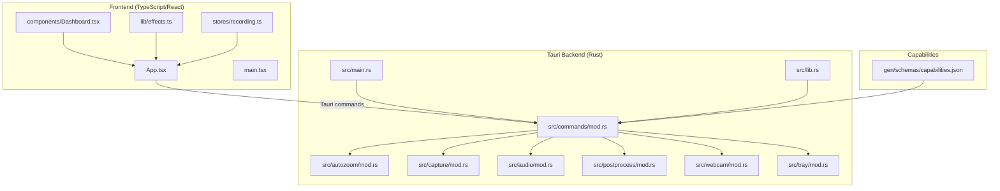
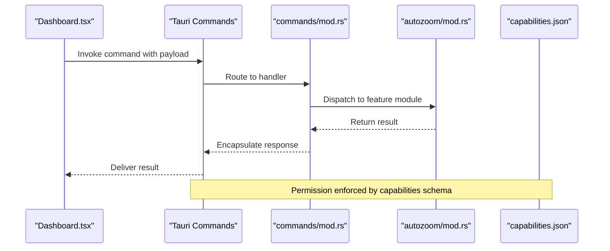
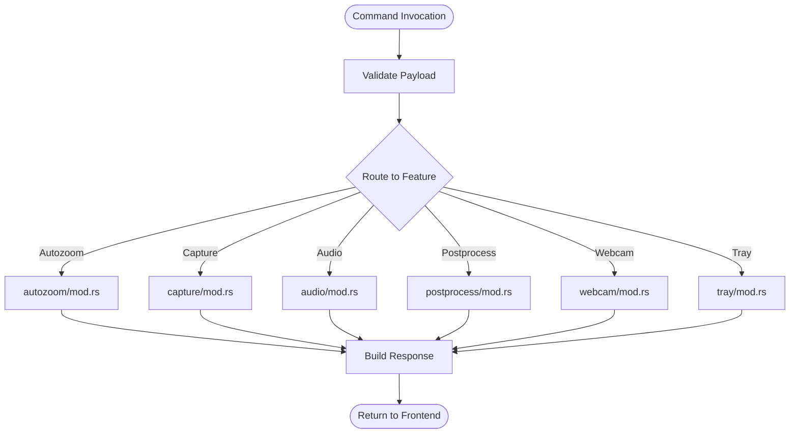
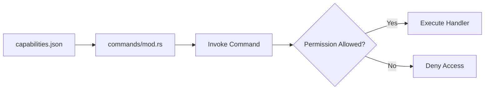
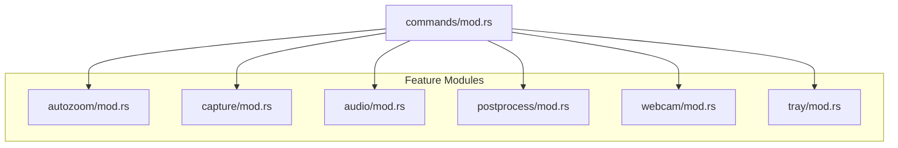
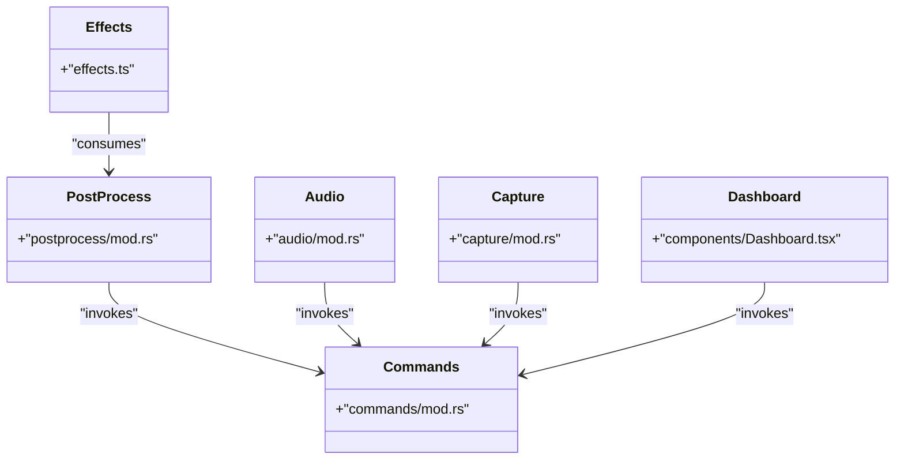
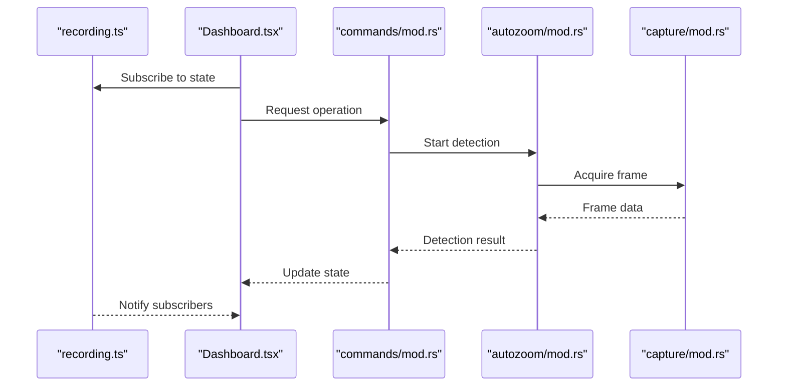
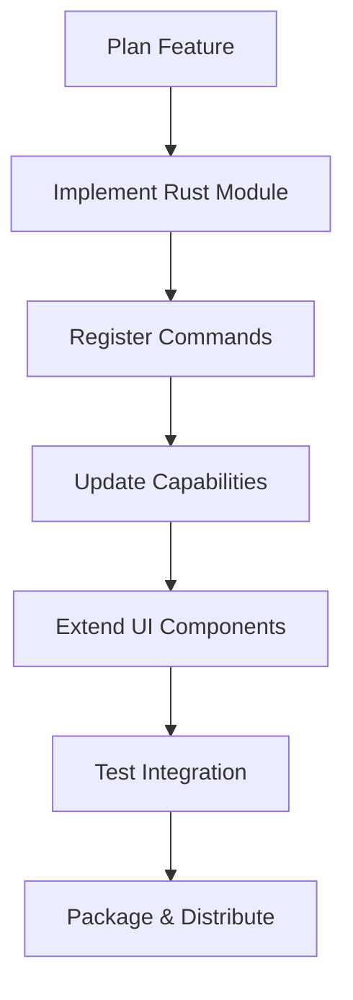
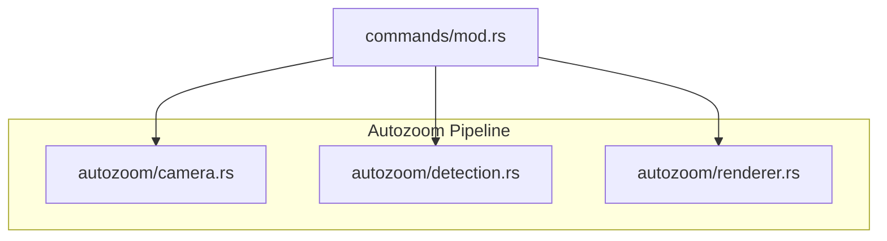
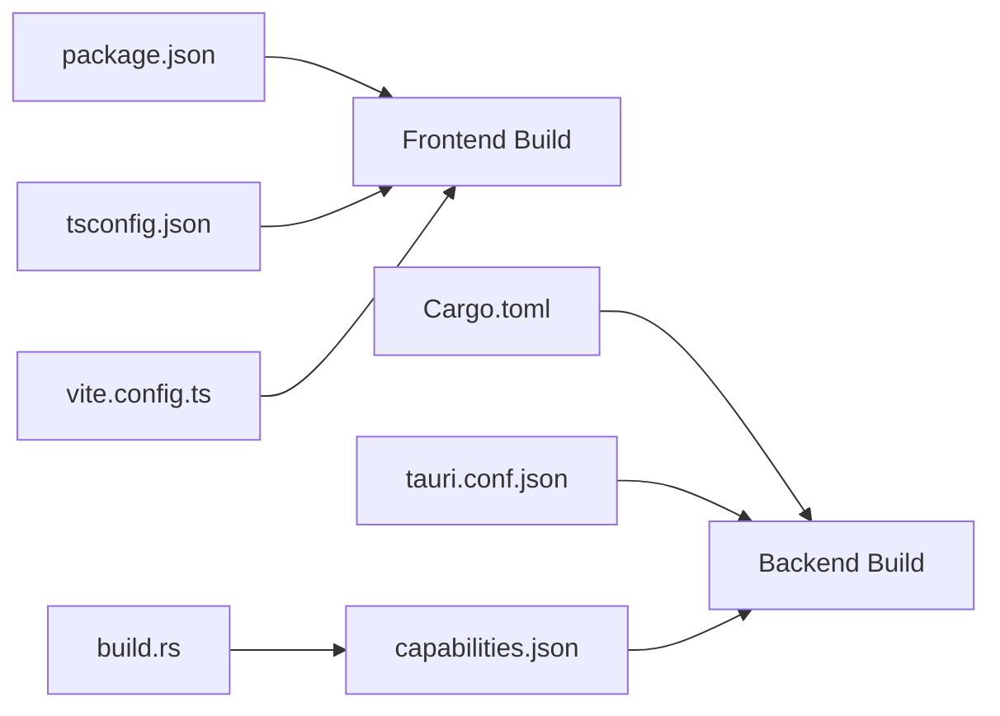

# Plugin Architecture & Extensibility

<cite>
**Referenced Files in This Document**
- [README.md](file://README.md)
- [package.json](file://package.json)
- [vite.config.ts](file://vite.config.ts)
- [tsconfig.json](file://tsconfig.json)
- [src-tauri/tauri.conf.json](file://src-tauri/tauri.conf.json)
- [src-tauri/Cargo.toml](file://src-tauri/Cargo.toml)
- [src-tauri/build.rs](file://src-tauri/build.rs)
- [src-tauri/gen/schemas/capabilities.json](file://src-tauri/gen/schemas/capabilities.json)
- [src-tauri/src/main.rs](file://src-tauri/src/main.rs)
- [src-tauri/src/lib.rs](file://src-tauri/src/lib.rs)
- [src-tauri/src/commands/mod.rs](file://src-tauri/src/commands/mod.rs)
- [src-tauri/src/autozoom/mod.rs](file://src-tauri/src/autozoom/mod.rs)
- [src-tauri/src/autozoom/detection.rs](file://src-tauri/src/autozoom/detection.rs)
- [src-tauri/src/autozoom/camera.rs](file://src-tauri/src/autozoom/camera.rs)
- [src-tauri/src/autozoom/renderer.rs](file://src-tauri/src/autozoom/renderer.rs)
- [src-tauri/src/capture/mod.rs](file://src-tauri/src/capture/mod.rs)
- [src-tauri/src/audio/mod.rs](file://src-tauri/src/audio/mod.rs)
- [src-tauri/src/postprocess/mod.rs](file://src-tauri/src/postprocess/mod.rs)
- [src-tauri/src/tray/mod.rs](file://src-tauri/src/tray/mod.rs)
- [src-tauri/src/webcam/mod.rs](file://src-tauri/src/webcam/mod.rs)
- [src/App.tsx](file://src/App.tsx)
- [src/main.tsx](file://src/main.tsx)
- [src/components/Dashboard.tsx](file://src/components/Dashboard.tsx)
- [src/stores/recording.ts](file://src/stores/recording.ts)
- [src/lib/effects.ts](file://src/lib/effects.ts)
</cite>

## Table of Contents
1. [Introduction](#introduction)
2. [Project Structure](#project-structure)
3. [Core Components](#core-components)
4. [Architecture Overview](#architecture-overview)
5. [Detailed Component Analysis](#detailed-component-analysis)
6. [Dependency Analysis](#dependency-analysis)
7. [Performance Considerations](#performance-considerations)
8. [Troubleshooting Guide](#troubleshooting-guide)
9. [Conclusion](#conclusion)
10. [Appendices](#appendices)

## Introduction
This document explains EasySpecy’s extensible plugin architecture and integration points for extending functionality beyond core features. It focuses on the Tauri command system, capability-based security model, and plugin loading mechanisms. It also documents extension points for custom effects, audio processors, capture modules, and UI components, along with plugin development lifecycle, API contracts, version compatibility, dependency management, examples of plugin implementation patterns, inter-plugin communication, state synchronization, security model, sandboxing mechanisms, permission management, maintainability guidelines, testing strategies, and distribution methods.

## Project Structure
EasySpecy is a Tauri-based desktop application with a frontend built in TypeScript/React and a Rust backend. The frontend exposes UI components and integrates with Tauri commands. The backend organizes functionality into modules (autozoom, capture, audio, postprocess, webcam, tray) and registers Tauri commands. Capabilities define permissions for backend commands exposed to the frontend.

**Diagram sources**
- [src-tauri/src/main.rs](file://src-tauri/src/main.rs)
- [src-tauri/src/lib.rs](file://src-tauri/src/lib.rs)
- [src-tauri/src/commands/mod.rs](file://src-tauri/src/commands/mod.rs)
- [src-tauri/src/autozoom/mod.rs](file://src-tauri/src/autozoom/mod.rs)
- [src-tauri/src/capture/mod.rs](file://src-tauri/src/capture/mod.rs)
- [src-tauri/src/audio/mod.rs](file://src-tauri/src/audio/mod.rs)
- [src-tauri/src/postprocess/mod.rs](file://src-tauri/src/postprocess/mod.rs)
- [src-tauri/src/webcam/mod.rs](file://src-tauri/src/webcam/mod.rs)
- [src-tauri/src/tray/mod.rs](file://src-tauri/src/tray/mod.rs)
- [src-tauri/gen/schemas/capabilities.json](file://src-tauri/gen/schemas/capabilities.json)
- [src/App.tsx](file://src/App.tsx)
- [src/main.tsx](file://src/main.tsx)
- [src/components/Dashboard.tsx](file://src/components/Dashboard.tsx)
- [src/lib/effects.ts](file://src/lib/effects.ts)
- [src/stores/recording.ts](file://src/stores/recording.ts)

**Section sources**
- [README.md](file://README.md)
- [package.json](file://package.json)
- [vite.config.ts](file://vite.config.ts)
- [tsconfig.json](file://tsconfig.json)
- [src-tauri/tauri.conf.json](file://src-tauri/tauri.conf.json)
- [src-tauri/Cargo.toml](file://src-tauri/Cargo.toml)
- [src-tauri/build.rs](file://src-tauri/build.rs)
- [src-tauri/gen/schemas/capabilities.json](file://src-tauri/gen/schemas/capabilities.json)
- [src-tauri/src/main.rs](file://src-tauri/src/main.rs)
- [src-tauri/src/lib.rs](file://src-tauri/src/lib.rs)
- [src-tauri/src/commands/mod.rs](file://src-tauri/src/commands/mod.rs)
- [src-tauri/src/autozoom/mod.rs](file://src-tauri/src/autozoom/mod.rs)
- [src-tauri/src/capture/mod.rs](file://src-tauri/src/capture/mod.rs)
- [src-tauri/src/audio/mod.rs](file://src-tauri/src/audio/mod.rs)
- [src-tauri/src/postprocess/mod.rs](file://src-tauri/src/postprocess/mod.rs)
- [src-tauri/src/webcam/mod.rs](file://src-tauri/src/webcam/mod.rs)
- [src-tauri/src/tray/mod.rs](file://src-tauri/src/tray/mod.rs)
- [src/App.tsx](file://src/App.tsx)
- [src/main.tsx](file://src/main.tsx)
- [src/components/Dashboard.tsx](file://src/components/Dashboard.tsx)
- [src/lib/effects.ts](file://src/lib/effects.ts)
- [src/stores/recording.ts](file://src/stores/recording.ts)

## Core Components
- Frontend entrypoints and UI:
  - Application bootstrap and routing occur in the React app.
  - Dashboard and customization components integrate with Tauri commands.
  - Effects library and recording store expose state and actions to UI.
- Backend entrypoints and command registration:
  - The Tauri backend initializes commands and modules.
  - Commands are registered under a central module and dispatched to feature-specific modules.
- Capability-based security:
  - Capabilities define which commands the frontend can invoke, enabling a permission model.

Key extension points:
- Autozoom pipeline (camera, detection, renderer) for computer vision features.
- Capture module for device capture integrations.
- Audio module for audio processing hooks.
- Post-process module for effect chaining and rendering.
- Webcam module for preview overlays.
- Tray module for system tray integrations.

**Section sources**
- [src-tauri/src/main.rs](file://src-tauri/src/main.rs)
- [src-tauri/src/lib.rs](file://src-tauri/src/lib.rs)
- [src-tauri/src/commands/mod.rs](file://src-tauri/src/commands/mod.rs)
- [src-tauri/gen/schemas/capabilities.json](file://src-tauri/gen/schemas/capabilities.json)
- [src-tauri/src/autozoom/mod.rs](file://src-tauri/src/autozoom/mod.rs)
- [src-tauri/src/capture/mod.rs](file://src-tauri/src/capture/mod.rs)
- [src-tauri/src/audio/mod.rs](file://src-tauri/src/audio/mod.rs)
- [src-tauri/src/postprocess/mod.rs](file://src-tauri/src/postprocess/mod.rs)
- [src-tauri/src/webcam/mod.rs](file://src-tauri/src/webcam/mod.rs)
- [src-tauri/src/tray/mod.rs](file://src-tauri/src/tray/mod.rs)
- [src/App.tsx](file://src/App.tsx)
- [src/components/Dashboard.tsx](file://src/components/Dashboard.tsx)
- [src/lib/effects.ts](file://src/lib/effects.ts)
- [src/stores/recording.ts](file://src/stores/recording.ts)

## Architecture Overview
The system follows a layered architecture:
- Frontend (React + TypeScript) communicates with the backend via Tauri commands.
- Backend (Rust) orchestrates feature modules and enforces capabilities.
- Capabilities schema defines the contract for command invocation.

**Diagram sources**
- [src-tauri/src/commands/mod.rs](file://src-tauri/src/commands/mod.rs)
- [src-tauri/src/autozoom/mod.rs](file://src-tauri/src/autozoom/mod.rs)
- [src-tauri/gen/schemas/capabilities.json](file://src-tauri/gen/schemas/capabilities.json)
- [src/components/Dashboard.tsx](file://src/components/Dashboard.tsx)

## Detailed Component Analysis

### Tauri Command System
- Central command registry:
  - Commands are declared and routed in the commands module.
  - Handlers dispatch to feature modules (autozoom, capture, audio, postprocess, webcam, tray).
- Frontend invocation:
  - React components call Tauri APIs to send commands and receive results.
- Command lifecycle:
  - Request validation, feature-specific processing, and response packaging.

**Diagram sources**
- [src-tauri/src/commands/mod.rs](file://src-tauri/src/commands/mod.rs)
- [src-tauri/src/autozoom/mod.rs](file://src-tauri/src/autozoom/mod.rs)
- [src-tauri/src/capture/mod.rs](file://src-tauri/src/capture/mod.rs)
- [src-tauri/src/audio/mod.rs](file://src-tauri/src/audio/mod.rs)
- [src-tauri/src/postprocess/mod.rs](file://src-tauri/src/postprocess/mod.rs)
- [src-tauri/src/webcam/mod.rs](file://src-tauri/src/webcam/mod.rs)
- [src-tauri/src/tray/mod.rs](file://src-tauri/src/tray/mod.rs)

**Section sources**
- [src-tauri/src/commands/mod.rs](file://src-tauri/src/commands/mod.rs)
- [src-tauri/src/main.rs](file://src-tauri/src/main.rs)
- [src-tauri/src/lib.rs](file://src-tauri/src/lib.rs)
- [src/components/Dashboard.tsx](file://src/components/Dashboard.tsx)

### Capability-Based Security Model
- Capabilities schema:
  - Defines allowed commands and their parameters.
  - Enforced by Tauri runtime to prevent unauthorized access.
- Permission management:
  - Assign granular permissions per command.
  - Supports overlays, default window, and specialized contexts.

**Diagram sources**
- [src-tauri/gen/schemas/capabilities.json](file://src-tauri/gen/schemas/capabilities.json)
- [src-tauri/src/commands/mod.rs](file://src-tauri/src/commands/mod.rs)

**Section sources**
- [src-tauri/gen/schemas/capabilities.json](file://src-tauri/gen/schemas/capabilities.json)
- [src-tauri/tauri.conf.json](file://src-tauri/tauri.conf.json)

### Plugin Loading Mechanisms
- Dynamic loading:
  - Rust modules are linked at build-time; dynamic plugin loading is not present in the current codebase.
- Extension points:
  - Feature modules (autozoom, capture, audio, postprocess, webcam, tray) act as plugin-like units.
  - Commands serve as the primary integration surface for external logic.
- Packaging:
  - Tauri configuration and Cargo metadata define the application boundary.

**Diagram sources**
- [src-tauri/src/commands/mod.rs](file://src-tauri/src/commands/mod.rs)
- [src-tauri/src/autozoom/mod.rs](file://src-tauri/src/autozoom/mod.rs)
- [src-tauri/src/capture/mod.rs](file://src-tauri/src/capture/mod.rs)
- [src-tauri/src/audio/mod.rs](file://src-tauri/src/audio/mod.rs)
- [src-tauri/src/postprocess/mod.rs](file://src-tauri/src/postprocess/mod.rs)
- [src-tauri/src/webcam/mod.rs](file://src-tauri/src/webcam/mod.rs)
- [src-tauri/src/tray/mod.rs](file://src-tauri/src/tray/mod.rs)

**Section sources**
- [src-tauri/src/commands/mod.rs](file://src-tauri/src/commands/mod.rs)
- [src-tauri/src/autozoom/mod.rs](file://src-tauri/src/autozoom/mod.rs)
- [src-tauri/src/capture/mod.rs](file://src-tauri/src/capture/mod.rs)
- [src-tauri/src/audio/mod.rs](file://src-tauri/src/audio/mod.rs)
- [src-tauri/src/postprocess/mod.rs](file://src-tauri/src/postprocess/mod.rs)
- [src-tauri/src/webcam/mod.rs](file://src-tauri/src/webcam/mod.rs)
- [src-tauri/src/tray/mod.rs](file://src-tauri/src/tray/mod.rs)

### Extension Points for Custom Effects, Audio Processors, Capture Modules, and UI Components
- Custom effects:
  - Effects library provides a foundation for visual/audio effects; new effects can be integrated via the post-processing pipeline.
- Audio processors:
  - Audio module exposes hooks for processing; new processors can be added by extending the audio module and registering commands.
- Capture modules:
  - Capture module defines the interface for device capture; new capture backends can be introduced by implementing capture logic and wiring commands.
- UI components:
  - Dashboard and customization components integrate with Tauri commands; new UI panels can be added by extending the dashboard and invoking backend commands.

**Diagram sources**
- [src/lib/effects.ts](file://src/lib/effects.ts)
- [src-tauri/src/postprocess/mod.rs](file://src-tauri/src/postprocess/mod.rs)
- [src-tauri/src/audio/mod.rs](file://src-tauri/src/audio/mod.rs)
- [src-tauri/src/capture/mod.rs](file://src-tauri/src/capture/mod.rs)
- [src-tauri/src/commands/mod.rs](file://src-tauri/src/commands/mod.rs)
- [src/components/Dashboard.tsx](file://src/components/Dashboard.tsx)

**Section sources**
- [src/lib/effects.ts](file://src/lib/effects.ts)
- [src-tauri/src/postprocess/mod.rs](file://src-tauri/src/postprocess/mod.rs)
- [src-tauri/src/audio/mod.rs](file://src-tauri/src/audio/mod.rs)
- [src-tauri/src/capture/mod.rs](file://src-tauri/src/capture/mod.rs)
- [src-tauri/src/commands/mod.rs](file://src-tauri/src/commands/mod.rs)
- [src/components/Dashboard.tsx](file://src/components/Dashboard.tsx)

### Inter-Plugin Communication and State Synchronization
- State exposure:
  - Recording store exposes state and actions to UI components.
- Cross-module coordination:
  - Commands coordinate between modules (e.g., autozoom triggers capture and post-processing).
- Synchronization:
  - Sync verifier exists in the backend for ensuring consistency across operations.

**Diagram sources**
- [src/stores/recording.ts](file://src/stores/recording.ts)
- [src/components/Dashboard.tsx](file://src/components/Dashboard.tsx)
- [src-tauri/src/commands/mod.rs](file://src-tauri/src/commands/mod.rs)
- [src-tauri/src/autozoom/mod.rs](file://src-tauri/src/autozoom/mod.rs)
- [src-tauri/src/capture/mod.rs](file://src-tauri/src/capture/mod.rs)

**Section sources**
- [src/stores/recording.ts](file://src/stores/recording.ts)
- [src/components/Dashboard.tsx](file://src/components/Dashboard.tsx)
- [src-tauri/src/commands/mod.rs](file://src-tauri/src/commands/mod.rs)
- [src-tauri/src/autozoom/mod.rs](file://src-tauri/src/autozoom/mod.rs)
- [src-tauri/src/capture/mod.rs](file://src-tauri/src/capture/mod.rs)

### Plugin Development Lifecycle, API Contracts, Version Compatibility, and Dependency Management
- Development lifecycle:
  - Define feature module in Rust, register commands, update capabilities, and wire UI components.
- API contracts:
  - Commands define request/response contracts; capabilities define allowed invocations.
- Version compatibility:
  - Tauri and Rust toolchain versions are defined in configuration and build scripts.
- Dependency management:
  - Cargo.toml lists backend dependencies; package.json lists frontend dependencies.

**Diagram sources**
- [src-tauri/Cargo.toml](file://src-tauri/Cargo.toml)
- [package.json](file://package.json)
- [src-tauri/tauri.conf.json](file://src-tauri/tauri.conf.json)
- [src-tauri/build.rs](file://src-tauri/build.rs)

**Section sources**
- [src-tauri/Cargo.toml](file://src-tauri/Cargo.toml)
- [package.json](file://package.json)
- [src-tauri/tauri.conf.json](file://src-tauri/tauri.conf.json)
- [src-tauri/build.rs](file://src-tauri/build.rs)

### Examples of Plugin Implementation Patterns
- Autozoom pipeline:
  - Camera acquisition, detection, and renderer form a cohesive pipeline invoked via commands.
- Audio processing:
  - Audio module acts as a processor hook; new processors can be added by extending handlers and updating capabilities.
- Capture integration:
  - Capture module defines the interface; new capture backends can be introduced by implementing capture logic and wiring commands.
- UI integration:
  - Dashboard components invoke commands to trigger backend operations and reflect state updates.

**Diagram sources**
- [src-tauri/src/autozoom/camera.rs](file://src-tauri/src/autozoom/camera.rs)
- [src-tauri/src/autozoom/detection.rs](file://src-tauri/src/autozoom/detection.rs)
- [src-tauri/src/autozoom/renderer.rs](file://src-tauri/src/autozoom/renderer.rs)
- [src-tauri/src/commands/mod.rs](file://src-tauri/src/commands/mod.rs)

**Section sources**
- [src-tauri/src/autozoom/camera.rs](file://src-tauri/src/autozoom/camera.rs)
- [src-tauri/src/autozoom/detection.rs](file://src-tauri/src/autozoom/detection.rs)
- [src-tauri/src/autozoom/renderer.rs](file://src-tauri/src/autozoom/renderer.rs)
- [src-tauri/src/commands/mod.rs](file://src-tauri/src/commands/mod.rs)

## Dependency Analysis
- Frontend dependencies:
  - Vite configuration, TypeScript compiler options, and package manifest define the frontend stack.
- Backend dependencies:
  - Cargo.toml defines Rust crates; Tauri configuration and build script define packaging and capabilities generation.
- Runtime dependencies:
  - Capabilities schema is generated and embedded at build time.

**Diagram sources**
- [package.json](file://package.json)
- [tsconfig.json](file://tsconfig.json)
- [vite.config.ts](file://vite.config.ts)
- [src-tauri/Cargo.toml](file://src-tauri/Cargo.toml)
- [src-tauri/tauri.conf.json](file://src-tauri/tauri.conf.json)
- [src-tauri/build.rs](file://src-tauri/build.rs)
- [src-tauri/gen/schemas/capabilities.json](file://src-tauri/gen/schemas/capabilities.json)

**Section sources**
- [package.json](file://package.json)
- [tsconfig.json](file://tsconfig.json)
- [vite.config.ts](file://vite.config.ts)
- [src-tauri/Cargo.toml](file://src-tauri/Cargo.toml)
- [src-tauri/tauri.conf.json](file://src-tauri/tauri.conf.json)
- [src-tauri/build.rs](file://src-tauri/build.rs)
- [src-tauri/gen/schemas/capabilities.json](file://src-tauri/gen/schemas/capabilities.json)

## Performance Considerations
- Minimize cross-process overhead:
  - Batch command invocations and coalesce UI updates.
- Optimize heavy operations:
  - Offload compute-intensive tasks to dedicated modules and avoid blocking the UI thread.
- Efficient state updates:
  - Use selective subscriptions and avoid unnecessary re-renders.

## Troubleshooting Guide
- Command not found:
  - Verify command registration and capabilities schema.
- Permission denied:
  - Confirm capability entries for the target command.
- Build errors:
  - Ensure Cargo.toml and tauri.conf.json are consistent; regenerate capabilities schema if needed.

**Section sources**
- [src-tauri/src/commands/mod.rs](file://src-tauri/src/commands/mod.rs)
- [src-tauri/gen/schemas/capabilities.json](file://src-tauri/gen/schemas/capabilities.json)
- [src-tauri/Cargo.toml](file://src-tauri/Cargo.toml)
- [src-tauri/tauri.conf.json](file://src-tauri/tauri.conf.json)
- [src-tauri/build.rs](file://src-tauri/build.rs)

## Conclusion
EasySpecy’s plugin architecture leverages Tauri commands and a capability-based security model to enable extensibility across autozoom, capture, audio, post-processing, webcam, and tray domains. The frontend integrates with backend modules through a centralized command system, while capabilities enforce permissions. Extension points for effects, audio processors, capture modules, and UI components are well-defined. Following the documented lifecycle, contracts, and security model enables maintainable, testable, and distributable plugins.

## Appendices
- Security model summary:
  - Permissions are defined in capabilities; Tauri enforces them at runtime.
- Sandbox and isolation:
  - Plugins execute within the Tauri process; isolate sensitive operations behind capability gates.
- Distribution:
  - Package the Tauri app with updated capabilities and feature modules; publish platform-specific installers.