# Research & Algorithm Development

<cite>
**Referenced Files in This Document**
- [index.html](file://research/auto-zoom-heuristics/index.html)
- [findings.json](file://research/auto-zoom-heuristics/data/findings.json)
- [mod.rs](file://src-tauri/src/autozoom/mod.rs)
- [detection.rs](file://src-tauri/src/autozoom/detection.rs)
- [camera.rs](file://src-tauri/src/autozoom/camera.rs)
- [renderer.rs](file://src-tauri/src/autozoom/renderer.rs)
- [keyboard.rs](file://src-tauri/src/keyboard.rs)
- [mod.rs](file://src-tauri/src/postprocess/mod.rs)
- [mod.rs](file://src-tauri/src/capture/mod.rs)
- [test_autozoom.py](file://tests/test_autozoom.py)
- [Cargo.toml](file://src-tauri/Cargo.toml)
- [index.html](file://research/keyboard-hook-game-capture_03_JUN_2026/index.html)
- [index.html](file://research/tauri-transparent-overlay_03_JUN_2026/index.html)
- [index.html](file://research/auto-zoom-heuristics/sources.html)
</cite>

## Table of Contents
1. [Introduction](#introduction)
2. [Project Structure](#project-structure)
3. [Core Components](#core-components)
4. [Architecture Overview](#architecture-overview)
5. [Detailed Component Analysis](#detailed-component-analysis)
6. [Dependency Analysis](#dependency-analysis)
7. [Performance Considerations](#performance-considerations)
8. [Troubleshooting Guide](#troubleshooting-guide)
9. [Conclusion](#conclusion)
10. [Appendices](#appendices)

## Introduction
This document describes EasySpecy's research-driven algorithm development and experimental feature implementation pipeline. It covers the research methodology for heuristic algorithms, data collection processes, and validation techniques. It explains the auto-zoom heuristics research, keyboard hook effectiveness studies, and transparent overlay optimization research. It also documents algorithm evaluation metrics, performance benchmarks, comparative analysis methods, and guidelines for conducting research experiments, collecting and analyzing user interaction data, and implementing algorithm improvements. Finally, it outlines the research-to-production pipeline, feature flag systems, and gradual rollout strategies for experimental features.

## Project Structure
The repository organizes research materials and implementation artifacts into clear categories:
- Research reports and findings for auto-zoom heuristics, keyboard hook effectiveness, and transparent overlay optimization
- Rust modules implementing the auto-zoom detection engine, camera animation, rendering pipeline, and post-processing integration
- Keyboard capture and overlay systems
- Tests validating auto-zoom detection logic
- Build configuration and dependencies

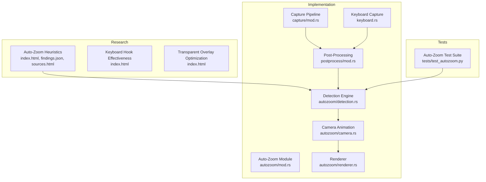

**Diagram sources**
- [index.html:1-762](file://research/auto-zoom-heuristics/index.html#L1-L762)
- [findings.json:1-60](file://research/auto-zoom-heuristics/data/findings.json#L1-L60)
- [mod.rs:1-800](file://src-tauri/src/capture/mod.rs#L1-L800)
- [mod.rs:1-800](file://src-tauri/src/postprocess/mod.rs#L1-L800)
- [keyboard.rs:1-395](file://src-tauri/src/keyboard.rs#L1-L395)
- [mod.rs:1-101](file://src-tauri/src/autozoom/mod.rs#L1-L101)
- [detection.rs:1-497](file://src-tauri/src/autozoom/detection.rs#L1-L497)
- [camera.rs:1-203](file://src-tauri/src/autozoom/camera.rs#L1-L203)
- [renderer.rs:1-117](file://src-tauri/src/autozoom/renderer.rs#L1-L117)
- [test_autozoom.py:1-482](file://tests/test_autozoom.py#L1-L482)

**Section sources**
- [index.html:1-762](file://research/auto-zoom-heuristics/index.html#L1-L762)
- [mod.rs:1-800](file://src-tauri/src/capture/mod.rs#L1-L800)
- [mod.rs:1-800](file://src-tauri/src/postprocess/mod.rs#L1-L800)
- [keyboard.rs:1-395](file://src-tauri/src/keyboard.rs#L1-L395)
- [mod.rs:1-101](file://src-tauri/src/autozoom/mod.rs#L1-L101)
- [detection.rs:1-497](file://src-tauri/src/autozoom/detection.rs#L1-L497)
- [camera.rs:1-203](file://src-tauri/src/autozoom/camera.rs#L1-L203)
- [renderer.rs:1-117](file://src-tauri/src/autozoom/renderer.rs#L1-L117)
- [test_autozoom.py:1-482](file://tests/test_autozoom.py#L1-L482)

## Core Components
- Auto-Zoom Heuristics Research: A comprehensive deep-dive report and findings dataset that define the competitive landscape, core heuristics, and implementation recommendations for auto-zoom in screen recording.
- Auto-Zoom Detection Engine: A Rust module that analyzes cursor trails, click events, window bounds, and keyboard activity to produce a timeline of zoom regions.
- Spring-Physics Camera Animation: A damped harmonic oscillator implementation that provides smooth camera movement and zoom transitions.
- Renderer Integration: Crop and scale operations that integrate with the existing post-processing pipeline to apply zoom before overlay rendering.
- Keyboard Capture and Overlay: A Windows low-level keyboard hook that captures keystrokes globally, with privacy-aware masking for password fields.
- Post-Processing Pipeline: A FFmpeg-based pipeline that applies cursor trails, click effects, and overlays to the recorded video.
- Testing Suite: A Python-based test harness that generates synthetic metadata and validates detection logic.

**Section sources**
- [index.html:225-696](file://research/auto-zoom-heuristics/index.html#L225-L696)
- [findings.json:1-60](file://research/auto-zoom-heuristics/data/findings.json#L1-L60)
- [mod.rs:1-101](file://src-tauri/src/autozoom/mod.rs#L1-L101)
- [detection.rs:1-497](file://src-tauri/src/autozoom/detection.rs#L1-L497)
- [camera.rs:1-203](file://src-tauri/src/autozoom/camera.rs#L1-L203)
- [renderer.rs:1-117](file://src-tauri/src/autozoom/renderer.rs#L1-L117)
- [keyboard.rs:1-395](file://src-tauri/src/keyboard.rs#L1-L395)
- [mod.rs:1-800](file://src-tauri/src/postprocess/mod.rs#L1-L800)
- [test_autozoom.py:1-482](file://tests/test_autozoom.py#L1-L482)

## Architecture Overview
The auto-zoom feature extends EasySpecy's existing post-processing pipeline. During recording, metadata (cursor positions, clicks, window bounds, keyboard events) is collected and synchronized to the CAPTURE_ARMED timestamp. On stop, the detection engine computes zoom regions, camera animation is computed per frame, and the renderer crops and scales frames accordingly before overlays are applied.

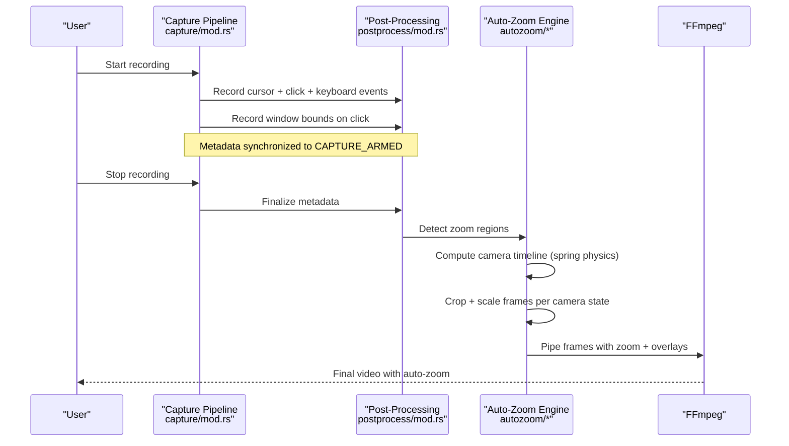

**Diagram sources**
- [mod.rs:110-158](file://src-tauri/src/capture/mod.rs#L110-L158)
- [mod.rs:169-190](file://src-tauri/src/postprocess/mod.rs#L169-L190)
- [detection.rs:11-44](file://src-tauri/src/autozoom/detection.rs#L11-L44)
- [camera.rs:161-202](file://src-tauri/src/autozoom/camera.rs#L161-L202)
- [renderer.rs:8-70](file://src-tauri/src/autozoom/renderer.rs#L8-L70)

## Detailed Component Analysis

### Auto-Zoom Heuristics Research
The research report consolidates industry best practices and competitive analysis:
- Primary trigger: mouse clicks (especially 2+ clicks within a 3-second window)
- Secondary trigger: cursor activity density and dwell time
- Tertiary trigger: active window focus and text input detection
- Rendering approach: post-processing crop+scale instead of FFmpeg zoompan
- Smoothing: spring-physics for cinematic transitions

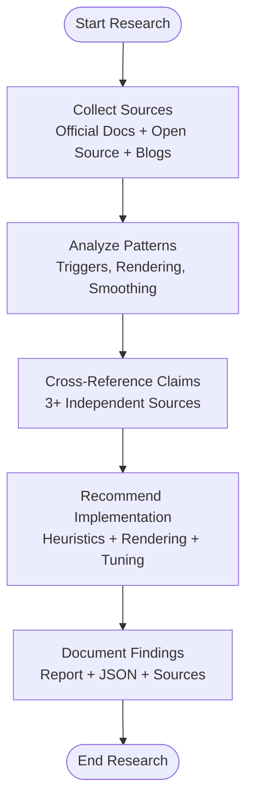

**Diagram sources**
- [index.html:19-41](file://research/auto-zoom-heuristics/index.html#L19-L41)
- [index.html:698-753](file://research/auto-zoom-heuristics/index.html#L698-L753)
- [findings.json:25-58](file://research/auto-zoom-heuristics/data/findings.json#L25-L58)

**Section sources**
- [index.html:28-126](file://research/auto-zoom-heuristics/index.html#L28-L126)
- [findings.json:1-60](file://research/auto-zoom-heuristics/data/findings.json#L1-L60)
- [index.html:19-94](file://research/auto-zoom-heuristics/sources.html#L19-L94)

### Auto-Zoom Detection Engine
The detection engine implements multiple signals:
- Click clusters: 2+ clicks within a time window and proximity threshold
- Window dwell: zoom to focused window bounds when user interacts
- Typing detection: subtle zoom to input area during sustained keyboard activity
- Circle gestures: closed cursor loops indicating deliberate focus
- Text selection: horizontal sweeps with button held

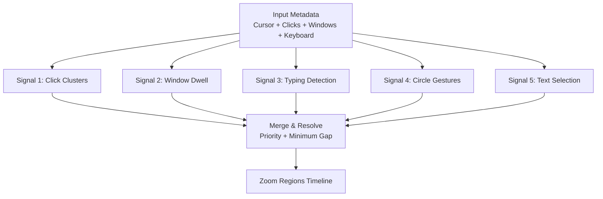

**Diagram sources**
- [detection.rs:11-44](file://src-tauri/src/autozoom/detection.rs#L11-L44)
- [detection.rs:46-130](file://src-tauri/src/autozoom/detection.rs#L46-L130)
- [detection.rs:132-220](file://src-tauri/src/autozoom/detection.rs#L132-L220)
- [detection.rs:222-314](file://src-tauri/src/autozoom/detection.rs#L222-L314)
- [detection.rs:316-412](file://src-tauri/src/autozoom/detection.rs#L316-L412)
- [detection.rs:414-459](file://src-tauri/src/autozoom/detection.rs#L414-L459)
- [detection.rs:461-497](file://src-tauri/src/autozoom/detection.rs#L461-L497)

**Section sources**
- [detection.rs:11-44](file://src-tauri/src/autozoom/detection.rs#L11-L44)
- [detection.rs:46-130](file://src-tauri/src/autozoom/detection.rs#L46-L130)
- [detection.rs:132-220](file://src-tauri/src/autozoom/detection.rs#L132-L220)
- [detection.rs:222-314](file://src-tauri/src/autozoom/detection.rs#L222-L314)
- [detection.rs:316-412](file://src-tauri/src/autozoom/detection.rs#L316-L412)
- [detection.rs:414-459](file://src-tauri/src/autozoom/detection.rs#L414-L459)
- [detection.rs:461-497](file://src-tauri/src/autozoom/detection.rs#L461-L497)

### Spring-Physics Camera Animation
The camera model uses a damped harmonic oscillator for smooth transitions:
- Separate damping parameters for zoom-in and zoom-out
- Per-frame stepping integrates position and zoom velocities
- Crop rectangles computed from camera state for rendering

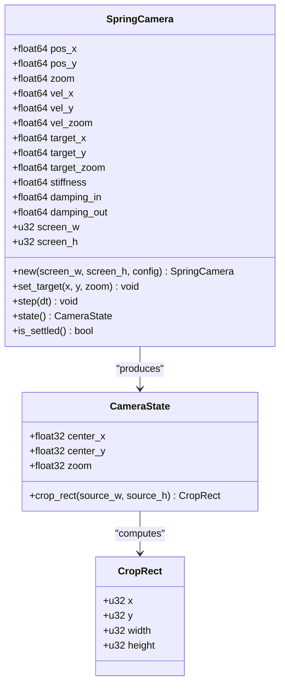

**Diagram sources**
- [camera.rs:46-159](file://src-tauri/src/autozoom/camera.rs#L46-L159)
- [camera.rs:8-44](file://src-tauri/src/autozoom/camera.rs#L8-L44)

**Section sources**
- [camera.rs:46-159](file://src-tauri/src/autozoom/camera.rs#L46-L159)
- [camera.rs:161-203](file://src-tauri/src/autozoom/camera.rs#L161-L203)

### Renderer Integration
The renderer performs crop and scale operations per frame:
- Bilinear interpolation for smooth scaling
- Coordinate transformations for overlays
- Integration with the existing post-processing pipeline

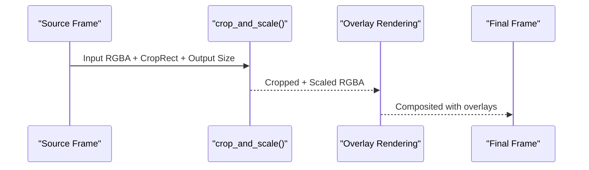

**Diagram sources**
- [renderer.rs:8-70](file://src-tauri/src/autozoom/renderer.rs#L8-L70)
- [renderer.rs:72-117](file://src-tauri/src/autozoom/renderer.rs#L72-L117)

**Section sources**
- [renderer.rs:8-70](file://src-tauri/src/autozoom/renderer.rs#L8-L70)
- [renderer.rs:72-117](file://src-tauri/src/autozoom/renderer.rs#L72-L117)

### Keyboard Hook Effectiveness Studies
The research report identifies three primary causes for keyboard overlay failures in games:
- User Interface Privilege Isolation (UIPI)
- Hardware-direct input bypass (Raw Input/DirectInput)
- Anti-cheat hook suppression

It proposes two actionable solutions:
- Run EasySpecy as Administrator
- Use Raw Input API in the Rust backend

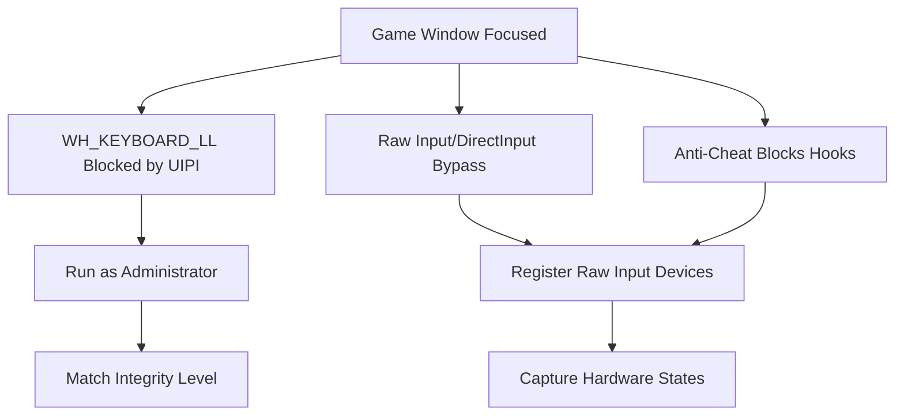

**Diagram sources**
- [index.html:43-88](file://research/keyboard-hook-game-capture_03_JUN_2026/index.html#L43-L88)

**Section sources**
- [index.html:43-88](file://research/keyboard-hook-game-capture_03_JUN_2026/index.html#L43-L88)

### Transparent Overlay Optimization Research
The research report details Tauri v2 overlay configuration for transparent, click-through windows:
- Configure window with decorations disabled, transparent, always-on-top, skip-taskbar, and visible=false initially
- Use set_ignore_cursor_events to pass mouse events to apps beneath
- Frontend CSS must set transparent backgrounds and pointer-events:none
- IPC architecture uses Tauri events for cursor and click data, and polling for keyboard

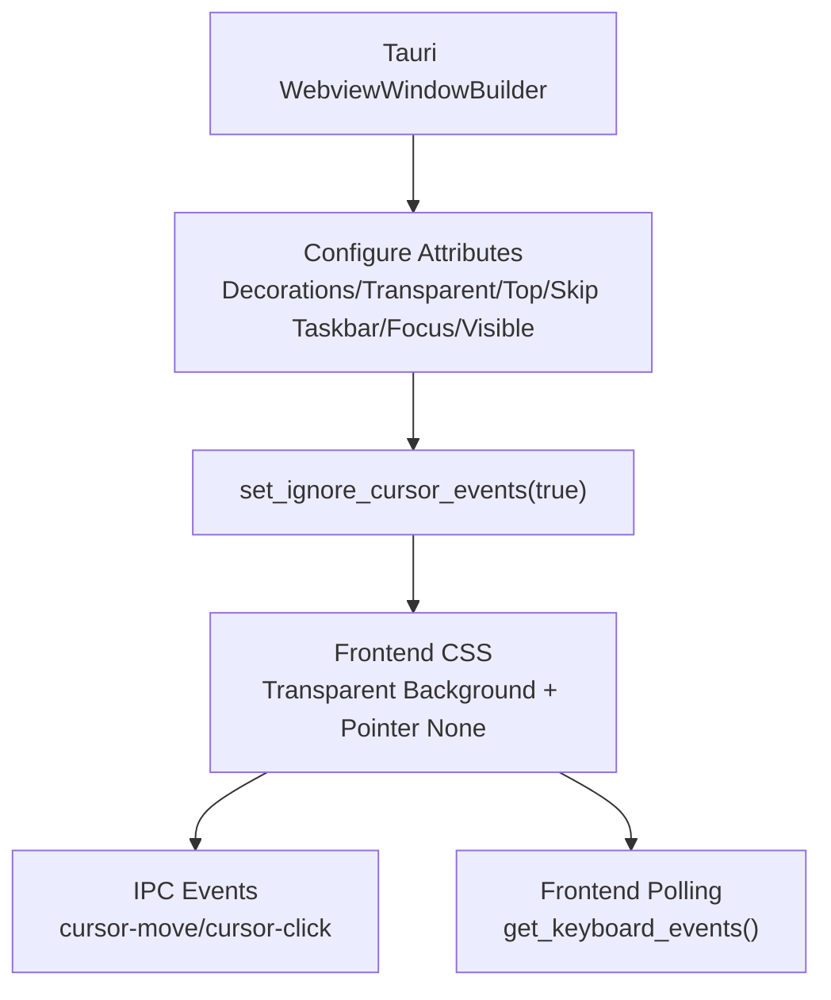

**Diagram sources**
- [index.html:208-289](file://research/tauri-transparent-overlay_03_JUN_2026/index.html#L208-L289)

**Section sources**
- [index.html:208-289](file://research/tauri-transparent-overlay_03_JUN_2026/index.html#L208-L289)

### Post-Processing Pipeline Integration
The capture pipeline synchronizes recording start across video, audio, and overlays. The post-processing module saves metadata and applies effects. The auto-zoom detection engine plugs in to produce zoom regions that are consumed by the camera animation and renderer.

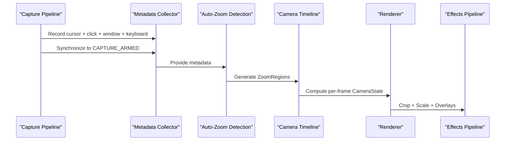

**Diagram sources**
- [mod.rs:110-158](file://src-tauri/src/capture/mod.rs#L110-L158)
- [mod.rs:169-190](file://src-tauri/src/postprocess/mod.rs#L169-L190)
- [detection.rs:11-44](file://src-tauri/src/autozoom/detection.rs#L11-L44)
- [camera.rs:161-202](file://src-tauri/src/autozoom/camera.rs#L161-L202)
- [renderer.rs:8-70](file://src-tauri/src/autozoom/renderer.rs#L8-L70)

**Section sources**
- [mod.rs:110-158](file://src-tauri/src/capture/mod.rs#L110-L158)
- [mod.rs:169-190](file://src-tauri/src/postprocess/mod.rs#L169-L190)
- [detection.rs:11-44](file://src-tauri/src/autozoom/detection.rs#L11-L44)
- [camera.rs:161-202](file://src-tauri/src/autozoom/camera.rs#L161-L202)
- [renderer.rs:8-70](file://src-tauri/src/autozoom/renderer.rs#L8-L70)

### Algorithm Evaluation Metrics and Validation
The testing suite validates detection logic using synthetic metadata:
- Click cluster detection with expected zoom centers and levels
- Typing detection with stationary cursor criteria
- Circle gesture detection with path length and bounding box constraints
- Conflict resolution ensuring no overlapping regions and minimum gaps
- Threshold validation for zoom level ranges

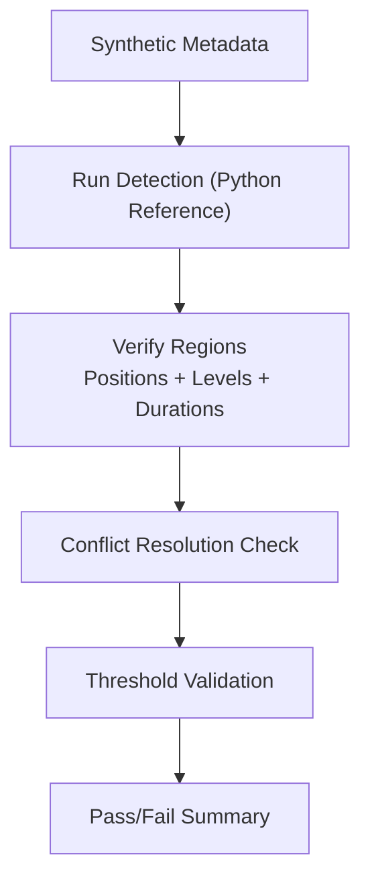

**Diagram sources**
- [test_autozoom.py:286-477](file://tests/test_autozoom.py#L286-L477)

**Section sources**
- [test_autozoom.py:137-230](file://tests/test_autozoom.py#L137-L230)
- [test_autozoom.py:286-477](file://tests/test_autozoom.py#L286-L477)

## Dependency Analysis
The auto-zoom module depends on the post-processing metadata and integrates with the capture pipeline. The keyboard capture module provides input data for both overlays and auto-zoom detection. The renderer depends on camera state and integrates with the existing overlay pipeline.

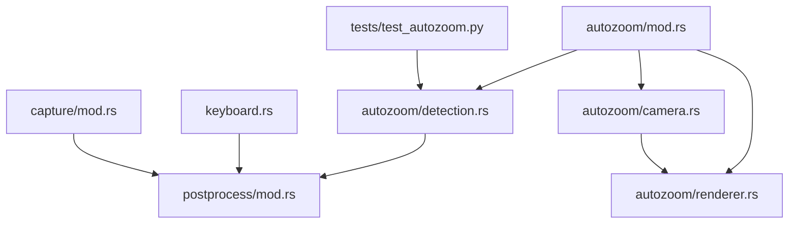

**Diagram sources**
- [mod.rs:1-101](file://src-tauri/src/autozoom/mod.rs#L1-L101)
- [detection.rs:1-497](file://src-tauri/src/autozoom/detection.rs#L1-L497)
- [camera.rs:1-203](file://src-tauri/src/autozoom/camera.rs#L1-L203)
- [renderer.rs:1-117](file://src-tauri/src/autozoom/renderer.rs#L1-L117)
- [mod.rs:1-800](file://src-tauri/src/postprocess/mod.rs#L1-L800)
- [keyboard.rs:1-395](file://src-tauri/src/keyboard.rs#L1-L395)
- [mod.rs:1-800](file://src-tauri/src/capture/mod.rs#L1-L800)
- [test_autozoom.py:1-482](file://tests/test_autozoom.py#L1-L482)

**Section sources**
- [mod.rs:1-101](file://src-tauri/src/autozoom/mod.rs#L1-L101)
- [detection.rs:1-497](file://src-tauri/src/autozoom/detection.rs#L1-L497)
- [camera.rs:1-203](file://src-tauri/src/autozoom/camera.rs#L1-L203)
- [renderer.rs:1-117](file://src-tauri/src/autozoom/renderer.rs#L1-L117)
- [mod.rs:1-800](file://src-tauri/src/postprocess/mod.rs#L1-L800)
- [keyboard.rs:1-395](file://src-tauri/src/keyboard.rs#L1-L395)
- [mod.rs:1-800](file://src-tauri/src/capture/mod.rs#L1-L800)
- [test_autozoom.py:1-482](file://tests/test_autozoom.py#L1-L482)

## Performance Considerations
- Rendering cost: Crop and scale per frame adds CPU overhead. The existing post-processing pipeline already renders frames; adding zoom incurs minimal marginal cost.
- Alternative approach: Offload crop+scale to FFmpeg via filter chains for dynamic per-region coordinates, leveraging optimized encoders.
- Parallelization: Rayon is already used for batch rendering; extending this to zoom computation maintains throughput.
- Memory: Metadata storage and camera state are lightweight; avoid unnecessary allocations in hot paths.

[No sources needed since this section provides general guidance]

## Troubleshooting Guide
- Keyboard overlay not capturing in games:
  - Cause: UIPI, Raw Input bypass, anti-cheat interference
  - Solution: Run as Administrator or switch to Raw Input API
- Transparent overlay flashing white on startup:
  - Cause: WebView2 default white background
  - Solution: Initialize with visible=false and show after capture is armed
- Auto-zoom not triggering:
  - Validate detection thresholds and sensitivity settings
  - Confirm metadata synchronization to CAPTURE_ARMED
  - Check conflict resolution and minimum gap enforcement

**Section sources**
- [index.html:43-88](file://research/keyboard-hook-game-capture_03_JUN_2026/index.html#L43-L88)
- [index.html:198-206](file://research/tauri-transparent-overlay_03_JUN_2026/index.html#L198-L206)
- [detection.rs:461-497](file://src-tauri/src/autozoom/detection.rs#L461-L497)

## Conclusion
EasySpecy’s research-driven approach combines competitive analysis, validated heuristics, and robust implementation. The auto-zoom feature leverages existing post-processing infrastructure, integrates seamlessly with the capture pipeline, and provides cinematic camera transitions through spring-physics smoothing. The keyboard overlay and transparent overlay optimizations address platform-specific challenges. The testing suite ensures detection accuracy and conflict resolution. The research methodology outlined here supports iterative experimentation, validation, and safe rollout of experimental features.

[No sources needed since this section summarizes without analyzing specific files]

## Appendices

### Research Methodology Guidelines
- Define research questions and success criteria
- Conduct systematic literature review across official docs, open-source repositories, and blogs
- Cross-reference claims across multiple sources
- Document methodology and source lists for reproducibility
- Translate findings into implementation recommendations with trade-offs

**Section sources**
- [index.html:19-94](file://research/auto-zoom-heuristics/sources.html#L19-L94)

### Data Collection and Analysis for User Interaction
- Record cursor trails, click events, window bounds, and keyboard events during capture
- Synchronize timestamps to CAPTURE_ARMED for alignment
- Store metadata alongside output videos for offline analysis
- Use statistical analysis to evaluate trigger sensitivity and false positive rates

**Section sources**
- [mod.rs:60-190](file://src-tauri/src/postprocess/mod.rs#L60-L190)
- [mod.rs:110-158](file://src-tauri/src/capture/mod.rs#L110-L158)

### Comparative Analysis Methods
- Benchmark against leading products (Screen Studio, Recordly, Screenize, Cap)
- Compare rendering approaches (custom pipeline vs. FFmpeg zoompan)
- Evaluate smoothing quality (linear vs. spring-physics)
- Measure user preference via controlled experiments

**Section sources**
- [index.html:127-223](file://research/auto-zoom-heuristics/index.html#L127-L223)
- [index.html:433-486](file://research/auto-zoom-heuristics/index.html#L433-L486)

### Research-to-Production Pipeline and Rollout
- Feature flags to enable/disable auto-zoom during development
- Staged rollouts: internal testing, select beta users, gradual expansion
- A/B testing to measure impact on engagement and perceived quality
- Post-release monitoring for performance regressions and user feedback

[No sources needed since this section provides general guidance]