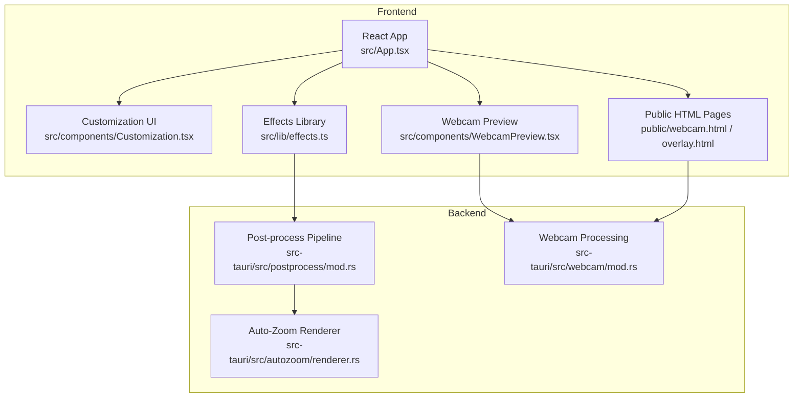
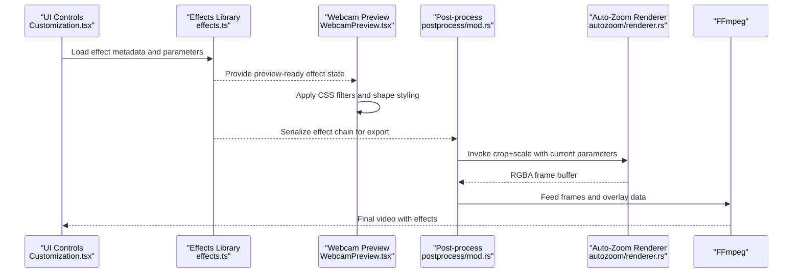
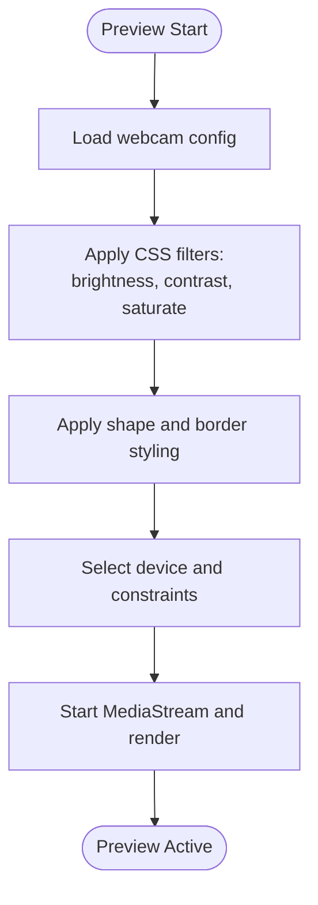
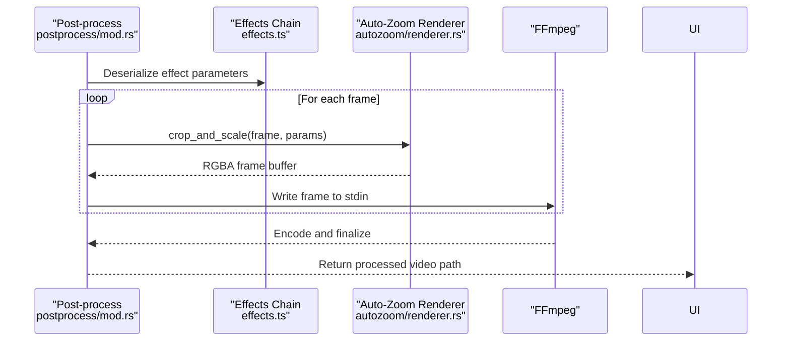
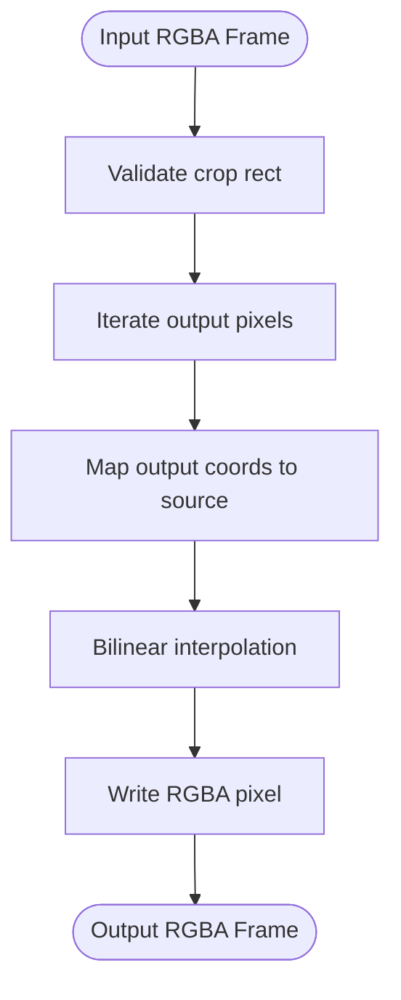
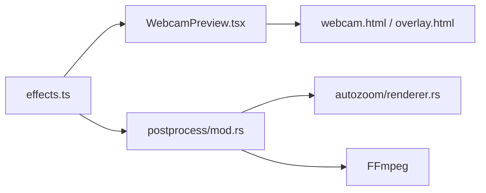

# Visual Effects Development

<cite>
**Referenced Files in This Document**
- [README.md](file://README.md)
- [src/lib/effects.ts](file://src/lib/effects.ts)
- [src/components/WebcamPreview.tsx](file://src/components/WebcamPreview.tsx)
- [public/webcam.html](file://public/webcam.html)
- [public/overlay.html](file://public/overlay.html)
- [src-tauri/src/postprocess/mod.rs](file://src-tauri/src/postprocess/mod.rs)
- [src-tauri/src/autozoom/renderer.rs](file://src-tauri/src/autozoom/renderer.rs)
- [.kiro/specs/auto-zoom/requirements.md](file://.kiro/specs/auto-zoom/requirements.md)
- [src-tauri/src/webcam/mod.rs](file://src-tauri/src/webcam/mod.rs)
- [src/stores/recording.ts](file://src/stores/recording.ts)
</cite>

## Table of Contents
1. [Introduction](#introduction)
2. [Project Structure](#project-structure)
3. [Core Components](#core-components)
4. [Architecture Overview](#architecture-overview)
5. [Detailed Component Analysis](#detailed-component-analysis)
6. [Dependency Analysis](#dependency-analysis)
7. [Performance Considerations](#performance-considerations)
8. [Troubleshooting Guide](#troubleshooting-guide)
9. [Conclusion](#conclusion)
10. [Appendices](#appendices)

## Introduction
This document explains how to develop custom visual effects in EasySpecy’s canvas-based rendering system. It covers the effect pipeline architecture, animation and composition frameworks, metadata and parameterization, runtime management, and best practices for performance, memory, and cross-platform compatibility. It also provides step-by-step guides for creating new effects, modifying existing ones, integrating custom shaders, building a customization interface, enabling real-time previews, and chaining effects. Finally, it includes implementation patterns and troubleshooting guidance for common rendering issues.

## Project Structure
EasySpecy is a Tauri + React application with a Rust backend responsible for media processing and a frontend for UI and previews. Effects are integrated into two primary paths:
- Real-time webcam preview and overlay rendering in the browser
- Post-processing pipeline for recorded content using FFmpeg

Key areas relevant to effects:
- Frontend effects and customization: src/lib/effects.ts, src/components/WebcamPreview.tsx, public/*.html
- Backend post-processing and overlays: src-tauri/src/postprocess/mod.rs, src-tauri/src/webcam/mod.rs
- Auto-zoom cropping/scale renderer (example effect): src-tauri/src/autozoom/renderer.rs
- Effect requirements and acceptance criteria: .kiro/specs/auto-zoom/requirements.md

**Diagram sources**
- [src/lib/effects.ts](file://src/lib/effects.ts)
- [src/components/WebcamPreview.tsx](file://src/components/WebcamPreview.tsx)
- [public/webcam.html](file://public/webcam.html)
- [public/overlay.html](file://public/overlay.html)
- [src-tauri/src/postprocess/mod.rs](file://src-tauri/src/postprocess/mod.rs)
- [src-tauri/src/autozoom/renderer.rs](file://src-tauri/src/autozoom/renderer.rs)
- [src-tauri/src/webcam/mod.rs](file://src-tauri/src/webcam/mod.rs)

**Section sources**
- [README.md](file://README.md)
- [src/lib/effects.ts](file://src/lib/effects.ts)
- [src/components/WebcamPreview.tsx](file://src/components/WebcamPreview.tsx)
- [public/webcam.html](file://public/webcam.html)
- [public/overlay.html](file://public/overlay.html)
- [src-tauri/src/postprocess/mod.rs](file://src-tauri/src/postprocess/mod.rs)
- [src-tauri/src/autozoom/renderer.rs](file://src-tauri/src/autozoom/renderer.rs)
- [src-tauri/src/webcam/mod.rs](file://src-tauri/src/webcam/mod.rs)

## Core Components
- Effects library (frontend): Defines effect metadata, parameter schemas, and composition helpers used during preview and export.
- Webcam preview and overlay: Applies real-time adjustments (brightness, contrast, sharpen) and shape/border styling to the webcam feed.
- Post-processing pipeline: Renders recorded content with effects, compositing overlays and cursor trails, and encoding with FFmpeg.
- Auto-zoom renderer: Demonstrates a concrete effect that crops and scales frames with bilinear interpolation and integrates with the post-processing pipeline.

Key responsibilities:
- Parameter serialization and deserialization for effects
- Runtime effect management (enable/disable, chain order, per-frame updates)
- Cross-stage compatibility (browser vs. native post-processing)
- Performance-aware composition (batching, interpolation modes, GPU-friendly filters)

**Section sources**
- [src/lib/effects.ts](file://src/lib/effects.ts)
- [src-tauri/src/postprocess/mod.rs](file://src-tauri/src/postprocess/mod.rs)
- [src-tauri/src/autozoom/renderer.rs](file://src-tauri/src/autozoom/renderer.rs)
- [src-tauri/src/webcam/mod.rs](file://src-tauri/src/webcam/mod.rs)

## Architecture Overview
The effect pipeline operates across three stages:
1) Real-time preview (browser): Applies CSS-based filters and shape styling to the webcam stream.
2) Backend processing (Rust): Performs image ops and compositing for recorded content.
3) Export pipeline (FFmpeg): Encodes final video with overlays and effects composited.

**Diagram sources**
- [src/lib/effects.ts](file://src/lib/effects.ts)
- [src/components/WebcamPreview.tsx](file://src/components/WebcamPreview.tsx)
- [src-tauri/src/postprocess/mod.rs](file://src-tauri/src/postprocess/mod.rs)
- [src-tauri/src/autozoom/renderer.rs](file://src-tauri/src/autozoom/renderer.rs)

## Detailed Component Analysis

### Effects Library (Frontend)
The effects library centralizes effect metadata, parameter schemas, and composition helpers. It enables:
- Declaring effect types and their parameters
- Serializing/deserializing effect state for persistence and transport
- Composing multiple effects into a single pass or chained pipeline
- Providing hooks for real-time preview updates

Implementation highlights:
- Effect metadata defines parameter names, types, ranges, defaults, and UI hints.
- Composition helpers compute derived parameters and validate inputs.
- Serialization ensures cross-platform compatibility and deterministic exports.

Best practices:
- Keep parameter ranges validated at load time.
- Normalize parameter units to avoid ambiguity across preview/export.
- Prefer additive transforms (e.g., offsets) over multiplicative ones when possible to simplify chaining.

**Section sources**
- [src/lib/effects.ts](file://src/lib/effects.ts)

### Webcam Preview and Overlay (Browser)
Real-time webcam effects are applied via CSS filters and DOM styling:
- Brightness and contrast adjustments use percentage-based CSS filters.
- Sharpening is approximated using saturation and blur-like effects.
- Shape and border styling are applied via border-radius and borders.
- Device selection and constraints are handled dynamically.

Integration points:
- UI controls update CSS filter properties in real time.
- Overlay page applies similar transformations for picture-in-picture mode.

**Diagram sources**
- [public/webcam.html](file://public/webcam.html)
- [public/overlay.html](file://public/overlay.html)
- [src/components/WebcamPreview.tsx](file://src/components/WebcamPreview.tsx)

**Section sources**
- [public/webcam.html](file://public/webcam.html)
- [public/overlay.html](file://public/overlay.html)
- [src/components/WebcamPreview.tsx](file://src/components/WebcamPreview.tsx)

### Post-Processing Pipeline (Rust)
The backend pipeline renders recorded content with effects:
- Reads raw RGBA frames and applies cursor trails and overlays.
- Composites effects using FFmpeg with overlay filters.
- Writes frames to FFmpeg stdin in sequential order and waits for completion.
- Handles platform-specific process creation flags.

Effect integration:
- Effects are serialized from the frontend effects library.
- The pipeline invokes effect renderers (e.g., auto-zoom crop+scale) per frame.
- Cursor trails and click effects are drawn directly onto frames.

**Diagram sources**
- [src-tauri/src/postprocess/mod.rs](file://src-tauri/src/postprocess/mod.rs)
- [src-tauri/src/autozoom/renderer.rs](file://src-tauri/src/autozoom/renderer.rs)
- [src/lib/effects.ts](file://src/lib/effects.ts)

**Section sources**
- [src-tauri/src/postprocess/mod.rs](file://src-tauri/src/postprocess/mod.rs)
- [src-tauri/src/autozoom/renderer.rs](file://src-tauri/src/autozoom/renderer.rs)
- [src/lib/effects.ts](file://src/lib/effects.ts)

### Auto-Zoom Renderer (Example Effect)
The auto-zoom renderer demonstrates a concrete effect:
- Crops a region from an RGBA frame buffer.
- Scales to output size using bilinear interpolation.
- Transforms cursor trail coordinates to viewport space.
- Integrates with the post-processing pipeline.

**Diagram sources**
- [src-tauri/src/autozoom/renderer.rs](file://src-tauri/src/autozoom/renderer.rs)

**Section sources**
- [src-tauri/src/autozoom/renderer.rs](file://src-tauri/src/autozoom/renderer.rs)
- [.kiro/specs/auto-zoom/requirements.md](file://.kiro/specs/auto-zoom/requirements.md)

### Webcam Image Ops (Brightness, Contrast, Sharpen)
The webcam module applies image operations to enhance quality:
- Brightness adjustment via pixel offset.
- Contrast adjustment via scaling around mid-gray.
- Sharpen via unsharpen mask with configurable sigma and threshold.
- Resizing to square with triangle filter.

These ops are applied before overlay composition and can be tuned via configuration.

**Section sources**
- [src-tauri/src/webcam/mod.rs](file://src-tauri/src/webcam/mod.rs)

## Dependency Analysis
Effects depend on:
- Frontend effects library for metadata and serialization
- Browser preview for real-time parameter feedback
- Backend post-processing for export-time rendering
- Auto-zoom renderer as a concrete effect example

**Diagram sources**
- [src/lib/effects.ts](file://src/lib/effects.ts)
- [src/components/WebcamPreview.tsx](file://src/components/WebcamPreview.tsx)
- [public/webcam.html](file://public/webcam.html)
- [public/overlay.html](file://public/overlay.html)
- [src-tauri/src/postprocess/mod.rs](file://src-tauri/src/postprocess/mod.rs)
- [src-tauri/src/autozoom/renderer.rs](file://src-tauri/src/autozoom/renderer.rs)

**Section sources**
- [src/lib/effects.ts](file://src/lib/effects.ts)
- [src/components/WebcamPreview.tsx](file://src/components/WebcamPreview.tsx)
- [public/webcam.html](file://public/webcam.html)
- [public/overlay.html](file://public/overlay.html)
- [src-tauri/src/postprocess/mod.rs](file://src-tauri/src/postprocess/mod.rs)
- [src-tauri/src/autozoom/renderer.rs](file://src-tauri/src/autozoom/renderer.rs)

## Performance Considerations
- Interpolation modes: Prefer bilinear for speed; switch to higher-quality modes only when necessary.
- Batch processing: Process frames in batches to utilize CPU parallelism while maintaining output order.
- Filter stacking: Minimize redundant CSS filters; combine where possible to reduce passes.
- Memory: Reuse buffers and avoid unnecessary allocations; clamp small regions to prevent degenerate scaling.
- Encoding: Tune FFmpeg presets and threads for balance between speed and quality.
- Cross-platform: Account for differences in process creation flags and threading models.

[No sources needed since this section provides general guidance]

## Troubleshooting Guide
Common issues and resolutions:
- Degenerate scaling: Clamp crop dimensions to a minimum size to avoid artifacts.
- Incorrect cursor trail coordinates: Transform coordinates by viewport origin and scale ratios.
- FFmpeg failures: Inspect stderr logs and remove temporary directories on failure.
- Preview mismatch: Ensure parameter normalization and unit conversions are consistent between preview and export.
- Device constraints: Validate device indices and fallback to default when invalid.

**Section sources**
- [.kiro/specs/auto-zoom/requirements.md](file://.kiro/specs/auto-zoom/requirements.md)
- [src-tauri/src/postprocess/mod.rs](file://src-tauri/src/postprocess/mod.rs)
- [src-tauri/src/webcam/mod.rs](file://src-tauri/src/webcam/mod.rs)

## Conclusion
EasySpecy’s visual effects system combines a flexible frontend effects library with robust backend post-processing and FFmpeg-based export. By structuring effects around metadata and parameter schemas, and by integrating real-time previews with export-time rendering, developers can create, customize, and chain effects efficiently. Following the best practices and troubleshooting steps outlined here will help ensure high performance, correctness, and cross-platform compatibility.

[No sources needed since this section summarizes without analyzing specific files]

## Appendices

### Step-by-Step: Creating a New Effect Type
1. Define effect metadata and parameters in the effects library.
2. Add UI controls to expose parameters in the customization panel.
3. Implement a preview renderer that applies the effect in the browser.
4. Implement a backend renderer that performs the same operation on frames.
5. Integrate the effect into the post-processing pipeline and FFmpeg compositing.
6. Test real-time preview and export with representative inputs.

**Section sources**
- [src/lib/effects.ts](file://src/lib/effects.ts)
- [src/components/WebcamPreview.tsx](file://src/components/WebcamPreview.tsx)
- [src-tauri/src/postprocess/mod.rs](file://src-tauri/src/postprocess/mod.rs)

### Step-by-Step: Modifying Existing Effects
1. Update effect metadata and parameter ranges.
2. Adjust preview renderer to reflect new behavior.
3. Modify backend renderer to maintain parity with preview.
4. Verify export pipeline still composes correctly.
5. Run regression tests on recorded content.

**Section sources**
- [src/lib/effects.ts](file://src/lib/effects.ts)
- [src-tauri/src/postprocess/mod.rs](file://src-tauri/src/postprocess/mod.rs)

### Step-by-Step: Integrating Custom Shaders
1. Choose a shader model (e.g., WebGL, GPUImage-style).
2. Implement a shader program that accepts effect parameters as uniforms.
3. Render to texture or in-place depending on chaining needs.
4. Expose parameters through the effects library and UI.
5. Integrate shader-based rendering into the preview and export paths.
6. Profile performance and optimize draw calls and uniform updates.

[No sources needed since this section provides general guidance]

### Effect Customization Interface
- Expose sliders, toggles, and color pickers mapped to effect parameters.
- Persist user preferences and restore on app restart.
- Provide live preview updates without re-encoding.

**Section sources**
- [src/lib/effects.ts](file://src/lib/effects.ts)
- [src/components/WebcamPreview.tsx](file://src/components/WebcamPreview.tsx)
- [public/webcam.html](file://public/webcam.html)
- [public/overlay.html](file://public/overlay.html)

### Real-Time Preview Systems
- Use CSS filters for quick feedback on brightness, contrast, and sharpen.
- For GPU-intensive effects, consider WebGL-based preview with parameter-driven uniforms.
- Keep preview and export parameter spaces aligned to avoid drift.

**Section sources**
- [public/webcam.html](file://public/webcam.html)
- [public/overlay.html](file://public/overlay.html)
- [src/components/WebcamPreview.tsx](file://src/components/WebcamPreview.tsx)

### Effect Chaining Mechanisms
- Compose effects in order, passing intermediate RGBA buffers between stages.
- Ensure coordinate transforms are applied consistently across chained effects.
- Serialize effect chains to preserve behavior across sessions.

**Section sources**
- [src/lib/effects.ts](file://src/lib/effects.ts)
- [src-tauri/src/postprocess/mod.rs](file://src-tauri/src/postprocess/mod.rs)

### Implementation Patterns
- Parameter normalization: Convert UI units to internal units and clamp ranges.
- Preview parity: Mirror backend logic in the preview to minimize divergence.
- Batch rendering: Use parallel processing for CPU-bound effects; maintain output ordering.

**Section sources**
- [src/lib/effects.ts](file://src/lib/effects.ts)
- [src-tauri/src/postprocess/mod.rs](file://src-tauri/src/postprocess/mod.rs)