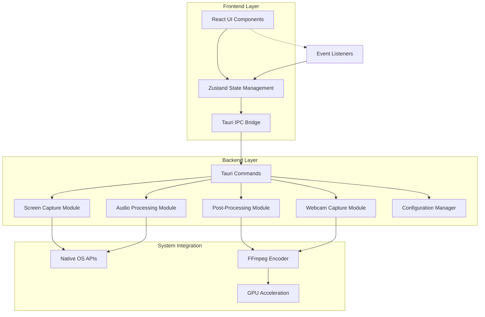
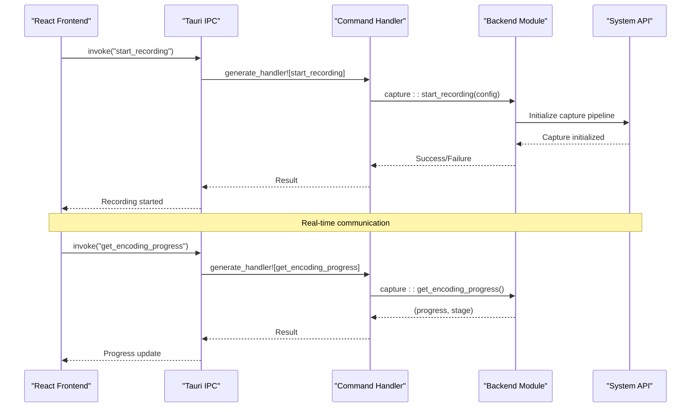
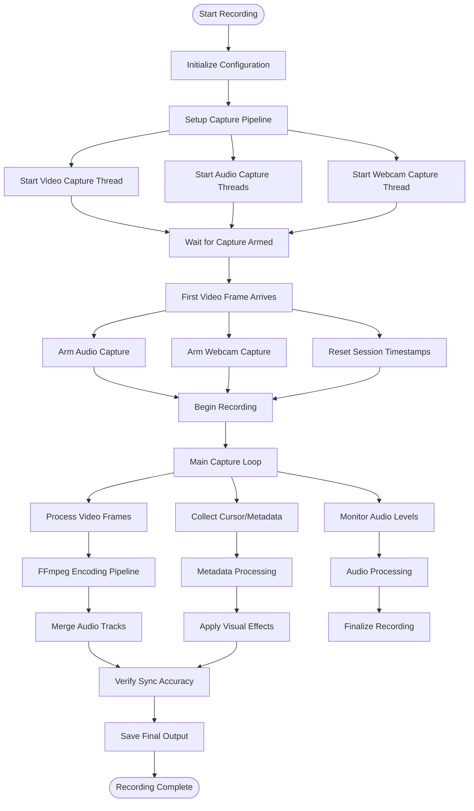
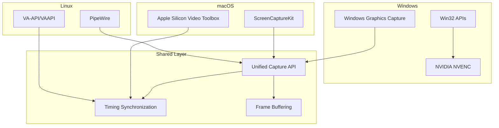
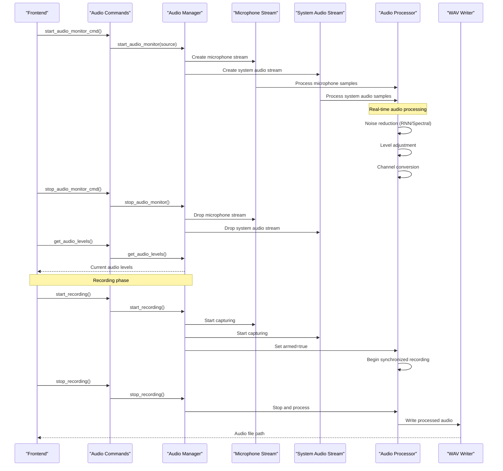
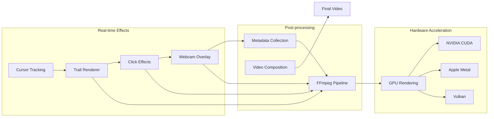
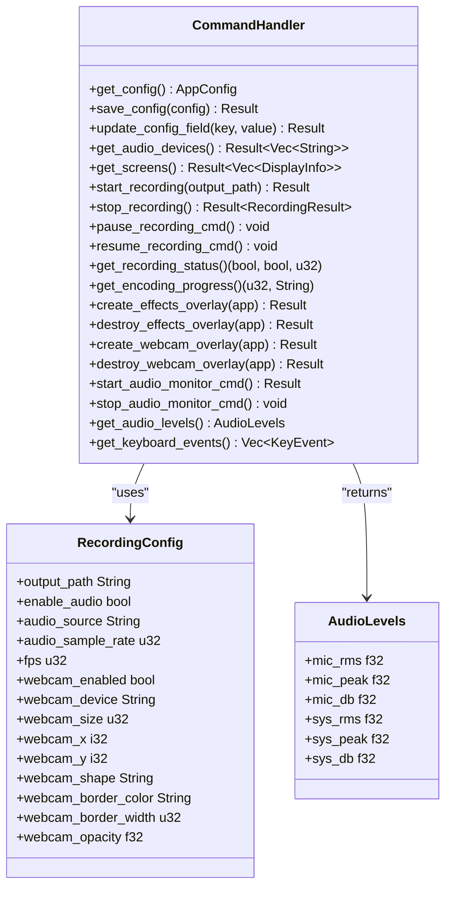
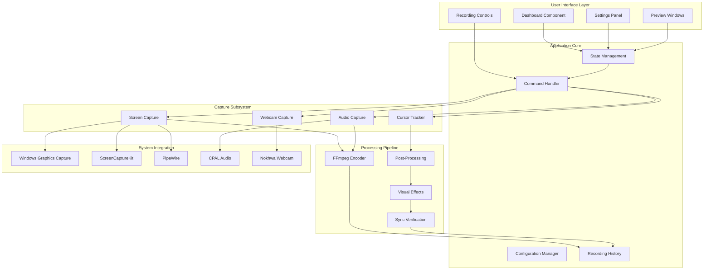
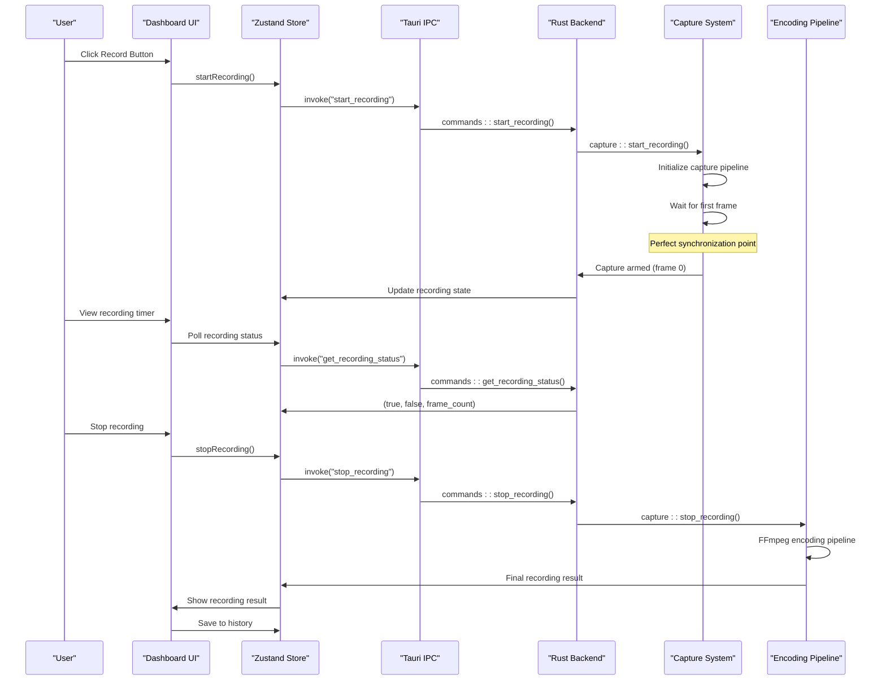

# Architecture Overview

<cite>
**Referenced Files in This Document**
- [Cargo.toml](file://src-tauri/Cargo.toml)
- [tauri.conf.json](file://src-tauri/tauri.conf.json)
- [lib.rs](file://src-tauri/src/lib.rs)
- [main.rs](file://src-tauri/src/main.rs)
- [mod.rs](file://src-tauri/src/commands/mod.rs)
- [mod.rs](file://src-tauri/src/capture/mod.rs)
- [mod.rs](file://src-tauri/src/audio/mod.rs)
- [mod.rs](file://src-tauri/src/config/mod.rs)
- [mod.rs](file://src-tauri/src/postprocess/mod.rs)
- [mod.rs](file://src-tauri/src/webcam/mod.rs)
- [mod.rs](file://src-tauri/src/autozoom/mod.rs)
- [App.tsx](file://src/App.tsx)
- [main.tsx](file://src/main.tsx)
- [Dashboard.tsx](file://src/components/Dashboard.tsx)
- [recording.ts](file://src/stores/recording.ts)
- [README.md](file://README.md)
</cite>

## Table of Contents
1. [Introduction](#introduction)
2. [System Architecture](#system-architecture)
3. [Technology Stack](#technology-stack)
4. [IPC Communication Pattern](#ipc-communication-pattern)
5. [Recording Pipeline](#recording-pipeline)
6. [Cross-Platform Capture Implementation](#cross-platform-capture-implementation)
7. [Audio Processing Architecture](#audio-processing-architecture)
8. [Visual Effects Rendering](#visual-effects-rendering)
9. [Command System Design](#command-system-design)
10. [Performance and Synchronization](#performance-and-synchronization)
11. [System Context Diagrams](#system-context-diagrams)
12. [Conclusion](#conclusion)

## Introduction

EasySpecy is a cross-platform screen recording application built with Tauri 2 that seamlessly integrates a React frontend with a Rust backend. The application provides professional-grade screen recording capabilities with advanced features including auto-zoom, cursor effects, webcam overlays, and cinematic visual enhancements. The architecture follows a hybrid desktop design pattern where the frontend handles user interface and user interactions, while the Rust backend manages system-level operations, native OS integrations, and performance-critical processing.

The application targets Windows, macOS, and Linux platforms, leveraging native APIs for optimal performance while maintaining cross-platform compatibility through Tauri's framework. The system is designed around strict synchronization principles to ensure perfect video-audio synchronization and minimal latency throughout the recording pipeline.

## System Architecture

EasySpecy employs a clean separation between frontend and backend components, utilizing Tauri's IPC (Inter-Process Communication) mechanism for seamless interaction. The architecture follows a layered design pattern with clear boundaries between presentation, business logic, and system integration layers.

**Diagram sources**
- [lib.rs:75-125](file://src-tauri/src/lib.rs#L75-L125)
- [mod.rs:11-117](file://src-tauri/src/commands/mod.rs#L11-L117)

The architecture ensures loose coupling between components while maintaining high cohesion within functional modules. Each module has well-defined responsibilities and communicates through explicit interfaces, enabling maintainability and extensibility.

**Section sources**
- [lib.rs:37-125](file://src-tauri/src/lib.rs#L37-L125)
- [tauri.conf.json:1-48](file://src-tauri/tauri.conf.json#L1-L48)

## Technology Stack

The technology stack is carefully selected to balance performance, cross-platform compatibility, and development efficiency:

### Core Framework
- **Tauri 2**: Provides native application framework with minimal overhead (~3MB bundle size)
- **React 19**: Modern frontend framework with concurrent features and improved performance
- **TypeScript**: Type safety and enhanced developer experience
- **Tailwind CSS**: Utility-first styling framework for rapid UI development

### Backend Technologies
- **Rust**: Memory-safe systems programming language for performance-critical operations
- **CPAL**: Cross-platform audio I/O library for audio capture and playback
- **FFmpeg**: Industry-standard multimedia framework for encoding and processing
- **Rayon**: Parallel processing library for CPU-intensive tasks

### Platform-Specific Integrations
- **Windows**: Windows Graphics Capture API for efficient screen capture
- **macOS**: ScreenCaptureKit for modern screen recording capabilities
- **Linux**: PipeWire for standardized multimedia capture
- **Nokhwa**: Cross-platform webcam capture library

### Additional Libraries
- **Serde**: Serialization framework for configuration and data exchange
- **Tracing**: Structured logging and observability
- **Dirs**: Cross-platform configuration and data directory management

**Section sources**
- [Cargo.toml:26-61](file://src-tauri/Cargo.toml#L26-L61)
- [README.md:17-25](file://README.md#L17-L25)

## IPC Communication Pattern

The IPC communication follows Tauri's command-based architecture, providing type-safe bidirectional communication between frontend and backend. The system uses a centralized command handler that routes requests to appropriate backend modules.

**Diagram sources**
- [mod.rs:216-311](file://src-tauri/src/commands/mod.rs#L216-L311)
- [mod.rs:502-714](file://src-tauri/src/capture/mod.rs#L502-L714)

The IPC pattern supports both synchronous and asynchronous operations, with proper error handling and timeout mechanisms. Commands are strongly typed using Serde serialization, ensuring compile-time safety and runtime reliability.

**Section sources**
- [mod.rs:11-117](file://src-tauri/src/commands/mod.rs#L11-L117)
- [lib.rs:75-125](file://src-tauri/src/lib.rs#L75-L125)

## Recording Pipeline

The recording pipeline implements a sophisticated multi-stage process that ensures perfect synchronization between video, audio, and metadata capture. The pipeline follows a producer-consumer pattern with strict timing guarantees.

**Diagram sources**
- [mod.rs:160-404](file://src-tauri/src/capture/mod.rs#L160-L404)
- [mod.rs:225-553](file://src-tauri/src/audio/mod.rs#L225-L553)
- [mod.rs:76-181](file://src-tauri/src/postprocess/mod.rs#L76-L181)

The pipeline ensures that all components start simultaneously within 1ms of each other, using atomic flags and synchronization primitives to coordinate the capture threads. This design eliminates audio-video drift and provides consistent timing across all recording sessions.

**Section sources**
- [mod.rs:1-12](file://src-tauri/src/capture/mod.rs#L1-L12)
- [mod.rs:160-404](file://src-tauri/src/capture/mod.rs#L160-L404)

## Cross-Platform Capture Implementation

The capture implementation leverages platform-specific APIs optimized for each operating system while maintaining a unified interface through Rust traits and conditional compilation.

**Diagram sources**
- [Cargo.toml:52-61](file://src-tauri/Cargo.toml#L52-L61)
- [mod.rs:19-30](file://src-tauri/src/capture/mod.rs#L19-L30)

Each platform implementation provides optimized capture performance while maintaining identical behavior for the higher-level application logic. The Windows implementation uses the modern Graphics Capture API for efficient screen capture, macOS leverages ScreenCaptureKit for system-integrated recording, and Linux utilizes PipeWire for standardized multimedia capture.

**Section sources**
- [Cargo.toml:52-61](file://src-tauri/Cargo.toml#L52-L61)
- [mod.rs:1-12](file://src-tauri/src/capture/mod.rs#L1-L12)

## Audio Processing Architecture

The audio processing system implements a sophisticated multi-threaded architecture that captures, processes, and synchronizes audio streams with video capture. The system supports both microphone and system audio capture with advanced noise reduction capabilities.

**Diagram sources**
- [mod.rs:82-187](file://src-tauri/src/audio/mod.rs#L82-L187)
- [mod.rs:225-553](file://src-tauri/src/audio/mod.rs#L225-L553)

The audio system implements advanced noise reduction algorithms including RNN-based denoising, spectral subtraction, and adaptive noise gating. The processing maintains real-time performance while providing high-quality audio output suitable for professional recording scenarios.

**Section sources**
- [mod.rs:1-14](file://src-tauri/src/audio/mod.rs#L1-L14)
- [mod.rs:82-187](file://src-tauri/src/audio/mod.rs#L82-L187)

## Visual Effects Rendering

The visual effects system provides real-time cursor trails, click animations, and webcam overlays through a combination of hardware-accelerated rendering and FFmpeg-based post-processing. The system maintains smooth 60fps performance while delivering cinematic visual enhancements.

**Diagram sources**
- [mod.rs:76-181](file://src-tauri/src/postprocess/mod.rs#L76-L181)
- [mod.rs:38-101](file://src-tauri/src/webcam/mod.rs#L38-L101)

The effects system uses a hybrid approach where real-time cursor tracking and basic effects are handled by the Rust backend, while complex post-processing and final composition utilize FFmpeg with GPU acceleration. This design ensures responsive user feedback during recording while maintaining high-quality output.

**Section sources**
- [mod.rs:1-8](file://src-tauri/src/postprocess/mod.rs#L1-L8)
- [mod.rs:1-14](file://src-tauri/src/webcam/mod.rs#L1-L14)

## Command System Design

The command system serves as the central interface between the frontend and backend, implementing a comprehensive set of operations for recording control, configuration management, and system integration. The system uses Tauri's derive macros for automatic serialization and deserialization.

**Diagram sources**
- [mod.rs:11-117](file://src-tauri/src/commands/mod.rs#L11-L117)
- [mod.rs:40-57](file://src-tauri/src/commands/mod.rs#L40-L57)

The command system provides comprehensive coverage of all application functionality, from basic configuration management to complex recording orchestration. Each command is designed with proper error handling and follows consistent naming conventions for maintainability.

**Section sources**
- [mod.rs:1-690](file://src-tauri/src/commands/mod.rs#L1-L690)

## Performance and Synchronization

The system implements several advanced synchronization mechanisms to ensure perfect timing between all recording components. The architecture prioritizes real-time performance while maintaining high-quality output through careful resource management and optimization strategies.

### Synchronization Mechanisms

The core synchronization relies on atomic flags and coordinated startup sequences:

1. **Capture Armed Gate**: All capture components wait for the first video frame before starting
2. **Audio Arming**: Audio capture begins simultaneously with video at frame 0
3. **Webcam Synchronization**: Webcam capture aligns with video and audio timing
4. **Metadata Collection**: Cursor and click events are timestamped relative to capture start

### Performance Optimizations

- **Producer-Consumer Patterns**: Asynchronous processing separates capture from I/O operations
- **Parallel Processing**: Rayon enables multi-core utilization for CPU-intensive tasks
- **Memory Management**: Efficient buffer reuse and minimal allocations
- **GPU Acceleration**: Hardware-accelerated encoding reduces CPU load
- **Lazy Initialization**: Components initialize only when needed

### Timing Guarantees

The system maintains sub-millisecond synchronization accuracy between video, audio, and metadata streams. This precision is achieved through:

- Atomic flag coordination for component startup
- Precise timestamping at capture initiation
- Consistent frame rate handling across all components
- Real-time progress reporting during encoding

**Section sources**
- [mod.rs:105-158](file://src-tauri/src/capture/mod.rs#L105-L158)
- [mod.rs:373-381](file://src-tauri/src/audio/mod.rs#L373-L381)

## System Context Diagrams

The following diagrams illustrate the complete system context showing relationships between all major components and external dependencies.

### Complete System Architecture

**Diagram sources**
- [Dashboard.tsx:218-573](file://src/components/Dashboard.tsx#L218-L573)
- [recording.ts:176-403](file://src/stores/recording.ts#L176-L403)
- [mod.rs:11-117](file://src-tauri/src/commands/mod.rs#L11-L117)

### Recording Workflow Context

**Diagram sources**
- [Dashboard.tsx:283-336](file://src/components/Dashboard.tsx#L283-L336)
- [recording.ts:283-336](file://src/stores/recording.ts#L283-L336)
- [mod.rs:326-370](file://src-tauri/src/commands/mod.rs#L326-L370)

These diagrams demonstrate the complete flow from user interaction through the entire recording and encoding process, highlighting the coordination between frontend state management and backend processing capabilities.

**Section sources**
- [Dashboard.tsx:218-573](file://src/components/Dashboard.tsx#L218-L573)
- [recording.ts:176-403](file://src/stores/recording.ts#L176-L403)

## Conclusion

EasySpecy represents a sophisticated hybrid desktop application that successfully balances performance, features, and cross-platform compatibility. The architecture demonstrates excellent separation of concerns with clear boundaries between frontend presentation and backend processing, while leveraging native OS capabilities for optimal performance.

Key architectural strengths include:

- **Clean Separation**: Well-defined boundaries between frontend React components and Rust backend modules
- **Synchronization Excellence**: Advanced timing mechanisms ensure perfect video-audio synchronization
- **Cross-Platform Design**: Platform-specific optimizations while maintaining unified interfaces
- **Performance Focus**: Multi-threaded architecture with GPU acceleration and efficient resource management
- **Extensibility**: Modular design allows for easy addition of new features and platforms

The system achieves native performance characteristics typical of desktop applications while maintaining the development efficiency and distribution advantages of cross-platform solutions. The comprehensive IPC system, robust error handling, and thoughtful synchronization mechanisms position EasySpecy as a professional-grade screen recording solution suitable for demanding use cases.

Future enhancements could focus on expanding platform support, adding advanced editing capabilities, and further optimizing the encoding pipeline for specific use cases and hardware configurations.