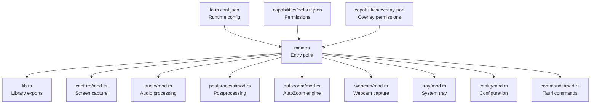
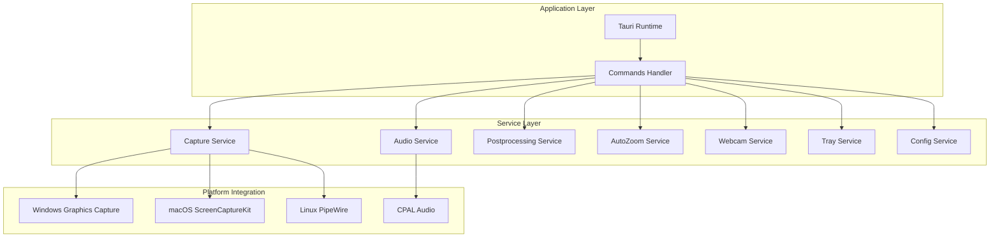
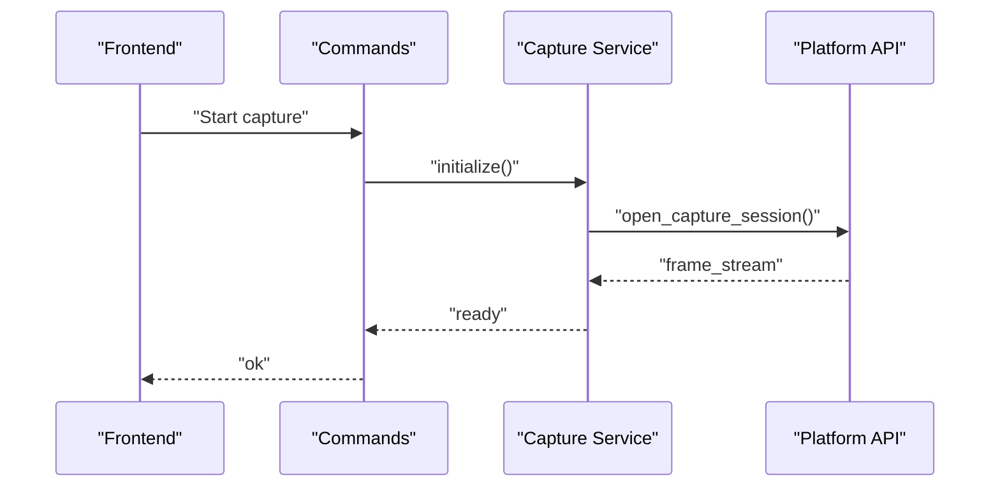
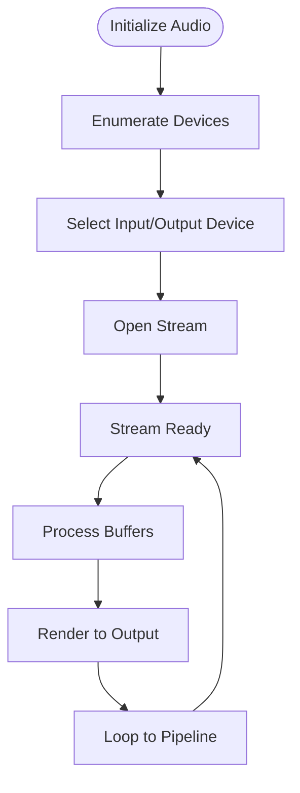
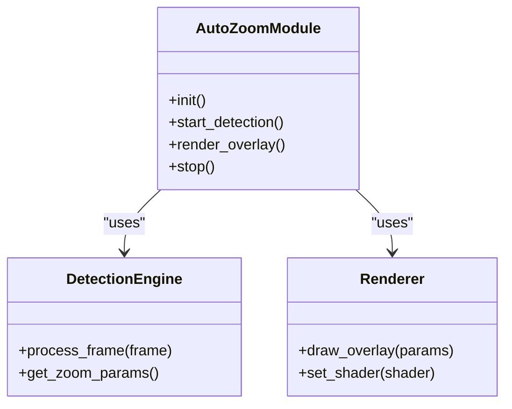
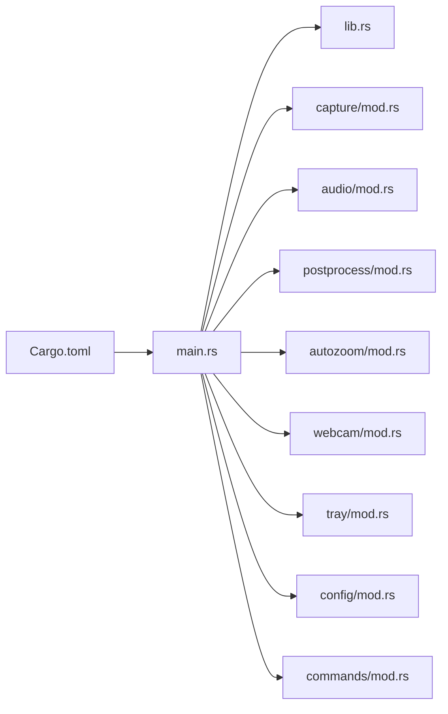

# Backend Services

<cite>
**Referenced Files in This Document**
- [Cargo.toml](file://src-tauri/Cargo.toml)
- [main.rs](file://src-tauri/src/main.rs)
- [lib.rs](file://src-tauri/src/lib.rs)
- [capture/mod.rs](file://src-tauri/src/capture/mod.rs)
- [audio/mod.rs](file://src-tauri/src/audio/mod.rs)
- [postprocess/mod.rs](file://src-tauri/src/postprocess/mod.rs)
- [autozoom/mod.rs](file://src-tauri/src/autozoom/mod.rs)
- [autozoom/detection.rs](file://src-tauri/src/autozoom/detection.rs)
- [autozoom/renderer.rs](file://src-tauri/src/autozoom/renderer.rs)
- [webcam/mod.rs](file://src-tauri/src/webcam/mod.rs)
- [tray/mod.rs](file://src-tauri/src/tray/mod.rs)
- [config/mod.rs](file://src-tauri/src/config/mod.rs)
- [commands/mod.rs](file://src-tauri/src/commands/mod.rs)
- [tauri.conf.json](file://src-tauri/tauri.conf.json)
- [capabilities/default.json](file://src-tauri/capabilities/default.json)
- [capabilities/overlay.json](file://src-tauri/capabilities/overlay.json)
</cite>

## Table of Contents
1. [Introduction](#introduction)
2. [Project Structure](#project-structure)
3. [Core Components](#core-components)
4. [Architecture Overview](#architecture-overview)
5. [Detailed Component Analysis](#detailed-component-analysis)
6. [Dependency Analysis](#dependency-analysis)
7. [Performance Considerations](#performance-considerations)
8. [Troubleshooting Guide](#troubleshooting-guide)
9. [Conclusion](#conclusion)

## Introduction
This document describes the backend services architecture of EasySpecy’s Rust/Tauri application. The backend is organized into modular services responsible for screen capture, audio processing, postprocessing, and system integration. It covers service initialization order, dependency injection patterns, inter-service communication, platform-specific capture implementations, audio pipeline with CPAL, visual effects rendering, and coordination during recording sessions. Guidance is also provided for error handling and resource management.

## Project Structure
The backend is implemented under src-tauri with a clear separation of concerns across modules. Each module encapsulates a functional domain and exposes initialization and lifecycle hooks suitable for dependency injection and orchestration.

**Diagram sources**
- [main.rs](file://src-tauri/src/main.rs)
- [lib.rs](file://src-tauri/src/lib.rs)
- [capture/mod.rs](file://src-tauri/src/capture/mod.rs)
- [audio/mod.rs](file://src-tauri/src/audio/mod.rs)
- [postprocess/mod.rs](file://src-tauri/src/postprocess/mod.rs)
- [autozoom/mod.rs](file://src-tauri/src/autozoom/mod.rs)
- [webcam/mod.rs](file://src-tauri/src/webcam/mod.rs)
- [tray/mod.rs](file://src-tauri/src/tray/mod.rs)
- [config/mod.rs](file://src-tauri/src/config/mod.rs)
- [commands/mod.rs](file://src-tauri/src/commands/mod.rs)
- [tauri.conf.json](file://src-tauri/tauri.conf.json)
- [capabilities/default.json](file://src-tauri/capabilities/default.json)
- [capabilities/overlay.json](file://src-tauri/capabilities/overlay.json)

**Section sources**
- [Cargo.toml](file://src-tauri/Cargo.toml)
- [main.rs](file://src-tauri/src/main.rs)
- [lib.rs](file://src-tauri/src/lib.rs)
- [tauri.conf.json](file://src-tauri/tauri.conf.json)

## Core Components
- Capture service: Provides screen capture via platform-specific APIs and integrates with the recording session.
- Audio service: Manages audio capture and playback using CPAL, exposing a pipeline for real-time processing.
- Postprocessing service: Applies effects and transformations to captured frames and audio buffers.
- AutoZoom service: Implements camera-based detection and rendering overlays for zooming.
- Webcam service: Handles webcam capture and preview.
- Tray service: Integrates system tray interactions and notifications.
- Config service: Centralizes runtime configuration and preferences.
- Commands service: Exposes Tauri commands for frontend-backend communication.

Initialization order and dependency wiring are orchestrated from the main entry point, ensuring services are constructed and started in a deterministic sequence.

**Section sources**
- [capture/mod.rs](file://src-tauri/src/capture/mod.rs)
- [audio/mod.rs](file://src-tauri/src/audio/mod.rs)
- [postprocess/mod.rs](file://src-tauri/src/postprocess/mod.rs)
- [autozoom/mod.rs](file://src-tauri/src/autozoom/mod.rs)
- [webcam/mod.rs](file://src-tauri/src/webcam/mod.rs)
- [tray/mod.rs](file://src-tauri/src/tray/mod.rs)
- [config/mod.rs](file://src-tauri/src/config/mod.rs)
- [commands/mod.rs](file://src-tauri/src/commands/mod.rs)

## Architecture Overview
The backend follows a layered architecture:
- Application layer: Tauri runtime and command handlers.
- Service layer: Modular services with explicit lifecycles.
- Platform integration: OS-specific capture APIs and system capabilities.
- Data flow: Streams from capture services feed into audio and video pipelines, then into postprocessing and storage.

**Diagram sources**
- [main.rs](file://src-tauri/src/main.rs)
- [capture/mod.rs](file://src-tauri/src/capture/mod.rs)
- [audio/mod.rs](file://src-tauri/src/audio/mod.rs)
- [postprocess/mod.rs](file://src-tauri/src/postprocess/mod.rs)
- [autozoom/mod.rs](file://src-tauri/src/autozoom/mod.rs)
- [webcam/mod.rs](file://src-tauri/src/webcam/mod.rs)
- [tray/mod.rs](file://src-tauri/src/tray/mod.rs)
- [config/mod.rs](file://src-tauri/src/config/mod.rs)

## Detailed Component Analysis

### Capture Service
Responsibilities:
- Initialize platform-specific capture backends (Windows Graphics Capture, macOS ScreenCaptureKit, Linux PipeWire).
- Provide frame acquisition streams and metadata to downstream services.
- Coordinate with the recording session to synchronize capture timing.

Implementation highlights:
- Module exposes initialization and lifecycle hooks suitable for dependency injection.
- Integrates with Tauri commands for starting/stopping capture and selecting sources.

**Diagram sources**
- [commands/mod.rs](file://src-tauri/src/commands/mod.rs)
- [capture/mod.rs](file://src-tauri/src/capture/mod.rs)

**Section sources**
- [capture/mod.rs](file://src-tauri/src/capture/mod.rs)
- [commands/mod.rs](file://src-tauri/src/commands/mod.rs)

### Audio Service (CPAL Pipeline)
Responsibilities:
- Enumerate and open audio devices.
- Stream PCM buffers for capture and playback.
- Integrate with the audio processing pipeline.

Implementation highlights:
- Uses CPAL for cross-platform audio device management.
- Provides hooks for attaching pre/post-processing stages.

**Diagram sources**
- [audio/mod.rs](file://src-tauri/src/audio/mod.rs)

**Section sources**
- [audio/mod.rs](file://src-tauri/src/audio/mod.rs)

### Postprocessing Service
Responsibilities:
- Apply visual/audio effects to frames/buffers.
- Manage effect chains and parameter updates.
- Coordinate with capture and audio pipelines.

Implementation highlights:
- Designed as a composable stage that transforms incoming data.
- Supports dynamic reconfiguration during a session.

**Section sources**
- [postprocess/mod.rs](file://src-tauri/src/postprocess/mod.rs)

### AutoZoom Service
Responsibilities:
- Camera capture and detection pipeline.
- Rendering overlays for zoom/pan effects.
- Integration with the main recording session.

**Diagram sources**
- [autozoom/mod.rs](file://src-tauri/src/autozoom/mod.rs)
- [autozoom/detection.rs](file://src-tauri/src/autozoom/detection.rs)
- [autozoom/renderer.rs](file://src-tauri/src/autozoom/renderer.rs)

**Section sources**
- [autozoom/mod.rs](file://src-tauri/src/autozoom/mod.rs)
- [autozoom/detection.rs](file://src-tauri/src/autozoom/detection.rs)
- [autozoom/renderer.rs](file://src-tauri/src/autozoom/renderer.rs)

### Webcam Service
Responsibilities:
- Capture frames from webcam devices.
- Provide previews and integrate with AutoZoom.

**Section sources**
- [webcam/mod.rs](file://src-tauri/src/webcam/mod.rs)

### Tray Service
Responsibilities:
- System tray integration and menu actions.
- Notifications and status reporting.

**Section sources**
- [tray/mod.rs](file://src-tauri/src/tray/mod.rs)

### Config Service
Responsibilities:
- Load and persist user preferences.
- Provide runtime configuration to services.

**Section sources**
- [config/mod.rs](file://src-tauri/src/config/mod.rs)

### Commands Service
Responsibilities:
- Expose Tauri commands for frontend-backend communication.
- Orchestrate service initialization and lifecycle transitions.

**Section sources**
- [commands/mod.rs](file://src-tauri/src/commands/mod.rs)

## Dependency Analysis
The backend relies on Tauri for runtime and capability management. Services are initialized in a controlled order from the main entry point, with dependencies injected through constructor-like initialization functions. The Cargo manifest defines external crates used by the services.

**Diagram sources**
- [Cargo.toml](file://src-tauri/Cargo.toml)
- [main.rs](file://src-tauri/src/main.rs)
- [lib.rs](file://src-tauri/src/lib.rs)
- [capture/mod.rs](file://src-tauri/src/capture/mod.rs)
- [audio/mod.rs](file://src-tauri/src/audio/mod.rs)
- [postprocess/mod.rs](file://src-tauri/src/postprocess/mod.rs)
- [autozoom/mod.rs](file://src-tauri/src/autozoom/mod.rs)
- [webcam/mod.rs](file://src-tauri/src/webcam/mod.rs)
- [tray/mod.rs](file://src-tauri/src/tray/mod.rs)
- [config/mod.rs](file://src-tauri/src/config/mod.rs)
- [commands/mod.rs](file://src-tauri/src/commands/mod.rs)

**Section sources**
- [Cargo.toml](file://src-tauri/Cargo.toml)
- [main.rs](file://src-tauri/src/main.rs)

## Performance Considerations
- Minimize contention between capture threads and CPU-bound effects by using asynchronous channels and lock-free queues where possible.
- Prefer streaming buffers over intermediate copies to reduce memory pressure.
- Offload heavy rendering to GPU-backed renderers when available.
- Batch configuration updates to avoid frequent reinitialization of audio/video pipelines.
- Use platform-native capture APIs to leverage hardware-accelerated encoding and decoding.

## Troubleshooting Guide
Common issues and strategies:
- Capture failures: Verify platform permissions and device availability. Reinitialize capture with fallback sources.
- Audio dropouts: Reduce buffer sizes or adjust latency settings. Ensure the audio thread has sufficient CPU headroom.
- Rendering stalls: Profile GPU utilization and simplify shaders. Consider lowering resolution or FPS.
- Session synchronization: Align timestamps across capture and audio streams to prevent drift.
- Resource leaks: Ensure all handles are closed in error branches and on shutdown.

## Conclusion
EasySpecy’s backend employs a modular, service-oriented architecture with clear separation of concerns. Services are initialized deterministically, communicate via Tauri commands, and integrate with platform-specific APIs for capture and audio. The design supports concurrent operations during recording sessions while enabling robust error handling and resource management.