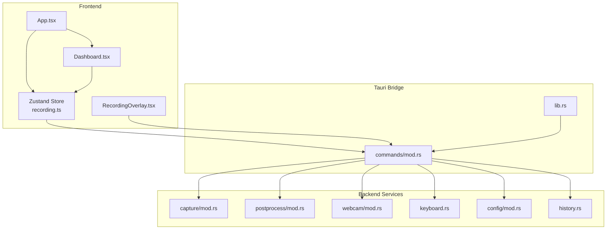
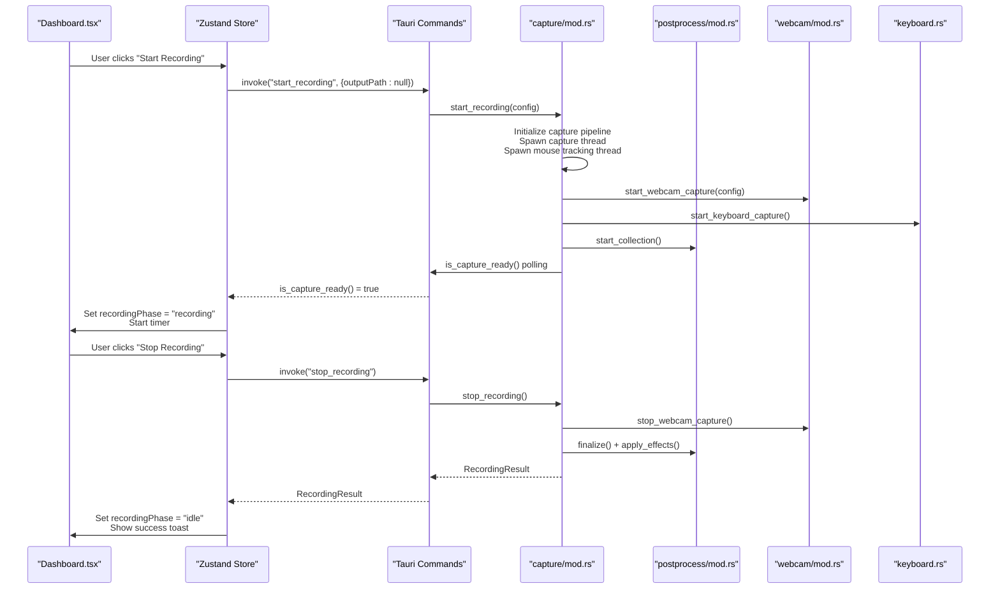
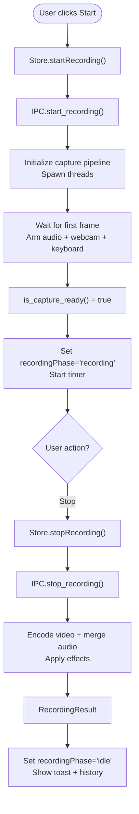
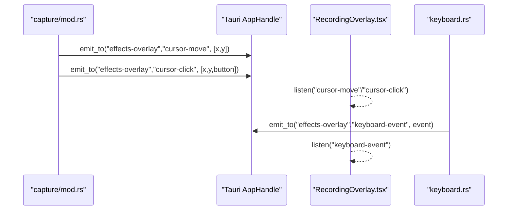
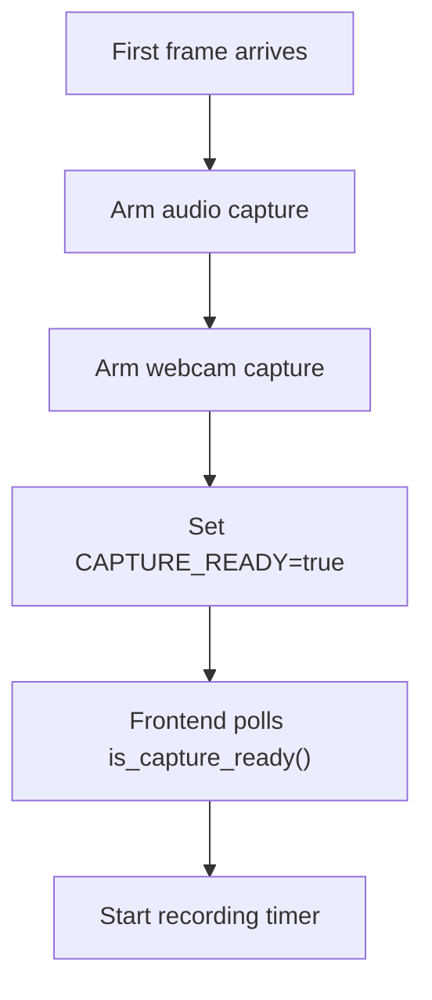
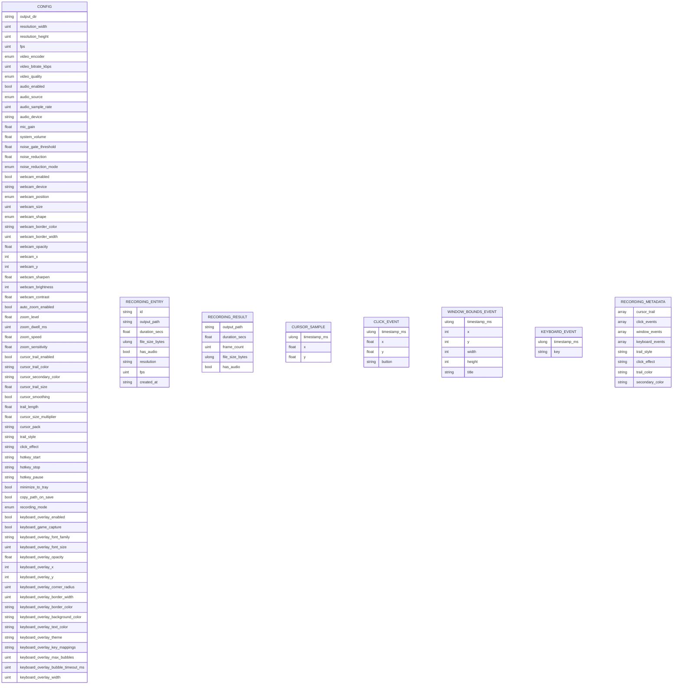
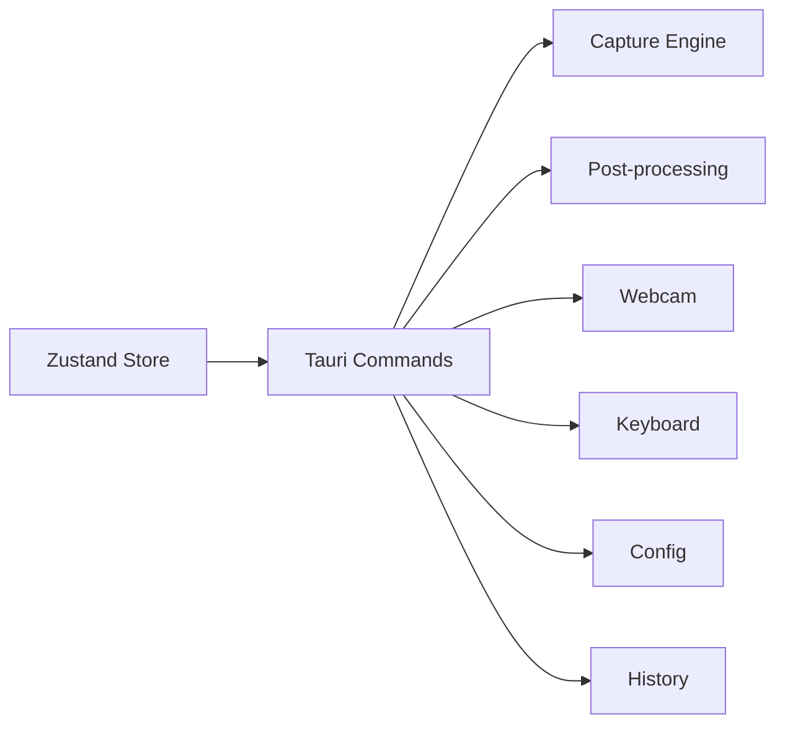

# Data Flows & Communication

<cite>
**Referenced Files in This Document**
- [README.md](file://README.md)
- [src/main.tsx](file://src/main.tsx)
- [src/App.tsx](file://src/App.tsx)
- [src/stores/recording.ts](file://src/stores/recording.ts)
- [src/components/Dashboard.tsx](file://src/components/Dashboard.tsx)
- [src/components/RecordingOverlay.tsx](file://src/components/RecordingOverlay.tsx)
- [src-tauri/src/lib.rs](file://src-tauri/src/lib.rs)
- [src-tauri/Cargo.toml](file://src-tauri/Cargo.toml)
- [src-tauri/src/commands/mod.rs](file://src-tauri/src/commands/mod.rs)
- [src-tauri/src/capture/mod.rs](file://src-tauri/src/capture/mod.rs)
- [src-tauri/src/postprocess/mod.rs](file://src-tauri/src/postprocess/mod.rs)
- [src-tauri/src/webcam/mod.rs](file://src-tauri/src/webcam/mod.rs)
- [src-tauri/src/config/mod.rs](file://src-tauri/src/config/mod.rs)
- [src-tauri/src/history.rs](file://src-tauri/src/history.rs)
- [src-tauri/src/keyboard.rs](file://src-tauri/src/keyboard.rs)
</cite>

## Table of Contents
1. [Introduction](#introduction)
2. [Project Structure](#project-structure)
3. [Core Components](#core-components)
4. [Architecture Overview](#architecture-overview)
5. [Detailed Component Analysis](#detailed-component-analysis)
6. [Dependency Analysis](#dependency-analysis)
7. [Performance Considerations](#performance-considerations)
8. [Troubleshooting Guide](#troubleshooting-guide)
9. [Conclusion](#conclusion)

## Introduction
This document explains EasySpecy's data flow architecture and inter-component communication patterns. It covers the recording lifecycle from user interaction through state management to backend processing, event-driven architecture with IPC channels, propagation of recording status updates, synchronization mechanisms, data models and serialization, state persistence across restarts, and practical scenarios such as starting a recording, processing visual effects, and saving results. It also documents error handling and recovery mechanisms.

## Project Structure
EasySpecy follows a clear separation of concerns:
- Frontend (React + TypeScript) manages UI, user interactions, and state via a Zustand store.
- Backend (Rust + Tauri) handles screen capture, audio capture, encoding, effects processing, and IPC commands.
- Cross-process communication occurs via Tauri IPC commands and event emissions.

**Diagram sources**
- [src/App.tsx:17-189](file://src/App.tsx#L17-L189)
- [src/components/Dashboard.tsx:218-573](file://src/components/Dashboard.tsx#L218-L573)
- [src/stores/recording.ts:177-405](file://src/stores/recording.ts#L177-L405)
- [src/components/RecordingOverlay.tsx:18-136](file://src/components/RecordingOverlay.tsx#L18-L136)
- [src-tauri/src/lib.rs:85-136](file://src-tauri/src/lib.rs#L85-L136)
- [src-tauri/src/commands/mod.rs:11-723](file://src-tauri/src/commands/mod.rs#L11-L723)
- [src-tauri/src/capture/mod.rs:163-714](file://src-tauri/src/capture/mod.rs#L163-L714)
- [src-tauri/src/postprocess/mod.rs:76-181](file://src-tauri/src/postprocess/mod.rs#L76-L181)
- [src-tauri/src/webcam/mod.rs:41-156](file://src-tauri/src/webcam/mod.rs#L41-L156)
- [src-tauri/src/keyboard.rs:51-137](file://src-tauri/src/keyboard.rs#L51-L137)
- [src-tauri/src/config/mod.rs:244-277](file://src-tauri/src/config/mod.rs#L244-L277)
- [src-tauri/src/history.rs:31-63](file://src-tauri/src/history.rs#L31-L63)

**Section sources**
- [README.md:1-63](file://README.md#L1-L63)
- [src/main.tsx:1-15](file://src/main.tsx#L1-L15)
- [src/App.tsx:17-189](file://src/App.tsx#L17-L189)
- [src-tauri/src/lib.rs:85-136](file://src-tauri/src/lib.rs#L85-L136)

## Core Components
- Zustand Store (recording.ts): Central state for configuration, recording lifecycle, encoding progress, audio levels, and UI notifications. Exposes async actions that invoke Tauri commands and manage UI state transitions.
- Tauri Commands (commands/mod.rs): IPC handlers bridging frontend actions to backend services. Includes start/stop recording, region capture, audio controls, overlay management, and metadata retrieval.
- Capture Engine (capture/mod.rs): Manages screen capture, audio capture, encoding, and synchronization. Implements atomic state for capture readiness, pause/resume, and encoding progress reporting.
- Post-processing (postprocess/mod.rs): Collects cursor and click metadata during recording and applies visual effects (cursor trails, click effects) to the final video.
- Webcam (webcam/mod.rs): Captures webcam frames, composites them into the final video, and manages device contention with browser previews.
- Keyboard (keyboard.rs): Captures global keystrokes during recording and emits events to the overlay and post-processing.
- Configuration (config/mod.rs): Loads/saves TOML configuration and computes derived values for encoding.
- History (history.rs): Persists recent recordings to JSON.

**Section sources**
- [src/stores/recording.ts:177-405](file://src/stores/recording.ts#L177-L405)
- [src-tauri/src/commands/mod.rs:11-723](file://src-tauri/src/commands/mod.rs#L11-L723)
- [src-tauri/src/capture/mod.rs:163-714](file://src-tauri/src/capture/mod.rs#L163-L714)
- [src-tauri/src/postprocess/mod.rs:76-181](file://src-tauri/src/postprocess/mod.rs#L76-L181)
- [src-tauri/src/webcam/mod.rs:41-156](file://src-tauri/src/webcam/mod.rs#L41-L156)
- [src-tauri/src/keyboard.rs:51-137](file://src-tauri/src/keyboard.rs#L51-L137)
- [src-tauri/src/config/mod.rs:244-277](file://src-tauri/src/config/mod.rs#L244-L277)
- [src-tauri/src/history.rs:31-63](file://src-tauri/src/history.rs#L31-L63)

## Architecture Overview
The system uses an event-driven, IPC-based architecture:
- Frontend triggers actions via the Zustand store.
- Store invokes Tauri commands to start/stop capture, configure overlays, and poll progress.
- Backend services coordinate capture threads, synchronize audio/video, and emit events to the overlay window.
- Encoding runs in a background thread, reporting progress via atomic state and IPC queries.
- Metadata is collected during recording and applied to the final video.

**Diagram sources**
- [src/components/Dashboard.tsx:394-445](file://src/components/Dashboard.tsx#L394-L445)
- [src/stores/recording.ts:284-337](file://src/stores/recording.ts#L284-L337)
- [src-tauri/src/commands/mod.rs:249-403](file://src-tauri/src/commands/mod.rs#L249-L403)
- [src-tauri/src/capture/mod.rs:163-714](file://src-tauri/src/capture/mod.rs#L163-L714)
- [src-tauri/src/postprocess/mod.rs:169-181](file://src-tauri/src/postprocess/mod.rs#L169-L181)
- [src-tauri/src/webcam/mod.rs:122-156](file://src-tauri/src/webcam/mod.rs#L122-L156)
- [src-tauri/src/keyboard.rs:86-112](file://src-tauri/src/keyboard.rs#L86-L112)

## Detailed Component Analysis

### Recording Lifecycle Data Flow
- User interaction: The Dashboard renders the record button and responds to clicks by invoking store actions.
- Store actions: The store calls Tauri commands to start/stop capture, set region, and poll encoding progress.
- Backend synchronization: The capture engine waits for the first video frame to arm audio and set capture-ready state.
- UI updates: The store updates recordingPhase, timers, and encoding progress; the overlay window receives cursor and keyboard events.

**Diagram sources**
- [src/components/Dashboard.tsx:394-445](file://src/components/Dashboard.tsx#L394-L445)
- [src/stores/recording.ts:284-337](file://src/stores/recording.ts#L284-L337)
- [src-tauri/src/commands/mod.rs:249-403](file://src-tauri/src/commands/mod.rs#L249-L403)
- [src-tauri/src/capture/mod.rs:305-344](file://src-tauri/src/capture/mod.rs#L305-L344)

**Section sources**
- [src/components/Dashboard.tsx:218-573](file://src/components/Dashboard.tsx#L218-L573)
- [src/stores/recording.ts:284-337](file://src/stores/recording.ts#L284-L337)
- [src-tauri/src/commands/mod.rs:249-403](file://src-tauri/src/commands/mod.rs#L249-L403)
- [src-tauri/src/capture/mod.rs:305-344](file://src-tauri/src/capture/mod.rs#L305-L344)

### Event-Driven Architecture and IPC Channels
- IPC Commands: The backend registers commands for configuration, recording control, overlay management, and metadata retrieval.
- Events: The capture thread emits "cursor-move" and "cursor-click" events to the overlay window. Keyboard hook emits "keyboard-event".
- Overlay Rendering: The overlay listens to events and renders cursor trails and click effects in real time.

**Diagram sources**
- [src-tauri/src/capture/mod.rs:324-375](file://src-tauri/src/capture/mod.rs#L324-L375)
- [src-tauri/src/keyboard.rs:228-238](file://src-tauri/src/keyboard.rs#L228-L238)
- [src/components/RecordingOverlay.tsx:56-87](file://src/components/RecordingOverlay.tsx#L56-L87)

**Section sources**
- [src-tauri/src/lib.rs:85-136](file://src-tauri/src/lib.rs#L85-L136)
- [src-tauri/src/commands/mod.rs:11-723](file://src-tauri/src/commands/mod.rs#L11-L723)
- [src-tauri/src/capture/mod.rs:324-375](file://src-tauri/src/capture/mod.rs#L324-L375)
- [src-tauri/src/keyboard.rs:228-238](file://src-tauri/src/keyboard.rs#L228-L238)
- [src/components/RecordingOverlay.tsx:56-87](file://src/components/RecordingOverlay.tsx#L56-L87)

### Synchronization Mechanisms
- Capture Ready Gate: The backend waits for the first video frame before arming audio and webcam, ensuring zero-drift sync.
- Atomic State: Capture-ready, paused, frame counts, and encoding progress are guarded by atomics for safe UI polling.
- Mouse Tracking Thread: Polls cursor position at ~120Hz and emits events to overlay and post-processing.
- Webcam Producer-Consumer: Captures frames as fast as the camera delivers; a writer thread handles PNG encoding and disk I/O.

**Diagram sources**
- [src-tauri/src/capture/mod.rs:110-129](file://src-tauri/src/capture/mod.rs#L110-L129)
- [src-tauri/src/capture/mod.rs:408-410](file://src-tauri/src/capture/mod.rs#L408-L410)

**Section sources**
- [src-tauri/src/capture/mod.rs:110-129](file://src-tauri/src/capture/mod.rs#L110-L129)
- [src-tauri/src/capture/mod.rs:408-410](file://src-tauri/src/capture/mod.rs#L408-L410)

### Data Models and Serialization
- AppConfig: TOML-serialized configuration persisted under the user's config directory.
- RecordingEntry: JSON-serialized history entries persisted under the user's config directory.
- RecordingResult: Structured result returned after stop_recording.
- Metadata: Cursor samples, click events, window bounds, and keyboard events serialized to JSON for post-processing.

**Diagram sources**
- [src-tauri/src/config/mod.rs:5-93](file://src-tauri/src/config/mod.rs#L5-L93)
- [src-tauri/src/history.rs:6-21](file://src-tauri/src/history.rs#L6-L21)
- [src-tauri/src/capture/mod.rs:31-38](file://src-tauri/src/capture/mod.rs#L31-L38)
- [src-tauri/src/postprocess/mod.rs:12-71](file://src-tauri/src/postprocess/mod.rs#L12-L71)

**Section sources**
- [src-tauri/src/config/mod.rs:244-277](file://src-tauri/src/config/mod.rs#L244-L277)
- [src-tauri/src/history.rs:31-63](file://src-tauri/src/history.rs#L31-L63)
- [src-tauri/src/capture/mod.rs:31-38](file://src-tauri/src/capture/mod.rs#L31-L38)
- [src-tauri/src/postprocess/mod.rs:12-71](file://src-tauri/src/postprocess/mod.rs#L12-L71)

### State Persistence Across Application Restarts
- Configuration: Loaded from and saved to TOML at a platform-specific config path.
- History: Loaded from and saved to JSON at a platform-specific config path.
- Runtime state: Managed in-memory via Zustand store; lost on restart. Persistent data is restored on startup.

**Section sources**
- [src-tauri/src/config/mod.rs:244-277](file://src-tauri/src/config/mod.rs#L244-L277)
- [src-tauri/src/history.rs:31-63](file://src-tauri/src/history.rs#L31-L63)
- [src/App.tsx:30-60](file://src/App.tsx#L30-L60)

### Typical Data Flow Scenarios

#### Starting a Recording
- UI: User presses the record button or hotkey.
- Store: Calls start_recording, optionally enters region mode, and waits for capture-ready.
- Backend: Initializes capture pipeline, arms audio, starts webcam and keyboard capture, and starts metadata collection.
- Overlay: Receives cursor and keyboard events to render live effects.

**Section sources**
- [src/components/Dashboard.tsx:394-445](file://src/components/Dashboard.tsx#L394-L445)
- [src/stores/recording.ts:284-307](file://src/stores/recording.ts#L284-L307)
- [src-tauri/src/commands/mod.rs:249-344](file://src-tauri/src/commands/mod.rs#L249-L344)
- [src-tauri/src/capture/mod.rs:232-292](file://src-tauri/src/capture/mod.rs#L232-L292)

#### Processing Visual Effects
- During recording: Mouse tracking thread collects cursor samples and click events; keyboard hook emits key events.
- At stop: Post-processing finalizes metadata and applies effects to the video; webcam frames are composited.

**Section sources**
- [src-tauri/src/capture/mod.rs:282-401](file://src-tauri/src/capture/mod.rs#L282-L401)
- [src-tauri/src/postprocess/mod.rs:169-181](file://src-tauri/src/postprocess/mod.rs#L169-L181)
- [src-tauri/src/webcam/mod.rs:234-328](file://src-tauri/src/webcam/mod.rs#L234-L328)

#### Saving Results
- Backend: stop_recording returns RecordingResult; store updates UI and history.
- Store: Adds entry to history and optionally copies path to clipboard.

**Section sources**
- [src-tauri/src/commands/mod.rs:358-403](file://src-tauri/src/commands/mod.rs#L358-L403)
- [src-tauri/src/history.rs:52-57](file://src-tauri/src/history.rs#L52-L57)
- [src/stores/recording.ts:309-337](file://src/stores/recording.ts#L309-L337)

### Error Handling and Recovery
- Capture Initialization Timeout: start_recording enforces a 10s timeout to avoid hanging if capture fails to start.
- Webcam Device Contention: Backend requests frontend to release browser webcam streams before starting native capture.
- Webcam Errors: Emitted as "webcam-error" events to inform the user.
- Keyboard Hook: Installs a Windows low-level hook thread; gracefully stops and posts quit message on shutdown.
- Encoding Failures: FFmpeg failures are caught and logged; partial processing continues where possible.

**Section sources**
- [src-tauri/src/commands/mod.rs:308-324](file://src-tauri/src/commands/mod.rs#L308-L324)
- [src-tauri/src/capture/mod.rs:234-265](file://src-tauri/src/capture/mod.rs#L234-L265)
- [src/App.tsx:50-54](file://src/App.tsx#L50-L54)
- [src-tauri/src/keyboard.rs:86-112](file://src-tauri/src/keyboard.rs#L86-L112)
- [src-tauri/src/capture/mod.rs:485-499](file://src-tauri/src/capture/mod.rs#L485-L499)

## Dependency Analysis
- Frontend depends on Tauri APIs for IPC and event listening.
- Backend exposes commands via Tauri builder and uses internal modules for capture, post-processing, webcam, and keyboard.
- Modules have minimal coupling; capture coordinates webcam and keyboard, post-processing consumes metadata, and history persists results.

**Diagram sources**
- [src-tauri/src/lib.rs:85-136](file://src-tauri/src/lib.rs#L85-L136)
- [src-tauri/src/commands/mod.rs:11-723](file://src-tauri/src/commands/mod.rs#L11-L723)

**Section sources**
- [src-tauri/src/lib.rs:85-136](file://src-tauri/src/lib.rs#L85-L136)
- [src-tauri/src/commands/mod.rs:11-723](file://src-tauri/src/commands/mod.rs#L11-L723)

## Performance Considerations
- Real-time Rendering: Overlay rendering uses requestAnimationFrame and efficient canvas drawing; metadata collection is optimized with pre-smoothed paths and parallel rendering.
- Producer-Consumer: Webcam capture uses a channel to decouple capture and writing, preventing stalls.
- Encoding Progress: FFmpeg stderr parsing provides real-time progress updates mapped to a bounded percentage range.
- Atomic State Polling: UI polls atomic flags and counters to avoid heavy synchronization overhead.

## Troubleshooting Guide
- Recording does not start: Check capture initialization timeout and backend logs for initialization errors.
- Webcam conflicts: Ensure browser webcam is released before native capture; verify device permissions.
- Audio mismatch: Verify audio source configuration and device selection; use the loudness meters to confirm input.
- Encoding hangs: Review FFmpeg progress parsing and logs; confirm sufficient disk space and file permissions.
- Overlay not rendering: Confirm overlay window creation and event listeners; ensure click-through settings are applied.

**Section sources**
- [src-tauri/src/commands/mod.rs:308-324](file://src-tauri/src/commands/mod.rs#L308-L324)
- [src-tauri/src/capture/mod.rs:234-265](file://src-tauri/src/capture/mod.rs#L234-L265)
- [src-tauri/src/webcam/mod.rs:41-101](file://src-tauri/src/webcam/mod.rs#L41-L101)
- [src-tauri/src/capture/mod.rs:427-500](file://src-tauri/src/capture/mod.rs#L427-L500)
- [src/components/RecordingOverlay.tsx:56-87](file://src/components/RecordingOverlay.tsx#L56-L87)

## Conclusion
EasySpecy’s architecture cleanly separates frontend UI and state management from backend capture and encoding services, communicating via Tauri IPC and events. The capture engine synchronizes video, audio, webcam, and keyboard inputs to ensure precise alignment, while post-processing and overlays deliver polished visual effects. Robust IPC commands, atomic state, and structured data models support reliable operation and easy maintenance across restarts.