# Frontend Architecture

<cite>
**Referenced Files in This Document**
- [src/main.tsx](file://src/main.tsx)
- [src/App.tsx](file://src/App.tsx)
- [src/stores/recording.ts](file://src/stores/recording.ts)
- [src/components/Dashboard.tsx](file://src/components/Dashboard.tsx)
- [src/components/Settings.tsx](file://src/components/Settings.tsx)
- [src/lib/effects.ts](file://src/lib/effects.ts)
- [src/lib/theme.ts](file://src/lib/theme.ts)
- [src/styles.css](file://src/styles.css)
- [src/components/RegionSelector.tsx](file://src/components/RegionSelector.tsx)
- [src/components/StatusBar.tsx](file://src/components/StatusBar.tsx)
- [src/components/Toast.tsx](file://src/components/Toast.tsx)
- [src/components/ContextMenu.tsx](file://src/components/ContextMenu.tsx)
- [src-tauri/src/main.rs](file://src-tauri/src/main.rs)
- [package.json](file://package.json)
- [vite.config.ts](file://vite.config.ts)
</cite>

## Table of Contents
1. [Introduction](#introduction)
2. [Project Structure](#project-structure)
3. [Core Components](#core-components)
4. [Architecture Overview](#architecture-overview)
5. [Detailed Component Analysis](#detailed-component-analysis)
6. [Dependency Analysis](#dependency-analysis)
7. [Performance Considerations](#performance-considerations)
8. [Troubleshooting Guide](#troubleshooting-guide)
9. [Conclusion](#conclusion)

## Introduction
This document describes the React frontend architecture for EasySpecy, focusing on the component structure, state management via Zustand, styling with TailwindCSS, and integration with Tauri commands. It explains the main application entry point, routing patterns, component hierarchy, recording state management, IPC communication, and how the UI remains responsive during intensive recording operations.

## Project Structure
The frontend is organized around a small set of core files and a clear separation of concerns:
- Application bootstrap and theme initialization
- Centralized state management with a single Zustand store
- Feature components for dashboard, settings, overlays, and system integration
- Shared UI primitives for context menus, toasts, and status bars
- Visual effects rendering engine for cursor trails and click effects
- Styling system built on TailwindCSS and a custom design system

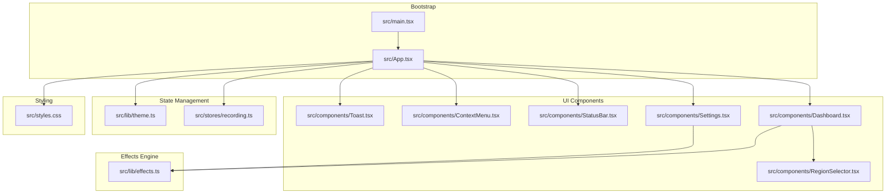

**Diagram sources**
- [src/main.tsx:1-15](file://src/main.tsx#L1-L15)
- [src/App.tsx:1-208](file://src/App.tsx#L1-L208)
- [src/stores/recording.ts:1-404](file://src/stores/recording.ts#L1-L404)
- [src/components/Dashboard.tsx:1-586](file://src/components/Dashboard.tsx#L1-L586)
- [src/components/Settings.tsx:1-800](file://src/components/Settings.tsx#L1-L800)
- [src/components/RegionSelector.tsx:1-141](file://src/components/RegionSelector.tsx#L1-L141)
- [src/components/StatusBar.tsx:1-368](file://src/components/StatusBar.tsx#L1-L368)
- [src/components/ContextMenu.tsx:1-266](file://src/components/ContextMenu.tsx#L1-L266)
- [src/components/Toast.tsx:1-79](file://src/components/Toast.tsx#L1-L79)
- [src/lib/effects.ts:1-702](file://src/lib/effects.ts#L1-L702)
- [src/lib/theme.ts:1-51](file://src/lib/theme.ts#L1-L51)
- [src/styles.css:1-301](file://src/styles.css#L1-L301)

**Section sources**
- [src/main.tsx:1-15](file://src/main.tsx#L1-L15)
- [src/App.tsx:1-208](file://src/App.tsx#L1-L208)
- [package.json:1-36](file://package.json#L1-L36)
- [vite.config.ts:1-36](file://vite.config.ts#L1-L36)

## Core Components
- Application shell and routing: The root component manages page navigation between Dashboard and Settings, global audio monitoring, theme switching, and IPC event listeners.
- Recording state store: A centralized Zustand store handles configuration, recording lifecycle, encoding progress, audio levels, hotkeys, and IPC interactions.
- Dashboard: Provides recording controls, timer, encoding progress, recent recordings, and preset configuration cards.
- Settings: Full configuration panel for video/audio/webcam/keyboard/cursor effects, plus hotkeys and general preferences.
- Visual effects engine: Canvas-based rendering for cursor trails and click effects used in previews and overlays.
- Supporting UI: Region selector overlay, status bar, context menus, and toast notifications.

**Section sources**
- [src/App.tsx:17-189](file://src/App.tsx#L17-L189)
- [src/stores/recording.ts:176-404](file://src/stores/recording.ts#L176-L404)
- [src/components/Dashboard.tsx:218-573](file://src/components/Dashboard.tsx#L218-L573)
- [src/components/Settings.tsx:40-733](file://src/components/Settings.tsx#L40-L733)
- [src/lib/effects.ts:84-677](file://src/lib/effects.ts#L84-L677)

## Architecture Overview
The frontend follows a unidirectional data flow pattern:
- Components subscribe to the Zustand store for state and dispatch actions.
- IPC calls are invoked through Tauri APIs to backend services.
- Events from the backend update the store, which re-renders affected components.
- Visual effects are rendered on demand via the effects engine.

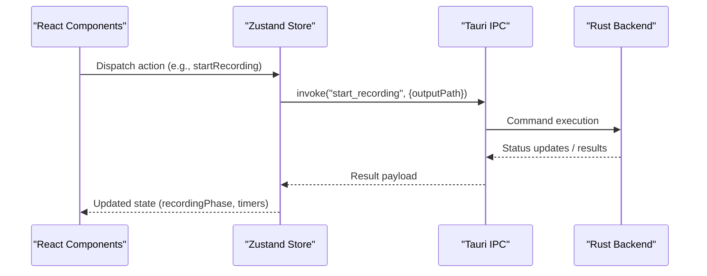

**Diagram sources**
- [src/stores/recording.ts:283-306](file://src/stores/recording.ts#L283-L306)
- [src/App.tsx:30-60](file://src/App.tsx#L30-L60)

**Section sources**
- [src/App.tsx:17-189](file://src/App.tsx#L17-L189)
- [src/stores/recording.ts:176-404](file://src/stores/recording.ts#L176-L404)

## Detailed Component Analysis

### Application Shell and Routing
The root component initializes the theme, sets up global audio monitoring, registers IPC listeners, and renders the sidebar, header, and page content. Navigation toggles between Dashboard and Settings, and the active page determines which component is mounted.

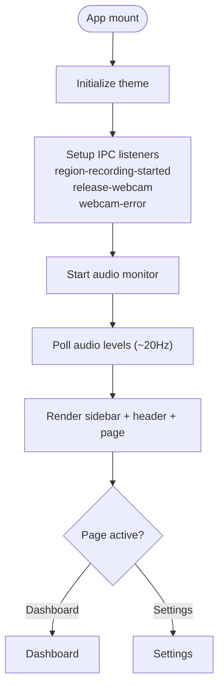

**Diagram sources**
- [src/App.tsx:30-76](file://src/App.tsx#L30-L76)
- [src/App.tsx:88-189](file://src/App.tsx#L88-L189)

**Section sources**
- [src/App.tsx:17-189](file://src/App.tsx#L17-L189)

### Recording State Management
The Zustand store encapsulates:
- Configuration loading/saving and field updates
- Recording lifecycle (start/pause/resume/stop)
- Encoding progress and stage reporting
- Audio device enumeration and live level polling
- Hotkey registration/unregistration
- Toast notifications and clipboard operations
- Keyboard events polling

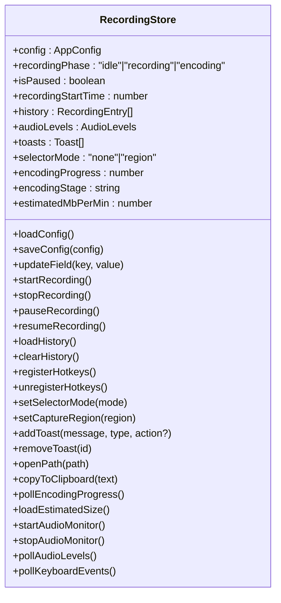

**Diagram sources**
- [src/stores/recording.ts:131-174](file://src/stores/recording.ts#L131-L174)
- [src/stores/recording.ts:176-404](file://src/stores/recording.ts#L176-L404)

**Section sources**
- [src/stores/recording.ts:176-404](file://src/stores/recording.ts#L176-L404)

### Dashboard Component
The Dashboard orchestrates:
- Recording controls and timer display
- Encoding progress visualization
- Recent recordings list with context menu
- Preset configuration cards for resolution, FPS, audio, encoder, quality, and mode
- Inline badges for enabled features
- Region selector overlay integration

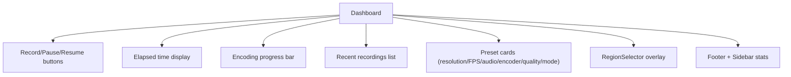

**Diagram sources**
- [src/components/Dashboard.tsx:218-573](file://src/components/Dashboard.tsx#L218-L573)
- [src/components/RegionSelector.tsx:7-141](file://src/components/RegionSelector.tsx#L7-L141)
- [src/components/StatusBar.tsx:6-44](file://src/components/StatusBar.tsx#L6-L44)

**Section sources**
- [src/components/Dashboard.tsx:218-573](file://src/components/Dashboard.tsx#L218-L573)

### Settings Component
The Settings panel provides:
- Video configuration (resolution, FPS, mode, encoder, quality, bitrate)
- Audio configuration (enable, source, sample rate, devices, gain, noise controls)
- Webcam overlay configuration with preview modal
- Keyboard overlay configuration with preview modal
- Auto-zoom post-processing settings
- Cursor and click effects customization with live preview
- Global hotkeys configuration
- General preferences (output directory, tray behavior, clipboard copy)

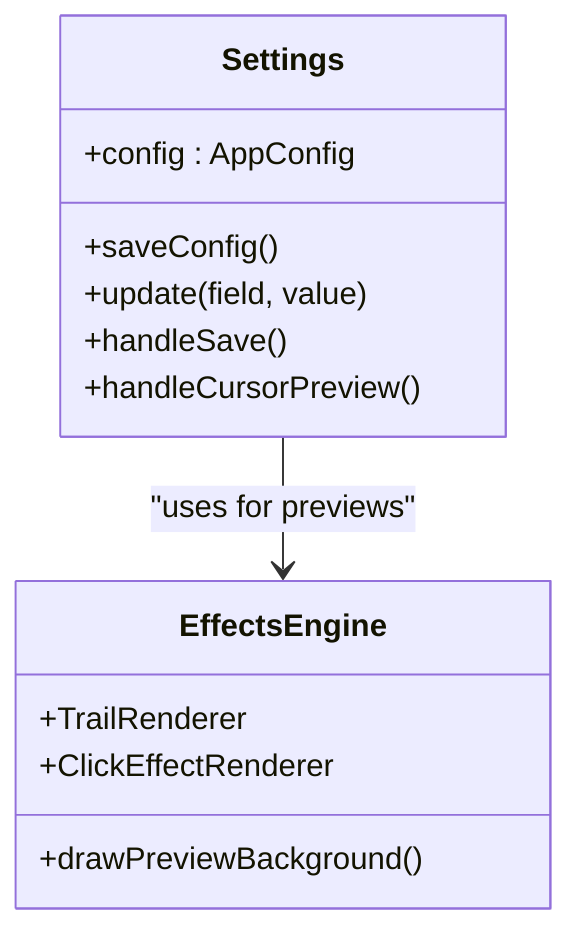

**Diagram sources**
- [src/components/Settings.tsx:40-733](file://src/components/Settings.tsx#L40-L733)
- [src/lib/effects.ts:84-677](file://src/lib/effects.ts#L84-L677)

**Section sources**
- [src/components/Settings.tsx:40-733](file://src/components/Settings.tsx#L40-L733)

### Visual Effects Rendering
The effects engine provides:
- TrailRenderer: Renders cursor trails with multiple styles (glow, particles, ribbon, dots, aurora)
- ClickEffectRenderer: Renders click feedback (ripple, spotlight, ring, pulse, confetti)
- Preview utilities for effect demonstrations

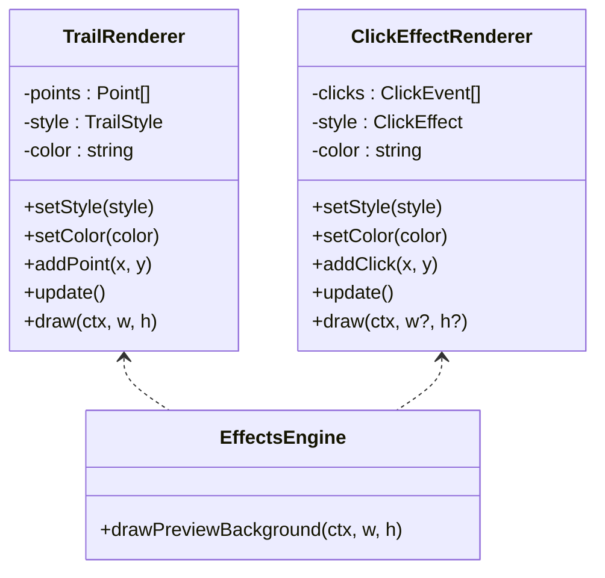

**Diagram sources**
- [src/lib/effects.ts:84-414](file://src/lib/effects.ts#L84-L414)
- [src/lib/effects.ts:427-677](file://src/lib/effects.ts#L427-L677)
- [src/lib/effects.ts:681-702](file://src/lib/effects.ts#L681-L702)

**Section sources**
- [src/lib/effects.ts:1-702](file://src/lib/effects.ts#L1-L702)

### Region Selector Overlay
The RegionSelector component provides an overlay for selecting a capture region:
- Mouse-driven rectangle selection
- Real-time dimension display
- Escape key cancellation
- Integration with the store to finalize selection

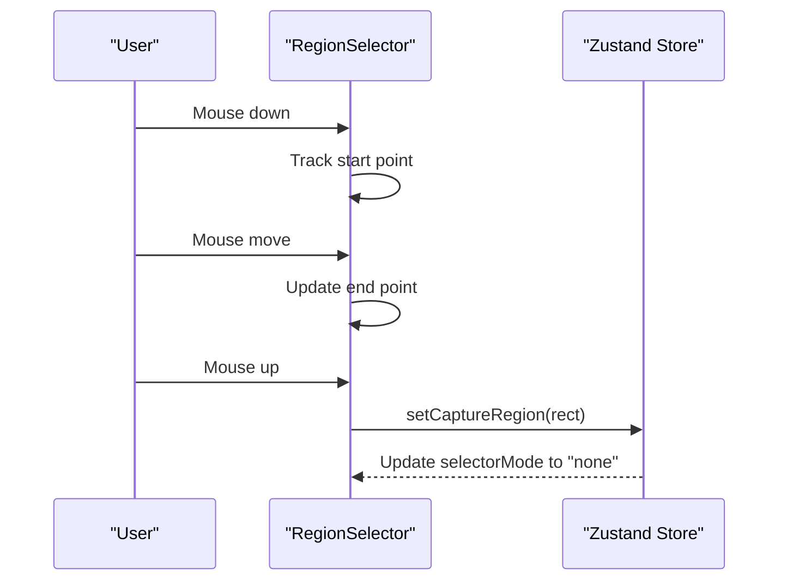

**Diagram sources**
- [src/components/RegionSelector.tsx:26-48](file://src/components/RegionSelector.tsx#L26-L48)
- [src/stores/recording.ts:265-281](file://src/stores/recording.ts#L265-L281)

**Section sources**
- [src/components/RegionSelector.tsx:1-141](file://src/components/RegionSelector.tsx#L1-L141)

### Status Bar and Audio Monitoring
The status bar displays system metrics and a horizontal loudness meter. Audio levels are polled periodically and rendered using a canvas-based meter.

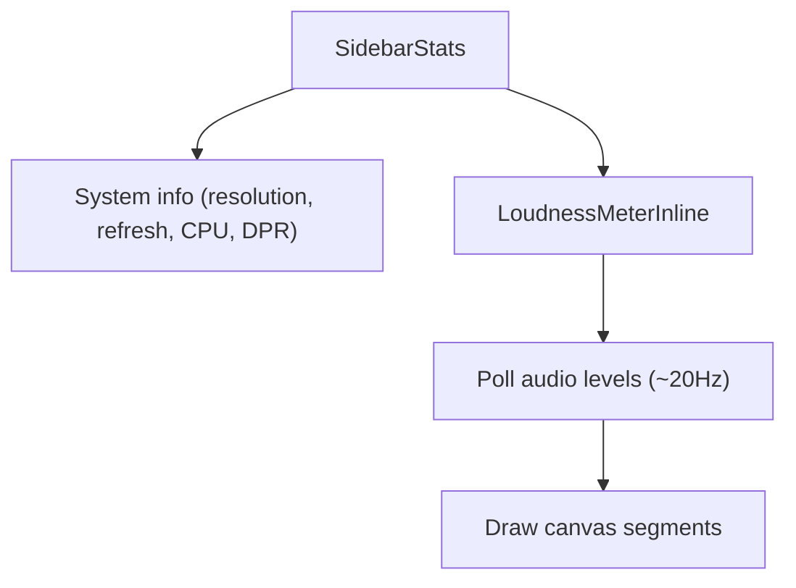

**Diagram sources**
- [src/components/StatusBar.tsx:68-171](file://src/components/StatusBar.tsx#L68-L171)
- [src/components/StatusBar.tsx:194-364](file://src/components/StatusBar.tsx#L194-L364)

**Section sources**
- [src/components/StatusBar.tsx:1-368](file://src/components/StatusBar.tsx#L1-L368)

### Toast Notifications
Toast notifications are managed by the store and rendered as floating alerts with optional actions.

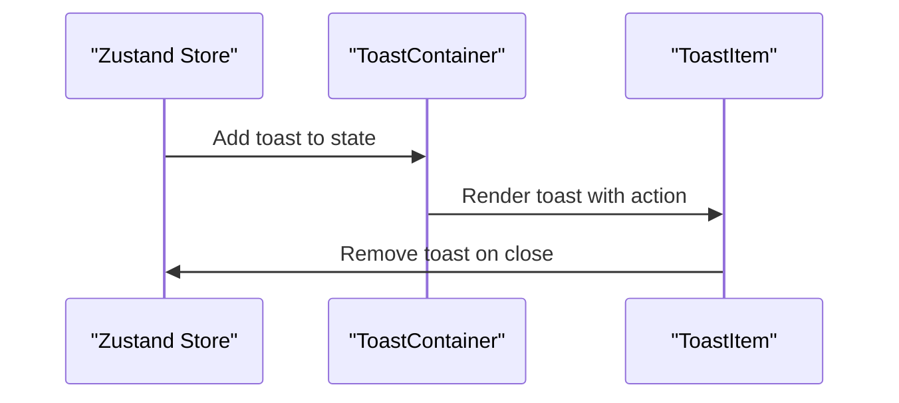

**Diagram sources**
- [src/components/Toast.tsx:5-18](file://src/components/Toast.tsx#L5-L18)
- [src/components/Toast.tsx:20-79](file://src/components/Toast.tsx#L20-L79)
- [src/stores/recording.ts:202-208](file://src/stores/recording.ts#L202-L208)

**Section sources**
- [src/components/Toast.tsx:1-79](file://src/components/Toast.tsx#L1-L79)

### Context Menus
A global context menu provider enables consistent right-click menus across the app, with convenience hooks for recording entries and general app actions.

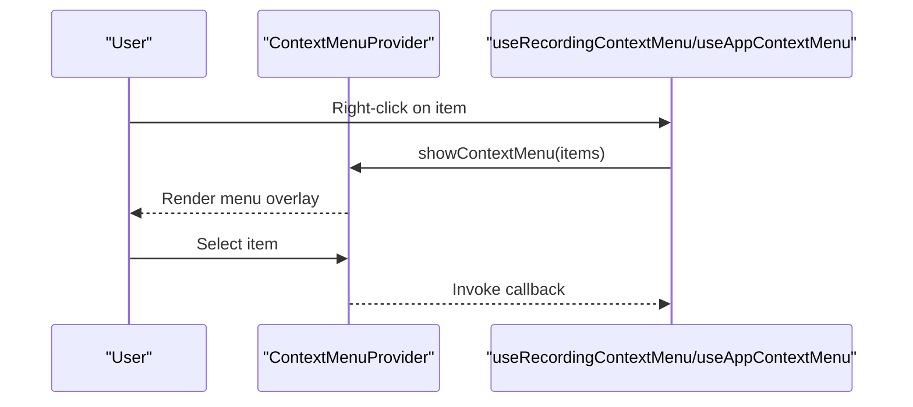

**Diagram sources**
- [src/components/ContextMenu.tsx:45-178](file://src/components/ContextMenu.tsx#L45-L178)
- [src/components/ContextMenu.tsx:183-230](file://src/components/ContextMenu.tsx#L183-L230)
- [src/components/ContextMenu.tsx:233-265](file://src/components/ContextMenu.tsx#L233-L265)

**Section sources**
- [src/components/ContextMenu.tsx:1-266](file://src/components/ContextMenu.tsx#L1-L266)

## Dependency Analysis
External dependencies and integrations:
- React 19.1.0 with TypeScript for component model
- Zustand 5.0.14 for state management
- TailwindCSS 4.3.0 for styling
- Motion for animations
- Tauri APIs for IPC and global shortcuts
- Canvas-based effects rendering

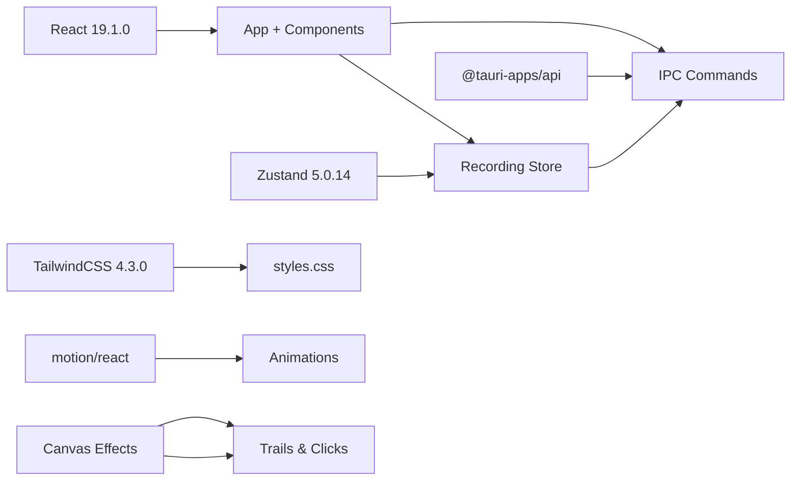

**Diagram sources**
- [package.json:12-26](file://package.json#L12-L26)
- [src/styles.css:1-301](file://src/styles.css#L1-L301)
- [src/lib/effects.ts:1-702](file://src/lib/effects.ts#L1-L702)

**Section sources**
- [package.json:1-36](file://package.json#L1-L36)
- [vite.config.ts:1-36](file://vite.config.ts#L1-L36)

## Performance Considerations
- Efficient polling: Audio levels are polled at ~20Hz globally, ensuring responsiveness without heavy overhead.
- Canvas rendering: Effects are drawn on demand and use efficient canvas operations; meter updates leverage requestAnimationFrame.
- Store granularity: Components subscribe only to necessary slices of state, minimizing re-renders.
- Overlay management: Region selector and webcam overlays are conditionally rendered and cleaned up on cancel or completion.
- Theme persistence: Theme initialization occurs before render to prevent FOUC and unnecessary reflows.

[No sources needed since this section provides general guidance]

## Troubleshooting Guide
Common issues and resolutions:
- IPC failures: The store wraps IPC calls with try/catch and adds toast notifications for failures. Check backend command availability and permissions.
- Webcam conflicts: The app listens for backend events to release browser webcam streams when the backend needs the device.
- Audio monitor errors: Audio monitor lifecycle is managed with start/stop helpers; ensure permissions and device availability.
- Encoding progress: The store polls encoding progress and stages; if stuck, verify backend encoding pipeline and disk write permissions.

**Section sources**
- [src/stores/recording.ts:308-336](file://src/stores/recording.ts#L308-L336)
- [src/App.tsx:42-54](file://src/App.tsx#L42-L54)
- [src/stores/recording.ts:382-395](file://src/stores/recording.ts#L382-L395)

## Conclusion
EasySpecy’s frontend combines a clean React component architecture with a centralized Zustand store, robust IPC integration, and a powerful visual effects engine. The design emphasizes responsiveness during recording, consistent theming, and a polished user experience through motion and audio feedback.