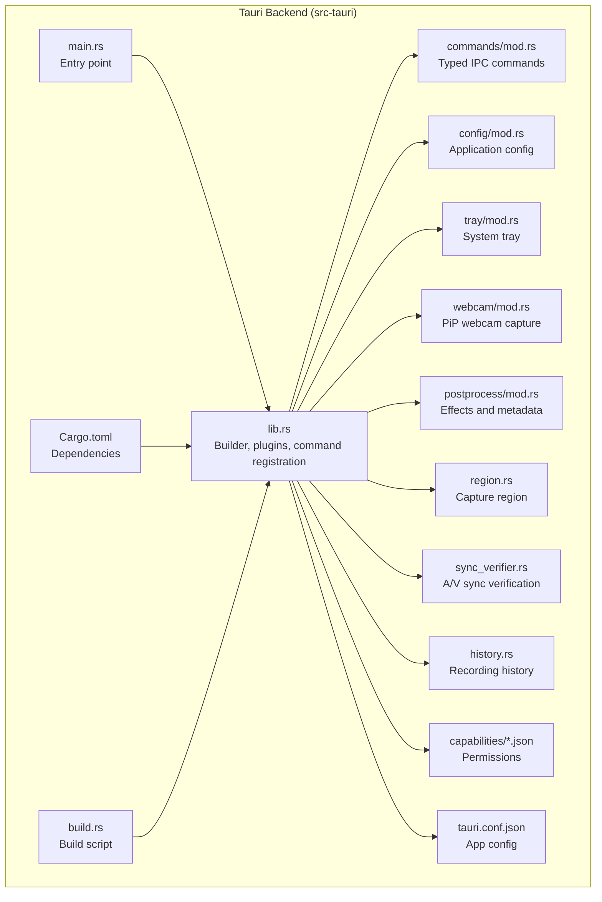
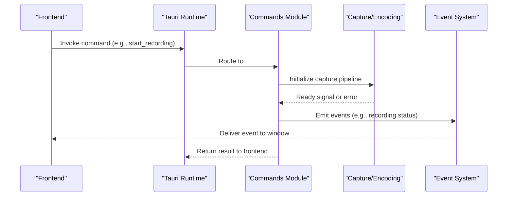
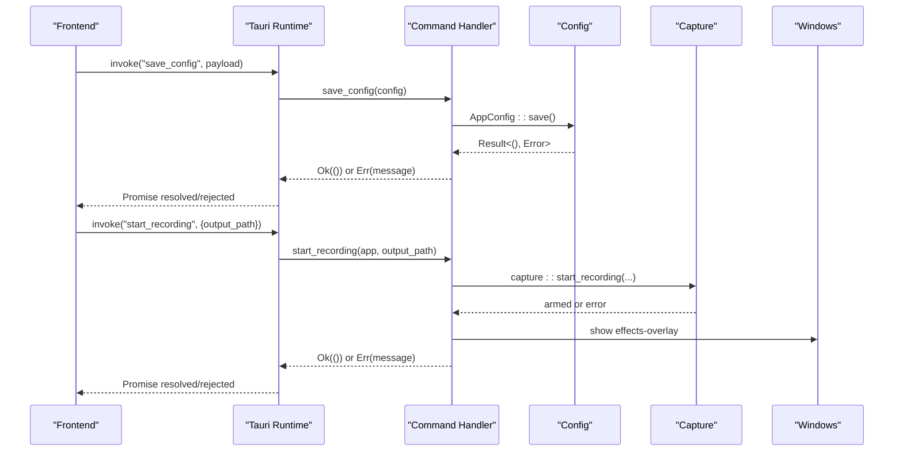
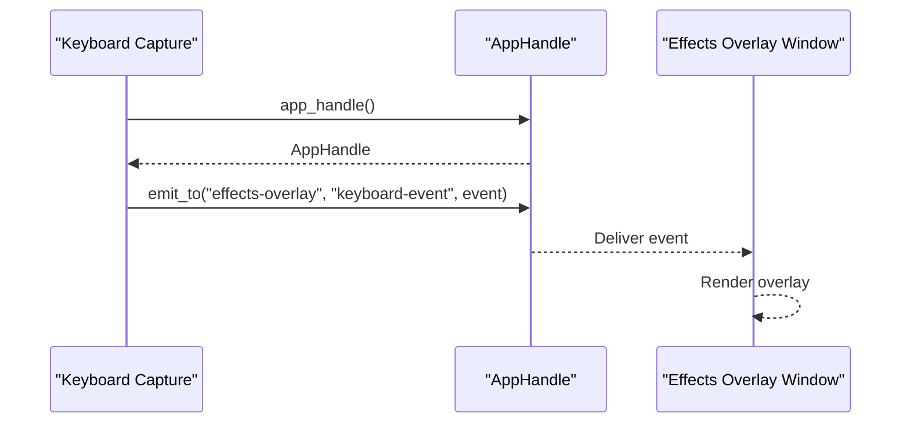
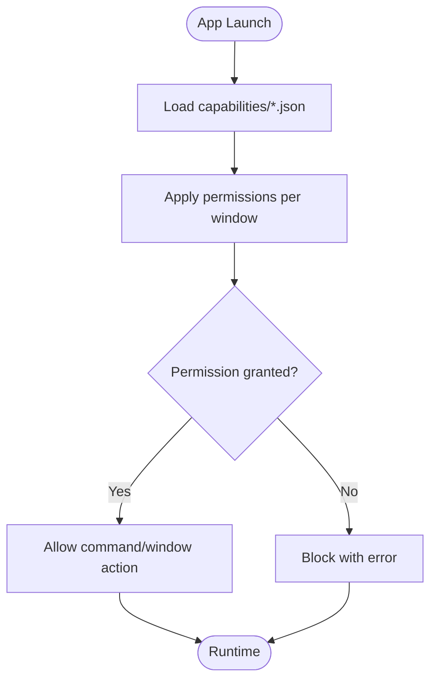
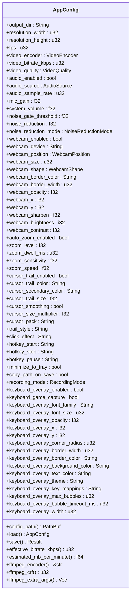
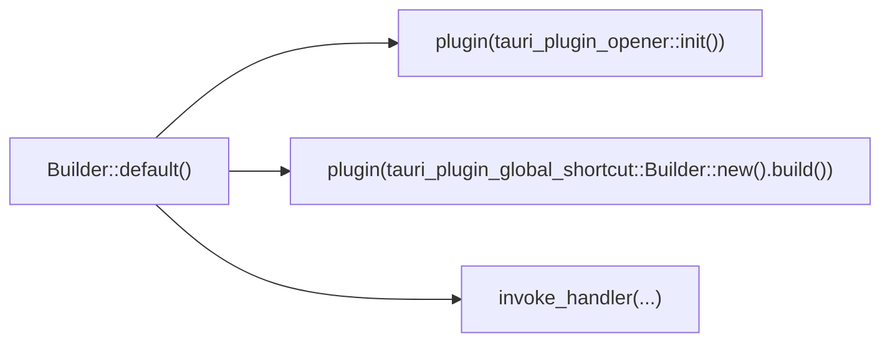
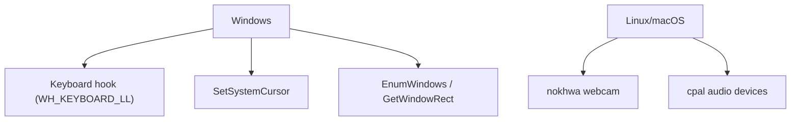
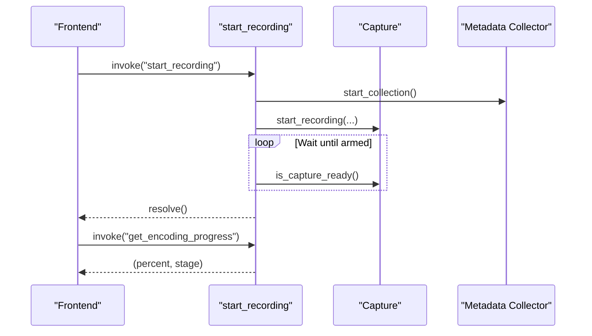
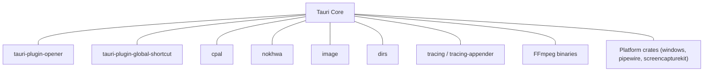

# Tauri Integration

<cite>
**Referenced Files in This Document**
- [Cargo.toml](file://src-tauri/Cargo.toml)
- [tauri.conf.json](file://src-tauri/tauri.conf.json)
- [lib.rs](file://src-tauri/src/lib.rs)
- [main.rs](file://src-tauri/src/main.rs)
- [mod.rs](file://src-tauri/src/commands/mod.rs)
- [default.json](file://src-tauri/capabilities/default.json)
- [overlay.json](file://src-tauri/capabilities/overlay.json)
- [mod.rs](file://src-tauri/src/config/mod.rs)
- [mod.rs](file://src-tauri/src/tray/mod.rs)
- [mod.rs](file://src-tauri/src/webcam/mod.rs)
- [mod.rs](file://src-tauri/src/postprocess/mod.rs)
- [mod.rs](file://src-tauri/src/history.rs)
- [mod.rs](file://src-tauri/src/region.rs)
- [mod.rs](file://src-tauri/src/sync_verifier.rs)
- [build.rs](file://src-tauri/build.rs)
</cite>

## Table of Contents
1. [Introduction](#introduction)
2. [Project Structure](#project-structure)
3. [Core Components](#core-components)
4. [Architecture Overview](#architecture-overview)
5. [Detailed Component Analysis](#detailed-component-analysis)
6. [Dependency Analysis](#dependency-analysis)
7. [Performance Considerations](#performance-considerations)
8. [Troubleshooting Guide](#troubleshooting-guide)
9. [Conclusion](#conclusion)
10. [Appendices](#appendices)

## Introduction
This document explains EasySpecy’s Tauri 2.0 integration architecture. It covers the command system design, inter-process communication (IPC) patterns, capability-based security model, configuration system, plugin architecture, and platform-specific implementations. It also details how the frontend communicates with backend services through typed commands, event emission patterns, and asynchronous operations, and how state synchronization is maintained between frontend and backend. Security and permission handling are explained with emphasis on isolating trusted and untrusted code.

## Project Structure
The Tauri backend is organized under src-tauri with a modular Rust architecture:
- Entry points: main.rs and lib.rs
- Feature modules: commands, config, tray, webcam, postprocess, region, sync_verifier
- Capability definitions: capabilities/*.json
- Configuration: tauri.conf.json
- Build: build.rs and Cargo.toml

**Diagram sources**
- [main.rs:1-7](file://src-tauri/src/main.rs#L1-L7)
- [lib.rs:1-208](file://src-tauri/src/lib.rs#L1-L208)
- [mod.rs:1-723](file://src-tauri/src/commands/mod.rs#L1-L723)
- [mod.rs:1-432](file://src-tauri/src/config/mod.rs#L1-L432)
- [mod.rs:1-56](file://src-tauri/src/tray/mod.rs#L1-L56)
- [mod.rs:1-620](file://src-tauri/src/webcam/mod.rs#L1-L620)
- [mod.rs:1-800](file://src-tauri/src/postprocess/mod.rs#L1-L800)
- [mod.rs:1-226](file://src-tauri/src/region.rs#L1-L226)
- [mod.rs:1-568](file://src-tauri/src/sync_verifier.rs#L1-L568)
- [mod.rs:1-64](file://src-tauri/src/history.rs#L1-L64)
- [default.json:1-21](file://src-tauri/capabilities/default.json#L1-L21)
- [overlay.json:1-1](file://src-tauri/capabilities/overlay.json#L1-L1)
- [tauri.conf.json:1-48](file://src-tauri/tauri.conf.json#L1-L48)
- [Cargo.toml:1-61](file://src-tauri/Cargo.toml#L1-L61)
- [build.rs:1-4](file://src-tauri/build.rs#L1-L4)

**Section sources**
- [main.rs:1-7](file://src-tauri/src/main.rs#L1-L7)
- [lib.rs:1-208](file://src-tauri/src/lib.rs#L1-L208)
- [tauri.conf.json:1-48](file://src-tauri/tauri.conf.json#L1-L48)
- [Cargo.toml:1-61](file://src-tauri/Cargo.toml#L1-L61)
- [build.rs:1-4](file://src-tauri/build.rs#L1-L4)

## Core Components
- Command system: Typed IPC commands registered via tauri::generate_handler! and annotated with #[tauri::command].
- Event emission: Emitter trait used to emit events to specific windows or globally.
- Plugins: tauri-plugin-opener and tauri-plugin-global-shortcut integrated during builder setup.
- Capability-based permissions: Defined in capabilities/*.json and enforced by Tauri’s security model.
- Configuration: AppConfig persisted as TOML with helpers to load/save and derive derived values.
- Platform-specific integrations: Windows-specific hooks and APIs for keyboard capture, cursor manipulation, and window enumeration.

**Section sources**
- [lib.rs:85-135](file://src-tauri/src/lib.rs#L85-L135)
- [mod.rs:11-723](file://src-tauri/src/commands/mod.rs#L11-L723)
- [mod.rs:9-55](file://src-tauri/src/tray/mod.rs#L9-L55)
- [default.json:1-21](file://src-tauri/capabilities/default.json#L1-L21)
- [overlay.json:1-1](file://src-tauri/capabilities/overlay.json#L1-L1)
- [mod.rs:244-431](file://src-tauri/src/config/mod.rs#L244-L431)

## Architecture Overview
The backend initializes logging, registers plugins, sets up the command handler, and launches the Tauri app. Commands orchestrate capture, effects, overlays, and post-processing. Events are emitted to frontend windows for UI updates and live overlays.

**Diagram sources**
- [lib.rs:85-135](file://src-tauri/src/lib.rs#L85-L135)
- [mod.rs:251-344](file://src-tauri/src/commands/mod.rs#L251-L344)
- [mod.rs:20-37](file://src-tauri/src/tray/mod.rs#L20-L37)

**Section sources**
- [lib.rs:37-136](file://src-tauri/src/lib.rs#L37-L136)
- [mod.rs:11-133](file://src-tauri/src/commands/mod.rs#L11-L133)

## Detailed Component Analysis

### Command System Design
- Registration: All commands are registered in lib.rs using tauri::generate_handler! and #[tauri::command] attributes.
- Typed parameters and return values: Commands accept strongly-typed parameters and return Result<T, String> for error propagation.
- Asynchronous operations: Commands like start_recording and stop_recording use async runtime and blocking tasks to avoid UI blocking.
- Example handlers: get_config, save_config, update_config_field, start_recording, stop_recording, get_recording_status, create_effects_overlay, destroy_effects_overlay, get_keyboard_events, detect_gpu_encoders, get_webcam_devices, open_path, get_audio_devices, get_screens, get_version, get_estimated_size, get_recording_history, clear_recording_history, delete_recording, set_capture_region, get_capture_region, clear_capture_region, get_windows, enter_region_mode, exit_region_mode, start_audio_monitor_cmd, stop_audio_monitor_cmd, get_audio_levels, create_webcam_overlay, destroy_webcam_overlay, apply_cursor_pack, restore_cursors, get_cursor_packs.

**Diagram sources**
- [lib.rs:88-127](file://src-tauri/src/lib.rs#L88-L127)
- [mod.rs:16-34](file://src-tauri/src/commands/mod.rs#L16-L34)
- [mod.rs:251-344](file://src-tauri/src/commands/mod.rs#L251-L344)

**Section sources**
- [lib.rs:88-127](file://src-tauri/src/lib.rs#L88-L127)
- [mod.rs:11-723](file://src-tauri/src/commands/mod.rs#L11-L723)

### IPC Communication Patterns and Event Emission
- Emitter trait: Used to emit events to specific windows (e.g., "effects-overlay") or globally.
- Tray events: System tray emits "tray-start-recording" and "tray-stop-recording".
- Keyboard overlay: Events are emitted directly to the effects overlay window to avoid Webview2 throttling.
- Global AppHandle: A OnceLock<AppHandle> enables emitting events from background threads.

**Diagram sources**
- [lib.rs:18-24](file://src-tauri/src/lib.rs#L18-L24)
- [mod.rs:228-236](file://src-tauri/src/keyboard.rs#L228-L236)

**Section sources**
- [mod.rs:9-55](file://src-tauri/src/tray/mod.rs#L9-L55)
- [mod.rs:114-137](file://src-tauri/src/keyboard.rs#L114-L137)
- [lib.rs:18-24](file://src-tauri/src/lib.rs#L18-L24)

### Capability-Based Security Model
- Capabilities define permissions for windows and APIs:
  - default.json: main window permissions including window controls and global shortcut registration.
  - overlay.json: effects overlay window with event listen/emit permissions.
- Enforced by Tauri’s security model at runtime.

**Diagram sources**
- [default.json:1-21](file://src-tauri/capabilities/default.json#L1-L21)
- [overlay.json:1-1](file://src-tauri/capabilities/overlay.json#L1-L1)

**Section sources**
- [default.json:1-21](file://src-tauri/capabilities/default.json#L1-L21)
- [overlay.json:1-1](file://src-tauri/capabilities/overlay.json#L1-L1)

### Configuration System
- AppConfig: Strongly-typed configuration persisted as TOML with defaults and derived values (e.g., effective bitrate, encoder mapping).
- Load/save: Methods to read/write configuration files with directory creation.
- Derived helpers: Effective bitrate calculation, encoder mapping, and extra FFmpeg arguments.

**Diagram sources**
- [mod.rs:5-93](file://src-tauri/src/config/mod.rs#L5-L93)
- [mod.rs:244-431](file://src-tauri/src/config/mod.rs#L244-L431)

**Section sources**
- [mod.rs:244-431](file://src-tauri/src/config/mod.rs#L244-L431)

### Plugin Architecture
- tauri-plugin-opener: Integrated via plugin initialization.
- tauri-plugin-global-shortcut: Integrated via Builder::new().build().
- Plugins are registered in lib.rs during builder setup.

**Diagram sources**
- [lib.rs:85-87](file://src-tauri/src/lib.rs#L85-L87)

**Section sources**
- [lib.rs:85-87](file://src-tauri/src/lib.rs#L85-L87)
- [Cargo.toml:26-49](file://src-tauri/Cargo.toml#L26-L49)

### Platform-Specific Implementations
- Windows:
  - Keyboard capture: WH_KEYBOARD_LL hook with message loop.
  - Cursor manipulation: SetSystemCursor via Win32 APIs.
  - Window enumeration and thumbnails: EnumWindows, GetWindowRect, BitBlt.
  - Administrative privileges: Relaunch as admin or standard user depending on settings.
- macOS/Linux:
  - Webcam capture: nokhwa camera capture.
  - Audio monitoring: cpal host and devices.

**Diagram sources**
- [mod.rs:139-278](file://src-tauri/src/keyboard.rs#L139-L278)
- [mod.rs:63-98](file://src-tauri/src/cursors/mod.rs#L63-L98)
- [mod.rs:36-89](file://src-tauri/src/region.rs#L36-L89)
- [mod.rs:407-580](file://src-tauri/src/webcam/mod.rs#L407-L580)
- [Cargo.toml:52-61](file://src-tauri/Cargo.toml#L52-L61)

**Section sources**
- [mod.rs:139-278](file://src-tauri/src/keyboard.rs#L139-L278)
- [mod.rs:63-98](file://src-tauri/src/cursors/mod.rs#L63-L98)
- [mod.rs:36-89](file://src-tauri/src/region.rs#L36-L89)
- [mod.rs:407-580](file://src-tauri/src/webcam/mod.rs#L407-L580)
- [Cargo.toml:52-61](file://src-tauri/Cargo.toml#L52-L61)

### State Synchronization Between Frontend and Backend
- Capture readiness: start_recording waits for capture to be armed before resolving, ensuring frontend timers align.
- Metadata collection: Cursor trails, clicks, window bounds, and keyboard events are recorded with timestamps synchronized to capture start.
- Encoding progress: get_encoding_progress returns progress and stage description.
- History: RecordingHistory persists entries with metadata for UI display.

**Diagram sources**
- [mod.rs:251-344](file://src-tauri/src/commands/mod.rs#L251-L344)
- [mod.rs:76-104](file://src-tauri/src/postprocess/mod.rs#L76-L104)

**Section sources**
- [mod.rs:251-344](file://src-tauri/src/commands/mod.rs#L251-L344)
- [mod.rs:76-104](file://src-tauri/src/postprocess/mod.rs#L76-L104)
- [mod.rs:23-63](file://src-tauri/src/history.rs#L23-L63)

### Error Propagation and Logging
- Commands return Result<T, String> to propagate errors to the frontend.
- Centralized logging to both stderr and file using tracing and tracing-appender.
- Windows elevation and relaunch logic handles privilege-related errors.

**Section sources**
- [mod.rs:16-34](file://src-tauri/src/commands/mod.rs#L16-L34)
- [lib.rs:49-82](file://src-tauri/src/lib.rs#L49-L82)
- [lib.rs:138-205](file://src-tauri/src/lib.rs#L138-L205)

## Dependency Analysis
External dependencies include Tauri core, plugins, media libraries, and platform-specific crates. The build system integrates tauri_build.

**Diagram sources**
- [Cargo.toml:26-61](file://src-tauri/Cargo.toml#L26-L61)

**Section sources**
- [Cargo.toml:26-61](file://src-tauri/Cargo.toml#L26-L61)
- [build.rs:1-4](file://src-tauri/build.rs#L1-L4)

## Performance Considerations
- Asynchronous command handling: Long-running tasks are executed on background threads to avoid blocking the UI.
- Producer-consumer webcam pipeline: Captures frames as fast as the camera delivers and writes asynchronously to disk.
- Parallel rendering: Rayon is used for parallel frame rendering in post-processing.
- Minimal UI thread work: Heavy lifting is delegated to worker threads and FFmpeg subprocesses.

[No sources needed since this section provides general guidance]

## Troubleshooting Guide
- Permission denied or blocked actions: Verify capabilities/*.json permissions for the target window.
- Keyboard overlay not working: Ensure Windows keyboard hook is supported and not blocked by security software.
- Webcam capture failures: Confirm camera availability and permissions; check error messages from webcam capture thread.
- A/V desync: Use sync_verifier to diagnose duration drift, start offsets, and ratios.
- Logging: Check logs in the application’s executable directory under logs/easyspecy.log.

**Section sources**
- [overlay.json:1-1](file://src-tauri/capabilities/overlay.json#L1-L1)
- [mod.rs:41-101](file://src-tauri/src/webcam/mod.rs#L41-L101)
- [mod.rs:81-250](file://src-tauri/src/sync_verifier.rs#L81-L250)
- [lib.rs:49-82](file://src-tauri/src/lib.rs#L49-L82)

## Conclusion
EasySpecy’s Tauri 2.0 integration leverages a typed command system, capability-based permissions, and robust event emission to provide a secure and performant desktop application. The architecture cleanly separates concerns across modules for capture, effects, configuration, and platform-specific features, while maintaining strong state synchronization and comprehensive error reporting.

## Appendices
- Example command registration: See lib.rs invoke_handler registration.
- Capability examples: default.json and overlay.json define permissions for main and effects overlay windows.
- Build configuration: tauri_build is invoked via build.rs.

**Section sources**
- [lib.rs:88-127](file://src-tauri/src/lib.rs#L88-L127)
- [default.json:1-21](file://src-tauri/capabilities/default.json#L1-L21)
- [overlay.json:1-1](file://src-tauri/capabilities/overlay.json#L1-L1)
- [build.rs:1-4](file://src-tauri/build.rs#L1-L4)