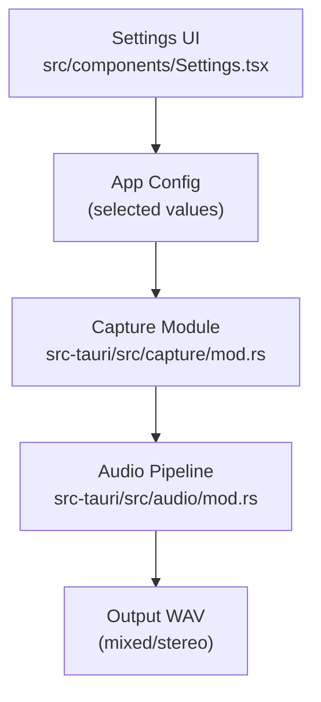
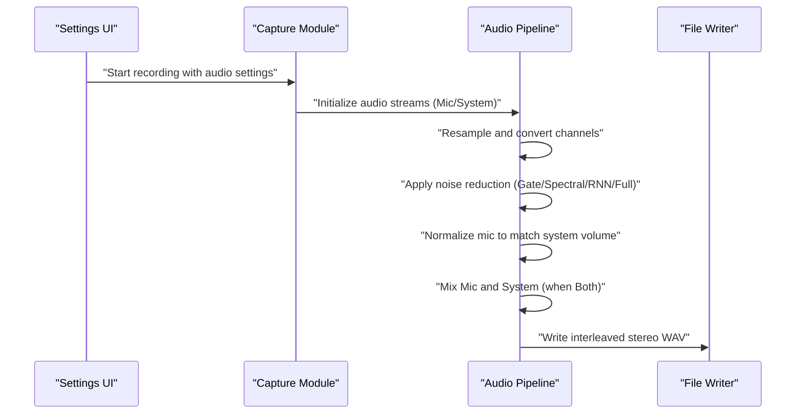
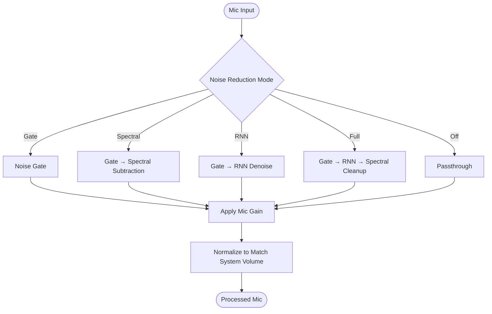
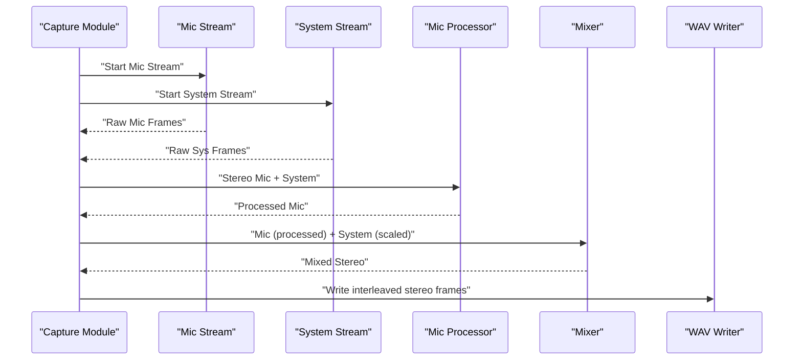
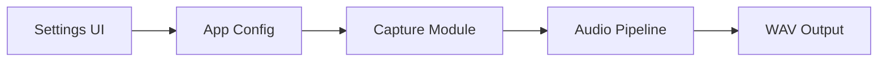

# Audio Settings

<cite>
**Referenced Files in This Document**
- [Settings.tsx](file://src/components/Settings.tsx)
- [mod.rs](file://src-tauri/src/audio/mod.rs)
- [mod.rs](file://src-tauri/src/capture/mod.rs)
</cite>

## Table of Contents
1. [Introduction](#introduction)
2. [Project Structure](#project-structure)
3. [Core Components](#core-components)
4. [Architecture Overview](#architecture-overview)
5. [Detailed Component Analysis](#detailed-component-analysis)
6. [Dependency Analysis](#dependency-analysis)
7. [Performance Considerations](#performance-considerations)
8. [Troubleshooting Guide](#troubleshooting-guide)
9. [Conclusion](#conclusion)

## Introduction
This document explains the EasySpecy audio configuration system. It covers how audio sources are selected, how sample rates are configured, how microphone gain and system audio mixing levels are controlled, and how audio devices are chosen. It also documents the noise reduction pipeline, including the noise gate threshold, noise reduction strength, and processing modes (Off, Gate, Spectral, RNN, Full). Finally, it describes the audio processing chain from capture through mixing to output, provides practical examples for different recording environments, and offers guidance on latency optimization and device compatibility.

## Project Structure
The audio configuration UI is implemented in the frontend React component, while the backend Rust audio capture and processing logic resides in the Tauri module. The capture module orchestrates audio capture and integrates with the audio processing pipeline.

**Diagram sources**
- [Settings.tsx:244-320](file://src/components/Settings.tsx#L244-L320)
- [mod.rs:222-230](file://src-tauri/src/capture/mod.rs#L222-L230)
- [mod.rs:485-500](file://src-tauri/src/audio/mod.rs#L485-L500)

**Section sources**
- [Settings.tsx:244-320](file://src/components/Settings.tsx#L244-L320)
- [mod.rs:222-230](file://src-tauri/src/capture/mod.rs#L222-L230)

## Core Components
- Audio Source Selection
  - Options: Microphone, System Audio, Both
  - Toggles whether to capture microphone, system audio, or mix both
- Sample Rate Options
  - Values: 22050 Hz, 44100 Hz, 48000 Hz
  - Affects quality and CPU usage
- Microphone Gain Control
  - Range: 0.0–3.0
  - Multiplier applied after noise reduction and normalization
- System Audio Mixing Level
  - Range: 0.0–1.0
  - Applied when capturing System or Both
- Audio Device Selection
  - Microphone device selector with “System Default” and discovered devices
- Noise Reduction Pipeline
  - Noise Gate Threshold: 0.0–1.0
  - Denoising Algorithm: Off, Gate, Spectral, RNN, Full
  - Noise Reduction Strength: 0.0–1.0

**Section sources**
- [Settings.tsx:258-278](file://src/components/Settings.tsx#L258-L278)
- [Settings.tsx:280-289](file://src/components/Settings.tsx#L280-L289)
- [Settings.tsx:290-297](file://src/components/Settings.tsx#L290-L297)
- [Settings.tsx:301-320](file://src/components/Settings.tsx#L301-L320)

## Architecture Overview
The audio processing chain begins in the capture module, which initializes audio streams according to the selected source. The audio pipeline performs resampling, channel conversion, optional noise reduction, and mixing. The resulting interleaved stereo audio is written to the output WAV file.

**Diagram sources**
- [mod.rs:222-230](file://src-tauri/src/capture/mod.rs#L222-L230)
- [mod.rs:471-500](file://src-tauri/src/audio/mod.rs#L471-L500)
- [mod.rs:736-816](file://src-tauri/src/audio/mod.rs#L736-L816)

## Detailed Component Analysis

### Audio Source Selection and Device Choice
- Source options:
  - Microphone: captures only the selected microphone device
  - System: captures system audio output
  - Both: captures both microphone and system audio and mixes them
- Device selection:
  - Microphone device selector supports “System Default” and discovered devices
- Backend mapping:
  - The capture module maps UI strings to internal audio source enums and starts appropriate streams

**Section sources**
- [Settings.tsx:258-268](file://src/components/Settings.tsx#L258-L268)
- [Settings.tsx:280-289](file://src/components/Settings.tsx#L280-L289)
- [mod.rs:222-226](file://src-tauri/src/capture/mod.rs#L222-L226)

### Sample Rate Configuration
- Supported sample rates: 22050 Hz, 44100 Hz, 48000 Hz
- The capture module logs the configured sample rate during startup
- Resampling occurs per source before mixing to a unified output rate

**Section sources**
- [Settings.tsx:269-278](file://src/components/Settings.tsx#L269-L278)
- [mod.rs:202-205](file://src-tauri/src/capture/mod.rs#L202-L205)
- [mod.rs:471-479](file://src-tauri/src/audio/mod.rs#L471-L479)

### Microphone Gain and System Volume
- Microphone Gain:
  - Range: 0.0–3.0
  - Applied after noise reduction and normalization
- System Volume:
  - Range: 0.0–1.0
  - Applied when capturing System or Both; clamped to [0.0, 1.0] during mixing

**Section sources**
- [Settings.tsx:290-297](file://src/components/Settings.tsx#L290-L297)
- [mod.rs:496-498](file://src-tauri/src/audio/mod.rs#L496-L498)
- [mod.rs:805-810](file://src-tauri/src/audio/mod.rs#L805-L810)

### Noise Reduction Pipeline
- Noise Gate Threshold:
  - Range: 0.0–1.0
  - When > 0, a noise gate is applied with adaptive envelope shaping
- Denoising Algorithm Modes:
  - Off: passthrough
  - Gate: noise gate only
  - Spectral: noise gate + spectral subtraction
  - RNN: noise gate + RNN-based denoising
  - Full: noise gate + RNN + spectral cleanup
- Noise Reduction Strength:
  - Range: 0.0–1.0
  - Controls aggressiveness of spectral subtraction and RNN blending

**Diagram sources**
- [mod.rs:736-816](file://src-tauri/src/audio/mod.rs#L736-L816)
- [mod.rs:827-882](file://src-tauri/src/audio/mod.rs#L827-L882)
- [mod.rs:884-900](file://src-tauri/src/audio/mod.rs#L884-L900)

**Section sources**
- [Settings.tsx:301-320](file://src/components/Settings.tsx#L301-L320)
- [mod.rs:736-816](file://src-tauri/src/audio/mod.rs#L736-L816)
- [mod.rs:827-882](file://src-tauri/src/audio/mod.rs#L827-L882)
- [mod.rs:884-900](file://src-tauri/src/audio/mod.rs#L884-L900)

### Audio Processing Chain: Capture to Output
- Initialization:
  - Audio streams are created and started early to reduce latency
  - Video capture waits for audio to arm synchronization
- Resampling and Channel Conversion:
  - Each source is resampled to the output rate and converted to stereo
- Mixing (Both Mode):
  - Mic is processed via the noise reduction pipeline
  - System audio is optionally scaled by system volume
  - Mixed by overlapping samples at equal length
- Final Output:
  - Interleaved stereo WAV written to disk

**Diagram sources**
- [mod.rs:218-230](file://src-tauri/src/capture/mod.rs#L218-L230)
- [mod.rs:471-500](file://src-tauri/src/audio/mod.rs#L471-L500)
- [mod.rs:485-500](file://src-tauri/src/audio/mod.rs#L485-L500)

**Section sources**
- [mod.rs:218-230](file://src-tauri/src/capture/mod.rs#L218-L230)
- [mod.rs:471-500](file://src-tauri/src/audio/mod.rs#L471-L500)
- [mod.rs:485-500](file://src-tauri/src/audio/mod.rs#L485-L500)

## Dependency Analysis
- UI-to-Backend Mapping:
  - Settings UI updates configuration values stored in the app config
  - Capture module reads configuration to initialize audio streams and mixing behavior
- Internal Dependencies:
  - Audio pipeline depends on configuration for noise reduction mode, thresholds, and gains
  - Mixing depends on resampling and channel conversion results

**Diagram sources**
- [Settings.tsx:244-320](file://src/components/Settings.tsx#L244-L320)
- [mod.rs:222-230](file://src-tauri/src/capture/mod.rs#L222-L230)
- [mod.rs:471-500](file://src-tauri/src/audio/mod.rs#L471-L500)

**Section sources**
- [Settings.tsx:244-320](file://src/components/Settings.tsx#L244-L320)
- [mod.rs:222-230](file://src-tauri/src/capture/mod.rs#L222-L230)
- [mod.rs:471-500](file://src-tauri/src/audio/mod.rs#L471-L500)

## Performance Considerations
- Latency Optimization
  - Audio streams are initialized early and kept ready to minimize capture latency
  - Synchronization with the first video frame ensures precise timing
- CPU and Quality Trade-offs
  - Higher sample rates increase CPU usage
  - RNN-based denoising is more computationally intensive than spectral subtraction
- Practical Tips
  - Prefer 44100 Hz for balanced quality and performance
  - Use Spectral mode for general environments; switch to RNN or Full for challenging noise conditions
  - Keep system volume moderate to avoid clipping during mixing

[No sources needed since this section provides general guidance]

## Troubleshooting Guide
- No Audio Captured
  - Verify Audio Source is enabled and set appropriately
  - Ensure the correct microphone device is selected
- Low Mic Volume
  - Increase Microphone Gain (0.0–3.0)
  - Confirm system default device is correct
- Background Noise or Hiss
  - Raise Noise Gate Threshold slightly above ambient noise
  - Increase Noise Reduction Strength gradually
  - Try Spectral or RNN modes for stronger suppression
- Muffled or Uneven Levels (Both Mode)
  - Adjust System Volume (0.0–1.0) to balance with microphone
  - Normalize mic loudness to match system audio automatically applied in processing
- Device Contention
  - Close other applications using the microphone
  - On Windows, ensure WASAPI handles are released properly after stopping

**Section sources**
- [Settings.tsx:246-297](file://src/components/Settings.tsx#L246-L297)
- [Settings.tsx:301-320](file://src/components/Settings.tsx#L301-L320)
- [mod.rs:485-500](file://src-tauri/src/audio/mod.rs#L485-L500)
- [mod.rs:812-816](file://src-tauri/src/audio/mod.rs#L812-L816)

## Conclusion
EasySpecy’s audio system provides flexible source selection, adjustable sample rates, precise gain and mixing controls, and a robust noise reduction pipeline. By tuning the noise gate threshold, selecting appropriate denoising modes, and balancing system and microphone volumes, users can achieve clean, professional-quality recordings across diverse environments. Proper latency management and device configuration further enhance reliability and performance.