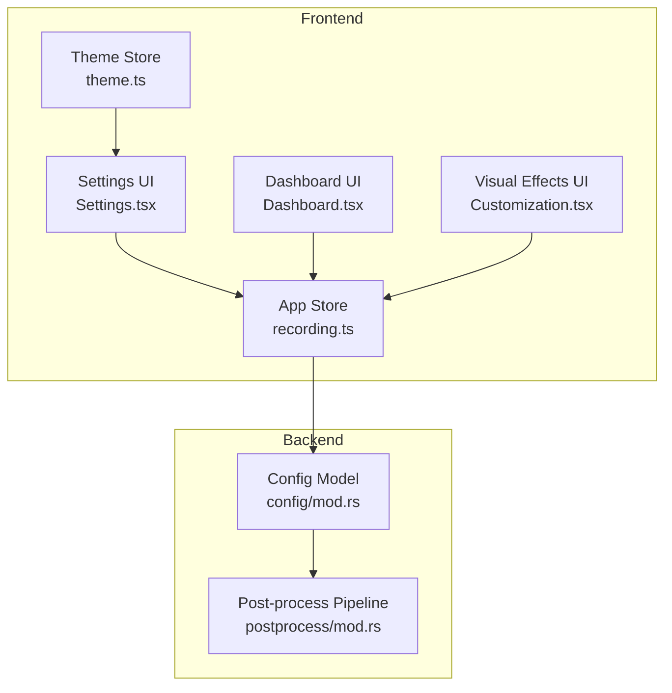
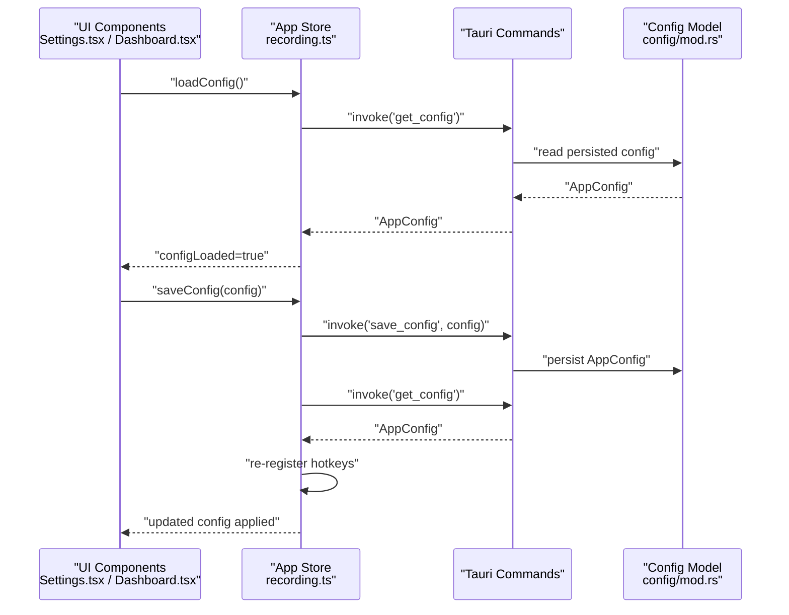
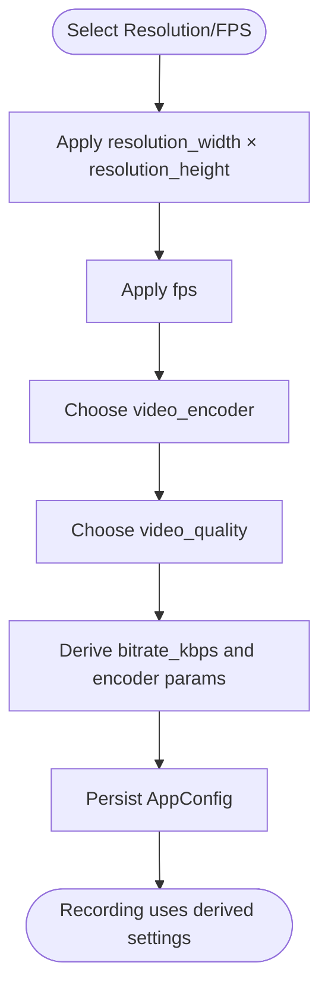
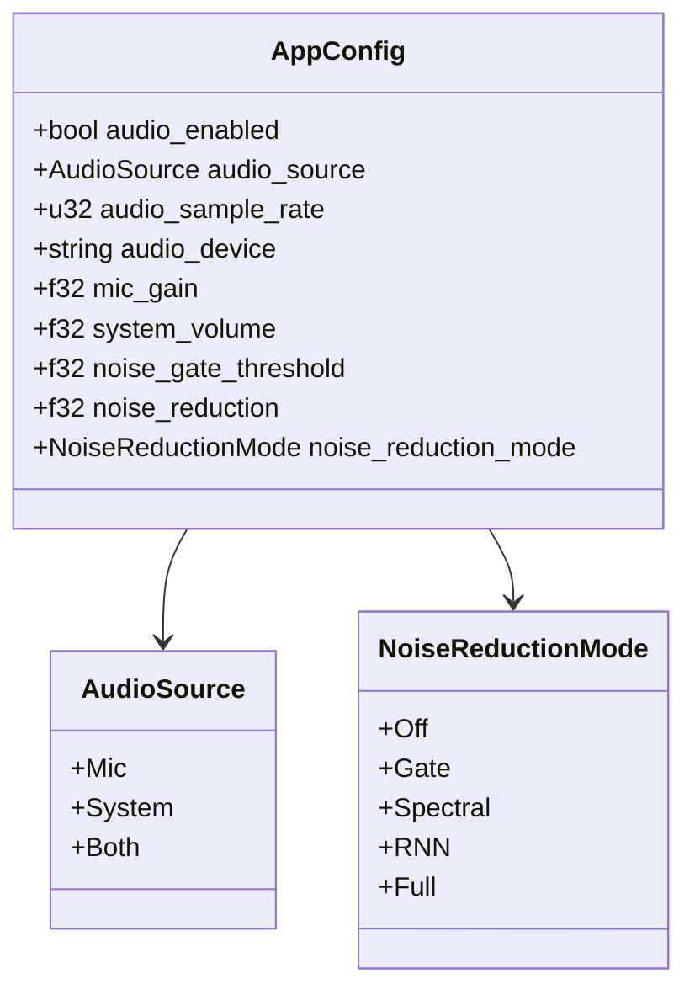
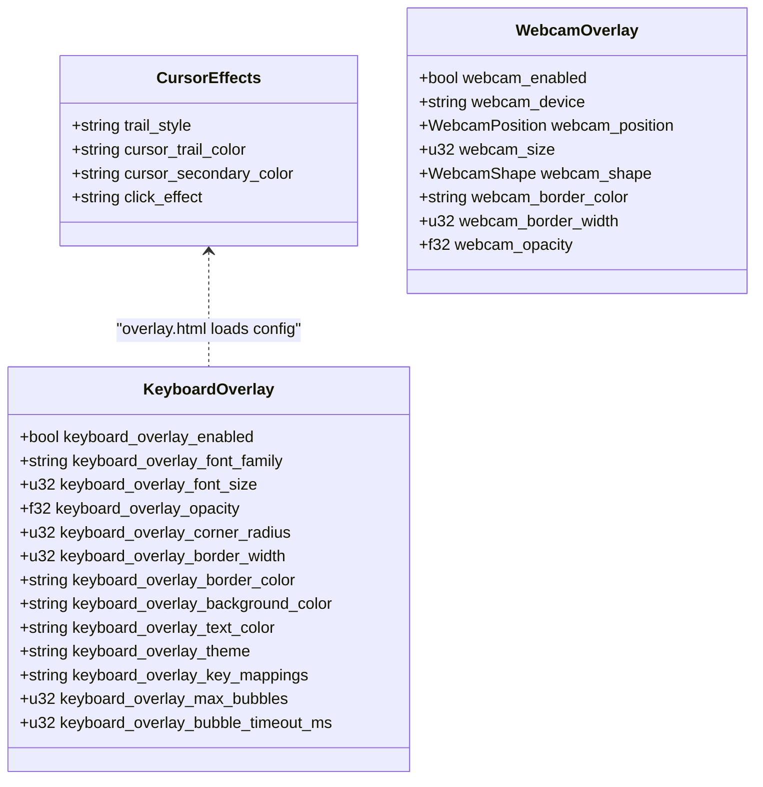
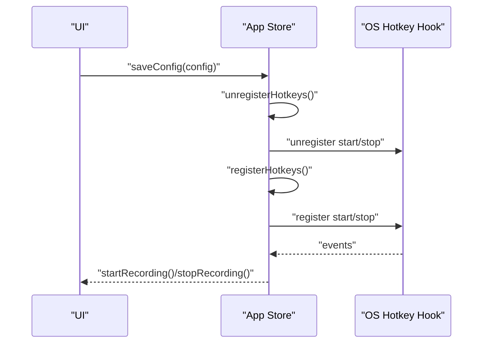
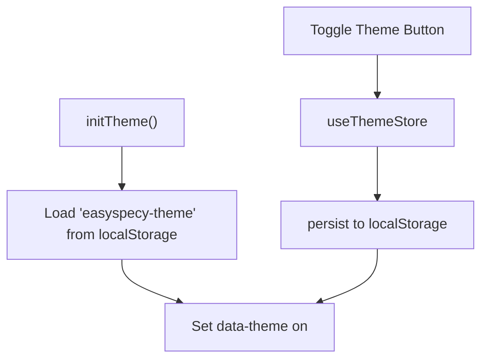
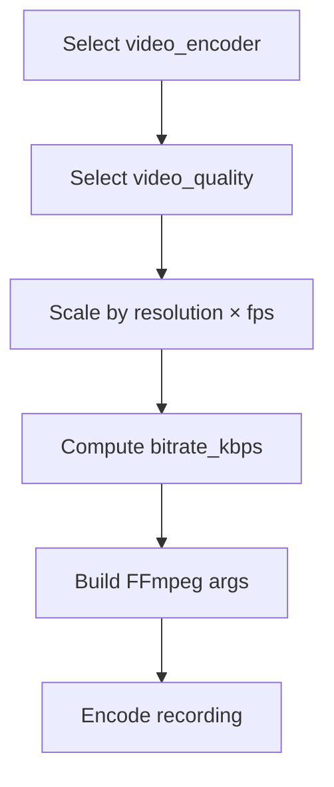
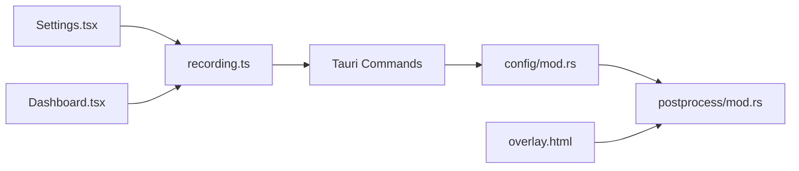

# Configuration & Customization

<cite>
**Referenced Files in This Document**
- [config/mod.rs](file://src-tauri/src/config/mod.rs)
- [recording.ts](file://src/stores/recording.ts)
- [Settings.tsx](file://src/components/Settings.tsx)
- [Dashboard.tsx](file://src/components/Dashboard.tsx)
- [Customization.tsx](file://src/components/Customization.tsx)
- [overlay.html](file://public/overlay.html)
- [KeyboardPreview.tsx](file://src/components/KeyboardPreview.tsx)
- [theme.ts](file://src/lib/theme.ts)
- [App.tsx](file://src/App.tsx)
- [postprocess/mod.rs](file://src-tauri/src/postprocess/mod.rs)
</cite>

## Table of Contents
1. [Introduction](#introduction)
2. [Project Structure](#project-structure)
3. [Core Components](#core-components)
4. [Architecture Overview](#architecture-overview)
5. [Detailed Component Analysis](#detailed-component-analysis)
6. [Dependency Analysis](#dependency-analysis)
7. [Performance Considerations](#performance-considerations)
8. [Troubleshooting Guide](#troubleshooting-guide)
9. [Conclusion](#conclusion)

## Introduction
This document explains how EasySpecy persists and applies application configuration across recording quality, audio, visual effects, hotkeys, themes, and performance tuning. It covers the configuration model, default values, runtime application, and practical scenarios for common setups.

## Project Structure
Configuration spans frontend React components and backend Tauri Rust modules:
- Frontend stores and UI components manage user-facing configuration and apply updates via Tauri commands.
- Backend Rust modules define the canonical configuration schema, defaults, and derive derived values (bitrates, FFmpeg arguments).
- Post-processing pipeline consumes configuration to render cursor trails and effects.

**Diagram sources**
- [Settings.tsx:191-293](file://src/components/Settings.tsx#L191-L293)
- [Dashboard.tsx:458-514](file://src/components/Dashboard.tsx#L458-L514)
- [Customization.tsx:468-492](file://src/components/Customization.tsx#L468-L492)
- [recording.ts:210-234](file://src/stores/recording.ts#L210-L234)
- [theme.ts:12-35](file://src/lib/theme.ts#L12-L35)
- [config/mod.rs:1-188](file://src-tauri/src/config/mod.rs#L1-L188)
- [postprocess/mod.rs:85-104](file://src-tauri/src/postprocess/mod.rs#L85-L104)

**Section sources**
- [config/mod.rs:1-188](file://src-tauri/src/config/mod.rs#L1-L188)
- [recording.ts:210-234](file://src/stores/recording.ts#L210-L234)
- [Settings.tsx:191-293](file://src/components/Settings.tsx#L191-L293)
- [Dashboard.tsx:458-514](file://src/components/Dashboard.tsx#L458-L514)
- [Customization.tsx:468-492](file://src/components/Customization.tsx#L468-L492)
- [theme.ts:12-35](file://src/lib/theme.ts#L12-L35)

## Core Components
- Configuration schema and defaults: Defines all settings, including output directory, resolution, frame rate, encoders, audio sources and levels, webcam overlay, cursor trail and click effects, keyboard overlay, hotkeys, and theme.
- Runtime persistence and application: Frontend invokes Tauri commands to load/save/update configuration; backend validates and persists to disk; frontend re-fetches and re-registers hotkeys after saving.
- Derived values: Backend computes bitrate targets and FFmpeg arguments from encoder and quality presets, scaling by resolution and frame rate.
- Post-processing effects: Backend renders cursor trails and click effects using configured colors and styles.

**Section sources**
- [config/mod.rs:1-188](file://src-tauri/src/config/mod.rs#L1-L188)
- [recording.ts:210-234](file://src/stores/recording.ts#L210-L234)
- [postprocess/mod.rs:85-104](file://src-tauri/src/postprocess/mod.rs#L85-L104)

## Architecture Overview
The configuration lifecycle:
- UI reads current configuration via a Tauri command.
- User edits settings in Settings or Dashboard panels.
- UI saves configuration via a Tauri command; store reloads config and re-registers hotkeys.
- Backend validates and persists configuration to disk.
- Recording pipeline and post-processing consume configuration to render output.

**Diagram sources**
- [recording.ts:210-234](file://src/stores/recording.ts#L210-L234)
- [config/mod.rs:1-188](file://src-tauri/src/config/mod.rs#L1-L188)

## Detailed Component Analysis

### Recording Quality Settings
- Resolutions: 480p, 720p, 1080p are selectable in the dashboard and mapped to width×height values.
- Frame rates: 24, 30, 60 fps are selectable and influence bitrate calculations.
- Encoders: AV1, AV1 NVENC, H.265, H.265 NVENC, H.264, H.264 NVENC, VP9.
- Quality presets: Insane, Low, Medium, High, Ultra; backend derives bitrate and encoder-specific parameters from presets and scales by resolution and frame rate.

**Diagram sources**
- [Dashboard.tsx:458-514](file://src/components/Dashboard.tsx#L458-L514)
- [config/mod.rs:283-392](file://src-tauri/src/config/mod.rs#L283-L392)

**Section sources**
- [Dashboard.tsx:458-514](file://src/components/Dashboard.tsx#L458-L514)
- [config/mod.rs:283-392](file://src-tauri/src/config/mod.rs#L283-L392)

### Audio Configuration
- Sources: Microphone, System audio, Both, Off.
- Sample rates: 22050, 44100, 48000 Hz.
- Devices: System default or specific device ID.
- Processing: Mic gain multiplier, system volume mix ratio, noise gate threshold, noise reduction strength and mode.
- Backend derives bitrate and FFmpeg arguments based on encoder and quality; frontend exposes controls for sample rate, device, and gain.

**Diagram sources**
- [config/mod.rs:19-31](file://src-tauri/src/config/mod.rs#L19-L31)
- [config/mod.rs:147-152](file://src-tauri/src/config/mod.rs#L147-L152)

**Section sources**
- [Settings.tsx:269-293](file://src/components/Settings.tsx#L269-L293)
- [config/mod.rs:19-31](file://src-tauri/src/config/mod.rs#L19-L31)

### Visual Effects Customization
- Cursor trail: Style and color; secondary color for right-click and gradients.
- Click animations: Type and color.
- Webcam overlay: Position, size, shape, border, opacity, device, and color.
- Keyboard overlay: Enabled, font family/size, opacity, corner radius, border, background, text color, theme, key mappings, bubble count and timeout.

**Diagram sources**
- [overlay.html:490-516](file://public/overlay.html#L490-L516)
- [overlay.html:505-675](file://public/overlay.html#L505-L675)
- [Customization.tsx:468-492](file://src/components/Customization.tsx#L468-L492)

**Section sources**
- [Customization.tsx:468-492](file://src/components/Customization.tsx#L468-L492)
- [overlay.html:490-516](file://public/overlay.html#L490-L516)
- [overlay.html:505-675](file://public/overlay.html#L505-L675)

### Hotkey Configuration System
- Hotkeys are part of the configuration and are re-registered after saving to reflect changes.
- The store registers start/stop hotkeys and triggers recording actions.

**Diagram sources**
- [recording.ts:218-225](file://src/stores/recording.ts#L218-L225)
- [recording.ts:236-245](file://src/stores/recording.ts#L236-L245)

**Section sources**
- [recording.ts:218-225](file://src/stores/recording.ts#L218-L225)
- [recording.ts:236-245](file://src/stores/recording.ts#L236-L245)

### Theme Selection (Dark/Light Mode)
- Theme state is managed by a Zustand store with persistence to localStorage.
- UI toggles theme and initializes from persisted storage on load.

**Diagram sources**
- [theme.ts:38-50](file://src/lib/theme.ts#L38-L50)
- [theme.ts:12-35](file://src/lib/theme.ts#L12-L35)
- [App.tsx:140-158](file://src/App.tsx#L140-L158)

**Section sources**
- [theme.ts:38-50](file://src/lib/theme.ts#L38-L50)
- [theme.ts:12-35](file://src/lib/theme.ts#L12-L35)
- [App.tsx:140-158](file://src/App.tsx#L140-L158)

### Performance Tuning Options
- Encoder selection influences CPU/GPU usage and compression efficiency.
- Quality presets map to bitrate targets and encoder parameters; higher quality increases file size and CPU/GPU load.
- Bitrate scaling accounts for resolution and frame rate.
- Audio processing includes noise reduction and gate thresholds to balance quality and CPU usage.

**Diagram sources**
- [config/mod.rs:283-392](file://src-tauri/src/config/mod.rs#L283-L392)

**Section sources**
- [config/mod.rs:283-392](file://src-tauri/src/config/mod.rs#L283-L392)

## Dependency Analysis
Configuration dependencies and interactions:
- Frontend store depends on backend Tauri commands for loading/saving/updating configuration.
- Backend configuration model defines defaults and derived values consumed by the recording pipeline and post-processing.
- Post-processing pipeline reads cursor and click effect configuration to render overlays.

**Diagram sources**
- [Settings.tsx:191-293](file://src/components/Settings.tsx#L191-L293)
- [Dashboard.tsx:458-514](file://src/components/Dashboard.tsx#L458-L514)
- [recording.ts:210-234](file://src/stores/recording.ts#L210-L234)
- [config/mod.rs:1-188](file://src-tauri/src/config/mod.rs#L1-L188)
- [postprocess/mod.rs:85-104](file://src-tauri/src/postprocess/mod.rs#L85-L104)
- [overlay.html:490-516](file://public/overlay.html#L490-L516)

**Section sources**
- [recording.ts:210-234](file://src/stores/recording.ts#L210-L234)
- [config/mod.rs:1-188](file://src-tauri/src/config/mod.rs#L1-L188)
- [postprocess/mod.rs:85-104](file://src-tauri/src/postprocess/mod.rs#L85-L104)
- [overlay.html:490-516](file://public/overlay.html#L490-L516)

## Performance Considerations
- Lower resolutions and frame rates reduce bitrate and CPU/GPU load.
- GPU-accelerated encoders (NVENC variants) improve performance on supported hardware.
- Quality presets directly impact file size and encoding time; choose based on storage and performance needs.
- Audio noise reduction and gating add CPU overhead; adjust thresholds to balance quality and performance.

[No sources needed since this section provides general guidance]

## Troubleshooting Guide
- Configuration not applying after save:
  - Verify the save operation completes and the store reloads configuration; hotkeys are unregistered and re-registered after saving.
  - Check for errors surfaced by the store’s toast notifications.
- Audio issues:
  - Confirm microphone/system device selection and gain levels.
  - Adjust noise gate and reduction settings if background noise is present.
- Visual effects not visible:
  - Ensure overlay configuration is enabled and colors are set appropriately.
  - Verify keyboard overlay theme and key mappings are correctly configured.
- Theme not sticking:
  - Confirm the theme store is initialized and persisted to localStorage.

**Section sources**
- [recording.ts:218-225](file://src/stores/recording.ts#L218-L225)
- [Settings.tsx:269-293](file://src/components/Settings.tsx#L269-L293)
- [overlay.html:490-516](file://public/overlay.html#L490-L516)
- [theme.ts:38-50](file://src/lib/theme.ts#L38-L50)

## Conclusion
EasySpecy’s configuration system centralizes settings in a strongly typed model with sensible defaults, exposes user-friendly UI controls, and applies changes at runtime through Tauri commands. Derived values ensure consistent behavior across recording quality, audio, visual effects, and performance.