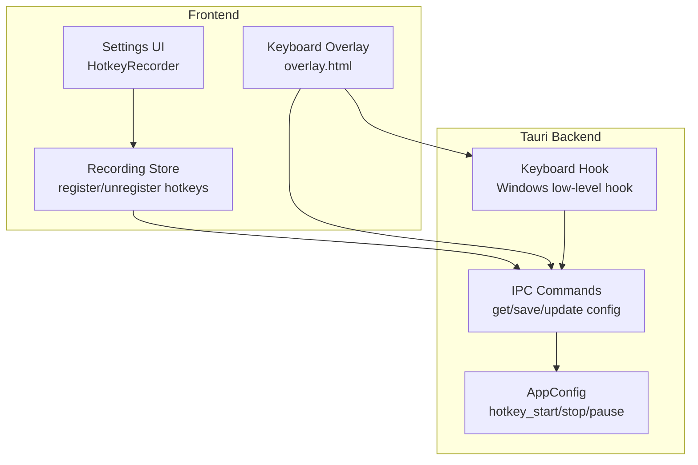
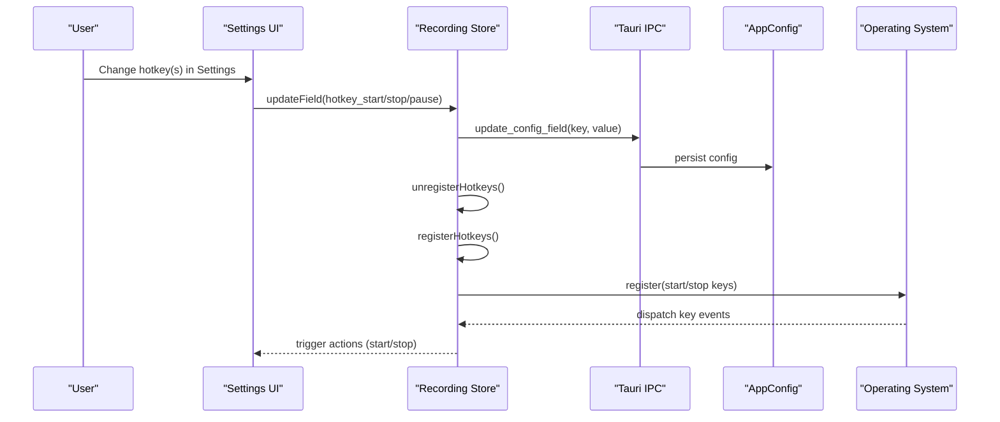
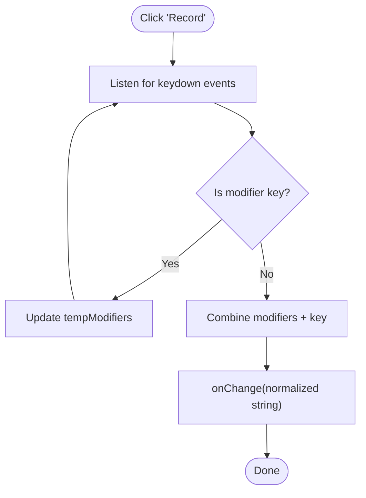
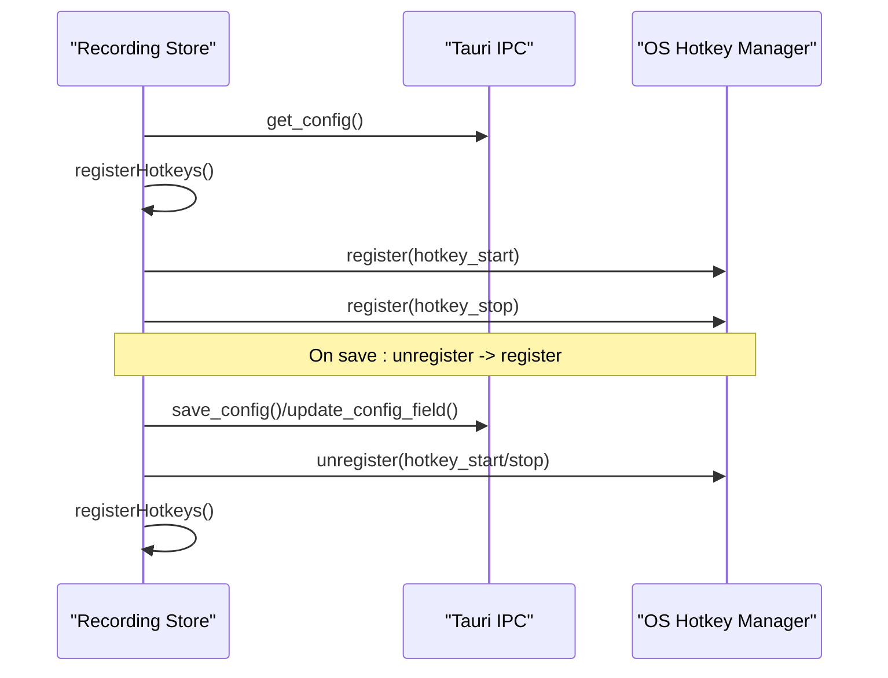
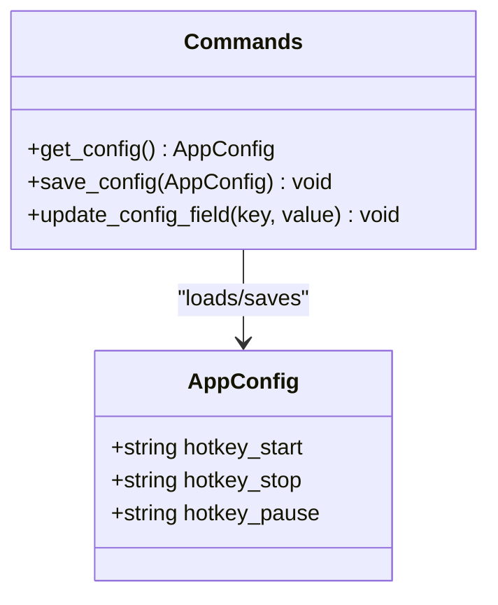
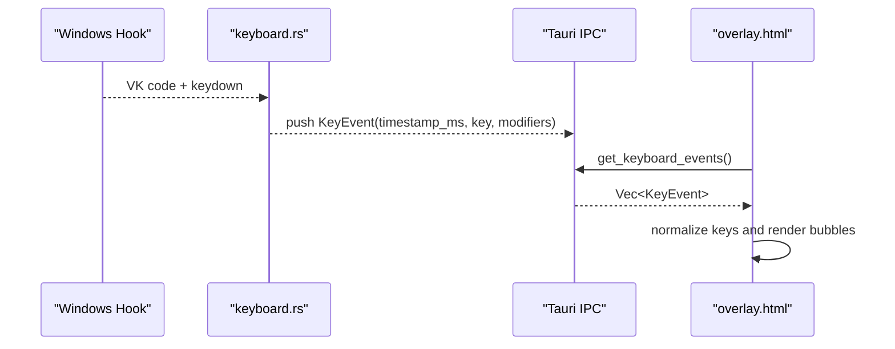
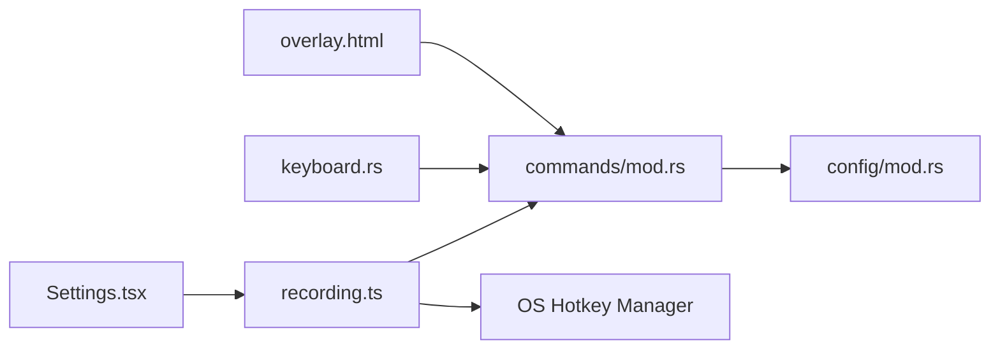

# Hotkey Configuration

<cite>
**Referenced Files in This Document**
- [README.md](file://README.md)
- [src/stores/recording.ts](file://src/stores/recording.ts)
- [src/components/Settings.tsx](file://src/components/Settings.tsx)
- [src-tauri/src/config/mod.rs](file://src-tauri/src/config/mod.rs)
- [src-tauri/src/keyboard.rs](file://src-tauri/src/keyboard.rs)
- [src-tauri/src/lib.rs](file://src-tauri/src/lib.rs)
- [src-tauri/src/commands/mod.rs](file://src-tauri/src/commands/mod.rs)
- [public/overlay.html](file://public/overlay.html)
- [src/components/Dashboard.tsx](file://src/components/Dashboard.tsx)
</cite>

## Table of Contents
1. [Introduction](#introduction)
2. [Project Structure](#project-structure)
3. [Core Components](#core-components)
4. [Architecture Overview](#architecture-overview)
5. [Detailed Component Analysis](#detailed-component-analysis)
6. [Dependency Analysis](#dependency-analysis)
7. [Performance Considerations](#performance-considerations)
8. [Troubleshooting Guide](#troubleshooting-guide)
9. [Conclusion](#conclusion)
10. [Appendices](#appendices)

## Introduction
This document explains EasySpecy’s global hotkey configuration system. It covers the three primary actions—Start Recording, Stop Recording, and Pause Recording—along with the hotkey syntax, supported modifier combinations, customization via the Settings UI and configuration file, registration mechanisms, and troubleshooting guidance. It also includes platform-specific notes and accessibility considerations.

## Project Structure
The hotkey system spans the frontend React store, the Tauri backend configuration, and the keyboard capture subsystem. The main pieces are:
- Frontend hotkey registration and settings UI
- Backend configuration persistence and IPC commands
- Platform-specific keyboard capture and overlay rendering

**Diagram sources**
- [src/components/Settings.tsx:898-913](file://src/components/Settings.tsx#L898-L913)
- [src/stores/recording.ts:237-262](file://src/stores/recording.ts#L237-L262)
- [src-tauri/src/config/mod.rs:65-67](file://src-tauri/src/config/mod.rs#L65-L67)
- [src-tauri/src/commands/mod.rs:11-34](file://src-tauri/src/commands/mod.rs#L11-L34)
- [src-tauri/src/keyboard.rs:1-41](file://src-tauri/src/keyboard.rs#L1-L41)
- [public/overlay.html:531-576](file://public/overlay.html#L531-L576)

**Section sources**
- [README.md:50-58](file://README.md#L50-L58)
- [src/components/Settings.tsx:898-913](file://src/components/Settings.tsx#L898-L913)
- [src/stores/recording.ts:237-262](file://src/stores/recording.ts#L237-L262)
- [src-tauri/src/config/mod.rs:214-216](file://src-tauri/src/config/mod.rs#L214-L216)
- [src-tauri/src/commands/mod.rs:11-34](file://src-tauri/src/commands/mod.rs#L11-L34)
- [src-tauri/src/keyboard.rs:1-41](file://src-tauri/src/keyboard.rs#L1-L41)
- [public/overlay.html:531-576](file://public/overlay.html#L531-L576)

## Core Components
- Default hotkeys and configurability:
  - Start Recording: default Ctrl+Shift+R
  - Stop Recording: default Ctrl+Shift+S
  - Pause Recording: default Ctrl+Shift+P
  - All hotkeys are configurable in Settings.

- Hotkey syntax and modifiers:
  - Syntax: a combination of optional modifiers plus a key, separated by plus signs.
  - Supported modifiers: Ctrl, Shift, Alt, Win/Cmd.
  - The system normalizes whitespace and lowercases the combined string for registration.

- Registration and lifecycle:
  - Hotkeys are registered when the app loads and re-registered after saving new settings.
  - Unregistration occurs before applying new configurations to avoid conflicts.

- Configuration persistence:
  - Hotkeys are part of the AppConfig structure and persisted via IPC commands.

**Section sources**
- [README.md:50-58](file://README.md#L50-L58)
- [src/stores/recording.ts:237-262](file://src/stores/recording.ts#L237-L262)
- [src-tauri/src/config/mod.rs:65-67](file://src-tauri/src/config/mod.rs#L65-L67)
- [src-tauri/src/config/mod.rs:214-216](file://src-tauri/src/config/mod.rs#L214-L216)

## Architecture Overview
The hotkey system integrates frontend UI, backend configuration, and platform-specific keyboard capture.

**Diagram sources**
- [src/components/Settings.tsx:898-913](file://src/components/Settings.tsx#L898-L913)
- [src/stores/recording.ts:228-262](file://src/stores/recording.ts#L228-L262)
- [src-tauri/src/commands/mod.rs:36-45](file://src-tauri/src/commands/mod.rs#L36-L45)
- [src-tauri/src/config/mod.rs:65-67](file://src-tauri/src/config/mod.rs#L65-L67)

## Detailed Component Analysis

### HotkeyRecorder UI Component
- Purpose: Allows users to record a new hotkey by pressing a combination.
- Behavior:
  - Tracks temporary modifier states (Ctrl, Shift, Alt, Super/Meta/OS).
  - Prevents default browser behavior and stops propagation during recording.
  - Emits a normalized hotkey string suitable for storage and registration.

**Diagram sources**
- [src/components/Settings.tsx:898-913](file://src/components/Settings.tsx#L898-L913)

**Section sources**
- [src/components/Settings.tsx:898-913](file://src/components/Settings.tsx#L898-L913)

### Recording Store: Registration and Lifecycle
- Loads configuration and registers hotkeys on startup.
- Saves configuration triggers unregistration followed by re-registration.
- Normalizes hotkey strings by removing spaces and lowercasing before registering.

**Diagram sources**
- [src/stores/recording.ts:211-262](file://src/stores/recording.ts#L211-L262)
- [src-tauri/src/commands/mod.rs:11-34](file://src-tauri/src/commands/mod.rs#L11-L34)

**Section sources**
- [src/stores/recording.ts:211-262](file://src/stores/recording.ts#L211-L262)

### AppConfig: Defaults and Persistence
- Fields include hotkey_start, hotkey_stop, hotkey_pause.
- Defaults are provided for all three hotkeys.
- IPC commands support loading, saving, and updating individual fields.

**Diagram sources**
- [src-tauri/src/config/mod.rs:65-67](file://src-tauri/src/config/mod.rs#L65-L67)
- [src-tauri/src/config/mod.rs:214-216](file://src-tauri/src/config/mod.rs#L214-L216)
- [src-tauri/src/commands/mod.rs:11-45](file://src-tauri/src/commands/mod.rs#L11-L45)

**Section sources**
- [src-tauri/src/config/mod.rs:65-67](file://src-tauri/src/config/mod.rs#L65-L67)
- [src-tauri/src/config/mod.rs:214-216](file://src-tauri/src/config/mod.rs#L214-L216)
- [src-tauri/src/commands/mod.rs:11-45](file://src-tauri/src/commands/mod.rs#L11-L45)

### Keyboard Overlay and Capture
- The keyboard overlay renders keypresses captured during recording.
- On Windows, a low-level keyboard hook captures global key events and exposes them via IPC.
- The overlay normalizes left/right modifier variants (e.g., LCtrl/RCtrl) to unified names.

**Diagram sources**
- [src-tauri/src/keyboard.rs:1-41](file://src-tauri/src/keyboard.rs#L1-L41)
- [src-tauri/src/keyboard.rs:139-187](file://src-tauri/src/keyboard.rs#L139-L187)
- [src-tauri/src/commands/mod.rs:718-721](file://src-tauri/src/commands/mod.rs#L718-L721)
- [public/overlay.html:531-576](file://public/overlay.html#L531-L576)

**Section sources**
- [src-tauri/src/keyboard.rs:1-41](file://src-tauri/src/keyboard.rs#L1-L41)
- [src-tauri/src/keyboard.rs:139-187](file://src-tauri/src/keyboard.rs#L139-L187)
- [src-tauri/src/commands/mod.rs:718-721](file://src-tauri/src/commands/mod.rs#L718-L721)
- [public/overlay.html:531-576](file://public/overlay.html#L531-L576)

## Dependency Analysis
- Frontend depends on Tauri IPC for configuration updates and hotkey registration.
- Backend configuration persists hotkey values and reloads them on change.
- Keyboard capture is platform-specific and exposed to the overlay via IPC.

**Diagram sources**
- [src/components/Settings.tsx:898-913](file://src/components/Settings.tsx#L898-L913)
- [src/stores/recording.ts:211-262](file://src/stores/recording.ts#L211-L262)
- [src-tauri/src/commands/mod.rs:11-34](file://src-tauri/src/commands/mod.rs#L11-L34)
- [src-tauri/src/config/mod.rs:65-67](file://src-tauri/src/config/mod.rs#L65-L67)
- [src-tauri/src/keyboard.rs:1-41](file://src-tauri/src/keyboard.rs#L1-L41)
- [public/overlay.html:531-576](file://public/overlay.html#L531-L576)

**Section sources**
- [src/components/Settings.tsx:898-913](file://src/components/Settings.tsx#L898-L913)
- [src/stores/recording.ts:211-262](file://src/stores/recording.ts#L211-L262)
- [src-tauri/src/commands/mod.rs:11-34](file://src-tauri/src/commands/mod.rs#L11-L34)
- [src-tauri/src/config/mod.rs:65-67](file://src-tauri/src/config/mod.rs#L65-L67)
- [src-tauri/src/keyboard.rs:1-41](file://src-tauri/src/keyboard.rs#L1-L41)
- [public/overlay.html:531-576](file://public/overlay.html#L531-L576)

## Performance Considerations
- Hotkey registration and unregistration occur synchronously around config changes; keep combinations concise to minimize overhead.
- Keyboard overlay prunes old events after five seconds to maintain responsiveness.
- Avoid overly complex modifier combinations that risk conflicts or platform-specific limitations.

[No sources needed since this section provides general guidance]

## Troubleshooting Guide
- Hotkey does not trigger:
  - Verify the action phase conditions: Start only when idle; Stop only when recording.
  - Ensure the hotkey string is normalized (no spaces, lowercase) and differs from existing registrations.
  - Re-save settings to force unregister/register cycle.

- Conflicts with other applications:
  - Try alternative modifier combinations (e.g., add Alt or Win/Cmd).
  - Avoid system-reserved combinations (e.g., Ctrl+Alt+Del).
  - On Windows, some games or overlays may intercept global keys; enable game capture if needed.

- Platform-specific limitations:
  - Windows: Low-level hook requires a message loop; ensure the app remains active.
  - macOS/Linux: Global hotkeys are handled differently; consult platform-specific constraints.

- Accessibility considerations:
  - Choose combinations that are easy to press with one hand if needed.
  - Avoid rare keys or awkward layouts.
  - Provide alternatives for users with motor impairments.

**Section sources**
- [src/stores/recording.ts:237-262](file://src/stores/recording.ts#L237-L262)
- [src-tauri/src/keyboard.rs:139-187](file://src-tauri/src/keyboard.rs#L139-L187)

## Conclusion
EasySpecy’s hotkey system provides flexible, configurable global shortcuts for recording control, backed by robust frontend registration and backend persistence. By understanding the syntax, supported modifiers, and platform nuances, users can tailor hotkeys to their workflows while avoiding conflicts and ensuring reliable operation.

[No sources needed since this section summarizes without analyzing specific files]

## Appendices

### Hotkey Syntax and Supported Modifiers
- Syntax: modifier(s) + key, joined by plus signs.
- Modifiers: Ctrl, Shift, Alt, Win/Cmd.
- Normalization: spaces removed, string lowercased before registration.

**Section sources**
- [src/stores/recording.ts:237-262](file://src/stores/recording.ts#L237-L262)

### Default Hotkeys
- Start Recording: Ctrl+Shift+R
- Stop Recording: Ctrl+Shift+S
- Pause Recording: Ctrl+Shift+P

**Section sources**
- [README.md:50-58](file://README.md#L50-L58)
- [src-tauri/src/config/mod.rs:214-216](file://src-tauri/src/config/mod.rs#L214-L216)

### Customizing Hotkeys via Settings UI
- Navigate to Settings and use the “Record” controls for each action.
- Click “Record,” then press your desired key combination.
- Save changes; the system will unregister old bindings and register new ones.

**Section sources**
- [src/components/Settings.tsx:898-913](file://src/components/Settings.tsx#L898-L913)
- [src/stores/recording.ts:219-226](file://src/stores/recording.ts#L219-L226)

### Customizing Hotkeys via Configuration File
- Locate the AppConfig structure and update hotkey_start, hotkey_stop, hotkey_pause.
- Save the configuration; the app will reload and re-register hotkeys.

**Section sources**
- [src-tauri/src/config/mod.rs:65-67](file://src-tauri/src/config/mod.rs#L65-L67)
- [src-tauri/src/config/mod.rs:214-216](file://src-tauri/src/config/mod.rs#L214-L216)
- [src-tauri/src/commands/mod.rs:11-34](file://src-tauri/src/commands/mod.rs#L11-L34)

### Optimal Hotkey Combinations by Workflow
- Gaming: Add Win/Cmd to avoid in-app conflicts; e.g., Ctrl+Alt+Win+R.
- Presentations: Use a single-hand-friendly layout; e.g., Shift+Alt+R.
- Multi-monitor: Prefer combinations less likely to conflict with OS overlays; e.g., Ctrl+Alt+Shift+R.

[No sources needed since this section provides general guidance]

### Accessibility Tips
- Use distinct combinations for Start/Stop/Pause to reduce errors.
- Avoid keys difficult to reach (e.g., those requiring awkward wrist twists).
- Test combinations with assistive technologies if applicable.

[No sources needed since this section provides general guidance]