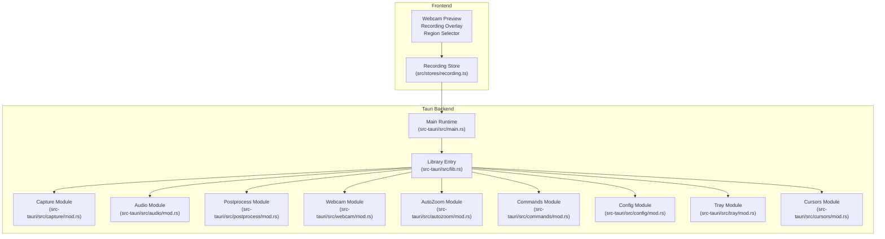
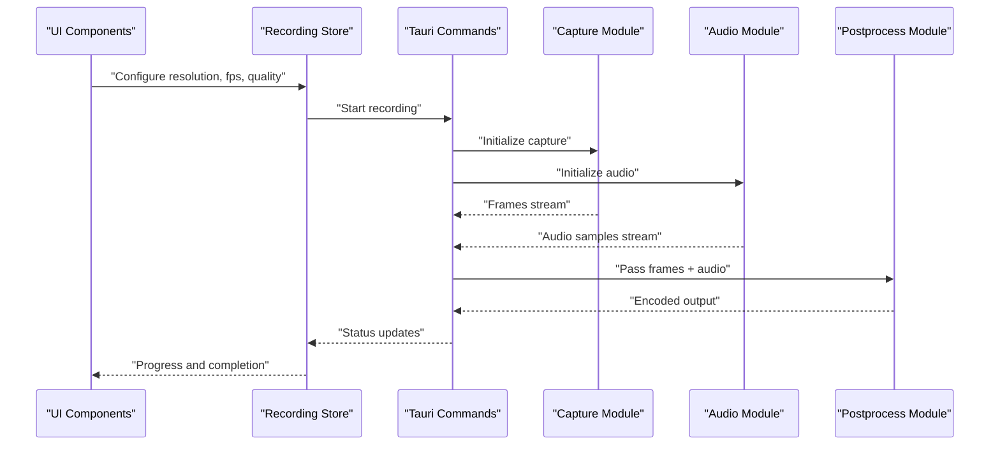
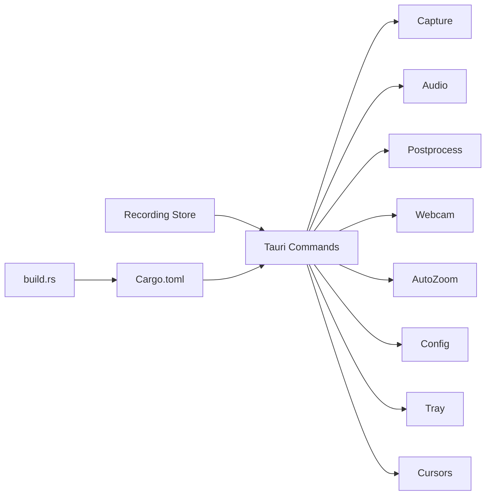

# Performance Tuning

<cite>
**Referenced Files in This Document**
- [README.md](file://README.md)
- [recording.ts](file://src/stores/recording.ts)
- [main.rs](file://src-tauri/src/main.rs)
- [lib.rs](file://src-tauri/src/lib.rs)
- [tauri.conf.json](file://src-tauri/tauri.conf.json)
- [Cargo.toml](file://src-tauri/Cargo.toml)
- [build.rs](file://src-tauri/build.rs)
- [mod.rs](file://src-tauri/src/capture/mod.rs)
- [mod.rs](file://src-tauri/src/audio/mod.rs)
- [mod.rs](file://src-tauri/src/postprocess/mod.rs)
- [mod.rs](file://src-tauri/src/webcam/mod.rs)
- [mod.rs](file://src-tauri/src/autozoom/mod.rs)
- [mod.rs](file://src-tauri/src/commands/mod.rs)
- [mod.rs](file://src-tauri/src/config/mod.rs)
- [mod.rs](file://src-tauri/src/tray/mod.rs)
- [mod.rs](file://src-tauri/src/cursors/mod.rs)
- [index.html](file://index.html)
- [webcam.html](file://public/webcam.html)
- [overlay.html](file://public/overlay.html)
- [region-select.html](file://public/region-select.html)
</cite>

## Table of Contents
1. [Introduction](#introduction)
2. [Project Structure](#project-structure)
3. [Core Components](#core-components)
4. [Architecture Overview](#architecture-overview)
5. [Detailed Component Analysis](#detailed-component-analysis)
6. [Dependency Analysis](#dependency-analysis)
7. [Performance Considerations](#performance-considerations)
8. [Troubleshooting Guide](#troubleshooting-guide)
9. [Conclusion](#conclusion)
10. [Appendices](#appendices)

## Introduction
This document provides a comprehensive performance optimization guide for EasySpecy, focusing on CPU and GPU utilization, encoder selection, quality settings, memory usage, and platform-specific tuning. It explains how resolution, frame rate, and quality presets influence system performance, and offers practical guidance for balancing recording quality against system load. Monitoring techniques and troubleshooting steps are included to help diagnose and resolve bottlenecks across Windows, macOS, and Linux.

## Project Structure
EasySpecy is a Tauri-based desktop application with a frontend built in TypeScript/React and a Rust backend responsible for capture, audio, post-processing, and system integration. Recording orchestration is primarily handled in the frontend store module, while the backend exposes system-level capabilities via Tauri commands.

**Diagram sources**
- [main.rs](file://src-tauri/src/main.rs)
- [lib.rs](file://src-tauri/src/lib.rs)
- [recording.ts](file://src/stores/recording.ts)
- [mod.rs](file://src-tauri/src/capture/mod.rs)
- [mod.rs](file://src-tauri/src/audio/mod.rs)
- [mod.rs](file://src-tauri/src/postprocess/mod.rs)
- [mod.rs](file://src-tauri/src/webcam/mod.rs)
- [mod.rs](file://src-tauri/src/autozoom/mod.rs)
- [mod.rs](file://src-tauri/src/commands/mod.rs)
- [mod.rs](file://src-tauri/src/config/mod.rs)
- [mod.rs](file://src-tauri/src/tray/mod.rs)
- [mod.rs](file://src-tauri/src/cursors/mod.rs)

**Section sources**
- [README.md](file://README.md)
- [index.html](file://index.html)
- [webcam.html](file://public/webcam.html)
- [overlay.html](file://public/overlay.html)
- [region-select.html](file://public/region-select.html)

## Core Components
- Recording Store: Centralizes recording state and controls, including resolution, frame rate, and quality settings. It coordinates with Tauri commands to start/stop capture and manage post-processing.
- Capture Module: Handles screen/camera capture pipeline and interacts with OS APIs for media acquisition.
- Audio Module: Manages audio capture and mixing for synchronized recording.
- Postprocess Module: Applies filters, overlays, and final encoding steps.
- Webcam Module: Provides webcam preview and capture for overlay scenarios.
- AutoZoom Module: Implements auto-zoom features that may introduce additional CPU/GPU workloads.
- Commands Module: Exposes Tauri commands for frontend-backend communication.
- Config Module: Stores and retrieves user preferences and performance-related settings.
- Tray and Cursors Modules: Integrate system tray and cursor rendering.

Key performance-relevant responsibilities:
- Resolution/frame rate selection affects bandwidth and compute load.
- Quality presets influence encoder complexity and output bitrate.
- GPU acceleration reduces CPU load but requires compatible drivers/platform support.
- Memory usage scales with resolution, frame rate, and recording duration.

**Section sources**
- [recording.ts](file://src/stores/recording.ts)
- [mod.rs](file://src-tauri/src/capture/mod.rs)
- [mod.rs](file://src-tauri/src/audio/mod.rs)
- [mod.rs](file://src-tauri/src/postprocess/mod.rs)
- [mod.rs](file://src-tauri/src/webcam/mod.rs)
- [mod.rs](file://src-tauri/src/autozoom/mod.rs)
- [mod.rs](file://src-tauri/src/commands/mod.rs)
- [mod.rs](file://src-tauri/src/config/mod.rs)
- [mod.rs](file://src-tauri/src/tray/mod.rs)
- [mod.rs](file://src-tauri/src/cursors/mod.rs)

## Architecture Overview
The recording pipeline integrates frontend UI and backend modules through Tauri. The frontend captures user intent and settings, while the backend performs media capture, synchronization, and encoding.

**Diagram sources**
- [recording.ts](file://src/stores/recording.ts)
- [mod.rs](file://src-tauri/src/commands/mod.rs)
- [mod.rs](file://src-tauri/src/capture/mod.rs)
- [mod.rs](file://src-tauri/src/audio/mod.rs)
- [mod.rs](file://src-tauri/src/postprocess/mod.rs)

## Detailed Component Analysis

### Recording Store and Settings
- Purpose: Manage recording configuration (resolution, frame rate, quality preset) and lifecycle events.
- Performance impact: Higher resolution and frame rate increase CPU/GPU load and memory bandwidth. Quality presets affect bitrate and encoder complexity.
- Recommendations:
  - Prefer native resolutions aligned to camera/screen output to avoid scaling overhead.
  - Reduce frame rate for constrained systems; 30 fps is often a safe baseline.
  - Use medium quality presets for balanced performance and fidelity.

**Section sources**
- [recording.ts](file://src/stores/recording.ts)

### Capture Pipeline
- Purpose: Acquire frames from webcam/screen and pass them to downstream processors.
- Performance impact: CPU-intensive scaling and color conversion; GPU-accelerated capture reduces CPU load.
- Recommendations:
  - Enable GPU capture when available.
  - Use efficient pixel formats to minimize conversion costs.
  - Avoid unnecessary post-capture transformations.

**Section sources**
- [mod.rs](file://src-tauri/src/capture/mod.rs)

### Audio Pipeline
- Purpose: Capture and mix audio streams for synchronized recording.
- Performance impact: Light to moderate CPU load; can become significant with many tracks or effects.
- Recommendations:
  - Keep audio sample rates at 48 kHz or lower when quality permits.
  - Disable unnecessary audio effects during recording.

**Section sources**
- [mod.rs](file://src-tauri/src/audio/mod.rs)

### Postprocessing and Encoding
- Purpose: Apply overlays, filters, and encode final output.
- Performance impact: Heavily dependent on encoder choice and quality settings.
- Recommendations:
  - Choose hardware-accelerated encoders when available (e.g., NVENC/H.264 on NVIDIA, VCE/H.264 on AMD, VideoToolbox/H.264 on Apple Silicon).
  - Use constant bitrate (CBR) for predictable CPU/GPU usage; variable bitrate (VBR) can reduce file size but increases encoder complexity.
  - Lower quality presets for CPU-only systems; increase quality for GPU-accelerated setups.

**Section sources**
- [mod.rs](file://src-tauri/src/postprocess/mod.rs)

### AutoZoom and Overlays
- Purpose: Provide dynamic zooming and visual overlays during recording.
- Performance impact: Additional CPU/GPU workloads for detection and rendering.
- Recommendations:
  - Disable AutoZoom when targeting minimal CPU usage.
  - Use lightweight overlays and avoid real-time heavy effects.

**Section sources**
- [mod.rs](file://src-tauri/src/autozoom/mod.rs)
- [mod.rs](file://src-tauri/src/postprocess/mod.rs)

### Tauri Runtime and Capabilities
- Purpose: Bridge frontend and backend, expose OS-level features, and manage permissions.
- Performance impact: Minimal overhead; ensures clean separation of concerns.
- Recommendations:
  - Keep capability definitions scoped to required features.
  - Use appropriate window modes and transparency settings to reduce compositing cost.

**Section sources**
- [main.rs](file://src-tauri/src/main.rs)
- [lib.rs](file://src-tauri/src/lib.rs)
- [tauri.conf.json](file://src-tauri/tauri.conf.json)

## Dependency Analysis
The frontend depends on the Recording Store to coordinate with Tauri commands, which in turn depend on backend modules for capture, audio, and post-processing. The Cargo manifest defines optional features and platform-specific dependencies.

**Diagram sources**
- [recording.ts](file://src/stores/recording.ts)
- [mod.rs](file://src-tauri/src/commands/mod.rs)
- [mod.rs](file://src-tauri/src/capture/mod.rs)
- [mod.rs](file://src-tauri/src/audio/mod.rs)
- [mod.rs](file://src-tauri/src/postprocess/mod.rs)
- [mod.rs](file://src-tauri/src/webcam/mod.rs)
- [mod.rs](file://src-tauri/src/autozoom/mod.rs)
- [mod.rs](file://src-tauri/src/config/mod.rs)
- [mod.rs](file://src-tauri/src/tray/mod.rs)
- [mod.rs](file://src-tauri/src/cursors/mod.rs)
- [Cargo.toml](file://src-tauri/Cargo.toml)
- [build.rs](file://src-tauri/build.rs)

**Section sources**
- [Cargo.toml](file://src-tauri/Cargo.toml)
- [build.rs](file://src-tauri/build.rs)

## Performance Considerations

### CPU vs. GPU Utilization
- CPU-only encoders: More predictable but heavier load; suitable for older or integrated GPUs.
- GPU-accelerated encoders: Significantly reduce CPU load; require compatible drivers and platforms.
- Mixed workloads: Capture and post-processing benefit from GPU offload; audio remains CPU-bound.

### Resolution, Frame Rate, and Quality Presets
- Resolution: Larger frames increase bandwidth and compute; choose native or rounded resolutions.
- Frame Rate: Higher fps improves smoothness but increases load; 30 fps is a good default.
- Quality Presets: Lower presets reduce bitrate and complexity; higher presets improve fidelity but increase CPU/GPU usage.

### Memory Usage Patterns
- Memory grows linearly with resolution, frame rate, and recording duration.
- Long sessions can cause memory pressure; consider periodic flushes or reduced buffer sizes.
- Monitor peak memory usage during testing and adjust settings accordingly.

### Encoder Selection Guidelines
- CPU-only systems:
  - Software encoders (e.g., H.264 via x264) with medium quality presets.
  - Lower resolution and frame rate for stability.
- GPU-accelerated systems:
  - NVENC (NVIDIA), VCE (AMD), or VideoToolbox (Apple Silicon) depending on vendor.
  - Increase quality and resolution cautiously while monitoring utilization.

### Platform-Specific Recommendations
- Windows:
  - NVENC for NVIDIA GPUs; ensure drivers are up to date.
  - Use hardware-accelerated capture when available.
- macOS:
  - Prefer VideoToolbox encoders for Apple Silicon; leverage Metal-backed pipelines.
  - Minimize transparency and layered windows to reduce compositor overhead.
- Linux:
  - VA-API or XvMC for Intel GPUs; NVIDIA NVENC via driver stack.
  - Validate encoder availability and performance with benchmarking.

### Monitoring Resource Usage
- CPU/GPU utilization: Use OS task managers or profiling tools to monitor during recordings.
- Memory: Track RSS growth over time; adjust buffer sizes and session length.
- Disk I/O: Ensure sufficient write throughput; consider SSD placement for temporary buffers.
- Network (if applicable): Bandwidth monitoring for streaming integrations.

### Trade-offs Between Quality and Performance
- Higher quality = larger files and increased compute.
- Lower quality = smaller files but potential artifacts.
- Balance based on target audience and storage constraints.

## Troubleshooting Guide

Common Bottlenecks and Fixes
- High CPU usage:
  - Reduce resolution or frame rate.
  - Switch to GPU-accelerated encoder.
  - Disable AutoZoom and heavy overlays.
- High GPU usage:
  - Lower quality preset or switch to CBR mode.
  - Close other GPU-intensive applications.
- Memory spikes:
  - Shorten recording sessions or reduce buffer sizes.
  - Verify no memory leaks in capture pipeline.
- Encoder failures:
  - Validate platform support and driver versions.
  - Revert to software encoder as fallback.
- Audio desync:
  - Adjust audio sample rate or disable unnecessary effects.
  - Ensure adequate CPU headroom for audio processing.

Compatibility Checks
- Verify Tauri capabilities and permissions for capture and overlays.
- Confirm webcam and screen capture permissions are granted.
- Test on representative hardware to establish baseline performance.

**Section sources**
- [tauri.conf.json](file://src-tauri/tauri.conf.json)
- [mod.rs](file://src-tauri/src/capture/mod.rs)
- [mod.rs](file://src-tauri/src/postprocess/mod.rs)
- [mod.rs](file://src-tauri/src/autozoom/mod.rs)
- [mod.rs](file://src-tauri/src/webcam/mod.rs)

## Conclusion
Optimizing EasySpecy’s performance hinges on aligning capture and encoding settings with hardware capabilities. By selecting appropriate encoders, tuning resolution and frame rate, and monitoring resource usage, users can achieve reliable recordings across diverse platforms. Start conservative, measure impact, and iterate toward the desired balance of quality and performance.

## Appendices

### Encoder Selection Quick Reference
- NVIDIA (Windows/macOS/Linux): NVENC H.264
- AMD (Windows/Linux): VCE H.264
- Apple Silicon (macOS): VideoToolbox H.264
- Intel (Linux): VA-API H.264
- Software fallback: x264 (CPU)

### Frontend UI Integration Points
- Webcam Preview and Region Selector pages provide user controls for capture area and overlays.
- Recording Overlay displays status and progress during capture.

**Section sources**
- [webcam.html](file://public/webcam.html)
- [overlay.html](file://public/overlay.html)
- [region-select.html](file://public/region-select.html)