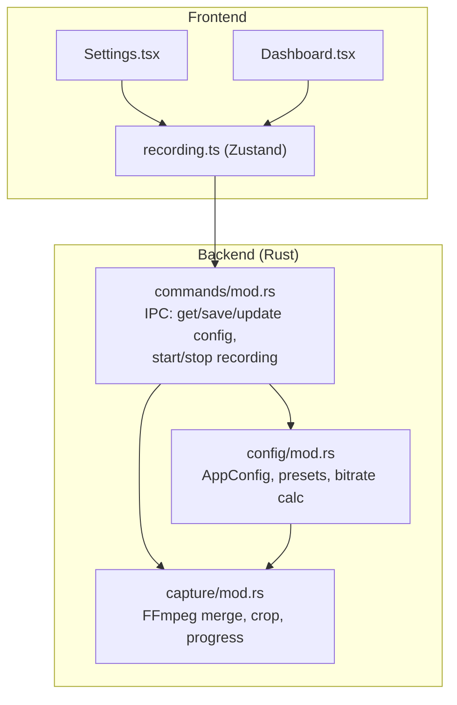
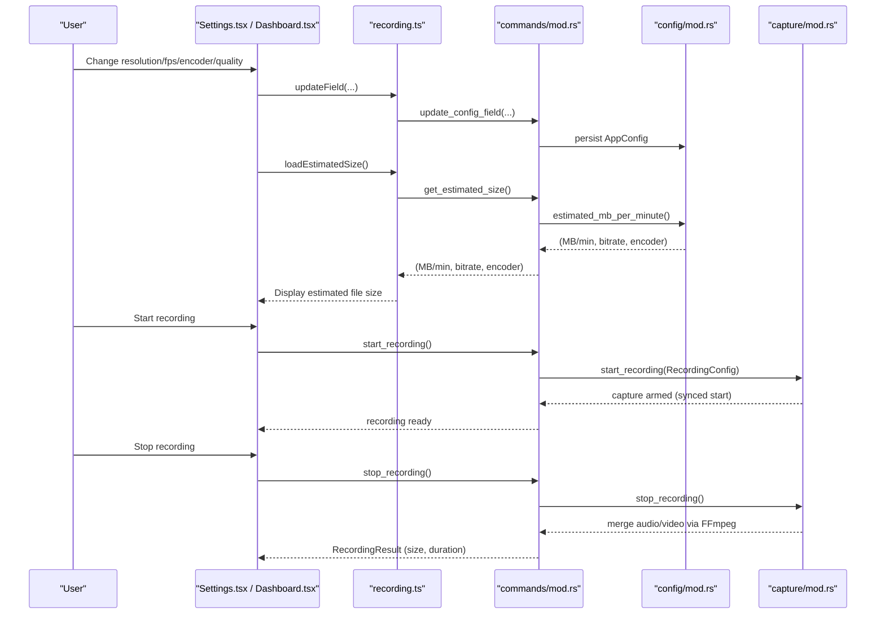
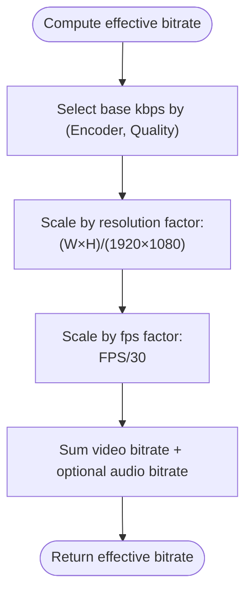
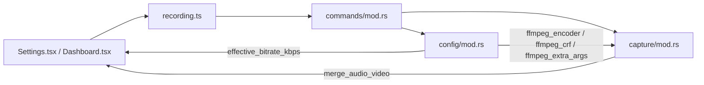

# Recording Settings

<cite>
**Referenced Files in This Document**
- [README.md](file://README.md)
- [recording.ts](file://src/stores/recording.ts)
- [Settings.tsx](file://src/components/Settings.tsx)
- [Dashboard.tsx](file://src/components/Dashboard.tsx)
- [mod.rs](file://src-tauri/src/config/mod.rs)
- [mod.rs](file://src-tauri/src/capture/mod.rs)
- [mod.rs](file://src-tauri/src/commands/mod.rs)
</cite>

## Table of Contents
1. [Introduction](#introduction)
2. [Project Structure](#project-structure)
3. [Core Components](#core-components)
4. [Architecture Overview](#architecture-overview)
5. [Detailed Component Analysis](#detailed-component-analysis)
6. [Dependency Analysis](#dependency-analysis)
7. [Performance Considerations](#performance-considerations)
8. [Troubleshooting Guide](#troubleshooting-guide)
9. [Conclusion](#conclusion)
10. [Appendices](#appendices)

## Introduction
This document explains EasySpecy’s recording configuration system with a focus on video resolution, frame rate, encoder choices, quality presets, and bitrate. It also details the effective bitrate calculation algorithm, how presets map to FFmpeg parameters, and provides practical guidance for optimizing quality vs. file size and performance.

## Project Structure
EasySpecy separates configuration concerns across frontend and backend:
- Frontend (React + Zustand store) manages user-facing controls and exposes estimated file size.
- Backend (Rust) persists configuration, computes effective bitrates, and drives FFmpeg encoding.

**Diagram sources**
- [Settings.tsx:164-242](file://src/components/Settings.tsx#L164-L242)
- [Dashboard.tsx:458-514](file://src/components/Dashboard.tsx#L458-L514)
- [recording.ts:149-174](file://src/stores/recording.ts#L149-L174)
- [mod.rs:1-432](file://src-tauri/src/config/mod.rs#L1-L432)
- [mod.rs:1-1064](file://src-tauri/src/capture/mod.rs#L1-L1064)
- [mod.rs:1-715](file://src-tauri/src/commands/mod.rs#L1-L715)

**Section sources**
- [README.md:1-63](file://README.md#L1-L63)
- [Settings.tsx:164-242](file://src/components/Settings.tsx#L164-L242)
- [Dashboard.tsx:458-514](file://src/components/Dashboard.tsx#L458-L514)
- [recording.ts:149-174](file://src/stores/recording.ts#L149-L174)
- [mod.rs:1-432](file://src-tauri/src/config/mod.rs#L1-L432)
- [mod.rs:1-1064](file://src-tauri/src/capture/mod.rs#L1-L1064)
- [mod.rs:1-715](file://src-tauri/src/commands/mod.rs#L1-L715)

## Core Components
- Configuration model and presets: Defines supported resolutions, frame rates, encoders, and quality tiers.
- Effective bitrate calculator: Computes target bitrate based on encoder, preset, resolution, and frame rate.
- FFmpeg parameter mapper: Translates presets to FFmpeg encoder, CRF/QP, and extra arguments.
- Frontend controls: Expose resolution/frame rate/encoder/quality selections and show estimated file size.

Key responsibilities:
- Resolution and frame rate: Selected by users and influence effective bitrate scaling.
- Encoders: CPU and GPU-accelerated variants mapped to FFmpeg encoders.
- Quality presets: Map to bitrate or CRF/QP depending on encoder.
- File size estimation: Sum of video and audio bitrate yields MB per minute.

**Section sources**
- [mod.rs:119-146](file://src-tauri/src/config/mod.rs#L119-L146)
- [mod.rs:279-333](file://src-tauri/src/config/mod.rs#L279-L333)
- [mod.rs:335-394](file://src-tauri/src/config/mod.rs#L335-L394)
- [Settings.tsx:164-242](file://src/components/Settings.tsx#L164-L242)
- [Dashboard.tsx:525-536](file://src/components/Dashboard.tsx#L525-L536)

## Architecture Overview
End-to-end flow from UI selection to encoding and file size estimation:

**Diagram sources**
- [Settings.tsx:164-242](file://src/components/Settings.tsx#L164-L242)
- [Dashboard.tsx:525-536](file://src/components/Dashboard.tsx#L525-L536)
- [recording.ts:149-174](file://src/stores/recording.ts#L149-L174)
- [mod.rs:151-158](file://src-tauri/src/commands/mod.rs#L151-L158)
- [mod.rs:326-333](file://src-tauri/src/config/mod.rs#L326-L333)
- [mod.rs:241-336](file://src-tauri/src/capture/mod.rs#L241-L336)
- [mod.rs:502-714](file://src-tauri/src/capture/mod.rs#L502-L714)

## Detailed Component Analysis

### Configuration Model and Presets
Supported options:
- Resolutions: 480p (854×480), 720p (1280×720), 1080p (1920×1080)
- Frame rates: 24fps, 30fps, 60fps
- Encoders: H264, H265, AV1, VP9, plus GPU-accelerated variants (NVENC for H264/H265/AV1)
- Quality presets: Low, Medium, High, Ultra, Insane, Custom
- Bitrate: Custom kbps or preset-derived

Preset-to-bitrate mapping (encoder × quality) scales by resolution and fps relative to 1080p30.

**Section sources**
- [Settings.tsx:164-242](file://src/components/Settings.tsx#L164-L242)
- [Dashboard.tsx:458-514](file://src/components/Dashboard.tsx#L458-L514)
- [mod.rs:119-146](file://src-tauri/src/config/mod.rs#L119-L146)
- [mod.rs:283-324](file://src-tauri/src/config/mod.rs#L283-L324)

### Effective Bitrate Calculation Algorithm
The effective bitrate is computed as:
- Base bitrate depends on encoder and quality tier
- Scaled by resolution (pixel count) and fps relative to 1080p30 and 30fps respectively
- Optional audio contribution adds approximately 192 kbps if enabled

**Diagram sources**
- [mod.rs:283-324](file://src-tauri/src/config/mod.rs#L283-L324)
- [mod.rs:326-333](file://src-tauri/src/config/mod.rs#L326-L333)

**Section sources**
- [mod.rs:279-333](file://src-tauri/src/config/mod.rs#L279-L333)

### FFmpeg Parameter Mapping
- Encoder name: Maps EasySpecy encoder enum to FFmpeg encoder string
- Quality control:
  - CRF for CPU encoders (AV1, H264, H265, VP9)
  - QP for NVENC encoders (AV1_NVENC, H264_NVENC, H265_NVENC)
- Extra arguments:
  - CPU AV1: preset and tuning params
  - NVENC AV1/H264/H265: preset, tune, multipass
  - H264/H265: preset
  - VP9: deadline, cpu-used, row multi-threading

These mappings ensure consistent quality and performance across encoders.

**Section sources**
- [mod.rs:335-394](file://src-tauri/src/config/mod.rs#L335-L394)

### Frontend Recording Controls and Estimation
- Users can pick resolution, fps, recording mode, encoder, and quality
- Custom bitrate appears when “Custom” is selected
- Estimated file size per minute is displayed and recalculated on changes

Practical usage:
- Use inline preset cards on the dashboard to adjust resolution, fps, encoder, and quality
- Use Settings for granular control and custom bitrate

**Section sources**
- [Settings.tsx:164-242](file://src/components/Settings.tsx#L164-L242)
- [Dashboard.tsx:458-536](file://src/components/Dashboard.tsx#L458-L536)
- [recording.ts:167-168](file://src/stores/recording.ts#L167-L168)

### Encoding Pipeline and Post-Processing
- Recording starts with synchronized capture and audio arming
- FFmpeg merges video and audio, applies region crop if needed, overlays webcam, and applies cursor effects
- Encoding progress and stages are reported back to the UI

**Section sources**
- [mod.rs:1-1064](file://src-tauri/src/capture/mod.rs#L1-L1064)
- [mod.rs:241-395](file://src-tauri/src/commands/mod.rs#L241-L395)

## Dependency Analysis
Relationships among configuration, UI, and encoding:

**Diagram sources**
- [Settings.tsx:164-242](file://src/components/Settings.tsx#L164-L242)
- [Dashboard.tsx:525-536](file://src/components/Dashboard.tsx#L525-L536)
- [recording.ts:149-174](file://src/stores/recording.ts#L149-L174)
- [mod.rs:151-158](file://src-tauri/src/commands/mod.rs#L151-L158)
- [mod.rs:279-394](file://src-tauri/src/config/mod.rs#L279-L394)
- [mod.rs:768-800](file://src-tauri/src/capture/mod.rs#L768-L800)

**Section sources**
- [mod.rs:279-394](file://src-tauri/src/config/mod.rs#L279-L394)
- [mod.rs:151-158](file://src-tauri/src/commands/mod.rs#L151-L158)
- [mod.rs:768-800](file://src-tauri/src/capture/mod.rs#L768-L800)

## Performance Considerations
- Higher resolution and fps increase effective bitrate and encoding time.
- GPU-accelerated encoders (NVENC) reduce CPU load and improve throughput.
- Quality presets map to different CRF/QP values; Ultra/Insane presets yield larger files.
- Audio enabled adds ~192 kbps to total bitrate.

[No sources needed since this section provides general guidance]

## Troubleshooting Guide
Common issues and remedies:
- Recording stalls or no frames received
  - Cause: Capture initialization timeout waiting for first frame
  - Action: Verify display/audio permissions; retry after closing other capture-heavy apps
- Encoding progress stuck
  - Cause: FFmpeg process errors or missing FFmpeg binary
  - Action: Ensure FFmpeg is bundled and accessible; check logs for FFmpeg spawn/wait errors
- Audio mismatch or silence
  - Cause: Audio device contention or empty audio file
  - Action: Disable concurrent webcam/browser captures; confirm audio device selection
- Excessive file size
  - Cause: High resolution/fps or high-quality preset
  - Action: Lower resolution/fps or switch to a lower quality preset; disable audio if unnecessary
- Slow performance during recording
  - Cause: CPU-intensive encoder or high resolution
  - Action: Switch to NVENC variant if available; reduce resolution/fps; lower quality preset

**Section sources**
- [mod.rs:297-316](file://src-tauri/src/capture/mod.rs#L297-L316)
- [mod.rs:424-500](file://src-tauri/src/capture/mod.rs#L424-L500)
- [mod.rs:502-714](file://src-tauri/src/capture/mod.rs#L502-L714)

## Conclusion
EasySpecy’s configuration system cleanly separates user-facing controls from backend bitrate computation and FFmpeg-driven encoding. By understanding how resolution, fps, encoder choice, and quality presets influence effective bitrate and file size, users can tailor settings to their needs—balancing quality, performance, and storage.

[No sources needed since this section summarizes without analyzing specific files]

## Appendices

### Practical Settings by Use Case
- Gaming highlights (smaller files, good quality)
  - Resolution: 1080p; Frame rate: 60fps; Encoder: H264_NVENC or H265_NVENC; Quality: High or Ultra
- Presentations (high quality, moderate size)
  - Resolution: 1080p; Frame rate: 30fps; Encoder: AV1 or H265; Quality: High or Ultra
- Content creation (lossless-like quality)
  - Resolution: 1080p or 4K; Frame rate: 30fps; Encoder: AV1 or H265; Quality: Ultra or Insane (AV1)
- Low-bandwidth sharing
  - Resolution: 720p; Frame rate: 30fps; Encoder: H264 or VP9; Quality: Medium or Low

[No sources needed since this section provides general guidance]

### Relationship Between Resolution, Frame Rate, and Quality Presets on File Size
- Effective bitrate increases proportionally with resolution (pixels) and fps.
- Quality presets define base bitrate tiers; higher tiers yield larger files.
- Audio enabled adds a fixed ~192 kbps to total bitrate.
- Estimated MB per minute = (video kbps + audio kbps) × 60 / 8 / 1024.

**Section sources**
- [mod.rs:326-333](file://src-tauri/src/config/mod.rs#L326-L333)