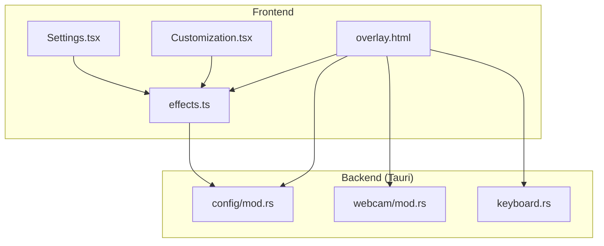
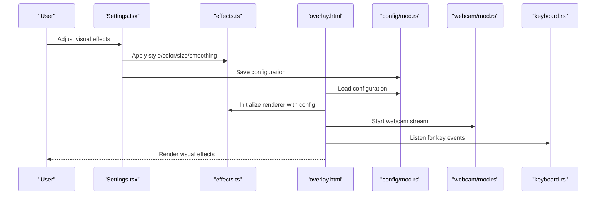
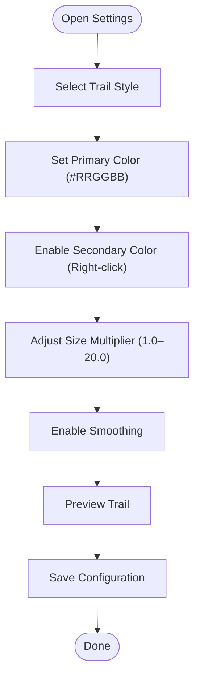
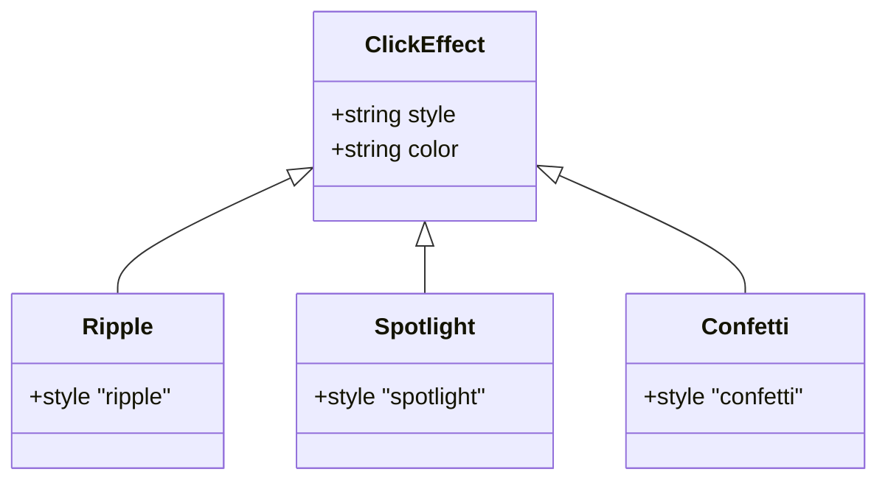
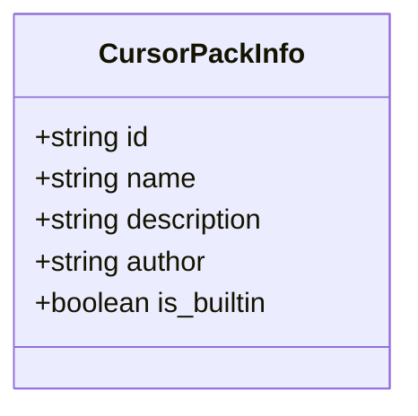
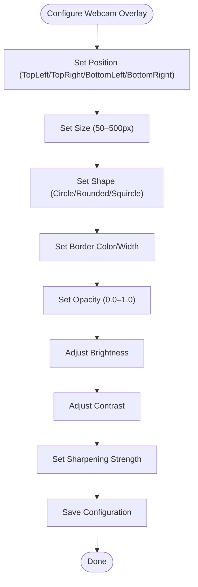
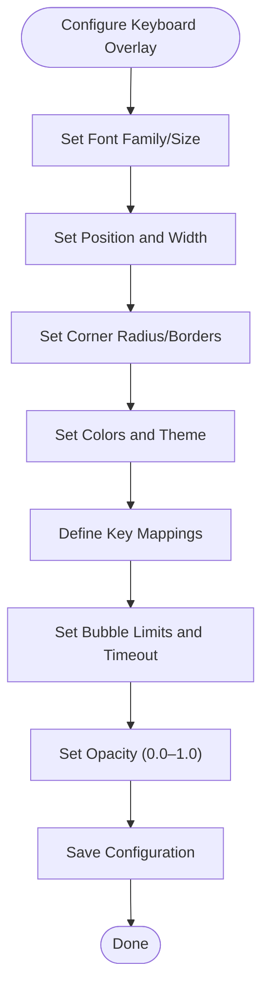
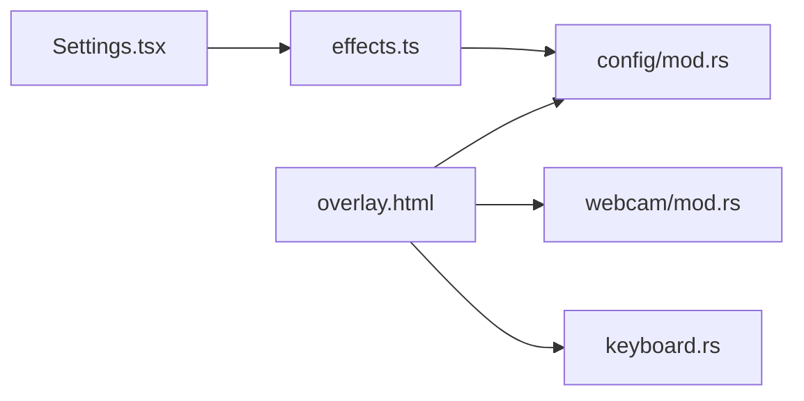

# Visual Effects Customization

<cite>
**Referenced Files in This Document**
- [Settings.tsx](file://src/components/Settings.tsx)
- [effects.ts](file://src/lib/effects.ts)
- [overlay.html](file://public/overlay.html)
- [mod.rs](file://src-tauri/src/config/mod.rs)
- [mod.rs](file://src-tauri/src/webcam/mod.rs)
- [mod.rs](file://src-tauri/src/keyboard.rs)
</cite>

## Table of Contents
1. [Introduction](#introduction)
2. [Project Structure](#project-structure)
3. [Core Components](#core-components)
4. [Architecture Overview](#architecture-overview)
5. [Detailed Component Analysis](#detailed-component-analysis)
6. [Dependency Analysis](#dependency-analysis)
7. [Performance Considerations](#performance-considerations)
8. [Troubleshooting Guide](#troubleshooting-guide)
9. [Conclusion](#conclusion)

## Introduction
This document explains how to configure visual effects in EasySpecy, focusing on cursor trails, click effects, webcam overlays, and keyboard overlays. It covers supported options, value ranges, and practical examples for different visual preferences and performance considerations.

## Project Structure
The visual effects system spans frontend React components, shared rendering utilities, and backend configuration and webcam/keyboard modules.

**Diagram sources**
- [Settings.tsx:1-29](file://src/components/Settings.tsx#L1-L29)
- [effects.ts](file://src/lib/effects.ts)
- [overlay.html:49-503](file://public/overlay.html#L49-L503)
- [mod.rs](file://src-tauri/src/config/mod.rs)
- [mod.rs](file://src-tauri/src/webcam/mod.rs)
- [mod.rs](file://src-tauri/src/keyboard.rs)

**Section sources**
- [Settings.tsx:1-29](file://src/components/Settings.tsx#L1-L29)
- [overlay.html:49-503](file://public/overlay.html#L49-L503)

## Core Components
- Cursor trail configuration: style selection, primary color, optional secondary color, size multiplier, smoothing, and size adjustments.
- Click effects: ripple, spotlight, confetti.
- Cursor pack selection: built-in and custom cursor sets.
- Webcam overlay: position, sizing, shape, border, opacity, sharpening, brightness, contrast.
- Keyboard overlay: font family, size, opacity, positioning, corner radius, borders, colors, theme, key mappings, bubble limits, timeouts, width.

**Section sources**
- [Settings.tsx:14-29](file://src/components/Settings.tsx#L14-L29)
- [overlay.html:490-503](file://public/overlay.html#L490-L503)

## Architecture Overview
The frontend renders configuration UI and preview components. The effects engine (shared utilities) drives rendering. The overlay HTML page loads configuration and applies visual settings. Backend modules supply configuration, webcam feed, and keyboard state.

**Diagram sources**
- [Settings.tsx:1-29](file://src/components/Settings.tsx#L1-L29)
- [effects.ts](file://src/lib/effects.ts)
- [overlay.html:490-503](file://public/overlay.html#L490-L503)
- [mod.rs](file://src-tauri/src/config/mod.rs)
- [mod.rs](file://src-tauri/src/webcam/mod.rs)
- [mod.rs](file://src-tauri/src/keyboard.rs)

## Detailed Component Analysis

### Cursor Trail Settings
- Style selection: glow, particles, ribbon, dots, aurora, off.
- Color customization: hex color format for the primary trail color.
- Secondary color: optional right-click effect color derived from the primary color.
- Size adjustment: configurable multiplier applied to base trail thickness.
- Smoothing: spline interpolation for smooth motion trails.
- Size multipliers: per-style scaling factors.

**Diagram sources**
- [Settings.tsx:22-29](file://src/components/Settings.tsx#L22-L29)
- [overlay.html:490-496](file://public/overlay.html#L490-L496)

**Section sources**
- [Settings.tsx:22-29](file://src/components/Settings.tsx#L22-L29)
- [overlay.html:490-496](file://public/overlay.html#L490-L496)

### Click Effect Configurations
- Ripple: concentric waves from cursor position.
- Spotlight: focused radial glow.
- Confetti: particle bursts.

**Diagram sources**
- [overlay.html:495](file://public/overlay.html#L495)

**Section sources**
- [overlay.html:495](file://public/overlay.html#L495)

### Cursor Pack Selection
- Built-in and custom cursor packs selectable in settings.
- Packs define visual appearance of the cursor.

**Diagram sources**
- [Settings.tsx:14-21](file://src/components/Settings.tsx#L14-L21)

**Section sources**
- [Settings.tsx:14-21](file://src/components/Settings.tsx#L14-L21)

### Webcam Overlay Customization
- Position options: TopLeft, TopRight, BottomLeft, BottomRight.
- Sizing: 50–500 pixels.
- Shape options: Circle, Rounded, Squircle.
- Border customization: color and width.
- Opacity control: 0.0–1.0.
- Sharpening strength, brightness, contrast adjustments.
- Positioning coordinates: absolute placement within overlay bounds.

**Diagram sources**
- [overlay.html:490-503](file://public/overlay.html#L490-L503)
- [mod.rs](file://src-tauri/src/webcam/mod.rs)

**Section sources**
- [overlay.html:490-503](file://public/overlay.html#L490-L503)
- [mod.rs](file://src-tauri/src/webcam/mod.rs)

### Keyboard Overlay Configuration
- Font family and size.
- Opacity control (0.0–1.0).
- Positioning and width specifications.
- Corner radius and borders.
- Colors and theme selection.
- Key mappings and bubble limits.
- Timeout settings for overlay visibility.

**Diagram sources**
- [overlay.html:498-503](file://public/overlay.html#L498-L503)
- [mod.rs](file://src-tauri/src/keyboard.rs)

**Section sources**
- [overlay.html:498-503](file://public/overlay.html#L498-L503)
- [mod.rs](file://src-tauri/src/keyboard.rs)

## Dependency Analysis
- Frontend settings depend on effects utilities for rendering previews.
- Overlay HTML depends on configuration for runtime values.
- Backend modules provide configuration, webcam, and keyboard state.

**Diagram sources**
- [Settings.tsx:1-29](file://src/components/Settings.tsx#L1-L29)
- [effects.ts](file://src/lib/effects.ts)
- [overlay.html:490-503](file://public/overlay.html#L490-L503)
- [mod.rs](file://src-tauri/src/config/mod.rs)
- [mod.rs](file://src-tauri/src/webcam/mod.rs)
- [mod.rs](file://src-tauri/src/keyboard.rs)

**Section sources**
- [Settings.tsx:1-29](file://src/components/Settings.tsx#L1-L29)
- [overlay.html:490-503](file://public/overlay.html#L490-L503)

## Performance Considerations
- Trail styles: Aurora and particles can be visually rich but computationally heavier; choose simpler styles (dots, ribbon) for lower-end systems.
- Size multiplier: higher values increase rendering cost; keep within moderate ranges for performance.
- Smoothing: spline interpolation improves quality but adds CPU usage; disable on constrained devices.
- Webcam overlay: reduce size and sharpening strength for better performance.
- Keyboard overlay: limit bubble counts and timeouts to minimize redraw frequency.

## Troubleshooting Guide
- Trail not visible: verify primary color format and opacity; confirm style is not set to Off.
- Click effect mismatch: ensure click effect matches intended style; check secondary color if using right-click.
- Webcam PiP not appearing: check permissions and device availability; inspect error messages in overlay logs.
- Keyboard overlay misaligned: confirm resolution scaling and coordinate calculations; verify width and position values.

**Section sources**
- [overlay.html:489-487](file://public/overlay.html#L489-L487)
- [overlay.html:498-503](file://public/overlay.html#L498-L503)

## Conclusion
EasySpecy offers flexible visual effects customization across cursor trails, click effects, webcam overlays, and keyboard overlays. Use the guidelines above to balance aesthetics and performance, tailoring settings to your hardware and visual preferences.