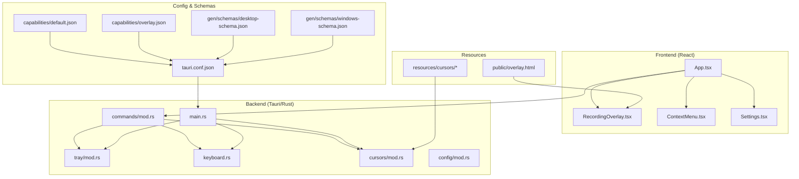
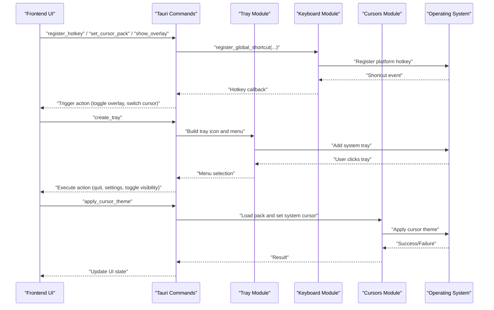
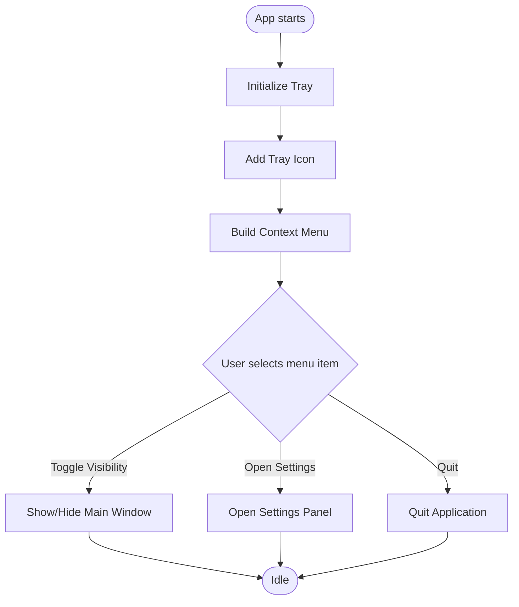
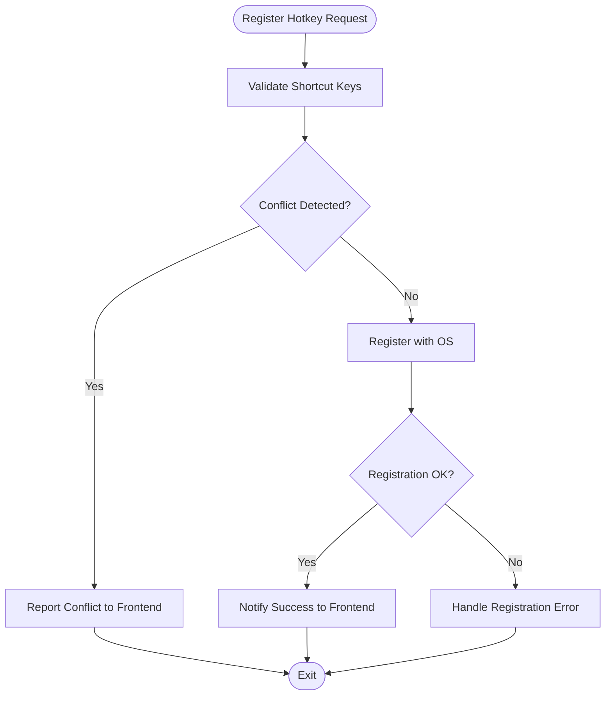
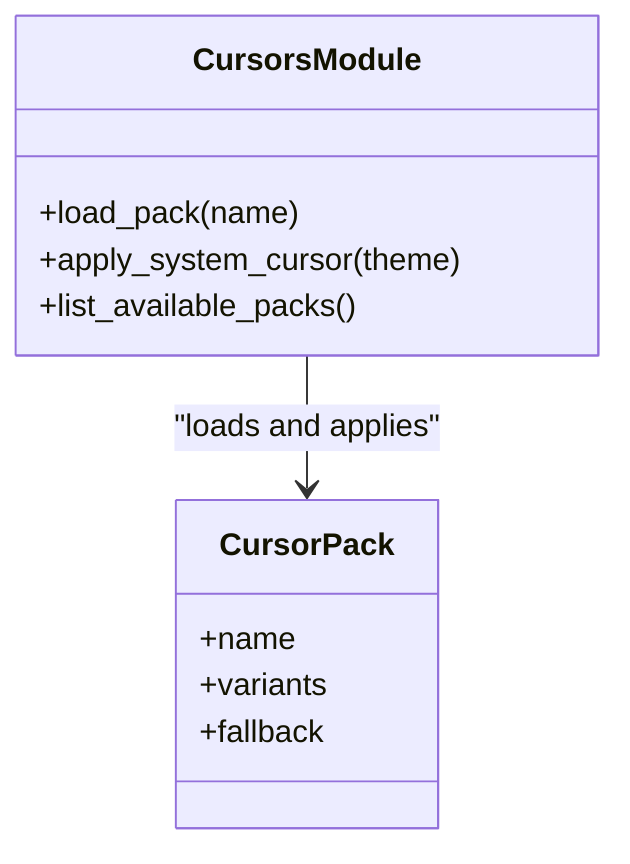
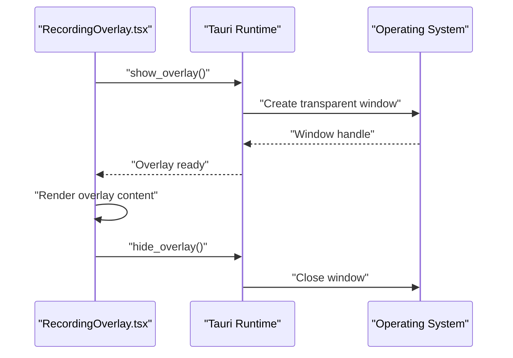
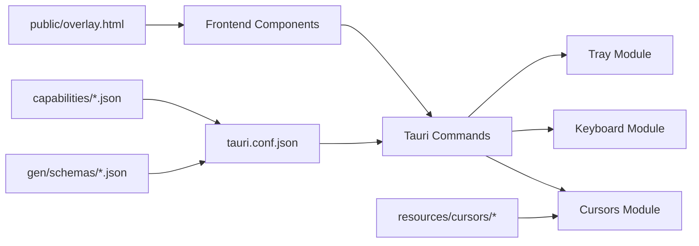

# Advanced Features

<cite>
**Referenced Files in This Document**
- [README.md](file://README.md)
- [tauri.conf.json](file://src-tauri/tauri.conf.json)
- [Cargo.toml](file://src-tauri/Cargo.toml)
- [mod.rs (tray)](file://src-tauri/src/tray/mod.rs)
- [mod.rs (keyboard)](file://src-tauri/src/keyboard.rs)
- [mod.rs (cursors)](file://src-tauri/src/cursors/mod.rs)
- [overlay.html](file://public/overlay.html)
- [RecordingOverlay.tsx](file://src/components/RecordingOverlay.tsx)
- [ContextMenu.tsx](file://src/components/ContextMenu.tsx)
- [Settings.tsx](file://src/components/Settings.tsx)
- [default.json (capabilities)](file://src-tauri/capabilities/default.json)
- [overlay.json (capabilities)](file://src-tauri/capabilities/overlay.json)
- [desktop-schema.json](file://src-tauri/gen/schemas/desktop-schema.json)
- [windows-schema.json](file://src-tauri/gen/schemas/windows-schema.json)
</cite>

## Table of Contents
1. [Introduction](#introduction)
2. [Project Structure](#project-structure)
3. [Core Components](#core-components)
4. [Architecture Overview](#architecture-overview)
5. [Detailed Component Analysis](#detailed-component-analysis)
6. [Dependency Analysis](#dependency-analysis)
7. [Performance Considerations](#performance-considerations)
8. [Troubleshooting Guide](#troubleshooting-guide)
9. [Conclusion](#conclusion)
10. [Appendices](#appendices)

## Introduction
This document explains EasySpecy’s advanced features with a focus on system tray integration, global hotkey management, custom cursor packs, and transparent overlay windows. It also covers background operation capabilities, hotkey conflict resolution, cross-platform behavior, cursor theme customization, and practical guidance for extending the application with custom features.

## Project Structure
EasySpecy is a Tauri-based desktop application with a React frontend and Rust backend. Advanced features are implemented across:
- Frontend components for overlays, context menus, and settings
- Backend modules for tray, keyboard shortcuts, and cursor management
- Configuration files for capabilities, schemas, and runtime permissions
- Cursor resource packs under the resources directory

**Diagram sources**
- [tauri.conf.json](file://src-tauri/tauri.conf.json)
- [mod.rs (tray)](file://src-tauri/src/tray/mod.rs)
- [mod.rs (keyboard)](file://src-tauri/src/keyboard.rs)
- [mod.rs (cursors)](file://src-tauri/src/cursors/mod.rs)
- [RecordingOverlay.tsx](file://src/components/RecordingOverlay.tsx)
- [overlay.html](file://public/overlay.html)
- [default.json (capabilities)](file://src-tauri/capabilities/default.json)
- [overlay.json (capabilities)](file://src-tauri/capabilities/overlay.json)
- [desktop-schema.json](file://src-tauri/gen/schemas/desktop-schema.json)
- [windows-schema.json](file://src-tauri/gen/schemas/windows-schema.json)

**Section sources**
- [README.md](file://README.md)
- [tauri.conf.json](file://src-tauri/tauri.conf.json)

## Core Components
- System Tray: Provides background operation, persistent icon, and context menu actions.
- Global Hotkeys: Registers platform-specific shortcuts and resolves conflicts.
- Cursor Packs: Loads custom cursor themes from resource packs and applies them system-wide.
- Transparent Overlay: Renders an HTML overlay window for recording indicators and controls.

**Section sources**
- [mod.rs (tray)](file://src-tauri/src/tray/mod.rs)
- [mod.rs (keyboard)](file://src-tauri/src/keyboard.rs)
- [mod.rs (cursors)](file://src-tauri/src/cursors/mod.rs)
- [overlay.html](file://public/overlay.html)
- [RecordingOverlay.tsx](file://src/components/RecordingOverlay.tsx)

## Architecture Overview
The advanced features integrate via Tauri commands invoked from the frontend. The backend manages OS-level integrations (tray, keyboard, cursor) while the frontend renders overlays and settings UI.

**Diagram sources**
- [mod.rs (tray)](file://src-tauri/src/tray/mod.rs)
- [mod.rs (keyboard)](file://src-tauri/src/keyboard.rs)
- [mod.rs (cursors)](file://src-tauri/src/cursors/mod.rs)
- [RecordingOverlay.tsx](file://src/components/RecordingOverlay.tsx)

## Detailed Component Analysis

### System Tray Integration
- Background Operation: The tray module creates a persistent icon and context menu, enabling the app to continue running when the main window is closed.
- Context Menu Options: Typical options include toggling visibility, opening settings, and quitting the application.
- Tray Icon Functionality: The icon reflects current state (e.g., recording) and supports right-click actions.

Implementation highlights:
- Tray creation and menu construction are handled in the tray module.
- Tauri configuration defines tray-related capabilities and permissions.

**Diagram sources**
- [mod.rs (tray)](file://src-tauri/src/tray/mod.rs)
- [tauri.conf.json](file://src-tauri/tauri.conf.json)

**Section sources**
- [mod.rs (tray)](file://src-tauri/src/tray/mod.rs)
- [tauri.conf.json](file://src-tauri/tauri.conf.json)

### Global Hotkey Management
- Registration: The keyboard module registers platform-specific global shortcuts for actions like toggling overlays or switching modes.
- Conflict Resolution: When a shortcut conflicts with another application, the system surfaces a conflict and allows the user to change the binding.
- Cross-Platform Behavior: Hotkey modifiers and keys vary by OS; the backend normalizes behavior and reports errors consistently.

**Diagram sources**
- [mod.rs (keyboard)](file://src-tauri/src/keyboard.rs)
- [tauri.conf.json](file://src-tauri/tauri.conf.json)

**Section sources**
- [mod.rs (keyboard)](file://src-tauri/src/keyboard.rs)
- [tauri.conf.json](file://src-tauri/tauri.conf.json)

### Custom Cursor Packs
- Resource Packs: Cursor themes are stored under resources/cursors and include multiple variants (e.g., easyspecy, macos, material, posy, win11).
- Loading and Applying: The cursors module loads a selected pack and applies it system-wide.
- Theme Customization: Users can switch packs from the settings panel; the frontend triggers backend commands to apply the new theme.

**Diagram sources**
- [mod.rs (cursors)](file://src-tauri/src/cursors/mod.rs)
- [tauri.conf.json](file://src-tauri/tauri.conf.json)

**Section sources**
- [mod.rs (cursors)](file://src-tauri/src/cursors/mod.rs)
- [tauri.conf.json](file://src-tauri/tauri.conf.json)

### Transparent Overlay Windows
- HTML Overlay: The overlay window is built from overlay.html and rendered on top of other applications.
- Frontend Integration: RecordingOverlay.tsx coordinates UI elements and state for the overlay.
- Capabilities and Permissions: Overlay capabilities are defined in capabilities/overlay.json and enforced by Tauri.

**Diagram sources**
- [overlay.html](file://public/overlay.html)
- [RecordingOverlay.tsx](file://src/components/RecordingOverlay.tsx)
- [overlay.json (capabilities)](file://src-tauri/capabilities/overlay.json)
- [tauri.conf.json](file://src-tauri/tauri.conf.json)

**Section sources**
- [overlay.html](file://public/overlay.html)
- [RecordingOverlay.tsx](file://src/components/RecordingOverlay.tsx)
- [overlay.json (capabilities)](file://src-tauri/capabilities/overlay.json)
- [tauri.conf.json](file://src-tauri/tauri.conf.json)

## Dependency Analysis
- Frontend-to-Backend: The frontend invokes Tauri commands to manage tray, keyboard, and cursor features.
- Configuration: tauri.conf.json defines capabilities and schemas that enable advanced features.
- Resources: Cursor packs are bundled under resources/cursors and referenced by the cursors module.

**Diagram sources**
- [tauri.conf.json](file://src-tauri/tauri.conf.json)
- [default.json (capabilities)](file://src-tauri/capabilities/default.json)
- [overlay.json (capabilities)](file://src-tauri/capabilities/overlay.json)
- [desktop-schema.json](file://src-tauri/gen/schemas/desktop-schema.json)
- [windows-schema.json](file://src-tauri/gen/schemas/windows-schema.json)
- [mod.rs (tray)](file://src-tauri/src/tray/mod.rs)
- [mod.rs (keyboard)](file://src-tauri/src/keyboard.rs)
- [mod.rs (cursors)](file://src-tauri/src/cursors/mod.rs)
- [overlay.html](file://public/overlay.html)

**Section sources**
- [tauri.conf.json](file://src-tauri/tauri.conf.json)
- [Cargo.toml](file://src-tauri/Cargo.toml)

## Performance Considerations
- Overlay rendering: Keep overlay content lightweight to minimize GPU/CPU overhead.
- Cursor switching: Batch theme changes and avoid frequent reloads to reduce system calls.
- Hotkey registration: Prefer fewer, well-scoped shortcuts to reduce conflict checks and OS overhead.
- Tray updates: Debounce context menu updates to prevent excessive redraws.

## Troubleshooting Guide
- Overlay not visible:
  - Verify overlay capability configuration and runtime permissions.
  - Confirm the overlay HTML file exists and is reachable.
  - Check for transparency or z-order issues on the target OS.
- Hotkey does not trigger:
  - Inspect for conflicts reported by the keyboard module.
  - Re-register the shortcut after changing OS-level bindings.
  - Validate modifier keys and platform-specific key names.
- Cursor pack not applied:
  - Ensure the selected pack exists under resources/cursors.
  - Confirm the cursors module loaded the pack successfully.
  - Try switching to a different pack to isolate the issue.
- Tray icon missing:
  - Rebuild tray with updated configuration.
  - Check OS permissions for system tray access.

**Section sources**
- [overlay.json (capabilities)](file://src-tauri/capabilities/overlay.json)
- [overlay.html](file://public/overlay.html)
- [mod.rs (keyboard)](file://src-tauri/src/keyboard.rs)
- [mod.rs (cursors)](file://src-tauri/src/cursors/mod.rs)
- [mod.rs (tray)](file://src-tauri/src/tray/mod.rs)

## Conclusion
EasySpecy’s advanced features combine a robust Tauri backend with a responsive React frontend to deliver tray-based background operation, reliable global hotkeys, flexible cursor customization, and transparent overlays. Proper configuration and capability management are essential for cross-platform stability and user-friendly behavior.

## Appendices
- Extending with custom features:
  - Add new Tauri commands in the backend and expose them to the frontend.
  - Define capabilities and schemas for new permissions.
  - Integrate UI components to trigger and visualize new features.
- Example advanced configurations:
  - Define custom hotkey sets per user profile.
  - Add new cursor packs by placing variants under resources/cursors.
  - Configure overlay content via public/overlay.html and render it conditionally from the frontend.