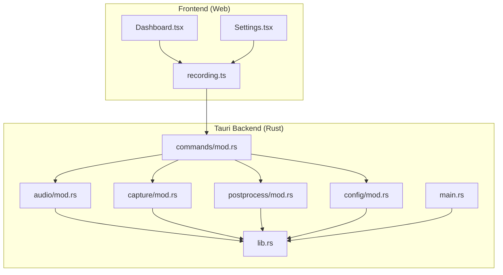
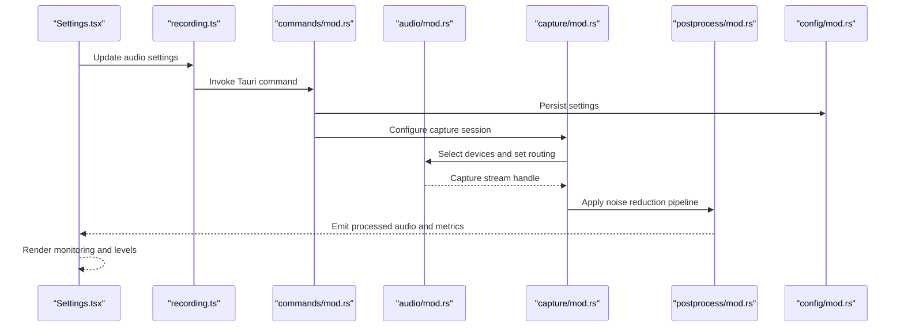
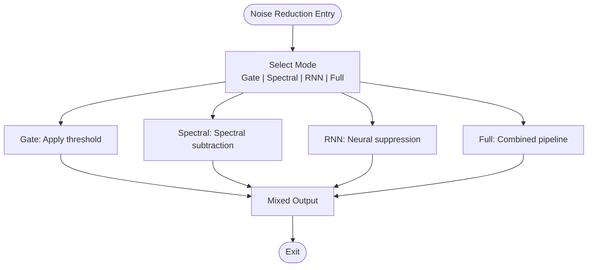
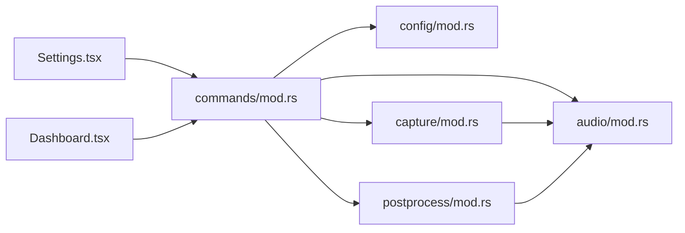

# Audio Processing

<cite>
**Referenced Files in This Document**
- [README.md](file://README.md)
- [src-tauri/src/lib.rs](file://src-tauri/src/lib.rs)
- [src-tauri/src/main.rs](file://src-tauri/src/main.rs)
- [src-tauri/src/audio/mod.rs](file://src-tauri/src/audio/mod.rs)
- [src-tauri/src/capture/mod.rs](file://src-tauri/src/capture/mod.rs)
- [src-tauri/src/commands/mod.rs](file://src-tauri/src/commands/mod.rs)
- [src-tauri/src/config/mod.rs](file://src-tauri/src/config/mod.rs)
- [src-tauri/src/postprocess/mod.rs](file://src-tauri/src/postprocess/mod.rs)
- [src/stores/recording.ts](file://src/stores/recording.ts)
- [src/components/Dashboard.tsx](file://src/components/Dashboard.tsx)
- [src/components/Settings.tsx](file://src/components/Settings.tsx)
</cite>

## Table of Contents
1. [Introduction](#introduction)
2. [Project Structure](#project-structure)
3. [Core Components](#core-components)
4. [Architecture Overview](#architecture-overview)
5. [Detailed Component Analysis](#detailed-component-analysis)
6. [Dependency Analysis](#dependency-analysis)
7. [Performance Considerations](#performance-considerations)
8. [Troubleshooting Guide](#troubleshooting-guide)
9. [Conclusion](#conclusion)
10. [Appendices](#appendices)

## Introduction
This document explains EasySpecy’s audio processing capabilities, focusing on microphone and system audio capture, device enumeration and selection, mixing algorithms, noise reduction pipeline, monitoring and real-time visualization, quality settings, noise gate thresholds, noise reduction modes (Gate, Spectral, RNN, Full), and audio routing options. It also provides practical setup examples, troubleshooting tips, and optimization strategies for different recording scenarios.

## Project Structure
EasySpecy integrates a Tauri backend (Rust) for audio capture and processing with a frontend (TypeScript/React) for configuration and monitoring. Audio-related Rust modules include audio capture, post-processing, and command bridges to the UI. The frontend exposes recording state and settings via React stores and components.

**Diagram sources**
- [src-tauri/src/lib.rs](file://src-tauri/src/lib.rs)
- [src-tauri/src/main.rs](file://src-tauri/src/main.rs)
- [src-tauri/src/audio/mod.rs](file://src-tauri/src/audio/mod.rs)
- [src-tauri/src/capture/mod.rs](file://src-tauri/src/capture/mod.rs)
- [src-tauri/src/commands/mod.rs](file://src-tauri/src/commands/mod.rs)
- [src-tauri/src/config/mod.rs](file://src-tauri/src/config/mod.rs)
- [src-tauri/src/postprocess/mod.rs](file://src-tauri/src/postprocess/mod.rs)
- [src/stores/recording.ts](file://src/stores/recording.ts)
- [src/components/Dashboard.tsx](file://src/components/Dashboard.tsx)
- [src/components/Settings.tsx](file://src/components/Settings.tsx)

**Section sources**
- [README.md](file://README.md)
- [src-tauri/src/lib.rs](file://src-tauri/src/lib.rs)
- [src-tauri/src/main.rs](file://src-tauri/src/main.rs)

## Core Components
- Audio capture module: Provides microphone/system audio capture and device enumeration/select.
- Capture module: Orchestrates capture sessions and routing.
- Post-process module: Implements noise reduction pipeline (Gate, Spectral, RNN, Full).
- Commands module: Exposes Tauri commands for UI to configure and control audio.
- Config module: Manages persistent audio settings and quality profiles.
- Frontend stores and components: Manage recording state, expose settings UI, and visualize levels.

Key responsibilities:
- Device discovery and selection for input/output devices.
- Real-time audio monitoring and level visualization.
- Noise gate threshold configuration and noise reduction mode selection.
- Routing options for microphone vs. system audio.
- Quality tuning for latency, bandwidth, and fidelity.

**Section sources**
- [src-tauri/src/audio/mod.rs](file://src-tauri/src/audio/mod.rs)
- [src-tauri/src/capture/mod.rs](file://src-tauri/src/capture/mod.rs)
- [src-tauri/src/postprocess/mod.rs](file://src-tauri/src/postprocess/mod.rs)
- [src-tauri/src/commands/mod.rs](file://src-tauri/src/commands/mod.rs)
- [src-tauri/src/config/mod.rs](file://src-tauri/src/config/mod.rs)
- [src/stores/recording.ts](file://src/stores/recording.ts)
- [src/components/Settings.tsx](file://src/components/Settings.tsx)

## Architecture Overview
The audio pipeline connects UI controls to Rust modules that manage capture, processing, and configuration. Commands bridge the UI to backend services, enabling dynamic updates to capture parameters, noise reduction modes, and routing.

**Diagram sources**
- [src-tauri/src/commands/mod.rs](file://src-tauri/src/commands/mod.rs)
- [src-tauri/src/audio/mod.rs](file://src-tauri/src/audio/mod.rs)
- [src-tauri/src/capture/mod.rs](file://src-tauri/src/capture/mod.rs)
- [src-tauri/src/postprocess/mod.rs](file://src-tauri/src/postprocess/mod.rs)
- [src-tauri/src/config/mod.rs](file://src-tauri/src/config/mod.rs)
- [src/stores/recording.ts](file://src/stores/recording.ts)
- [src/components/Settings.tsx](file://src/components/Settings.tsx)

## Detailed Component Analysis

### Microphone and System Audio Capture
- Device enumeration and selection:
  - Enumerate input devices (microphones) and output devices (speakers/headphones).
  - Allow users to select preferred input/output for capture and monitoring.
- Capture session management:
  - Initialize capture streams with selected devices.
  - Route microphone or system audio depending on user preference.
- Monitoring:
  - Provide real-time level visualization for input and mixed output.

Practical example:
- Select a USB microphone as the primary input and route system audio to speakers for monitoring.

**Section sources**
- [src-tauri/src/audio/mod.rs](file://src-tauri/src/audio/mod.rs)
- [src-tauri/src/capture/mod.rs](file://src-tauri/src/capture/mod.rs)
- [src/components/Settings.tsx](file://src/components/Settings.tsx)

### Mixing Algorithms
- Input blending:
  - Combine microphone and system audio with adjustable gains.
- Level normalization:
  - Maintain consistent levels across mixed channels.
- Output routing:
  - Send mixed signal to selected output device for monitoring.

Practical example:
- Increase microphone gain slightly while reducing system audio to prevent clipping during monitoring.

**Section sources**
- [src-tauri/src/audio/mod.rs](file://src-tauri/src/audio/mod.rs)
- [src-tauri/src/postprocess/mod.rs](file://src-tauri/src/postprocess/mod.rs)

### Noise Reduction Pipeline
Modes:
- Gate: Suppresses low-energy signals below a configurable threshold to reduce background noise.
- Spectral: Applies spectral subtraction techniques to reduce stationary noise.
- RNN: Uses neural networks for adaptive noise suppression.
- Full: Combines Gate, Spectral, and RNN for comprehensive noise reduction.

Threshold configuration:
- Noise gate threshold defines the energy floor for signal pass-through.
- Adjustable per-mode to balance noise suppression and speech intelligibility.

Practical example:
- Use Gate for quiet environments, Spectral for steady hum, RNN for complex noise, and Full for demanding scenarios.

**Diagram sources**
- [src-tauri/src/postprocess/mod.rs](file://src-tauri/src/postprocess/mod.rs)

**Section sources**
- [src-tauri/src/postprocess/mod.rs](file://src-tauri/src/postprocess/mod.rs)

### Audio Monitoring and Real-Time Level Visualization
- Real-time metering:
  - Compute RMS or peak levels for input and output channels.
- UI rendering:
  - Display decibel levels and clip indicators in the dashboard.
- Feedback loop:
  - Adjust gains and thresholds based on visual feedback.

Practical example:
- Monitor input levels to avoid clipping; adjust microphone gain until meters stay within safe range.

**Section sources**
- [src/components/Dashboard.tsx](file://src/components/Dashboard.tsx)
- [src/stores/recording.ts](file://src/stores/recording.ts)

### Audio Quality Settings
- Sampling rate and bit depth:
  - Choose appropriate rates for fidelity vs. CPU usage.
- Latency targets:
  - Balance responsiveness with power consumption.
- Compression and encoding:
  - Optimize for bandwidth or local storage needs.

Practical example:
- For voice clarity, prefer higher sampling rates; for battery life, reduce bitrate.

**Section sources**
- [src-tauri/src/config/mod.rs](file://src-tauri/src/config/mod.rs)
- [src/components/Settings.tsx](file://src/components/Settings.tsx)

### Noise Gate Threshold Configuration
- Threshold definition:
  - Energy floor below which signals are attenuated.
- Dynamic adjustment:
  - Calibrate threshold to ambient noise conditions.
- Interaction with modes:
  - Gate complements Spectral/RNN; tune thresholds accordingly.

Practical example:
- Set a moderate threshold to suppress typing sounds while preserving speech.

**Section sources**
- [src-tauri/src/postprocess/mod.rs](file://src-tauri/src/postprocess/mod.rs)

### Audio Routing Options
- Microphone-only:
  - Capture only the selected input device.
- System audio-only:
  - Capture system/application audio.
- Mixed:
  - Combine microphone and system audio with independent gains.

Practical example:
- Use mixed routing for podcast-style recordings with both voice and system audio.

**Section sources**
- [src-tauri/src/audio/mod.rs](file://src-tauri/src/audio/mod.rs)
- [src-tauri/src/capture/mod.rs](file://src-tauri/src/capture/mod.rs)

## Dependency Analysis
The audio subsystem depends on configuration persistence, capture orchestration, and post-processing modules. The UI interacts with commands to apply runtime changes.

**Diagram sources**
- [src-tauri/src/commands/mod.rs](file://src-tauri/src/commands/mod.rs)
- [src-tauri/src/config/mod.rs](file://src-tauri/src/config/mod.rs)
- [src-tauri/src/capture/mod.rs](file://src-tauri/src/capture/mod.rs)
- [src-tauri/src/audio/mod.rs](file://src-tauri/src/audio/mod.rs)
- [src-tauri/src/postprocess/mod.rs](file://src-tauri/src/postprocess/mod.rs)
- [src/components/Settings.tsx](file://src/components/Settings.tsx)
- [src/components/Dashboard.tsx](file://src/components/Dashboard.tsx)

**Section sources**
- [src-tauri/src/commands/mod.rs](file://src-tauri/src/commands/mod.rs)
- [src-tauri/src/config/mod.rs](file://src-tauri/src/config/mod.rs)
- [src-tauri/src/capture/mod.rs](file://src-tauri/src/capture/mod.rs)
- [src-tauri/src/audio/mod.rs](file://src-tauri/src/audio/mod.rs)
- [src-tauri/src/postprocess/mod.rs](file://src-tauri/src/postprocess/mod.rs)

## Performance Considerations
- Latency:
  - Reduce buffer sizes for lower latency; increase for stability on weak CPUs.
- CPU usage:
  - Prefer simpler modes (Gate) for constrained systems; use Full only when necessary.
- Power consumption:
  - Lower sampling rates and bit depths for mobile or battery-powered setups.
- Monitoring overhead:
  - Limit visualization refresh rate to avoid impacting capture performance.

## Troubleshooting Guide
Common issues and resolutions:
- No audio captured:
  - Verify device selection and permissions; ensure the correct input/output is chosen.
- Distorted or clipped audio:
  - Lower input gain; check noise gate threshold; confirm adequate headroom.
- Background noise:
  - Increase noise reduction mode strength; calibrate noise gate threshold; switch to Spectral or RNN.
- Monitoring mismatch:
  - Confirm routing settings; ensure output device matches speakers/headphones.
- Poor quality:
  - Increase sampling rate/bit depth; reduce latency aggressively; optimize compression settings.

**Section sources**
- [src-tauri/src/audio/mod.rs](file://src-tauri/src/audio/mod.rs)
- [src-tauri/src/postprocess/mod.rs](file://src-tauri/src/postprocess/mod.rs)
- [src/components/Settings.tsx](file://src/components/Settings.tsx)

## Conclusion
EasySpecy’s audio processing combines flexible device selection, robust mixing, and a configurable noise reduction pipeline. With real-time monitoring and quality controls, users can tailor audio capture to diverse scenarios—from quiet voice recordings to mixed-content podcasts—while maintaining performance and clarity.

## Appendices

### Practical Setup Examples
- Quiet voice recording:
  - Microphone-only routing, moderate noise gate threshold, Gate mode.
- Mixed podcast:
  - Mixed routing, balanced gains, Spectral mode.
- Noisy environment:
  - Mixed routing, calibrated noise gate threshold, Full mode.

### Optimizing for Scenarios
- Voice clarity:
  - Higher sampling rate, moderate latency, RNN or Full.
- Battery life:
  - Lower sampling rate, reduced latency, Gate mode.
- Low-latency streaming:
  - Minimal latency, moderate gains, Gate mode.