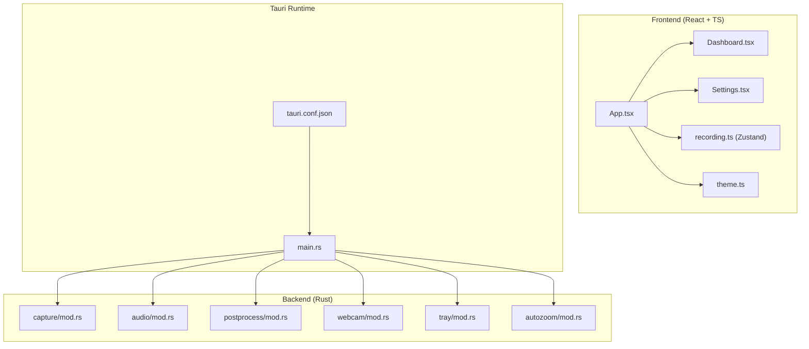
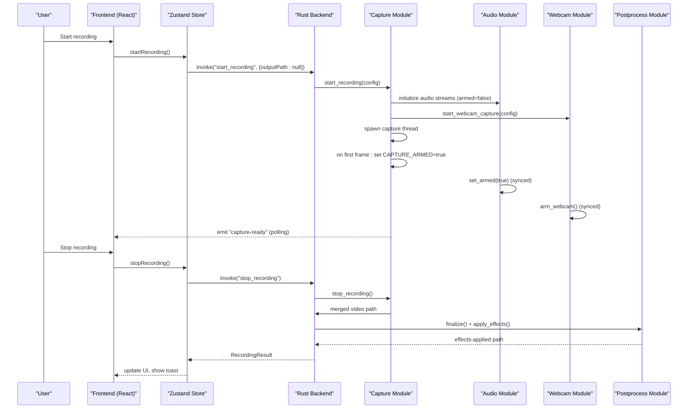
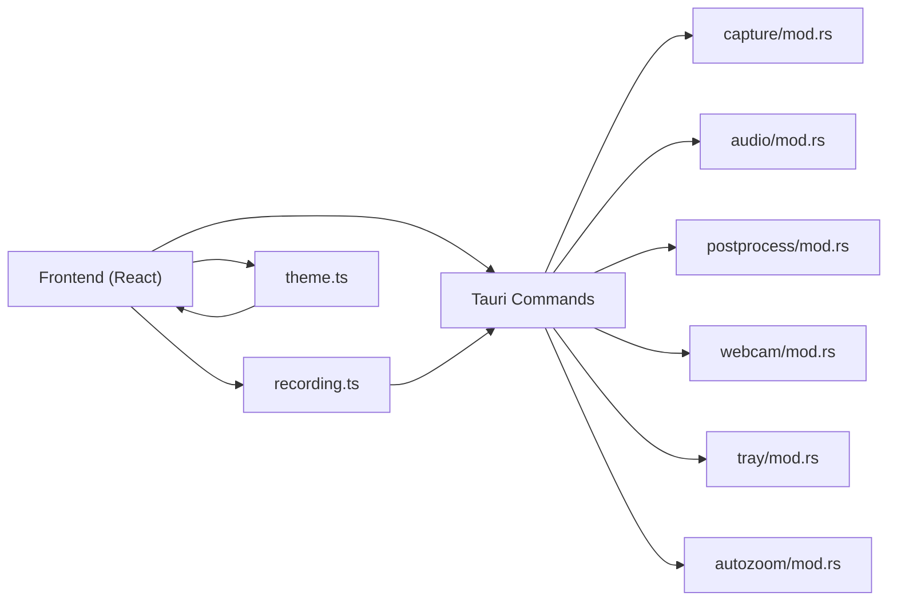

# Core Features

<cite>
**Referenced Files in This Document**
- [README.md](file://README.md)
- [App.tsx](file://src/App.tsx)
- [main.tsx](file://src/main.tsx)
- [Dashboard.tsx](file://src/components/Dashboard.tsx)
- [Settings.tsx](file://src/components/Settings.tsx)
- [recording.ts](file://src/stores/recording.ts)
- [theme.ts](file://src/lib/theme.ts)
- [main.rs](file://src-tauri/src/main.rs)
- [tauri.conf.json](file://src-tauri/tauri.conf.json)
- [mod.rs (capture)](file://src-tauri/src/capture/mod.rs)
- [mod.rs (audio)](file://src-tauri/src/audio/mod.rs)
- [mod.rs (postprocess)](file://src-tauri/src/postprocess/mod.rs)
- [mod.rs (webcam)](file://src-tauri/src/webcam/mod.rs)
- [mod.rs (tray)](file://src-tauri/src/tray/mod.rs)
- [mod.rs (autozoom)](file://src-tauri/src/autozoom/mod.rs)
</cite>

## Table of Contents
1. [Introduction](#introduction)
2. [Project Structure](#project-structure)
3. [Core Components](#core-components)
4. [Architecture Overview](#architecture-overview)
5. [Detailed Component Analysis](#detailed-component-analysis)
6. [Dependency Analysis](#dependency-analysis)
7. [Performance Considerations](#performance-considerations)
8. [Troubleshooting Guide](#troubleshooting-guide)
9. [Conclusion](#conclusion)

## Introduction
This document explains EasySpecy’s core features with a focus on implementation approach, configuration, user workflows, integrations, and platform behaviors. It covers:
- Screen recording (full-screen, region-based, window capture)
- Visual effects engine (cursor trails, click animations, webcam overlays)
- Audio processing (microphone and system audio mixing)
- User interface components (dashboard, settings, system tray)
- Advanced features (global hotkeys, transparent overlays, customizable themes)

## Project Structure
The application is a Tauri 2 desktop app with a React + TypeScript frontend and a Rust backend. The frontend manages UI, configuration, and user interactions. The backend handles OS-level capture, audio mixing, FFmpeg-based encoding, and post-processing.

**Diagram sources**
- [App.tsx:1-208](file://src/App.tsx#L1-L208)
- [Dashboard.tsx:1-586](file://src/components/Dashboard.tsx#L1-L586)
- [Settings.tsx:1-1115](file://src/components/Settings.tsx#L1-L1115)
- [recording.ts:1-404](file://src/stores/recording.ts#L1-L404)
- [theme.ts:1-51](file://src/lib/theme.ts#L1-L51)
- [main.rs:1-7](file://src-tauri/src/main.rs#L1-L7)
- [tauri.conf.json:1-48](file://src-tauri/tauri.conf.json#L1-L48)
- [mod.rs (capture):1-1064](file://src-tauri/src/capture/mod.rs#L1-L1064)
- [mod.rs (audio):1-980](file://src-tauri/src/audio/mod.rs#L1-L980)
- [mod.rs (postprocess):1-1697](file://src-tauri/src/postprocess/mod.rs#L1-L1697)
- [mod.rs (webcam):1-620](file://src-tauri/src/webcam/mod.rs#L1-L620)
- [mod.rs (tray):1-56](file://src-tauri/src/tray/mod.rs#L1-L56)
- [mod.rs (autozoom):1-101](file://src-tauri/src/autozoom/mod.rs#L1-L101)

**Section sources**
- [README.md:1-63](file://README.md#L1-L63)
- [main.tsx:1-15](file://src/main.tsx#L1-L15)
- [tauri.conf.json:1-48](file://src-tauri/tauri.conf.json#L1-L48)

## Core Components
- Screen capture and encoding: full-screen or region-based capture with synchronized audio/video, optional webcam overlay, and FFmpeg-based post-processing.
- Audio capture and mixing: cpal-backed capture with optional noise reduction and mixing of microphone and system audio.
- Visual effects engine: cursor trail and click effects metadata collection and FFmpeg-based rendering (with live overlay support).
- UI and configuration: dashboard for controls, settings panel for all options, and a theme store for dark/light mode.
- System integration: global hotkeys, system tray, and notifications.

**Section sources**
- [Dashboard.tsx:218-573](file://src/components/Dashboard.tsx#L218-L573)
- [Settings.tsx:40-733](file://src/components/Settings.tsx#L40-L733)
- [recording.ts:5-74](file://src/stores/recording.ts#L5-L74)
- [theme.ts:1-51](file://src/lib/theme.ts#L1-L51)

## Architecture Overview
The recording lifecycle is tightly synchronized: the first video frame arms audio and webcam capture, ensuring sub-millisecond sync. FFmpeg is used for cropping, merging audio, webcam compositing, and encoding. Metadata-driven effects are applied post-encoding.

**Diagram sources**
- [recording.ts:283-336](file://src/stores/recording.ts#L283-L336)
- [mod.rs (capture):163-404](file://src-tauri/src/capture/mod.rs#L163-L404)
- [mod.rs (audio):385-540](file://src-tauri/src/audio/mod.rs#L385-L540)
- [mod.rs (webcam):122-156](file://src-tauri/src/webcam/mod.rs#L122-L156)
- [mod.rs (postprocess):196-556](file://src-tauri/src/postprocess/mod.rs#L196-L556)

## Detailed Component Analysis

### Screen Recording (Full-Screen, Region-Based, Window Capture)
- Modes:
  - Full-screen: primary monitor capture at configured resolution and FPS.
  - Region-based: drag-to-select a rectangle; backend crops via FFmpeg.
  - Window capture: future extension (not shown in current code).
- Synchronization:
  - First video frame sets a capture-arm flag; audio and webcam are armed simultaneously.
  - Mouse tracking thread emits cursor and click events for effects and auto-zoom.
- Encoding:
  - Video encoded to MP4 via a native encoder; audio merged via FFmpeg.
  - Optional webcam overlay composited with shape masks and opacity.
  - Final file produced immediately upon stop.

Practical configuration parameters:
- Resolution, FPS, encoder, quality, recording mode, and output directory.
- Region capture is controlled via a selector overlay and stored for cropping.

User workflow:
- Start via UI or global hotkey → choose mode → start → observe live timer → stop → immediate save.

Platform behaviors:
- Windows capture uses native APIs; FFmpeg is bundled and invoked for post-processing.

**Section sources**
- [Dashboard.tsx:218-573](file://src/components/Dashboard.tsx#L218-L573)
- [recording.ts:265-281](file://src/stores/recording.ts#L265-L281)
- [mod.rs (capture):163-404](file://src-tauri/src/capture/mod.rs#L163-L404)
- [mod.rs (capture):502-714](file://src-tauri/src/capture/mod.rs#L502-L714)
- [mod.rs (capture):717-761](file://src-tauri/src/capture/mod.rs#L717-L761)
- [mod.rs (webcam):237-328](file://src-tauri/src/webcam/mod.rs#L237-L328)

### Visual Effects Engine (Cursor Trails, Click Animations, Webcam Overlays)
- Cursor trail and click effects:
  - During recording, cursor positions and click events are timestamped and stored.
  - Effects are rendered via FFmpeg pipelines (overlay composition) using precomputed frames.
  - Styles include glow, particles, ribbon, dots, aurora, and others; colors and lengths are configurable.
- Webcam overlay:
  - Captures frames as PNGs with optional brightness/contrast/sharpen adjustments.
  - Composites onto the video using FFmpeg with shape masks (circle, rounded, squircle) and opacity.
- Auto-Zoom:
  - Detects click clusters, window dwell, typing, and gestures to generate zoom timelines.
  - Applies smooth spring-physics camera movement in post-processing.

Practical configuration parameters:
- Trail style, color, secondary color, trail length, cursor size multiplier, smoothing.
- Click effect type, webcam shape, size, position, border, opacity, brightness, contrast, sharpen.

User workflow:
- Enable effects in Settings → start recording → see live cursor and click feedback → stop → review effects in final video.

Performance considerations:
- Trail rendering uses precomputation and parallel batches; webcam uses producer-consumer to avoid stalls.

**Section sources**
- [Settings.tsx:423-591](file://src/components/Settings.tsx#L423-L591)
- [mod.rs (postprocess):60-190](file://src-tauri/src/postprocess/mod.rs#L60-L190)
- [mod.rs (postprocess):196-556](file://src-tauri/src/postprocess/mod.rs#L196-L556)
- [mod.rs (webcam):407-580](file://src-tauri/src/webcam/mod.rs#L407-L580)
- [mod.rs (autozoom):14-101](file://src-tauri/src/autozoom/mod.rs#L14-L101)

### Audio Processing (Microphone and System Audio Mixing)
- Sources:
  - Microphone, system audio (loopback), or both.
- Mixing:
  - When both are enabled, samples are overlapped and mixed; system volume is adjustable.
- Noise reduction:
  - Configurable modes: Off, Gate, Spectral, RNN, Full; supports noise gate threshold and strength.
- Monitoring:
  - Real-time VU meters for microphone and system audio; polled by the frontend.

Practical configuration parameters:
- Audio source, sample rate, device selection, mic gain, system volume, noise reduction mode and strength, noise gate threshold.

User workflow:
- Toggle audio in Settings → select source → adjust gains → monitor levels → record → verify levels.

Platform behaviors:
- Uses cpal; WASAPI loopback for system audio on Windows; proper stream lifetime management to avoid device contention.

**Section sources**
- [Settings.tsx:244-364](file://src/components/Settings.tsx#L244-L364)
- [mod.rs (audio):189-540](file://src-tauri/src/audio/mod.rs#L189-L540)
- [mod.rs (audio):682-800](file://src-tauri/src/audio/mod.rs#L682-L800)

### User Interface Components (Dashboard, Settings, System Tray)
- Dashboard:
  - Shows recording status, timer, encoding progress, recent recordings, and quick presets.
  - Integrates with global hotkeys and toast notifications.
- Settings:
  - Comprehensive controls for video, audio, webcam, keyboard overlay, auto-zoom, cursor effects, and general preferences.
  - Includes live previews for cursor packs and interactive effect canvases.
- System Tray:
  - Provides quick actions (start/stop/show/quit) and toggles window focus on click.

Practical configuration parameters:
- Output directory, minimize to tray, copy path on save, theme toggle, and hotkey assignments.

User workflow:
- Navigate via sidebar → configure in Settings → use tray or hotkeys → monitor progress in Dashboard.

**Section sources**
- [Dashboard.tsx:218-573](file://src/components/Dashboard.tsx#L218-L573)
- [Settings.tsx:40-733](file://src/components/Settings.tsx#L40-L733)
- [App.tsx:17-189](file://src/App.tsx#L17-L189)
- [mod.rs (tray):9-56](file://src-tauri/src/tray/mod.rs#L9-L56)

### Advanced Features (Global Hotkeys, Transparent Overlays, Customizable Themes)
- Global hotkeys:
  - Registered/unregistered dynamically based on configuration; supports start, stop, and pause.
- Transparent overlays:
  - Effects are composited into the final video; webcam overlay uses alpha masks for transparency.
- Customizable themes:
  - Persistent dark/light mode with theme store and initialization.

Practical configuration parameters:
- Hotkey combinations for start/stop/pause.
- Theme preference persistence.

User workflow:
- Assign hotkeys in Settings → minimize to tray → control recording globally → switch themes as desired.

**Section sources**
- [recording.ts:236-261](file://src/stores/recording.ts#L236-L261)
- [theme.ts:1-51](file://src/lib/theme.ts#L1-L51)
- [mod.rs (webcam):158-232](file://src-tauri/src/webcam/mod.rs#L158-L232)

## Dependency Analysis
The frontend communicates with the backend via Tauri commands. The backend orchestrates capture, audio, webcam, and postprocessing modules. Stores manage state and hotkey registration.

**Diagram sources**
- [recording.ts:149-403](file://src/stores/recording.ts#L149-L403)
- [theme.ts:12-35](file://src/lib/theme.ts#L12-L35)
- [mod.rs (capture):163-404](file://src-tauri/src/capture/mod.rs#L163-L404)
- [mod.rs (audio):225-540](file://src-tauri/src/audio/mod.rs#L225-L540)
- [mod.rs (postprocess):196-556](file://src-tauri/src/postprocess/mod.rs#L196-L556)
- [mod.rs (webcam):407-580](file://src-tauri/src/webcam/mod.rs#L407-L580)
- [mod.rs (tray):9-56](file://src-tauri/src/tray/mod.rs#L9-L56)
- [mod.rs (autozoom):14-101](file://src-tauri/src/autozoom/mod.rs#L14-L101)

**Section sources**
- [recording.ts:149-403](file://src/stores/recording.ts#L149-L403)
- [theme.ts:12-35](file://src/lib/theme.ts#L12-L35)

## Performance Considerations
- Synchronization:
  - First-frame arm ensures sub-millisecond sync between video, audio, and webcam.
- Parallelization:
  - Post-processing uses parallel computation for effect frames and rayon for batching.
- Producer-consumer:
  - Webcam capture uses a channel to avoid stalling capture while writing frames.
- Encoding:
  - FFmpeg is used for cropping, merging, and compositing; progress is streamed for UI updates.
- Memory and I/O:
  - Temporary directories are cleaned up; metadata and intermediate files are managed carefully.

[No sources needed since this section provides general guidance]

## Troubleshooting Guide
Common issues and resolutions:
- Webcam errors:
  - The backend reports errors to the frontend; the UI shows a toast and stops overlay compositing gracefully.
- Audio device contention:
  - Browser webcam streams are released before backend webcam capture begins.
- No recording started:
  - Ensure capture-ready is true before starting; the UI polls readiness.
- Hotkey conflicts:
  - Change hotkeys in Settings; the store re-registers them automatically.

**Section sources**
- [mod.rs (capture):232-265](file://src-tauri/src/capture/mod.rs#L232-L265)
- [App.tsx:42-59](file://src/App.tsx#L42-L59)
- [recording.ts:236-261](file://src/stores/recording.ts#L236-L261)

## Conclusion
EasySpecy integrates native capture, robust audio mixing, and FFmpeg-powered post-processing to deliver synchronized, cinematic recordings with customizable visual effects. The modular backend and reactive frontend provide a smooth user experience across Windows, with room for future enhancements like window capture and advanced auto-zoom features.