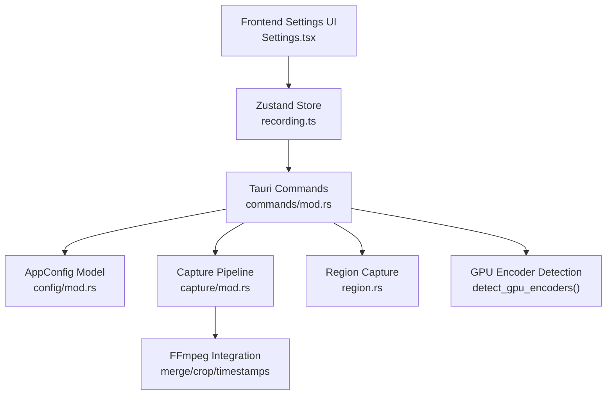
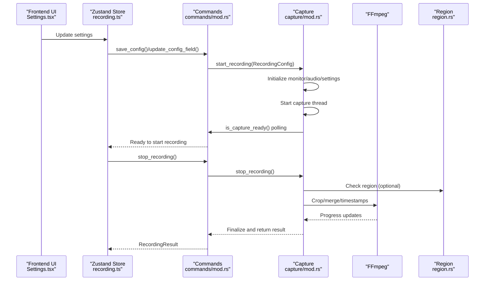
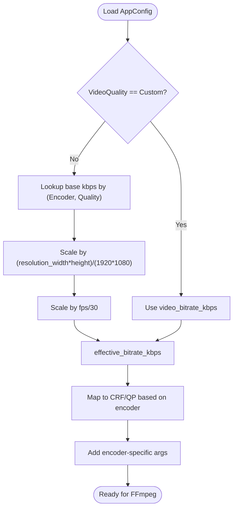
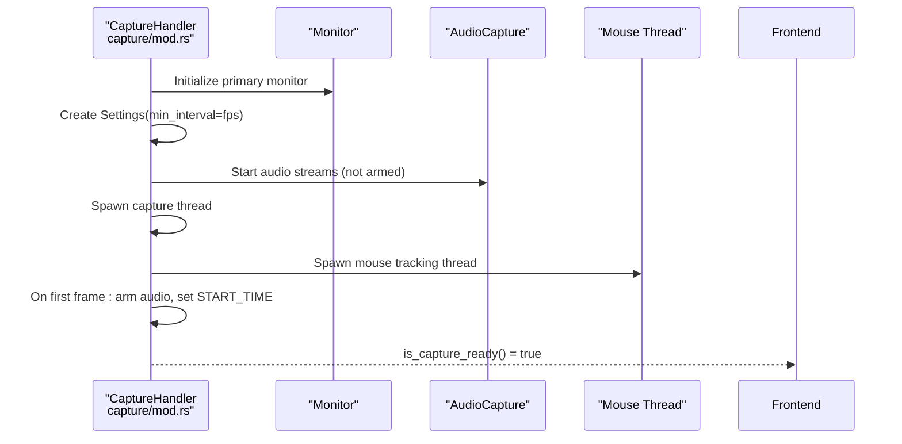
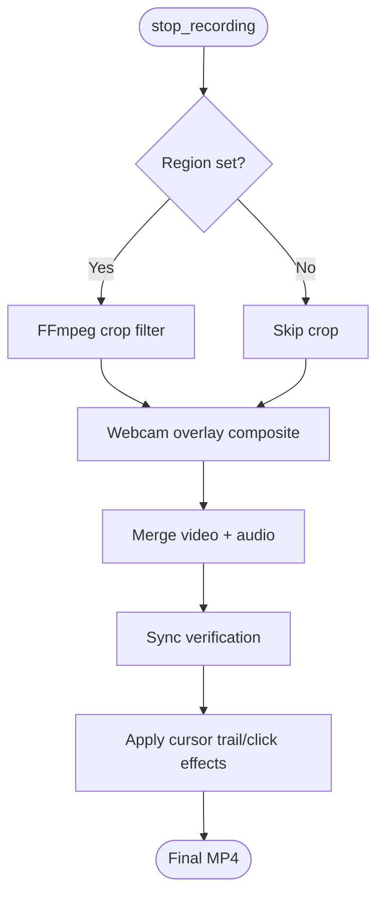
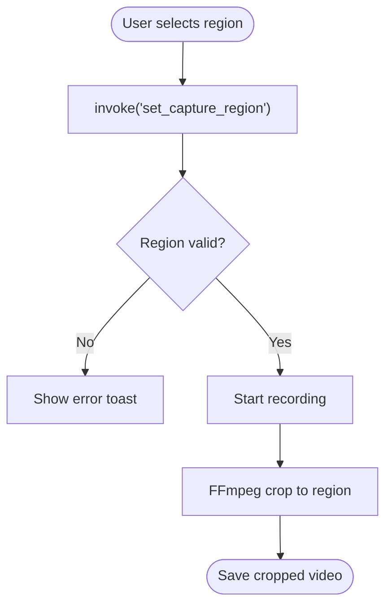
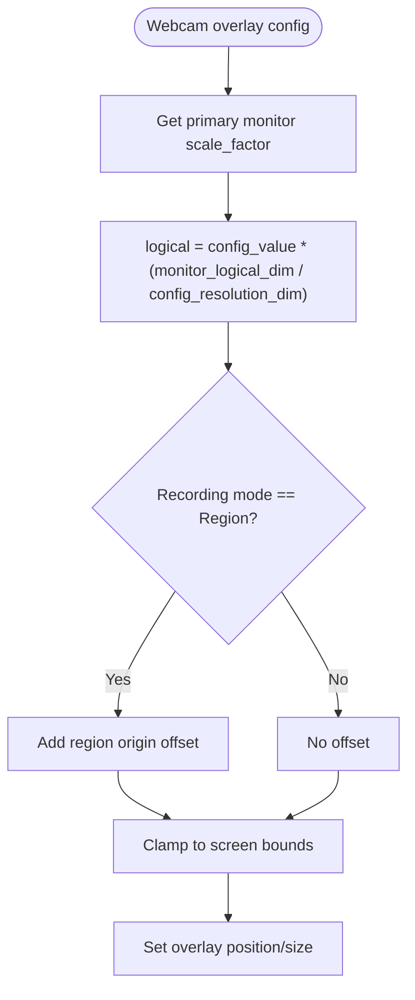
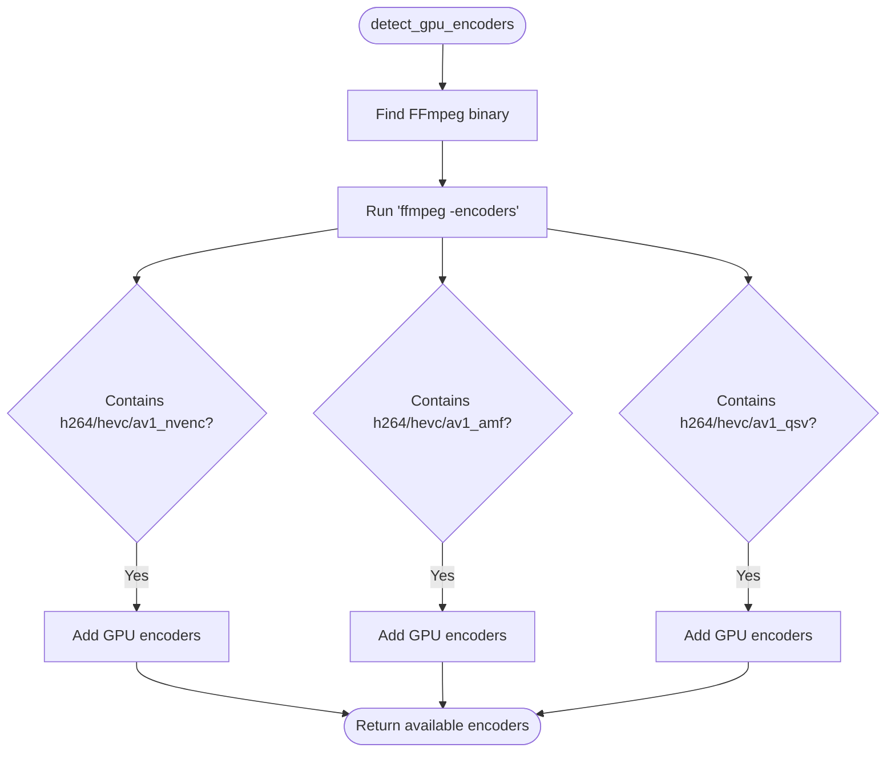
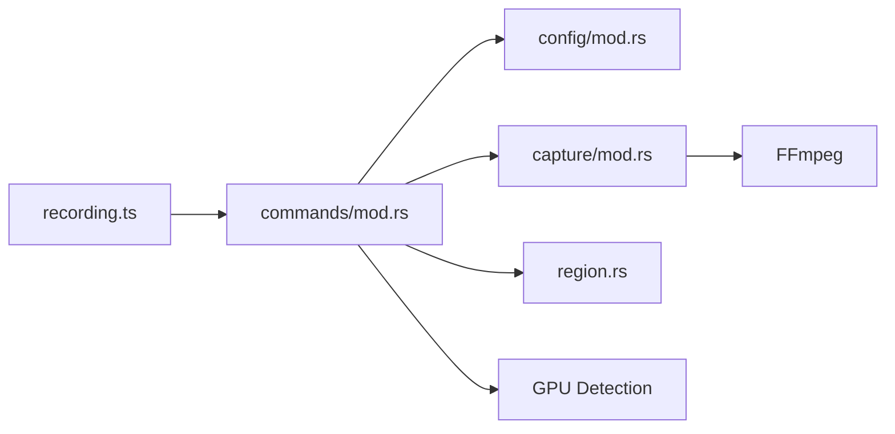

# Capture Configuration

<cite>
**Referenced Files in This Document**
- [mod.rs](file://src-tauri/src/capture/mod.rs)
- [mod.rs](file://src-tauri/src/config/mod.rs)
- [mod.rs](file://src-tauri/src/commands/mod.rs)
- [recording.ts](file://src/stores/recording.ts)
- [Settings.tsx](file://src/components/Settings.tsx)
- [mod.rs](file://src-tauri/src/region.rs)
- [Cargo.toml](file://src-tauri/Cargo.toml)
</cite>

## Table of Contents
1. [Introduction](#introduction)
2. [Project Structure](#project-structure)
3. [Core Components](#core-components)
4. [Architecture Overview](#architecture-overview)
5. [Detailed Component Analysis](#detailed-component-analysis)
6. [Dependency Analysis](#dependency-analysis)
7. [Performance Considerations](#performance-considerations)
8. [Troubleshooting Guide](#troubleshooting-guide)
9. [Conclusion](#conclusion)
10. [Appendices](#appendices)

## Introduction
This document explains EasySpecy's capture configuration system with a focus on resolution, frame rate, video encoders (H264, H265, AV1, VP9), and bitrate control. It details encoder selection logic, quality presets (Low to Ultra), custom bitrate configuration, multi-monitor support, display scaling considerations, capture region validation, and practical configuration examples for gaming, presentations, and video editing. It also covers hardware acceleration options and platform-specific encoder availability.

## Project Structure
The capture configuration spans the frontend (React + Zustand store) and backend (Rust/Tauri):
- Frontend: Settings UI and state management for capture configuration
- Backend: Capture pipeline, configuration model, FFmpeg integration, and IPC commands
- Region capture and multi-monitor support are integrated into the capture flow

**Diagram sources**
- [Settings.tsx:1-800](file://src/components/Settings.tsx#L1-L800)
- [recording.ts:1-405](file://src/stores/recording.ts#L1-L405)
- [mod.rs:1-723](file://src-tauri/src/commands/mod.rs#L1-L723)
- [mod.rs:1-1064](file://src-tauri/src/capture/mod.rs#L1-L1064)
- [mod.rs:1-432](file://src-tauri/src/config/mod.rs#L1-L432)
- [mod.rs:1-226](file://src-tauri/src/region.rs#L1-L226)

**Section sources**
- [Settings.tsx:160-242](file://src/components/Settings.tsx#L160-L242)
- [recording.ts:5-75](file://src/stores/recording.ts#L5-L75)
- [mod.rs:1-723](file://src-tauri/src/commands/mod.rs#L1-L723)

## Core Components
- AppConfig: Central configuration model with resolution, fps, encoder, bitrate, and quality settings
- Capture Pipeline: Windows screen capture, audio synchronization, FFmpeg merging, and post-processing
- FFmpeg Integration: Crop, merge, timestamp fixes, and progress reporting
- Region Capture: Selection and validation of capture regions
- GPU Encoder Detection: Runtime discovery of available hardware encoders

**Section sources**
- [mod.rs:40-57](file://src-tauri/src/capture/mod.rs#L40-L57)
- [mod.rs:404-714](file://src-tauri/src/capture/mod.rs#L502-L714)
- [mod.rs:768-838](file://src-tauri/src/capture/mod.rs#L768-L838)
- [mod.rs:1-226](file://src-tauri/src/region.rs#L1-L226)
- [mod.rs:168-232](file://src-tauri/src/commands/mod.rs#L168-L232)

## Architecture Overview
The capture system initializes on the Rust side, synchronizes video and audio timing, and performs post-processing on the backend using FFmpeg. The frontend manages configuration and displays encoding progress.

**Diagram sources**
- [Settings.tsx:160-242](file://src/components/Settings.tsx#L160-L242)
- [recording.ts:284-337](file://src/stores/recording.ts#L284-L337)
- [mod.rs:249-344](file://src-tauri/src/commands/mod.rs#L249-L344)
- [mod.rs:163-404](file://src-tauri/src/capture/mod.rs#L163-L404)
- [mod.rs:504-714](file://src-tauri/src/capture/mod.rs#L504-L714)
- [mod.rs:436-449](file://src-tauri/src/commands/mod.rs#L436-L449)

## Detailed Component Analysis

### Configuration Model and Presets
AppConfig defines:
- Resolution: width/height
- Frame Rate: fps
- Video Encoder: H264, H265, AV1, AV1_NVENC, H264_NVENC, H265_NVENC, VP9
- Quality Preset: Low, Medium, High, Ultra, Insane, Custom
- Bitrate Control: effective_bitrate_kbps derived from preset and resolution/fps

Encoder selection logic:
- effective_bitrate_kbps scales base rates by resolution and fps factors
- Quality presets map to FFmpeg CRF values or QP for NVENC
- Additional encoder-specific arguments are applied (e.g., SVT-AV1 params, NVENC multipass)

**Diagram sources**
- [mod.rs:279-324](file://src-tauri/src/config/mod.rs#L279-L324)
- [mod.rs:348-394](file://src-tauri/src/config/mod.rs#L348-L394)
- [mod.rs:396-430](file://src-tauri/src/config/mod.rs#L396-L430)

**Section sources**
- [mod.rs:7-93](file://src-tauri/src/config/mod.rs#L7-L93)
- [mod.rs:126-146](file://src-tauri/src/config/mod.rs#L126-L146)
- [mod.rs:279-324](file://src-tauri/src/config/mod.rs#L279-L324)
- [mod.rs:348-394](file://src-tauri/src/config/mod.rs#L348-L394)
- [mod.rs:396-430](file://src-tauri/src/config/mod.rs#L396-L430)

### Capture Pipeline and Synchronization
The capture pipeline:
- Initializes monitor and settings, sets minimum update interval based on fps
- Creates audio streams (armed on first video frame)
- Starts capture thread and mouse tracking thread
- Ensures perfect sync between video and audio (< 1ms drift)

**Diagram sources**
- [mod.rs:163-280](file://src-tauri/src/capture/mod.rs#L163-L280)
- [mod.rs:105-158](file://src-tauri/src/capture/mod.rs#L105-L158)
- [mod.rs:282-401](file://src-tauri/src/capture/mod.rs#L282-L401)

**Section sources**
- [mod.rs:5-11](file://src-tauri/src/capture/mod.rs#L5-L11)
- [mod.rs:163-280](file://src-tauri/src/capture/mod.rs#L163-L280)
- [mod.rs:105-158](file://src-tauri/src/capture/mod.rs#L105-L158)

### FFmpeg Integration and Post-Processing
FFmpeg tasks:
- Crop region using crop filter
- Merge video and audio with aligned timestamps
- Fix timestamps when audio is disabled
- Real-time progress reporting via -progress pipe:1

**Diagram sources**
- [mod.rs:504-714](file://src-tauri/src/capture/mod.rs#L504-L714)
- [mod.rs:717-761](file://src-tauri/src/capture/mod.rs#L717-L761)
- [mod.rs:768-838](file://src-tauri/src/capture/mod.rs#L768-L838)
- [mod.rs:875-932](file://src-tauri/src/capture/mod.rs#L875-L932)

**Section sources**
- [mod.rs:717-761](file://src-tauri/src/capture/mod.rs#L717-L761)
- [mod.rs:768-838](file://src-tauri/src/capture/mod.rs#L768-L838)
- [mod.rs:875-932](file://src-tauri/src/capture/mod.rs#L875-L932)

### Region Capture and Validation
- Region selection UI triggers IPC to set capture region
- Region bounds validated before starting recording
- FFmpeg crop filter applies region bounds during post-processing

**Diagram sources**
- [mod.rs:436-449](file://src-tauri/src/commands/mod.rs#L436-L449)
- [mod.rs:14-24](file://src-tauri/src/region.rs#L14-L24)
- [mod.rs:717-761](file://src-tauri/src/capture/mod.rs#L717-L761)

**Section sources**
- [mod.rs:436-449](file://src-tauri/src/commands/mod.rs#L436-L449)
- [mod.rs:14-24](file://src-tauri/src/region.rs#L14-L24)
- [mod.rs:717-761](file://src-tauri/src/capture/mod.rs#L717-L761)

### Multi-Monitor Support and Display Scaling
- Primary monitor is used for capture initialization
- Webcam overlay positioning converts output-resolution coordinates to logical monitor pixels using scale factors
- Region mode offsets webcam overlay by region origin

**Diagram sources**
- [mod.rs:617-683](file://src-tauri/src/commands/mod.rs#L617-L683)

**Section sources**
- [mod.rs:617-683](file://src-tauri/src/commands/mod.rs#L617-L683)

### Hardware Acceleration and Platform Availability
- GPU encoder detection probes FFmpeg for available encoders (NVENC, AMF, QSV, SVT-AV1)
- Available encoders surfaced to frontend for selection
- NVENC uses constantQP mode; others use CRF

**Diagram sources**
- [mod.rs:168-232](file://src-tauri/src/commands/mod.rs#L168-L232)

**Section sources**
- [mod.rs:168-232](file://src-tauri/src/commands/mod.rs#L168-L232)
- [mod.rs:396-430](file://src-tauri/src/config/mod.rs#L396-L430)

## Dependency Analysis
- Frontend depends on Tauri IPC commands for configuration and capture control
- Backend depends on AppConfig for runtime settings and FFmpeg for media processing
- Region capture integrates with capture pipeline for post-processing

**Diagram sources**
- [recording.ts:150-175](file://src/stores/recording.ts#L150-L175)
- [mod.rs:1-723](file://src-tauri/src/commands/mod.rs#L1-L723)
- [mod.rs:1-1064](file://src-tauri/src/capture/mod.rs#L1-L1064)
- [mod.rs:1-432](file://src-tauri/src/config/mod.rs#L1-L432)
- [mod.rs:1-226](file://src-tauri/src/region.rs#L1-L226)

**Section sources**
- [Cargo.toml:26-61](file://src-tauri/Cargo.toml#L26-L61)

## Performance Considerations
- Higher fps increases CPU/GPU load; recommended 30 for most scenarios, 60 for competitive gaming
- Larger resolutions increase bitrate and encoding time; 1080p is a good default
- Quality presets trade off file size and encoding time; Ultra/Insane presets produce larger files
- NVENC encoders reduce CPU usage but may require compatible GPUs
- Region capture reduces workload by limiting the captured area

[No sources needed since this section provides general guidance]

## Troubleshooting Guide
Common issues and remedies:
- No frames received: capture initialization timeout indicates monitor or permissions issues
- Desync between audio/video: sync verification reports errors; ensure audio is enabled and properly routed
- Poor quality or artifacts: adjust quality preset or switch to a more efficient encoder (e.g., AV1)
- Large file sizes: lower quality preset or use higher-efficiency encoder; consider custom bitrate
- Webcam overlay not visible: ensure device is not in use by other applications; release device before capture

**Section sources**
- [mod.rs:308-324](file://src-tauri/src/commands/mod.rs#L308-L324)
- [mod.rs:644-664](file://src-tauri/src/capture/mod.rs#L644-L664)

## Conclusion
EasySpecy’s capture configuration system provides flexible controls for resolution, frame rate, and encoders, with robust synchronization and post-processing. Users can optimize for performance or quality using presets and custom bitrate, leverage GPU encoders for efficiency, and utilize region capture and multi-monitor support for precise control.

[No sources needed since this section summarizes without analyzing specific files]

## Appendices

### Practical Configuration Examples
- Gaming (high motion, competitive): 1080p or 1440p, 60 fps, H264_NVENC or H265_NVENC, High or Ultra preset
- Presentations (steady scenes): 1080p, 30 fps, AV1 or VP9, Medium or High preset
- Video editing (post-production): 1080p or 4K, 30 fps, AV1 or H264, Ultra preset, custom bitrate for quality control

[No sources needed since this section provides general guidance]