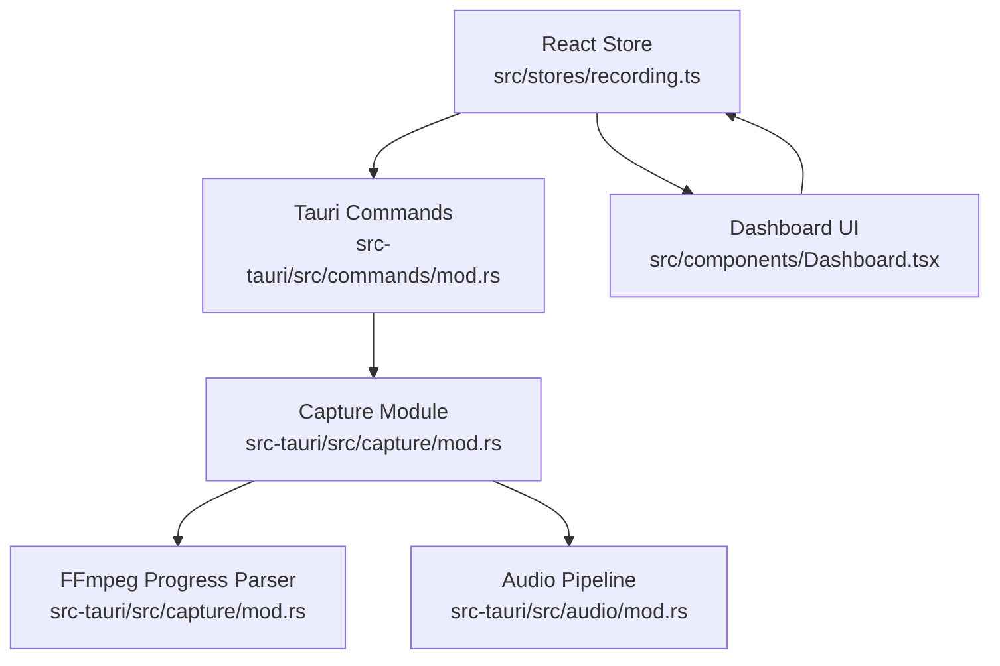
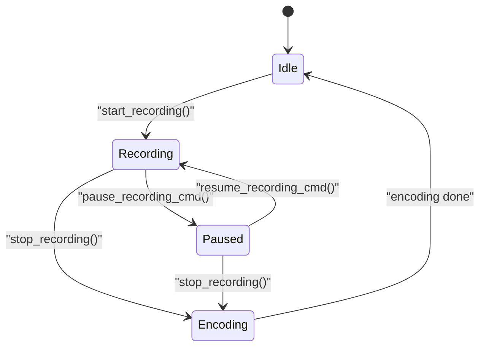
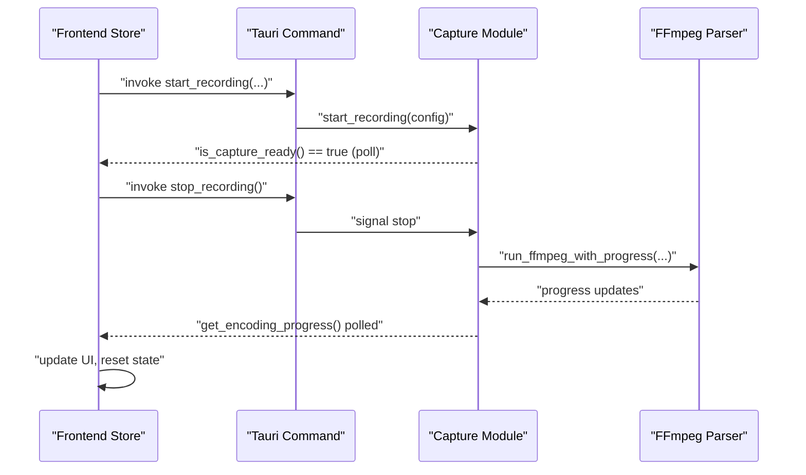
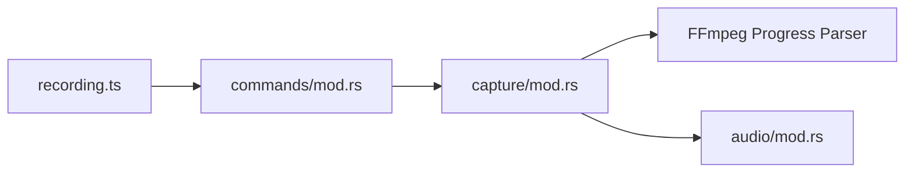

# Recording Lifecycle

<cite>
**Referenced Files in This Document**
- [mod.rs](file://src-tauri/src/capture/mod.rs)
- [mod.rs](file://src-tauri/src/commands/mod.rs)
- [recording.ts](file://src/stores/recording.ts)
- [Dashboard.tsx](file://src/components/Dashboard.tsx)
- [mod.rs](file://src-tauri/src/audio/mod.rs)
</cite>

## Table of Contents
1. [Introduction](#introduction)
2. [Project Structure](#project-structure)
3. [Core Components](#core-components)
4. [Architecture Overview](#architecture-overview)
5. [Detailed Component Analysis](#detailed-component-analysis)
6. [Dependency Analysis](#dependency-analysis)
7. [Performance Considerations](#performance-considerations)
8. [Troubleshooting Guide](#troubleshooting-guide)
9. [Conclusion](#conclusion)

## Introduction
This document explains EasySpecy’s recording lifecycle from initialization through completion. It covers state management, phase transitions, pause/resume, graceful shutdown, Tauri IPC integration, real-time progress monitoring, and user feedback. It also documents encoding progress tracking, estimated file size calculation, and performance optimization strategies.

## Project Structure
The recording lifecycle spans three layers:
- Frontend React store orchestrates UI state and IPC invocations.
- Tauri commands expose backend APIs to start/stop/pause/resume and query progress.
- Native capture module manages Windows graphics capture, audio synchronization, encoding, and progress reporting.

**Diagram sources**
- [mod.rs:160-167](file://src-tauri/src/capture/mod.rs#L160-L167)
- [mod.rs:1-543](file://src-tauri/src/commands/mod.rs#L1-L543)
- [recording.ts:306-333](file://src/stores/recording.ts#L306-L333)
- [Dashboard.tsx:241-459](file://src/components/Dashboard.tsx#L241-L459)
- [mod.rs:395-418](file://src-tauri/src/audio/mod.rs#L395-L418)

**Section sources**
- [mod.rs:64-167](file://src-tauri/src/capture/mod.rs#L64-L167)
- [mod.rs:1-543](file://src-tauri/src/commands/mod.rs#L1-L543)
- [recording.ts:306-333](file://src/stores/recording.ts#L306-L333)
- [Dashboard.tsx:241-459](file://src/components/Dashboard.tsx#L241-L459)

## Core Components
- Recording store: Manages UI state (idle/recording/paused/encoding), starts/stops/pauses/resumes, polls encoding progress, and shows notifications.
- Tauri commands: Expose IPC functions for configuration, overlay creation, and recording control.
- Capture module: Initializes capture pipeline, synchronizes audio/video, encodes frames, and reports encoding progress.
- Audio module: Provides synchronized audio capture and sample correction at stop.

Key responsibilities:
- Frontend: Render timers, pause/resume buttons, and encoding progress bar; handle user actions.
- Backend: Coordinate capture, audio, and encoding; expose progress via atomic counters and a stage string.
- IPC: Bridge frontend actions to native operations and back.

**Section sources**
- [recording.ts:306-333](file://src/stores/recording.ts#L306-L333)
- [mod.rs:1-543](file://src-tauri/src/commands/mod.rs#L1-L543)
- [mod.rs:64-167](file://src-tauri/src/capture/mod.rs#L64-L167)
- [mod.rs:395-418](file://src-tauri/src/audio/mod.rs#L395-L418)

## Architecture Overview
The lifecycle is a state machine with four phases: idle → recording → encoding → idle. Transitions occur via IPC commands and internal state flags.

**Diagram sources**
- [recording.ts:306-333](file://src/stores/recording.ts#L306-L333)
- [mod.rs:1-543](file://src-tauri/src/commands/mod.rs#L1-L543)
- [mod.rs:64-167](file://src-tauri/src/capture/mod.rs#L64-L167)

## Detailed Component Analysis

### Recording Store (Frontend)
Responsibilities:
- Initialize recording phase to idle.
- Start recording by invoking the backend start command.
- Poll encoding progress via IPC until completion.
- Update UI with encoding progress and stage.
- On completion, show success toast with duration and file size, optionally copy path, and notify via OS notification.

User actions:
- Start: invokes backend start.
- Stop: sets phase to encoding, starts progress polling, invokes backend stop, resets state to idle.
- Pause/Resume: toggles pause flag and updates UI.

Real-time progress:
- Polls get_encoding_progress every 200 ms during encoding.
- Updates encodingProgress and encodingStage.

Graceful shutdown:
- Clears polling interval after stop.
- Resets recordingStartTime and clears pause state.

**Section sources**
- [recording.ts:306-333](file://src/stores/recording.ts#L306-L333)
- [Dashboard.tsx:241-459](file://src/components/Dashboard.tsx#L241-L459)

### Tauri Commands (IPC Layer)
Exposes:
- get_config/save_config/update_config_field: manage application configuration.
- create_effects_overlay: create a transparent overlay window for visual effects.
- Recording control commands: start_recording, stop_recording, pause_recording_cmd, resume_recording_cmd.
- Utility commands: delete_recording.

Integration pattern:
- Frontend uses invoke to call backend commands.
- Backend returns structured results (e.g., RecordingResult) or errors.

**Section sources**
- [mod.rs:1-543](file://src-tauri/src/commands/mod.rs#L1-L543)

### Capture Module (Native)
Initialization and state:
- Static flags track recording activity, pause state, readiness, and encoding progress/stage.
- On first frame arrival, arms audio and webcam capture, sets capture-ready, and logs synchronization.

Recording loop:
- Skips frames when paused.
- Stops capture gracefully when stop signal is received, finalizing encoder and signaling closure.

Encoding progress:
- Uses FFmpeg with -progress pipe:1 to parse out_time_ms and map it to a progress range [range_start..range_end].
- Updates global progress atomically and stage string for frontend polling.

**Diagram sources**
- [mod.rs:160-167](file://src-tauri/src/capture/mod.rs#L160-L167)
- [mod.rs:424-495](file://src-tauri/src/capture/mod.rs#L424-L495)
- [recording.ts:306-333](file://src/stores/recording.ts#L306-L333)

**Section sources**
- [mod.rs:64-167](file://src-tauri/src/capture/mod.rs#L64-L167)
- [mod.rs:424-495](file://src-tauri/src/capture/mod.rs#L424-L495)

### Audio Synchronization (Native)
Behavior:
- On stop, computes expected sample counts based on wall-clock elapsed time and adjusts mic/system streams to minimize drift.
- Logs sample counts and rates for diagnostics.

Implications:
- Ensures audio-video sync accuracy by trimming or padding samples to match the armed instant.

**Section sources**
- [mod.rs:395-418](file://src-tauri/src/audio/mod.rs#L395-L418)

### UI Feedback and Progress
- During recording: visual border and ambient effect indicate active capture.
- During encoding: animated progress bar and stage text reflect progress percentage and stage description.
- On completion: success toast displays duration and file size; optional OS notification and clipboard copy.

**Section sources**
- [Dashboard.tsx:241-459](file://src/components/Dashboard.tsx#L241-L459)
- [recording.ts:306-333](file://src/stores/recording.ts#L306-L333)

## Dependency Analysis
High-level dependencies:
- Frontend store depends on Tauri IPC commands.
- Tauri commands depend on capture module for recording control.
- Capture module depends on FFmpeg for encoding and audio module for synchronized audio capture.

**Diagram sources**
- [recording.ts:306-333](file://src/stores/recording.ts#L306-L333)
- [mod.rs:1-543](file://src-tauri/src/commands/mod.rs#L1-L543)
- [mod.rs:424-495](file://src-tauri/src/capture/mod.rs#L424-L495)
- [mod.rs:395-418](file://src-tauri/src/audio/mod.rs#L395-L418)

**Section sources**
- [recording.ts:306-333](file://src/stores/recording.ts#L306-L333)
- [mod.rs:1-543](file://src-tauri/src/commands/mod.rs#L1-L543)
- [mod.rs:424-495](file://src-tauri/src/capture/mod.rs#L424-L495)
- [mod.rs:395-418](file://src-tauri/src/audio/mod.rs#L395-L418)

## Performance Considerations
- Frame pacing: First frame arms audio/webcam and signals readiness; subsequent frames are encoded with minimal latency.
- Encoding progress: Real-time progress derived from FFmpeg’s out_time_ms mapped to a configurable range for smooth UI updates.
- Background stderr draining: Prevents pipe buffer deadlocks during FFmpeg execution.
- Polling cadence: 200 ms polling balances responsiveness and CPU usage.
- Pause handling: Skips frame processing when paused to reduce load.

Recommendations:
- Tune resolution/FPS to balance quality and throughput.
- Monitor encoding stage and speed logs to detect bottlenecks.
- Keep FFmpeg path accessible and up-to-date for optimal performance.

**Section sources**
- [mod.rs:105-167](file://src-tauri/src/capture/mod.rs#L105-L167)
- [mod.rs:424-495](file://src-tauri/src/capture/mod.rs#L424-L495)
- [recording.ts:306-333](file://src/stores/recording.ts#L306-L333)

## Troubleshooting Guide
Common issues and remedies:
- Recording does not start:
  - Verify no active recording session; check for “already in progress” error.
  - Ensure capture readiness is polled and true before starting UI timer.
- No audio:
  - Confirm audio is enabled in config and audio device is available.
  - Check that audio is armed on first frame.
- Stuck at encoding:
  - Poll get_encoding_progress until completion; confirm FFmpeg returns success.
  - Review stderr logs for FFmpeg failures.
- Pause/resume anomalies:
  - Ensure pause_recording_cmd and resume_recording_cmd are invoked and state flags are updated.
- File size and duration:
  - After completion, UI displays duration and file size; confirm RecordingResult fields are populated.

**Section sources**
- [mod.rs:160-167](file://src-tauri/src/capture/mod.rs#L160-L167)
- [mod.rs:424-495](file://src-tauri/src/capture/mod.rs#L424-L495)
- [recording.ts:306-333](file://src/stores/recording.ts#L306-L333)

## Conclusion
EasySpecy’s recording lifecycle integrates a robust frontend store, Tauri IPC, and a native capture pipeline with synchronized audio and FFmpeg-based encoding. The system provides clear phase transitions, real-time progress, pause/resume, and graceful shutdown, ensuring reliable and responsive recordings with accurate user feedback.