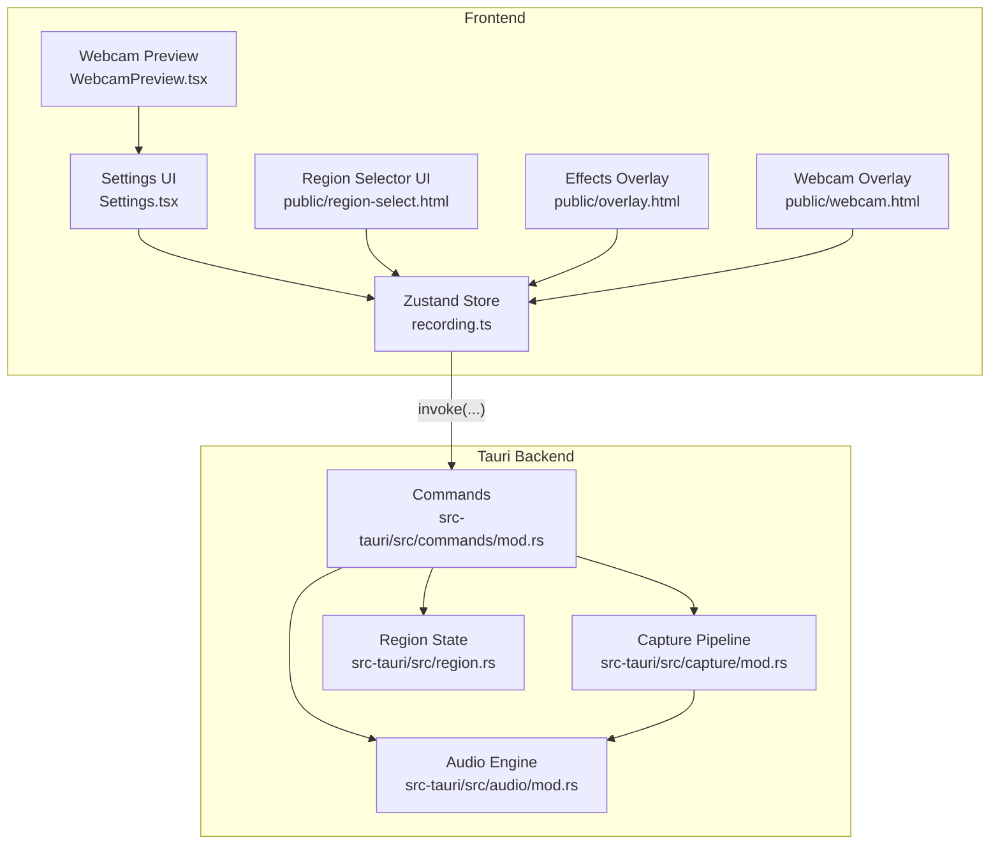
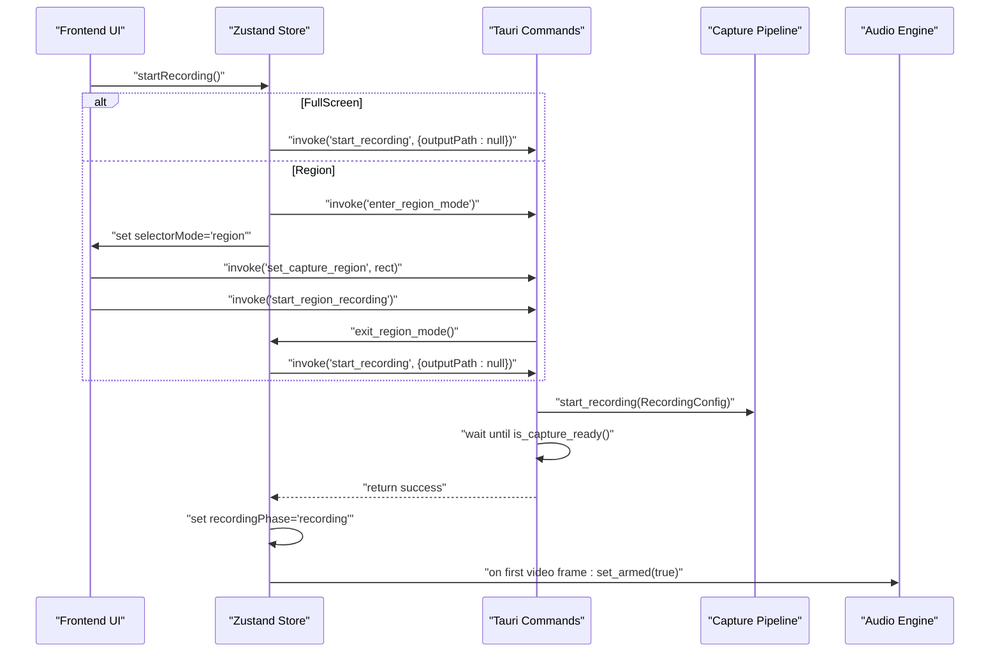
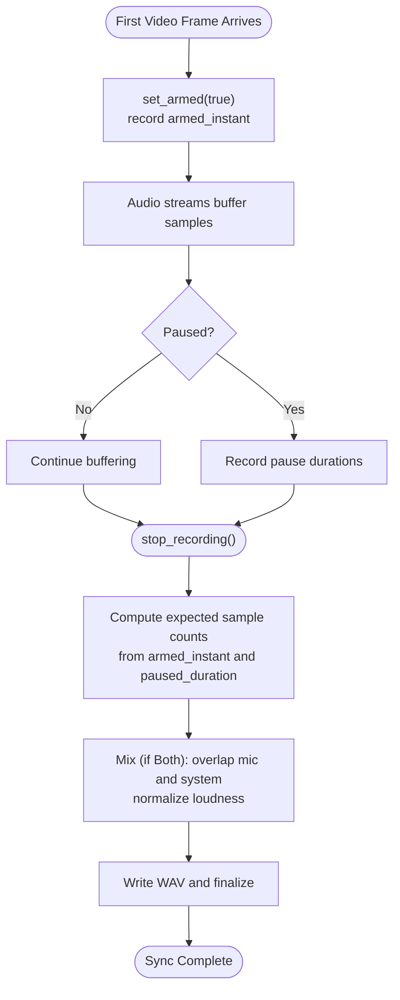
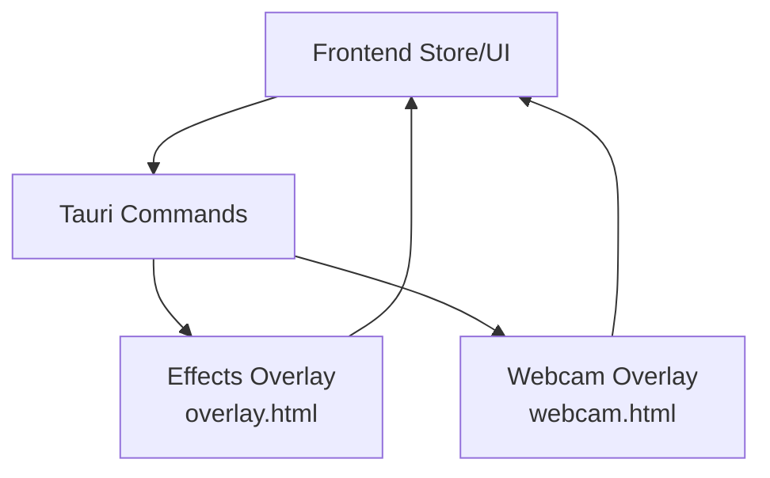
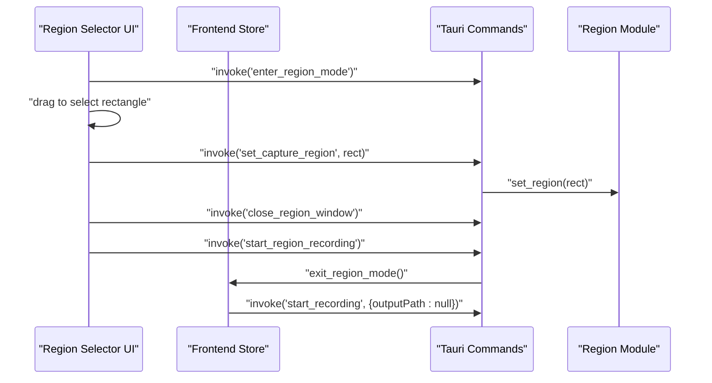
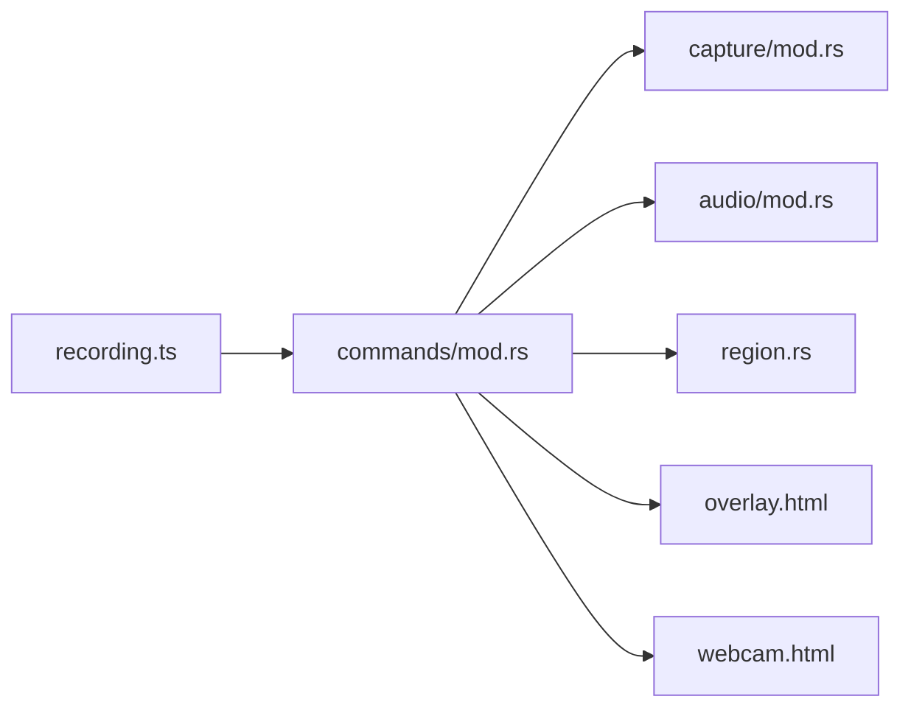

# Recording Modes

<cite>
**Referenced Files in This Document**
- [recording.ts](file://src/stores/recording.ts)
- [mod.rs (commands)](file://src-tauri/src/commands/mod.rs)
- [mod.rs (audio)](file://src-tauri/src/audio/mod.rs)
- [mod.rs (capture)](file://src-tauri/src/capture/mod.rs)
- [region.rs](file://src-tauri/src/region.rs)
- [region-select.html](file://public/region-select.html)
- [overlay.html](file://public/overlay.html)
- [webcam.html](file://public/webcam.html)
- [Settings.tsx](file://src/components/Settings.tsx)
- [WebcamPreview.tsx](file://src/components/WebcamPreview.tsx)
</cite>

## Table of Contents
1. [Introduction](#introduction)
2. [Project Structure](#project-structure)
3. [Core Components](#core-components)
4. [Architecture Overview](#architecture-overview)
5. [Detailed Component Analysis](#detailed-component-analysis)
6. [Dependency Analysis](#dependency-analysis)
7. [Performance Considerations](#performance-considerations)
8. [Troubleshooting Guide](#troubleshooting-guide)
9. [Conclusion](#conclusion)

## Introduction
This document explains EasySpecy’s recording modes and their implementation across the frontend and Tauri backend. It focuses on FullScreen and Region recording modes, the recording lifecycle (idle, recording, encoding), capture initialization, frame synchronization, and audio-video synchronization guarantees. It also covers platform-specific behaviors, hardware acceleration considerations, practical switching examples, troubleshooting, and performance optimization tips.

## Project Structure
The recording feature spans React/TypeScript frontend stores and commands, and a Tauri/Rust backend responsible for capture, audio, overlays, and encoding.

**Diagram sources**
- [recording.ts:177-405](file://src/stores/recording.ts#L177-L405)
- [mod.rs (commands):1-723](file://src-tauri/src/commands/mod.rs#L1-L723)
- [mod.rs (audio):1-800](file://src-tauri/src/audio/mod.rs#L1-L800)
- [region.rs:1-226](file://src-tauri/src/region.rs#L1-L226)

**Section sources**
- [recording.ts:177-405](file://src/stores/recording.ts#L177-L405)
- [mod.rs (commands):1-723](file://src-tauri/src/commands/mod.rs#L1-L723)

## Core Components
- Frontend Zustand store orchestrates recording lifecycle, UI state, and invokes Tauri commands.
- Tauri commands coordinate capture initialization, overlay windows, and encoding progress.
- Capture pipeline initializes video capture and synchronizes with audio.
- Audio engine buffers and mixes mic/system audio, aligning with the first video frame.
- Region module stores and applies rectangular capture regions for Region mode.

Key responsibilities:
- Mode selection and switching
- Capture initialization and readiness gating
- Audio-video synchronization
- Encoding progress reporting
- Platform-specific overlay and window management

**Section sources**
- [recording.ts:129-175](file://src/stores/recording.ts#L129-L175)
- [mod.rs (commands):249-403](file://src-tauri/src/commands/mod.rs#L249-L403)
- [mod.rs (audio):373-381](file://src-tauri/src/audio/mod.rs#L373-L381)
- [region.rs:14-24](file://src-tauri/src/region.rs#L14-L24)

## Architecture Overview
End-to-end flow for starting a recording session:

**Diagram sources**
- [recording.ts:284-307](file://src/stores/recording.ts#L284-L307)
- [mod.rs (commands):249-344](file://src-tauri/src/commands/mod.rs#L249-L344)
- [mod.rs (audio):373-381](file://src-tauri/src/audio/mod.rs#L373-L381)

## Detailed Component Analysis

### Recording Modes: FullScreen vs Region
- FullScreen mode captures the entire configured display area. The frontend triggers capture initialization and waits for readiness before marking the session as recording.
- Region mode captures a user-defined rectangle. The frontend enters a fullscreen transparent overlay, lets the user drag to select a region, then applies the region and starts capture.

Implementation highlights:
- Mode selection is persisted in the app config and mapped to backend enums.
- Region mode toggles the main window to fullscreen, transparent, and always-on-top to facilitate selection.
- Region coordinates are stored globally and applied to the capture pipeline before starting.

Practical examples:
- Switching modes: Update the config field “recording_mode” to “FullScreen” or “Region” via the settings UI. The store persists and reloads config automatically.
- Starting Region recording: Drag to select a rectangle in the region selector overlay; confirm to set the region and start recording.

Platform-specific behaviors:
- Region selection uses a transparent, always-on-top window on Windows. Other platforms currently do not expose window enumeration for region selection.

**Section sources**
- [recording.ts:55](file://src/stores/recording.ts#L55)
- [mod.rs (commands):60-66](file://src-tauri/src/commands/mod.rs#L60-L66)
- [mod.rs (commands):456-478](file://src-tauri/src/commands/mod.rs#L456-L478)
- [region.rs:36-89](file://src-tauri/src/region.rs#L36-L89)
- [region-select.html:107-151](file://public/region-select.html#L107-L151)

### Recording Lifecycle Management
States:
- idle: No capture in progress.
- recording: Capture is active and frames are being encoded.
- encoding: Capture stopped; encoding is in progress.

Transitions:
- idle → recording: After successful capture initialization and readiness.
- recording → encoding: On stop; encoding runs on a background thread.
- encoding → idle: After encoding completes and history is updated.

Frontend orchestration:
- startRecording(): Handles mode branching, shows initialization feedback, and sets recording phase upon readiness.
- stopRecording(): Starts encoding progress polling, then updates state and history.

Backend orchestration:
- start_recording(): Initializes capture, waits for readiness, optionally minimizes main window, and shows the effects overlay.
- stop_recording(): Restores main window, destroys overlays, stops keyboard capture, restores cursors, and runs encoding.

**Section sources**
- [recording.ts:129](file://src/stores/recording.ts#L129)
- [recording.ts:284-337](file://src/stores/recording.ts#L284-L337)
- [mod.rs (commands):249-403](file://src-tauri/src/commands/mod.rs#L249-L403)

### Capture Initialization and Readiness Gating
- The frontend calls start_recording and waits for the backend to report readiness (first video frame received).
- The backend spawns capture threads, initializes streams, and polls is_capture_ready() with a timeout to avoid indefinite hangs.
- Once ready, the backend optionally shows the effects overlay and returns to the frontend.

Why this matters:
- Ensures the frontend timer starts only when capture is truly active, preventing premature UI state changes.
- Provides a hard timeout to surface initialization failures quickly.

**Section sources**
- [recording.ts:297-306](file://src/stores/recording.ts#L297-L306)
- [mod.rs (commands):305-324](file://src-tauri/src/commands/mod.rs#L305-L324)

### Frame Synchronization and Audio-Video Alignment
The audio engine guarantees perfect sync:
- Audio streams (mic and/or system) are created immediately and start buffering.
- Samples are discarded until set_armed(true) is called by the capture module on the first video frame.
- Both streams start at the exact same wall-clock instant; armed_instant is recorded.
- On stop(), the engine computes expected sample counts from elapsed time (minus pause duration) and trims excess samples to align mic and system audio precisely.
- In “Both” mode, mic and system audio are mixed by overlapping samples at the same time offsets, then normalized to match perceived loudness.

**Diagram sources**
- [mod.rs (audio):373-381](file://src-tauri/src/audio/mod.rs#L373-L381)
- [mod.rs (audio):405-458](file://src-tauri/src/audio/mod.rs#L405-L458)
- [mod.rs (audio):485-510](file://src-tauri/src/audio/mod.rs#L485-L510)

**Section sources**
- [mod.rs (audio):3-18](file://src-tauri/src/audio/mod.rs#L3-L18)
- [mod.rs (audio):373-381](file://src-tauri/src/audio/mod.rs#L373-L381)
- [mod.rs (audio):405-458](file://src-tauri/src/audio/mod.rs#L405-L458)
- [mod.rs (audio):485-510](file://src-tauri/src/audio/mod.rs#L485-L510)

### Overlays and Live Effects
- Effects overlay: A transparent, always-on-top window sized to the primary monitor, hosting cursor trails, keyboard overlay, and webcam picture-in-picture. Created on demand and shown after capture is armed.
- Webcam overlay: A separate transparent window for the webcam feed, positioned according to output resolution and optional region offset. Created/destroyed around recording sessions.
- The frontend controls visibility and styling; the backend positions overlays based on monitor geometry and scaling.

**Diagram sources**
- [mod.rs (commands):521-561](file://src-tauri/src/commands/mod.rs#L521-L561)
- [mod.rs (commands):602-693](file://src-tauri/src/commands/mod.rs#L602-L693)
- [overlay.html](file://public/overlay.html)
- [webcam.html](file://public/webcam.html)

**Section sources**
- [mod.rs (commands):521-561](file://src-tauri/src/commands/mod.rs#L521-L561)
- [mod.rs (commands):602-693](file://src-tauri/src/commands/mod.rs#L602-L693)
- [Settings.tsx:367-662](file://src/components/Settings.tsx#L367-L662)
- [WebcamPreview.tsx:133-164](file://src/components/WebcamPreview.tsx#L133-L164)

### Region Capture Workflow
- Enter region mode: Main window becomes fullscreen, transparent, always-on-top.
- User drags to select a rectangle; the UI calculates and displays the size.
- Confirming sets the region globally and starts recording.
- Region coordinates are scaled to logical pixels and, in Region mode, webcam overlay positions are offset accordingly.

**Diagram sources**
- [mod.rs (commands):456-478](file://src-tauri/src/commands/mod.rs#L456-L478)
- [region.rs:14-24](file://src-tauri/src/region.rs#L14-L24)
- [region-select.html:107-151](file://public/region-select.html#L107-L151)

**Section sources**
- [mod.rs (commands):456-478](file://src-tauri/src/commands/mod.rs#L456-L478)
- [region.rs:14-24](file://src-tauri/src/region.rs#L14-L24)
- [region-select.html:107-151](file://public/region-select.html#L107-L151)

## Dependency Analysis
- Frontend store depends on Tauri commands for capture control, overlay creation, and encoding progress.
- Commands depend on capture and audio modules; capture may depend on platform APIs for display capture.
- Region module provides global state for the selected rectangle.
- Overlays are managed by commands and rendered by HTML pages hosted in Tauri webviews.

**Diagram sources**
- [recording.ts:177-405](file://src/stores/recording.ts#L177-L405)
- [mod.rs (commands):1-723](file://src-tauri/src/commands/mod.rs#L1-L723)

**Section sources**
- [recording.ts:177-405](file://src/stores/recording.ts#L177-L405)
- [mod.rs (commands):1-723](file://src-tauri/src/commands/mod.rs#L1-L723)

## Performance Considerations
- Encoder selection: The backend probes FFmpeg for available GPU encoders (NVENC, AMF, QSV) and exposes them in the UI. Choose an appropriate encoder for your GPU to reduce CPU usage.
- Resolution and FPS: Higher resolution and FPS increase CPU/GPU load. Adjust config fields for resolution and fps to balance quality and performance.
- Audio processing: In “Both” mode, mic post-processing (noise gate, spectral/RNN) adds CPU overhead. Disable or tune noise reduction settings if CPU is constrained.
- Overlay windows: Transparent, always-on-top overlays introduce compositor costs. Keep overlay content minimal and avoid unnecessary animations.
- Region capture: Smaller rectangles reduce pixel throughput and improve performance compared to FullScreen.

[No sources needed since this section provides general guidance]

## Troubleshooting Guide
Common issues and remedies:
- Capture initialization timeout: The backend waits up to 10 seconds for the first frame. If it fails, verify display permissions, GPU drivers, and that no other application is exclusively capturing the screen.
- Region selection not working: Region selection is Windows-only. On unsupported platforms, use FullScreen mode.
- Audio not captured: Ensure audio devices are available and not blocked by other applications. Verify audio source settings (Mic/System/Both).
- Webcam overlay not visible: The webcam overlay is shown by JavaScript once the stream starts. Check browser/device permissions and webcam device selection.
- Encoding stalls: Encoding runs in the background; progress polling updates the UI. If stuck, restart the app and check disk space and output directory permissions.

**Section sources**
- [mod.rs (commands):305-324](file://src-tauri/src/commands/mod.rs#L305-L324)
- [region.rs:36-89](file://src-tauri/src/region.rs#L36-L89)
- [mod.rs (audio):84-180](file://src-tauri/src/audio/mod.rs#L84-L180)
- [webcam.html:54-100](file://public/webcam.html#L54-L100)

## Conclusion
EasySpecy’s recording modes are designed for simplicity and reliability. FullScreen mode offers straightforward capture with strong audio-video synchronization guarantees. Region mode provides precise cropping with a dedicated selection workflow. The backend enforces capture readiness, manages overlays, and ensures perfect sync between audio and video. By selecting appropriate encoders, tuning resolution/FPS, and understanding platform limitations, users can achieve smooth, high-quality recordings tailored to their needs.