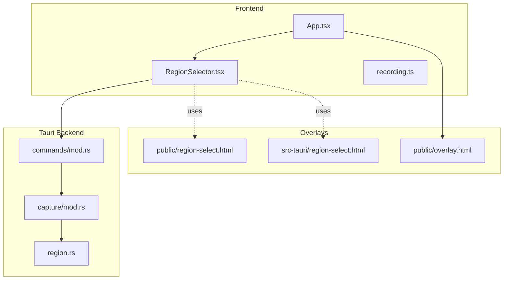
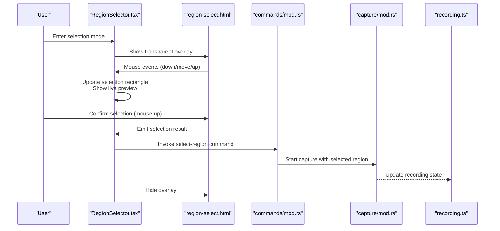
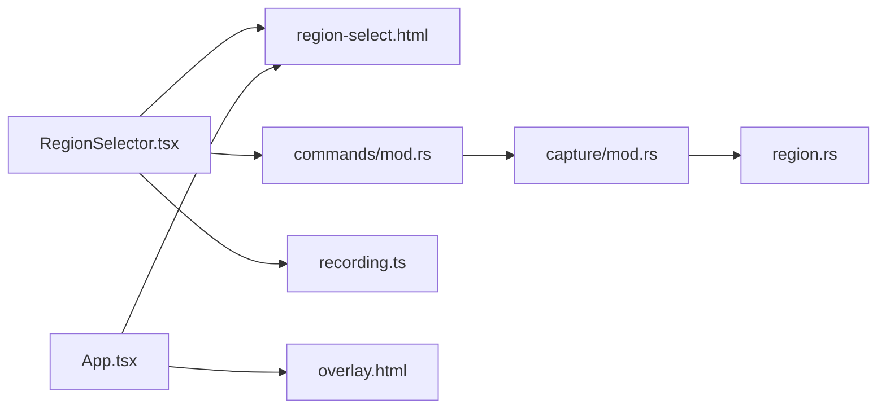

# Region Selection

<cite>
**Referenced Files in This Document**
- [RegionSelector.tsx](file://src/components/RegionSelector.tsx)
- [region-select.html](file://public/region-select.html)
- [region-select.html](file://src-tauri/region-select.html)
- [region.rs](file://src-tauri/src/region.rs)
- [commands/mod.rs](file://src-tauri/src/commands/mod.rs)
- [capture/mod.rs](file://src-tauri/src/capture/mod.rs)
- [recording.ts](file://src/stores/recording.ts)
- [App.tsx](file://src/App.tsx)
- [tauri.conf.json](file://src-tauri/tauri.conf.json)
- [overlay.html](file://public/overlay.html)
</cite>

## Table of Contents
1. [Introduction](#introduction)
2. [Project Structure](#project-structure)
3. [Core Components](#core-components)
4. [Architecture Overview](#architecture-overview)
5. [Detailed Component Analysis](#detailed-component-analysis)
6. [Dependency Analysis](#dependency-analysis)
7. [Performance Considerations](#performance-considerations)
8. [Troubleshooting Guide](#troubleshooting-guide)
9. [Conclusion](#conclusion)

## Introduction
This document explains EasySpecy's region selection system: how users enter selection mode, interact with the selector, preview selections in real time, and capture the chosen region. It covers the interactive selector interface, mouse interaction patterns, coordinate calculation, multi-monitor support, validation logic, platform-specific behaviors, accessibility considerations, and practical examples for different region types (window capture, custom areas, multi-monitor regions).

## Project Structure
The region selection system spans frontend React components, Tauri backend logic, and HTML overlays:
- Frontend selector UI: [RegionSelector.tsx](file://src/components/RegionSelector.tsx)
- Selector overlay pages: [region-select.html](file://public/region-select.html) and [region-select.html](file://src-tauri/region-select.html)
- Backend region utilities: [region.rs](file://src-tauri/src/region.rs)
- Capture pipeline: [capture/mod.rs](file://src-tauri/src/capture/mod.rs)
- Commands bridge: [commands/mod.rs](file://src-tauri/src/commands/mod.rs)
- Recording store: [recording.ts](file://src/stores/recording.ts)
- Application shell: [App.tsx](file://src/App.tsx)
- Overlay page: [overlay.html](file://public/overlay.html)
- Tauri configuration: [tauri.conf.json](file://src-tauri/tauri.conf.json)

**Diagram sources**
- [RegionSelector.tsx](file://src/components/RegionSelector.tsx)
- [commands/mod.rs](file://src-tauri/src/commands/mod.rs)
- [capture/mod.rs](file://src-tauri/src/capture/mod.rs)
- [region.rs](file://src-tauri/src/region.rs)
- [recording.ts](file://src/stores/recording.ts)
- [App.tsx](file://src/App.tsx)
- [overlay.html](file://public/overlay.html)
- [region-select.html](file://public/region-select.html)
- [region-select.html](file://src-tauri/region-select.html)

**Section sources**
- [RegionSelector.tsx](file://src/components/RegionSelector.tsx)
- [region.rs](file://src-tauri/src/region.rs)
- [commands/mod.rs](file://src-tauri/src/commands/mod.rs)
- [capture/mod.rs](file://src-tauri/src/capture/mod.rs)
- [recording.ts](file://src/stores/recording.ts)
- [App.tsx](file://src/App.tsx)
- [overlay.html](file://public/overlay.html)
- [region-select.html](file://public/region-select.html)
- [region-select.html](file://src-tauri/region-select.html)

## Core Components
- Interactive Region Selector (React): Provides draggable selection rectangle, live preview, dimension label, and handles mouse events for start/drag/stop.
- Selector Overlays (HTML): Transparent overlays used during selection to capture mouse interactions and render the selection UI.
- Backend Region Utilities: Coordinate normalization, bounds validation, and multi-monitor support helpers.
- Capture Pipeline: Bridges selection to capture operations and recording.
- Recording Store: Manages current selection state and capture lifecycle.
- Application Shell: Integrates overlays and selector into the app layout.

Key responsibilities:
- Real-time preview: Updates selection rectangle and dimensions while dragging.
- Mouse interaction: Start on press, drag to resize, confirm on release, cancel on escape.
- Validation: Ensures non-empty, positive-area rectangles and respects monitor boundaries.
- Multi-monitor: Normalizes coordinates across displays and validates against screen geometry.
- Accessibility: Keyboard navigation and focus management for non-mouse users.

**Section sources**
- [RegionSelector.tsx](file://src/components/RegionSelector.tsx)
- [region-select.html](file://public/region-select.html)
- [region-select.html](file://src-tauri/region-select.html)
- [region.rs](file://src-tauri/src/region.rs)
- [capture/mod.rs](file://src-tauri/src/capture/mod.rs)
- [recording.ts](file://src/stores/recording.ts)
- [App.tsx](file://src/App.tsx)

## Architecture Overview
The selection workflow connects frontend UI to backend capture via Tauri commands. The selector overlay captures mouse events and renders a live preview until the user confirms or cancels.

**Diagram sources**
- [RegionSelector.tsx](file://src/components/RegionSelector.tsx)
- [region-select.html](file://public/region-select.html)
- [commands/mod.rs](file://src-tauri/src/commands/mod.rs)
- [capture/mod.rs](file://src-tauri/src/capture/mod.rs)
- [recording.ts](file://src/stores/recording.ts)

## Detailed Component Analysis

### Interactive Region Selector (React)
Responsibilities:
- Render selection rectangle with live border and dimension label.
- Track mouse state: press, drag, release.
- Compute normalized rectangle coordinates and dimensions.
- Trigger selection confirmation or cancellation.

Mouse interaction pattern:
- Press: initialize selection origin.
- Move: update rectangle size and position.
- Release: emit selection result to backend.
- Escape: cancel selection and hide overlay.

Real-time preview:
- Transparent overlay behind the selection border.
- Dimension label positioned above the rectangle.
- Smooth animations for visual feedback.

Coordinate calculation:
- Convert client coordinates to normalized screen coordinates.
- Clamp rectangle to monitor bounds.
- Validate non-empty area.

Accessibility considerations:
- Keyboard shortcuts to start/confirm/cancel selection.
- Focus ring and ARIA labels for screen reader support.
- High contrast and adjustable animation settings.

Practical examples:
- Window capture: select a single window’s bounding box; backend validates against window manager bounds.
- Custom area: drag to define arbitrary rectangle; backend normalizes coordinates.
- Multi-monitor region: select across monitors; backend merges coordinates and validates per-monitor bounds.

**Section sources**
- [RegionSelector.tsx](file://src/components/RegionSelector.tsx)
- [region-select.html](file://public/region-select.html)
- [region-select.html](file://src-tauri/region-select.html)

### Selector Overlays (HTML)
Purpose:
- Provide transparent, always-on-top surfaces for capturing mouse events.
- Render selection visuals without interfering with underlying content.

Implementation highlights:
- Fullscreen overlay with pointer-events enabled for mouse capture.
- Z-index stacking to ensure visibility above application windows.
- Platform-specific cursor customization resources.

Integration:
- Loaded by the frontend when entering selection mode.
- Hidden after selection confirmation or cancellation.

**Section sources**
- [region-select.html](file://public/region-select.html)
- [region-select.html](file://src-tauri/region-select.html)

### Backend Region Utilities (Rust)
Responsibilities:
- Normalize coordinates to logical screen units.
- Validate selection bounds against detected monitors.
- Merge multi-monitor selections into unified capture geometry.
- Provide region metadata for capture initialization.

Key logic:
- Bounds validation: ensure rectangle intersects at least part of the detected screen area.
- Multi-monitor handling: union of intersecting monitors’ rectangles.
- Edge cases: empty selection, inverted rectangles, out-of-bounds coordinates.

**Section sources**
- [region.rs](file://src-tauri/src/region.rs)

### Capture Pipeline and Commands Bridge
Responsibilities:
- Expose selection result to the capture subsystem.
- Initialize capture with validated region parameters.
- Manage capture lifecycle and state updates.

Command flow:
- Frontend invokes a Tauri command with selection geometry.
- Backend validates and starts capture.
- Recording store reflects new capture state.

**Section sources**
- [commands/mod.rs](file://src-tauri/src/commands/mod.rs)
- [capture/mod.rs](file://src-tauri/src/capture/mod.rs)
- [recording.ts](file://src/stores/recording.ts)

### Application Shell and Overlay Integration
Responsibilities:
- Load and manage overlay pages.
- Coordinate overlay visibility with selection state.
- Provide global hooks for selection mode activation.

**Section sources**
- [App.tsx](file://src/App.tsx)
- [overlay.html](file://public/overlay.html)

## Dependency Analysis
The region selection system exhibits layered dependencies: UI depends on overlays, overlays communicate with UI via events, UI invokes Tauri commands, and commands drive capture and recording.

**Diagram sources**
- [RegionSelector.tsx](file://src/components/RegionSelector.tsx)
- [region-select.html](file://public/region-select.html)
- [commands/mod.rs](file://src-tauri/src/commands/mod.rs)
- [capture/mod.rs](file://src-tauri/src/capture/mod.rs)
- [region.rs](file://src-tauri/src/region.rs)
- [recording.ts](file://src/stores/recording.ts)
- [App.tsx](file://src/App.tsx)
- [overlay.html](file://public/overlay.html)

**Section sources**
- [RegionSelector.tsx](file://src/components/RegionSelector.tsx)
- [region-select.html](file://public/region-select.html)
- [commands/mod.rs](file://src-tauri/src/commands/mod.rs)
- [capture/mod.rs](file://src-tauri/src/capture/mod.rs)
- [region.rs](file://src-tauri/src/region.rs)
- [recording.ts](file://src/stores/recording.ts)
- [App.tsx](file://src/App.tsx)
- [overlay.html](file://public/overlay.html)

## Performance Considerations
- Minimize DOM updates: throttle mouse move handlers and batch UI re-renders.
- Use efficient overlay rendering: avoid heavy CSS filters inside the selection border.
- Backend validation: pre-validate selection geometry to reduce command retries.
- Multi-monitor queries: cache monitor layouts and invalidate only on display change events.
- Animation smoothing: adjust motion configuration to balance responsiveness and battery life.

## Troubleshooting Guide
Common issues and resolutions:
- Selection does nothing on click-and-drag:
  - Verify overlay is visible and pointer-events are enabled.
  - Check that the selection mode is active in the UI state.
  - Ensure the command bridge is reachable and not blocked by permissions.

- Preview shows incorrect dimensions:
  - Confirm coordinate normalization matches screen scaling.
  - Validate that the rectangle is clamped to monitor bounds.

- Selection fails on multi-monitor setups:
  - Re-query monitor geometry and retry validation.
  - Ensure the selection intersects at least one monitor.

- Capture starts outside intended region:
  - Recalculate coordinates using backend normalization.
  - Align overlay and capture coordinate spaces.

Platform-specific behaviors:
- Windows: cursor themes and DPI scaling may affect hit-testing; test at various scaling factors.
- macOS: transparency and compositing can influence overlay visibility; verify z-order and blending modes.
- Linux: compositor differences may impact overlay stacking; test with common compositors.

Accessibility:
- Keyboard shortcuts: provide alt+shift+R to toggle selection mode and Enter/Esc for confirm/cancel.
- Focus management: ensure the overlay receives focus and traps tab navigation.
- Screen readers: announce selection dimensions and status changes.

**Section sources**
- [RegionSelector.tsx](file://src/components/RegionSelector.tsx)
- [region-select.html](file://public/region-select.html)
- [region.rs](file://src-tauri/src/region.rs)
- [commands/mod.rs](file://src-tauri/src/commands/mod.rs)
- [capture/mod.rs](file://src-tauri/src/capture/mod.rs)

## Conclusion
EasySpecy’s region selection system combines a responsive React selector with robust Tauri-backed validation and capture orchestration. By normalizing coordinates, validating against monitor geometry, and providing real-time previews, it supports reliable selection across single and multi-monitor environments. Following the troubleshooting steps and accessibility guidelines ensures a smooth experience for all users.