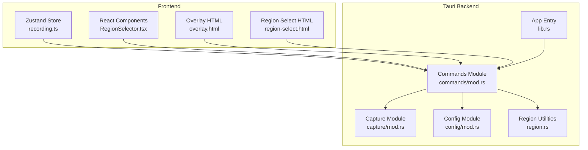
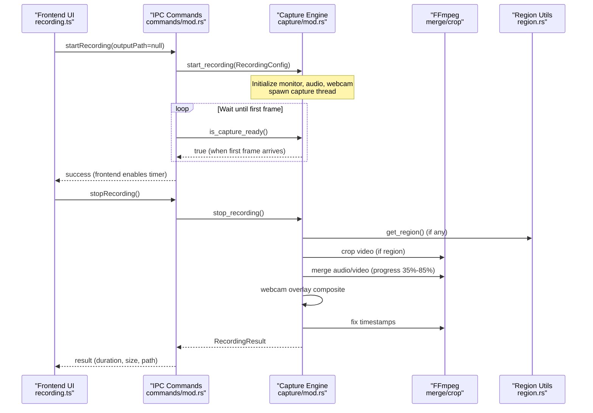
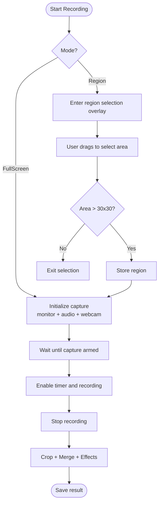
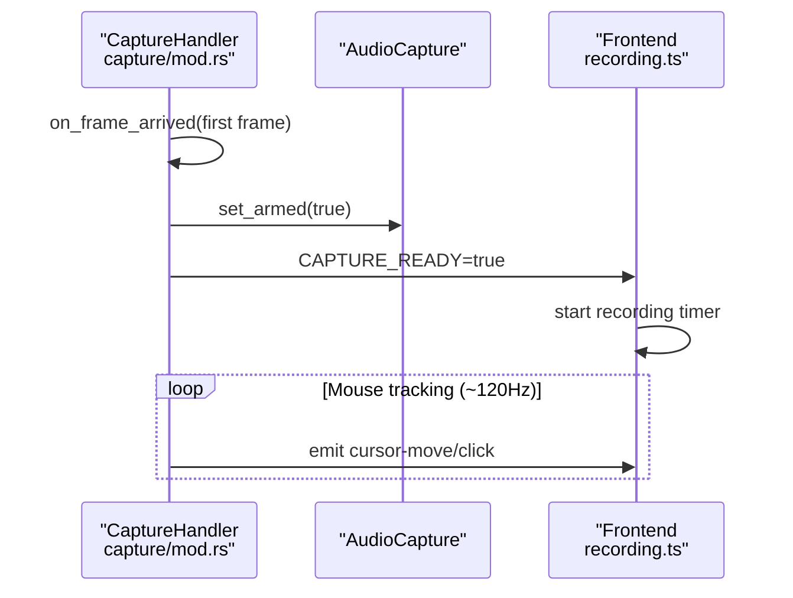
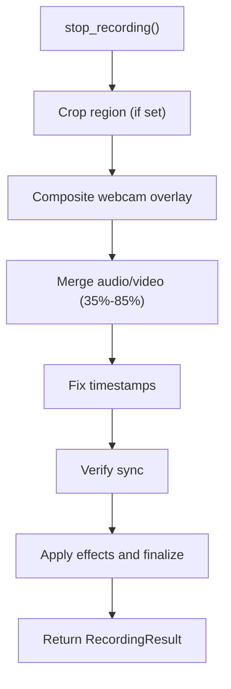
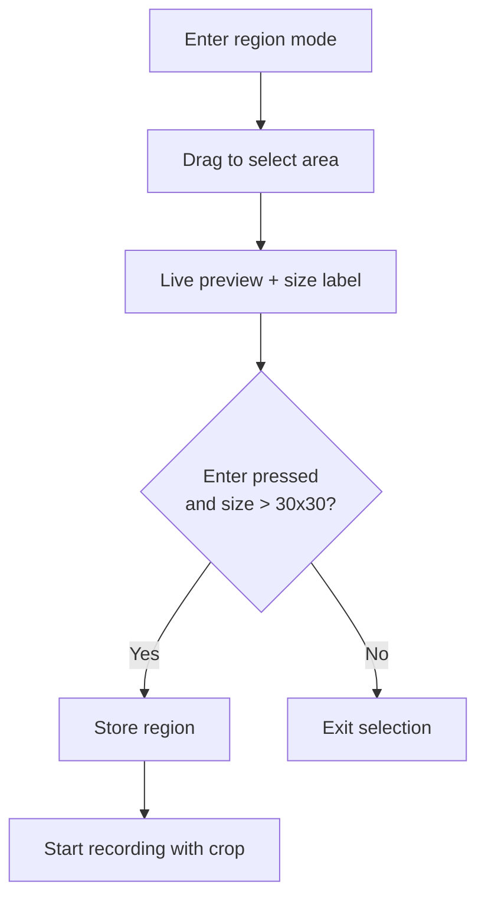
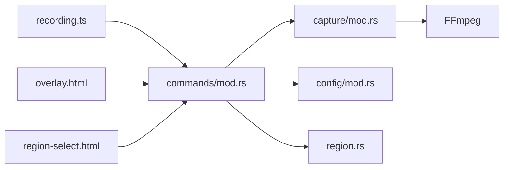

# Screen Recording

<cite>
**Referenced Files in This Document**
- [recording.ts](file://src/stores/recording.ts)
- [mod.rs (capture)](file://src-tauri/src/capture/mod.rs)
- [mod.rs (commands)](file://src-tauri/src/commands/mod.rs)
- [mod.rs (config)](file://src-tauri/src/config/mod.rs)
- [lib.rs](file://src-tauri/src/lib.rs)
- [RegionSelector.tsx](file://src/components/RegionSelector.tsx)
- [region.rs](file://src-tauri/src/region.rs)
- [overlay.html](file://public/overlay.html)
- [region-select.html](file://public/region-select.html)
</cite>

## Table of Contents
1. [Introduction](#introduction)
2. [Project Structure](#project-structure)
3. [Core Components](#core-components)
4. [Architecture Overview](#architecture-overview)
5. [Detailed Component Analysis](#detailed-component-analysis)
6. [Dependency Analysis](#dependency-analysis)
7. [Performance Considerations](#performance-considerations)
8. [Troubleshooting Guide](#troubleshooting-guide)
9. [Conclusion](#conclusion)
10. [Appendices](#appendices)

## Introduction
This document explains EasySpecy’s screen recording functionality end-to-end. It covers recording modes (full-screen and region-based), capture configuration (resolution, frame rate, encoders), recording lifecycle management, capture initialization and synchronization, encoding progress monitoring, region selection and validation, multi-monitor considerations, and platform-specific behaviors including hardware acceleration options. Practical examples and optimization tips are included to help you configure and troubleshoot recordings effectively.

## Project Structure
The recording system spans both the frontend (React + Zustand store) and the backend (Tauri + Rust):
- Frontend store manages configuration, UI state, hotkeys, and encoding progress polling.
- Backend commands expose IPC functions for starting/stopping recording, managing overlays, and querying GPU encoders.
- Capture module orchestrates screen capture, audio capture, and FFmpeg-based encoding with strict synchronization.
- Region utilities manage selected regions and window enumeration.
- Overlay HTML renders cursor trails, click effects, keyboard overlay, and webcam PiP during recording.

**Diagram sources**
- [lib.rs:85-135](file://src-tauri/src/lib.rs#L85-L135)
- [mod.rs (commands):88-127](file://src-tauri/src/commands/mod.rs#L88-L127)
- [mod.rs (capture):160-404](file://src-tauri/src/capture/mod.rs#L160-L404)
- [mod.rs (config):244-431](file://src-tauri/src/config/mod.rs#L244-L431)
- [recording.ts:176-404](file://src/stores/recording.ts#L176-L404)
- [RegionSelector.tsx:1-141](file://src/components/RegionSelector.tsx#L1-141)
- [region.rs:1-226](file://src-tauri/src/region.rs#L1-L226)
- [overlay.html:1-862](file://public/overlay.html#L1-L862)
- [region-select.html:1-152](file://public/region-select.html#L1-L152)

**Section sources**
- [lib.rs:85-135](file://src-tauri/src/lib.rs#L85-L135)
- [mod.rs (commands):88-127](file://src-tauri/src/commands/mod.rs#L88-L127)
- [recording.ts:176-404](file://src/stores/recording.ts#L176-L404)

## Core Components
- Recording configuration and state: managed by the frontend Zustand store, including recording mode, resolution, FPS, encoders, audio settings, and UI state (toasts, hotkeys, encoding progress).
- Backend IPC commands: start/stop recording, region management, overlay creation, GPU encoder detection, and audio monitoring.
- Capture engine: initializes screen capture, audio capture, and FFmpeg encoding with synchronized start and end.
- Region utilities: set/clear/get capture region and enumerate windows on Windows.
- Overlays: effects overlay (cursor trail, click effects, keyboard overlay, webcam PiP) and region selection overlay.

**Section sources**
- [recording.ts:5-174](file://src/stores/recording.ts#L5-L174)
- [mod.rs (commands):11-715](file://src-tauri/src/commands/mod.rs#L11-L715)
- [mod.rs (capture):160-714](file://src-tauri/src/capture/mod.rs#L160-L714)
- [region.rs:1-226](file://src-tauri/src/region.rs#L1-L226)
- [overlay.html:1-862](file://public/overlay.html#L1-L862)
- [region-select.html:1-152](file://public/region-select.html#L1-L152)

## Architecture Overview
The recording lifecycle is tightly synchronized to guarantee video and audio start precisely together, with the UI only reflecting “recording” after the first frame is captured and audio is armed.

**Diagram sources**
- [mod.rs (commands):241-395](file://src-tauri/src/commands/mod.rs#L241-L395)
- [mod.rs (capture):160-714](file://src-tauri/src/capture/mod.rs#L160-L714)
- [region.rs:18-24](file://src-tauri/src/region.rs#L18-L24)

**Section sources**
- [mod.rs (commands):241-395](file://src-tauri/src/commands/mod.rs#L241-L395)
- [mod.rs (capture):110-151](file://src-tauri/src/capture/mod.rs#L110-L151)

## Detailed Component Analysis

### Recording Modes: Full-Screen vs Region-Based
- FullScreen mode: starts capture immediately on the primary monitor at configured resolution and FPS. The frontend waits for the capture to be armed (first frame + audio armed) before enabling the recording timer.
- Region mode: enters a transparent overlay for area selection. After selection, the region is stored and recording begins with a crop step during encoding.

**Diagram sources**
- [recording.ts:283-306](file://src/stores/recording.ts#L283-L306)
- [RegionSelector.tsx:36-48](file://src/components/RegionSelector.tsx#L36-L48)
- [mod.rs (commands):448-470](file://src-tauri/src/commands/mod.rs#L448-L470)
- [mod.rs (capture):502-714](file://src-tauri/src/capture/mod.rs#L502-L714)

**Section sources**
- [recording.ts:283-306](file://src/stores/recording.ts#L283-L306)
- [RegionSelector.tsx:1-141](file://src/components/RegionSelector.tsx#L1-L141)
- [mod.rs (commands):448-470](file://src-tauri/src/commands/mod.rs#L448-L470)

### Capture Initialization and Frame Synchronization
- Initialization: sets up monitor, minimum update interval based on FPS, cursor capture, and color format. Audio streams are created and started early (buffering, but samples discarded until armed).
- First-frame sync: the first video frame arms audio and resets the session start time. The frontend polls readiness and only then starts the recording timer.
- Mouse tracking: runs at ~120 Hz, emits cursor movement and click events to the overlay and postprocessing pipeline.

**Diagram sources**
- [mod.rs (capture):105-158](file://src-tauri/src/capture/mod.rs#L105-L158)
- [mod.rs (capture):282-401](file://src-tauri/src/capture/mod.rs#L282-L401)
- [recording.ts:297-304](file://src/stores/recording.ts#L297-L304)

**Section sources**
- [mod.rs (capture):105-158](file://src-tauri/src/capture/mod.rs#L105-L158)
- [mod.rs (capture):282-401](file://src-tauri/src/capture/mod.rs#L282-L401)
- [recording.ts:297-304](file://src/stores/recording.ts#L297-L304)

### Encoding Progress Monitoring
- During stop_recording, the backend reports progress stages and percentages across cropping, webcam overlay, merging audio/video, and finalization.
- Frontend polls get_encoding_progress periodically to update the UI.

**Diagram sources**
- [mod.rs (capture):502-714](file://src-tauri/src/capture/mod.rs#L502-L714)
- [recording.ts:310-336](file://src/stores/recording.ts#L310-L336)

**Section sources**
- [mod.rs (capture):412-422](file://src-tauri/src/capture/mod.rs#L412-L422)
- [recording.ts:310-336](file://src/stores/recording.ts#L310-L336)

### Region Selection System and Validation
- Region selection overlay provides a crosshair cursor, live rectangle preview, and dimension label. Users press Enter to confirm or Escape to cancel.
- Minimum selection size is validated client-side (width/height > 30) before confirming.
- Selected region is stored and used during encoding to crop the video.

**Diagram sources**
- [RegionSelector.tsx:1-141](file://src/components/RegionSelector.tsx#L1-L141)
- [region-select.html:67-149](file://public/region-select.html#L67-L149)
- [mod.rs (commands):448-470](file://src-tauri/src/commands/mod.rs#L448-L470)
- [mod.rs (capture):554-569](file://src-tauri/src/capture/mod.rs#L554-L569)

**Section sources**
- [RegionSelector.tsx:1-141](file://src/components/RegionSelector.tsx#L1-L141)
- [region-select.html:67-149](file://public/region-select.html#L67-L149)
- [mod.rs (commands):428-441](file://src-tauri/src/commands/mod.rs#L428-L441)
- [mod.rs (capture):554-569](file://src-tauri/src/capture/mod.rs#L554-L569)

### Multi-Monitor Support and Region Validation
- Capture uses the primary monitor for FullScreen mode. Region mode applies the selected region to the recorded output.
- Region coordinates are validated and clamped to screen bounds in the overlay logic.

**Section sources**
- [mod.rs (capture):192-216](file://src-tauri/src/capture/mod.rs#L192-L216)
- [mod.rs (commands):628-644](file://src-tauri/src/commands/mod.rs#L628-L644)

### Capture Configuration Options
- Resolution: configured via width/height in the app config.
- Frame Rate: FPS controls minimum update interval for capture.
- Encoders: configurable via video_encoder (H264, H265, AV1, AV1_NVENC, H264_NVENC, H265_NVENC, VP9). Quality presets and bitrate are mapped to FFmpeg parameters.
- Audio: enable/disable, source selection (Mic/System/Both), sample rate, and device selection.

**Section sources**
- [mod.rs (config):128-136](file://src-tauri/src/config/mod.rs#L128-L136)
- [mod.rs (config):139-146](file://src-tauri/src/config/mod.rs#L139-L146)
- [mod.rs (config):335-430](file://src-tauri/src/config/mod.rs#L335-L430)
- [mod.rs (commands):32-125](file://src-tauri/src/commands/mod.rs#L32-L125)

### Hardware Acceleration Options
- GPU encoders are detected dynamically by probing FFmpeg for available encoders (NVENC, AMF, QSV, SVT-AV1).
- The encoder selection influences FFmpeg arguments (preset, tune, multipass, QP vs CRF).

**Section sources**
- [mod.rs (commands):160-224](file://src-tauri/src/commands/mod.rs#L160-L224)
- [mod.rs (config):335-430](file://src-tauri/src/config/mod.rs#L335-L430)

### Practical Examples
- Starting FullScreen recording:
  - Frontend invokes start_recording with output path null.
  - Backend initializes capture, waits for readiness, then returns success.
  - Frontend starts the recording timer and updates UI state.
- Starting Region recording:
  - Frontend enters region mode and displays the selection overlay.
  - On confirmation, region is stored and recording begins with a crop step.
- Stopping recording:
  - Frontend polls encoding progress, then receives RecordingResult with duration, frame count, file size, and path.

**Section sources**
- [recording.ts:283-336](file://src/stores/recording.ts#L283-L336)
- [mod.rs (commands):241-395](file://src-tauri/src/commands/mod.rs#L241-L395)

## Dependency Analysis
The recording subsystem depends on:
- Tauri IPC for frontend-backend communication.
- Windows Capture API for screen capture.
- FFmpeg for cropping, merging, and encoding.
- Overlay HTML for live effects rendering.

**Diagram sources**
- [mod.rs (commands):88-127](file://src-tauri/src/commands/mod.rs#L88-L127)
- [mod.rs (capture):160-714](file://src-tauri/src/capture/mod.rs#L160-L714)
- [mod.rs (config):244-431](file://src-tauri/src/config/mod.rs#L244-L431)
- [overlay.html:1-862](file://public/overlay.html#L1-L862)
- [region-select.html:1-152](file://public/region-select.html#L1-L152)

**Section sources**
- [lib.rs:85-135](file://src-tauri/src/lib.rs#L85-L135)
- [mod.rs (commands):88-127](file://src-tauri/src/commands/mod.rs#L88-L127)

## Performance Considerations
- Encoder choice: AV1 and AV1_NVENC offer excellent compression for screen content; H264/H265 provide broader compatibility; VP9 balances compression and web friendliness.
- Quality presets: Lower presets reduce file size but may increase visible artifacts; higher presets approach visually lossless at larger file sizes.
- Bitrate scaling: Effective bitrate scales with resolution and FPS; adjust for desired balance between quality and size.
- FPS impact: Lower FPS reduces CPU/GPU load but may miss fast motion; higher FPS increases resource usage.
- Hardware acceleration: Prefer NVENC/AMF/QSV encoders when available for reduced CPU usage.
- Cropping: Region capture adds a post-processing crop step; keep regions reasonable to minimize overhead.
- Webcam overlay: PiP compositing occurs during encoding; disable if performance is constrained.

[No sources needed since this section provides general guidance]

## Troubleshooting Guide
Common issues and remedies:
- Capture does not start or times out:
  - Ensure permissions and drivers are up to date.
  - Verify FFmpeg availability and encoder detection.
  - Check that the overlay window is not blocking input.
- Audio missing in output:
  - Confirm audio device selection and that audio is enabled.
  - Verify microphone/system audio permissions.
- Desync between video and audio:
  - The capture engine synchronizes on the first frame; if desync occurs, review logs and re-run with compatible encoders.
- Region crop produces black borders:
  - Validate region coordinates and ensure they fit within the recorded resolution.
- Webcam PiP not visible:
  - Confirm webcam device selection and permissions; check overlay visibility and scaling logic.

**Section sources**
- [mod.rs (capture):406-422](file://src-tauri/src/capture/mod.rs#L406-L422)
- [mod.rs (commands):160-224](file://src-tauri/src/commands/mod.rs#L160-L224)
- [overlay.html:414-487](file://public/overlay.html#L414-L487)

## Conclusion
EasySpecy’s recording system integrates precise synchronization between video and audio, flexible configuration for resolution and encoders, robust region capture with validation, and dynamic hardware acceleration detection. The frontend provides responsive UI feedback, while the backend ensures reliable capture, encoding, and post-processing. By tuning encoder choices, quality presets, and FPS, you can optimize for your needs while maintaining tight synchronization and high-quality output.

[No sources needed since this section summarizes without analyzing specific files]

## Appendices

### Encoder Mapping and Quality Presets
- Encoders: H264, H265, AV1, AV1_NVENC, H264_NVENC, H265_NVENC, VP9.
- Quality presets: Low, Medium, High, Ultra, Insane, Custom.
- CRF and extra arguments are derived from encoder and preset.

**Section sources**
- [mod.rs (config):128-136](file://src-tauri/src/config/mod.rs#L128-L136)
- [mod.rs (config):335-430](file://src-tauri/src/config/mod.rs#L335-L430)