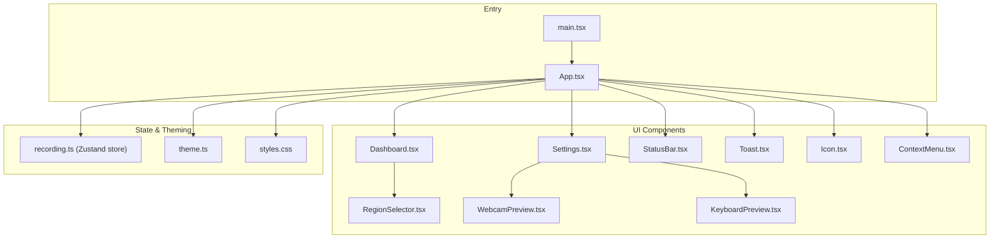
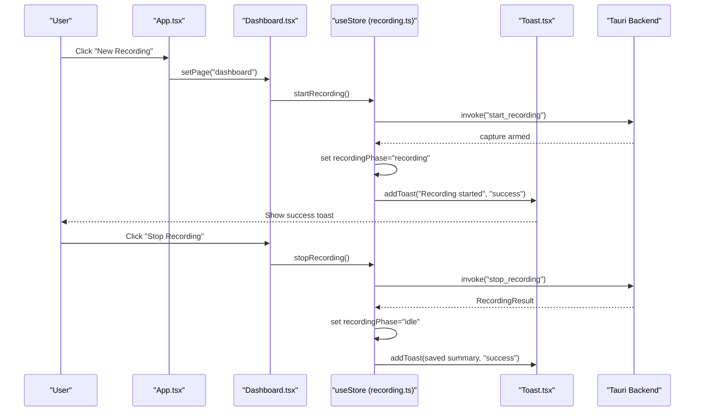
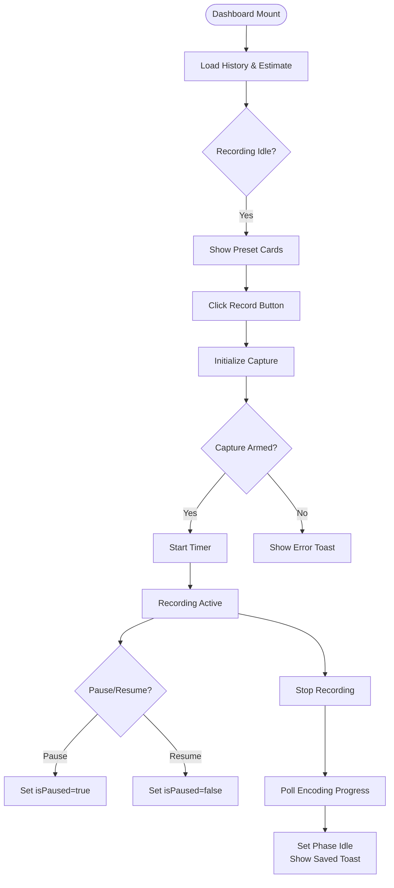
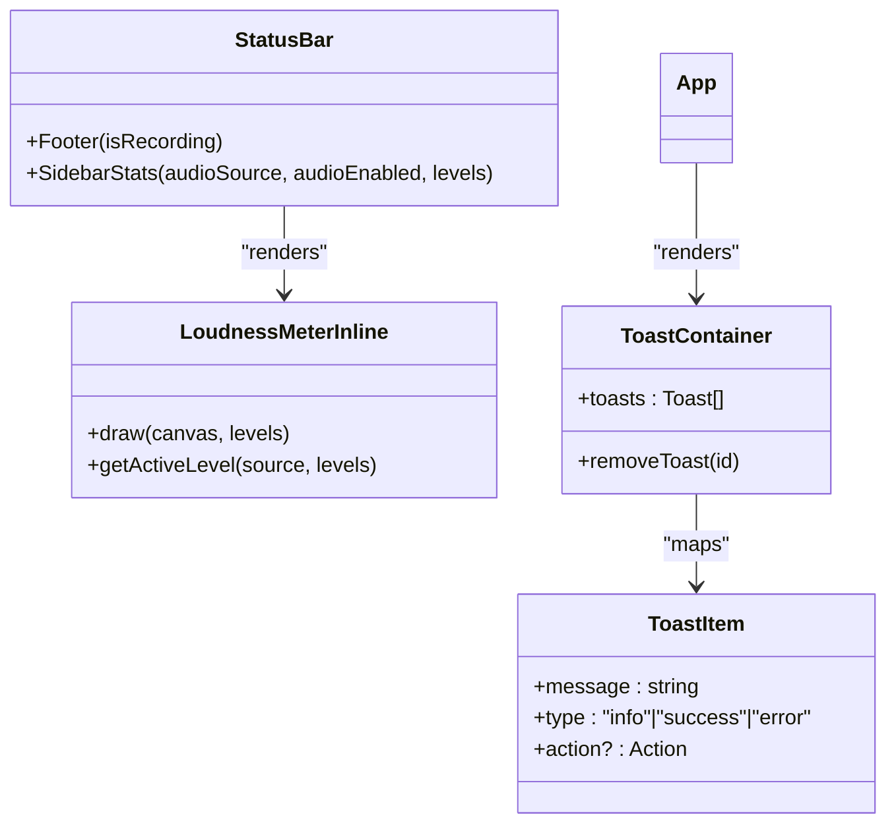
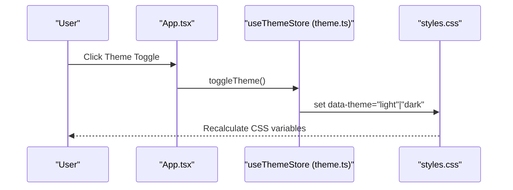
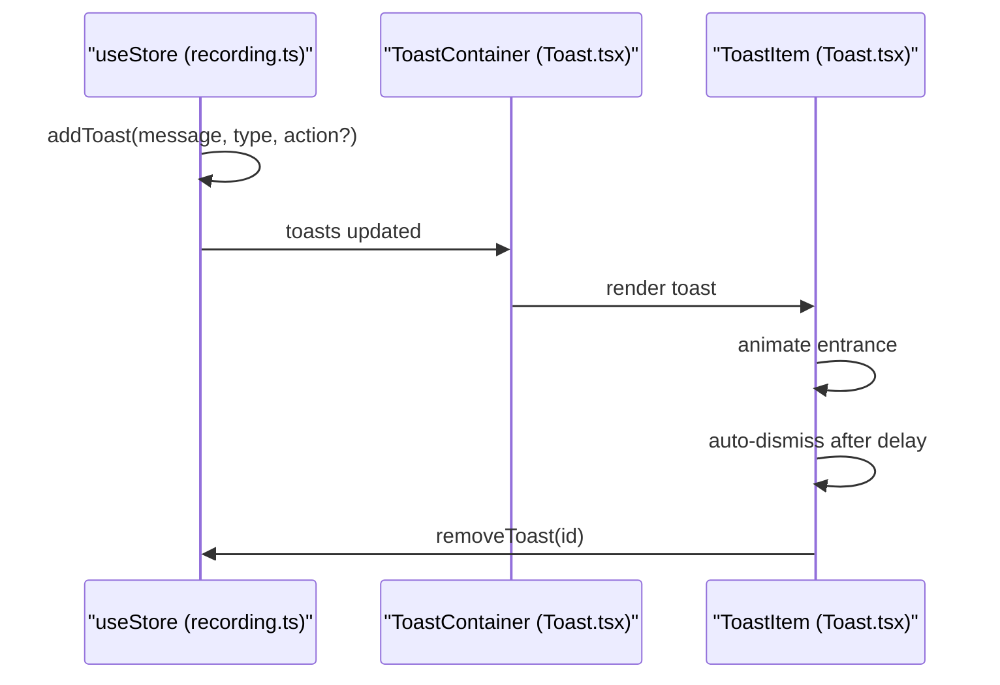
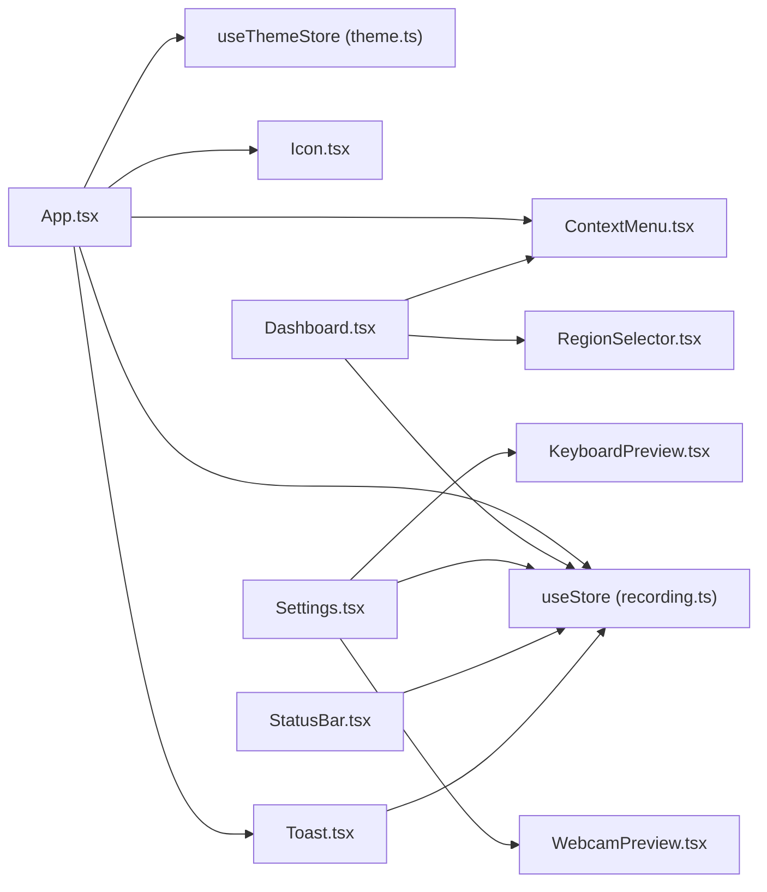

# User Interface Components

<cite>
**Referenced Files in This Document**
- [App.tsx](file://src/App.tsx)
- [main.tsx](file://src/main.tsx)
- [Dashboard.tsx](file://src/components/Dashboard.tsx)
- [Settings.tsx](file://src/components/Settings.tsx)
- [StatusBar.tsx](file://src/components/StatusBar.tsx)
- [Toast.tsx](file://src/components/Toast.tsx)
- [theme.ts](file://src/lib/theme.ts)
- [recording.ts](file://src/stores/recording.ts)
- [Icon.tsx](file://src/components/Icon.tsx)
- [ContextMenu.tsx](file://src/components/ContextMenu.tsx)
- [styles.css](file://src/styles.css)
- [RegionSelector.tsx](file://src/components/RegionSelector.tsx)
- [WebcamPreview.tsx](file://src/components/WebcamPreview.tsx)
- [KeyboardPreview.tsx](file://src/components/KeyboardPreview.tsx)
</cite>

## Table of Contents
1. [Introduction](#introduction)
2. [Project Structure](#project-structure)
3. [Core Components](#core-components)
4. [Architecture Overview](#architecture-overview)
5. [Detailed Component Analysis](#detailed-component-analysis)
6. [Dependency Analysis](#dependency-analysis)
7. [Performance Considerations](#performance-considerations)
8. [Troubleshooting Guide](#troubleshooting-guide)
9. [Conclusion](#conclusion)
10. [Appendices](#appendices)

## Introduction
This document explains EasySpecy's user interface components and interaction patterns. It covers the dashboard layout and control system, settings panel organization and configuration options, status bar indicators and notifications, theme switching functionality, and the toast notification system. It also details the component architecture, state management integration via a centralized store, and user interaction workflows. Guidance is included for component customization, accessibility features, and responsive design considerations across screen sizes and resolutions.

## Project Structure
EasySpecy is a React + Tauri application with a modular component architecture. UI components live under src/components, global state is managed in src/stores, theming and design tokens are defined in src/styles.css, and theme persistence is handled in src/lib/theme.ts. The main entry renders the App component, which orchestrates navigation, theme application, and global event listeners.

**Diagram sources**
- [main.tsx:1-15](file://src/main.tsx#L1-L15)
- [App.tsx:17-189](file://src/App.tsx#L17-L189)
- [Dashboard.tsx:218-573](file://src/components/Dashboard.tsx#L218-L573)
- [Settings.tsx:40-738](file://src/components/Settings.tsx#L40-L738)
- [StatusBar.tsx:6-44](file://src/components/StatusBar.tsx#L6-L44)
- [Toast.tsx:5-18](file://src/components/Toast.tsx#L5-L18)
- [Icon.tsx:1-61](file://src/components/Icon.tsx#L1-L61)
- [ContextMenu.tsx:45-178](file://src/components/ContextMenu.tsx#L45-L178)
- [RegionSelector.tsx:7-141](file://src/components/RegionSelector.tsx#L7-L141)
- [WebcamPreview.tsx:71-493](file://src/components/WebcamPreview.tsx#L71-L493)
- [KeyboardPreview.tsx:86-894](file://src/components/KeyboardPreview.tsx#L86-L894)
- [recording.ts:177-405](file://src/stores/recording.ts#L177-L405)
- [theme.ts:12-51](file://src/lib/theme.ts#L12-L51)
- [styles.css:13-301](file://src/styles.css#L13-L301)

**Section sources**
- [main.tsx:1-15](file://src/main.tsx#L1-L15)
- [App.tsx:17-189](file://src/App.tsx#L17-L189)
- [styles.css:13-301](file://src/styles.css#L13-L301)

## Core Components
- App shell and navigation: Orchestrates page routing between Dashboard and Settings, manages theme application, global audio monitoring, and Tauri event listeners for recording and webcam events.
- Dashboard: Central recording control surface with preset cards, timer, encoding progress, recent recordings, and region selector integration.
- Settings: Comprehensive configuration panel for video/audio/webcam/keyboard/cursor effects, hotkeys, and general preferences with live previews.
- Status bar: Footer credit line and sidebar stats panel with system info, inline loudness meter, and clock.
- Toast container: Global toast notifications with animated entrance/exit and optional actions.
- Theme store: Persistent theme switching with CSS variable-based design tokens.
- Context menus: Global context menu provider with app-wide and recording-entry-specific actions.
- Region selector: Fullscreen overlay for precise region selection.
- Webcam and keyboard overlays: Interactive preview modals for configuring overlay geometry, appearance, and behavior.

**Section sources**
- [App.tsx:17-189](file://src/App.tsx#L17-L189)
- [Dashboard.tsx:218-573](file://src/components/Dashboard.tsx#L218-L573)
- [Settings.tsx:40-738](file://src/components/Settings.tsx#L40-L738)
- [StatusBar.tsx:6-44](file://src/components/StatusBar.tsx#L6-L44)
- [Toast.tsx:5-18](file://src/components/Toast.tsx#L5-L18)
- [theme.ts:12-51](file://src/lib/theme.ts#L12-L51)
- [ContextMenu.tsx:45-178](file://src/components/ContextMenu.tsx#L45-L178)
- [RegionSelector.tsx:7-141](file://src/components/RegionSelector.tsx#L7-L141)
- [WebcamPreview.tsx:71-493](file://src/components/WebcamPreview.tsx#L71-L493)
- [KeyboardPreview.tsx:86-894](file://src/components/KeyboardPreview.tsx#L86-L894)

## Architecture Overview
The UI follows a unidirectional data flow with a central Zustand store for state and a theme store for theme management. Components subscribe to slices of state and dispatch actions via the store. Tauri APIs bridge UI interactions to native recording, audio, and device management.

**Diagram sources**
- [App.tsx:108-119](file://src/App.tsx#L108-L119)
- [Dashboard.tsx:394-428](file://src/components/Dashboard.tsx#L394-L428)
- [recording.ts:284-337](file://src/stores/recording.ts#L284-L337)
- [Toast.tsx:20-78](file://src/components/Toast.tsx#L20-L78)

**Section sources**
- [recording.ts:177-405](file://src/stores/recording.ts#L177-L405)
- [App.tsx:30-60](file://src/App.tsx#L30-L60)

## Detailed Component Analysis

### Dashboard Layout and Control System
The Dashboard is the primary control surface. It displays:
- Header status with recording indicator and system state
- Timer and pause/resume controls during recording
- Inline preset cards for resolution, FPS, audio, encoder, quality, and mode
- Encoding progress indicator with stage and percentage
- Last recording summary with open action
- Recent recordings list with context menu actions
- Region selector overlay integration for region-based capture

Key behaviors:
- Timer updates only while recording and paused state is tracked
- Preset cards disable interactions during recording
- Encoding progress polls backend and updates UI reactively
- Region mode triggers fullscreen overlay for selection

**Diagram sources**
- [Dashboard.tsx:218-573](file://src/components/Dashboard.tsx#L218-L573)
- [recording.ts:284-337](file://src/stores/recording.ts#L284-L337)

**Section sources**
- [Dashboard.tsx:218-573](file://src/components/Dashboard.tsx#L218-L573)
- [recording.ts:284-337](file://src/stores/recording.ts#L284-L337)

### Settings Panel Organization and Configuration Options
The Settings panel is organized into collapsible cards:
- Video: Resolution, FPS, capture mode, encoder, quality, custom bitrate
- Audio: Toggle, source selection, sample rate, device, gain, system volume, noise controls with live VU meters
- Webcam Overlay: Enable toggle and modal preview with device selection, shape, size, border, opacity, and image adjustments
- Keyboard Overlay: Enable toggle and modal preview with theme presets, fonts, opacity, geometry, bubble limits, timeouts, and key glyph mappings
- Auto-Zoom: Enable toggle and parameters for zoom factor, dwell duration, and pan speed
- Cursor & Click Effects: Cursor pack selection, trail style/color/scale/smoothing, click effects, and interactive canvas preview
- Global Hotkeys: Start, stop, and pause shortcuts
- General: Output directory, tray behavior, clipboard copy

Live feedback:
- Audio levels visualization in the Settings panel when audio is enabled
- Cursor preview live swap for 30 seconds
- Real-time keyboard overlay preview with typing sandbox

**Section sources**
- [Settings.tsx:40-738](file://src/components/Settings.tsx#L40-L738)
- [WebcamPreview.tsx:71-493](file://src/components/WebcamPreview.tsx#L71-L493)
- [KeyboardPreview.tsx:86-894](file://src/components/KeyboardPreview.tsx#L86-L894)

### Status Bar Indicators and Notifications
- Footer: Minimal credit line with subtle glow during recording
- Sidebar stats: System info (resolution, refresh rate, CPU cores, DPR), inline horizontal loudness meter, and clock
- Toast notifications: Positioned in top-right, support info, success, and error types with optional actions

**Diagram sources**
- [StatusBar.tsx:6-44](file://src/components/StatusBar.tsx#L6-L44)
- [StatusBar.tsx:194-364](file://src/components/StatusBar.tsx#L194-L364)
- [Toast.tsx:5-18](file://src/components/Toast.tsx#L5-L18)
- [Toast.tsx:20-78](file://src/components/Toast.tsx#L20-L78)

**Section sources**
- [StatusBar.tsx:6-44](file://src/components/StatusBar.tsx#L6-L44)
- [StatusBar.tsx:68-171](file://src/components/StatusBar.tsx#L68-L171)
- [StatusBar.tsx:194-364](file://src/components/StatusBar.tsx#L194-L364)
- [Toast.tsx:5-18](file://src/components/Toast.tsx#L5-L18)
- [Toast.tsx:20-78](file://src/components/Toast.tsx#L20-L78)

### Theme Switching Functionality
Theme switching is implemented via a persistent Zustand store that applies a CSS data attribute to the document root. The design system defines CSS variables for all surfaces, text, borders, accents, and shadows. The theme store toggles between "dark" and "light" modes and persists the preference.

**Diagram sources**
- [App.tsx:138-147](file://src/App.tsx#L138-L147)
- [theme.ts:12-51](file://src/lib/theme.ts#L12-L51)
- [styles.css:68-172](file://src/styles.css#L68-L172)

**Section sources**
- [theme.ts:12-51](file://src/lib/theme.ts#L12-L51)
- [styles.css:68-172](file://src/styles.css#L68-L172)

### Toast Notification System
The toast system provides non-blocking feedback with automatic dismissal. Toasts are queued in the store and rendered in a fixed container. Each toast supports an optional action callback.

**Diagram sources**
- [recording.ts:203-209](file://src/stores/recording.ts#L203-L209)
- [Toast.tsx:5-18](file://src/components/Toast.tsx#L5-L18)
- [Toast.tsx:20-78](file://src/components/Toast.tsx#L20-L78)

**Section sources**
- [recording.ts:203-209](file://src/stores/recording.ts#L203-L209)
- [Toast.tsx:5-18](file://src/components/Toast.tsx#L5-L18)
- [Toast.tsx:20-78](file://src/components/Toast.tsx#L20-L78)

### Component Customization Examples
- Preset cards: Inline dropdowns with animated transitions and hover states; disabled during recording to prevent invalid state changes.
- Region selector: Fullscreen overlay with crosshair cursor, selection rectangle, dimension label, and resize handles; ESC cancels.
- Webcam overlay: Draggable/resizable overlay with shape presets, border color swatches, opacity slider, and image adjustments (brightness/contrast/sharpen).
- Keyboard overlay: Draggable/resizable overlay with theme presets, font family/size controls, opacity, bubble count/timeouts, and key glyph mapping editor.
- Context menus: Global provider with app actions (settings, theme toggle, quit) and recording entry actions (open, reveal, copy path, delete).

**Section sources**
- [Dashboard.tsx:26-119](file://src/components/Dashboard.tsx#L26-L119)
- [RegionSelector.tsx:7-141](file://src/components/RegionSelector.tsx#L7-L141)
- [WebcamPreview.tsx:71-493](file://src/components/WebcamPreview.tsx#L71-L493)
- [KeyboardPreview.tsx:86-894](file://src/components/KeyboardPreview.tsx#L86-L894)
- [ContextMenu.tsx:182-230](file://src/components/ContextMenu.tsx#L182-L230)
- [ContextMenu.tsx:232-265](file://src/components/ContextMenu.tsx#L232-L265)

### Accessibility Features
- Focus management: CSS focus rings and reduced-motion support for preference-aware animations.
- Keyboard navigation: Global hotkeys for recording control and context menu keyboard handling.
- Visual contrast: Theme-aware color tokens and explicit focus styles.
- Motion preferences: Reduced-motion media query reduces animation duration and iterations.

**Section sources**
- [styles.css:226-245](file://src/styles.css#L226-L245)
- [ContextMenu.tsx:74-86](file://src/components/ContextMenu.tsx#L74-L86)
- [recording.ts:237-262](file://src/stores/recording.ts#L237-L262)

### Responsive Design Considerations
- Fixed sidebar (240px) with collapsible navigation and scrollable content areas.
- Grid-based preset cards adapt to available width; sliders and inputs remain usable across breakpoints.
- Overlay modals scale with recording resolution using a calculated scale factor to maintain aspect ratios.
- Canvas-based loudness meter adapts to device pixel ratio for crisp rendering.

**Section sources**
- [App.tsx:94-148](file://src/App.tsx#L94-L148)
- [Dashboard.tsx:448-523](file://src/components/Dashboard.tsx#L448-L523)
- [WebcamPreview.tsx:152-160](file://src/components/WebcamPreview.tsx#L152-L160)
- [KeyboardPreview.tsx:444-451](file://src/components/KeyboardPreview.tsx#L444-L451)
- [StatusBar.tsx:234-242](file://src/components/StatusBar.tsx#L234-L242)

## Dependency Analysis
The UI components depend on:
- Zustand store for state and side effects (recording lifecycle, hotkeys, toasts, audio levels)
- Theme store for theme persistence and runtime switching
- Tauri APIs for device enumeration, recording control, encoding progress, and notifications
- Motion for animations and transitions
- Tailwind and custom CSS variables for design tokens

**Diagram sources**
- [App.tsx:17-189](file://src/App.tsx#L17-L189)
- [recording.ts:177-405](file://src/stores/recording.ts#L177-L405)
- [theme.ts:12-51](file://src/lib/theme.ts#L12-L51)
- [Icon.tsx:1-61](file://src/components/Icon.tsx#L1-L61)
- [Toast.tsx:5-18](file://src/components/Toast.tsx#L5-L18)
- [ContextMenu.tsx:45-178](file://src/components/ContextMenu.tsx#L45-L178)
- [Dashboard.tsx:218-573](file://src/components/Dashboard.tsx#L218-L573)
- [RegionSelector.tsx:7-141](file://src/components/RegionSelector.tsx#L7-L141)
- [Settings.tsx:40-738](file://src/components/Settings.tsx#L40-L738)
- [WebcamPreview.tsx:71-493](file://src/components/WebcamPreview.tsx#L71-L493)
- [KeyboardPreview.tsx:86-894](file://src/components/KeyboardPreview.tsx#L86-L894)
- [StatusBar.tsx:6-44](file://src/components/StatusBar.tsx#L6-L44)

**Section sources**
- [App.tsx:17-189](file://src/App.tsx#L17-L189)
- [recording.ts:177-405](file://src/stores/recording.ts#L177-L405)

## Performance Considerations
- Animation throttling: Audio levels polling occurs at ~20Hz globally; encoding progress polling is optimized to balance responsiveness and CPU usage.
- Canvas rendering: Loudness meter uses requestAnimationFrame and device pixel ratio scaling for efficient drawing.
- Conditional rendering: Region selector overlay and encoding progress only render when relevant to avoid unnecessary DOM updates.
- Store subscriptions: Components subscribe to minimal state slices to reduce re-renders.

[No sources needed since this section provides general guidance]

## Troubleshooting Guide
Common issues and remedies:
- Webcam errors: Displayed via toast notifications with event-driven listeners; ensure permissions and device availability.
- Recording initialization failures: Toasts indicate failure reasons; verify backend capture device availability and permissions.
- Hotkey conflicts: Registration/unregistration occurs on config save; ensure keys are not reserved by the OS.
- Audio monitor issues: Start/stop lifecycle is managed centrally; ensure no conflicting streams are active.

**Section sources**
- [App.tsx:52-54](file://src/App.tsx#L52-L54)
- [recording.ts:211-226](file://src/stores/recording.ts#L211-L226)
- [recording.ts:237-262](file://src/stores/recording.ts#L237-L262)
- [recording.ts:383-396](file://src/stores/recording.ts#L383-L396)

## Conclusion
EasySpecy’s UI combines a clean, theme-aware design with robust state management and rich interactive components. The Dashboard and Settings panels provide comprehensive control over recording parameters, while the StatusBar and Toast system deliver timely feedback. The theme store and design tokens enable seamless light/dark switching, and the overlay modals offer precise customization for webcam and keyboard overlays. Accessibility and responsive design are integrated through CSS variables, reduced-motion support, and scalable overlays.

[No sources needed since this section summarizes without analyzing specific files]

## Appendices

### Component Interaction Patterns
- Navigation: App-level page state switches between Dashboard and Settings; sidebar nav items mirror page state.
- Context menus: Global provider handles positioning, click-outside-to-close, and Escape key; app and recording-specific menus share a unified API.
- Region selection: Fullscreen overlay captures mouse events for drag-to-select; ESC cancels and exits region mode.
- Preview modals: Webcam and Keyboard overlays use draggable/resizable containers with live updates and scaling based on recording resolution.

**Section sources**
- [App.tsx:122-126](file://src/App.tsx#L122-L126)
- [ContextMenu.tsx:45-178](file://src/components/ContextMenu.tsx#L45-L178)
- [RegionSelector.tsx:15-24](file://src/components/RegionSelector.tsx#L15-L24)
- [WebcamPreview.tsx:423-444](file://src/components/WebcamPreview.tsx#L423-L444)
- [KeyboardPreview.tsx:821-845](file://src/components/KeyboardPreview.tsx#L821-L845)