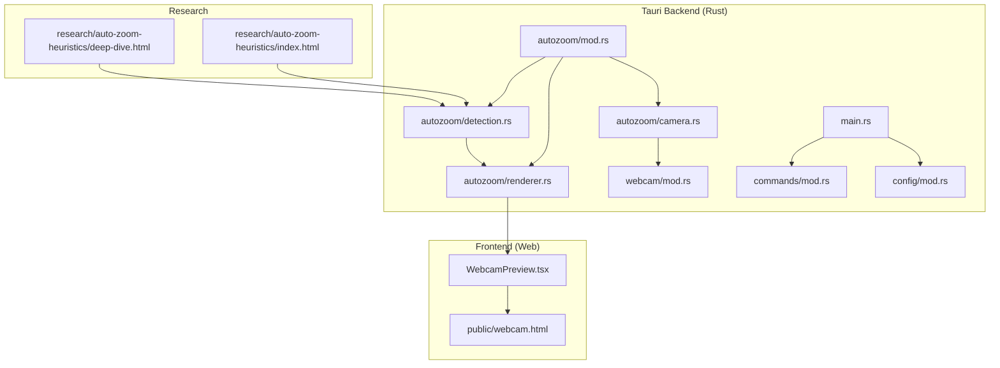
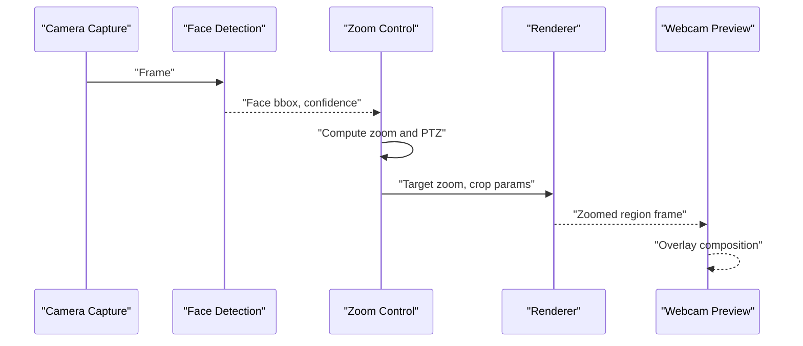
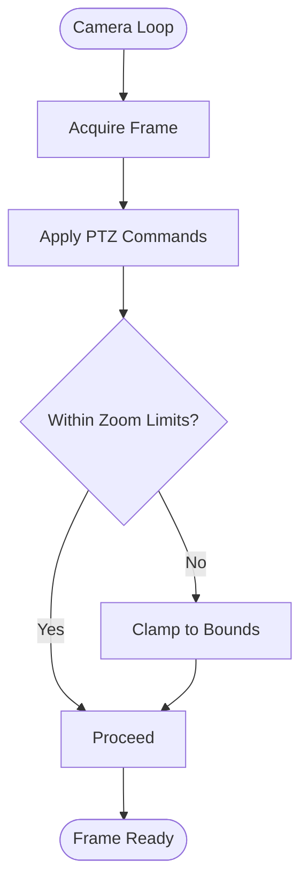
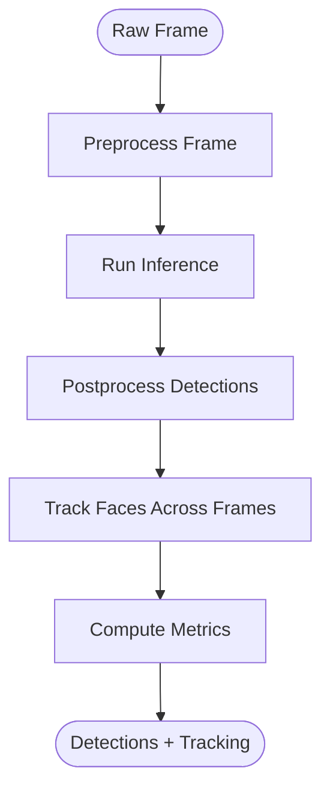
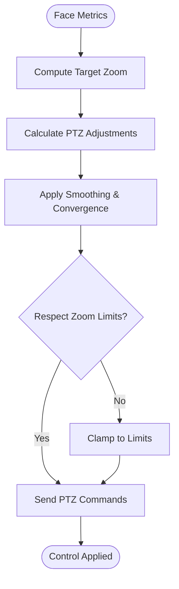
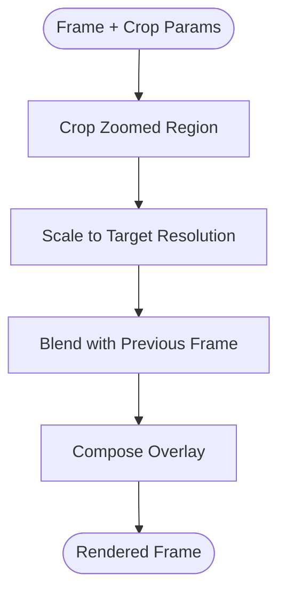
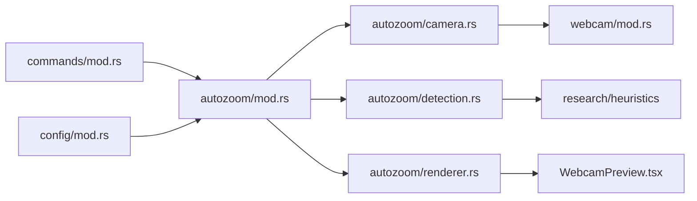

# Auto-Zoom Feature

<cite>
**Referenced Files in This Document**
- [README.md](file://README.md)
- [IMPLEMENTATION_ANALYSIS.md](file://IMPLEMENTATION_ANALYSIS.md)
- [src-tauri/src/autozoom/mod.rs](file://src-tauri/src/autozoom/mod.rs)
- [src-tauri/src/autozoom/camera.rs](file://src-tauri/src/autozoom/camera.rs)
- [src-tauri/src/autozoom/detection.rs](file://src-tauri/src/autozoom/detection.rs)
- [src-tauri/src/autozoom/renderer.rs](file://src-tauri/src/autozoom/renderer.rs)
- [src-tauri/src/webcam/mod.rs](file://src-tauri/src/webcam/mod.rs)
- [src-tauri/src/commands/mod.rs](file://src-tauri/src/commands/mod.rs)
- [src-tauri/src/config/mod.rs](file://src-tauri/src/config/mod.rs)
- [src-tauri/src/main.rs](file://src-tauri/src/main.rs)
- [src/components/WebcamPreview.tsx](file://src/components/WebcamPreview.tsx)
- [public/webcam.html](file://public/webcam.html)
- [research/auto-zoom-heuristics/index.html](file://research/auto-zoom-heuristics/index.html)
- [research/auto-zoom-heuristics/deep-dive.html](file://research/auto-zoom-heuristics/deep-dive.html)
- [tests/test_autozoom.py](file://tests/test_autozoom.py)
</cite>

## Table of Contents
1. [Introduction](#introduction)
2. [Project Structure](#project-structure)
3. [Core Components](#core-components)
4. [Architecture Overview](#architecture-overview)
5. [Detailed Component Analysis](#detailed-component-analysis)
6. [Dependency Analysis](#dependency-analysis)
7. [Performance Considerations](#performance-considerations)
8. [Troubleshooting Guide](#troubleshooting-guide)
9. [Conclusion](#conclusion)
10. [Appendices](#appendices)

## Introduction
This document describes EasySpecy's auto-zoom feature, focusing on facial detection, zoom calculation algorithms, and dynamic camera control. It explains the autozoom module architecture, including camera integration, face detection pipeline, zoom adjustment logic, pan-tilt-zoom (PTZ) operations, detection sensitivity settings, and performance optimization. It also covers the rendering pipeline for zoomed regions, smooth transitions, boundary handling, research methodologies, heuristic algorithms for zoom decision-making, and integration with the webcam overlay system. Configuration options for detection thresholds, zoom limits, and performance tuning for different camera hardware are documented.

## Project Structure
The auto-zoom feature spans both the Tauri backend (Rust) and the web frontend (TypeScript/React). The backend autozoom module encapsulates camera capture, face detection, and rendering logic. The frontend provides webcam preview and overlay integration. Research documents outline heuristic algorithms and findings.

**Diagram sources**
- [src-tauri/src/autozoom/mod.rs](file://src-tauri/src/autozoom/mod.rs)
- [src-tauri/src/autozoom/camera.rs](file://src-tauri/src/autozoom/camera.rs)
- [src-tauri/src/autozoom/detection.rs](file://src-tauri/src/autozoom/detection.rs)
- [src-tauri/src/autozoom/renderer.rs](file://src-tauri/src/autozoom/renderer.rs)
- [src-tauri/src/webcam/mod.rs](file://src-tauri/src/webcam/mod.rs)
- [src-tauri/src/commands/mod.rs](file://src-tauri/src/commands/mod.rs)
- [src-tauri/src/config/mod.rs](file://src-tauri/src/config/mod.rs)
- [src-tauri/src/main.rs](file://src-tauri/src/main.rs)
- [src/components/WebcamPreview.tsx](file://src/components/WebcamPreview.tsx)
- [public/webcam.html](file://public/webcam.html)
- [research/auto-zoom-heuristics/index.html](file://research/auto-zoom-heuristics/index.html)
- [research/auto-zoom-heuristics/deep-dive.html](file://research/auto-zoom-heuristics/deep-dive.html)

**Section sources**
- [README.md](file://README.md)
- [IMPLEMENTATION_ANALYSIS.md](file://IMPLEMENTATION_ANALYSIS.md)

## Core Components
- Autozoom module entrypoint orchestrating camera capture, detection, and rendering.
- Camera subsystem managing device selection, frame acquisition, and PTZ control.
- Detection subsystem performing face detection and tracking metrics.
- Renderer subsystem handling zoomed region extraction, smoothing, and overlay composition.
- Frontend webcam preview and overlay integration for user feedback.
- Research documents containing heuristic algorithms and evaluation findings.

Key implementation references:
- Autozoom module initialization and exports: [src-tauri/src/autozoom/mod.rs](file://src-tauri/src/autozoom/mod.rs)
- Camera capture and PTZ control: [src-tauri/src/autozoom/camera.rs](file://src-tauri/src/autozoom/camera.rs)
- Face detection pipeline: [src-tauri/src/autozoom/detection.rs](file://src-tauri/src/autozoom/detection.rs)
- Rendering and overlay composition: [src-tauri/src/autozoom/renderer.rs](file://src-tauri/src/autozoom/renderer.rs)
- Webcam frontend integration: [src/components/WebcamPreview.tsx](file://src/components/WebcamPreview.tsx)
- Research heuristics: [research/auto-zoom-heuristics/index.html](file://research/auto-zoom-heuristics/index.html), [research/auto-zoom-heuristics/deep-dive.html](file://research/auto-zoom-heuristics/deep-dive.html)

**Section sources**
- [src-tauri/src/autozoom/mod.rs](file://src-tauri/src/autozoom/mod.rs)
- [src-tauri/src/autozoom/camera.rs](file://src-tauri/src/autozoom/camera.rs)
- [src-tauri/src/autozoom/detection.rs](file://src-tauri/src/autozoom/detection.rs)
- [src-tauri/src/autozoom/renderer.rs](file://src-tauri/src/autozoom/renderer.rs)
- [src/components/WebcamPreview.tsx](file://src/components/WebcamPreview.tsx)
- [research/auto-zoom-heuristics/index.html](file://research/auto-zoom-heuristics/index.html)
- [research/auto-zoom-heuristics/deep-dive.html](file://research/auto-zoom-heuristics/deep-dive.html)

## Architecture Overview
The auto-zoom system follows a modular pipeline:
- Camera capture feeds frames to the detection subsystem.
- Detection computes face bounding boxes and tracking metrics.
- Zoom calculation determines target zoom level and PTZ adjustments.
- Renderer extracts and scales the zoomed region with smooth transitions.
- Overlay composes the zoomed region onto the webcam preview.

**Diagram sources**
- [src-tauri/src/autozoom/camera.rs](file://src-tauri/src/autozoom/camera.rs)
- [src-tauri/src/autozoom/detection.rs](file://src-tauri/src/autozoom/detection.rs)
- [src-tauri/src/autozoom/mod.rs](file://src-tauri/src/autozoom/mod.rs)
- [src-tauri/src/autozoom/renderer.rs](file://src-tauri/src/autozoom/renderer.rs)
- [src/components/WebcamPreview.tsx](file://src/components/WebcamPreview.tsx)

## Detailed Component Analysis

### Autozoom Module Orchestration
Responsibilities:
- Initialize camera, detection, and renderer components.
- Coordinate frame flow from capture to detection to rendering.
- Expose configuration and runtime controls.

Implementation highlights:
- Module entry and exports: [src-tauri/src/autozoom/mod.rs](file://src-tauri/src/autozoom/mod.rs)

**Section sources**
- [src-tauri/src/autozoom/mod.rs](file://src-tauri/src/autozoom/mod.rs)

### Camera Integration and PTZ Control
Responsibilities:
- Select and configure camera devices.
- Acquire frames at controlled intervals.
- Apply pan-tilt-zoom adjustments based on zoom control logic.
- Manage camera-specific constraints and capabilities.

Key areas:
- Device enumeration and selection.
- Frame acquisition loop and timing.
- PTZ command generation and execution.
- Boundary handling for zoom limits and field-of-view constraints.

References:
- Camera subsystem: [src-tauri/src/autozoom/camera.rs](file://src-tauri/src/autozoom/camera.rs)
- Webcam backend integration: [src-tauri/src/webcam/mod.rs](file://src-tauri/src/webcam/mod.rs)

**Diagram sources**
- [src-tauri/src/autozoom/camera.rs](file://src-tauri/src/autozoom/camera.rs)

**Section sources**
- [src-tauri/src/autozoom/camera.rs](file://src-tauri/src/autozoom/camera.rs)
- [src-tauri/src/webcam/mod.rs](file://src-tauri/src/webcam/mod.rs)

### Face Detection Pipeline
Responsibilities:
- Detect faces in each frame.
- Track faces across frames for stability.
- Compute detection metrics (size, center, confidence).
- Provide inputs for zoom calculation.

Processing stages:
- Preprocessing (resize, normalization).
- Inference using trained model.
- Postprocessing (non-maximum suppression, confidence filtering).
- Tracking (centroid distance, persistence).

References:
- Detection implementation: [src-tauri/src/autozoom/detection.rs](file://src-tauri/src/autozoom/detection.rs)
- Research heuristics: [research/auto-zoom-heuristics/index.html](file://research/auto-zoom-heuristics/index.html), [research/auto-zoom-heuristics/deep-dive.html](file://research/auto-zoom-heuristics/deep-dive.html)

**Diagram sources**
- [src-tauri/src/autozoom/detection.rs](file://src-tauri/src/autozoom/detection.rs)
- [research/auto-zoom-heuristics/index.html](file://research/auto-zoom-heuristics/index.html)
- [research/auto-zoom-heuristics/deep-dive.html](file://research/auto-zoom-heuristics/deep-dive.html)

**Section sources**
- [src-tauri/src/autozoom/detection.rs](file://src-tauri/src/autozoom/detection.rs)
- [research/auto-zoom-heuristics/index.html](file://research/auto-zoom-heuristics/index.html)
- [research/auto-zoom-heuristics/deep-dive.html](file://research/auto-zoom-heuristics/deep-dive.html)

### Zoom Calculation and Control Logic
Responsibilities:
- Determine target zoom level based on face metrics.
- Compute PTZ adjustments for centering and framing.
- Enforce zoom limits and smooth transitions.
- Handle boundary conditions and convergence behavior.

Algorithms:
- Heuristic-based zoom sizing using face area and aspect ratios.
- PID-like control for smooth PTZ transitions.
- Convergence thresholds to avoid oscillation.

References:
- Autozoom module coordination: [src-tauri/src/autozoom/mod.rs](file://src-tauri/src/autozoom/mod.rs)
- Research heuristics: [research/auto-zoom-heuristics/index.html](file://research/auto-zoom-heuristics/index.html), [research/auto-zoom-heuristics/deep-dive.html](file://research/auto-zoom-heuristics/deep-dive.html)

**Diagram sources**
- [src-tauri/src/autozoom/mod.rs](file://src-tauri/src/autozoom/mod.rs)
- [research/auto-zoom-heuristics/index.html](file://research/auto-zoom-heuristics/index.html)
- [research/auto-zoom-heuristics/deep-dive.html](file://research/auto-zoom-heuristics/deep-dive.html)

**Section sources**
- [src-tauri/src/autozoom/mod.rs](file://src-tauri/src/autozoom/mod.rs)
- [research/auto-zoom-heuristics/index.html](file://research/auto-zoom-heuristics/index.html)
- [research/auto-zoom-heuristics/deep-dive.html](file://research/auto-zoom-heuristics/deep-dive.html)

### Rendering Pipeline and Smooth Transitions
Responsibilities:
- Extract zoomed region from the frame.
- Scale and blend for smooth transitions.
- Compose overlay with webcam preview.
- Handle boundary clipping and aspect ratio preservation.

Techniques:
- Bilinear/trilinear interpolation for scaling.
- Cross-fade or motion-blur for transitions.
- Aspect-ratio correction and cropping boundaries.

References:
- Renderer implementation: [src-tauri/src/autozoom/renderer.rs](file://src-tauri/src/autozoom/renderer.rs)
- Frontend overlay: [src/components/WebcamPreview.tsx](file://src/components/WebcamPreview.tsx)
- Public overlay page: [public/webcam.html](file://public/webcam.html)

**Diagram sources**
- [src-tauri/src/autozoom/renderer.rs](file://src-tauri/src/autozoom/renderer.rs)
- [src/components/WebcamPreview.tsx](file://src/components/WebcamPreview.tsx)
- [public/webcam.html](file://public/webcam.html)

**Section sources**
- [src-tauri/src/autozoom/renderer.rs](file://src-tauri/src/autozoom/renderer.rs)
- [src/components/WebcamPreview.tsx](file://src/components/WebcamPreview.tsx)
- [public/webcam.html](file://public/webcam.html)

### Configuration and Tuning
Configuration surfaces:
- Detection sensitivity thresholds.
- Zoom limits (min/max zoom factors).
- PTZ speed and smoothing parameters.
- Rendering quality settings (scaling mode, blending).
- Camera-specific constraints (resolution, FPS, PTZ range).

Integration points:
- Configuration module: [src-tauri/src/config/mod.rs](file://src-tauri/src/config/mod.rs)
- Command bridge for runtime updates: [src-tauri/src/commands/mod.rs](file://src-tauri/src/commands/mod.rs)
- Application entrypoint: [src-tauri/src/main.rs](file://src-tauri/src/main.rs)

References:
- Implementation of configurable parameters and runtime updates: [src-tauri/src/config/mod.rs](file://src-tauri/src/config/mod.rs), [src-tauri/src/commands/mod.rs](file://src-tauri/src/commands/mod.rs), [src-tauri/src/main.rs](file://src-tauri/src/main.rs)

**Section sources**
- [src-tauri/src/config/mod.rs](file://src-tauri/src/config/mod.rs)
- [src-tauri/src/commands/mod.rs](file://src-tauri/src/commands/mod.rs)
- [src-tauri/src/main.rs](file://src-tauri/src/main.rs)

### Research Methodologies and Heuristics
Methodology:
- Empirical evaluation of zoom heuristics across camera hardware.
- Comparative analysis of detection thresholds and smoothing parameters.
- Statistical modeling of convergence behavior and boundary handling.

Heuristics:
- Area-based zoom sizing using face bounding box area.
- Centering via centroid offset with deadband thresholds.
- Adaptive smoothing based on velocity and acceleration of face movement.

References:
- Index page: [research/auto-zoom-heuristics/index.html](file://research/auto-zoom-heuristics/index.html)
- Deep-dive page: [research/auto-zoom-heuristics/deep-dive.html](file://research/auto-zoom-heuristics/deep-dive.html)
- Test suite: [tests/test_autozoom.py](file://tests/test_autozoom.py)

**Section sources**
- [research/auto-zoom-heuristics/index.html](file://research/auto-zoom-heuristics/index.html)
- [research/auto-zoom-heuristics/deep-dive.html](file://research/auto-zoom-heuristics/deep-dive.html)
- [tests/test_autozoom.py](file://tests/test_autozoom.py)

## Dependency Analysis
The auto-zoom module exhibits clear separation of concerns with explicit dependencies:
- autozoom/mod.rs depends on camera, detection, and renderer modules.
- camera.rs integrates with webcam backend.
- detection.rs relies on research-derived heuristics.
- renderer.rs depends on frontend overlay components.
- commands and config modules provide runtime configuration.

**Diagram sources**
- [src-tauri/src/autozoom/mod.rs](file://src-tauri/src/autozoom/mod.rs)
- [src-tauri/src/autozoom/camera.rs](file://src-tauri/src/autozoom/camera.rs)
- [src-tauri/src/autozoom/detection.rs](file://src-tauri/src/autozoom/detection.rs)
- [src-tauri/src/autozoom/renderer.rs](file://src-tauri/src/autozoom/renderer.rs)
- [src-tauri/src/webcam/mod.rs](file://src-tauri/src/webcam/mod.rs)
- [src-tauri/src/commands/mod.rs](file://src-tauri/src/commands/mod.rs)
- [src-tauri/src/config/mod.rs](file://src-tauri/src/config/mod.rs)
- [src/components/WebcamPreview.tsx](file://src/components/WebcamPreview.tsx)
- [research/auto-zoom-heuristics/index.html](file://research/auto-zoom-heuristics/index.html)

**Section sources**
- [src-tauri/src/autozoom/mod.rs](file://src-tauri/src/autozoom/mod.rs)
- [src-tauri/src/autozoom/camera.rs](file://src-tauri/src/autozoom/camera.rs)
- [src-tauri/src/autozoom/detection.rs](file://src-tauri/src/autozoom/detection.rs)
- [src-tauri/src/autozoom/renderer.rs](file://src-tauri/src/autozoom/renderer.rs)
- [src-tauri/src/webcam/mod.rs](file://src-tauri/src/webcam/mod.rs)
- [src-tauri/src/commands/mod.rs](file://src-tauri/src/commands/mod.rs)
- [src-tauri/src/config/mod.rs](file://src-tauri/src/config/mod.rs)
- [src/components/WebcamPreview.tsx](file://src/components/WebcamPreview.tsx)
- [research/auto-zoom-heuristics/index.html](file://research/auto-zoom-heuristics/index.html)

## Performance Considerations
- Detection frequency: throttle frame rate to balance responsiveness and CPU usage.
- Smoothing parameters: tune convergence thresholds to reduce oscillation while maintaining responsiveness.
- Scaling quality: choose appropriate interpolation modes for real-time performance.
- PTZ command batching: group PTZ updates to minimize actuator chatter.
- Hardware-specific tuning: adjust detection thresholds and zoom limits per camera capabilities.
- Memory management: reuse buffers and avoid allocations in hot loops.

[No sources needed since this section provides general guidance]

## Troubleshooting Guide
Common issues and remedies:
- No detections: lower detection threshold or increase sensitivity; verify lighting and face orientation.
- Oscillating zoom: increase convergence thresholds; enable hysteresis bands.
- Stuttering PTZ: reduce update frequency; smooth velocity profiles.
- Distorted rendering: verify aspect ratio handling and cropping bounds.
- Camera limits exceeded: adjust zoom limits and PTZ bounds; validate hardware capabilities.

References:
- Configuration module for tunable parameters: [src-tauri/src/config/mod.rs](file://src-tauri/src/config/mod.rs)
- Commands module for runtime updates: [src-tauri/src/commands/mod.rs](file://src-tauri/src/commands/mod.rs)
- Test suite for regression checks: [tests/test_autozoom.py](file://tests/test_autozoom.py)

**Section sources**
- [src-tauri/src/config/mod.rs](file://src-tauri/src/config/mod.rs)
- [src-tauri/src/commands/mod.rs](file://src-tauri/src/commands/mod.rs)
- [tests/test_autozoom.py](file://tests/test_autozoom.py)

## Conclusion
EasySpecy’s auto-zoom feature combines a robust camera pipeline, a detection subsystem informed by research heuristics, and a renderer optimized for smooth transitions. The modular architecture enables precise tuning of detection sensitivity, zoom limits, and PTZ behavior, while the frontend overlay ensures seamless user feedback. By leveraging empirical heuristics and performance optimizations, the system delivers responsive and stable auto-zoom across diverse camera hardware.

[No sources needed since this section summarizes without analyzing specific files]

## Appendices

### Integration with Webcam Overlay System
- Frontend preview component: [src/components/WebcamPreview.tsx](file://src/components/WebcamPreview.tsx)
- Public overlay page: [public/webcam.html](file://public/webcam.html)
- Backend renderer composes frames for overlay consumption.

**Section sources**
- [src/components/WebcamPreview.tsx](file://src/components/WebcamPreview.tsx)
- [public/webcam.html](file://public/webcam.html)
- [src-tauri/src/autozoom/renderer.rs](file://src-tauri/src/autozoom/renderer.rs)