# Click Animation Effects

<cite>
**Referenced Files in This Document**
- [effects.ts](file://src/lib/effects.ts)
- [RecordingOverlay.tsx](file://src/components/RecordingOverlay.tsx)
- [Customization.tsx](file://src/components/Customization.tsx)
- [Settings.tsx](file://src/components/Settings.tsx)
- [App.tsx](file://src/App.tsx)
- [main.tsx](file://src/main.tsx)
</cite>

## Table of Contents
1. [Introduction](#introduction)
2. [Project Structure](#project-structure)
3. [Core Components](#core-components)
4. [Architecture Overview](#architecture-overview)
5. [Detailed Component Analysis](#detailed-component-analysis)
6. [Dependency Analysis](#dependency-analysis)
7. [Performance Considerations](#performance-considerations)
8. [Troubleshooting Guide](#troubleshooting-guide)
9. [Conclusion](#conclusion)

## Introduction
This document explains EasySpecy’s click animation effects system, focusing on five distinct click types: ripple, spotlight, ring, pulse, and confetti. It details the ClickEffectRenderer class architecture, including click event management, particle simulation for confetti effects, and temporal animation progression. It also documents the physics-based particle system with gravity, friction, and collision detection, and provides integration patterns with mouse event handling across the application.

## Project Structure
The click effects are implemented in a shared library module and consumed by UI components and a dedicated recording overlay window. The system integrates with Tauri events for accurate mouse tracking during recording sessions.

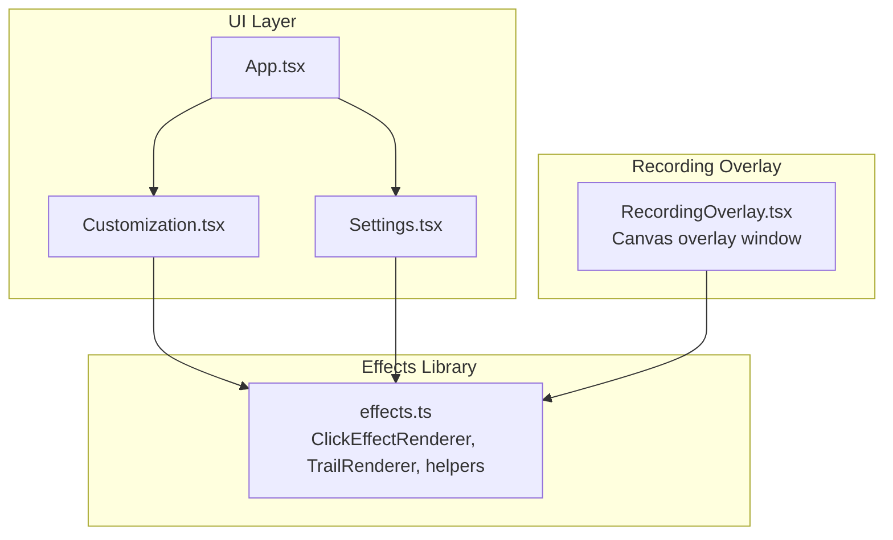

**Diagram sources**
- [App.tsx:17-189](file://src/App.tsx#L17-L189)
- [Customization.tsx:45-148](file://src/components/Customization.tsx#L45-L148)
- [Settings.tsx:1030-1072](file://src/components/Settings.tsx#L1030-L1072)
- [RecordingOverlay.tsx:18-136](file://src/components/RecordingOverlay.tsx#L18-L136)
- [effects.ts:416-677](file://src/lib/effects.ts#L416-L677)

**Section sources**
- [App.tsx:17-189](file://src/App.tsx#L17-L189)
- [main.tsx:1-15](file://src/main.tsx#L1-L15)

## Core Components
- ClickEffectRenderer: Manages click events, updates temporal progression, and renders one of five visual effects. It also simulates confetti particles with physics (gravity, friction, rotation).
- TrailRenderer: Provides complementary cursor trail effects used alongside click effects.
- RecordingOverlay: A transparent overlay window that receives precise mouse events from the backend and draws both trails and click effects.
- Customization and Settings: Provide live previews and configuration for click effects.

Key responsibilities:
- Click event lifecycle: add, update, filter, and draw.
- Physics simulation: gravity, friction, and rotational dynamics for confetti.
- Temporal progression: normalized animation lifetimes and easing functions.
- Integration: DOM mouse events for previews, Tauri events for recording overlay.

**Section sources**
- [effects.ts:416-677](file://src/lib/effects.ts#L416-L677)
- [RecordingOverlay.tsx:18-136](file://src/components/RecordingOverlay.tsx#L18-L136)
- [Customization.tsx:45-148](file://src/components/Customization.tsx#L45-L148)
- [Settings.tsx:1030-1072](file://src/components/Settings.tsx#L1030-L1072)

## Architecture Overview
The system separates concerns between event ingestion, state management, and rendering. During recording, the backend emits precise cursor positions and click events to the overlay window. In previews, mouse events are captured via DOM listeners.

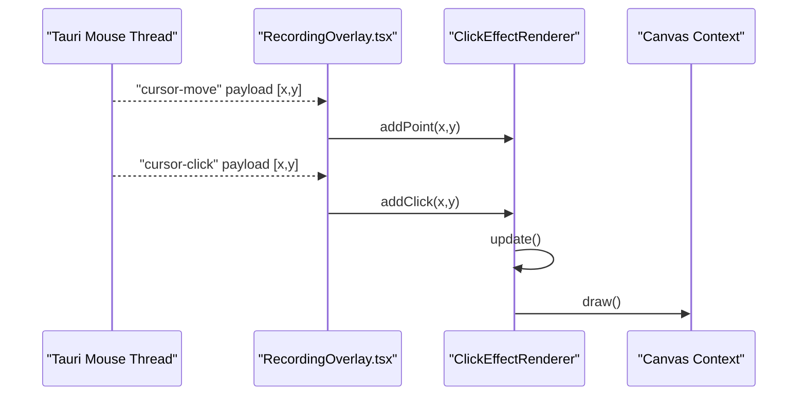

**Diagram sources**
- [RecordingOverlay.tsx:56-87](file://src/components/RecordingOverlay.tsx#L56-L87)
- [effects.ts:427-491](file://src/lib/effects.ts#L427-L491)

## Detailed Component Analysis

### ClickEffectRenderer Class
The ClickEffectRenderer encapsulates click event management and rendering for five visual styles. It maintains:
- A list of active click events with position, age, and color.
- A pool of confetti particles with physics properties.
- Methods to add clicks, simulate automatically, update state, and draw visuals.

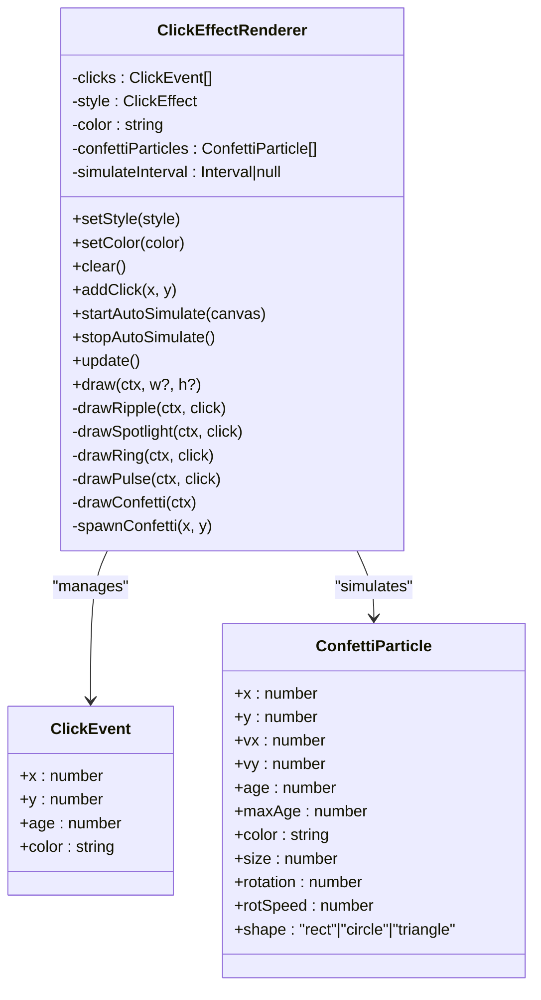

**Diagram sources**
- [effects.ts:416-677](file://src/lib/effects.ts#L416-L677)

**Section sources**
- [effects.ts:416-677](file://src/lib/effects.ts#L416-L677)

### Click Event Management and Temporal Progression
- Events are stored with an age counter and filtered after a fixed lifetime.
- Rendering uses normalized progress derived from age to drive easing curves and opacity.
- Automatic simulation periodically injects clicks for preview canvases.

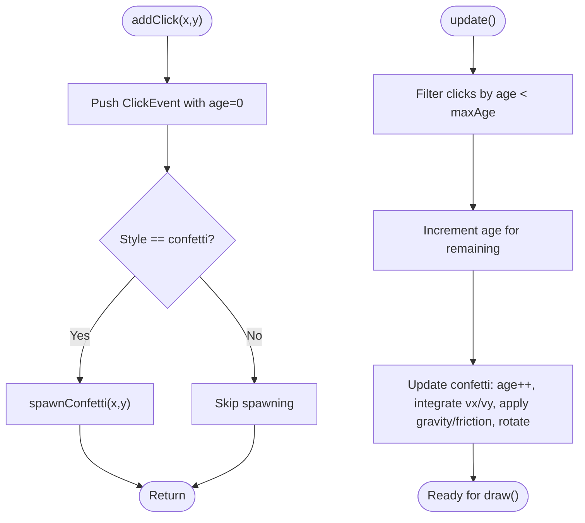

**Diagram sources**
- [effects.ts:437-491](file://src/lib/effects.ts#L437-L491)
- [effects.ts:459-478](file://src/lib/effects.ts#L459-L478)

**Section sources**
- [effects.ts:437-491](file://src/lib/effects.ts#L437-L491)

### Physics-Based Particle System (Confetti)
Confetti particles are simulated with:
- Gravity: downward acceleration applied each frame.
- Friction: horizontal velocity decay per frame.
- Rotation: per-particle rotation and rotational speed.
- Shape variations: rectangles, circles, and triangles drawn with transforms.

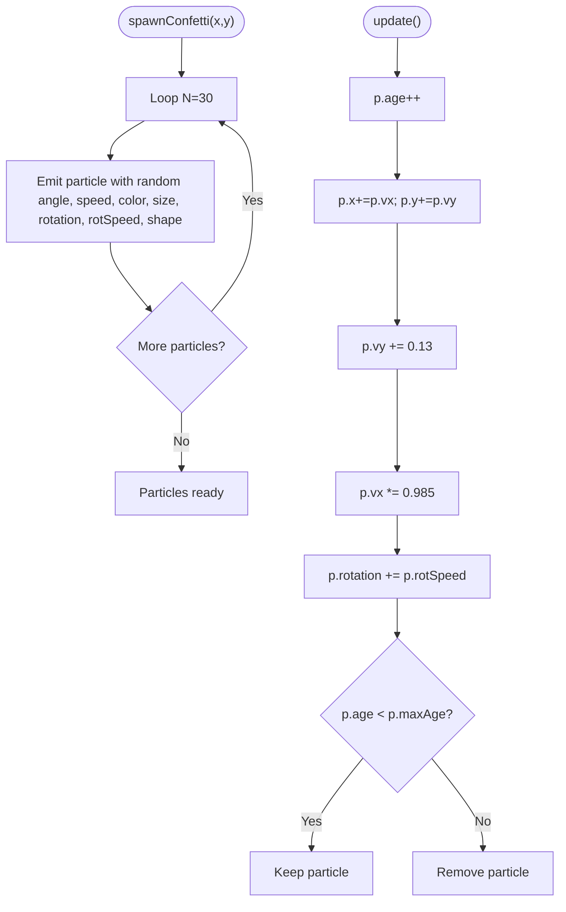

**Diagram sources**
- [effects.ts:459-478](file://src/lib/effects.ts#L459-L478)
- [effects.ts:480-491](file://src/lib/effects.ts#L480-L491)

**Section sources**
- [effects.ts:459-478](file://src/lib/effects.ts#L459-L478)
- [effects.ts:480-491](file://src/lib/effects.ts#L480-L491)

### Effect Implementations

#### Ripple
- Three concentric expanding rings with staggered timing and easing.
- Central flash with radial gradient fades quickly at early stages.
- Uses easeInOutQuad for smooth ring growth and fade.

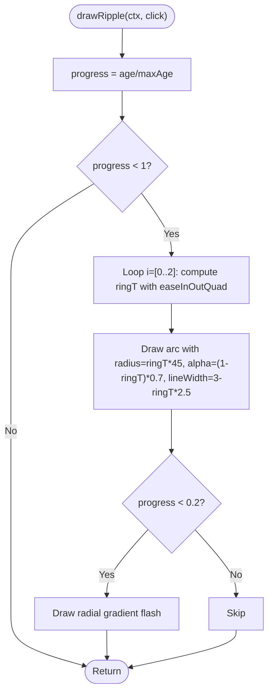

**Diagram sources**
- [effects.ts:511-544](file://src/lib/effects.ts#L511-L544)

**Section sources**
- [effects.ts:511-544](file://src/lib/effects.ts#L511-L544)

#### Spotlight
- Radial gradient expanding outward with controlled alpha falloff.
- Six cross rays appear briefly with increasing length and decreasing alpha.
- Uses easeOutCubic for smooth expansion.

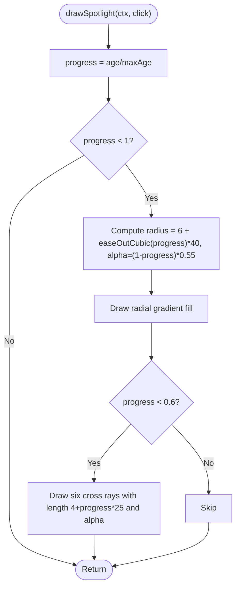

**Diagram sources**
- [effects.ts:546-579](file://src/lib/effects.ts#L546-L579)

**Section sources**
- [effects.ts:546-579](file://src/lib/effects.ts#L546-L579)

#### Ring
- Expanding outer ring with decreasing width.
- Inner contracting ring during early phase.
- Small central dot with white core.

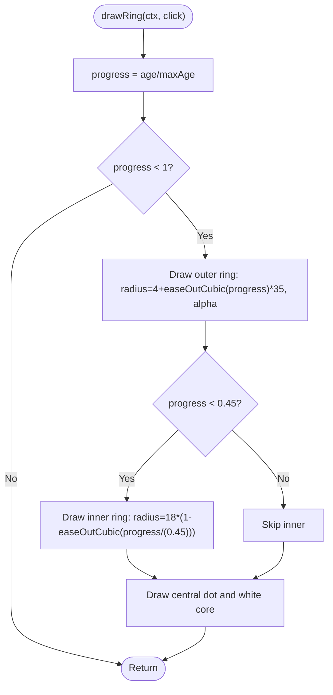

**Diagram sources**
- [effects.ts:581-618](file://src/lib/effects.ts#L581-L618)

**Section sources**
- [effects.ts:581-618](file://src/lib/effects.ts#L581-L618)

#### Pulse
- Five concentric rings pulsing with phase offsets.
- Breathing center glow using sinusoidal modulation.

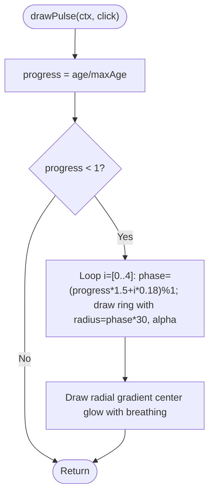

**Diagram sources**
- [effects.ts:620-647](file://src/lib/effects.ts#L620-L647)

**Section sources**
- [effects.ts:620-647](file://src/lib/effects.ts#L620-L647)

#### Confetti
- Draws each particle with translation and rotation.
- Supports three shapes: rect, circle, triangle.
- Global alpha scaled by particle life.

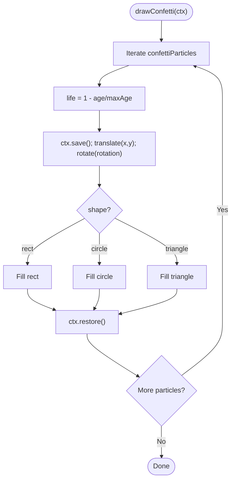

**Diagram sources**
- [effects.ts:649-676](file://src/lib/effects.ts#L649-L676)

**Section sources**
- [effects.ts:649-676](file://src/lib/effects.ts#L649-L676)

### Integration Patterns

#### Preview Canvas Integration (Customization and Settings)
- Live preview canvases capture mousemove and click events to drive trails and click effects.
- Auto-simulation periodically triggers clicks for “none” effect previews.

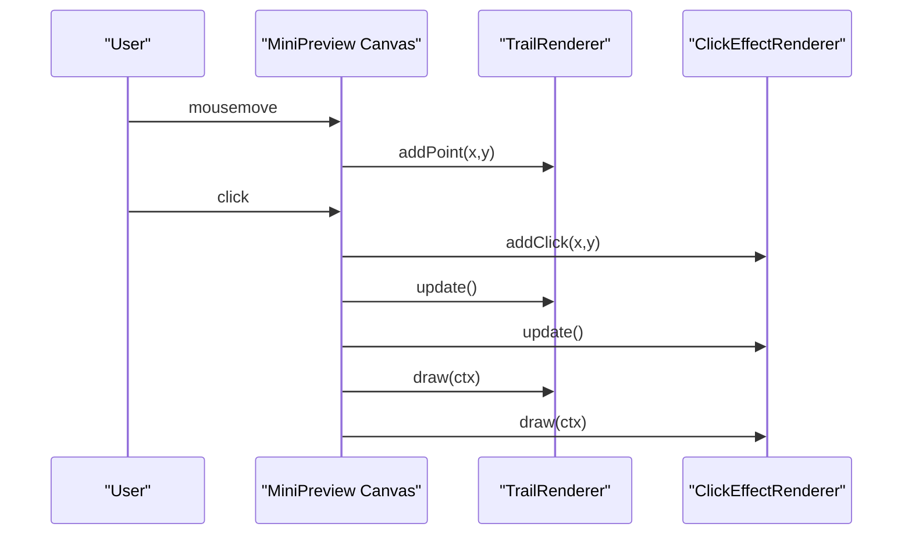

**Diagram sources**
- [Customization.tsx:114-131](file://src/components/Customization.tsx#L114-L131)
- [Customization.tsx:66-73](file://src/components/Customization.tsx#L66-L73)
- [Settings.tsx:1057-1072](file://src/components/Settings.tsx#L1057-L1072)

**Section sources**
- [Customization.tsx:114-131](file://src/components/Customization.tsx#L114-L131)
- [Customization.tsx:66-73](file://src/components/Customization.tsx#L66-L73)
- [Settings.tsx:1057-1072](file://src/components/Settings.tsx#L1057-L1072)

#### Recording Overlay Integration
- Receives precise cursor-move and cursor-click events from the backend.
- Uses requestAnimationFrame to continuously clear, update, and draw.

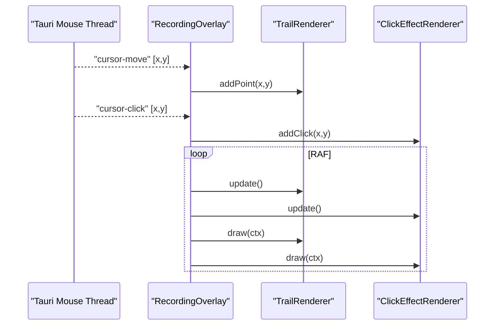

**Diagram sources**
- [RecordingOverlay.tsx:56-113](file://src/components/RecordingOverlay.tsx#L56-L113)
- [effects.ts:427-491](file://src/lib/effects.ts#L427-L491)

**Section sources**
- [RecordingOverlay.tsx:56-113](file://src/components/RecordingOverlay.tsx#L56-L113)

## Dependency Analysis
The click effects system depends on:
- Shared effects library for rendering primitives and physics.
- UI components for event capture and preview.
- Recording overlay for real-time drawing during recording sessions.

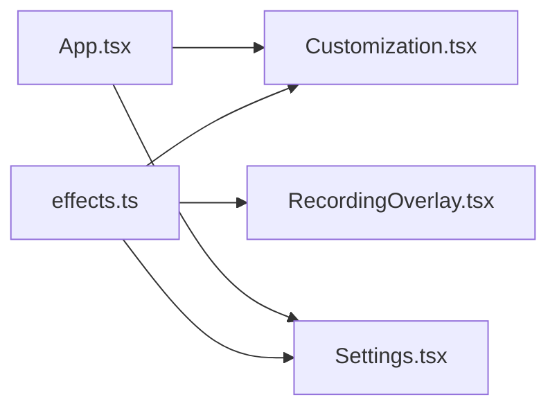

**Diagram sources**
- [effects.ts:416-677](file://src/lib/effects.ts#L416-L677)
- [Customization.tsx:45-148](file://src/components/Customization.tsx#L45-L148)
- [Settings.tsx:1030-1072](file://src/components/Settings.tsx#L1030-L1072)
- [RecordingOverlay.tsx:18-136](file://src/components/RecordingOverlay.tsx#L18-L136)
- [App.tsx:17-189](file://src/App.tsx#L17-L189)

**Section sources**
- [effects.ts:416-677](file://src/lib/effects.ts#L416-L677)
- [RecordingOverlay.tsx:18-136](file://src/components/RecordingOverlay.tsx#L18-L136)
- [Customization.tsx:45-148](file://src/components/Customization.tsx#L45-L148)
- [Settings.tsx:1030-1072](file://src/components/Settings.tsx#L1030-L1072)
- [App.tsx:17-189](file://src/App.tsx#L17-L189)

## Performance Considerations
- Event filtering: Both click events and confetti particles are filtered by age thresholds to limit active objects.
- Physics cost: Confetti update applies gravity and friction per particle; keep particle counts reasonable for target framerates.
- Rendering cost: Each effect draws a small number of primitives; avoid excessive effect churn by batching updates.
- Auto-simulation: Preview auto-simulation interval should be tuned to avoid unnecessary updates when not visible.
- Canvas sizing: Overlay canvas resizes with window; minimize redundant resize handlers.

[No sources needed since this section provides general guidance]

## Troubleshooting Guide
- No click effects appear:
  - Verify style is not set to none and color is configured.
  - Ensure addClick is invoked (DOM click handler or auto-simulation).
- Confetti does not render:
  - Confirm style is confetti and spawnConfetti is called on addClick.
  - Check particle age thresholds and maxAge values.
- Jitter or latency during recording:
  - Backend uses Tauri events; ensure overlay window is click-through and ignores pointer events.
  - Validate RAF loop and avoid blocking operations in animation frames.
- Preview not updating:
  - Ensure MiniPreview canvas is mounted and animation loop is running.
  - Confirm mousemove and click handlers convert client coordinates to canvas units.

**Section sources**
- [effects.ts:437-491](file://src/lib/effects.ts#L437-L491)
- [effects.ts:459-478](file://src/lib/effects.ts#L459-L478)
- [RecordingOverlay.tsx:115-119](file://src/components/RecordingOverlay.tsx#L115-L119)
- [Customization.tsx:114-131](file://src/components/Customization.tsx#L114-L131)

## Conclusion
EasySpecy’s click animation system cleanly separates event ingestion, state management, and rendering. The ClickEffectRenderer provides a robust foundation for five visually distinct effects, with a physics-driven confetti subsystem suitable for dynamic particle explosions. Integration via DOM events in previews and Tauri events in the recording overlay ensures responsive and accurate feedback across contexts.