# Cursor Trail Effects

<cite>
**Referenced Files in This Document**
- [effects.ts](file://src/lib/effects.ts)
- [overlay.html](file://public/overlay.html)
- [Customization.tsx](file://src/components/Customization.tsx)
- [mod.rs](file://src-tauri/src/postprocess/mod.rs)
</cite>

## Table of Contents
1. [Introduction](#introduction)
2. [Project Structure](#project-structure)
3. [Core Components](#core-components)
4. [Architecture Overview](#architecture-overview)
5. [Detailed Component Analysis](#detailed-component-analysis)
6. [Dependency Analysis](#dependency-analysis)
7. [Performance Considerations](#performance-considerations)
8. [Troubleshooting Guide](#troubleshooting-guide)
9. [Conclusion](#conclusion)
10. [Appendices](#appendices)

## Introduction
This document explains EasySpecy's cursor trail effect system, detailing six trail styles: glow, particles, ribbon, dots, aurora, and none. It covers the TrailRenderer class implementation, including point tracking, velocity calculations, and smooth spline interpolation. It also documents the physics-based animation system with aging points, velocity decay, and visual layering techniques. For each effect style, we describe the rendering approach and visual characteristics. Finally, we outline configuration options, performance considerations, and examples for creating custom trails.

## Project Structure
The cursor trail system spans three layers:
- Frontend overlay renderer: JavaScript canvas-based TrailRenderer for real-time preview and rendering.
- Rust post-processing pipeline: GPU-accelerated frame composition with smooth spline interpolation and style-specific drawing.
- UI customization: React component exposing trail styles and colors.

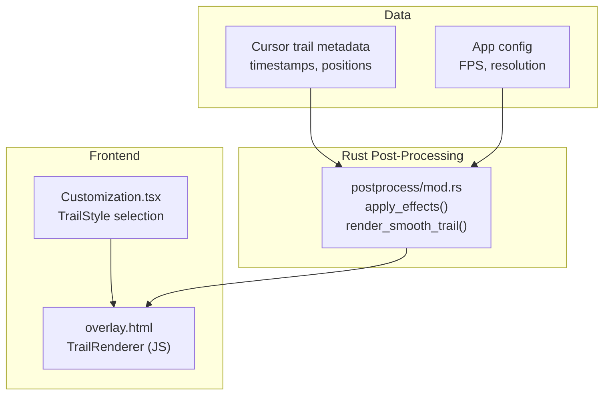

**Diagram sources**
- [overlay.html:117-216](file://public/overlay.html#L117-L216)
- [Customization.tsx:25-32](file://src/components/Customization.tsx#L25-L32)
- [mod.rs:215-275](file://src-tauri/src/postprocess/mod.rs#L215-L275)
- [mod.rs:780-845](file://src-tauri/src/postprocess/mod.rs#L780-L845)

**Section sources**
- [overlay.html:117-216](file://public/overlay.html#L117-L216)
- [Customization.tsx:25-32](file://src/components/Customization.tsx#L25-L32)
- [mod.rs:215-275](file://src-tauri/src/postprocess/mod.rs#L215-L275)

## Core Components
- TrailRenderer (TypeScript): Manages a sliding window of points, computes velocity, ages points, applies decay, and renders the selected style.
- TrailRenderer (JavaScript): Similar responsibilities in the overlay HTML for live preview.
- Style registry: Defines supported trail styles and descriptions.
- Post-processing pipeline: Builds a smooth Catmull-Rom spline from raw samples, interpolates points per frame, and draws styles into the frame buffer.

Key responsibilities:
- Point lifecycle: add, update, age, filter.
- Velocity tracking: instantaneous speed from spatial deltas.
- Style dispatch: route to appropriate drawing routine.
- Smooth interpolation: Catmull-Rom sampling for jitter-free curves.

**Section sources**
- [effects.ts:84-141](file://src/lib/effects.ts#L84-L141)
- [overlay.html:117-216](file://public/overlay.html#L117-L216)
- [Customization.tsx:25-32](file://src/components/Customization.tsx#L25-L32)
- [mod.rs:780-845](file://src-tauri/src/postprocess/mod.rs#L780-L845)

## Architecture Overview
End-to-end flow:
- Capture cursor samples with timestamps.
- Pre-smooth the entire path to avoid per-frame jitter.
- For each video frame, sample the smooth path at fixed intervals.
- Apply style-specific drawing routines to the frame buffer.
- Composite overlays and pipe to FFmpeg.

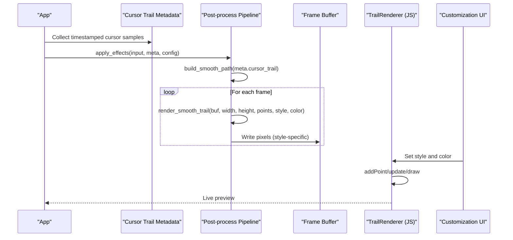

**Diagram sources**
- [mod.rs:215-275](file://src-tauri/src/postprocess/mod.rs#L215-L275)
- [mod.rs:780-845](file://src-tauri/src/postprocess/mod.rs#L780-L845)
- [overlay.html:117-216](file://public/overlay.html#L117-L216)
- [Customization.tsx:25-32](file://src/components/Customization.tsx#L25-L32)

## Detailed Component Analysis

### TrailRenderer (TypeScript)
Implements physics-based animation and style dispatch:
- Point storage: sliding window capped by maxPoints.
- Velocity: derived from delta distance; smoothed by exponential decay.
- Aging: points accumulate age and are filtered after a threshold.
- Style routing: drawGlow, drawParticles, drawRibbon, drawDots, drawAurora.

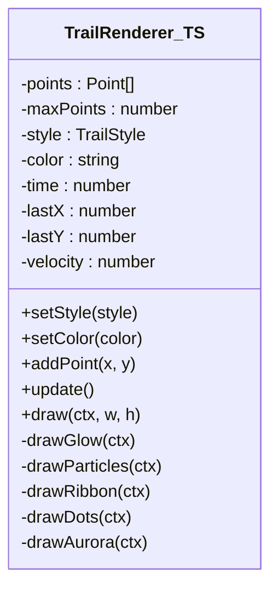

**Diagram sources**
- [effects.ts:84-141](file://src/lib/effects.ts#L84-L141)

**Section sources**
- [effects.ts:84-141](file://src/lib/effects.ts#L84-L141)

### TrailRenderer (JavaScript) in Overlay
Live preview renderer with identical logic:
- Maintains rawPoints and interpolated points.
- Uses Catmull-Rom smoothing for curves.
- Applies style-specific drawing with canvas filters and gradients.

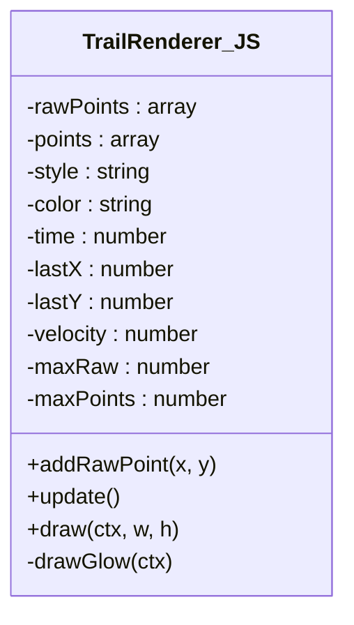

**Diagram sources**
- [overlay.html:117-216](file://public/overlay.html#L117-L216)

**Section sources**
- [overlay.html:117-216](file://public/overlay.html#L117-L216)

### Smooth Spline Interpolation (Rust)
Pre-computes a smooth Catmull-Rom path from raw samples:
- Builds a smooth curve from all input points.
- Samples uniformly along the curve with step sizing based on local curvature.
- Produces (x, y, normalized_age, speed) tuples for per-frame rendering.

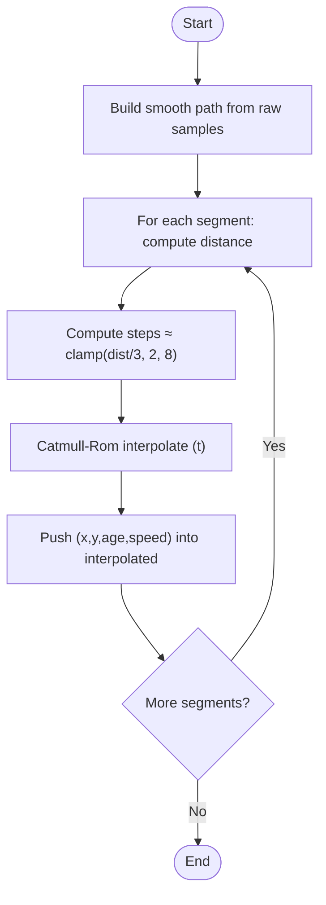

**Diagram sources**
- [mod.rs:794-817](file://src-tauri/src/postprocess/mod.rs#L794-L817)

**Section sources**
- [mod.rs:794-817](file://src-tauri/src/postprocess/mod.rs#L794-L817)

### Rendering Styles

#### Glow
- Multi-layer visual hierarchy: outer diffuse → mid → core → white center.
- Velocity-dependent width scaling and motion-blur alpha adjustments.
- Radial head glow with pulsing animation and lifetime fade.

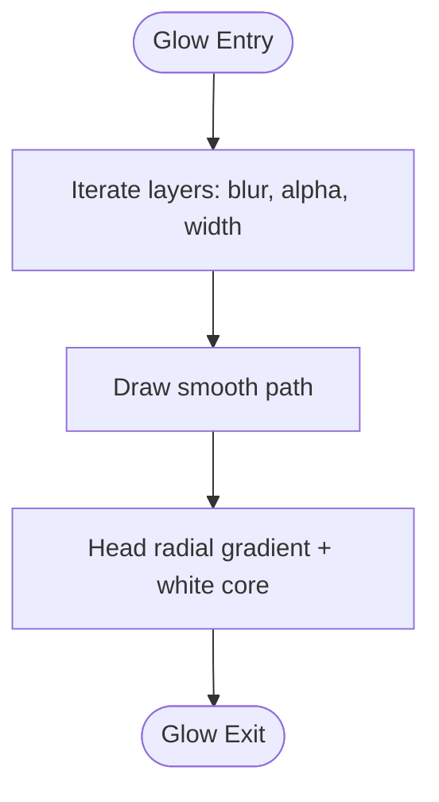

**Diagram sources**
- [effects.ts:143-179](file://src/lib/effects.ts#L143-L179)
- [mod.rs:820-845](file://src-tauri/src/postprocess/mod.rs#L820-L845)

**Section sources**
- [effects.ts:143-179](file://src/lib/effects.ts#L143-L179)
- [mod.rs:820-845](file://src-tauri/src/postprocess/mod.rs#L820-L845)

#### Particles
- Embers/fireflies orbiting the cursor with per-point velocity and decay.
- Color blending from primary to secondary along the trail.
- Motion-blur-like effect via speed-dependent glow scaling.

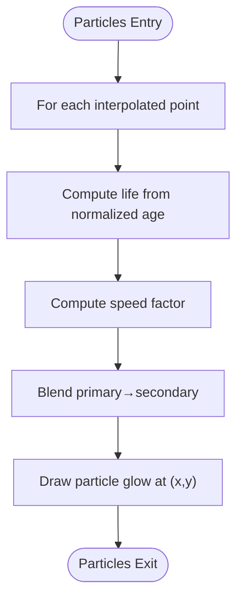

**Diagram sources**
- [mod.rs:820-845](file://src-tauri/src/postprocess/mod.rs#L820-L845)

**Section sources**
- [mod.rs:820-845](file://src-tauri/src/postprocess/mod.rs#L820-L845)

#### Ribbon
- Multi-layered flowing band with shimmer.
- Style-specific color blending and layered widths.
- Velocity-responsive width modulation.

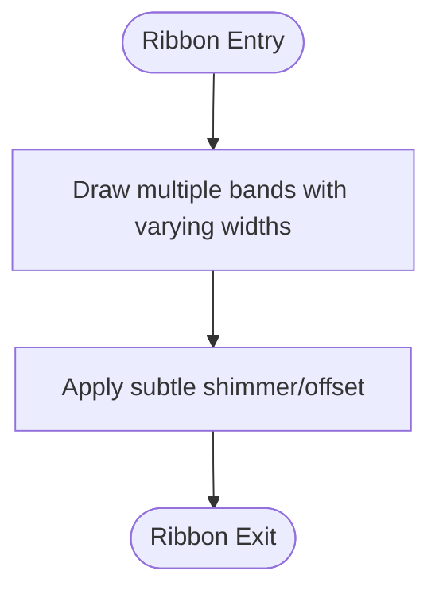

**Diagram sources**
- [mod.rs:820-845](file://src-tauri/src/postprocess/mod.rs#L820-L845)

**Section sources**
- [mod.rs:820-845](file://src-tauri/src/postprocess/mod.rs#L820-L845)

#### Dots
- Connected halos linked by lines with white-hot cores.
- Head and tail points emphasized with radial glows.

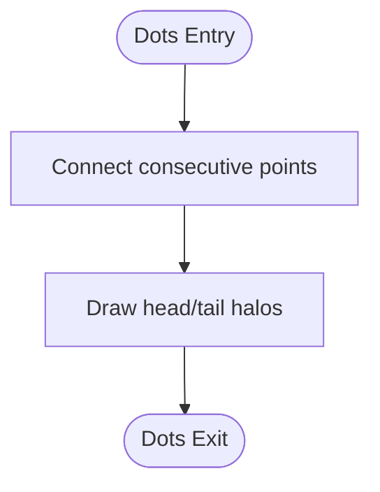

**Diagram sources**
- [mod.rs:820-845](file://src-tauri/src/postprocess/mod.rs#L820-L845)

**Section sources**
- [mod.rs:820-845](file://src-tauri/src/postprocess/mod.rs#L820-L845)

#### Aurora
- Rainbow wave with flowing light layers.
- Color palette blends along the trail with animated offsets.

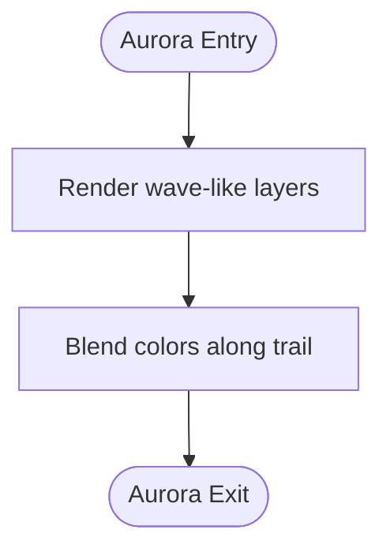

**Diagram sources**
- [mod.rs:820-845](file://src-tauri/src/postprocess/mod.rs#L820-L845)

**Section sources**
- [mod.rs:820-845](file://src-tauri/src/postprocess/mod.rs#L820-L845)

#### None
- Disables trail rendering.

**Section sources**
- [effects.ts:131-141](file://src/lib/effects.ts#L131-L141)
- [overlay.html:117-216](file://public/overlay.html#L117-L216)

### Physics-Based Animation System
- Aging: points increment age each frame and are removed after a threshold.
- Velocity decay: exponential damping reduces velocity over time.
- Position drift: small velocity offsets applied to points during update.
- Filtering: points are deduplicated below a minimum distance threshold.

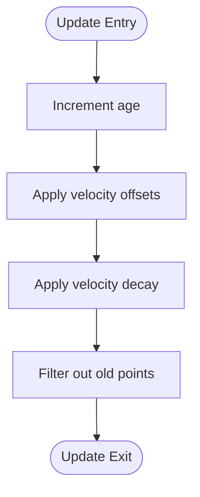

**Diagram sources**
- [effects.ts:118-129](file://src/lib/effects.ts#L118-L129)

**Section sources**
- [effects.ts:118-129](file://src/lib/effects.ts#L118-L129)

## Dependency Analysis
- UI depends on TrailRenderer to preview selections.
- Rust post-processing depends on configuration (FPS/resolution) and cursor metadata.
- Rendering styles depend on pre-smoothed paths and per-frame sampled points.

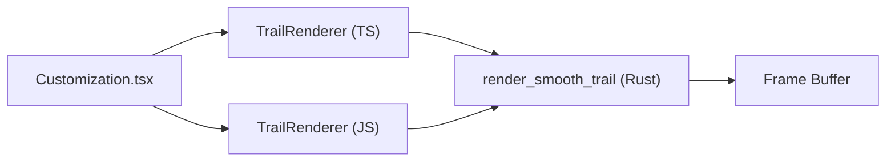

**Diagram sources**
- [Customization.tsx:25-32](file://src/components/Customization.tsx#L25-L32)
- [effects.ts:84-141](file://src/lib/effects.ts#L84-L141)
- [overlay.html:117-216](file://public/overlay.html#L117-L216)
- [mod.rs:780-845](file://src-tauri/src/postprocess/mod.rs#L780-L845)

**Section sources**
- [Customization.tsx:25-32](file://src/components/Customization.tsx#L25-L32)
- [effects.ts:84-141](file://src/lib/effects.ts#L84-L141)
- [overlay.html:117-216](file://public/overlay.html#L117-L216)
- [mod.rs:780-845](file://src-tauri/src/postprocess/mod.rs#L780-L845)

## Performance Considerations
- Pre-smoothing: Building a single smooth path avoids per-frame interpolation jitter and reduces CPU work.
- Sampling density: Step count per segment is bounded by distance, preventing excessive points.
- Layered rendering: Style-specific loops and filters should minimize redundant operations.
- Velocity scaling: Using velocity to adjust width and alpha reduces unnecessary overdraw.
- Frame buffer writes: Efficient pixel blending and early exits for short trails reduce GPU load.
- UI preview: Limiting maxPoints and deduplicating raw points keeps the JS renderer responsive.

[No sources needed since this section provides general guidance]

## Troubleshooting Guide
- Trail not visible:
  - Verify style is not set to "none".
  - Confirm color is valid and not fully transparent.
- Jittery or broken curves:
  - Ensure pre-smoothing is enabled and raw samples are being fed.
- Performance drops:
  - Reduce maxPoints or simplify style complexity.
  - Lower FPS or resolution in configuration.
- Incorrect colors:
  - Check primary and secondary color blending logic for the selected style.

**Section sources**
- [effects.ts:131-141](file://src/lib/effects.ts#L131-L141)
- [mod.rs:780-845](file://src-tauri/src/postprocess/mod.rs#L780-L845)

## Conclusion
EasySpecy’s cursor trail system combines a robust Rust post-processing pipeline with a flexible TypeScript/JavaScript renderer. The smooth spline interpolation ensures consistent, jitter-free curves, while physics-based animation adds natural motion. Six distinct styles offer varied aesthetics, each optimized for performance and visual impact. The modular design allows easy extension with new effects and fine-grained configuration.

[No sources needed since this section summarizes without analyzing specific files]

## Appendices

### Configuration Options
- Trail style: Select from glow, particles, ribbon, dots, aurora, none.
- Trail color: Primary color for the trail.
- Secondary color: Used for gradient blending in multi-layer styles.
- Width multiplier: Scales trail thickness globally.
- FPS and resolution: Drive frame timing and buffer sizing.

**Section sources**
- [Customization.tsx:25-32](file://src/components/Customization.tsx#L25-L32)
- [mod.rs:223-250](file://src-tauri/src/postprocess/mod.rs#L223-L250)

### Creating a Custom Trail Effect
Steps:
- Define a new style identifier and description.
- Implement a drawing routine that consumes interpolated points.
- Integrate style selection into the UI.
- Wire style dispatch in both TypeScript and JavaScript renderers.
- Add style-specific parameters (e.g., layer counts, color blending).

**Section sources**
- [effects.ts:94-141](file://src/lib/effects.ts#L94-L141)
- [overlay.html:117-216](file://public/overlay.html#L117-L216)
- [Customization.tsx:25-32](file://src/components/Customization.tsx#L25-L32)