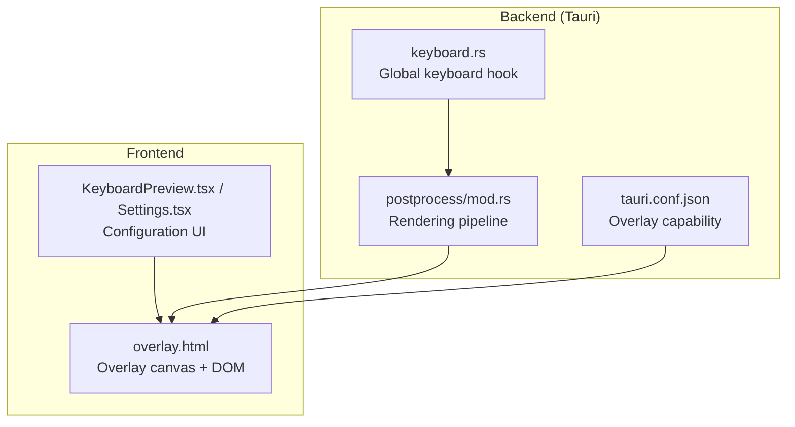
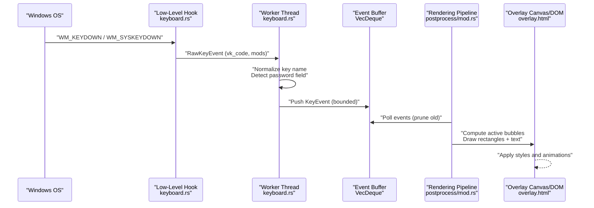
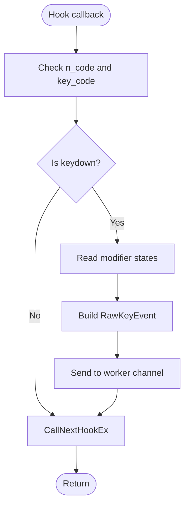
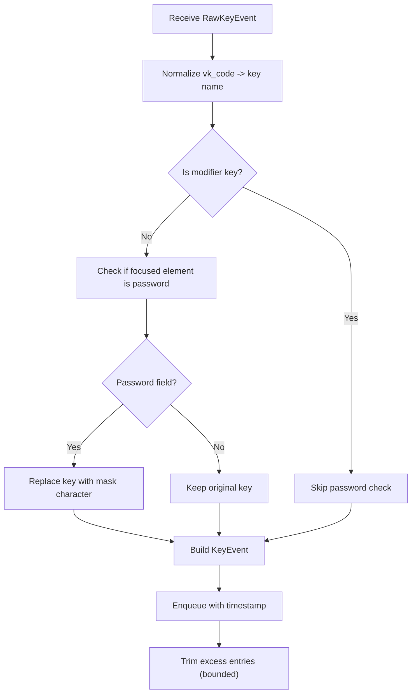
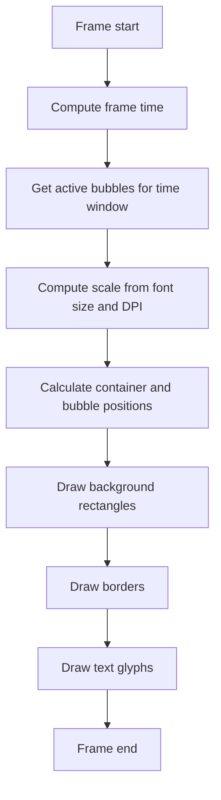
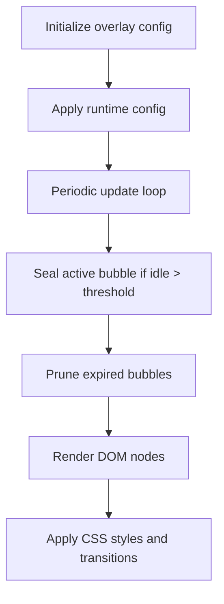
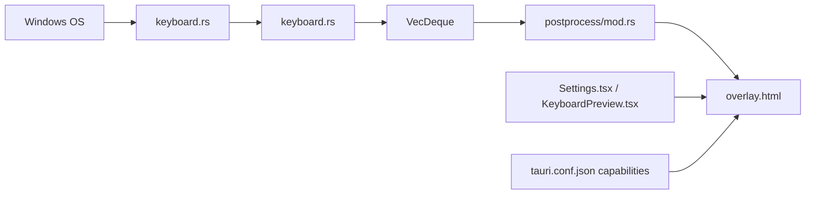

# Keyboard Overlay Visualization

<cite>
**Referenced Files in This Document**
- [keyboard.rs](file://src-tauri/src/keyboard.rs)
- [mod.rs](file://src-tauri/src/postprocess/mod.rs)
- [overlay.html](file://public/overlay.html)
- [KeyboardPreview.tsx](file://src/components/KeyboardPreview.tsx)
- [Settings.tsx](file://src/components/Settings.tsx)
- [index.html](file://index.html)
- [tauri.conf.json](file://src-tauri/tauri.conf.json)
- [Cargo.toml](file://src-tauri/Cargo.toml)
</cite>

## Table of Contents
1. [Introduction](#introduction)
2. [Project Structure](#project-structure)
3. [Core Components](#core-components)
4. [Architecture Overview](#architecture-overview)
5. [Detailed Component Analysis](#detailed-component-analysis)
6. [Dependency Analysis](#dependency-analysis)
7. [Performance Considerations](#performance-considerations)
8. [Troubleshooting Guide](#troubleshooting-guide)
9. [Conclusion](#conclusion)

## Introduction
This document explains EasySpecy's keyboard overlay visualization system. It covers how keyboard events are captured globally, processed, and rendered as animated on-screen feedback synchronized with video recording. The system includes:
- Global key event capture via a Windows low-level keyboard hook
- Virtual key code to human-readable key name mapping
- Password field detection to protect sensitive input
- Real-time visual overlay rendering with configurable styling
- Integration with the recording pipeline for synchronized visual feedback

## Project Structure
The keyboard overlay spans three layers:
- Backend capture and processing (Rust/Tauri)
- Rendering pipeline (Rust/Tauri)
- Frontend overlay (HTML/CSS/JS)

**Diagram sources**
- [keyboard.rs:159-282](file://src-tauri/src/keyboard.rs#L159-L282)
- [mod.rs:471-490](file://src-tauri/src/postprocess/mod.rs#L471-L490)
- [overlay.html:1-50](file://public/overlay.html#L1-L50)
- [Settings.tsx:664-690](file://src/components/Settings.tsx#L664-L690)
- [tauri.conf.json](file://src-tauri/tauri.conf.json)

**Section sources**
- [keyboard.rs:159-282](file://src-tauri/src/keyboard.rs#L159-L282)
- [mod.rs:471-490](file://src-tauri/src/postprocess/mod.rs#L471-L490)
- [overlay.html:1-50](file://public/overlay.html#L1-L50)
- [Settings.tsx:664-690](file://src/components/Settings.tsx#L664-L690)
- [tauri.conf.json](file://src-tauri/tauri.conf.json)

## Core Components
- Windows keyboard hook: Captures low-level keydown events, queries modifier states, and forwards normalized key names to the rendering pipeline.
- Worker thread: Processes events asynchronously, detects password fields, and maintains bounded event buffers.
- Rendering pipeline: Converts buffered key events into animated on-screen bubbles aligned with the recorded video timeline.
- Overlay frontend: Manages overlay positioning, styling, and DOM updates based on configuration and live events.

Key responsibilities:
- Event capture and normalization
- Password-aware key masking
- Bounded buffering and pruning
- Synchronized rendering with recording frames
- Configurable visual styling and layout

**Section sources**
- [keyboard.rs:159-282](file://src-tauri/src/keyboard.rs#L159-L282)
- [keyboard.rs:284-363](file://src-tauri/src/keyboard.rs#L284-L363)
- [mod.rs:471-490](file://src-tauri/src/postprocess/mod.rs#L471-L490)
- [overlay.html:353-370](file://public/overlay.html#L353-L370)

## Architecture Overview
The system integrates a global keyboard hook with a rendering pipeline and an HTML overlay. Events flow from the OS to Rust, then to the rendering stage, and finally to the overlay canvas and DOM.

**Diagram sources**
- [keyboard.rs:193-235](file://src-tauri/src/keyboard.rs#L193-L235)
- [keyboard.rs:284-363](file://src-tauri/src/keyboard.rs#L284-L363)
- [mod.rs:471-490](file://src-tauri/src/postprocess/mod.rs#L471-L490)
- [overlay.html:766-782](file://public/overlay.html#L766-L782)

## Detailed Component Analysis

### Keyboard Hook Implementation (Windows)
- Low-level hook installation: Uses a Windows low-level keyboard hook to intercept keydown events across all foreground and background windows.
- Event filtering: Only captures keydown events; ignores keyup to reduce noise.
- Modifier detection: Queries current modifier states (Shift, Ctrl, Alt, Win) synchronously but cheaply.
- Asynchronous processing: Sends raw events to a worker thread via a channel to keep the hook responsive.
- COM initialization: Initializes COM once per worker to detect password fields using UI Automation.

**Diagram sources**
- [keyboard.rs:193-235](file://src-tauri/src/keyboard.rs#L193-L235)

**Section sources**
- [keyboard.rs:159-282](file://src-tauri/src/keyboard.rs#L159-L282)
- [keyboard.rs:284-363](file://src-tauri/src/keyboard.rs#L284-L363)

### Worker Thread and Event Normalization
- Password detection: Uses UI Automation to check if the currently focused element is a password field; masks keys accordingly.
- Key normalization: Converts virtual key codes to human-readable names.
- Bounded buffer: Maintains a fixed-capacity queue to prevent unbounded memory growth.
- Timestamping: Uses monotonic timestamps relative to capture start for synchronization.

**Diagram sources**
- [keyboard.rs:312-363](file://src-tauri/src/keyboard.rs#L312-L363)

**Section sources**
- [keyboard.rs:312-363](file://src-tauri/src/keyboard.rs#L312-L363)

### Rendering Pipeline Integration
- Active bubble computation: Determines which key bubbles should be visible at the current frame time.
- Scaling and layout: Computes bubble sizes and positions based on configured font size and monitor scale factor, accounting for optional capture region offsets.
- Drawing primitives: Renders background rectangles, borders, and text using a rasterizer with alpha blending.
- Opacity and color parsing: Applies configured colors and opacity to visual elements.

**Diagram sources**
- [mod.rs:471-490](file://src-tauri/src/postprocess/mod.rs#L471-L490)
- [mod.rs:1597-1694](file://src-tauri/src/postprocess/mod.rs#L1597-L1694)

**Section sources**
- [mod.rs:471-490](file://src-tauri/src/postprocess/mod.rs#L471-L490)
- [mod.rs:1597-1694](file://src-tauri/src/postprocess/mod.rs#L1597-L1694)

### Overlay Frontend and Styling
- Overlay container: A positioned, transparent container that displays key bubbles with backdrop blur and themed styling.
- Dynamic configuration: Applies font family, size, opacity, colors, and layout from runtime configuration.
- Bubble lifecycle: Manages active and persistent bubbles, sealing active text bubbles after inactivity and pruning timed-out bubbles.
- Individual key mapping: Supports custom emoji or symbol mappings for specific keys.

**Diagram sources**
- [overlay.html:353-370](file://public/overlay.html#L353-L370)
- [overlay.html:766-782](file://public/overlay.html#L766-L782)

**Section sources**
- [overlay.html:353-370](file://public/overlay.html#L353-L370)
- [overlay.html:745-782](file://public/overlay.html#L745-L782)
- [KeyboardPreview.tsx:753-770](file://src/components/KeyboardPreview.tsx#L753-L770)

### Configuration and UI
- Settings modal: Exposes keyboard overlay configuration including enable flag, fonts, colors, opacity, positioning, and key mappings.
- Live preview: Allows users to adjust overlay parameters and see immediate visual feedback.

**Section sources**
- [Settings.tsx:664-690](file://src/components/Settings.tsx#L664-L690)
- [KeyboardPreview.tsx:506-528](file://src/components/KeyboardPreview.tsx#L506-L528)

## Dependency Analysis
- Platform dependency: Windows low-level keyboard hook and UI Automation are used exclusively on Windows.
- External libraries: UI Automation via COM and a font rasterization library for text rendering.
- Capability boundary: Overlay rendering is gated by Tauri capabilities to ensure secure overlay behavior.

**Diagram sources**
- [keyboard.rs:159-282](file://src-tauri/src/keyboard.rs#L159-L282)
- [mod.rs:471-490](file://src-tauri/src/postprocess/mod.rs#L471-L490)
- [overlay.html:1-50](file://public/overlay.html#L1-L50)
- [tauri.conf.json](file://src-tauri/tauri.conf.json)

**Section sources**
- [keyboard.rs:159-282](file://src-tauri/src/keyboard.rs#L159-L282)
- [mod.rs:471-490](file://src-tauri/src/postprocess/mod.rs#L471-L490)
- [overlay.html:1-50](file://public/overlay.html#L1-L50)
- [tauri.conf.json](file://src-tauri/tauri.conf.json)

## Performance Considerations
- High-frequency event handling:
  - The hook runs in a dedicated thread and delegates heavy work to a worker thread to minimize latency.
  - Non-blocking channel sends ensure the hook remains responsive under load.
- Memory optimization:
  - Fixed-capacity event buffer caps memory usage; oldest events are trimmed when capacity is exceeded.
  - Monotonic timestamps are used to prune stale events efficiently.
- Rendering efficiency:
  - Bounding the number of concurrent bubbles reduces drawing overhead.
  - Rasterized text rendering avoids expensive font layout operations per frame.
- Throttling prevention:
  - Direct emission to the overlay window avoids Webview2 timer throttling, ensuring smooth visuals during recording.

[No sources needed since this section provides general guidance]

## Troubleshooting Guide
- Overlay does not capture keystrokes in some applications:
  - Some games or elevated applications restrict input capture due to Windows UIPI and use raw input APIs. The hook operates on the Win32 message loop and will not receive events from such applications.
- Password masking not applied:
  - Ensure UI Automation is available and the focused element is detected as a password field.
- Visual artifacts or incorrect sizing:
  - Verify monitor scale factor and configured font size; scaling affects bubble dimensions and layout.
- Configuration not taking effect:
  - Confirm overlay is enabled and settings are saved via the UI; runtime configuration is applied to the overlay DOM and rendering pipeline.

**Section sources**
- [research\keyboard-hook-game-capture_03_JUN_2026\index.html:43-48](file://research/keyboard-hook-game-capture_03_JUN_2026/index.html#L43-L48)
- [keyboard.rs:324-339](file://src-tauri/src/keyboard.rs#L324-L339)
- [overlay.html:353-370](file://public/overlay.html#L353-L370)
- [Settings.tsx:664-690](file://src/components/Settings.tsx#L664-L690)

## Conclusion
EasySpecy’s keyboard overlay combines a responsive Windows keyboard hook with a robust rendering pipeline and a flexible overlay frontend. It delivers accurate, synchronized visual feedback during recording with configurable styling and safeguards against privacy-sensitive input. While platform-specific limitations exist for certain applications, the system is optimized for performance and usability in typical desktop environments.