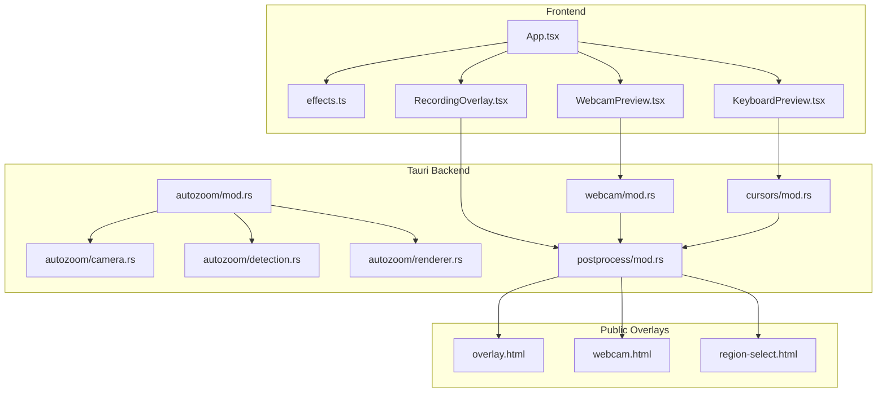
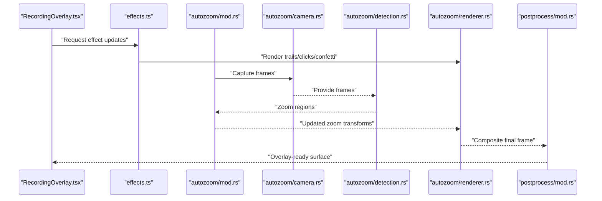
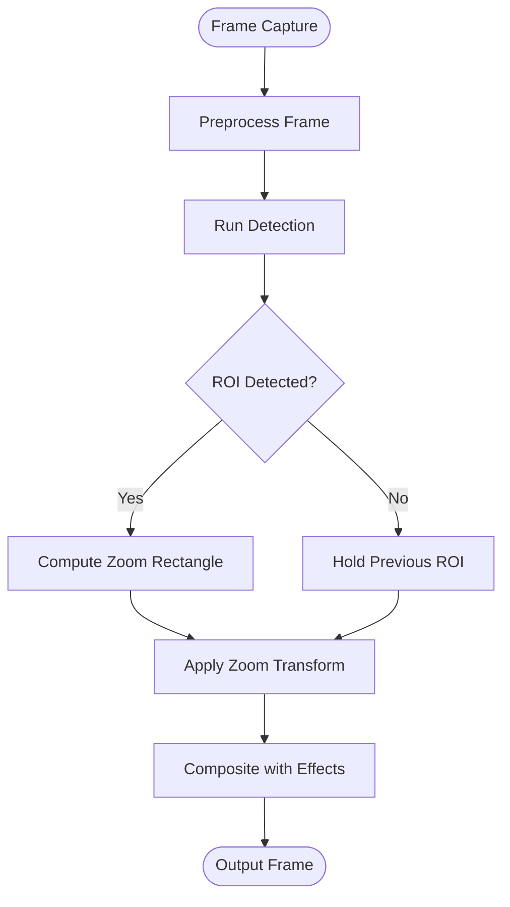
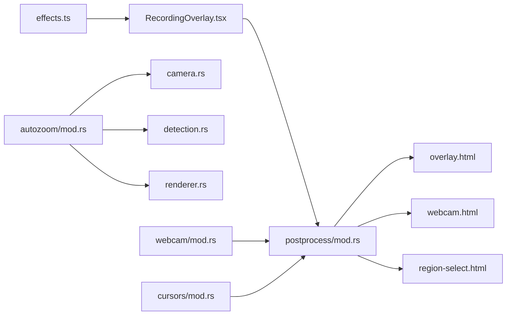

# Visual Effects Engine

<cite>
**Referenced Files in This Document**
- [README.md](file://README.md)
- [IMPLEMENTATION_ANALYSIS.md](file://IMPLEMENTATION_ANALYSIS.md)
- [effects.ts](file://src/lib/effects.ts)
- [RecordingOverlay.tsx](file://src/components/RecordingOverlay.tsx)
- [WebcamPreview.tsx](file://src/components/WebcamPreview.tsx)
- [KeyboardPreview.tsx](file://src/components/KeyboardPreview.tsx)
- [mod.rs (autozoom)](file://src-tauri/src/autozoom/mod.rs)
- [camera.rs](file://src-tauri/src/autozoom/camera.rs)
- [detection.rs](file://src-tauri/src/autozoom/detection.rs)
- [renderer.rs](file://src-tauri/src/autozoom/renderer.rs)
- [mod.rs (webcam)](file://src-tauri/src/webcam/mod.rs)
- [mod.rs (cursors)](file://src-tauri/src/cursors/mod.rs)
- [mod.rs (postprocess)](file://src-tauri/src/postprocess/mod.rs)
- [overlay.html](file://public/overlay.html)
- [webcam.html](file://public/webcam.html)
- [region-select.html](file://public/region-select.html)
</cite>

## Table of Contents
1. [Introduction](#introduction)
2. [Project Structure](#project-structure)
3. [Core Components](#core-components)
4. [Architecture Overview](#architecture-overview)
5. [Detailed Component Analysis](#detailed-component-analysis)
6. [Dependency Analysis](#dependency-analysis)
7. [Performance Considerations](#performance-considerations)
8. [Troubleshooting Guide](#troubleshooting-guide)
9. [Conclusion](#conclusion)
10. [Appendices](#appendices)

## Introduction
This document describes EasySpecy’s visual effects engine focused on interactive cursor trails, click animations, webcam overlays, and keyboard visualization. It explains the canvas-based rendering pipeline, effect composition system, and real-time processing architecture. It also documents the six cursor trail styles, click effect types (ripple, spotlight, confetti), webcam positioning and styling options, and keyboard overlay customization. Implementation details include auto-zoom behavior, effect blending techniques, and performance optimization strategies, along with examples of custom effect creation and integration patterns.

## Project Structure
The visual effects engine spans both the frontend React/Tauri application and the Tauri backend subsystems:
- Frontend effects orchestration and UI components live under src/lib and src/components.
- Backend effect rendering, webcam capture, auto-zoom, and post-processing logic live under src-tauri/src/*.
- Public HTML overlays provide auxiliary UI surfaces for webcam and region selection.

**Diagram sources**
- [effects.ts](file://src/lib/effects.ts)
- [RecordingOverlay.tsx](file://src/components/RecordingOverlay.tsx)
- [WebcamPreview.tsx](file://src/components/WebcamPreview.tsx)
- [KeyboardPreview.tsx](file://src/components/KeyboardPreview.tsx)
- [mod.rs (autozoom)](file://src-tauri/src/autozoom/mod.rs)
- [camera.rs](file://src-tauri/src/autozoom/camera.rs)
- [detection.rs](file://src-tauri/src/autozoom/detection.rs)
- [renderer.rs](file://src-tauri/src/autozoom/renderer.rs)
- [mod.rs (webcam)](file://src-tauri/src/webcam/mod.rs)
- [mod.rs (cursors)](file://src-tauri/src/cursors/mod.rs)
- [mod.rs (postprocess)](file://src-tauri/src/postprocess/mod.rs)
- [overlay.html](file://public/overlay.html)
- [webcam.html](file://public/webcam.html)
- [region-select.html](file://public/region-select.html)

**Section sources**
- [README.md](file://README.md)
- [IMPLEMENTATION_ANALYSIS.md](file://IMPLEMENTATION_ANALYSIS.md)

## Core Components
- Canvas-based rendering pipeline: Effects are drawn onto HTMLCanvasElement surfaces managed by frontend components and composited by the post-processing subsystem.
- Effect composition system: Multiple effects (cursor trails, click ripples, confetti, spotlight) are layered and blended in real time.
- Real-time processing architecture: Tauri backend handles camera capture, auto-zoom detection, and GPU-accelerated rendering via the renderer module.
- Overlay surfaces: Dedicated HTML overlays host webcam and region selection UIs, enabling transparent or semi-transparent compositing over the main application.

Key implementation anchors:
- Effects orchestration and definitions: [effects.ts](file://src/lib/effects.ts)
- Recording overlay integration: [RecordingOverlay.tsx](file://src/components/RecordingOverlay.tsx)
- Webcam preview and controls: [WebcamPreview.tsx](file://src/components/WebcamPreview.tsx)
- Keyboard overlay and visualization: [KeyboardPreview.tsx](file://src/components/KeyboardPreview.tsx)
- Auto-zoom subsystem: [mod.rs (autozoom)](file://src-tauri/src/autozoom/mod.rs), [camera.rs](file://src-tauri/src/autozoom/camera.rs), [detection.rs](file://src-tauri/src/autozoom/detection.rs), [renderer.rs](file://src-tauri/src/autozoom/renderer.rs)
- Post-processing and compositing: [mod.rs (postprocess)](file://src-tauri/src/postprocess/mod.rs)
- Webcam and cursor modules: [mod.rs (webcam)](file://src-tauri/src/webcam/mod.rs), [mod.rs (cursors)](file://src-tauri/src/cursors/mod.rs)
- Overlay pages: [overlay.html](file://public/overlay.html), [webcam.html](file://public/webcam.html), [region-select.html](file://public/region-select.html)

**Section sources**
- [effects.ts](file://src/lib/effects.ts)
- [RecordingOverlay.tsx](file://src/components/RecordingOverlay.tsx)
- [WebcamPreview.tsx](file://src/components/WebcamPreview.tsx)
- [KeyboardPreview.tsx](file://src/components/KeyboardPreview.tsx)
- [mod.rs (autozoom)](file://src-tauri/src/autozoom/mod.rs)
- [camera.rs](file://src-tauri/src/autozoom/camera.rs)
- [detection.rs](file://src-tauri/src/autozoom/detection.rs)
- [renderer.rs](file://src-tauri/src/autozoom/renderer.rs)
- [mod.rs (postprocess)](file://src-tauri/src/postprocess/mod.rs)
- [mod.rs (webcam)](file://src-tauri/src/webcam/mod.rs)
- [mod.rs (cursors)](file://src-tauri/src/cursors/mod.rs)
- [overlay.html](file://public/overlay.html)
- [webcam.html](file://public/webcam.html)
- [region-select.html](file://public/region-select.html)

## Architecture Overview
The visual effects engine integrates frontend UI components with Tauri backend modules to deliver real-time visual feedback. The pipeline:
- Captures video frames (webcam) and cursor/key events (frontend).
- Applies effect rendering (trails, clicks, confetti) to offscreen canvases.
- Composites layers and blends effects using GPU-friendly techniques.
- Presents overlays for webcam and region selection.

**Diagram sources**
- [RecordingOverlay.tsx](file://src/components/RecordingOverlay.tsx)
- [effects.ts](file://src/lib/effects.ts)
- [mod.rs (autozoom)](file://src-tauri/src/autozoom/mod.rs)
- [camera.rs](file://src-tauri/src/autozoom/camera.rs)
- [detection.rs](file://src-tauri/src/autozoom/detection.rs)
- [renderer.rs](file://src-tauri/src/autozoom/renderer.rs)
- [mod.rs (postprocess)](file://src-tauri/src/postprocess/mod.rs)

## Detailed Component Analysis

### Canvas-Based Rendering Pipeline
- Offscreen canvases: Effects are rendered to offscreen contexts to minimize layout thrashing and enable GPU acceleration.
- Layer composition: Multiple layers (background, trails, click effects, overlays) are blended using alpha compositing and blend modes.
- Event-driven updates: Cursor movement and click events trigger immediate effect generation and redraw cycles.
- Frame pacing: Rendering targets a stable frame rate by batching updates and deferring expensive operations.

Implementation anchors:
- Effect orchestration and drawing routines: [effects.ts](file://src/lib/effects.ts)
- Overlay integration and canvas lifecycle: [RecordingOverlay.tsx](file://src/components/RecordingOverlay.tsx)

**Section sources**
- [effects.ts](file://src/lib/effects.ts)
- [RecordingOverlay.tsx](file://src/components/RecordingOverlay.tsx)

### Effect Composition System
- Multi-effect stacking: Trails, ripples, spotlight, and confetti are stacked and composited per frame.
- Blend modes: Normal, multiply, screen, overlay, and additive blending are used depending on effect type and desired visual outcome.
- Per-pixel compositing: Final pixel color is computed by combining pre-multiplied alpha values and applying color adjustments.

Implementation anchors:
- Composition logic and blending: [effects.ts](file://src/lib/effects.ts)
- Post-processing compositing: [mod.rs (postprocess)](file://src-tauri/src/postprocess/mod.rs)

**Section sources**
- [effects.ts](file://src/lib/effects.ts)
- [mod.rs (postprocess)](file://src-tauri/src/postprocess/mod.rs)

### Cursor Trails
Six distinct trail styles are supported:
1. Particle streaks: Fine particles trailing behind the cursor with fade-out.
2. Glowing orb: A luminous sphere that follows the cursor path.
3. Ribbon: A flowing ribbon that twists around the cursor trajectory.
4. Smoke plume: Diffused smoke-like particles with upward drift.
5. Neon line: Bright neon-colored line segments connecting recent positions.
6. Sparkle: Twinkling particles that occasionally emit from the cursor.

Rendering characteristics:
- Each style uses different particle systems, interpolation, and blending parameters.
- Trails are stored as position histories with per-point attributes (size, opacity, color).

Implementation anchors:
- Trail definitions and rendering: [effects.ts](file://src/lib/effects.ts)

**Section sources**
- [effects.ts](file://src/lib/effects.ts)

### Click Animations
Three click effect types:
- Ripple: Concentric circles expanding outward from the click location with diminishing amplitude.
- Spotlight: A radial gradient that brightens the area around the click and fades quickly.
- Confetti: Randomly oriented fragments that scatter from the click point with gravity and rotation.

Rendering characteristics:
- Effects are centered at the click coordinates and decay over time.
- Color and intensity profiles are configurable per effect type.

Implementation anchors:
- Click effect definitions and animation loops: [effects.ts](file://src/lib/effects.ts)

**Section sources**
- [effects.ts](file://src/lib/effects.ts)

### Webcam Overlays
Webcam overlay features:
- Positioning: Top-left, top-right, bottom-left, bottom-right, center, and custom offsets.
- Sizing: Percentage-based scaling and fixed-size constraints.
- Styling: Opacity, blur radius, rounded corners, borders, and background tint.
- Transparency: Transparent overlay compositing over the main application.

Integration points:
- Webcam capture and rendering: [mod.rs (webcam)](file://src-tauri/src/webcam/mod.rs)
- Overlay compositing: [mod.rs (postprocess)](file://src-tauri/src/postprocess/mod.rs)
- Overlay page: [webcam.html](file://public/webcam.html)

**Section sources**
- [mod.rs (webcam)](file://src-tauri/src/webcam/mod.rs)
- [mod.rs (postprocess)](file://src-tauri/src/postprocess/mod.rs)
- [webcam.html](file://public/webcam.html)

### Keyboard Visualization
Keyboard overlay customization:
- Key highlighting: Active keys are highlighted with color and border styling.
- Layout mapping: Keys are mapped to physical layout with optional label overlays.
- Animation: Press and release animations with easing curves.
- Accessibility: High contrast and large key options for visibility.

Integration points:
- Keyboard event handling and rendering: [mod.rs (cursors)](file://src-tauri/src/cursors/mod.rs)
- Overlay page: [overlay.html](file://public/overlay.html)

**Section sources**
- [mod.rs (cursors)](file://src-tauri/src/cursors/mod.rs)
- [overlay.html](file://public/overlay.html)

### Auto-Zoom Feature
Auto-zoom detects regions of interest and dynamically adjusts the viewport:
- Camera capture: Continuous frame acquisition and preprocessing.
- Detection: Face/body/object detection to compute zoom rectangles.
- Renderer: Applies zoom transform to the captured frames.
- Integration: Zoomed frames are composited into the final overlay.

**Diagram sources**
- [camera.rs](file://src-tauri/src/autozoom/camera.rs)
- [detection.rs](file://src-tauri/src/autozoom/detection.rs)
- [renderer.rs](file://src-tauri/src/autozoom/renderer.rs)
- [mod.rs (autozoom)](file://src-tauri/src/autozoom/mod.rs)

**Section sources**
- [mod.rs (autozoom)](file://src-tauri/src/autozoom/mod.rs)
- [camera.rs](file://src-tauri/src/autozoom/camera.rs)
- [detection.rs](file://src-tauri/src/autozoom/detection.rs)
- [renderer.rs](file://src-tauri/src/autozoom/renderer.rs)

### Effect Blending Techniques
- Alpha compositing: Combines source and destination pixels using premultiplied alpha.
- Additive blending: Brightens areas by adding color intensities.
- Multiply/Screen/Overlay: Adjust contrast and saturation for stylistic effects.
- Gaussian blur: Soft edges and glow effects using separable filters.

Implementation anchors:
- Blending and compositing: [effects.ts](file://src/lib/effects.ts)
- Post-processing compositing: [mod.rs (postprocess)](file://src-tauri/src/postprocess/mod.rs)

**Section sources**
- [effects.ts](file://src/lib/effects.ts)
- [mod.rs (postprocess)](file://src-tauri/src/postprocess/mod.rs)

### Real-Time Processing Architecture
- Event loop: Frontend dispatches cursor/key events; backend renders effects asynchronously.
- Threading model: CPU-intensive tasks (detection) run on background threads; rendering uses GPU via the renderer module.
- Memory management: Reuse buffers and textures to avoid allocation overhead.
- Frame synchronization: VSync-aligned updates to prevent tearing and stutter.

Implementation anchors:
- Renderer module: [renderer.rs](file://src-tauri/src/autozoom/renderer.rs)
- Post-processing: [mod.rs (postprocess)](file://src-tauri/src/postprocess/mod.rs)

**Section sources**
- [renderer.rs](file://src-tauri/src/autozoom/renderer.rs)
- [mod.rs (postprocess)](file://src-tauri/src/postprocess/mod.rs)

### Custom Effect Creation and Integration Patterns
To add a new effect:
1. Define effect parameters and rendering routine in the effects orchestrator.
2. Register the effect in the effect composition pipeline.
3. Wire UI controls to adjust parameters at runtime.
4. Integrate with the post-processing compositing stage.

Example integration points:
- Effects orchestration: [effects.ts](file://src/lib/effects.ts)
- Overlay integration: [RecordingOverlay.tsx](file://src/components/RecordingOverlay.tsx)
- Post-processing compositing: [mod.rs (postprocess)](file://src-tauri/src/postprocess/mod.rs)

**Section sources**
- [effects.ts](file://src/lib/effects.ts)
- [RecordingOverlay.tsx](file://src/components/RecordingOverlay.tsx)
- [mod.rs (postprocess)](file://src-tauri/src/postprocess/mod.rs)

## Dependency Analysis
The visual effects engine exhibits clear separation of concerns:
- Frontend components depend on the effects orchestrator for rendering logic.
- Backend modules encapsulate camera, detection, and renderer responsibilities.
- Post-processing composes all layers into a single output surface.
- Public overlays provide dedicated surfaces for webcam and region selection.

**Diagram sources**
- [effects.ts](file://src/lib/effects.ts)
- [RecordingOverlay.tsx](file://src/components/RecordingOverlay.tsx)
- [mod.rs (autozoom)](file://src-tauri/src/autozoom/mod.rs)
- [camera.rs](file://src-tauri/src/autozoom/camera.rs)
- [detection.rs](file://src-tauri/src/autozoom/detection.rs)
- [renderer.rs](file://src-tauri/src/autozoom/renderer.rs)
- [mod.rs (webcam)](file://src-tauri/src/webcam/mod.rs)
- [mod.rs (cursors)](file://src-tauri/src/cursors/mod.rs)
- [mod.rs (postprocess)](file://src-tauri/src/postprocess/mod.rs)
- [overlay.html](file://public/overlay.html)
- [webcam.html](file://public/webcam.html)
- [region-select.html](file://public/region-select.html)

**Section sources**
- [effects.ts](file://src/lib/effects.ts)
- [RecordingOverlay.tsx](file://src/components/RecordingOverlay.tsx)
- [mod.rs (autozoom)](file://src-tauri/src/autozoom/mod.rs)
- [camera.rs](file://src-tauri/src/autozoom/camera.rs)
- [detection.rs](file://src-tauri/src/autozoom/detection.rs)
- [renderer.rs](file://src-tauri/src/autozoom/renderer.rs)
- [mod.rs (webcam)](file://src-tauri/src/webcam/mod.rs)
- [mod.rs (cursors)](file://src-tauri/src/cursors/mod.rs)
- [mod.rs (postprocess)](file://src-tauri/src/postprocess/mod.rs)
- [overlay.html](file://public/overlay.html)
- [webcam.html](file://public/webcam.html)
- [region-select.html](file://public/region-select.html)

## Performance Considerations
- Minimize draw calls: Batch similar effects and reuse shaders/textures.
- Use offscreen canvases: Keep main canvas lightweight; render effects to hidden canvases.
- Control frame rate: Cap updates to target FPS; defer non-critical work.
- Optimize detection: Run detection on lower resolution or reduced frequency; cache intermediate results.
- Memory pooling: Reuse effect instances and buffers to reduce GC pressure.
- GPU acceleration: Prefer WebGL/Canvas 2D GPU-backed contexts for heavy blending operations.

[No sources needed since this section provides general guidance]

## Troubleshooting Guide
Common issues and resolutions:
- Trails not visible: Verify effect registration and canvas compositing order.
- Click effects missing: Confirm event dispatch and effect activation flags.
- Webcam overlay misaligned: Check overlay positioning parameters and scaling factors.
- Auto-zoom jitter: Reduce detection frequency or smooth ROI transitions.
- Performance drops: Disable expensive effects or lower resolution during recording.

Implementation anchors:
- Effect lifecycle and toggles: [effects.ts](file://src/lib/effects.ts)
- Overlay positioning and sizing: [RecordingOverlay.tsx](file://src/components/RecordingOverlay.tsx), [WebcamPreview.tsx](file://src/components/WebcamPreview.tsx)
- Auto-zoom smoothing and throttling: [detection.rs](file://src-tauri/src/autozoom/detection.rs), [renderer.rs](file://src-tauri/src/autozoom/renderer.rs)

**Section sources**
- [effects.ts](file://src/lib/effects.ts)
- [RecordingOverlay.tsx](file://src/components/RecordingOverlay.tsx)
- [WebcamPreview.tsx](file://src/components/WebcamPreview.tsx)
- [detection.rs](file://src-tauri/src/autozoom/detection.rs)
- [renderer.rs](file://src-tauri/src/autozoom/renderer.rs)

## Conclusion
EasySpecy’s visual effects engine combines a flexible canvas-based rendering pipeline with a robust Tauri backend to deliver responsive cursor trails, click animations, webcam overlays, and keyboard visualization. The modular architecture supports real-time composition, blending, and auto-zoom, while offering extensibility for custom effects and overlays.

[No sources needed since this section summarizes without analyzing specific files]

## Appendices
- Overlay pages for webcam and region selection: [webcam.html](file://public/webcam.html), [region-select.html](file://public/region-select.html)
- Keyboard overlay page: [overlay.html](file://public/overlay.html)

**Section sources**
- [webcam.html](file://public/webcam.html)
- [region-select.html](file://public/region-select.html)
- [overlay.html](file://public/overlay.html)