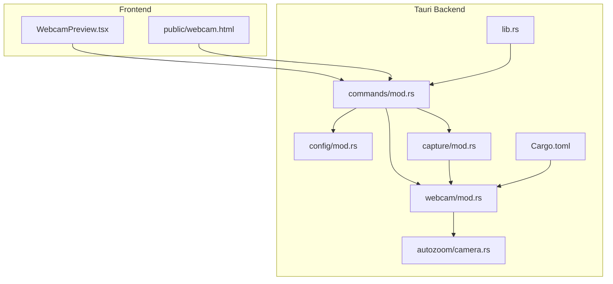
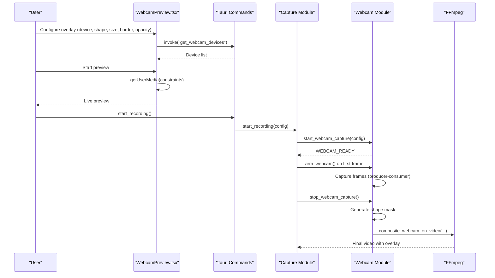
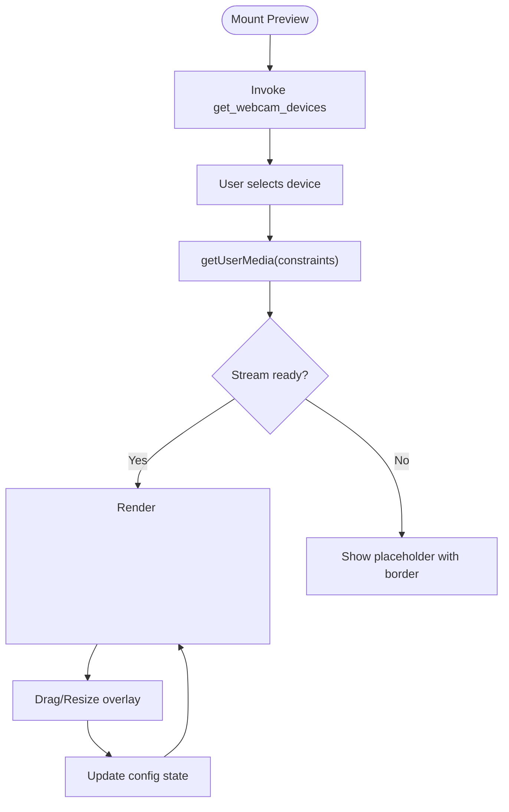
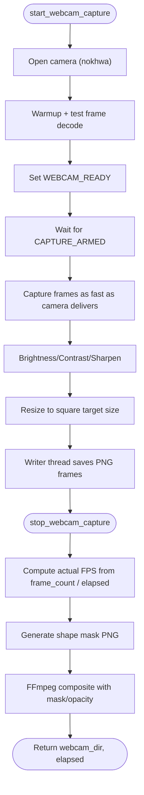
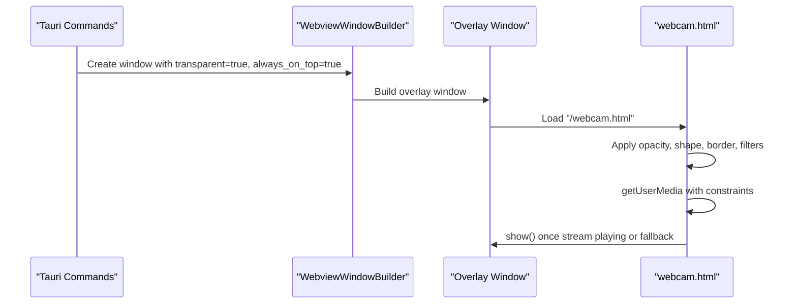
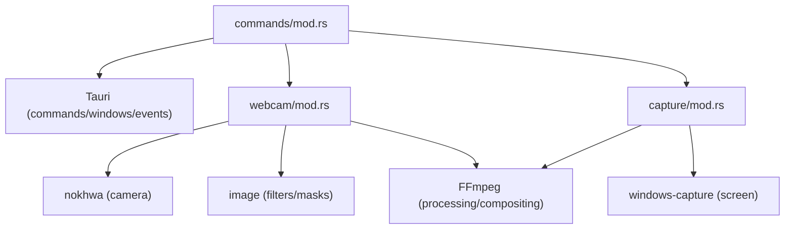

# Webcam Overlay System

<cite>
**Referenced Files in This Document**
- [WebcamPreview.tsx](file://src/components/WebcamPreview.tsx)
- [mod.rs](file://src-tauri/src/webcam/mod.rs)
- [camera.rs](file://src-tauri/src/autozoom/camera.rs)
- [webcam.html](file://public/webcam.html)
- [lib.rs](file://src-tauri/src/lib.rs)
- [Cargo.toml](file://src-tauri/Cargo.toml)
- [mod.rs](file://src-tauri/src/config/mod.rs)
- [mod.rs](file://src-tauri/src/capture/mod.rs)
- [mod.rs](file://src-tauri/src/commands/mod.rs)
</cite>

## Table of Contents
1. [Introduction](#introduction)
2. [Project Structure](#project-structure)
3. [Core Components](#core-components)
4. [Architecture Overview](#architecture-overview)
5. [Detailed Component Analysis](#detailed-component-analysis)
6. [Dependency Analysis](#dependency-analysis)
7. [Performance Considerations](#performance-considerations)
8. [Troubleshooting Guide](#troubleshooting-guide)
9. [Conclusion](#conclusion)

## Introduction
This document explains EasySpecy's webcam overlay system, covering camera capture, positioning, styling, and real-time processing. It details the webcam module architecture including device enumeration, capture pipeline, and overlay window management. It also covers camera selection, resolution handling, frame rate optimization, overlay positioning options, sizing controls, border styling, transparency effects, webcam preview functionality, device permission handling, platform-specific camera access patterns, examples of custom overlay configurations, performance tuning for low-latency capture, and integration with the recording pipeline.

## Project Structure
The webcam overlay system spans both the frontend React component and the Tauri backend Rust modules. The frontend provides a preview and configuration UI, while the backend manages camera capture, compositing, and overlay window creation.

**Diagram sources**
- [WebcamPreview.tsx:1-520](file://src/components/WebcamPreview.tsx#L1-L520)
- [webcam.html:1-133](file://public/webcam.html#L1-L133)
- [mod.rs:644-722](file://src-tauri/src/commands/mod.rs#L644-L722)
- [mod.rs:1-432](file://src-tauri/src/config/mod.rs#L1-L432)
- [mod.rs:1-800](file://src-tauri/src/capture/mod.rs#L1-L800)
- [mod.rs:1-620](file://src-tauri/src/webcam/mod.rs#L1-L620)
- [camera.rs:1-203](file://src-tauri/src/autozoom/camera.rs#L1-L203)
- [lib.rs:1-208](file://src-tauri/src/lib.rs#L1-L208)
- [Cargo.toml:1-61](file://src-tauri/Cargo.toml#L1-L61)

**Section sources**
- [WebcamPreview.tsx:1-520](file://src/components/WebcamPreview.tsx#L1-L520)
- [webcam.html:1-133](file://public/webcam.html#L1-L133)
- [mod.rs:644-722](file://src-tauri/src/commands/mod.rs#L644-L722)
- [mod.rs:1-432](file://src-tauri/src/config/mod.rs#L1-L432)
- [mod.rs:1-800](file://src-tauri/src/capture/mod.rs#L1-L800)
- [mod.rs:1-620](file://src-tauri/src/webcam/mod.rs#L1-L620)
- [camera.rs:1-203](file://src-tauri/src/autozoom/camera.rs#L1-L203)
- [lib.rs:1-208](file://src-tauri/src/lib.rs#L1-L208)
- [Cargo.toml:1-61](file://src-tauri/Cargo.toml#L1-L61)

## Core Components
- WebcamPreview (frontend): Provides a live preview, device selection, shape/border/opacity controls, and image adjustments (brightness, contrast, sharpen). It uses React hooks and Tauri invocations to manage camera permissions and preview updates.
- Tauri Commands: Expose backend APIs for device enumeration, overlay window creation, and webcam lifecycle management.
- Webcam Module (backend): Implements camera capture, producer-consumer frame writing, shape mask generation, and FFmpeg-based compositing.
- Capture Module (backend): Coordinates screen capture, audio synchronization, and final video processing including webcam overlay compositing.
- Config Module (backend): Defines webcam configuration fields persisted in TOML, including device, size, shape, border, opacity, and image adjustments.
- Auto-Zoom Camera (backend): Provides spring-physics camera animation used elsewhere in the app; relevant for understanding coordinate systems and overlays.

**Section sources**
- [WebcamPreview.tsx:1-520](file://src/components/WebcamPreview.tsx#L1-L520)
- [mod.rs:644-722](file://src-tauri/src/commands/mod.rs#L644-L722)
- [mod.rs:1-620](file://src-tauri/src/webcam/mod.rs#L1-L620)
- [mod.rs:1-800](file://src-tauri/src/capture/mod.rs#L1-L800)
- [mod.rs:1-432](file://src-tauri/src/config/mod.rs#L1-L432)
- [camera.rs:1-203](file://src-tauri/src/autozoom/camera.rs#L1-L203)

## Architecture Overview
The webcam overlay system follows a synchronized capture and compositing pipeline:
- Frontend preview allows users to configure overlay geometry and filters.
- Backend creates a transparent overlay window hosting a minimal HTML page that applies the same visual configuration.
- During recording, the backend starts webcam capture, arms it on the first video frame, writes frames to disk, generates a shape mask, and composites the webcam feed onto the recorded video using FFmpeg.

**Diagram sources**
- [WebcamPreview.tsx:92-147](file://src/components/WebcamPreview.tsx#L92-L147)
- [mod.rs:644-722](file://src-tauri/src/commands/mod.rs#L644-L722)
- [mod.rs:160-404](file://src-tauri/src/capture/mod.rs#L160-L404)
- [mod.rs:38-156](file://src-tauri/src/webcam/mod.rs#L38-L156)

## Detailed Component Analysis

### Frontend Webcam Preview
The preview component manages:
- Device enumeration via Tauri command.
- Camera permission flow using WebRTC getUserMedia with constraints.
- Live preview rendering and image adjustments via CSS filters.
- Overlay configuration state (position, size, shape, border, opacity).
- Drag-and-resize controls using react-rnd with aspect ratio locking.

Key behaviors:
- Device selection triggers re-initialization of the camera stream.
- Image adjustments are applied via CSS filter: brightness and contrast.
- Preview scaling maintains aspect ratio relative to recording resolution.

**Diagram sources**
- [WebcamPreview.tsx:92-164](file://src/components/WebcamPreview.tsx#L92-L164)

**Section sources**
- [WebcamPreview.tsx:1-520](file://src/components/WebcamPreview.tsx#L1-L520)

### Backend Webcam Module
The webcam module implements:
- Global state for capture lifecycle (READY, ARMED, STOP, errors).
- Immediate camera open and warm-up, followed by readiness signaling.
- Producer-consumer frame capture with a writer thread for PNG encoding.
- Post-processing: brightness, contrast, sharpen, and square resizing.
- Shape mask generation for FFmpeg alpha compositing.
- FFmpeg compositing with optional mask and opacity scaling.
- Fallback compositing without mask if masked compositing fails.

**Diagram sources**
- [mod.rs:407-580](file://src-tauri/src/webcam/mod.rs#L407-L580)
- [mod.rs:158-232](file://src-tauri/src/webcam/mod.rs#L158-L232)
- [mod.rs:234-328](file://src-tauri/src/webcam/mod.rs#L234-L328)

**Section sources**
- [mod.rs:1-620](file://src-tauri/src/webcam/mod.rs#L1-L620)

### Overlay Window Management
The backend creates a transparent, always-on-top overlay window hosting the webcam HTML page. The window is positioned and sized according to configuration and scaled to the logical screen size. The window is initially hidden and shown by JavaScript once the camera stream starts playing.

**Diagram sources**
- [mod.rs:662-682](file://src-tauri/src/commands/mod.rs#L662-L682)
- [webcam.html:37-129](file://public/webcam.html#L37-L129)

**Section sources**
- [mod.rs:644-722](file://src-tauri/src/commands/mod.rs#L644-L722)
- [webcam.html:1-133](file://public/webcam.html#L1-L133)

### Camera Selection, Resolution, and Frame Rate
- Device selection: The frontend queries devices via Tauri and passes the selected device index to the backend. The backend uses nokhwa to open the camera by index or default.
- Resolution handling: The backend reads the camera's native resolution and decodes a test frame to verify functionality. Frames are resized to the configured square overlay size.
- Frame rate: The backend captures frames as fast as the camera delivers and computes the actual FPS from frame count divided by elapsed time since arming. This actual FPS is used for FFmpeg compositing to maintain temporal alignment.

**Section sources**
- [mod.rs:416-464](file://src-tauri/src/webcam/mod.rs#L416-L464)
- [mod.rs:521-546](file://src-tauri/src/webcam/mod.rs#L521-L546)
- [mod.rs:122-156](file://src-tauri/src/webcam/mod.rs#L122-L156)

### Overlay Positioning, Sizing, and Styling
- Positioning: The overlay window is positioned using logical coordinates derived from configuration and monitor scaling. The final position is clamped to screen bounds.
- Sizing: The overlay window is square and sized according to the configured dimension. The frontend preview scales the overlay proportionally to the recording resolution.
- Styling: Shape masks (circle, rounded, squircle) are generated and applied via FFmpeg alphamerge. Border width and color are rendered via CSS in the overlay window and via mask generation in the backend. Opacity is applied via FFmpeg fade or CSS depending on the path.

**Section sources**
- [mod.rs:644-660](file://src-tauri/src/commands/mod.rs#L644-L660)
- [mod.rs:158-232](file://src-tauri/src/webcam/mod.rs#L158-L232)
- [webcam.html:62-77](file://public/webcam.html#L62-L77)

### Real-Time Processing and Compositing
- Synchronization: The capture module arms audio and webcam on the first video frame, ensuring zero-drift synchronization.
- Webcam compositing: The backend generates a shape mask and composites the webcam feed onto the recorded video using FFmpeg. If masked compositing fails, a simple overlay path is attempted.
- Progress reporting: FFmpeg progress is parsed and mapped to frontend progress ranges.

**Section sources**
- [mod.rs:105-129](file://src-tauri/src/capture/mod.rs#L105-L129)
- [mod.rs:234-328](file://src-tauri/src/webcam/mod.rs#L234-L328)
- [mod.rs:424-500](file://src-tauri/src/capture/mod.rs#L424-L500)

### Device Permission Handling and Platform Patterns
- Permissions: The frontend uses getUserMedia with appropriate constraints. The backend releases any browser webcam stream before starting capture to avoid device contention.
- Platform-specific access: The backend uses nokhwa for camera access across platforms and Windows Capture API for screen capture. FFmpeg is used for video processing and compositing.

**Section sources**
- [WebcamPreview.tsx:110-114](file://src/components/WebcamPreview.tsx#L110-L114)
- [mod.rs:232-265](file://src-tauri/src/capture/mod.rs#L232-L265)
- [Cargo.toml:46-61](file://src-tauri/Cargo.toml#L46-L61)

### Examples of Custom Overlay Configurations
- Shape: Circle, Rounded, Squircle. Masks are generated per shape and border width/color.
- Border: Width and color applied to the mask and overlay window.
- Opacity: Applied to the webcam stream in FFmpeg or CSS.
- Image adjustments: Sharpen (unsharpen mask), brightness offset, contrast multiplier.

**Section sources**
- [mod.rs:158-232](file://src-tauri/src/webcam/mod.rs#L158-L232)
- [mod.rs:32-46](file://src-tauri/src/config/mod.rs#L32-L46)
- [webcam.html:74-77](file://public/webcam.html#L74-L77)

### Integration with Recording Pipeline
- Start: The capture module initializes audio and webcam capture, emits a release-webcam event to the frontend to free browser devices, and arms all subsystems on the first frame.
- Stop: The capture module stops audio, signals webcam capture to stop, computes durations, composites the webcam overlay, merges audio, crops if needed, and performs sync verification.

**Section sources**
- [mod.rs:160-404](file://src-tauri/src/capture/mod.rs#L160-L404)
- [mod.rs:502-714](file://src-tauri/src/capture/mod.rs#L502-L714)

## Dependency Analysis
The webcam overlay system integrates several modules and external libraries:
- nokhwa: Cross-platform camera access for device enumeration and capture.
- image: Image processing for brightness/contrast/sharpen and mask generation.
- FFmpeg: Video processing, compositing, and merging.
- Windows Capture API: Screen capture on Windows.
- Tauri: Command exposure, window management, and event emission.

**Diagram sources**
- [Cargo.toml:46-61](file://src-tauri/Cargo.toml#L46-L61)
- [mod.rs:1-620](file://src-tauri/src/webcam/mod.rs#L1-L620)
- [mod.rs:1-800](file://src-tauri/src/capture/mod.rs#L1-L800)
- [mod.rs:644-722](file://src-tauri/src/commands/mod.rs#L644-L722)

**Section sources**
- [Cargo.toml:1-61](file://src-tauri/Cargo.toml#L1-L61)
- [mod.rs:1-620](file://src-tauri/src/webcam/mod.rs#L1-L620)
- [mod.rs:1-800](file://src-tauri/src/capture/mod.rs#L1-L800)
- [mod.rs:644-722](file://src-tauri/src/commands/mod.rs#L644-L722)

## Performance Considerations
- Producer-consumer capture: The webcam module uses a bounded channel to prevent capture stalls during disk I/O, dropping frames if the writer is busy.
- Actual FPS computation: The backend computes the real webcam FPS from frame count and elapsed time to ensure accurate compositing.
- FFmpeg ultrafast preset: The webcam overlay compositing uses ultrafast encoding to reduce latency.
- Browser vs. native: The backend releases browser webcam streams before native capture to avoid contention and ensure stable device access.
- Resolution and scaling: Resizing to a fixed square size reduces downstream processing overhead.

[No sources needed since this section provides general guidance]

## Troubleshooting Guide
Common issues and remedies:
- Camera fails to open: The backend sets an error flag and reports it to the frontend. Check device permissions and availability.
- Zero-resolution camera: The backend validates camera resolution and stops the stream if invalid.
- Masked compositing failure: The backend falls back to simple overlay compositing if masked compositing fails.
- Device contention: The capture module emits a release-webcam event to the frontend to close browser streams before native capture.

**Section sources**
- [mod.rs:444-464](file://src-tauri/src/webcam/mod.rs#L444-L464)
- [mod.rs:322-328](file://src-tauri/src/webcam/mod.rs#L322-L328)
- [mod.rs:234-265](file://src-tauri/src/capture/mod.rs#L234-L265)

## Conclusion
EasySpecy’s webcam overlay system combines a flexible frontend preview with a robust backend capture and compositing pipeline. It supports dynamic device selection, precise positioning and styling, and seamless integration with the recording pipeline. The producer-consumer design and actual FPS computation help maintain low latency and accurate synchronization, while FFmpeg-based compositing ensures high-quality overlays.