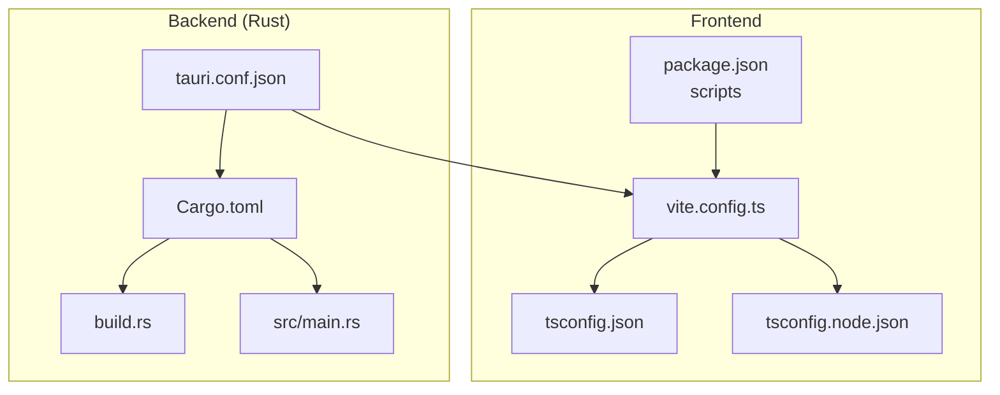
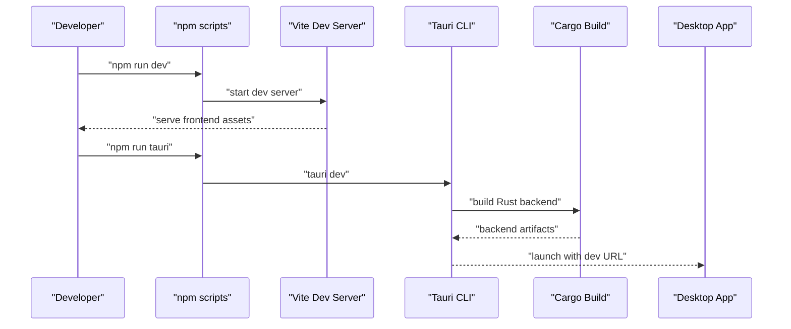
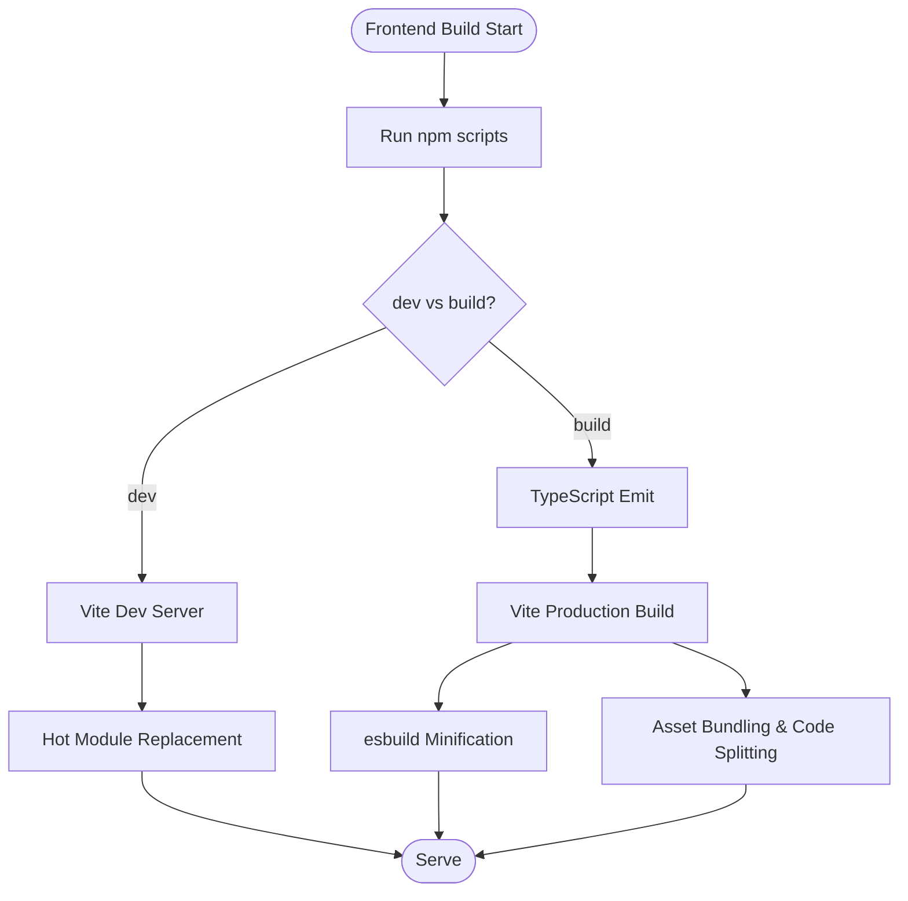
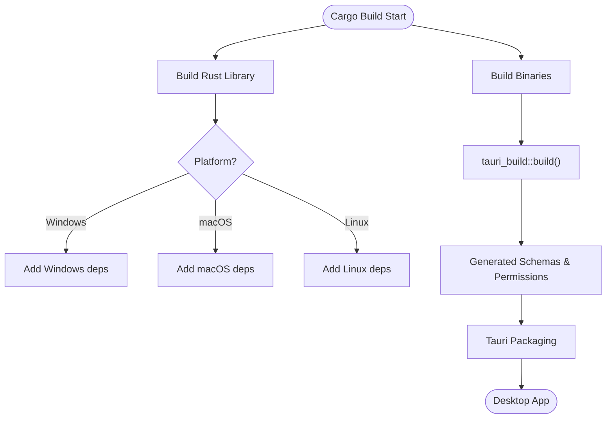
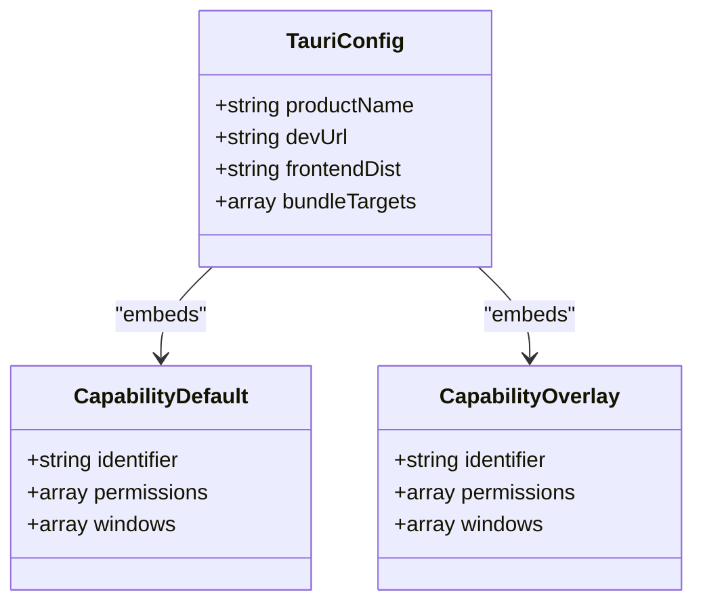
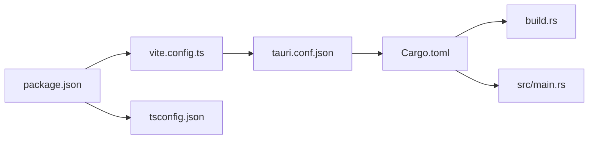

# Build Process

<cite>
**Referenced Files in This Document**
- [package.json](file://package.json)
- [vite.config.ts](file://vite.config.ts)
- [tsconfig.json](file://tsconfig.json)
- [tsconfig.node.json](file://tsconfig.node.json)
- [src-tauri/Cargo.toml](file://src-tauri/Cargo.toml)
- [src-tauri/build.rs](file://src-tauri/build.rs)
- [src-tauri/tauri.conf.json](file://src-tauri/tauri.conf.json)
- [src-tauri/src/main.rs](file://src-tauri/src/main.rs)
- [src-tauri/capabilities/default.json](file://src-tauri/capabilities/default.json)
- [src-tauri/capabilities/overlay.json](file://src-tauri/capabilities/overlay.json)
</cite>

## Table of Contents
1. [Introduction](#introduction)
2. [Project Structure](#project-structure)
3. [Core Components](#core-components)
4. [Architecture Overview](#architecture-overview)
5. [Detailed Component Analysis](#detailed-component-analysis)
6. [Dependency Analysis](#dependency-analysis)
7. [Performance Considerations](#performance-considerations)
8. [Troubleshooting Guide](#troubleshooting-guide)
9. [Conclusion](#conclusion)

## Introduction
This document explains the build process for EasySpecy, a Tauri-based desktop application with a React/TypeScript frontend built via Vite and a Rust backend compiled with Cargo. It covers development builds with hot reload, production builds with optimizations, platform-specific targets, the Tauri build pipeline, capability configuration, and resource embedding. It also provides guidance on troubleshooting, incremental builds, and performance optimization during development.

## Project Structure
The build system is split into two parts:
- Frontend: React/TypeScript built with Vite and TailwindCSS, configured via Vite and TypeScript compiler options.
- Backend: Rust library and binaries managed by Cargo, integrated with Tauri CLI and configuration.

Key build-related files:
- Frontend: package.json scripts, vite.config.ts, tsconfig.json, tsconfig.node.json
- Backend: src-tauri/Cargo.toml, src-tauri/build.rs, src-tauri/tauri.conf.json, src-tauri/src/main.rs
- Capabilities: src-tauri/capabilities/default.json, src-tauri/capabilities/overlay.json

**Diagram sources**
- [package.json:1-36](file://package.json#L1-L36)
- [vite.config.ts:1-36](file://vite.config.ts#L1-L36)
- [tsconfig.json:1-26](file://tsconfig.json#L1-L26)
- [tsconfig.node.json:1-11](file://tsconfig.node.json#L1-L11)
- [src-tauri/Cargo.toml:1-61](file://src-tauri/Cargo.toml#L1-L61)
- [src-tauri/build.rs:1-4](file://src-tauri/build.rs#L1-L4)
- [src-tauri/tauri.conf.json:1-48](file://src-tauri/tauri.conf.json#L1-L48)
- [src-tauri/src/main.rs:1-7](file://src-tauri/src/main.rs#L1-L7)

**Section sources**
- [package.json:1-36](file://package.json#L1-L36)
- [vite.config.ts:1-36](file://vite.config.ts#L1-L36)
- [tsconfig.json:1-26](file://tsconfig.json#L1-L26)
- [tsconfig.node.json:1-11](file://tsconfig.node.json#L1-L11)
- [src-tauri/Cargo.toml:1-61](file://src-tauri/Cargo.toml#L1-L61)
- [src-tauri/build.rs:1-4](file://src-tauri/build.rs#L1-L4)
- [src-tauri/tauri.conf.json:1-48](file://src-tauri/tauri.conf.json#L1-L48)
- [src-tauri/src/main.rs:1-7](file://src-tauri/src/main.rs#L1-L7)

## Core Components
- Frontend build pipeline:
  - Scripts orchestrate TypeScript compilation and Vite bundling.
  - Vite configuration enables React plugin, TailwindCSS integration, and Tauri-aware development server with optional HMR.
  - TypeScript compiler options enforce bundler mode and JSX transform for Vite.
- Backend build pipeline:
  - Cargo manages Rust crates, platform-specific dependencies, and build artifacts.
  - Tauri CLI integrates with Cargo to produce desktop bundles and embed resources.
  - Capability JSON files define permissions for main and overlay windows.

Key build commands and roles:
- npm run dev: starts Vite dev server for the frontend.
- npm run build: runs TypeScript emit and Vite production build.
- npm run tauri: invokes Tauri CLI for packaging and building the app.
- tauri dev: runs Tauri with the dev server URL and frontend build command.

**Section sources**
- [package.json:6-11](file://package.json#L6-L11)
- [vite.config.ts:9-35](file://vite.config.ts#L9-L35)
- [tsconfig.json:2-22](file://tsconfig.json#L2-L22)
- [tsconfig.node.json:1-11](file://tsconfig.node.json#L1-L11)
- [src-tauri/Cargo.toml:1-61](file://src-tauri/Cargo.toml#L1-L61)
- [src-tauri/tauri.conf.json:6-11](file://src-tauri/tauri.conf.json#L6-L11)

## Architecture Overview
The build architecture combines Vite-driven frontend bundling with Tauri’s Rust-based runtime and platform integrations. The Tauri configuration coordinates the frontend dev URL and build output with the backend Cargo build.

**Diagram sources**
- [package.json:6-11](file://package.json#L6-L11)
- [src-tauri/tauri.conf.json:7-10](file://src-tauri/tauri.conf.json#L7-L10)
- [src-tauri/src/main.rs:4-6](file://src-tauri/src/main.rs#L4-L6)

## Detailed Component Analysis

### Frontend Build Pipeline (Vite + TypeScript)
- Scripts:
  - Development: runs Vite dev server.
  - Production: runs TypeScript emit followed by Vite production build.
  - Preview: serves the production bundle locally.
  - Tauri: invokes Tauri CLI.
- Vite configuration:
  - React plugin and TailwindCSS integration.
  - Tauri-aware dev server with configurable host and HMR when TAURI_DEV_HOST is set.
  - esnext target and esbuild minification for production builds.
  - Watcher excludes backend source directories to avoid unnecessary rebuilds.
- TypeScript configuration:
  - Bundler module resolution and JSX transform for Vite.
  - Strict compiler options and noEmit for Vite’s type-checking workflow.

**Diagram sources**
- [package.json:6-11](file://package.json#L6-L11)
- [vite.config.ts:9-35](file://vite.config.ts#L9-L35)
- [tsconfig.json:2-22](file://tsconfig.json#L2-L22)

**Section sources**
- [package.json:6-11](file://package.json#L6-L11)
- [vite.config.ts:9-35](file://vite.config.ts#L9-L35)
- [tsconfig.json:2-22](file://tsconfig.json#L2-L22)
- [tsconfig.node.json:1-11](file://tsconfig.node.json#L1-L11)

### Backend Build Pipeline (Cargo + Tauri)
- Cargo configuration:
  - Defines a Rust library crate and multiple binaries, including a primary binary and a test binary.
  - Includes platform-specific dependencies for Windows, macOS, and Linux.
  - Build dependencies include tauri-build for code generation and capability schema embedding.
- Tauri integration:
  - build.rs delegates to tauri_build::build().
  - tauri.conf.json defines:
    - beforeDevCommand and devUrl to connect to the Vite dev server.
    - beforeBuildCommand and frontendDist to package the Vite output.
    - Window configuration, security, tray icon, and bundling targets.
- Entry point:
  - src/main.rs sets the Windows subsystem for release and calls into the Rust library entry.

**Diagram sources**
- [src-tauri/Cargo.toml:1-61](file://src-tauri/Cargo.toml#L1-L61)
- [src-tauri/build.rs:1-4](file://src-tauri/build.rs#L1-L4)
- [src-tauri/tauri.conf.json:6-46](file://src-tauri/tauri.conf.json#L6-L46)
- [src-tauri/src/main.rs:1-7](file://src-tauri/src/main.rs#L1-L7)

**Section sources**
- [src-tauri/Cargo.toml:1-61](file://src-tauri/Cargo.toml#L1-L61)
- [src-tauri/build.rs:1-4](file://src-tauri/build.rs#L1-L4)
- [src-tauri/tauri.conf.json:6-46](file://src-tauri/tauri.conf.json#L6-L46)
- [src-tauri/src/main.rs:1-7](file://src-tauri/src/main.rs#L1-L7)

### Tauri Build Process and Capability Configuration
- Capability files define permissions for windows:
  - default.json: main window permissions including window controls and global shortcut registration.
  - overlay.json: effects overlay window permissions for event listen/emit.
- These capabilities integrate with Tauri’s permission system and are embedded during the build.

**Diagram sources**
- [src-tauri/tauri.conf.json:1-48](file://src-tauri/tauri.conf.json#L1-L48)
- [src-tauri/capabilities/default.json:1-21](file://src-tauri/capabilities/default.json#L1-L21)
- [src-tauri/capabilities/overlay.json:1-1](file://src-tauri/capabilities/overlay.json#L1-L1)

**Section sources**
- [src-tauri/tauri.conf.json:1-48](file://src-tauri/tauri.conf.json#L1-L48)
- [src-tauri/capabilities/default.json:1-21](file://src-tauri/capabilities/default.json#L1-L21)
- [src-tauri/capabilities/overlay.json:1-1](file://src-tauri/capabilities/overlay.json#L1-L1)

### Asset Bundling, Code Splitting, and Dependency Optimization
- Vite handles:
  - Asset bundling and code splitting for the frontend.
  - esbuild minification for production builds.
  - React and TailwindCSS plugins for component and styling bundling.
- TypeScript configuration enforces bundler module resolution and JSX transform, aligning with Vite’s expectations.

**Section sources**
- [vite.config.ts:16-19](file://vite.config.ts#L16-L19)
- [vite.config.ts:10](file://vite.config.ts#L10)
- [tsconfig.json:9-15](file://tsconfig.json#L9-L15)

### Environment-Specific Builds and Custom Build Scripts
- Development:
  - Vite dev server with optional HMR when TAURI_DEV_HOST is set.
  - Watcher ignores backend directories to prevent redundant rebuilds.
- Production:
  - TypeScript emit followed by Vite production build with esbuild minification.
- Tauri:
  - beforeDevCommand and beforeBuildCommand coordinate with npm scripts.
  - devUrl points to the Vite dev server.

**Section sources**
- [vite.config.ts:20-34](file://vite.config.ts#L20-L34)
- [package.json:6-11](file://package.json#L6-L11)
- [src-tauri/tauri.conf.json:7-10](file://src-tauri/tauri.conf.json#L7-L10)

### Platform-Specific Build Targets
- Windows:
  - Windows-specific dependencies and subsystem configuration for release.
- macOS:
  - macOS-specific dependencies for screen capture.
- Linux:
  - Linux-specific dependencies for media capture.

**Section sources**
- [src-tauri/Cargo.toml:52-61](file://src-tauri/Cargo.toml#L52-L61)
- [src-tauri/src/main.rs:1-2](file://src-tauri/src/main.rs#L1-L2)

## Dependency Analysis
The build system exhibits clear separation of concerns:
- Frontend dependencies (React, TailwindCSS, Vite) are declared in package.json and configured in vite.config.ts and tsconfig.json.
- Backend dependencies (Tauri, platform crates) are declared in Cargo.toml, with build-time integration via build.rs and tauri.conf.json.

**Diagram sources**
- [package.json:1-36](file://package.json#L1-L36)
- [vite.config.ts:1-36](file://vite.config.ts#L1-L36)
- [tsconfig.json:1-26](file://tsconfig.json#L1-L26)
- [src-tauri/tauri.conf.json:1-48](file://src-tauri/tauri.conf.json#L1-L48)
- [src-tauri/Cargo.toml:1-61](file://src-tauri/Cargo.toml#L1-L61)
- [src-tauri/build.rs:1-4](file://src-tauri/build.rs#L1-L4)
- [src-tauri/src/main.rs:1-7](file://src-tauri/src/main.rs#L1-L7)

**Section sources**
- [package.json:1-36](file://package.json#L1-L36)
- [vite.config.ts:1-36](file://vite.config.ts#L1-L36)
- [tsconfig.json:1-26](file://tsconfig.json#L1-L26)
- [src-tauri/tauri.conf.json:1-48](file://src-tauri/tauri.conf.json#L1-L48)
- [src-tauri/Cargo.toml:1-61](file://src-tauri/Cargo.toml#L1-L61)
- [src-tauri/build.rs:1-4](file://src-tauri/build.rs#L1-L4)
- [src-tauri/src/main.rs:1-7](file://src-tauri/src/main.rs#L1-L7)

## Performance Considerations
- Development:
  - Keep HMR enabled for rapid feedback; disable HMR by unsetting TAURI_DEV_HOST if needed.
  - Exclude backend directories from frontend watcher to reduce file system overhead.
- Production:
  - esbuild minification reduces bundle size; ensure tree-shaking is effective by avoiding unused imports.
  - TailwindCSS purging and component splitting help optimize CSS and JS sizes.
- Backend:
  - Platform-specific dependencies should be reviewed for size and necessity.
  - Release builds leverage Windows subsystem configuration to avoid console windows.

[No sources needed since this section provides general guidance]

## Troubleshooting Guide
Common issues and resolutions:
- Vite dev server not connecting:
  - Verify devUrl in tauri.conf.json matches the Vite server port.
  - Ensure TAURI_DEV_HOST is set only when using remote HMR.
- Hot reload not working:
  - Confirm HMR configuration in vite.config.ts and that the host property is set appropriately.
  - Check that the frontend watcher ignores backend directories.
- Tauri build failures:
  - Ensure beforeDevCommand and beforeBuildCommand are correct.
  - Confirm frontendDist points to the Vite output directory.
- Capability errors:
  - Validate capability JSON identifiers and permissions match window names.
- Platform-specific errors:
  - Install required system dependencies for Windows/macOS/Linux as per Cargo.toml.

**Section sources**
- [vite.config.ts:20-34](file://vite.config.ts#L20-L34)
- [src-tauri/tauri.conf.json:7-10](file://src-tauri/tauri.conf.json#L7-L10)
- [src-tauri/capabilities/default.json:1-21](file://src-tauri/capabilities/default.json#L1-L21)
- [src-tauri/capabilities/overlay.json:1-1](file://src-tauri/capabilities/overlay.json#L1-L1)

## Conclusion
EasySpecy’s build system cleanly separates frontend and backend responsibilities. Vite and TypeScript handle modern web bundling with hot reload and optimized production builds, while Cargo and Tauri manage platform-specific Rust integration and desktop packaging. Proper configuration of dev URLs, capability permissions, and platform dependencies ensures reliable development and distribution across Windows, macOS, and Linux.