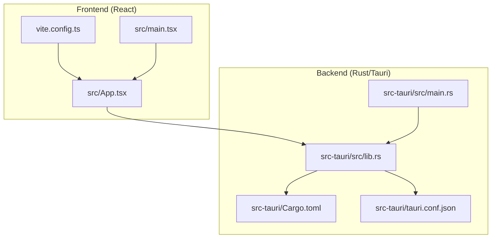
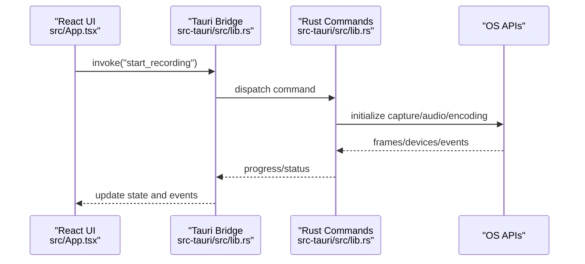
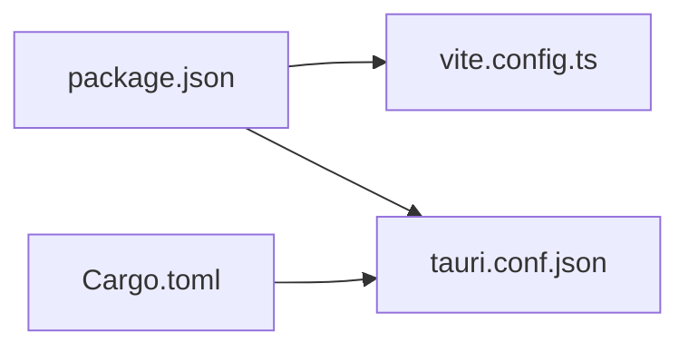

# Contribution Guidelines

<cite>
**Referenced Files in This Document**
- [README.md](file://README.md)
- [AGENTS.md](file://AGENTS.md)
- [package.json](file://package.json)
- [vite.config.ts](file://vite.config.ts)
- [src-tauri/Cargo.toml](file://src-tauri/Cargo.toml)
- [src-tauri/tauri.conf.json](file://src-tauri/tauri.conf.json)
- [src/App.tsx](file://src/App.tsx)
- [src/main.tsx](file://src/main.tsx)
- [src-tauri/src/lib.rs](file://src-tauri/src/lib.rs)
- [src-tauri/src/main.rs](file://src-tauri/src/main.rs)
- [tests/test_autozoom.py](file://tests/test_autozoom.py)
</cite>

## Table of Contents
1. [Introduction](#introduction)
2. [Project Structure](#project-structure)
3. [Core Components](#core-components)
4. [Architecture Overview](#architecture-overview)
5. [Detailed Component Analysis](#detailed-component-analysis)
6. [Dependency Analysis](#dependency-analysis)
7. [Performance Considerations](#performance-considerations)
8. [Troubleshooting Guide](#troubleshooting-guide)
9. [Conclusion](#conclusion)
10. [Appendices](#appendices)

## Introduction
This document defines contribution guidelines for EasySpecy, a free, open-source, cross-platform screen recorder with cinematic auto-zoom and cursor effects. It consolidates code style standards, commit conventions, pull request requirements, architectural principles, design patterns, review processes, issue reporting, feature requests, documentation standards, example contribution patterns, community interaction guidelines, licensing, contributor agreements, and release/versioning strategy.

## Project Structure
EasySpecy follows a hybrid frontend/backend architecture:
- Frontend: React + TypeScript + Tailwind CSS, served via Vite, embedded by Tauri.
- Backend: Rust (Tauri 2) for capture, audio, encoding, and system integrations.
- Cross-platform capture: OS-specific crates (Windows, macOS, Linux).
- Packaging: Tauri bundler with platform icons/resources.

**Diagram sources**
- [src/App.tsx:1-208](file://src/App.tsx#L1-L208)
- [src/main.tsx:1-15](file://src/main.tsx#L1-L15)
- [vite.config.ts:1-36](file://vite.config.ts#L1-L36)
- [src-tauri/src/lib.rs:1-208](file://src-tauri/src/lib.rs#L1-L208)
- [src-tauri/src/main.rs:1-7](file://src-tauri/src/main.rs#L1-L7)
- [src-tauri/Cargo.toml:1-61](file://src-tauri/Cargo.toml#L1-L61)
- [src-tauri/tauri.conf.json:1-48](file://src-tauri/tauri.conf.json#L1-L48)

**Section sources**
- [README.md:17-24](file://README.md#L17-L24)
- [package.json:1-36](file://package.json#L1-L36)
- [vite.config.ts:1-36](file://vite.config.ts#L1-L36)
- [src-tauri/Cargo.toml:1-61](file://src-tauri/Cargo.toml#L1-L61)
- [src-tauri/tauri.conf.json:1-48](file://src-tauri/tauri.conf.json#L1-L48)

## Core Components
- Frontend entry and routing:
  - Application bootstrap and theme initialization occur in the React entry file.
  - The main App component orchestrates pages, global state, IPC, and event listeners.
- Backend entry and IPC:
  - The Rust main module delegates to a library function that configures Tauri, logging, plugins, and command handlers.
- Build and packaging:
  - Vite configuration aligns with Tauri development and HMR.
  - Tauri configuration defines product metadata, window sizing, tray icon, and bundling resources.

**Section sources**
- [src/main.tsx:1-15](file://src/main.tsx#L1-L15)
- [src/App.tsx:17-189](file://src/App.tsx#L17-L189)
- [src-tauri/src/main.rs:4-7](file://src-tauri/src/main.rs#L4-L7)
- [src-tauri/src/lib.rs:38-136](file://src-tauri/src/lib.rs#L38-L136)
- [vite.config.ts:9-35](file://vite.config.ts#L9-L35)
- [src-tauri/tauri.conf.json:6-46](file://src-tauri/tauri.conf.json#L6-L46)

## Architecture Overview
The system uses a thin React frontend and a Rust backend connected via Tauri’s invoke/listen IPC. Logging is centralized with tracing to both stderr and a file. Commands expose recording controls, configuration, overlays, and system integrations.

**Diagram sources**
- [src/App.tsx:30-60](file://src/App.tsx#L30-L60)
- [src-tauri/src/lib.rs:88-127](file://src-tauri/src/lib.rs#L88-L127)

**Section sources**
- [src/App.tsx:12-14](file://src/App.tsx#L12-L14)
- [src-tauri/src/lib.rs:85-136](file://src-tauri/src/lib.rs#L85-L136)

## Detailed Component Analysis

### Code Style Standards
- Frontend (React + TypeScript + Tailwind CSS):
  - Functional components only; avoid class components.
  - Tailwind utility classes; no CSS modules.
  - Strict mode enabled; theme applied before render to prevent flash.
- Backend (Rust):
  - Module structure: capture, audio, config, commands, postprocess, cursors, tray, region, webcam.
  - Error handling: Result<T, String> for Tauri commands; anyhow::Result internally.
  - Async: tokio for async I/O; std::thread for capture loops.
  - Logging: tracing crate; not println!.
  - Configuration: TOML via serde; stored in user config directory.
- FFmpeg:
  - Shell out to bundled FFmpeg binary; not ffmpeg-next crate.
  - Path: resource_dir/ffmpeg (platform-appropriate binary).

**Section sources**
- [AGENTS.md:15-36](file://AGENTS.md#L15-L36)
- [src/main.tsx:7-8](file://src/main.tsx#L7-L8)
- [src-tauri/Cargo.toml:26-49](file://src-tauri/Cargo.toml#L26-L49)

### Commit Message Conventions
- Use conventional commit types for clarity and automation readiness:
  - feat:, fix:, docs:, chore:, refactor:, perf:, test:, build:, ci:, revert:
- Keep subject lines concise; reference issue numbers when applicable.
- Reference branch naming: master for stable, feature branches for development.

**Section sources**
- [AGENTS.md:149-153](file://AGENTS.md#L149-L153)

### Pull Request Requirements
- Branch strategy:
  - Base PRs against the appropriate branch (e.g., master for stable).
  - Feature branches should be up-to-date with base before opening PRs.
- Description:
  - Summarize changes, rationale, and impact.
  - Link related issues and include screenshots/recordings when UI/UX changes are involved.
- Review:
  - At least one maintainer approval required.
  - Ensure CI passes and no conflicts with base branch.
- Testing:
  - Add unit/integration/manual tests where applicable.
  - Include verification steps for platform-specific behavior.

**Section sources**
- [AGENTS.md:149-153](file://AGENTS.md#L149-L153)

### Review Process
- Assign reviewers based on component ownership.
- Encourage iterative feedback; address comments promptly.
- Maintain clean history; squash or reword commits as needed before merge.

**Section sources**
- [AGENTS.md:149-153](file://AGENTS.md#L149-L153)

### Issue Reporting Guidelines
- Use templates for bug reports and feature requests.
- Provide environment details (OS, hardware, EasySpecy version).
- Include reproduction steps, expected vs. actual behavior, and logs where relevant.

**Section sources**
- [README.md:60-63](file://README.md#L60-L63)

### Feature Request Procedures
- Open a GitHub issue with “Feature Request” label.
- Describe the problem statement, proposed solution, and acceptance criteria.
- Discuss trade-offs and alternatives.

**Section sources**
- [AGENTS.md:133-137](file://AGENTS.md#L133-L137)

### Documentation Standards
- Keep inline comments focused and concise.
- Prefer self-documenting code; add docstrings for public APIs.
- Update AGENTS.md and README.md for architectural decisions and user-facing changes.

**Section sources**
- [AGENTS.md:15-36](file://AGENTS.md#L15-L36)

### Example Contribution Patterns
- Adding a new Tauri command:
  - Define command in Rust module and register handler in the Tauri builder.
  - Invoke from React via @tauri-apps/api invoke and listen for events.
- Extending UI:
  - Create a functional component; integrate with Zustand stores.
  - Use Tailwind utilities; keep components small and reusable.

**Section sources**
- [src-tauri/src/lib.rs:88-127](file://src-tauri/src/lib.rs#L88-L127)
- [src/App.tsx:12-14](file://src/App.tsx#L12-L14)

### Community Interaction Guidelines
- Be respectful and inclusive.
- Use GitHub Discussions for questions and ideas.
- Avoid spamming or off-topic posts.

**Section sources**
- [README.md:60-63](file://README.md#L60-L63)

### Licensing Requirements and Contributor Agreements
- License: MIT.
- Contributors retain copyright; submit code under the project’s license.
- No separate CLA is enforced in the repository; upstream MIT applies.

**Section sources**
- [README.md:60-63](file://README.md#L60-L63)
- [src-tauri/Cargo.toml:7](file://src-tauri/Cargo.toml#L7)

### Intellectual Property Considerations
- Do not contribute third-party code without proper licensing.
- Respect platform SDK licenses (e.g., Windows/macOS/Linux capture frameworks).
- Avoid embedding large binaries in Git; follow FFmpeg distribution strategy.

**Section sources**
- [AGENTS.md:121-129](file://AGENTS.md#L121-L129)

### Release Process and Versioning Strategy
- Versioning:
  - Semantic versioning (major.minor.patch).
  - Tags: v0.1.0, v0.2.0, etc.
- Release artifacts:
  - Tauri bundler generates installers per platform.
  - FFmpeg distributed via external assets or sidecar.
- CI/CD:
  - Build workflows for all platforms; attach FFmpeg assets as needed.

**Section sources**
- [AGENTS.md:149-153](file://AGENTS.md#L149-L153)
- [src-tauri/tauri.conf.json:33-46](file://src-tauri/tauri.conf.json#L33-L46)

## Dependency Analysis
- Frontend dependencies include React, Tailwind CSS, Zustand, and Tauri plugins.
- Backend dependencies include Tauri, cpal, nokhwa, rayon, tracing, and platform-specific crates.
- Vite and Tauri configuration coordinate development and production builds.

**Diagram sources**
- [package.json:12-34](file://package.json#L12-L34)
- [src-tauri/Cargo.toml:26-61](file://src-tauri/Cargo.toml#L26-L61)
- [vite.config.ts:1-36](file://vite.config.ts#L1-L36)
- [src-tauri/tauri.conf.json:6-46](file://src-tauri/tauri.conf.json#L6-L46)

**Section sources**
- [package.json:12-34](file://package.json#L12-L34)
- [src-tauri/Cargo.toml:26-61](file://src-tauri/Cargo.toml#L26-L61)
- [vite.config.ts:1-36](file://vite.config.ts#L1-L36)
- [src-tauri/tauri.conf.json:6-46](file://src-tauri/tauri.conf.json#L6-L46)

## Performance Considerations
- CPU-bound rendering: Use rayon for parallel iterators; batch-render frames.
- Synchronization: Align all subsystems to CAPTURE_ARMED to avoid timing offsets.
- Avoid blocking the UI thread: Offload heavy work to background threads or async tasks.

**Section sources**
- [AGENTS.md:68-73](file://AGENTS.md#L68-L73)
- [AGENTS.md:41-47](file://AGENTS.md#L41-L47)

## Troubleshooting Guide
- Logging:
  - Tracing writes to stderr and a log file in the executable directory.
- Platform-specific issues:
  - Windows admin elevation for certain capture modes.
- IPC and events:
  - Verify invoke handlers and event listeners are registered and cleaned up.

**Section sources**
- [src-tauri/src/lib.rs:49-81](file://src-tauri/src/lib.rs#L49-L81)
- [src-tauri/src/lib.rs:138-205](file://src-tauri/src/lib.rs#L138-L205)
- [src/App.tsx:30-60](file://src/App.tsx#L30-L60)

## Conclusion
These contribution guidelines consolidate EasySpecy’s architectural principles, coding conventions, and operational practices. Contributors should align changes with the established patterns, maintain quality through tests and reviews, and follow the documented processes for issues, features, and releases.

## Appendices

### Coding Conventions Quick Reference
- Frontend:
  - Functional components, Tailwind utilities, strict mode, theme initialization.
- Backend:
  - Module-based organization, tracing logging, Result-based error handling, async I/O.
- IPC:
  - Use @tauri-apps/api invoke/listen; register commands in Tauri builder.

**Section sources**
- [AGENTS.md:15-36](file://AGENTS.md#L15-L36)
- [src-tauri/src/lib.rs:88-127](file://src-tauri/src/lib.rs#L88-L127)

### Testing Expectations
- Unit/integration/manual tests; A/V sync verification after recordings.

**Section sources**
- [AGENTS.md:140-146](file://AGENTS.md#L140-L146)

### Example: Auto-Zoom Detection Test
- Synthetic metadata generation and verification of zoom regions.

**Section sources**
- [tests/test_autozoom.py:1-482](file://tests/test_autozoom.py#L1-L482)