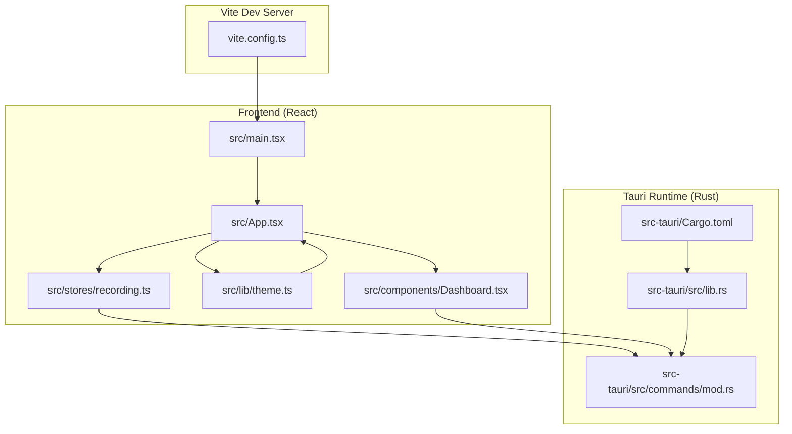
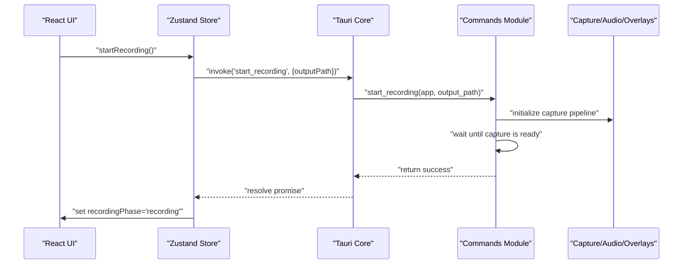
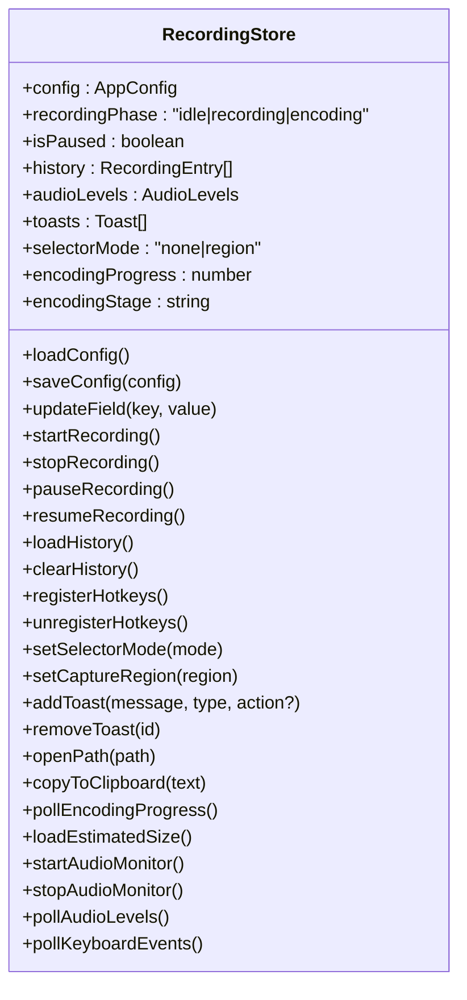
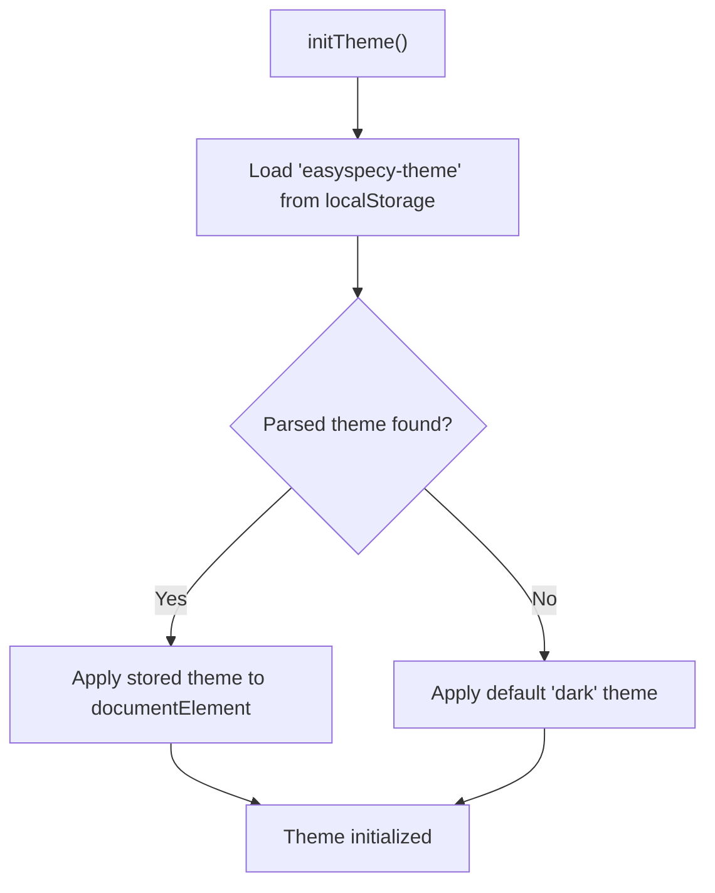
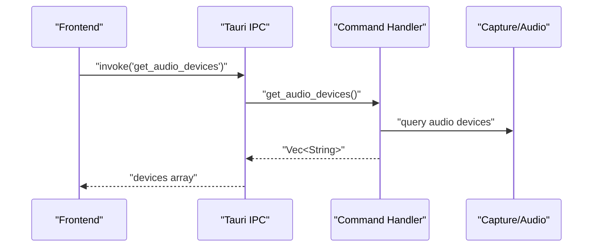
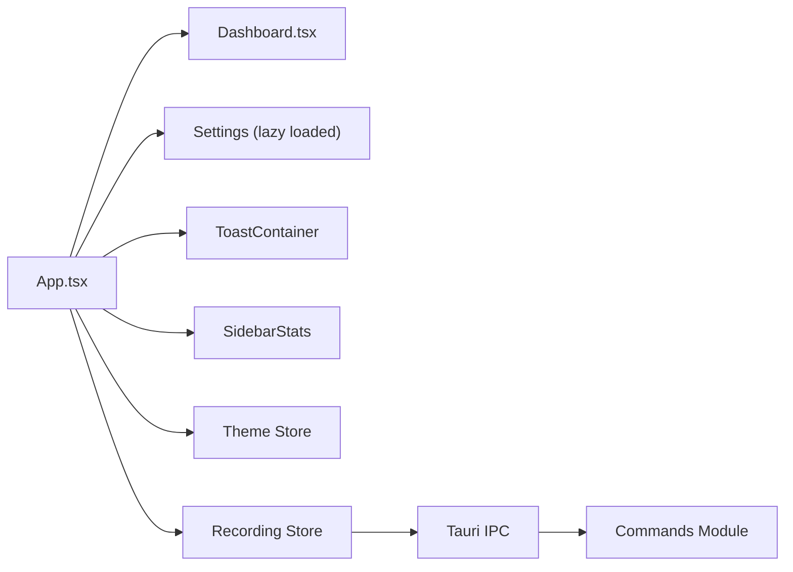
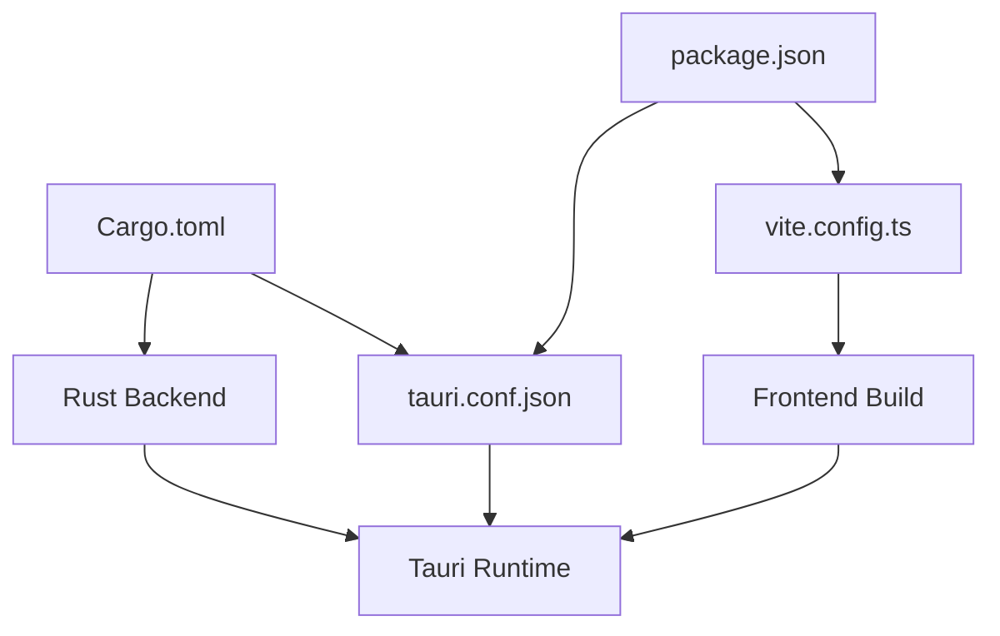

# Development Guide

<cite>
**Referenced Files in This Document**
- [README.md](file://README.md)
- [package.json](file://package.json)
- [vite.config.ts](file://vite.config.ts)
- [tauri.conf.json](file://src-tauri/tauri.conf.json)
- [Cargo.toml](file://src-tauri/Cargo.toml)
- [build.rs](file://src-tauri/build.rs)
- [src/main.tsx](file://src/main.tsx)
- [src/App.tsx](file://src/App.tsx)
- [src/stores/recording.ts](file://src/stores/recording.ts)
- [src/lib/theme.ts](file://src/lib/theme.ts)
- [src/components/Dashboard.tsx](file://src/components/Dashboard.tsx)
- [src-tauri/src/lib.rs](file://src-tauri/src/lib.rs)
- [src-tauri/src/commands/mod.rs](file://src-tauri/src/commands/mod.rs)
- [tsconfig.json](file://tsconfig.json)
</cite>

## Table of Contents
1. [Introduction](#introduction)
2. [Project Structure](#project-structure)
3. [Core Components](#core-components)
4. [Architecture Overview](#architecture-overview)
5. [Detailed Component Analysis](#detailed-component-analysis)
6. [Dependency Analysis](#dependency-analysis)
7. [Performance Considerations](#performance-considerations)
8. [Testing Strategies](#testing-strategies)
9. [Debugging Techniques](#debugging-techniques)
10. [Contribution Guidelines](#contribution-guidelines)
11. [Code Style Standards](#code-style-standards)
12. [Commit Conventions](#commit-conventions)
13. [Release Procedures](#release-procedures)
14. [Platform-Specific Development](#platform-specific-development)
15. [Troubleshooting Guide](#troubleshooting-guide)
16. [Conclusion](#conclusion)

## Introduction
This guide provides comprehensive development documentation for EasySpecy contributors. It covers prerequisites, environment setup, project structure, build processes, frontend-backend integration via Tauri commands, state management with Zustand, component architecture, testing, debugging, contribution practices, and platform-specific considerations for Windows, macOS, and Linux.

## Project Structure
The project follows a hybrid frontend/backend architecture:
- Frontend: React + TypeScript + Tailwind CSS, served by Vite
- Backend: Rust/Tauri for system integration, capture, audio, and encoding
- Shared state: Zustand stores for UI and recording state
- Commands: Tauri IPC commands bridge frontend and backend

**Diagram sources**
- [src/main.tsx:1-15](file://src/main.tsx#L1-L15)
- [src/App.tsx:1-208](file://src/App.tsx#L1-L208)
- [src/stores/recording.ts:1-404](file://src/stores/recording.ts#L1-L404)
- [src/lib/theme.ts:1-51](file://src/lib/theme.ts#L1-L51)
- [src/components/Dashboard.tsx:1-200](file://src/components/Dashboard.tsx#L1-L200)
- [vite.config.ts:1-36](file://vite.config.ts#L1-L36)
- [src-tauri/src/lib.rs:1-127](file://src-tauri/src/lib.rs#L1-L127)
- [src-tauri/src/commands/mod.rs:1-690](file://src-tauri/src/commands/mod.rs#L1-L690)
- [Cargo.toml:1-61](file://src-tauri/Cargo.toml#L1-L61)

**Section sources**
- [README.md:17-25](file://README.md#L17-L25)
- [package.json:1-36](file://package.json#L1-L36)
- [vite.config.ts:1-36](file://vite.config.ts#L1-L36)
- [tauri.conf.json:1-48](file://src-tauri/tauri.conf.json#L1-L48)
- [Cargo.toml:1-61](file://src-tauri/Cargo.toml#L1-L61)

## Core Components
- Frontend entry and theme initialization
- Application shell with navigation, header, and sidebar
- Zustand stores for configuration, recording state, audio levels, and toasts
- Theme store with persistence
- Dashboard component for recording controls and history
- Tauri command handlers for configuration, capture, overlays, audio, and system actions

Key responsibilities:
- Theme initialization and persistence
- Recording lifecycle orchestration (start, pause, resume, stop)
- Encoding progress polling and notifications
- Region selection and capture region management
- Audio monitoring and levels
- Cross-platform system integrations (shortcuts, tray, file opening)

**Section sources**
- [src/main.tsx:1-15](file://src/main.tsx#L1-L15)
- [src/App.tsx:17-189](file://src/App.tsx#L17-L189)
- [src/stores/recording.ts:176-404](file://src/stores/recording.ts#L176-L404)
- [src/lib/theme.ts:12-35](file://src/lib/theme.ts#L12-L35)
- [src/components/Dashboard.tsx:1-200](file://src/components/Dashboard.tsx#L1-L200)
- [src-tauri/src/lib.rs:75-126](file://src-tauri/src/lib.rs#L75-L126)
- [src-tauri/src/commands/mod.rs:11-690](file://src-tauri/src/commands/mod.rs#L11-L690)

## Architecture Overview
The application uses Tauri 2 to embed a web frontend within a native runtime. The frontend communicates with the backend through typed IPC commands. The backend manages capture, encoding, overlays, audio, and system integrations.

**Diagram sources**
- [src/stores/recording.ts:283-306](file://src/stores/recording.ts#L283-L306)
- [src-tauri/src/commands/mod.rs:216-311](file://src-tauri/src/commands/mod.rs#L216-L311)

**Section sources**
- [src-tauri/src/lib.rs:75-117](file://src-tauri/src/lib.rs#L75-L117)
- [src-tauri/src/commands/mod.rs:11-117](file://src-tauri/src/commands/mod.rs#L11-L117)

## Detailed Component Analysis

### Frontend State Management with Zustand
The recording store encapsulates:
- Configuration CRUD and field updates
- Recording lifecycle (start, stop, pause, resume)
- Audio monitoring and levels
- Encoding progress polling
- History loading and clearing
- Toast notifications
- Hotkey registration/unregistration
- Region selection mode and capture region setting

**Diagram sources**
- [src/stores/recording.ts:131-174](file://src/stores/recording.ts#L131-L174)

**Section sources**
- [src/stores/recording.ts:176-404](file://src/stores/recording.ts#L176-L404)

### Theme Store and Persistence
The theme store persists the selected theme to local storage and applies it to the document element. It initializes the theme on app load.

**Diagram sources**
- [src/lib/theme.ts:37-51](file://src/lib/theme.ts#L37-L51)

**Section sources**
- [src/lib/theme.ts:12-35](file://src/lib/theme.ts#L12-L35)
- [src/lib/theme.ts:37-51](file://src/lib/theme.ts#L37-L51)

### Tauri Command System
The backend registers commands that the frontend invokes. These include:
- Configuration: get/save/update
- Capture: start/stop/pause/resume, region selection, status
- Overlays: effects and webcam overlay creation/teardown
- Audio: monitor start/stop, levels
- System: open path, delete recording, GPU encoder detection
- Keyboard: event retrieval

**Diagram sources**
- [src-tauri/src/commands/mod.rs:102-114](file://src-tauri/src/commands/mod.rs#L102-L114)

**Section sources**
- [src-tauri/src/lib.rs:75-117](file://src-tauri/src/lib.rs#L75-L117)
- [src-tauri/src/commands/mod.rs:11-690](file://src-tauri/src/commands/mod.rs#L11-L690)

### Component Architecture
The main App component orchestrates:
- Loading configuration and history
- Version retrieval
- Toast listeners for region recording and webcam errors
- Audio monitor lifecycle and periodic polling
- Theme application
- Context menu integration
- Navigation between dashboard and settings

**Diagram sources**
- [src/App.tsx:17-189](file://src/App.tsx#L17-L189)
- [src/components/Dashboard.tsx:1-200](file://src/components/Dashboard.tsx#L1-L200)
- [src/stores/recording.ts:176-404](file://src/stores/recording.ts#L176-L404)

**Section sources**
- [src/App.tsx:17-189](file://src/App.tsx#L17-L189)
- [src/components/Dashboard.tsx:1-200](file://src/components/Dashboard.tsx#L1-L200)

## Dependency Analysis
- Frontend dependencies: React, React DOM, Zustand, Tailwind CSS, Tauri APIs, plugins for global shortcuts and opener
- Backend dependencies: Tauri, cpal (audio), nokhwa (webcam), screencapturekit (macOS), windows-capture (Windows), pipewire (Linux), rayon (parallelism), tracing ecosystem
- Build system: Vite for dev/prod, Tauri CLI, tauri-build, esbuild minification

**Diagram sources**
- [package.json:1-36](file://package.json#L1-L36)
- [Cargo.toml:1-61](file://src-tauri/Cargo.toml#L1-L61)
- [vite.config.ts:1-36](file://vite.config.ts#L1-L36)
- [tauri.conf.json:1-48](file://src-tauri/tauri.conf.json#L1-L48)

**Section sources**
- [package.json:1-36](file://package.json#L1-L36)
- [Cargo.toml:1-61](file://src-tauri/Cargo.toml#L1-L61)
- [vite.config.ts:1-36](file://vite.config.ts#L1-L36)
- [tauri.conf.json:1-48](file://src-tauri/tauri.conf.json#L1-L48)

## Performance Considerations
- Use esbuild minification and ESNext target in Vite for faster builds
- Avoid unnecessary re-renders by leveraging Zustand selectors and memoization
- Poll encoding progress and audio levels at controlled intervals
- Defer heavy operations to background threads (Tauri async runtime)
- Minimize overlay window visibility flashes by hiding before showing
- Use platform-specific capture APIs efficiently (Windows, macOS, Linux)

[No sources needed since this section provides general guidance]

## Testing Strategies
- Unit tests for frontend logic: use a testing framework compatible with Vite and React (e.g., Vitest) to test pure functions and Zustand slices
- Integration tests: simulate Tauri command invocations and mock IPC for UI flows
- Manual testing: validate capture modes (fullscreen vs region), overlays, audio monitoring, and platform-specific behaviors
- Automated acceptance tests: record short sessions and verify output metadata and file presence

[No sources needed since this section provides general guidance]

## Debugging Techniques
- Enable tracing in the backend to capture logs to both stderr and a file under the executable directory
- Use browser devtools for frontend debugging and network inspection of IPC calls
- Verify Tauri dev server HMR configuration and port settings
- Inspect overlay window creation and focus behavior
- Monitor audio device enumeration and levels

**Section sources**
- [src-tauri/src/lib.rs:37-73](file://src-tauri/src/lib.rs#L37-L73)
- [vite.config.ts:20-34](file://vite.config.ts#L20-L34)

## Contribution Guidelines
- Fork and branch from the default branch
- Keep commits focused and incremental
- Reference related issues in commit messages
- Update documentation for significant changes
- Run linters and tests before submitting PRs

[No sources needed since this section provides general guidance]

## Code Style Standards
- TypeScript strict mode enabled
- ESLint-compatible linting rules configured in tsconfig
- React functional components with hooks
- Tailwind utility classes for styling
- Consistent naming for commands, stores, and components

**Section sources**
- [tsconfig.json:17-22](file://tsconfig.json#L17-L22)
- [package.json:27-34](file://package.json#L27-L34)

## Commit Conventions
- Use imperative mood: "Add feature", "Fix bug"
- Keep subject concise (< 50 chars)
- Reference issue numbers where applicable
- Provide a brief body if context is needed

[No sources needed since this section provides general guidance]

## Release Procedures
- Build production bundles using Tauri CLI
- Bundle platform-specific installers (NSIS for Windows, DMG for macOS, AppImage/DEB for Linux)
- Publish artifacts to GitHub Releases
- Update version fields consistently across configuration and manifests

**Section sources**
- [README.md:35-48](file://README.md#L35-L48)
- [tauri.conf.json:33-46](file://src-tauri/tauri.conf.json#L33-L46)

## Platform-Specific Development
- Windows
  - Requires MSVC build tools and Windows SDK
  - Uses Windows Graphics Capture via windows-capture
  - File opening uses explorer
- macOS
  - Requires Xcode command line tools
  - Uses ScreenCaptureKit for capture
  - File opening uses open
- Linux
  - Requires build-essential and PipeWire
  - File opening uses xdg-open

**Section sources**
- [README.md:38-41](file://README.md#L38-L41)
- [Cargo.toml:52-61](file://src-tauri/Cargo.toml#L52-L61)
- [src-tauri/src/commands/mod.rs:447-471](file://src-tauri/src/commands/mod.rs#L447-L471)

## Troubleshooting Guide
Common issues and resolutions:
- Capture not starting
  - Verify backend logs for capture initialization timeouts
  - Ensure overlay window visibility is handled properly
- Webcam overlay not appearing
  - Confirm webcam device availability and permissions
  - Check overlay creation and show/hide logic
- Audio levels not updating
  - Validate audio monitor start/stop lifecycle
  - Confirm device enumeration and selection
- Region selection failures
  - Ensure region mode is exited properly
  - Verify capture region coordinates and scaling

**Section sources**
- [src-tauri/src/commands/mod.rs:272-291](file://src-tauri/src/commands/mod.rs#L272-L291)
- [src-tauri/src/commands/mod.rs:568-660](file://src-tauri/src/commands/mod.rs#L568-L660)
- [src/stores/recording.ts:283-306](file://src/stores/recording.ts#L283-L306)

## Conclusion
This guide outlined the development environment, architecture, and operational patterns for EasySpecy. By following the setup instructions, understanding the frontend-backend IPC model, leveraging Zustand for state, and adhering to platform-specific requirements, contributors can effectively develop and maintain the application.