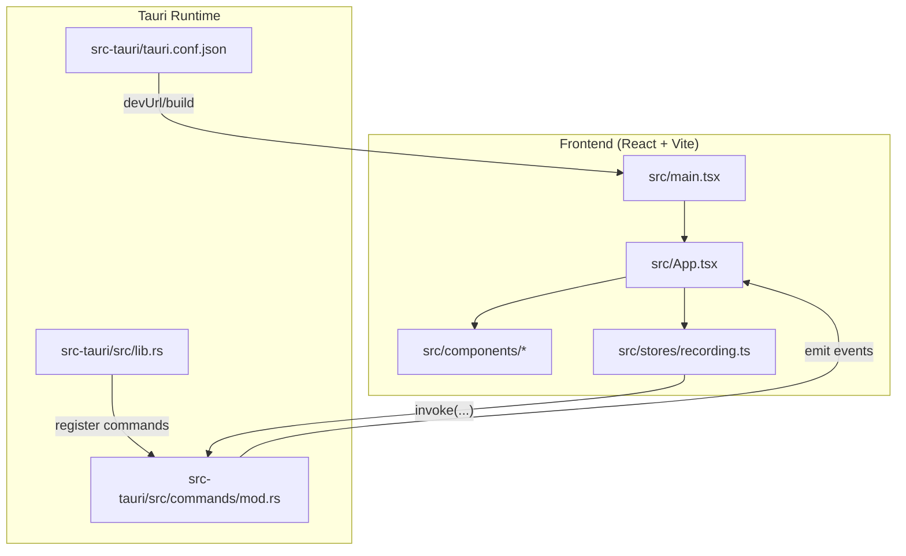
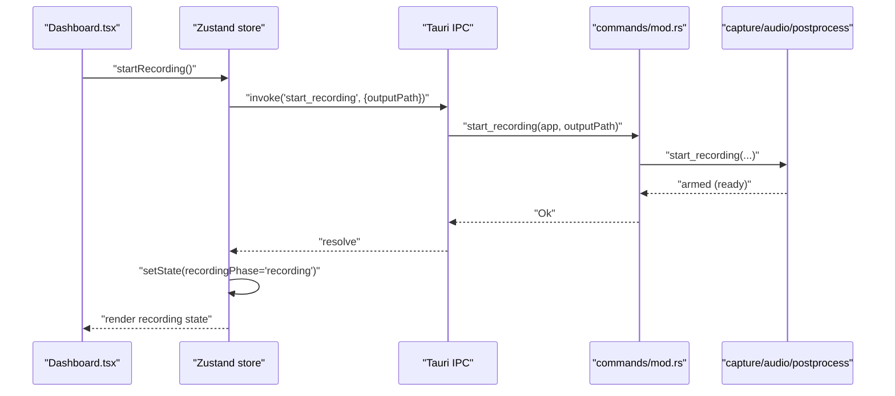
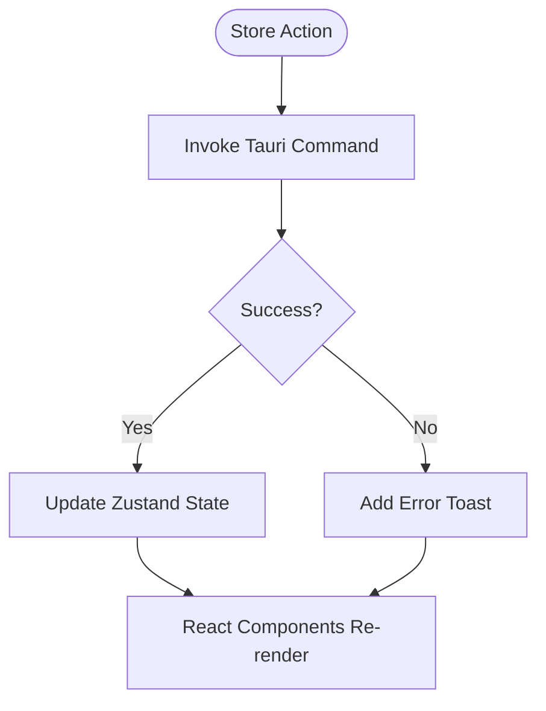
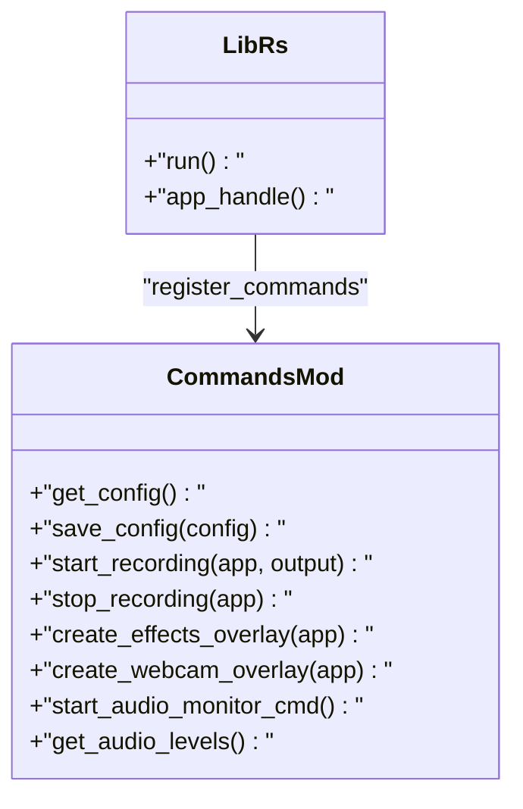
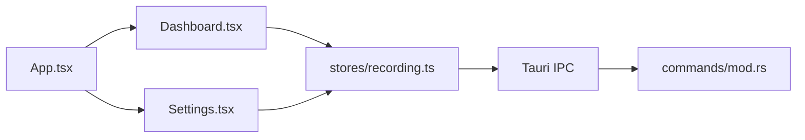
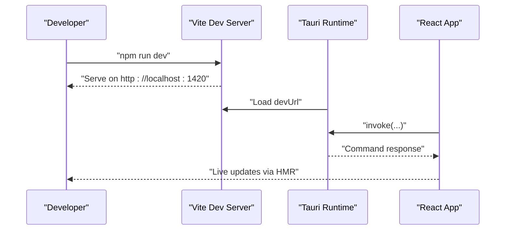
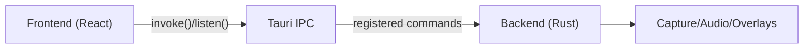

# Development Workflow

<cite>
**Referenced Files in This Document**
- [README.md](file://README.md)
- [package.json](file://package.json)
- [vite.config.ts](file://vite.config.ts)
- [src-tauri/Cargo.toml](file://src-tauri/Cargo.toml)
- [src-tauri/tauri.conf.json](file://src-tauri/tauri.conf.json)
- [src/main.tsx](file://src/main.tsx)
- [src/App.tsx](file://src/App.tsx)
- [src/stores/recording.ts](file://src/stores/recording.ts)
- [src-tauri/src/lib.rs](file://src-tauri/src/lib.rs)
- [src-tauri/src/commands/mod.rs](file://src-tauri/src/commands/mod.rs)
- [src/components/Dashboard.tsx](file://src/components/Dashboard.tsx)
- [src/components/Settings.tsx](file://src/components/Settings.tsx)
- [tests/test_autozoom.py](file://tests/test_autozoom.py)
</cite>

## Table of Contents
1. [Introduction](#introduction)
2. [Project Structure](#project-structure)
3. [Core Components](#core-components)
4. [Architecture Overview](#architecture-overview)
5. [Detailed Component Analysis](#detailed-component-analysis)
6. [Dependency Analysis](#dependency-analysis)
7. [Performance Considerations](#performance-considerations)
8. [Troubleshooting Guide](#troubleshooting-guide)
9. [Conclusion](#conclusion)
10. [Appendices](#appendices)

## Introduction
This document describes the development workflow for EasySpecy contributors. It explains how the frontend and backend integrate via Tauri’s command system, how state is managed with Zustand, and how the UI components are organized. It also covers development server setup, hot reload, debugging, Git workflows, testing, and contribution practices.

## Project Structure
EasySpecy is a Tauri 2 application with a React + TypeScript frontend and a Rust backend. The frontend is served by Vite and embedded in the Tauri window. The backend exposes IPC commands for configuration, capture, overlays, audio monitoring, and recording control.

**Diagram sources**
- [src/main.tsx:1-15](file://src/main.tsx#L1-L15)
- [src/App.tsx:1-208](file://src/App.tsx#L1-L208)
- [src/stores/recording.ts:1-405](file://src/stores/recording.ts#L1-L405)
- [src-tauri/src/lib.rs:37-136](file://src-tauri/src/lib.rs#L37-L136)
- [src-tauri/src/commands/mod.rs:1-723](file://src-tauri/src/commands/mod.rs#L1-L723)
- [src-tauri/tauri.conf.json:6-11](file://src-tauri/tauri.conf.json#L6-L11)

**Section sources**
- [README.md:17-25](file://README.md#L17-L25)
- [package.json:6-11](file://package.json#L6-L11)
- [vite.config.ts:9-35](file://vite.config.ts#L9-L35)
- [src-tauri/tauri.conf.json:6-11](file://src-tauri/tauri.conf.json#L6-L11)

## Core Components
- Frontend entry initializes theme and renders the root App.
- App orchestrates pages, listens to backend events, manages audio monitoring, and toggles theme.
- Zustand store encapsulates configuration, recording state, history, audio levels, and hotkeys.
- Backend registers IPC commands and emits events to the frontend.
- Commands implement capture lifecycle, overlays, audio monitoring, and system integrations.

**Section sources**
- [src/main.tsx:1-15](file://src/main.tsx#L1-L15)
- [src/App.tsx:17-86](file://src/App.tsx#L17-L86)
- [src/stores/recording.ts:177-404](file://src/stores/recording.ts#L177-L404)
- [src-tauri/src/lib.rs:85-127](file://src-tauri/src/lib.rs#L85-L127)
- [src-tauri/src/commands/mod.rs:11-133](file://src-tauri/src/commands/mod.rs#L11-L133)

## Architecture Overview
The frontend and backend communicate via Tauri’s IPC. The frontend invokes commands to start/stop recording, manage overlays, and fetch system info. The backend performs capture, encoding, and emits events to inform the UI of state changes.

**Diagram sources**
- [src/components/Dashboard.tsx:218-428](file://src/components/Dashboard.tsx#L218-L428)
- [src/stores/recording.ts:284-307](file://src/stores/recording.ts#L284-L307)
- [src-tauri/src/commands/mod.rs:252-344](file://src-tauri/src/commands/mod.rs#L252-L344)

## Detailed Component Analysis

### Frontend State Management with Zustand
- Store defines typed state and actions for configuration, recording lifecycle, history, audio levels, toasts, and hotkeys.
- Actions invoke Tauri commands and update state accordingly.
- Global audio monitoring is started/stopped and polled periodically.

**Diagram sources**
- [src/stores/recording.ts:177-404](file://src/stores/recording.ts#L177-L404)

**Section sources**
- [src/stores/recording.ts:132-175](file://src/stores/recording.ts#L132-L175)
- [src/stores/recording.ts:211-235](file://src/stores/recording.ts#L211-L235)
- [src/stores/recording.ts:383-403](file://src/stores/recording.ts#L383-L403)

### Tauri Command System
- The backend registers commands and exposes them to the frontend.
- Commands implement capture lifecycle, overlays, audio monitoring, and system integrations.
- Events are emitted to the frontend for UI updates.

**Diagram sources**
- [src-tauri/src/lib.rs:85-127](file://src-tauri/src/lib.rs#L85-L127)
- [src-tauri/src/commands/mod.rs:11-723](file://src-tauri/src/commands/mod.rs#L11-L723)

**Section sources**
- [src-tauri/src/lib.rs:85-127](file://src-tauri/src/lib.rs#L85-L127)
- [src-tauri/src/commands/mod.rs:11-133](file://src-tauri/src/commands/mod.rs#L11-L133)

### Component Architecture
- App sets up theme, listens to backend events, and renders pages.
- Dashboard displays controls, timers, encoding progress, and recent recordings.
- Settings manages configuration, audio monitoring, and live previews.

**Diagram sources**
- [src/App.tsx:17-189](file://src/App.tsx#L17-L189)
- [src/components/Dashboard.tsx:218-586](file://src/components/Dashboard.tsx#L218-L586)
- [src/components/Settings.tsx:40-800](file://src/components/Settings.tsx#L40-L800)
- [src/stores/recording.ts:177-404](file://src/stores/recording.ts#L177-L404)
- [src-tauri/src/commands/mod.rs:11-723](file://src-tauri/src/commands/mod.rs#L11-L723)

**Section sources**
- [src/App.tsx:17-189](file://src/App.tsx#L17-L189)
- [src/components/Dashboard.tsx:218-586](file://src/components/Dashboard.tsx#L218-L586)
- [src/components/Settings.tsx:40-800](file://src/components/Settings.tsx#L40-L800)

### Development Server Setup and Hot Reload
- Vite serves the React app on port 1420 with HMR enabled when TAURI_DEV_HOST is set.
- Tauri loads devUrl from the Vite server.
- The frontend listens to Tauri events and invokes commands to control recording.

**Diagram sources**
- [vite.config.ts:9-35](file://vite.config.ts#L9-L35)
- [src-tauri/tauri.conf.json:6-11](file://src-tauri/tauri.conf.json#L6-L11)
- [src/App.tsx:30-60](file://src/App.tsx#L30-L60)

**Section sources**
- [vite.config.ts:9-35](file://vite.config.ts#L9-L35)
- [src-tauri/tauri.conf.json:6-11](file://src-tauri/tauri.conf.json#L6-L11)
- [src/App.tsx:30-60](file://src/App.tsx#L30-L60)

### Debugging Workflows
- Use tracing logs written to both stderr and a log file next to the executable.
- Audio monitoring can be started/stopped via commands; levels are polled periodically.
- Frontend shows notifications and toasts for user feedback.

**Section sources**
- [src-tauri/src/lib.rs:49-81](file://src-tauri/src/lib.rs#L49-L81)
- [src/stores/recording.ts:383-403](file://src/stores/recording.ts#L383-L403)
- [src/App.tsx:34-59](file://src/App.tsx#L34-L59)

### Testing Methodologies
- Automated verification of auto-zoom detection is implemented in Python, generating synthetic metadata and validating zoom regions.
- The script saves metadata and zoom timelines for inspection and regression testing.

**Section sources**
- [tests/test_autozoom.py:1-482](file://tests/test_autozoom.py#L1-L482)

## Dependency Analysis
- Frontend depends on Tauri APIs for IPC and global shortcuts.
- Backend depends on platform capture libraries and audio frameworks.
- Commands expose a clean contract between UI and system-level capture.

**Diagram sources**
- [src/stores/recording.ts:1-4](file://src/stores/recording.ts#L1-L4)
- [src-tauri/src/lib.rs:85-127](file://src-tauri/src/lib.rs#L85-L127)
- [src-tauri/Cargo.toml:26-61](file://src-tauri/Cargo.toml#L26-L61)

**Section sources**
- [src/stores/recording.ts:1-4](file://src/stores/recording.ts#L1-L4)
- [src-tauri/src/lib.rs:85-127](file://src-tauri/src/lib.rs#L85-L127)
- [src-tauri/Cargo.toml:26-61](file://src-tauri/Cargo.toml#L26-L61)

## Performance Considerations
- Audio monitoring uses non-blocking polling to avoid UI stalls.
- Encoding progress is polled asynchronously to keep the UI responsive.
- Overlays are created once and reused to minimize overhead.

[No sources needed since this section provides general guidance]

## Troubleshooting Guide
- If recording does not start, verify capture readiness and timeouts in the backend command.
- If webcam overlay fails, check device permissions and overlay creation logic.
- If hotkeys do not work, ensure they are registered/unregistered on config changes.

**Section sources**
- [src-tauri/src/commands/mod.rs:308-324](file://src-tauri/src/commands/mod.rs#L308-L324)
- [src-tauri/src/commands/mod.rs:602-693](file://src-tauri/src/commands/mod.rs#L602-L693)
- [src/stores/recording.ts:237-262](file://src/stores/recording.ts#L237-L262)

## Conclusion
EasySpecy’s development workflow centers on a clean separation between a React frontend and a Rust backend, connected via Tauri IPC. Zustand manages application state, while Tauri commands orchestrate capture, overlays, and system integrations. The Vite dev server enables rapid iteration with hot reload, and the testing suite validates critical post-processing features.

[No sources needed since this section summarizes without analyzing specific files]

## Appendices

### Development Environment Setup
- Install prerequisites: Rust, Node.js, platform build tools.
- Clone repository, install dependencies, and run the development server.

**Section sources**
- [README.md:35-48](file://README.md#L35-L48)

### Git Workflow and Contribution Guidelines
- Branching: feature branches from main; keep commits focused.
- Pull Requests: small diffs, clear descriptions, and passing checks.
- Code Review: ensure backend command contracts and frontend state updates are consistent.

[No sources needed since this section provides general guidance]