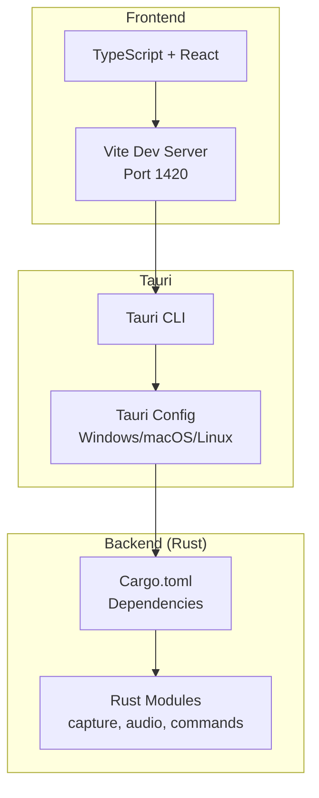
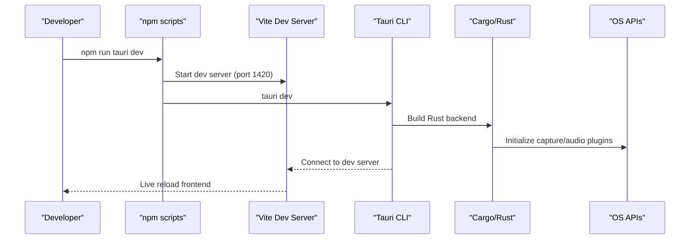
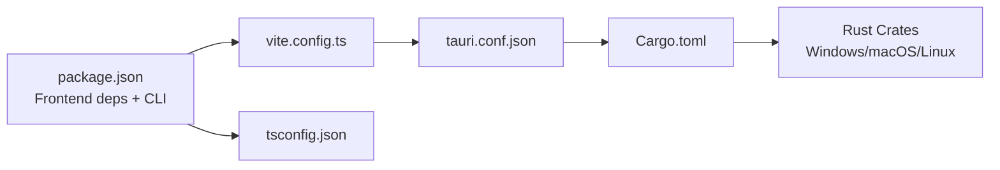

# Environment Setup

<cite>
**Referenced Files in This Document**
- [README.md](file://README.md)
- [package.json](file://package.json)
- [vite.config.ts](file://vite.config.ts)
- [tsconfig.json](file://tsconfig.json)
- [tsconfig.node.json](file://tsconfig.node.json)
- [src-tauri/Cargo.toml](file://src-tauri/Cargo.toml)
- [src-tauri/tauri.conf.json](file://src-tauri/tauri.conf.json)
</cite>

## Table of Contents
1. [Introduction](#introduction)
2. [Project Structure](#project-structure)
3. [Core Components](#core-components)
4. [Architecture Overview](#architecture-overview)
5. [Detailed Component Analysis](#detailed-component-analysis)
6. [Dependency Analysis](#dependency-analysis)
7. [Performance Considerations](#performance-considerations)
8. [Troubleshooting Guide](#troubleshooting-guide)
9. [Conclusion](#conclusion)
10. [Appendices](#appendices)

## Introduction
This document provides a complete environment setup guide for EasySpecy development. It covers prerequisites, platform-specific build dependencies, Tauri requirements, IDE recommendations, environment variables, PATH configuration, and development certificates for code signing. The goal is to help developers quickly configure a working environment for building and running EasySpecy locally.

## Project Structure
EasySpecy is a cross-platform desktop application built with Tauri 2, Rust backend, and React + TypeScript frontend. The repository is organized into:
- Frontend: React + TypeScript with Vite for development and bundling
- Backend: Rust crate with Tauri integration
- Tauri configuration: Application metadata, bundling, and security policies
- Platform-specific dependencies: OS APIs for capture and encoding

**Diagram sources**
- [vite.config.ts:1-36](file://vite.config.ts#L1-L36)
- [src-tauri/tauri.conf.json:1-48](file://src-tauri/tauri.conf.json#L1-L48)
- [src-tauri/Cargo.toml:1-61](file://src-tauri/Cargo.toml#L1-L61)

**Section sources**
- [README.md:17-25](file://README.md#L17-L25)
- [vite.config.ts:1-36](file://vite.config.ts#L1-L36)
- [src-tauri/tauri.conf.json:1-48](file://src-tauri/tauri.conf.json#L1-L48)
- [src-tauri/Cargo.toml:1-61](file://src-tauri/Cargo.toml#L1-L61)

## Core Components
- Rust toolchain (stable channel) for the Tauri backend and native integrations
- Node.js 18+ for the frontend toolchain and Tauri CLI
- Platform-specific build dependencies for Windows, macOS, and Linux
- Tauri prerequisites for bundling and runtime
- Optional IDE setup and debugging configuration

Prerequisites summary:
- Rust (stable channel)
- Node.js 18+
- Platform build tools:
  - Windows: MSVC Build Tools
  - macOS: Xcode command line tools
  - Linux: build-essential
- Tauri CLI globally available

Verification steps:
- Confirm Rust and Node.js versions
- Verify Tauri CLI availability
- Run development and build commands

**Section sources**
- [README.md:38-48](file://README.md#L38-L48)
- [package.json:1-36](file://package.json#L1-L36)

## Architecture Overview
The development workflow connects the frontend Vite server with the Tauri CLI and Rust backend. The Tauri configuration defines the app window, security policy, and bundling targets. Platform-specific Rust crates integrate with OS APIs for capture and encoding.

**Diagram sources**
- [README.md:35-48](file://README.md#L35-L48)
- [vite.config.ts:1-36](file://vite.config.ts#L1-L36)
- [src-tauri/tauri.conf.json:6-11](file://src-tauri/tauri.conf.json#L6-L11)

**Section sources**
- [README.md:35-48](file://README.md#L35-L48)
- [vite.config.ts:1-36](file://vite.config.ts#L1-L36)
- [src-tauri/tauri.conf.json:6-11](file://src-tauri/tauri.conf.json#L6-L11)

## Detailed Component Analysis

### Prerequisites and Platform Dependencies
- Rust (stable channel): Required for building the Tauri backend and native crates
- Node.js 18+: Required for frontend toolchain and Tauri CLI
- Platform build tools:
  - Windows: MSVC Build Tools for native compilation
  - macOS: Xcode command line tools for code signing and linking
  - Linux: build-essential for system libraries and native builds
- Tauri CLI: Available globally for development and production builds

Verification checklist:
- rustc --version
- cargo --version
- node --version
- npm --version
- tauri --version

**Section sources**
- [README.md:38-41](file://README.md#L38-L41)
- [package.json:1-36](file://package.json#L1-L36)

### Tauri Prerequisites
- Tauri CLI must be installed globally
- Tauri configuration defines:
  - Product name, version, and identifier
  - Dev server URL and port
  - Window configuration and security policy
  - Bundle targets and icons

Key configuration points:
- Dev URL and port: http://localhost:1420
- Security: CSP disabled for development
- Bundle targets: nsis (Windows installer)

**Section sources**
- [src-tauri/tauri.conf.json:1-48](file://src-tauri/tauri.conf.json#L1-L48)

### IDE Setup Recommendations
Recommended IDE and extensions:
- Visual Studio Code
  - Extensions:
    - ESLint
    - Prettier
    - Tailwind CSS IntelliSense
    - Rust (rls or rust-analyzer)
    - Tauri
  - Debugging:
    - Launch configuration for Tauri dev
    - Attach to Vite dev server if needed

Notes:
- Use the project’s TypeScript configuration for linting and formatting
- Enable strict TypeScript checks per project settings

**Section sources**
- [tsconfig.json:1-26](file://tsconfig.json#L1-L26)
- [tsconfig.node.json:1-11](file://tsconfig.node.json#L1-L11)

### Environment Variables and PATH Configuration
- Host override for Tauri dev:
  - TAURI_DEV_HOST can be set to enable remote dev host access
  - Vite server binds to host when TAURI_DEV_HOST is set
- PATH:
  - Ensure Rust and Node.js are on PATH
  - Ensure Tauri CLI is available globally

Typical environment variables:
- TAURI_DEV_HOST (optional)

**Section sources**
- [vite.config.ts:5-35](file://vite.config.ts#L5-L35)

### Development Certificates and Code Signing
- macOS code signing:
  - Xcode command line tools required
  - Configure development team and signing identity in Xcode project
  - Tauri CLI can manage signing profiles by default
- Windows code signing:
  - Configure certificate and publisher settings in build scripts
  - Use appropriate signing tools and certificates
- Linux:
  - No code signing required for local development
  - Packaging may require distribution-specific signing

References:
- Tauri CLI changelog entries related to Xcode signing and provisioning profiles

**Section sources**
- [src-tauri/tauri.conf.json:24-26](file://src-tauri/tauri.conf.json#L24-L26)

### Step-by-Step Installation and Verification
1. Install prerequisites
   - Install Rust (stable)
   - Install Node.js 18+
   - Install platform build tools:
     - Windows: MSVC Build Tools
     - macOS: Xcode command line tools
     - Linux: build-essential
2. Install Tauri CLI globally
3. Clone repository and install frontend dependencies
4. Start development
   - npm run tauri dev
   - Vite dev server runs on port 1420
5. Build for production
   - npm run tauri build

Verification:
- Confirm Rust and Node.js versions
- Confirm Tauri CLI availability
- Open browser to http://localhost:1420
- Observe live reload behavior

**Section sources**
- [README.md:35-48](file://README.md#L35-L48)
- [vite.config.ts:20-35](file://vite.config.ts#L20-L35)

### Common Setup Issues and Solutions
- Missing platform build tools
  - Windows: Install MSVC Build Tools
  - macOS: Install Xcode command line tools
  - Linux: Install build-essential
- Node.js version mismatch
  - Use Node.js 18+ as specified
- Tauri CLI not found
  - Install globally or use npx
- Port conflicts
  - Vite dev server uses port 1420; change if in use
- macOS code signing failures
  - Ensure Xcode command line tools are installed
  - Configure development team and signing identity

**Section sources**
- [README.md:38-41](file://README.md#L38-L41)
- [vite.config.ts:20-35](file://vite.config.ts#L20-L35)

## Dependency Analysis
The project’s dependencies span frontend, backend, and Tauri configuration. The frontend uses React, TypeScript, and Vite. The backend uses Tauri and platform-specific crates. Tauri configuration ties everything together.

**Diagram sources**
- [package.json:1-36](file://package.json#L1-L36)
- [vite.config.ts:1-36](file://vite.config.ts#L1-L36)
- [tsconfig.json:1-26](file://tsconfig.json#L1-L26)
- [src-tauri/tauri.conf.json:1-48](file://src-tauri/tauri.conf.json#L1-L48)
- [src-tauri/Cargo.toml:1-61](file://src-tauri/Cargo.toml#L1-L61)

**Section sources**
- [package.json:1-36](file://package.json#L1-L36)
- [src-tauri/Cargo.toml:1-61](file://src-tauri/Cargo.toml#L1-L61)
- [src-tauri/tauri.conf.json:1-48](file://src-tauri/tauri.conf.json#L1-L48)

## Performance Considerations
- Keep Rust and Node.js versions aligned with project requirements
- Use Vite’s esnext target for modern JS features
- Minimize unnecessary native dependencies to reduce build times
- Use release builds for performance profiling

[No sources needed since this section provides general guidance]

## Troubleshooting Guide
- Rust toolchain issues
  - Use rustup to manage stable channel
  - Update toolchain regularly
- Node.js/npm issues
  - Clear node_modules and reinstall dependencies
  - Use a Node.js version manager if needed
- Tauri build failures
  - Ensure platform build tools are installed
  - Check Tauri CLI version compatibility
- Vite dev server problems
  - Change port if 1420 is in use
  - Disable host override if not needed

**Section sources**
- [README.md:38-48](file://README.md#L38-L48)
- [vite.config.ts:20-35](file://vite.config.ts#L20-L35)

## Conclusion
With the correct Rust and Node.js versions, platform-specific build tools, and Tauri CLI installed, you can develop and build EasySpecy locally. Use the provided verification steps and troubleshooting tips to resolve common setup issues. For production builds, configure platform-specific code signing as needed.

[No sources needed since this section summarizes without analyzing specific files]

## Appendices

### Appendix A: Quick Reference
- Rust: stable channel
- Node.js: 18+
- Windows: MSVC Build Tools
- macOS: Xcode command line tools
- Linux: build-essential
- Tauri CLI: globally available
- Dev server: http://localhost:1420

**Section sources**
- [README.md:38-41](file://README.md#L38-L41)
- [vite.config.ts:20-35](file://vite.config.ts#L20-L35)