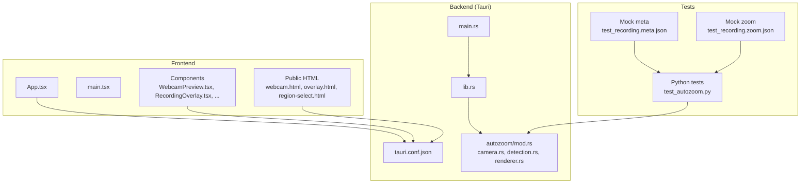
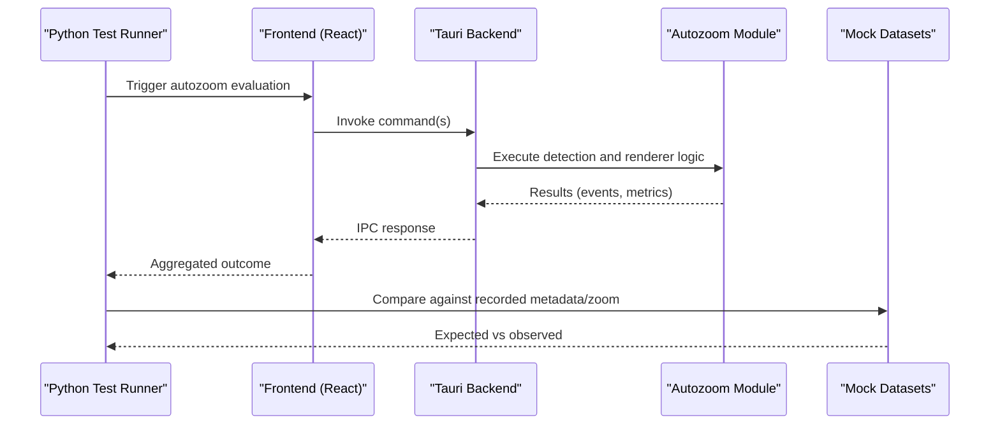
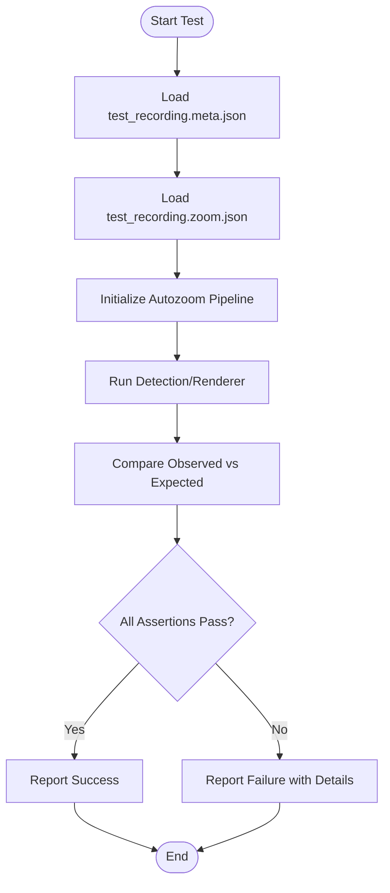
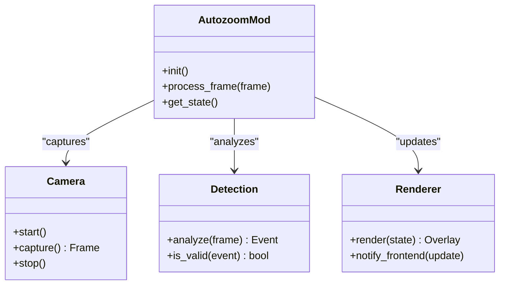
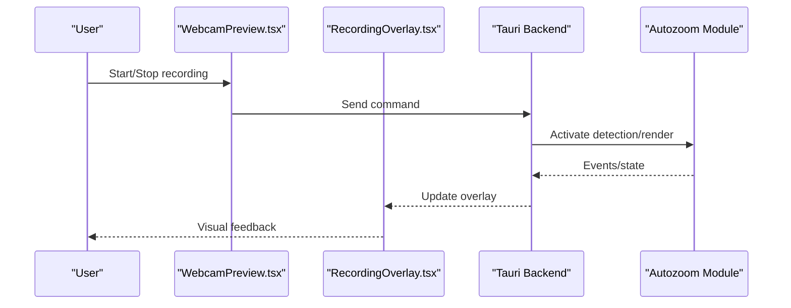
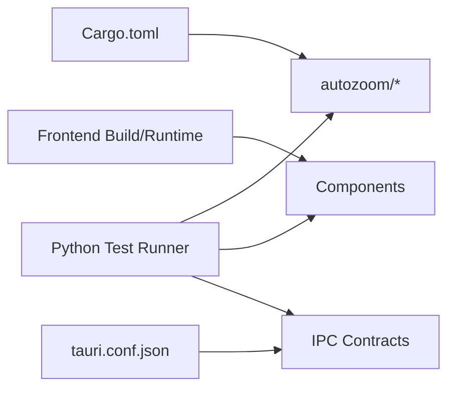

# Testing & Debugging

<cite>
**Referenced Files in This Document**
- [README.md](file://README.md)
- [test_autozoom.py](file://tests/test_autozoom.py)
- [test_recording.meta.json](file://tests/test_recording.meta.json)
- [test_recording.zoom.json](file://tests/test_recording.zoom.json)
- [Cargo.toml](file://src-tauri/Cargo.toml)
- [main.rs](file://src-tauri/src/main.rs)
- [lib.rs](file://src-tauri/src/lib.rs)
- [mod.rs](file://src-tauri/src/autozoom/mod.rs)
- [camera.rs](file://src-tauri/src/autozoom/camera.rs)
- [detection.rs](file://src-tauri/src/autozoom/detection.rs)
- [renderer.rs](file://src-tauri/src/autozoom/renderer.rs)
- [tauri.conf.json](file://src-tauri/tauri.conf.json)
- [index.html](file://index.html)
- [webcam.html](file://public/webcam.html)
- [overlay.html](file://public/overlay.html)
- [region-select.html](file://public/region-select.html)
- [region-select.html](file://src-tauri/region-select.html)
- [App.tsx](file://src/App.tsx)
- [main.tsx](file://src/main.tsx)
- [WebcamPreview.tsx](file://src/components/WebcamPreview.tsx)
- [RecordingOverlay.tsx](file://src/components/RecordingOverlay.tsx)
- [ContextMenu.tsx](file://src/components/ContextMenu.tsx)
- [Dashboard.tsx](file://src/components/Dashboard.tsx)
- [Settings.tsx](file://src/components/Settings.tsx)
- [StatusBar.tsx](file://src/components/StatusBar.tsx)
- [Toast.tsx](file://src/components/Toast.tsx)
- [.gitignore](file://.gitignore)
</cite>

## Table of Contents
1. [Introduction](#introduction)
2. [Project Structure](#project-structure)
3. [Core Components](#core-components)
4. [Architecture Overview](#architecture-overview)
5. [Detailed Component Analysis](#detailed-component-analysis)
6. [Dependency Analysis](#dependency-analysis)
7. [Performance Considerations](#performance-considerations)
8. [Troubleshooting Guide](#troubleshooting-guide)
9. [Conclusion](#conclusion)
10. [Appendices](#appendices)

## Introduction
This document provides comprehensive testing and debugging guidance for EasySpecy development. It covers:
- The existing Python-based testing suite for autozoom functionality
- Unit testing approaches for Rust modules under Tauri
- Integration testing strategies across frontend, backend, and native components
- Debugging techniques for frontend (browser devtools), Rust backend (LLDB/GDB), and Tauri-specific diagnostics
- Performance profiling, memory leak detection, and platform-specific considerations
- Test case creation guidelines, mock data setup, and automated testing integration
- Common debugging scenarios, error handling patterns, and diagnostic tools

## Project Structure
EasySpecy is a Tauri desktop application with a TypeScript/React frontend and a Rust backend. The testing and debugging landscape spans:
- Python tests for autozoom logic
- Rust unit/integration tests under src-tauri
- Frontend React components and HTML overlays
- Tauri configuration and capabilities

**Diagram sources**
- [App.tsx](file://src/App.tsx)
- [main.tsx](file://src/main.tsx)
- [WebcamPreview.tsx](file://src/components/WebcamPreview.tsx)
- [RecordingOverlay.tsx](file://src/components/RecordingOverlay.tsx)
- [tauri.conf.json](file://src-tauri/tauri.conf.json)
- [lib.rs](file://src-tauri/src/lib.rs)
- [mod.rs](file://src-tauri/src/autozoom/mod.rs)
- [camera.rs](file://src-tauri/src/autozoom/camera.rs)
- [detection.rs](file://src-tauri/src/autozoom/detection.rs)
- [renderer.rs](file://src-tauri/src/autozoom/renderer.rs)
- [main.rs](file://src-tauri/src/main.rs)
- [test_autozoom.py](file://tests/test_autozoom.py)
- [test_recording.meta.json](file://tests/test_recording.meta.json)
- [test_recording.zoom.json](file://tests/test_recording.zoom.json)

**Section sources**
- [README.md](file://README.md)
- [index.html](file://index.html)
- [webcam.html](file://public/webcam.html)
- [overlay.html](file://public/overlay.html)
- [region-select.html](file://public/region-select.html)
- [region-select.html](file://src-tauri/region-select.html)

## Core Components
- Autozoom module: Camera capture, detection heuristics, and renderer pipeline
- Frontend components: Webcam preview, recording overlay, context menu, dashboard, settings, status bar, and toast notifications
- Tauri configuration: Capabilities, schema generation, and runtime permissions
- Python tests: Automated evaluation of autozoom logic against recorded metadata and zoom sequences
- Mock datasets: JSON fixtures representing recording metadata and zoom events

Key responsibilities:
- Autozoom Rust modules handle camera input, detection logic, and rendering updates
- Frontend components orchestrate user interactions and render overlays
- Tauri configuration governs capability boundaries and IPC behavior
- Python tests validate autozoom behavior against controlled datasets

**Section sources**
- [mod.rs](file://src-tauri/src/autozoom/mod.rs)
- [camera.rs](file://src-tauri/src/autozoom/camera.rs)
- [detection.rs](file://src-tauri/src/autozoom/detection.rs)
- [renderer.rs](file://src-tauri/src/autozoom/renderer.rs)
- [WebcamPreview.tsx](file://src/components/WebcamPreview.tsx)
- [RecordingOverlay.tsx](file://src/components/RecordingOverlay.tsx)
- [ContextMenu.tsx](file://src/components/ContextMenu.tsx)
- [Dashboard.tsx](file://src/components/Dashboard.tsx)
- [Settings.tsx](file://src/components/Settings.tsx)
- [StatusBar.tsx](file://src/components/StatusBar.tsx)
- [Toast.tsx](file://src/components/Toast.tsx)
- [tauri.conf.json](file://src-tauri/tauri.conf.json)
- [test_autozoom.py](file://tests/test_autozoom.py)
- [test_recording.meta.json](file://tests/test_recording.meta.json)
- [test_recording.zoom.json](file://tests/test_recording.zoom.json)

## Architecture Overview
The testing and debugging architecture integrates:
- Python-based autozoom tests invoking Rust logic via Tauri commands
- Frontend components interacting with Tauri backend for camera and overlay operations
- Tauri configuration enabling capabilities and schema validation
- Mock datasets validating detection and zoom sequences

**Diagram sources**
- [test_autozoom.py](file://tests/test_autozoom.py)
- [lib.rs](file://src-tauri/src/lib.rs)
- [mod.rs](file://src-tauri/src/autozoom/mod.rs)
- [test_recording.meta.json](file://tests/test_recording.meta.json)
- [test_recording.zoom.json](file://tests/test_recording.zoom.json)

## Detailed Component Analysis

### Python Autozoom Tests
Purpose:
- Validate autozoom detection and renderer behavior against recorded datasets
- Ensure deterministic outcomes for metadata and zoom sequences

Execution model:
- Load mock metadata and zoom JSON fixtures
- Drive autozoom logic through Tauri commands
- Assert expected outcomes and transitions

Best practices:
- Keep fixtures minimal and focused
- Add assertions for event ordering and state transitions
- Isolate camera-dependent steps behind mocks

**Diagram sources**
- [test_autozoom.py](file://tests/test_autozoom.py)
- [test_recording.meta.json](file://tests/test_recording.meta.json)
- [test_recording.zoom.json](file://tests/test_recording.zoom.json)

**Section sources**
- [test_autozoom.py](file://tests/test_autozoom.py)
- [test_recording.meta.json](file://tests/test_recording.meta.json)
- [test_recording.zoom.json](file://tests/test_recording.zoom.json)

### Rust Autozoom Modules
Module responsibilities:
- Camera: Capture frames and prepare inputs for detection
- Detection: Apply heuristics to identify regions of interest and zoom targets
- Renderer: Update overlays and communicate state changes to the frontend

Unit testing approach:
- Split logic into pure functions and IO-bound modules
- Mock camera inputs and inject synthetic frames
- Use property-based checks for detection invariants
- Verify renderer updates through controlled state transitions

**Diagram sources**
- [mod.rs](file://src-tauri/src/autozoom/mod.rs)
- [camera.rs](file://src-tauri/src/autozoom/camera.rs)
- [detection.rs](file://src-tauri/src/autozoom/detection.rs)
- [renderer.rs](file://src-tauri/src/autozoom/renderer.rs)

**Section sources**
- [mod.rs](file://src-tauri/src/autozoom/mod.rs)
- [camera.rs](file://src-tauri/src/autozoom/camera.rs)
- [detection.rs](file://src-tauri/src/autozoom/detection.rs)
- [renderer.rs](file://src-tauri/src/autozoom/renderer.rs)

### Frontend Components and Overlays
Key components:
- WebcamPreview: Renders live camera feed and handles user interactions
- RecordingOverlay: Manages overlay visibility and user feedback
- ContextMenu, Dashboard, Settings, StatusBar, Toast: Support UI workflows and diagnostics

Integration testing strategies:
- Simulate user actions (clicks, keyboard shortcuts) and assert overlay state
- Mock Tauri command responses to validate UI transitions
- Use headless browser environments for automated UI tests

**Diagram sources**
- [WebcamPreview.tsx](file://src/components/WebcamPreview.tsx)
- [RecordingOverlay.tsx](file://src/components/RecordingOverlay.tsx)
- [lib.rs](file://src-tauri/src/lib.rs)
- [mod.rs](file://src-tauri/src/autozoom/mod.rs)

**Section sources**
- [WebcamPreview.tsx](file://src/components/WebcamPreview.tsx)
- [RecordingOverlay.tsx](file://src/components/RecordingOverlay.tsx)
- [ContextMenu.tsx](file://src/components/ContextMenu.tsx)
- [Dashboard.tsx](file://src/components/Dashboard.tsx)
- [Settings.tsx](file://src/components/Settings.tsx)
- [StatusBar.tsx](file://src/components/StatusBar.tsx)
- [Toast.tsx](file://src/components/Toast.tsx)

### Tauri Configuration and Capabilities
- Capabilities define allowed IPC operations and resource access
- Schemas generated for desktop and window contexts
- Runtime configuration influences overlay behavior and permissions

Debugging tips:
- Validate capability grants for camera and overlay resources
- Inspect schema files to confirm IPC contract compliance
- Enable verbose logs during development builds

**Section sources**
- [tauri.conf.json](file://src-tauri/tauri.conf.json)
- [lib.rs](file://src-tauri/src/lib.rs)

## Dependency Analysis
Testing and debugging depend on:
- Cargo configuration for Rust modules
- Frontend build and runtime environment
- Tauri capabilities and IPC contracts
- Python test runner and fixtures

**Diagram sources**
- [Cargo.toml](file://src-tauri/Cargo.toml)
- [mod.rs](file://src-tauri/src/autozoom/mod.rs)
- [lib.rs](file://src-tauri/src/lib.rs)
- [tauri.conf.json](file://src-tauri/tauri.conf.json)
- [test_autozoom.py](file://tests/test_autozoom.py)

**Section sources**
- [Cargo.toml](file://src-tauri/Cargo.toml)
- [lib.rs](file://src-tauri/src/lib.rs)
- [tauri.conf.json](file://src-tauri/tauri.conf.json)

## Performance Considerations
- Profile CPU and GPU usage during autozoom detection and rendering
- Monitor memory growth during long recording sessions
- Optimize frame rates and detection intervals to balance responsiveness and resource usage
- Use platform-specific profilers (Windows Performance Analyzer, macOS Instruments) for deeper insights

[No sources needed since this section provides general guidance]

## Troubleshooting Guide

### Frontend Debugging
- Browser Developer Tools
  - Inspect overlay rendering and DOM updates
  - Monitor network requests for IPC messages
  - Use performance panel to detect layout thrashing or excessive re-renders
- Headless UI Testing
  - Automate user interactions and assert overlay states
  - Capture screenshots on failure for visual diagnostics

**Section sources**
- [index.html](file://index.html)
- [webcam.html](file://public/webcam.html)
- [overlay.html](file://public/overlay.html)
- [region-select.html](file://public/region-select.html)
- [region-select.html](file://src-tauri/region-select.html)

### Rust Backend Debugging (LLDB/GDB)
- Build debug artifacts and attach debugger to Tauri process
- Set breakpoints in autozoom modules (camera capture, detection, renderer)
- Inspect frame buffers, detection events, and renderer state
- Use logging macros to trace IPC-driven state changes

**Section sources**
- [main.rs](file://src-tauri/src/main.rs)
- [lib.rs](file://src-tauri/src/lib.rs)
- [mod.rs](file://src-tauri/src/autozoom/mod.rs)
- [camera.rs](file://src-tauri/src/autozoom/camera.rs)
- [detection.rs](file://src-tauri/src/autozoom/detection.rs)
- [renderer.rs](file://src-tauri/src/autozoom/renderer.rs)

### Tauri-Specific Diagnostics
- Enable Tauri logging and inspect capability grants
- Validate IPC commands and schema compliance
- Confirm overlay permissions and window configuration

**Section sources**
- [tauri.conf.json](file://src-tauri/tauri.conf.json)
- [lib.rs](file://src-tauri/src/lib.rs)

### Memory Leak Detection
- Use Valgrind/Memory Profiler on Linux/macOS
- On Windows, use Application Verifier and CRT debug heap
- Track allocations in Rust autozoom pipeline and frontend component lifecycles

**Section sources**
- [mod.rs](file://src-tauri/src/autozoom/mod.rs)
- [WebcamPreview.tsx](file://src/components/WebcamPreview.tsx)

### Common Scenarios and Error Handling Patterns
- Autozoom detection fails silently
  - Verify camera permissions and capability grants
  - Add explicit error propagation from Rust to frontend
- Overlay not updating
  - Check IPC responses and renderer state transitions
  - Validate overlay HTML and CSS in isolation
- Python test flakiness
  - Stabilize timing-sensitive steps with deterministic mocks
  - Normalize platform-specific differences in frame timing

**Section sources**
- [test_autozoom.py](file://tests/test_autozoom.py)
- [mod.rs](file://src-tauri/src/autozoom/mod.rs)
- [RecordingOverlay.tsx](file://src/components/RecordingOverlay.tsx)

## Conclusion
A robust testing and debugging strategy for EasySpecy combines:
- Python-based autozoom tests with controlled datasets
- Rust unit tests for autozoom modules with mocked inputs
- Frontend integration tests validating overlay behavior
- Tauri diagnostics and capability validation
- Platform-specific profiling and memory tools

Adopting these practices ensures reliable detection, responsive overlays, and maintainable code across platforms.

## Appendices

### Test Case Creation Guidelines
- Define clear acceptance criteria for detection events and overlay updates
- Use small, reproducible mock datasets
- Encapsulate setup/teardown logic for camera and overlay states
- Prefer deterministic fixtures over live hardware dependencies

**Section sources**
- [test_recording.meta.json](file://tests/test_recording.meta.json)
- [test_recording.zoom.json](file://tests/test_recording.zoom.json)
- [test_autozoom.py](file://tests/test_autozoom.py)

### Mock Data Setup
- Metadata fixture: capture recording metadata (timestamps, device info)
- Zoom fixture: encode expected zoom events and transitions
- Inject fixtures into autozoom pipeline and assert outcomes

**Section sources**
- [test_recording.meta.json](file://tests/test_recording.meta.json)
- [test_recording.zoom.json](file://tests/test_recording.zoom.json)

### Automated Testing Integration
- CI jobs should run Python tests, Rust tests, and frontend tests
- Snapshot tests for overlay rendering
- Lint and formatting checks for both Rust and TypeScript

**Section sources**
- [Cargo.toml](file://src-tauri/Cargo.toml)
- [test_autozoom.py](file://tests/test_autozoom.py)
- [.gitignore](file://.gitignore)