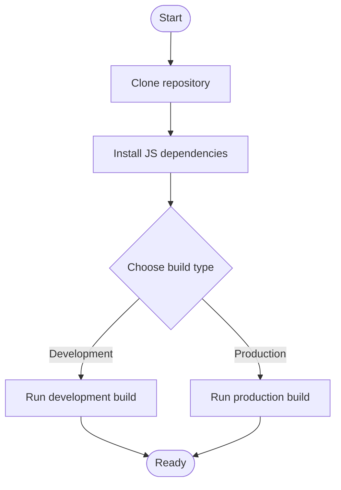
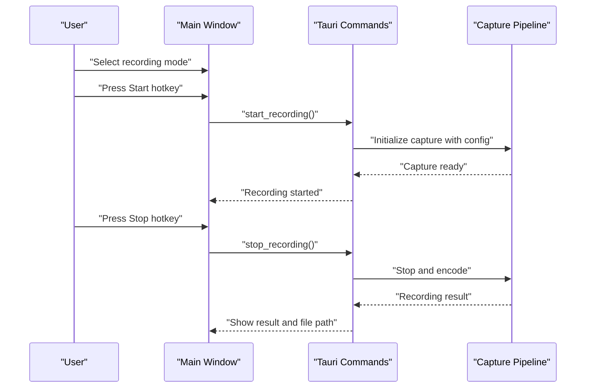

# Getting Started

<cite>
**Referenced Files in This Document**
- [README.md](file://README.md)
- [package.json](file://package.json)
- [Cargo.toml](file://src-tauri/Cargo.toml)
- [tauri.conf.json](file://src-tauri/tauri.conf.json)
- [vite.config.ts](file://vite.config.ts)
- [lib.rs](file://src-tauri/src/lib.rs)
- [main.rs](file://src-tauri/src/main.rs)
- [config/mod.rs](file://src-tauri/src/config/mod.rs)
- [keyboard.rs](file://src-tauri/src/keyboard.rs)
- [commands/mod.rs](file://src-tauri/src/commands/mod.rs)
</cite>

## Table of Contents
1. [Introduction](#introduction)
2. [Installation](#installation)
3. [Build from Source](#build-from-source)
4. [First-Time Setup](#first-time-setup)
5. [Basic Recording Workflow](#basic-recording-workflow)
6. [Hotkeys](#hotkeys)
7. [Platform-Specific Notes](#platform-specific-notes)
8. [Troubleshooting](#troubleshooting)
9. [Conclusion](#conclusion)

## Introduction
EasySpecy is a free, open-source, cross-platform screen recorder with cinematic auto-zoom and cursor effects. It supports full-screen, region, or window capture, configurable quality (480p–1080p, 24–60 fps), audio recording (mic + system audio), webcam overlay, system-wide hotkeys, and direct MP4 export upon stopping.

**Section sources**
- [README.md:1-16](file://README.md#L1-L16)

## Installation
Download prebuilt installers from the Releases page for your platform:
- Windows: MSI or EXE
- macOS: DMG
- Linux: AppImage or DEB

These packages bundle the application and its runtime dependencies for immediate use.

**Section sources**
- [README.md:26-34](file://README.md#L26-L34)

## Build from Source
Follow these steps to build EasySpecy from source:

Prerequisites
- Rust (via rustup)
- Node.js 18+
- Platform build tools:
  - Windows: MSVC Build Tools
  - macOS: Xcode
  - Linux: build-essential

Steps
1. Clone the repository
2. Install JavaScript dependencies
3. Run development build or production build

**Diagram sources**
- [README.md:35-48](file://README.md#L35-L48)
- [package.json:6-10](file://package.json#L6-L10)

**Section sources**
- [README.md:35-48](file://README.md#L35-L48)
- [package.json:1-36](file://package.json#L1-L36)
- [Cargo.toml:1-61](file://src-tauri/Cargo.toml#L1-L61)
- [tauri.conf.json:6-11](file://src-tauri/tauri.conf.json#L6-L11)
- [vite.config.ts:1-36](file://vite.config.ts#L1-L36)

## First-Time Setup
On first launch, EasySpecy creates a default configuration file and applies sensible defaults for output location, resolution, FPS, video encoder, audio settings, webcam defaults, auto-zoom, cursor effects, and hotkeys. The configuration is stored in the platform-specific config directory under an easyspecy folder.

What to adjust first
- Output directory: ensure it points to a writable location
- Recording mode: choose FullScreen, Region, or Window
- Resolution and FPS: balance quality and performance
- Audio source and sample rate: select Mic, System, or Both
- Webcam settings (optional): position, size, shape, border, opacity
- Auto-zoom and cursor effects (optional): enable and customize

Where settings are stored
- The configuration file path is derived from the user’s config directory, joined with an easyspecy subfolder.

**Section sources**
- [config/mod.rs:242-276](file://src-tauri/src/config/mod.rs#L242-L276)
- [config/mod.rs:154-240](file://src-tauri/src/config/mod.rs#L154-L240)

## Basic Recording Workflow
Record your screen with minimal setup:

1. Open EasySpecy
2. Choose recording mode (FullScreen, Region, or Window)
3. Optionally configure quality, audio, webcam, auto-zoom, and cursor effects
4. Press the Start hotkey (see Hotkeys below)
5. Perform actions; observe effects (cursor trails, optional webcam overlay, optional keyboard overlay)
6. Press Stop to finish and receive a ready-to-use MP4 file

**Diagram sources**
- [commands/mod.rs:216-311](file://src-tauri/src/commands/mod.rs#L216-L311)
- [commands/mod.rs:325-370](file://src-tauri/src/commands/mod.rs#L325-L370)

**Section sources**
- [commands/mod.rs:216-311](file://src-tauri/src/commands/mod.rs#L216-L311)
- [commands/mod.rs:325-370](file://src-tauri/src/commands/mod.rs#L325-L370)

## Hotkeys
Default system-wide hotkeys (configurable in Settings):
- Start: Ctrl+Shift+R
- Stop: Ctrl+Shift+S
- Pause: Ctrl+Shift+P

How to change them
- Open Settings
- Locate the Hotkeys section
- Modify the desired shortcut
- Save settings; new hotkeys take effect immediately

Notes
- Hotkeys are registered via the global shortcut plugin.
- On Windows, the keyboard overlay captures keypresses during recording for display.

**Section sources**
- [README.md:50-58](file://README.md#L50-L58)
- [config/mod.rs:214-216](file://src-tauri/src/config/mod.rs#L214-L216)
- [lib.rs:77-77](file://src-tauri/src/lib.rs#L77-L77)
- [keyboard.rs:14-137](file://src-tauri/src/keyboard.rs#L14-L137)

## Platform-Specific Notes
- Windows
  - Requires Microsoft Visual C++ build tools for native dependencies.
  - Keyboard overlay captures global keypresses using a low-level hook.
- macOS
  - Requires Xcode command-line tools.
  - Uses ScreenCaptureKit for screen capture.
- Linux
  - Requires build-essential and PipeWire for screen capture and audio.
  - AppImage and DEB packages are available from Releases.

**Section sources**
- [README.md:35-48](file://README.md#L35-L48)
- [Cargo.toml:52-61](file://src-tauri/Cargo.toml#L52-L61)
- [keyboard.rs:139-278](file://src-tauri/src/keyboard.rs#L139-L278)

## Troubleshooting
Common issues and resolutions
- Build fails on Windows with missing tools
  - Install MSVC Build Tools and restart your terminal.
- Build fails on Linux with missing libraries
  - Install build-essential and ensure PipeWire is available.
- Hotkeys not working
  - Verify hotkeys are not blocked by other applications.
  - Reopen Settings and re-save the hotkeys to refresh registration.
- No audio captured
  - Confirm audio source selection (Mic/System/Both) and device availability.
  - Use the built-in audio monitor to validate levels before recording.
- Webcam overlay not visible
  - Ensure webcam is enabled in Settings and a valid device is selected.
  - The webcam overlay appears once the video stream starts playing.

Logs
- Logs are written to a logs directory next to the executable in release builds. Review logs for errors during startup, capture initialization, or encoding.

**Section sources**
- [README.md:35-48](file://README.md#L35-L48)
- [lib.rs:26-35](file://src-tauri/src/lib.rs#L26-L35)
- [commands/mod.rs:530-556](file://src-tauri/src/commands/mod.rs#L530-L556)

## Conclusion
You are now ready to install EasySpecy, build from source if desired, and start recording with customizable hotkeys, effects, and overlays. Adjust settings to match your workflow, and consult the troubleshooting section if you encounter platform-specific issues.